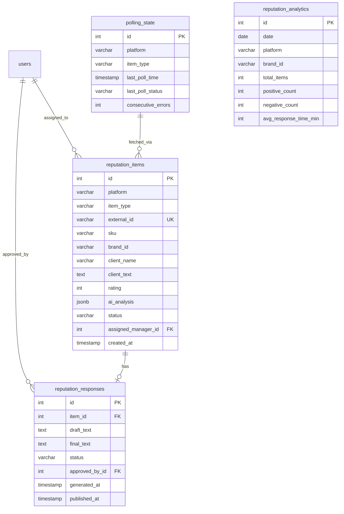

**Проект:** Интеллектуальная система управления репутацией  
**Модуль:** Reputation / Database  
**Версия:** 2.1  
**Дата:** Январь 2026

---

## 5.1 Обзор схемы

### Назначение

База данных модуля Reputation хранит:
- Отзывы и вопросы с маркетплейсов
- Сгенерированные и опубликованные ответы
- Состояние polling и статистику

### Связь с ADOLF Core

Модуль Reputation использует общую базу данных PostgreSQL с Core и расширяет её дополнительными таблицами.

| Таблица Core | Использование в Reputation |
|--------------|---------------------------|
| `users` | FK для assigned_manager_id, approved_by_id |
| `audit_log` | Логирование действий пользователей |
| `notifications` | Создание уведомлений о событиях |
| `settings` | Глобальные настройки модуля |

### ER-диаграмма модуля



### Стратегия хранения данных

| Таблица | Retention | Стратегия |
|---------|-----------|-----------|
| `reputation_items` | 12 месяцев | Архивация в `reputation_items_archive` |
| `reputation_responses` | 12 месяцев | Вместе с items |
| `polling_state` | Бессрочно | — |
| `reputation_analytics` | 24 месяца | Агрегация + очистка |

---

## 5.2 Таблица reputation_items

### Назначение

Хранение отзывов и вопросов покупателей со всех маркетплейсов.

### DDL

```sql
CREATE TABLE reputation_items (
    -- Первичный ключ
    id SERIAL PRIMARY KEY,
    
    -- Идентификация источника
    platform VARCHAR(20) NOT NULL 
        CHECK (platform IN ('wb', 'ozon', 'ym')),
    item_type VARCHAR(20) NOT NULL 
        CHECK (item_type IN ('review', 'question')),
    external_id VARCHAR(100) NOT NULL,
    
    -- Товар
    sku VARCHAR(50) NOT NULL,
    brand_id VARCHAR(50) NOT NULL 
        CHECK (brand_id IN ('ohana_market', 'ohana_kids')),
    product_name VARCHAR(255),
    
    -- Данные клиента
    client_name VARCHAR(100),
    client_text TEXT NOT NULL,
    rating INT CHECK (rating BETWEEN 1 AND 5),  -- NULL для вопросов
    
    -- AI-анализ
    ai_analysis JSONB DEFAULT '{}'::jsonb,
    /*
    Структура ai_analysis:
    {
        "sentiment": "positive|neutral|negative",
        "sentiment_score": 0.0-1.0,
        "tags": ["tag1", "tag2"],
        "category": "sizing|quality|delivery|other",
        "key_points": ["point1", "point2"],
        "analyzed_at": "2026-01-10T14:30:00Z"
    }
    */
    
    -- Статус обработки
    status VARCHAR(30) NOT NULL DEFAULT 'new'
        CHECK (status IN (
            'new',           -- Только получен
            'analyzing',     -- Выполняется AI-анализ
            'pending_review',-- Ожидает проверки менеджером
            'approved',      -- Утверждён, ожидает отправки
            'publishing',    -- Отправляется в API
            'published',     -- Ответ опубликован
            'skipped',       -- Пропущен (не требует ответа)
            'escalated',     -- Эскалирован
            'error'          -- Ошибка обработки
        )),
    
    -- Назначение
    assigned_manager_id INT REFERENCES users(id),
    priority VARCHAR(20) DEFAULT 'normal'
        CHECK (priority IN ('low', 'normal', 'high', 'urgent')),
    
    -- Ошибки
    error_message TEXT,
    retry_count INT DEFAULT 0,
    
    -- Метаданные
    raw_data JSONB,  -- Оригинальный ответ API
    created_at TIMESTAMP WITH TIME ZONE DEFAULT NOW(),
    updated_at TIMESTAMP WITH TIME ZONE DEFAULT NOW(),
    published_at TIMESTAMP WITH TIME ZONE,
    
    -- Уникальность: платформа + внешний ID
    CONSTRAINT uq_reputation_items_external UNIQUE (platform, external_id)
);

-- Комментарии
COMMENT ON TABLE reputation_items IS 'Отзывы и вопросы покупателей с маркетплейсов';
COMMENT ON COLUMN reputation_items.external_id IS 'ID отзыва/вопроса на платформе';
COMMENT ON COLUMN reputation_items.ai_analysis IS 'Результаты AI-анализа в JSON';
COMMENT ON COLUMN reputation_items.raw_data IS 'Оригинальный ответ API маркетплейса';
```

### Индексы

```sql
-- Основные индексы для фильтрации
CREATE INDEX idx_reputation_items_status 
    ON reputation_items(status);

CREATE INDEX idx_reputation_items_platform 
    ON reputation_items(platform);

CREATE INDEX idx_reputation_items_brand_id 
    ON reputation_items(brand_id);

CREATE INDEX idx_reputation_items_item_type 
    ON reputation_items(item_type);

CREATE INDEX idx_reputation_items_rating 
    ON reputation_items(rating);

-- Композитный индекс для типичного запроса менеджера
CREATE INDEX idx_reputation_items_pending 
    ON reputation_items(status, brand_id, created_at DESC)
    WHERE status = 'pending_review';

-- Индекс для поиска по SKU
CREATE INDEX idx_reputation_items_sku 
    ON reputation_items(sku);

-- Индекс для assigned manager
CREATE INDEX idx_reputation_items_manager 
    ON reputation_items(assigned_manager_id)
    WHERE assigned_manager_id IS NOT NULL;

-- Индекс для дедупликации
CREATE UNIQUE INDEX idx_reputation_items_external_unique 
    ON reputation_items(platform, external_id);

-- Индекс для сортировки по дате
CREATE INDEX idx_reputation_items_created_at 
    ON reputation_items(created_at DESC);

-- GIN индекс для поиска по тегам в ai_analysis
CREATE INDEX idx_reputation_items_ai_tags 
    ON reputation_items USING GIN ((ai_analysis->'tags'));

-- Индекс для фильтра по sentiment
CREATE INDEX idx_reputation_items_sentiment 
    ON reputation_items((ai_analysis->>'sentiment'))
    WHERE ai_analysis->>'sentiment' IS NOT NULL;
```

### Триггер updated_at

```sql
CREATE TRIGGER trigger_reputation_items_updated_at
    BEFORE UPDATE ON reputation_items
    FOR EACH ROW
    EXECUTE FUNCTION update_updated_at();
```

### Примеры данных

```sql
INSERT INTO reputation_items (
    platform, item_type, external_id, sku, brand_id,
    client_name, client_text, rating, status
) VALUES (
    'wb', 'review', 'feedback_12345', 'OM-2024-050', 'ohana_market',
    'Анна', 'Платье красивое, но размер большеват', 4, 'pending_review'
);
```

---

## 5.3 Таблица reputation_responses

### Назначение

Хранение сгенерированных черновиков и опубликованных ответов.

### DDL

```sql
CREATE TABLE reputation_responses (
    -- Первичный ключ
    id SERIAL PRIMARY KEY,
    
    -- Связь с отзывом/вопросом
    item_id INT NOT NULL REFERENCES reputation_items(id) ON DELETE CASCADE,
    
    -- Тексты ответов
    draft_text TEXT NOT NULL,           -- Сгенерированный черновик
    final_text TEXT,                     -- Финальный текст (после редактирования)
    
    -- Статус ответа
    status VARCHAR(20) NOT NULL DEFAULT 'draft'
        CHECK (status IN (
            'draft',      -- Черновик (сгенерирован)
            'approved',   -- Утверждён менеджером
            'published',  -- Опубликован на платформе
            'failed'      -- Ошибка публикации
        )),
    
    -- Метаданные генерации
    generation_model VARCHAR(50),        -- Модель AI
    generation_prompt_hash VARCHAR(64),  -- Хэш промпта (для дебага)
    regenerate_count INT DEFAULT 0,      -- Количество перегенераций
    
    -- Кто утвердил
    approved_by_id INT REFERENCES users(id),
    approved_at TIMESTAMP WITH TIME ZONE,
    
    -- Публикация
    published_at TIMESTAMP WITH TIME ZONE,
    publish_error TEXT,
    publish_retry_count INT DEFAULT 0,
    
    -- История изменений
    edit_history JSONB DEFAULT '[]'::jsonb,
    /*
    Структура edit_history:
    [
        {
            "timestamp": "2026-01-10T15:00:00Z",
            "user_id": 5,
            "action": "edit",
            "old_text": "...",
            "new_text": "..."
        }
    ]
    */
    
    -- Метаданные
    created_at TIMESTAMP WITH TIME ZONE DEFAULT NOW(),
    updated_at TIMESTAMP WITH TIME ZONE DEFAULT NOW(),
    
    -- Один ответ на item
    CONSTRAINT uq_reputation_responses_item UNIQUE (item_id)
);

-- Комментарии
COMMENT ON TABLE reputation_responses IS 'Ответы на отзывы и вопросы';
COMMENT ON COLUMN reputation_responses.draft_text IS 'Автоматически сгенерированный текст';
COMMENT ON COLUMN reputation_responses.final_text IS 'Финальный текст после редактирования';
```

### Индексы

```sql
-- Индекс для связи с item
CREATE INDEX idx_reputation_responses_item_id 
    ON reputation_responses(item_id);

-- Индекс для статуса
CREATE INDEX idx_reputation_responses_status 
    ON reputation_responses(status);

-- Индекс для approved_by
CREATE INDEX idx_reputation_responses_approved_by 
    ON reputation_responses(approved_by_id)
    WHERE approved_by_id IS NOT NULL;

-- Индекс для аналитики по времени публикации
CREATE INDEX idx_reputation_responses_published_at 
    ON reputation_responses(published_at)
    WHERE published_at IS NOT NULL;

-- Индекс для failed ответов (retry)
CREATE INDEX idx_reputation_responses_failed 
    ON reputation_responses(status, publish_retry_count)
    WHERE status = 'failed';
```

### Триггер

```sql
CREATE TRIGGER trigger_reputation_responses_updated_at
    BEFORE UPDATE ON reputation_responses
    FOR EACH ROW
    EXECUTE FUNCTION update_updated_at();
```

---

## 5.4 Таблица polling_state

### Назначение

Отслеживание состояния polling для каждой платформы и типа контента.

### DDL

```sql
CREATE TABLE polling_state (
    -- Первичный ключ
    id SERIAL PRIMARY KEY,
    
    -- Идентификация
    platform VARCHAR(20) NOT NULL 
        CHECK (platform IN ('wb', 'ozon', 'ym')),
    item_type VARCHAR(20) NOT NULL 
        CHECK (item_type IN ('review', 'question')),
    
    -- Состояние
    last_poll_time TIMESTAMP WITH TIME ZONE,
    last_poll_status VARCHAR(20) DEFAULT 'success'
        CHECK (last_poll_status IN ('success', 'error', 'rate_limited')),
    last_poll_error TEXT,
    
    -- Статистика
    items_fetched_total INT DEFAULT 0,
    items_fetched_last INT DEFAULT 0,
    consecutive_errors INT DEFAULT 0,
    
    -- Circuit breaker
    circuit_breaker_open BOOLEAN DEFAULT FALSE,
    circuit_breaker_until TIMESTAMP WITH TIME ZONE,
    
    -- Метаданные
    created_at TIMESTAMP WITH TIME ZONE DEFAULT NOW(),
    updated_at TIMESTAMP WITH TIME ZONE DEFAULT NOW(),
    
    -- Уникальность
    CONSTRAINT uq_polling_state UNIQUE (platform, item_type)
);

-- Комментарии
COMMENT ON TABLE polling_state IS 'Состояние polling для каждой платформы';
COMMENT ON COLUMN polling_state.consecutive_errors IS 'Счётчик последовательных ошибок для circuit breaker';
```

### Индексы

```sql
CREATE INDEX idx_polling_state_platform 
    ON polling_state(platform);

CREATE INDEX idx_polling_state_circuit_breaker 
    ON polling_state(circuit_breaker_open)
    WHERE circuit_breaker_open = TRUE;
```

### Начальные данные

```sql
-- Инициализация состояния для всех комбинаций
INSERT INTO polling_state (platform, item_type) VALUES
    ('wb', 'review'),
    ('wb', 'question'),
    ('ozon', 'review'),
    ('ozon', 'question'),
    ('ym', 'review'),
    ('ym', 'question');
```

---

## 5.5 Таблица reputation_analytics

### Назначение

Агрегированная статистика по дням для дашбордов и отчётов.

### DDL

```sql
CREATE TABLE reputation_analytics (
    -- Первичный ключ
    id SERIAL PRIMARY KEY,
    
    -- Измерения
    date DATE NOT NULL,
    platform VARCHAR(20) NOT NULL 
        CHECK (platform IN ('wb', 'ozon', 'ym', 'all')),
    brand_id VARCHAR(50) NOT NULL 
        CHECK (brand_id IN ('ohana_market', 'ohana_kids', 'all')),
    
    -- Метрики: количество
    total_items INT DEFAULT 0,
    reviews_count INT DEFAULT 0,
    questions_count INT DEFAULT 0,
    
    -- Метрики: тональность
    positive_count INT DEFAULT 0,
    neutral_count INT DEFAULT 0,
    negative_count INT DEFAULT 0,
    
    -- Метрики: рейтинг
    avg_rating DECIMAL(3,2),
    rating_1_count INT DEFAULT 0,
    rating_2_count INT DEFAULT 0,
    rating_3_count INT DEFAULT 0,
    rating_4_count INT DEFAULT 0,
    rating_5_count INT DEFAULT 0,
    
    -- Метрики: обработка
    processed_count INT DEFAULT 0,
    published_count INT DEFAULT 0,
    skipped_count INT DEFAULT 0,
    escalated_count INT DEFAULT 0,
    
    -- Метрики: время
    avg_response_time_min INT,  -- Среднее время от получения до публикации
    
    -- Метаданные
    calculated_at TIMESTAMP WITH TIME ZONE DEFAULT NOW(),
    
    -- Уникальность
    CONSTRAINT uq_reputation_analytics UNIQUE (date, platform, brand_id)
);

-- Комментарии
COMMENT ON TABLE reputation_analytics IS 'Ежедневная агрегированная статистика';
COMMENT ON COLUMN reputation_analytics.avg_response_time_min IS 'Среднее время ответа в минутах';
```

### Индексы

```sql
-- Индекс для выборки по дате
CREATE INDEX idx_reputation_analytics_date 
    ON reputation_analytics(date DESC);

-- Композитный индекс для типичного запроса
CREATE INDEX idx_reputation_analytics_query 
    ON reputation_analytics(date, platform, brand_id);

-- Индекс для фильтра по бренду
CREATE INDEX idx_reputation_analytics_brand 
    ON reputation_analytics(brand_id, date DESC);
```

### Пример расчёта аналитики

```sql
-- Ежедневный расчёт (Celery task: calculate_daily_analytics)
INSERT INTO reputation_analytics (
    date, platform, brand_id,
    total_items, reviews_count, questions_count,
    positive_count, neutral_count, negative_count,
    avg_rating, processed_count, published_count, skipped_count,
    avg_response_time_min
)
SELECT 
    CURRENT_DATE - INTERVAL '1 day' AS date,
    platform,
    brand_id,
    COUNT(*) AS total_items,
    COUNT(*) FILTER (WHERE item_type = 'review') AS reviews_count,
    COUNT(*) FILTER (WHERE item_type = 'question') AS questions_count,
    COUNT(*) FILTER (WHERE ai_analysis->>'sentiment' = 'positive') AS positive_count,
    COUNT(*) FILTER (WHERE ai_analysis->>'sentiment' = 'neutral') AS neutral_count,
    COUNT(*) FILTER (WHERE ai_analysis->>'sentiment' = 'negative') AS negative_count,
    AVG(rating) AS avg_rating,
    COUNT(*) FILTER (WHERE status IN ('published', 'skipped')) AS processed_count,
    COUNT(*) FILTER (WHERE status = 'published') AS published_count,
    COUNT(*) FILTER (WHERE status = 'skipped') AS skipped_count,
    AVG(EXTRACT(EPOCH FROM (published_at - created_at)) / 60)::INT AS avg_response_time_min
FROM reputation_items
WHERE created_at >= CURRENT_DATE - INTERVAL '1 day'
  AND created_at < CURRENT_DATE
GROUP BY platform, brand_id
ON CONFLICT (date, platform, brand_id) 
DO UPDATE SET
    total_items = EXCLUDED.total_items,
    reviews_count = EXCLUDED.reviews_count,
    questions_count = EXCLUDED.questions_count,
    positive_count = EXCLUDED.positive_count,
    neutral_count = EXCLUDED.neutral_count,
    negative_count = EXCLUDED.negative_count,
    avg_rating = EXCLUDED.avg_rating,
    processed_count = EXCLUDED.processed_count,
    published_count = EXCLUDED.published_count,
    skipped_count = EXCLUDED.skipped_count,
    avg_response_time_min = EXCLUDED.avg_response_time_min,
    calculated_at = NOW();
```

---

## 5.6 Политики хранения

### Retention Policy

| Таблица | Срок | Действие |
|---------|------|----------|
| `reputation_items` | 12 месяцев | Архивация |
| `reputation_responses` | 12 месяцев | Вместе с items |
| `polling_state` | Бессрочно | — |
| `reputation_analytics` | 24 месяца | Удаление |

### Задача архивации

```sql
-- Перенос старых записей в архив
CREATE TABLE reputation_items_archive (LIKE reputation_items INCLUDING ALL);

-- Celery task: archive_old_items (ежедневно в 02:00)
WITH archived AS (
    DELETE FROM reputation_items
    WHERE created_at < NOW() - INTERVAL '12 months'
      AND status IN ('published', 'skipped')
    RETURNING *
)
INSERT INTO reputation_items_archive
SELECT * FROM archived;

-- Каскадное удаление responses происходит автоматически
```

### Задача очистки аналитики

```sql
-- Celery task: cleanup_old_analytics (еженедельно)
DELETE FROM reputation_analytics
WHERE date < CURRENT_DATE - INTERVAL '24 months';
```

---

## 5.7 Полный скрипт создания схемы

```sql
-- Файл: reputation_schema.sql
-- Версия: 2.1
-- Дата: Январь 2026

BEGIN;

-- reputation_items
CREATE TABLE reputation_items (
    id SERIAL PRIMARY KEY,
    platform VARCHAR(20) NOT NULL CHECK (platform IN ('wb', 'ozon', 'ym')),
    item_type VARCHAR(20) NOT NULL CHECK (item_type IN ('review', 'question')),
    external_id VARCHAR(100) NOT NULL,
    sku VARCHAR(50) NOT NULL,
    brand_id VARCHAR(50) NOT NULL CHECK (brand_id IN ('ohana_market', 'ohana_kids')),
    product_name VARCHAR(255),
    client_name VARCHAR(100),
    client_text TEXT NOT NULL,
    rating INT CHECK (rating BETWEEN 1 AND 5),
    ai_analysis JSONB DEFAULT '{}'::jsonb,
    status VARCHAR(30) NOT NULL DEFAULT 'new'
        CHECK (status IN ('new', 'analyzing', 'pending_review', 'approved', 
                          'publishing', 'published', 'skipped', 'escalated', 'error')),
    assigned_manager_id INT REFERENCES users(id),
    priority VARCHAR(20) DEFAULT 'normal' CHECK (priority IN ('low', 'normal', 'high', 'urgent')),
    error_message TEXT,
    retry_count INT DEFAULT 0,
    raw_data JSONB,
    created_at TIMESTAMP WITH TIME ZONE DEFAULT NOW(),
    updated_at TIMESTAMP WITH TIME ZONE DEFAULT NOW(),
    published_at TIMESTAMP WITH TIME ZONE,
    CONSTRAINT uq_reputation_items_external UNIQUE (platform, external_id)
);

CREATE INDEX idx_reputation_items_status ON reputation_items(status);
CREATE INDEX idx_reputation_items_platform ON reputation_items(platform);
CREATE INDEX idx_reputation_items_brand_id ON reputation_items(brand_id);
CREATE INDEX idx_reputation_items_pending ON reputation_items(status, brand_id, created_at DESC) WHERE status = 'pending_review';
CREATE INDEX idx_reputation_items_sku ON reputation_items(sku);
CREATE INDEX idx_reputation_items_created_at ON reputation_items(created_at DESC);
CREATE INDEX idx_reputation_items_ai_tags ON reputation_items USING GIN ((ai_analysis->'tags'));

CREATE TRIGGER trigger_reputation_items_updated_at
    BEFORE UPDATE ON reputation_items
    FOR EACH ROW EXECUTE FUNCTION update_updated_at();

-- reputation_responses
CREATE TABLE reputation_responses (
    id SERIAL PRIMARY KEY,
    item_id INT NOT NULL REFERENCES reputation_items(id) ON DELETE CASCADE,
    draft_text TEXT NOT NULL,
    final_text TEXT,
    status VARCHAR(20) NOT NULL DEFAULT 'draft'
        CHECK (status IN ('draft', 'approved', 'published', 'failed')),
    generation_model VARCHAR(50),
    generation_prompt_hash VARCHAR(64),
    regenerate_count INT DEFAULT 0,
    approved_by_id INT REFERENCES users(id),
    approved_at TIMESTAMP WITH TIME ZONE,
    published_at TIMESTAMP WITH TIME ZONE,
    publish_error TEXT,
    publish_retry_count INT DEFAULT 0,
    edit_history JSONB DEFAULT '[]'::jsonb,
    created_at TIMESTAMP WITH TIME ZONE DEFAULT NOW(),
    updated_at TIMESTAMP WITH TIME ZONE DEFAULT NOW(),
    CONSTRAINT uq_reputation_responses_item UNIQUE (item_id)
);

CREATE INDEX idx_reputation_responses_item_id ON reputation_responses(item_id);
CREATE INDEX idx_reputation_responses_status ON reputation_responses(status);
CREATE INDEX idx_reputation_responses_failed ON reputation_responses(status, publish_retry_count) WHERE status = 'failed';

CREATE TRIGGER trigger_reputation_responses_updated_at
    BEFORE UPDATE ON reputation_responses
    FOR EACH ROW EXECUTE FUNCTION update_updated_at();

-- polling_state
CREATE TABLE polling_state (
    id SERIAL PRIMARY KEY,
    platform VARCHAR(20) NOT NULL CHECK (platform IN ('wb', 'ozon', 'ym')),
    item_type VARCHAR(20) NOT NULL CHECK (item_type IN ('review', 'question')),
    last_poll_time TIMESTAMP WITH TIME ZONE,
    last_poll_status VARCHAR(20) DEFAULT 'success' CHECK (last_poll_status IN ('success', 'error', 'rate_limited')),
    last_poll_error TEXT,
    items_fetched_total INT DEFAULT 0,
    items_fetched_last INT DEFAULT 0,
    consecutive_errors INT DEFAULT 0,
    circuit_breaker_open BOOLEAN DEFAULT FALSE,
    circuit_breaker_until TIMESTAMP WITH TIME ZONE,
    created_at TIMESTAMP WITH TIME ZONE DEFAULT NOW(),
    updated_at TIMESTAMP WITH TIME ZONE DEFAULT NOW(),
    CONSTRAINT uq_polling_state UNIQUE (platform, item_type)
);

-- Начальные данные polling_state
INSERT INTO polling_state (platform, item_type) VALUES
    ('wb', 'review'), ('wb', 'question'),
    ('ozon', 'review'), ('ozon', 'question'),
    ('ym', 'review'), ('ym', 'question');

-- reputation_analytics
CREATE TABLE reputation_analytics (
    id SERIAL PRIMARY KEY,
    date DATE NOT NULL,
    platform VARCHAR(20) NOT NULL CHECK (platform IN ('wb', 'ozon', 'ym', 'all')),
    brand_id VARCHAR(50) NOT NULL CHECK (brand_id IN ('ohana_market', 'ohana_kids', 'all')),
    total_items INT DEFAULT 0,
    reviews_count INT DEFAULT 0,
    questions_count INT DEFAULT 0,
    positive_count INT DEFAULT 0,
    neutral_count INT DEFAULT 0,
    negative_count INT DEFAULT 0,
    avg_rating DECIMAL(3,2),
    rating_1_count INT DEFAULT 0,
    rating_2_count INT DEFAULT 0,
    rating_3_count INT DEFAULT 0,
    rating_4_count INT DEFAULT 0,
    rating_5_count INT DEFAULT 0,
    processed_count INT DEFAULT 0,
    published_count INT DEFAULT 0,
    skipped_count INT DEFAULT 0,
    escalated_count INT DEFAULT 0,
    avg_response_time_min INT,
    calculated_at TIMESTAMP WITH TIME ZONE DEFAULT NOW(),
    CONSTRAINT uq_reputation_analytics UNIQUE (date, platform, brand_id)
);

CREATE INDEX idx_reputation_analytics_date ON reputation_analytics(date DESC);
CREATE INDEX idx_reputation_analytics_query ON reputation_analytics(date, platform, brand_id);

-- Архивная таблица
CREATE TABLE reputation_items_archive (LIKE reputation_items INCLUDING ALL);

COMMIT;
```

---

## Приложение А: Контрольные точки

| Критерий | Проверка |
|----------|----------|
| Таблицы созданы | `\dt` показывает все 4 таблицы |
| Индексы созданы | `\di` показывает индексы |
| polling_state инициализирован | 6 записей (3 платформы × 2 типа) |
| Триггеры работают | updated_at обновляется автоматически |
| FK constraints | Каскадное удаление responses работает |

---

## Приложение Б: Расширение в v2.0

При переходе на v2.0 планируется добавление:

| Таблица/Поле | Описание |
|--------------|----------|
| `reputation_items.photo_urls` | JSON-массив URL фото |
| `reputation_items.video_urls` | JSON-массив URL видео |
| `reputation_items.local_media_paths` | Локальные пути скачанных медиа |
| `ai_analysis.vision` | Результаты Vision-анализа |
| `reputation_responses.cross_sell_sku` | SKU рекомендованного товара |
| `reputation_responses.cross_sell_text` | Текст рекомендации |
| `cross_sell_rules` | Правила кросс-продаж |
| `response_quality_reviews` | Оценка качества ответов |

---

**Документ подготовлен:** Январь 2026  
**Версия:** 2.1  
**Статус:** Согласовано
