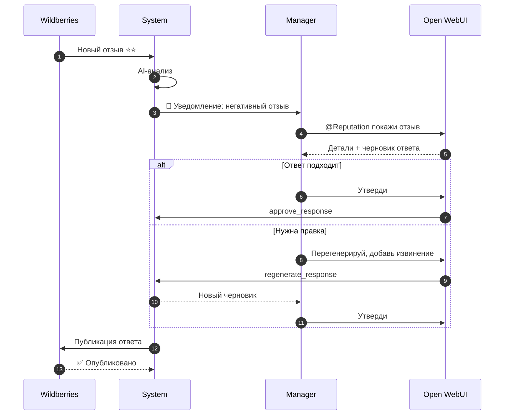
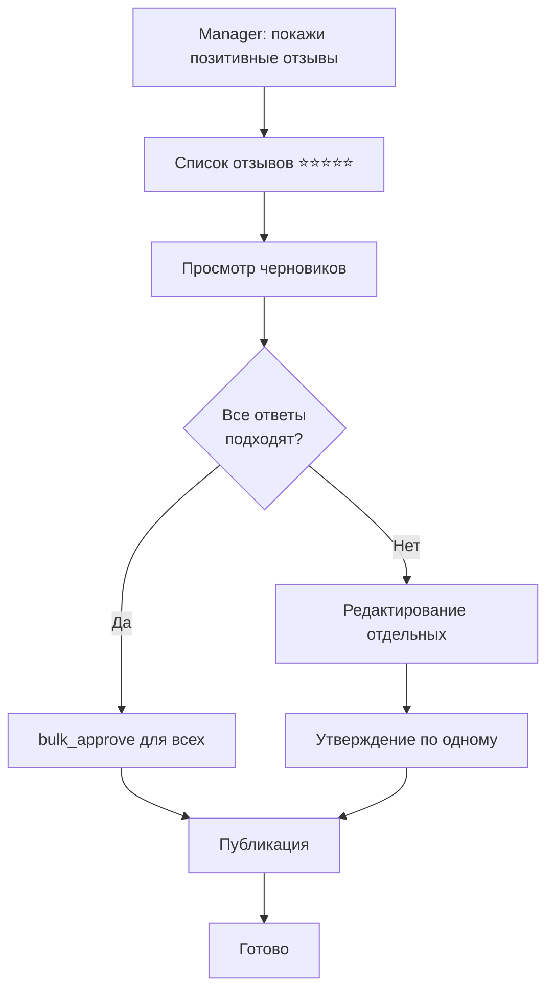
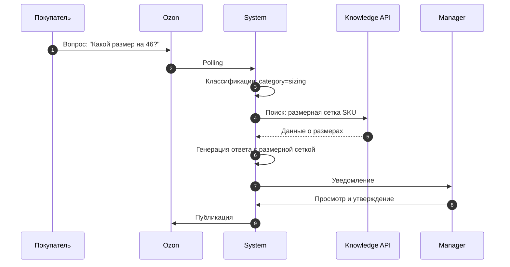
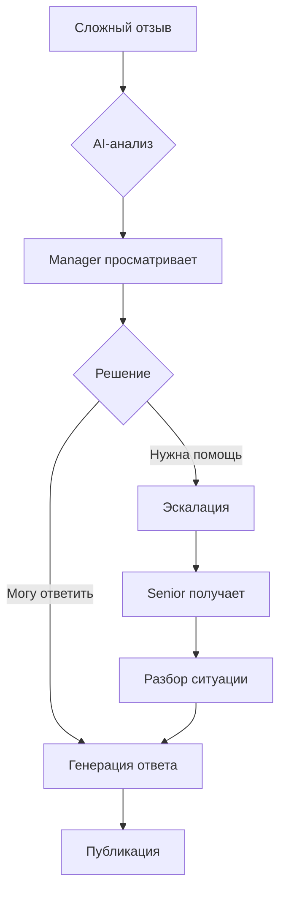
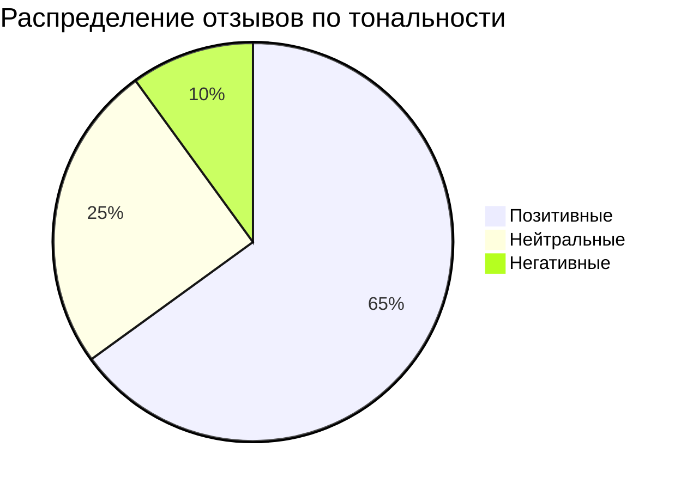
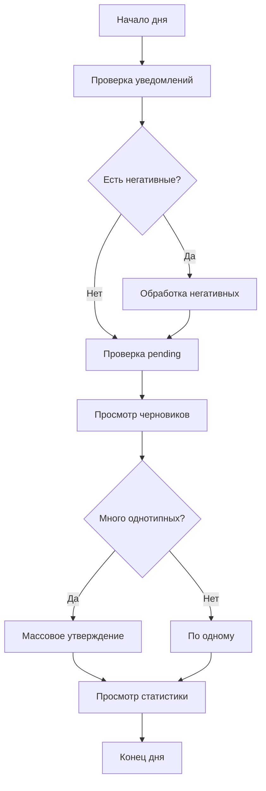

**Проект:** Интеллектуальная система управления репутацией  
**Модуль:** Reputation / Scenarios  
**Версия:** 2.1  
**Дата:** Январь 2026

---

## 6.1 Обзор сценариев

### Матрица сценариев по ролям

| Сценарий | Manager | Senior | Director | Admin |
|----------|:-------:|:------:|:--------:|:-----:|
| Просмотр отзывов | ✅ (brand) | ✅ | ✅ | ✅ |
| Утверждение ответа | ✅ | ✅ | ✅ | ✅ |
| Редактирование ответа | ✅ | ✅ | ✅ | ✅ |
| Перегенерация | ✅ | ✅ | ✅ | ✅ |
| Массовое утверждение | ✅ | ✅ | ✅ | ✅ |
| Эскалация | ✅ | ✅ | ✅ | ✅ |
| Просмотр статистики | ✅ (brand) | ✅ | ✅ | ✅ |
| Аналитика | ❌ | ✅ | ✅ | ✅ |
| Настройки | ❌ | ❌ | ❌ | ✅ |

---

## 6.2 Сценарий: Обработка негативного отзыва

### Диаграмма



### Шаги

1. **Получение отзыва** — Polling Service получает негативный отзыв (1-2 звезды)
2. **AI-анализ** — Классификация: sentiment=negative, category определена
3. **Уведомление** — Manager получает push-уведомление
4. **Просмотр** — Manager открывает детали через `@Adolf_Reputation`
5. **Оценка черновика** — Manager читает сгенерированный ответ
6. **Действие** — Утверждение / редактирование / перегенерация
7. **Публикация** — Ответ автоматически публикуется на маркетплейс

---

## 6.3 Сценарий: Массовое утверждение позитивных отзывов

### Диаграмма



### Пример диалога

```
Manager: Покажи позитивные отзывы за сегодня

@Adolf_Reputation: Найдено 8 отзывов ⭐⭐⭐⭐-⭐⭐⭐⭐⭐:

1. #2001 | WB | ⭐⭐⭐⭐⭐ | "Отличное качество!"
2. #2002 | Ozon | ⭐⭐⭐⭐ | "Хорошее платье, спасибо"
3. #2003 | WB | ⭐⭐⭐⭐⭐ | "Всё супер, рекомендую"
...

Manager: Утверди все

@Adolf_Reputation: ✅ Утверждено 8 ответов. Публикация запущена.
```

---

## 6.4 Сценарий: Обработка вопроса о размере

### Диаграмма



### RAG-контекст

При генерации ответа на вопрос о размере система:
1. Определяет категорию `sizing`
2. Запрашивает в Knowledge API размерную сетку товара
3. Включает конкретные замеры в ответ

---

## 6.5 Сценарий: Эскалация сложного случая

### Когда эскалировать

| Ситуация | Действие |
|----------|----------|
| Жалоба на серьёзный брак | Эскалация в тех. отдел |
| Угроза судом | Эскалация руководству |
| Вопрос вне компетенции | Эскалация специалисту |

### Диаграмма



### Пример

```
Manager: Покажи отзыв 3456

@Adolf_Reputation:
📦 Отзыв #3456 (WB)
Клиент: Ольга | Оценка: ⭐

"Получила платье с дырой! Это брак, требую возврат денег 
или буду писать жалобу в Роспотребнадзор!"

🤖 AI-анализ:
- Тональность: негативная (0.95)
- Категория: quality
- Теги: брак, возврат, жалоба

Manager: Эскалируй, серьёзный брак

@Adolf_Reputation: ✅ Эскалировано. Senior Manager получил уведомление.
```

---

## 6.6 Сценарий: Просмотр аналитики

### Доступ

| Роль | Доступ к аналитике |
|------|-------------------|
| Manager | Базовая статистика по своему бренду |
| Senior | Полная аналитика по всем брендам |
| Director | Полная аналитика + отчёты |

### Диаграмма



### Пример запроса

```
Senior: Покажи статистику за неделю

@Adolf_Reputation:
📊 Статистика за последние 7 дней:

Всего: 156 отзывов, 23 вопроса

По платформам:
- Wildberries: 89 (57%)
- Ozon: 45 (29%)  
- Яндекс.Маркет: 22 (14%)

По тональности:
- ✅ Позитивные: 102 (65%)
- ⚖️ Нейтральные: 39 (25%)
- ⚠️ Негативные: 15 (10%)

Средняя оценка: 4.3 ⭐
Время ответа: 18 мин (среднее)
Обработано: 142 (91%)
```

---

## 6.7 Сценарий: Перегенерация ответа

### Причины перегенерации

| Причина | Инструкция |
|---------|------------|
| Слишком формальный | "Сделай дружелюбнее" |
| Нет извинения | "Добавь извинение" |
| Не упомянут товар | "Упомяни характеристики товара" |
| Слишком длинный | "Сократи до 3 предложений" |

### Пример

```
Manager: Покажи отзыв 4567

@Adolf_Reputation:
📝 Черновик: "Уважаемый покупатель! Благодарим за обращение. 
Приносим извинения за доставленные неудобства..."

Manager: Перегенерируй, слишком формально, сделай теплее

@Adolf_Reputation → regenerate_response(item_id=4567, 
    instructions="Сделай теплее, менее формально")

📝 Новый черновик: "Мария, спасибо за обратную связь! 
Нам очень жаль, что платье не подошло по размеру..."

Manager: Отлично, утверждаю

@Adolf_Reputation: ✅ Ответ утверждён.
```

---

## 6.8 Типичный рабочий день менеджера



---

## Приложение А: Чек-лист менеджера

| Действие | Частота |
|----------|---------|
| Проверить негативные отзывы | Сразу при уведомлении |
| Обработать pending отзывы | 2-3 раза в день |
| Просмотреть статистику | 1 раз в день |
| Проверить failed публикации | 1 раз в день |

---

**Документ подготовлен:** Январь 2026  
**Версия:** 2.1  
**Статус:** Согласовано
