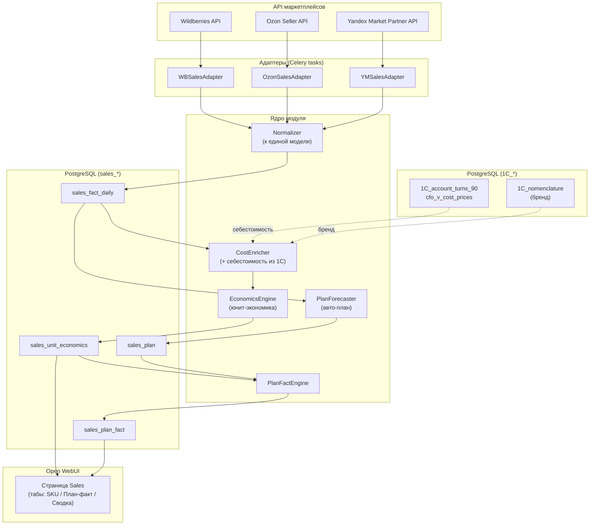

**Модуль:** Sales
**Версия:** 1.0
**Дата:** Июнь 2026

---

## 1.1 Компоненты

## 1.2 Принцип идентификации товара

Сквозной ключ всей системы — **Артикул продавца (SKU)**, в полном соответствии с принципом CFO/1Cexport: штрихкоды не используются (не указываются при оптовых продажах), номенклатурные группы не ведутся.

| Маркетплейс | Поле артикула продавца | Поле ID карточки |
|-------------|------------------------|------------------|
| Wildberries | `sa_name` / `vendorCode` | `nmId` |
| Ozon | `offer_id` | `sku` / `product_id` |
| Яндекс.Маркет | `shopSku` / `offerId` | `marketSku` |

Каждый адаптер приводит товар к единому `sku` (= Артикул 1С), что позволяет джойнить продажи всех площадок с себестоимостью из 1С.

## 1.3 Схема базы данных

Префикс таблиц модуля — `sales_*`, представлений — `sales_v_*`.

| Таблица | Назначение | Ключевые поля |
|---------|------------|---------------|
| `sales_fact_daily` | Нормализованный дневной факт по SKU и площадке | date, marketplace, sku, orders_qty, orders_sum, buyouts_qty, buyouts_sum, returns_qty, stock_qty, cart_adds, ad_spend, commission, logistics, storage, penalty |
| `sales_unit_economics` | Рассчитанная юнит-экономика по SKU за период | period, marketplace, sku, price_avg, net_qty, revenue, cogs, margin, margin_pct, roi, drr, buyout_pct, abc_category |
| `sales_plan` | План по SKU (день / недели 1–4 / месяц) | period, marketplace, sku, plan_revenue, plan_qty, source (forecast / 1c) |
| `sales_plan_fact` | Результат сопоставления план/факт | period, scope (day/week/month), marketplace, sku, plan, fact, diff, fulfilled (bool) |
| `sales_settings` | Параметры расчёта по бренду/площадке | vat_rate, week_ranges, abc_thresholds, novelty_days, return_cost, logistics_tariffs |

VIEW `sales_v_cost_prices` — тонкая обёртка над `cfo_v_cost_prices` (себестоимость по SKU), чтобы модуль не обращался к 1С-таблицам напрямую.

## 1.4 Расписание (Celery + Redis)

| Задача | Расписание | Действие |
|--------|-----------|----------|
| `sales.pull_daily_fact` | Ежедневно 04:00 | Запуск адаптеров WB/Ozon/YM за прошедший день → `sales_fact_daily` |
| `sales.enrich_cost` | Ежедневно 04:30 | Обогащение факта себестоимостью из `sales_v_cost_prices` |
| `sales.compute_economics` | Ежедневно 05:00 | Пересчёт `sales_unit_economics` за текущий период |
| `sales.compute_plan_fact` | Ежедневно 05:15 | Пересчёт `sales_plan_fact` (день/неделя/месяц) |
| `sales.generate_plan` | 1-го числа месяца 02:00 | Авто-генерация плана на месяц (см. Раздел 4) |

<Note>
Все задачи идемпотентны: повторный запуск за тот же день перезаписывает строки `sales_fact_daily` по ключу (date, marketplace, sku) — это закрывает поздние корректировки маркетплейсов (возвраты, доначисления логистики).
</Note>

## 1.5 FastAPI (потребление данными UI)

| Метод | Эндпоинт | Назначение |
|-------|----------|------------|
| GET | `/api/sales/unit-economics` | Юнит-экономика по SKU за период (фильтры: бренд, площадка, ABC) |
| GET | `/api/sales/plan-fact` | План-факт по дню/неделе/месяцу + сводка выполнивших план |
| GET | `/api/sales/pace` | Трекер темпа месяца (план/факт нарастающим, прогноз) |
| POST | `/api/sales/plan/regenerate` | Перегенерация плана (с коэффициентом роста) |

Доступ фильтруется по роли и бренду через middleware Core (Охана Маркет / Охана Кидс).
