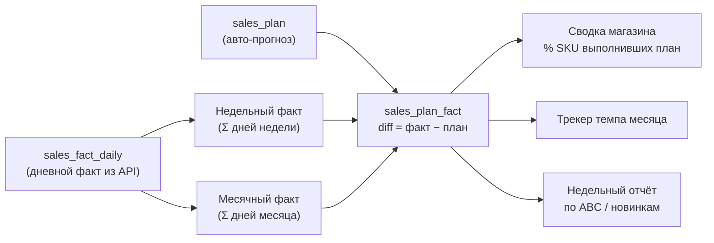

**Модуль:** Sales
**Версия:** 1.0
**Дата:** Июнь 2026

---

План-факт — ключевой инструмент менеджеров. Он воспроизводит три листа исходной таблицы («План-факт ежедневный», «План-факт месяц», «Недельные отчёты по плану»), но факт собирается из API автоматически, а план генерируется прогнозом вместо ручного ввода.

## 4.1 Уровни план-факта



## 4.2 Авто-генерация плана (замена ручного ввода)

План больше **не вводится руками**. Задача `sales.generate_plan` (1-го числа месяца) формирует план по каждому SKU:

```
base       = факт того же месяца год назад (sales_fact_daily)
            ├─ если истории нет → средние продажи за последние 90 дней × длина месяца
seasonal   = сезонный коэффициент категории (из исторических рядов)
growth     = целевой коэффициент роста (sales_settings, по умолчанию 1.0)

plan_month_revenue(SKU) = base × seasonal × growth
```

Месячный план разбивается на недели и день пропорционально количеству дней (`sales_settings.week_ranges`: неделя 1 = 8 дней, 2 = 7, 3 = 7, 4 = 8):

```
plan_week_N = plan_month × (дней_в_неделе_N / дней_в_месяце)
plan_day    = plan_month / дней_в_месяце
```

<Note>
Если в 1С ведётся план продаж, источник переключается на него (`sales_plan.source = '1c'`). Прогноз — поведение по умолчанию, чтобы исключить ручной ввод. Целевой коэффициент роста — единственный управленческий параметр, задаётся на уровне бренда в настройках, не по каждому SKU.
</Note>

## 4.3 Расчётные блоки

| Блок | Формула | Пояснение |
|------|---------|-----------|
| Дневной факт по SKU | строка `sales_fact_daily` за дату | Собирается адаптерами автоматически |
| Месячный факт | `Σ дневной факт за месяц` | |
| Недельный факт | `Σ дневной факт в диапазоне недели` | Границы недель — из `sales_settings.week_ranges` |
| Отклонение (`diff`) | `факт − план` | На каждом уровне (день/неделя/месяц) и по каждому SKU |
| Выполнен план (`fulfilled`) | `diff ≥ 0` | Булев флаг |

## 4.4 Сводка по магазину

| Показатель | Формула |
|------------|---------|
| Факт за период | `Σ факт по всем SKU` |
| Всего SKU | `COUNT(DISTINCT sku)` |
| Выполнили план | `COUNT(sku WHERE fulfilled)` за период |
| % выполнивших | `Выполнили / Всего SKU` |

Это управленческое «табло»: какая доля ассортимента бьёт план в разрезе день / неделя 1–4 / месяц.

## 4.5 Трекер темпа месяца

Показывает, идём ли мы с опережением плана прямо сейчас:

```
план_дня          = план_месяца / дней_в_месяце        # ровный целевой темп
% выполнения дня  = факт_продаж_дня / план_дня
выполнение_месяца = факт_накопит / план_месяца
осталось_до_плана = план_месяца − факт_накопит
```

Источник факта — дневная выручка из `sales_fact_daily`. Параметры месяца — из `sales_settings`.

## 4.6 Недельный отчёт по сегментам

Недельная сводка в разрезе ABC-категорий (Раздел 3.6) и новинок. Новинка — товар с датой первой карточки/продажи ≤ `sales_settings.novelty_days` (по умолчанию 30) дней.

По каждому сегменту: `план, факт, выполнение% = факт/план, отклонение, средняя маржинальность, товаров в сегменте, товаров выполнивших план, % выполнивших`.

Отчёт показывает, какой сегмент тянет результат вниз — старые хиты категории A, «хвост» B/C или новинки.

## 4.7 Итог

Логика расчётов простая (суммы, разницы, доли) и переносится из исходной таблицы один в один. Принципиальные отличия модуля: **факт собирается из API автоматически** (ежедневная ручная вставка выгрузок устранена), а **план генерируется прогнозом** (ручной ввод плана устранён). Единственный управленческий ввод — коэффициент роста на уровне бренда.
