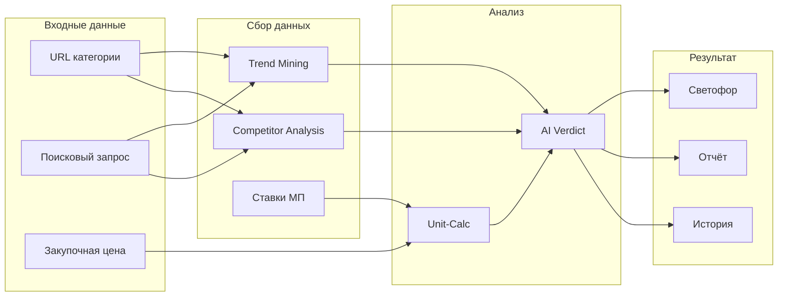

# ADOLF SCOUT — Раздел 0: Введение

**Проект:** Предиктивная аналитика товарных ниш  
**Модуль:** Scout  
**Версия:** 1.0  
**Дата:** Январь 2026

---

## Назначение документа

Данный документ является введением в модуль ADOLF Scout и содержит:
- Общее описание модуля
- Бизнес-цели и метрики
- Структуру документации
- Краткий обзор функциональности

---

## Что такое ADOLF Scout

ADOLF Scout — функциональный модуль системы ADOLF, предназначенный для оценки целесообразности выхода в новые товарные ниши. Модуль анализирует тренды спроса, конкурентную среду и рассчитывает unit-экономику, выдавая рекомендацию в формате «светофора» с обоснованием.

### Поддерживаемые платформы

| Платформа | Анализ категорий | Trend Mining | Порядок приоритета |
|-----------|:----------------:|:------------:|:------------------:|
| Wildberries | ✅ | ✅ | 1 |
| Ozon | ✅ | ✅ | 2 |
| Яндекс.Маркет | ✅ | ✅ | 3 |

### Основные возможности v1.0

| Функция | Описание |
|---------|----------|
| Trend Mining | Анализ динамики спроса из Wordstat, API маркетплейсов, внешних сервисов |
| Competitor Analysis | Анализ ТОП-50 товаров категории, расчёт Monopoly Rate |
| Unit-Calc | Расчёт unit-экономики с учётом всех расходов маркетплейсов |
| AI Verdict | Рекомендация «светофор» (GO / CONSIDER / RISKY) с обоснованием |
| History | Сохранение всех анализов для отслеживания динамики |
| Export | Выгрузка отчётов в PDF/Excel |

---

## Бизнес-цели

| Цель | Описание | Метрика успеха |
|------|----------|----------------|
| Снижение рисков | Объективная оценка ниши перед закупкой | Точность прогнозов > 70% |
| Скорость решений | Быстрый анализ вместо ручного исследования | Анализ ниши < 2 минут |
| Полнота данных | Агрегация данных из множества источников | 5+ источников данных |
| Обоснованность | AI-вердикт с конкретными метриками | 100% анализов с reason |
| Отслеживание | История анализов и динамика ниш | Сравнение «было → стало» |

---

## Структура документации

| Раздел | Содержание |
|--------|------------|
| **0. Введение** | Общий обзор (этот документ) |
| **1. Архитектура** | Компоненты, зависимости, интеграции |
| **2. Data Sources** | Источники данных: Watcher, Wordstat, MP Analytics |
| **3. AI Pipeline** | Trend Mining, Competitor Analysis, Unit-Calc, AI Verdict |
| **4. Open WebUI** | Pipeline, Tools, кнопки, интерфейс |
| **5. Database** | Схема базы данных |
| **6. Сценарии** | Пользовательские сценарии |
| **7. Celery** | Фоновые задачи |

---

## Роли и доступ

| Роль | Описание | Доступ к Scout |
|------|----------|----------------|
| Staff | Рядовые сотрудники | ❌ Нет доступа |
| Manager | Менеджер по маркетплейсам | ❌ Нет доступа |
| Senior | Старший менеджер | ✅ Ограниченный |
| Director | Директор | ✅ Полный |
| Administrator | Администратор | ✅ Полный + настройки |

### Матрица доступа к функциям

| Функция | Senior | Director | Admin |
|---------|:------:|:--------:|:-----:|
| Анализ ниши | ✅ | ✅ | ✅ |
| Просмотр истории | ✅ | ✅ | ✅ |
| Сравнение анализов | ✅ | ✅ | ✅ |
| Экспорт отчётов | ✅ | ✅ | ✅ |
| Настройка ставок МП | ✅ | ✅ | ✅ |
| Настройка порогов светофора | ❌ | ❌ | ✅ |
| Настройка API-ключей | ❌ | ❌ | ✅ |

---

## Источники данных

### Trend Mining (динамика спроса)

| Источник | Тип данных | Метод получения |
|----------|------------|-----------------|
| Яндекс.Wordstat | Частотность запросов за 3 месяца | API / Парсинг через Watcher Agent |
| Wildberries Analytics | Статистика категорий | API (если доступен) |
| Ozon Analytics | Тренды категорий | API Seller Analytics |
| Яндекс.Маркет Analytics | Статистика категорий | API |
| SimilarWeb / Serpstat | Внешняя аналитика | API |

### Competitor Analysis (конкурентная среда)

| Источник | Тип данных | Метод получения |
|----------|------------|-----------------|
| Watcher API | Цены, остатки, рейтинги ТОП-50 | `GET /api/v1/watcher/category/analysis` |
| Watcher API | Исторические данные цен | `GET /api/v1/watcher/prices/history` |

### Unit-Calc (расчёт экономики)

| Источник | Тип данных | Метод получения |
|----------|------------|-----------------|
| Пользователь | Закупочная цена (COGS) | Ввод в интерфейсе |
| Настройки системы | Ставки комиссий и расходов МП | Таблица `scout_marketplace_rates` |
| Watcher API | Средняя цена в категории | Агрегация данных |

---

## Ставки расходов маркетплейсов (по умолчанию)

### Категория «Одежда»

| Статья расходов | Wildberries | Ozon | Яндекс.Маркет |
|-----------------|:-----------:|:----:|:-------------:|
| Комиссия | 15% | 18% | 15% |
| Логистика (до покупателя) | 5% | 6% | 7% |
| Обратная логистика | 3% | 4% | 4% |
| Хранение (в месяц) | 1% | 1.5% | 1% |
| Эквайринг | 0% | 0% | 1.5% |
| **Итого overhead** | **24%** | **29.5%** | **28.5%** |

> Ставки настраиваются пользователями с ролью Senior, Director, Administrator.

---

## Система «Светофор»

### Метрики для оценки

| Метрика | Описание | Источник |
|---------|----------|----------|
| **Trend Slope** | Коэффициент роста/падения спроса | Wordstat, MP Analytics |
| **Monopoly Rate** | Доля рынка ТОП-3 продавцов | Watcher (ТОП-50 анализ) |
| **Expected Margin** | Расчётная чистая маржа | Unit-Calc |

### Пороговые значения

| Метрика | 🟢 GREEN | 🟡 YELLOW | 🔴 RED |
|---------|----------|-----------|--------|
| **Trend Slope** | > 0.15 | 0 — 0.15 | < 0 |
| **Monopoly Rate** | < 50% | 50% — 70% | > 70% |
| **Expected Margin** | > 25% | 15% — 25% | < 15% |

### Итоговый вердикт

| Вердикт | Условие | Рекомендация |
|---------|---------|--------------|
| 🟢 **GO** | Все метрики зелёные, или 2 зелёные + 1 жёлтая | Рекомендуется вход в нишу |
| 🟡 **CONSIDER** | Смешанные показатели | Требуется дополнительный анализ |
| 🔴 **RISKY** | Хотя бы одна красная метрика, или все жёлтые | Высокий риск, вход не рекомендуется |

---

## Форматы ввода данных

### Поддерживаемые форматы запроса

| Формат | Пример | Результат |
|--------|--------|-----------|
| URL категории | `https://www.wildberries.ru/catalog/zhenshchinam/odezhda/platya` | Анализ категории на WB |
| URL поиска | `https://www.wildberries.ru/catalog/0/search.aspx?search=платье%20летнее` | Анализ по запросу на WB |
| Текст + МП | «летние платья, Wildberries» | Анализ запроса на WB |
| Только текст | «летние платья» | Анализ по всем маркетплейсам |

### Формат закупочной цены (COGS)

| Формат | Пример | Результат |
|--------|--------|-----------|
| Число | `500` | Расчёт для COGS = 500 ₽ |
| С валютой | `500 рублей` | Расчёт для COGS = 500 ₽ |
| Диапазон | `от 400 до 600` | Расчёт для min/avg/max |

---

## Формат ответа

### Структура JSON (внутренний)

```json
{
  "verdict": "RISKY",
  "color": "red",
  "reason": "Высокая монополизация (ТОП-3 = 78% рынка), низкая маржа (<10%)",
  "metrics": {
    "trend_slope": 0.12,
    "trend_status": "yellow",
    "monopoly_rate": 0.78,
    "monopoly_status": "red",
    "expected_margin": 0.08,
    "margin_status": "red"
  },
  "details": {
    "avg_price": 2500,
    "price_range": {"min": 1200, "max": 5800},
    "top_sellers": [
      {"name": "Seller A", "share": 0.35},
      {"name": "Seller B", "share": 0.28},
      {"name": "Seller C", "share": 0.15}
    ],
    "trend_data": {
      "period": "3 months",
      "start_value": 12000,
      "end_value": 13500
    }
  },
  "unit_economics": {
    "selling_price": 2500,
    "cogs": 500,
    "commission": 375,
    "logistics": 125,
    "return_logistics": 75,
    "storage": 25,
    "net_profit": 200,
    "net_margin_pct": 8.0
  },
  "recommendations": [
    "Рассмотрите нишевые подкатегории с меньшей конкуренцией",
    "Для достижения маржи 25% необходима цена от 3200 ₽ или COGS < 350 ₽"
  ],
  "analyzed_at": "2026-01-21T10:30:00Z",
  "data_sources": ["wordstat", "watcher", "ozon_analytics"]
}
```

---

## Алерты и уведомления

| Событие | Уровень | Получатели |
|---------|---------|------------|
| Анализ завершён | info | Инициатор запроса |
| Ошибка источника данных | warning | Administrator |
| Критическая ошибка API | critical | Administrator |

> Scout не генерирует проактивных алертов. Все анализы инициируются пользователем.

---

## Технологический стек

| Компонент | Технология |
|-----------|------------|
| Backend | FastAPI (Python 3.11) |
| Database | PostgreSQL 15 |
| Queue | Redis + Celery |
| AI (рутина) | GPT-5 mini (Timeweb AI) |
| AI (вердикт) | Claude Opus 4.5 |
| Interface | Open WebUI |
| Container | Docker |

---

## Зависимости от ADOLF Core

| Компонент Core | Использование |
|----------------|---------------|
| Middleware | Авторизация, роутинг, фильтрация по роли |
| PostgreSQL | Хранение анализов, настроек ставок |
| Celery | Фоновые задачи обновления данных |
| Redis | Очередь задач, кэширование трендов |

---

## Зависимости от других модулей

| Модуль | Использование | Обязательность |
|--------|---------------|----------------|
| Watcher | Данные о ценах, конкурентах, ТОП-50 категорий | **Обязательно** |
| Knowledge | — | Не используется |
| Reputation | — | Не используется |
| CFO | В v2.0: данные о реальной марже существующих товаров | Опционально |

---

## Функционал v2.0 (планы)

| Функция | Описание |
|---------|----------|
| Интеграция с CFO | Сравнение прогнозной и реальной маржи |
| Автомониторинг ниш | Периодический пересчёт сохранённых анализов |
| Рекомендации товаров | AI-подбор конкретных товаров для закупки |
| Сезонность | Учёт сезонных колебаний спроса |
| Расширенные тренды | Google Trends, социальные сети |
| Уведомления об изменениях | Алерт при изменении статуса ниши |

---

## Быстрый старт

### Для Senior / Director

1. Откройте Open WebUI
2. Выберите Pipeline `@Adolf_Scout`
3. Напишите: «Проанализируй нишу летних платьев на Wildberries, закупка 500 рублей»
4. Дождитесь результата (~30-60 секунд)
5. Изучите вердикт и метрики
6. При необходимости экспортируйте отчёт

### Примеры запросов

```
Проанализируй https://www.wildberries.ru/catalog/zhenshchinam/odezhda/platya, COGS 450 рублей

Оцени нишу детских комбинезонов на Ozon, закупка от 800 до 1200 рублей

Сравни нишу "женские сумки" на всех маркетплейсах, себестоимость 600₽

Покажи историю анализов за последний месяц
```

### Для Administrator

1. Настройте API-ключи источников данных в environment variables
2. Проверьте ставки маркетплейсов в таблице `scout_marketplace_rates`
3. При необходимости скорректируйте пороги светофора в таблице `settings`
4. Убедитесь, что Watcher собирает данные по целевым категориям

---

## Workflow модуля



---

## Контакты

| Вопрос | Ответственный |
|--------|---------------|
| Техническая поддержка | Administrator |
| Настройка ставок | Senior, Director, Administrator |
| Интерпретация результатов | Director |
| Стратегические решения | Director |

---

**Документ подготовлен:** Январь 2026  
**Версия:** 1.0  
**Статус:** Черновик
