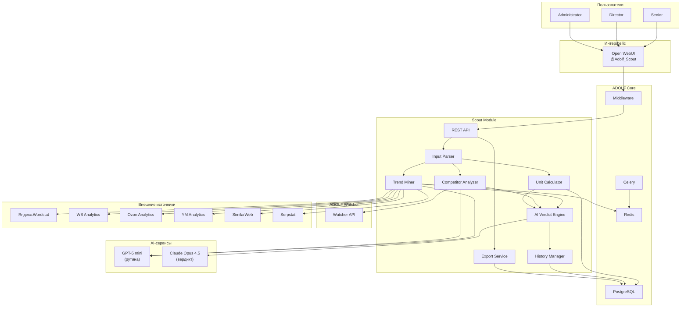
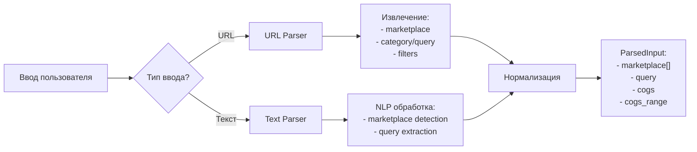
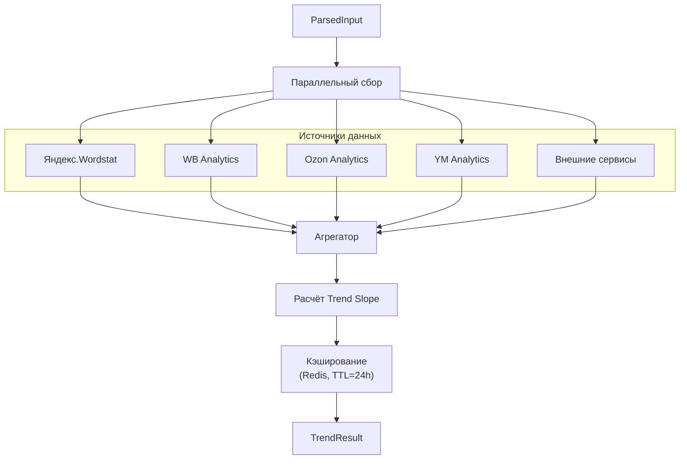
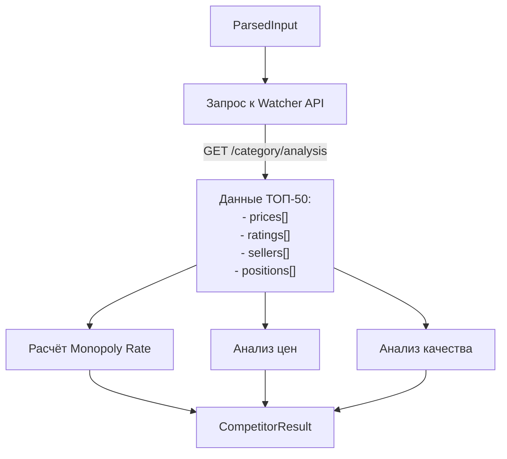
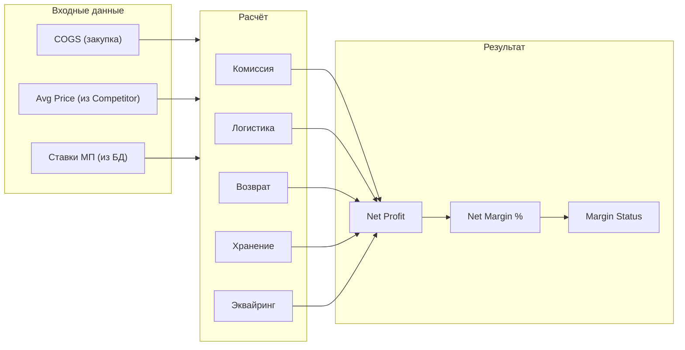
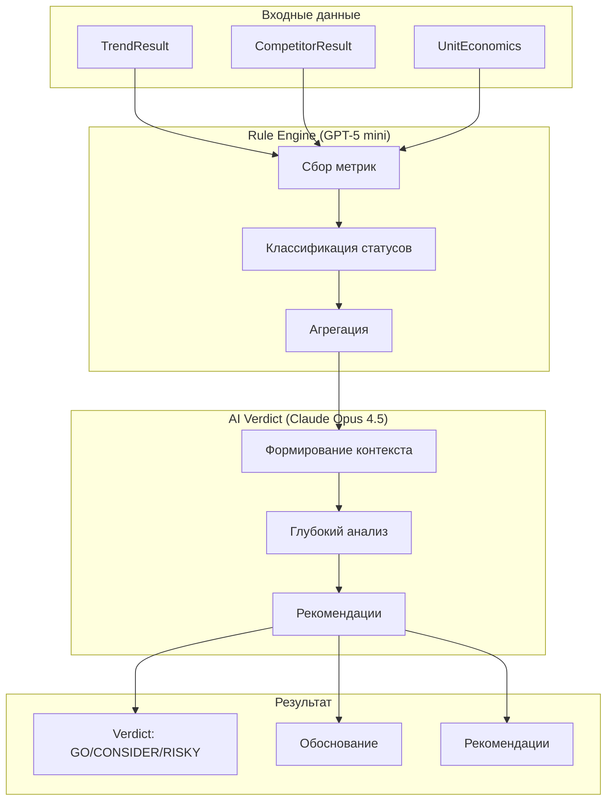
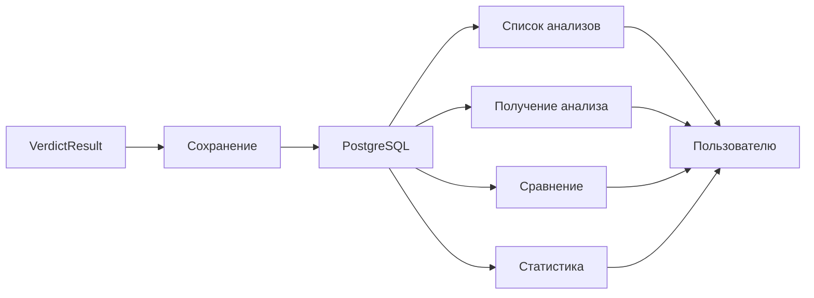
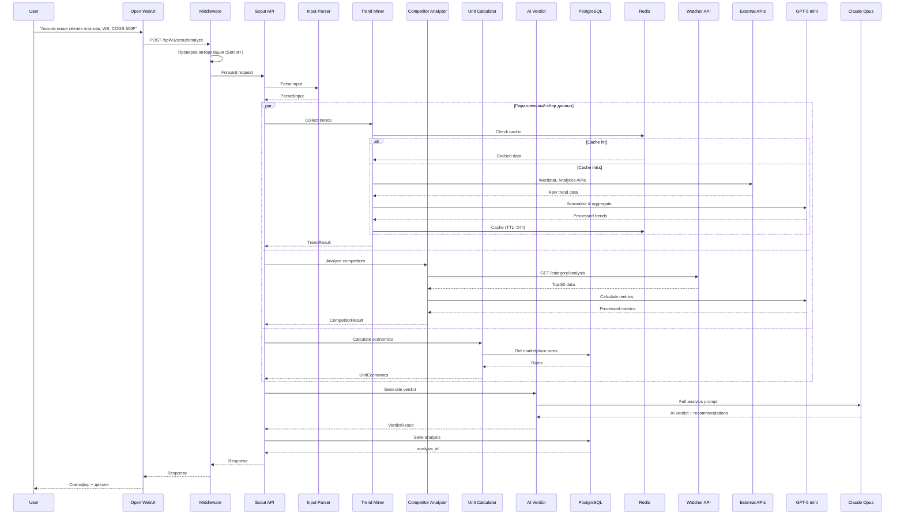
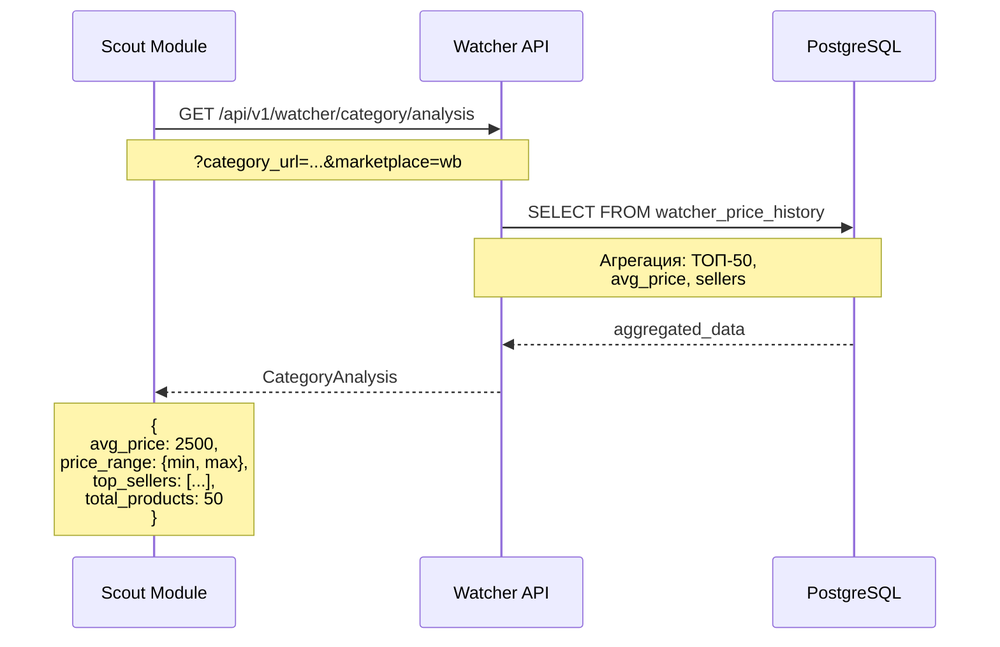

**Проект:** Предиктивная аналитика товарных ниш  
**Модуль:** Scout / Architecture  
**Версия:** 1.0  
**Дата:** Январь 2026

---

## 1.1 Обзор архитектуры

### Принципы проектирования

| Принцип | Описание |
|---------|----------|
| Data Aggregation | Объединение данных из множества источников |
| Async Processing | Асинхронный сбор данных для минимизации времени ответа |
| Caching | Кэширование трендов и статистики категорий |
| Hybrid AI | GPT-5 mini для рутины, Claude Opus 4.5 для вердикта |
| History First | Сохранение всех анализов для отслеживания динамики |

### Общая схема



---

## 1.2 Компоненты модуля

### 1.2.1 Input Parser

**Назначение:** Разбор и нормализация входных данных от пользователя.



**Поддерживаемые URL-паттерны:**

| Маркетплейс | Паттерн категории | Паттерн поиска |
|-------------|-------------------|----------------|
| Wildberries | `wildberries.ru/catalog/{path}` | `wildberries.ru/catalog/0/search.aspx?search={query}` |
| Ozon | `ozon.ru/category/{slug}-{id}` | `ozon.ru/search/?text={query}` |
| Яндекс.Маркет | `market.yandex.ru/catalog--{slug}/{id}` | `market.yandex.ru/search?text={query}` |

**Структура ParsedInput:**

```python
@dataclass
class ParsedInput:
    """Разобранный ввод пользователя."""
    marketplaces: List[str]  # ['wildberries', 'ozon', 'yandex_market'] или конкретный
    query: str               # Поисковый запрос или название категории
    category_url: str        # Оригинальный URL (если был)
    cogs: float              # Закупочная цена
    cogs_min: float          # Минимум диапазона (если указан)
    cogs_max: float          # Максимум диапазона (если указан)
    raw_input: str           # Исходный ввод пользователя
```

---

### 1.2.2 Trend Miner

**Назначение:** Сбор и анализ данных о динамике спроса.



**Структура TrendResult:**

```python
@dataclass
class TrendResult:
    """Результат анализа трендов."""
    query: str
    period_months: int = 3
    
    # Данные по источникам
    wordstat_data: Optional[WordstatData]
    marketplace_data: Dict[str, MarketplaceTrendData]
    external_data: Dict[str, ExternalTrendData]
    
    # Агрегированные метрики
    trend_slope: float          # Коэффициент наклона (-1.0 до +1.0)
    trend_status: str           # 'green', 'yellow', 'red'
    confidence: float           # Уверенность в данных (0-1)
    
    # Детали
    start_volume: int           # Объём запросов в начале периода
    end_volume: int             # Объём запросов в конце периода
    peak_volume: int            # Пиковое значение
    avg_volume: int             # Среднее значение
    
    data_sources: List[str]     # Использованные источники
    collected_at: datetime
```

**Расчёт Trend Slope:**

```python
def calculate_trend_slope(data_points: List[Tuple[date, int]]) -> float:
    """
    Расчёт коэффициента тренда методом линейной регрессии.
    
    Returns:
        float: Нормализованный коэффициент от -1.0 до +1.0
               > 0.15: рост (green)
               0 to 0.15: стабильно (yellow)
               < 0: падение (red)
    """
    if len(data_points) < 2:
        return 0.0
    
    x = np.arange(len(data_points))
    y = np.array([point[1] for point in data_points])
    
    # Линейная регрессия
    slope, intercept = np.polyfit(x, y, 1)
    
    # Нормализация относительно среднего значения
    avg_y = np.mean(y)
    if avg_y == 0:
        return 0.0
    
    normalized_slope = slope / avg_y
    
    # Ограничение диапазона
    return max(-1.0, min(1.0, normalized_slope))
```

---

### 1.2.3 Competitor Analyzer

**Назначение:** Анализ конкурентной среды в категории.



**Структура CompetitorResult:**

```python
@dataclass
class CompetitorResult:
    """Результат анализа конкурентов."""
    marketplace: str
    category: str
    
    # Monopoly Rate
    monopoly_rate: float        # Доля ТОП-3 продавцов (0-1)
    monopoly_status: str        # 'green', 'yellow', 'red'
    top_sellers: List[SellerShare]
    
    # Ценовой анализ
    avg_price: float
    median_price: float
    min_price: float
    max_price: float
    price_std: float            # Стандартное отклонение
    
    # Качество конкурентов
    avg_rating: float
    avg_reviews_count: int
    products_with_high_rating: int  # Рейтинг > 4.5
    
    # Барьеры входа
    entry_barrier_score: float  # 0-1, где 1 = высокий барьер
    
    # Детали
    total_products_analyzed: int
    analyzed_at: datetime


@dataclass
class SellerShare:
    """Доля продавца в категории."""
    seller_name: str
    products_count: int
    estimated_share: float      # Доля по количеству товаров в ТОП
    avg_position: float         # Средняя позиция в выдаче
```

**Расчёт Monopoly Rate:**

```python
def calculate_monopoly_rate(top_sellers: List[SellerShare]) -> float:
    """
    Расчёт степени монополизации рынка.
    
    Monopoly Rate = сумма долей ТОП-3 продавцов
    
    Returns:
        float: 0-1, где 1 = полная монополия
    """
    if len(top_sellers) < 3:
        return sum(s.estimated_share for s in top_sellers)
    
    # Сортировка по доле
    sorted_sellers = sorted(top_sellers, key=lambda x: x.estimated_share, reverse=True)
    
    # Сумма долей ТОП-3
    top_3_share = sum(s.estimated_share for s in sorted_sellers[:3])
    
    return min(1.0, top_3_share)
```

---

### 1.2.4 Unit Calculator

**Назначение:** Расчёт unit-экономики для оценки маржинальности.



**Структура UnitEconomics:**

```python
@dataclass
class UnitEconomics:
    """Результат расчёта unit-экономики."""
    marketplace: str
    
    # Входные данные
    selling_price: float        # Цена продажи (avg из категории)
    cogs: float                 # Себестоимость
    
    # Расходы (в рублях)
    commission: float           # Комиссия МП
    logistics: float            # Логистика до покупателя
    return_logistics: float     # Обратная логистика
    storage: float              # Хранение
    acquiring: float            # Эквайринг
    
    # Расходы (в процентах)
    commission_pct: float
    logistics_pct: float
    return_logistics_pct: float
    storage_pct: float
    acquiring_pct: float
    total_overhead_pct: float
    
    # Результат
    gross_profit: float         # Валовая прибыль (price - cogs)
    net_profit: float           # Чистая прибыль
    gross_margin_pct: float     # Валовая маржа %
    net_margin_pct: float       # Чистая маржа %
    margin_status: str          # 'green', 'yellow', 'red'
    
    # Дополнительно
    break_even_price: float     # Цена безубыточности
    target_price_25: float      # Цена для маржи 25%


@dataclass
class MarketplaceRates:
    """Ставки расходов маркетплейса."""
    marketplace: str
    category: str = "default"
    
    commission_pct: float
    logistics_pct: float
    return_logistics_pct: float
    storage_pct: float
    acquiring_pct: float
    
    updated_at: datetime
    updated_by: int             # user_id
```

**Формула расчёта:**

```python
def calculate_unit_economics(
    selling_price: float,
    cogs: float,
    rates: MarketplaceRates
) -> UnitEconomics:
    """Расчёт unit-экономики."""
    
    # Расходы в рублях
    commission = selling_price * rates.commission_pct / 100
    logistics = selling_price * rates.logistics_pct / 100
    return_logistics = selling_price * rates.return_logistics_pct / 100
    storage = selling_price * rates.storage_pct / 100
    acquiring = selling_price * rates.acquiring_pct / 100
    
    total_expenses = commission + logistics + return_logistics + storage + acquiring
    total_overhead_pct = (
        rates.commission_pct + rates.logistics_pct + 
        rates.return_logistics_pct + rates.storage_pct + rates.acquiring_pct
    )
    
    # Прибыль
    gross_profit = selling_price - cogs
    net_profit = selling_price - cogs - total_expenses
    
    # Маржа
    gross_margin_pct = (gross_profit / selling_price * 100) if selling_price > 0 else 0
    net_margin_pct = (net_profit / selling_price * 100) if selling_price > 0 else 0
    
    # Статус
    if net_margin_pct > 25:
        margin_status = "green"
    elif net_margin_pct >= 15:
        margin_status = "yellow"
    else:
        margin_status = "red"
    
    # Дополнительные расчёты
    # Цена безубыточности: cogs + overhead = price → price = cogs / (1 - overhead%)
    overhead_rate = total_overhead_pct / 100
    break_even_price = cogs / (1 - overhead_rate) if overhead_rate < 1 else float('inf')
    
    # Цена для маржи 25%: (price - cogs - overhead) / price = 0.25
    # price - cogs - price * overhead_rate = 0.25 * price
    # price * (1 - overhead_rate - 0.25) = cogs
    # price = cogs / (0.75 - overhead_rate)
    target_margin_rate = 0.75 - overhead_rate
    target_price_25 = cogs / target_margin_rate if target_margin_rate > 0 else float('inf')
    
    return UnitEconomics(
        marketplace=rates.marketplace,
        selling_price=selling_price,
        cogs=cogs,
        commission=commission,
        logistics=logistics,
        return_logistics=return_logistics,
        storage=storage,
        acquiring=acquiring,
        commission_pct=rates.commission_pct,
        logistics_pct=rates.logistics_pct,
        return_logistics_pct=rates.return_logistics_pct,
        storage_pct=rates.storage_pct,
        acquiring_pct=rates.acquiring_pct,
        total_overhead_pct=total_overhead_pct,
        gross_profit=gross_profit,
        net_profit=net_profit,
        gross_margin_pct=round(gross_margin_pct, 2),
        net_margin_pct=round(net_margin_pct, 2),
        margin_status=margin_status,
        break_even_price=round(break_even_price, 2),
        target_price_25=round(target_price_25, 2)
    )
```

---

### 1.2.5 AI Verdict Engine

**Назначение:** Формирование итогового вердикта с использованием AI.



**Логика определения вердикта:**

```python
def determine_verdict(
    trend_status: str,
    monopoly_status: str,
    margin_status: str
) -> str:
    """
    Определение итогового вердикта на основе статусов метрик.
    
    Правила:
    - GO: все зелёные, или 2 зелёные + 1 жёлтая
    - RISKY: хотя бы 1 красная, или все жёлтые
    - CONSIDER: остальные случаи
    """
    statuses = [trend_status, monopoly_status, margin_status]
    
    green_count = statuses.count("green")
    yellow_count = statuses.count("yellow")
    red_count = statuses.count("red")
    
    # RISKY: есть красный или все жёлтые
    if red_count > 0 or yellow_count == 3:
        return "RISKY"
    
    # GO: все зелёные или 2 зелёные + 1 жёлтая
    if green_count == 3 or (green_count == 2 and yellow_count == 1):
        return "GO"
    
    # CONSIDER: остальное
    return "CONSIDER"
```

**Структура VerdictResult:**

```python
@dataclass
class VerdictResult:
    """Итоговый результат анализа ниши."""
    # Идентификация
    analysis_id: UUID
    query: str
    marketplaces: List[str]
    
    # Вердикт
    verdict: str                # 'GO', 'CONSIDER', 'RISKY'
    color: str                  # 'green', 'yellow', 'red'
    confidence: float           # Уверенность (0-1)
    
    # Метрики
    metrics: VerdictMetrics
    
    # AI-анализ
    reason: str                 # Краткое обоснование
    detailed_analysis: str      # Развёрнутый анализ
    recommendations: List[str]  # Рекомендации
    risks: List[str]            # Выявленные риски
    opportunities: List[str]    # Возможности
    
    # Исходные данные
    trend_result: TrendResult
    competitor_results: Dict[str, CompetitorResult]
    unit_economics: Dict[str, UnitEconomics]
    
    # Метаданные
    user_id: int
    cogs_input: float
    cogs_range: Optional[Tuple[float, float]]
    data_sources: List[str]
    analyzed_at: datetime
    processing_time_ms: int


@dataclass
class VerdictMetrics:
    """Метрики для вердикта."""
    trend_slope: float
    trend_status: str
    
    monopoly_rate: float
    monopoly_status: str
    
    expected_margin: float
    margin_status: str
    
    # Дополнительные метрики
    avg_price: float
    price_range: Tuple[float, float]
    competition_level: str      # 'low', 'medium', 'high'
    entry_barrier: str          # 'low', 'medium', 'high'
```

---

### 1.2.6 History Manager

**Назначение:** Сохранение и управление историей анализов.



**Функции:**

| Функция | Описание |
|---------|----------|
| `save_analysis()` | Сохранение результата анализа |
| `get_analysis(id)` | Получение анализа по ID |
| `list_analyses(filters)` | Список анализов с фильтрацией |
| `compare_analyses(id1, id2)` | Сравнение двух анализов одной ниши |
| `get_niche_history(query)` | История анализов по запросу |
| `get_accuracy_stats()` | Статистика точности прогнозов (v2.0) |

---

### 1.2.7 Export Service

**Назначение:** Генерация отчётов в различных форматах.

**Поддерживаемые форматы:**

| Формат | Содержание | Использование |
|--------|------------|---------------|
| PDF | Полный отчёт с графиками | Для презентаций, архива |
| Excel | Таблицы с данными | Для дальнейшего анализа |
| JSON | Сырые данные | Для интеграций |

**Структура PDF-отчёта:**

1. Титульная страница (запрос, дата, вердикт)
2. Executive Summary (светофор + ключевые метрики)
3. Trend Analysis (графики динамики)
4. Competitor Analysis (ТОП продавцы, цены)
5. Unit Economics (расчёт маржи)
6. Recommendations (рекомендации AI)
7. Raw Data (приложение с данными)

---

## 1.3 Схема потока данных



---

## 1.4 Интеграции

### 1.4.1 ADOLF Watcher



**Используемые endpoints Watcher:**

| Endpoint | Метод | Описание |
|----------|-------|----------|
| `/api/v1/watcher/category/analysis` | GET | Агрегированные данные по категории |
| `/api/v1/watcher/prices/history` | GET | История цен (для трендов) |
| `/api/v1/watcher/competitors/top` | GET | ТОП продавцов категории |

### 1.4.2 Внешние API

#### Яндекс.Wordstat

| Параметр | Значение |
|----------|----------|
| Метод | API или парсинг через Watcher Agent |
| Данные | Частотность запросов за 3 месяца |
| Rate Limit | 10 req/min (API) |
| Кэширование | 24 часа |

#### Ozon Analytics API

| Параметр | Значение |
|----------|----------|
| Endpoint | `/v1/analytics/data` |
| Данные | Статистика категорий, тренды |
| Rate Limit | 60 req/min |
| Кэширование | 24 часа |

#### Wildberries Analytics

| Параметр | Значение |
|----------|----------|
| Метод | Парсинг через Watcher Agent |
| Данные | Статистика категорий |
| Кэширование | 24 часа |

#### Внешние сервисы (SimilarWeb, Serpstat)

| Параметр | Значение |
|----------|----------|
| Метод | REST API |
| Данные | Поисковые тренды, конкуренция |
| Rate Limit | Зависит от тарифа |
| Кэширование | 7 дней |

### 1.4.3 AI-сервисы

| Сервис | Модель | Назначение | Примерный объём |
|--------|--------|------------|-----------------|
| Timeweb AI | GPT-5 mini | Нормализация данных, агрегация | ~500 tokens/запрос |
| Anthropic | Claude Opus 4.5 | Финальный вердикт, рекомендации | ~2000 tokens/запрос |

---

## 1.5 Зависимости от Core

### 1.5.1 Middleware

| Функция | Использование |
|---------|---------------|
| Авторизация | Проверка роли (Senior+) |
| Роутинг | Маршрутизация к Scout API |
| Rate Limiting | Ограничение запросов на анализ |
| Logging | Аудит действий пользователя |

### 1.5.2 PostgreSQL

| Таблица | Назначение |
|---------|------------|
| `scout_analyses` | История анализов |
| `scout_marketplace_rates` | Ставки расходов МП |
| `scout_trend_cache` | Кэш трендов (долгосрочный) |
| `settings` | Пороги светофора |

### 1.5.3 Celery

| Задача | Очередь | Расписание |
|--------|---------|------------|
| `scout.update_trend_data` | default | Ежедневно 06:00 |
| `scout.refresh_category_stats` | default | Ежедневно 08:00 |
| `scout.cleanup_old_analyses` | heavy | Воскресенье 03:00 |
| `scout.recalculate_verdicts` | heavy | 1-е число месяца |
| `scout.analyze_niche` | default | On-demand |
| `scout.export_analysis` | default | On-demand |

### 1.5.4 Redis

| Ключ | Назначение | TTL |
|------|------------|-----|
| `scout:trend:{query_hash}` | Кэш трендов | 24 часа |
| `scout:category:{url_hash}` | Кэш категорий | 12 часов |
| `scout:rates:{marketplace}` | Кэш ставок | 1 час |
| `scout:analysis:{id}:status` | Статус async-анализа | 1 час |

---

## 1.6 Безопасность

### 1.6.1 Авторизация

| Уровень | Механизм |
|---------|----------|
| API | JWT через Middleware |
| Роли | Senior, Director, Administrator |
| Данные | Фильтрация не требуется (данные не брендозависимы) |

### 1.6.2 Внешние API

| Сервис | Хранение ключей |
|--------|-----------------|
| Wordstat | Environment variables |
| Ozon Analytics | `api_tokens` таблица |
| Внешние сервисы | Environment variables |

### 1.6.3 Rate Limiting

| Ресурс | Лимит | Период |
|--------|-------|--------|
| Анализ ниши | 20 запросов | 1 час |
| Экспорт | 10 запросов | 1 час |
| История | 100 запросов | 1 час |

---

## 1.7 Производительность

### 1.7.1 Целевые показатели

| Операция | Целевое время | Максимум |
|----------|---------------|----------|
| Анализ ниши (cache hit) | &lt; 10 сек | 30 сек |
| Анализ ниши (cache miss) | &lt; 60 сек | 120 сек |
| Получение истории | &lt; 1 сек | 3 сек |
| Экспорт PDF | &lt; 5 сек | 15 сек |

### 1.7.2 Оптимизации

| Оптимизация | Описание |
|-------------|----------|
| Параллельный сбор | Trend, Competitor, Unit — параллельно |
| Кэширование трендов | Redis TTL=24h |
| Кэширование категорий | Redis TTL=12h |
| Batch API calls | Группировка запросов к внешним API |
| Async processing | Celery для тяжёлых анализов |

---

## 1.8 Мониторинг

### 1.8.1 Метрики

| Метрика | Описание |
|---------|----------|
| `scout.analyses.total` | Общее количество анализов |
| `scout.analyses.by_verdict` | Распределение по вердиктам |
| `scout.processing_time` | Время обработки |
| `scout.cache_hit_rate` | Процент попаданий в кэш |
| `scout.api_errors` | Ошибки внешних API |

### 1.8.2 Алерты

| Событие | Уровень | Действие |
|---------|---------|----------|
| API недоступен &gt; 5 мин | critical | Уведомление Admin |
| Cache hit rate &lt; 50% | warning | Проверка TTL |
| Avg processing time &gt; 60s | warning | Проверка источников |

---

## 1.9 Структура файлов модуля

```
/app/modules/scout/
├── __init__.py
├── api/
│   ├── __init__.py
│   ├── router.py              # FastAPI роутер
│   ├── schemas.py             # Pydantic модели
│   └── dependencies.py        # Зависимости
├── services/
│   ├── __init__.py
│   ├── input_parser.py        # Парсинг ввода
│   ├── trend_miner.py         # Сбор трендов
│   ├── competitor_analyzer.py # Анализ конкурентов
│   ├── unit_calculator.py     # Unit-экономика
│   ├── verdict_engine.py      # AI вердикт
│   ├── history_manager.py     # Управление историей
│   └── export_service.py      # Экспорт отчётов
├── integrations/
│   ├── __init__.py
│   ├── watcher_client.py      # Клиент Watcher API
│   ├── wordstat_client.py     # Клиент Wordstat
│   ├── ozon_analytics.py      # Клиент Ozon Analytics
│   ├── external_services.py   # SimilarWeb, Serpstat
│   └── ai_clients.py          # GPT, Claude
├── models/
│   ├── __init__.py
│   ├── analysis.py            # SQLAlchemy модели
│   └── rates.py               # Модели ставок
├── tasks/
│   ├── __init__.py
│   ├── trend_tasks.py         # Celery задачи трендов
│   ├── analysis_tasks.py      # Задачи анализа
│   └── maintenance_tasks.py   # Обслуживание
├── prompts/
│   ├── __init__.py
│   ├── trend_prompts.py       # Промпты для трендов
│   └── verdict_prompts.py     # Промпты для вердикта
└── utils/
    ├── __init__.py
    ├── calculations.py        # Математические функции
    └── formatters.py          # Форматирование
```

---

**Документ подготовлен:** Январь 2026  
**Версия:** 1.0  
**Статус:** Черновик
