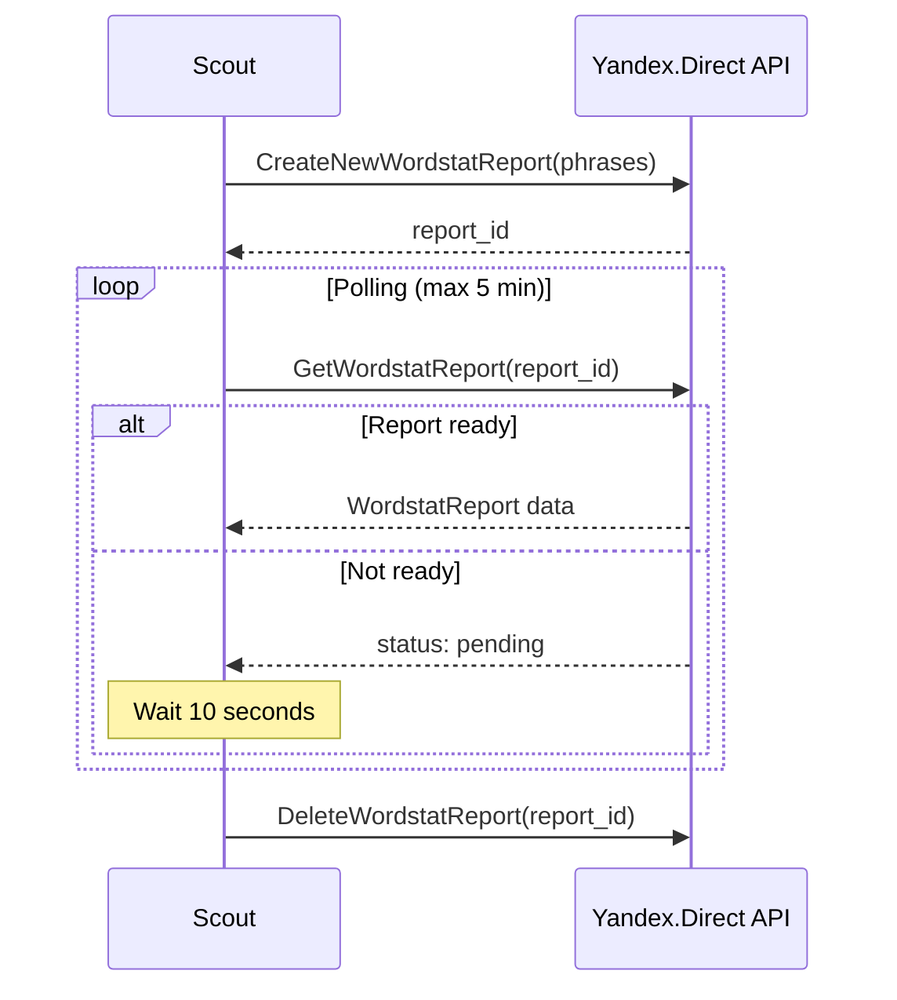

# ADOLF SCOUT — Раздел 2: Data Sources

**Проект:** Предиктивная аналитика товарных ниш  
**Модуль:** Scout / Data Sources  
**Версия:** 1.0  
**Дата:** Январь 2026

---

## 2.1 Обзор источников данных

### Карта источников

```mermaid
graph TB
    subgraph SCOUT["Scout Module"]
        TREND["Trend Miner"]
        COMP["Competitor Analyzer"]
        UNIT["Unit Calculator"]
    end

    subgraph INTERNAL["Внутренние источники"]
        WATCHER["ADOLF Watcher"]
        PG["PostgreSQL<br/>(настройки)"]
    end

    subgraph YANDEX["Яндекс"]
        WORDSTAT["Wordstat API"]
        YM_ANAL["YM Analytics"]
    end

    subgraph MARKETPLACES["Маркетплейсы"]
        WB_ANAL["WB Analytics"]
        OZON_ANAL["Ozon Seller Analytics"]
    end

    subgraph EXTERNAL["Внешние сервисы"]
        SIMILAR["SimilarWeb"]
        SERPSTAT["Serpstat"]
        KEYS["Keys.so"]
    end

    TREND --> WORDSTAT
    TREND --> WB_ANAL
    TREND --> OZON_ANAL
    TREND --> YM_ANAL
    TREND --> SIMILAR
    TREND --> SERPSTAT
    TREND --> KEYS

    COMP --> WATCHER

    UNIT --> PG
    UNIT --> WATCHER
```



### Сводная таблица источников

| Источник | Тип данных | Метод | Приоритет | Обязательность |
|----------|------------|-------|:---------:|:--------------:|
| ADOLF Watcher | Цены, конкуренты, ТОП-50 | REST API | 1 | ✅ Обязательно |
| Яндекс.Wordstat | Частотность запросов | API / Парсинг | 2 | ✅ Обязательно |
| Ozon Seller Analytics | Тренды категорий | REST API | 3 | Желательно |
| WB Analytics | Статистика категорий | Парсинг | 4 | Желательно |
| YM Analytics | Тренды категорий | REST API | 5 | Желательно |
| SimilarWeb | Поисковые тренды | REST API | 6 | Опционально |
| Serpstat | SEO-аналитика | REST API | 7 | Опционально |
| Keys.so | Ключевые слова | REST API | 8 | Опционально |

---

## 2.2 ADOLF Watcher (внутренний)

### 2.2.1 Назначение

Основной источник данных о конкурентах, ценах и структуре категорий маркетплейсов.

### 2.2.2 Используемые endpoints

| Endpoint | Метод | Описание |
|----------|-------|----------|
| `/api/v1/watcher/category/analysis` | GET | Агрегированный анализ категории |
| `/api/v1/watcher/prices/aggregated` | GET | Агрегированные цены по категории |
| `/api/v1/watcher/competitors/top` | GET | ТОП продавцов в категории |
| `/api/v1/watcher/search/results` | GET | Результаты поисковой выдачи |

### 2.2.3 Endpoint: Category Analysis

**Запрос:**

```http
GET /api/v1/watcher/category/analysis?category_url={url}&marketplace={mp}
Authorization: Bearer {token}
```

**Параметры:**

| Параметр | Тип | Обязательный | Описание |
|----------|-----|:------------:|----------|
| `category_url` | string | Да* | URL категории на маркетплейсе |
| `search_query` | string | Да* | Поисковый запрос (альтернатива URL) |
| `marketplace` | string | Да | `wildberries`, `ozon`, `yandex_market` |
| `limit` | int | Нет | Количество товаров для анализа (default: 50) |

*Один из параметров обязателен

**Ответ:**

```json
{
  "success": true,
  "data": {
    "marketplace": "wildberries",
    "category": "Платья",
    "category_url": "https://www.wildberries.ru/catalog/zhenshchinam/odezhda/platya",
    "analyzed_at": "2026-01-21T08:00:00Z",
    "products_count": 50,
    
    "price_stats": {
      "avg": 2450.00,
      "median": 2200.00,
      "min": 890.00,
      "max": 8900.00,
      "std": 1250.00,
      "percentile_25": 1500.00,
      "percentile_75": 3200.00
    },
    
    "sellers": [
      {
        "name": "BrandX Official",
        "products_in_top": 12,
        "share": 0.24,
        "avg_position": 8.5,
        "avg_price": 2800.00,
        "avg_rating": 4.7
      },
      {
        "name": "FashionStore",
        "products_in_top": 8,
        "share": 0.16,
        "avg_position": 15.2,
        "avg_price": 2100.00,
        "avg_rating": 4.5
      }
    ],
    
    "quality_stats": {
      "avg_rating": 4.52,
      "avg_reviews_count": 245,
      "products_rating_above_4_5": 32,
      "products_with_photos": 48,
      "products_with_video": 12
    },
    
    "competition_metrics": {
      "monopoly_rate": 0.52,
      "herfindahl_index": 0.15,
      "top_3_share": 0.52,
      "top_10_share": 0.78,
      "unique_sellers": 28
    }
  }
}
```

### 2.2.4 Endpoint: Search Results

**Запрос:**

```http
GET /api/v1/watcher/search/results?query={query}&marketplace={mp}&limit=50
Authorization: Bearer {token}
```

**Ответ:**

```json
{
  "success": true,
  "data": {
    "query": "летнее платье",
    "marketplace": "wildberries",
    "total_found": 15420,
    "analyzed": 50,
    
    "products": [
      {
        "position": 1,
        "sku": "12345678",
        "title": "Платье летнее женское",
        "seller": "BrandX Official",
        "price": 2490.00,
        "old_price": 3500.00,
        "discount_pct": 29,
        "rating": 4.8,
        "reviews_count": 1250,
        "in_stock": true,
        "delivery_days": 2
      }
    ],
    
    "price_distribution": {
      "under_1000": 5,
      "1000_2000": 18,
      "2000_3000": 15,
      "3000_5000": 8,
      "above_5000": 4
    }
  }
}
```

### 2.2.5 Клиент Watcher API

```python
# integrations/watcher_client.py

from typing import Optional, Dict, Any
from dataclasses import dataclass
import httpx

@dataclass
class WatcherConfig:
    """Конфигурация клиента Watcher."""
    base_url: str = "http://middleware:8000"
    timeout: int = 30
    retry_count: int = 3


class WatcherClient:
    """Клиент для взаимодействия с Watcher API."""
    
    def __init__(self, config: WatcherConfig, auth_token: str):
        self.config = config
        self.auth_token = auth_token
        self.client = httpx.AsyncClient(
            base_url=config.base_url,
            timeout=config.timeout,
            headers={"Authorization": f"Bearer {auth_token}"}
        )
    
    async def get_category_analysis(
        self,
        marketplace: str,
        category_url: Optional[str] = None,
        search_query: Optional[str] = None,
        limit: int = 50
    ) -> Dict[str, Any]:
        """
        Получение анализа категории.
        
        Args:
            marketplace: Код маркетплейса
            category_url: URL категории
            search_query: Поисковый запрос
            limit: Количество товаров для анализа
            
        Returns:
            Данные анализа категории
        """
        params = {
            "marketplace": marketplace,
            "limit": limit
        }
        
        if category_url:
            params["category_url"] = category_url
        elif search_query:
            params["search_query"] = search_query
        else:
            raise ValueError("Either category_url or search_query required")
        
        response = await self.client.get(
            "/api/v1/watcher/category/analysis",
            params=params
        )
        response.raise_for_status()
        
        return response.json()
    
    async def get_price_aggregation(
        self,
        marketplace: str,
        category_url: str
    ) -> Dict[str, Any]:
        """Получение агрегированных цен."""
        response = await self.client.get(
            "/api/v1/watcher/prices/aggregated",
            params={
                "marketplace": marketplace,
                "category_url": category_url
            }
        )
        response.raise_for_status()
        return response.json()
    
    async def get_top_sellers(
        self,
        marketplace: str,
        category_url: str,
        limit: int = 20
    ) -> Dict[str, Any]:
        """Получение ТОП продавцов."""
        response = await self.client.get(
            "/api/v1/watcher/competitors/top",
            params={
                "marketplace": marketplace,
                "category_url": category_url,
                "limit": limit
            }
        )
        response.raise_for_status()
        return response.json()
    
    async def close(self):
        """Закрытие клиента."""
        await self.client.aclose()
```

---

## 2.3 Яндекс.Wordstat

### 2.3.1 Назначение

Основной источник данных о частотности поисковых запросов и трендах спроса.

### 2.3.2 Методы получения данных

| Метод | Описание | Ограничения |
|-------|----------|-------------|
| **Direct API** | Официальный API Яндекс.Директ | Требуется аккаунт Директа, лимиты |
| **Парсинг через Watcher** | Использование агентов Watcher | Ночное время, риск блокировки |

### 2.3.3 Direct API (Яндекс.Директ)

**Endpoint:** `https://api.direct.yandex.com/json/v5/`

**Метод:** `KeywordsResearch` → `GetWordstatReport`

**Процесс:**



**Запрос создания отчёта:**

```json
{
  "method": "CreateNewWordstatReport",
  "params": {
    "Phrases": ["летнее платье", "платье женское"],
    "GeoID": [225],
    "Device": ["mobile", "desktop", "tablet"]
  }
}
```

**Ответ отчёта:**

```json
{
  "data": [
    {
      "Phrase": "летнее платье",
      "SearchedWith": [
        {"Phrase": "летнее платье купить", "Shows": 45000},
        {"Phrase": "летнее платье 2026", "Shows": 12000}
      ],
      "SearchedAlso": [
        {"Phrase": "сарафан летний", "Shows": 38000}
      ],
      "Shows": 125000
    }
  ]
}
```

### 2.3.4 Парсинг через Watcher Agent

Для случаев, когда Direct API недоступен или требуется исторические данные.

**Процесс:**

1. Scout формирует задачу для Watcher
2. Watcher Agent ночью парсит wordstat.yandex.ru
3. Данные сохраняются в `scout_trend_cache`
4. Scout использует кэшированные данные

**Структура задачи для Watcher:**

```python
@dataclass
class WordstatTask:
    """Задача парсинга Wordstat."""
    task_type: str = "wordstat"
    phrases: List[str]
    regions: List[int] = field(default_factory=lambda: [225])  # Россия
    period_months: int = 3
    priority: int = 50
```

### 2.3.5 Клиент Wordstat

```python
# integrations/wordstat_client.py

from typing import List, Dict, Optional
from dataclasses import dataclass
from datetime import datetime, timedelta
import httpx

@dataclass
class WordstatData:
    """Данные из Wordstat."""
    phrase: str
    total_shows: int
    monthly_data: List[Dict[str, int]]  # [{month: shows}, ...]
    related_phrases: List[Dict[str, int]]
    collected_at: datetime


class WordstatClient:
    """Клиент для получения данных Wordstat."""
    
    DIRECT_API_URL = "https://api.direct.yandex.com/json/v5/"
    
    def __init__(
        self,
        oauth_token: str,
        client_login: Optional[str] = None,
        use_sandbox: bool = False
    ):
        self.oauth_token = oauth_token
        self.client_login = client_login
        self.use_sandbox = use_sandbox
        
        self.client = httpx.AsyncClient(
            headers={
                "Authorization": f"Bearer {oauth_token}",
                "Accept-Language": "ru",
                "Content-Type": "application/json"
            },
            timeout=60
        )
    
    async def get_wordstat_data(
        self,
        phrases: List[str],
        geo_ids: List[int] = [225]
    ) -> List[WordstatData]:
        """
        Получение данных Wordstat через Direct API.
        
        Args:
            phrases: Список фраз для анализа
            geo_ids: ID регионов (225 = Россия)
            
        Returns:
            Список данных по фразам
        """
        # Создание отчёта
        report_id = await self._create_report(phrases, geo_ids)
        
        # Ожидание готовности
        report_data = await self._wait_for_report(report_id)
        
        # Удаление отчёта
        await self._delete_report(report_id)
        
        # Преобразование данных
        return self._parse_report(report_data)
    
    async def _create_report(
        self,
        phrases: List[str],
        geo_ids: List[int]
    ) -> int:
        """Создание отчёта Wordstat."""
        payload = {
            "method": "CreateNewWordstatReport",
            "params": {
                "Phrases": phrases[:10],  # Лимит 10 фраз
                "GeoID": geo_ids
            }
        }
        
        response = await self.client.post(
            self.DIRECT_API_URL,
            json=payload
        )
        response.raise_for_status()
        
        data = response.json()
        return data["data"]
    
    async def _wait_for_report(
        self,
        report_id: int,
        max_attempts: int = 30,
        interval: int = 10
    ) -> Dict:
        """Ожидание готовности отчёта."""
        import asyncio
        
        for _ in range(max_attempts):
            payload = {
                "method": "GetWordstatReport",
                "params": {"ReportID": report_id}
            }
            
            response = await self.client.post(
                self.DIRECT_API_URL,
                json=payload
            )
            
            data = response.json()
            
            if "data" in data and data["data"]:
                return data["data"]
            
            await asyncio.sleep(interval)
        
        raise TimeoutError(f"Wordstat report {report_id} not ready")
    
    async def _delete_report(self, report_id: int):
        """Удаление отчёта."""
        payload = {
            "method": "DeleteWordstatReport",
            "params": {"ReportID": report_id}
        }
        
        await self.client.post(
            self.DIRECT_API_URL,
            json=payload
        )
    
    def _parse_report(self, report_data: List[Dict]) -> List[WordstatData]:
        """Парсинг данных отчёта."""
        results = []
        
        for item in report_data:
            results.append(WordstatData(
                phrase=item["Phrase"],
                total_shows=item.get("Shows", 0),
                monthly_data=[],  # Требует дополнительного запроса
                related_phrases=[
                    {"phrase": r["Phrase"], "shows": r["Shows"]}
                    for r in item.get("SearchedWith", [])[:20]
                ],
                collected_at=datetime.utcnow()
            ))
        
        return results
    
    async def close(self):
        """Закрытие клиента."""
        await self.client.aclose()
```

### 2.3.6 Исторические данные (Wordstat History)

Для получения помесячной динамики используется отдельный endpoint.

```python
async def get_wordstat_history(
    self,
    phrase: str,
    months: int = 3
) -> List[Dict[str, int]]:
    """
    Получение истории запросов по месяцам.
    
    Returns:
        [{"month": "2025-11", "shows": 45000}, ...]
    """
    # Wordstat History API или парсинг
    # ...
```

---

## 2.4 Ozon Seller Analytics

### 2.4.1 Назначение

Получение статистики категорий и трендов на Ozon.

### 2.4.2 API Endpoints

| Endpoint | Описание |
|----------|----------|
| `/v1/analytics/data` | Аналитика продаж |
| `/v2/category/tree` | Дерево категорий |
| `/v1/analytics/stock_on_warehouses` | Остатки на складах |

### 2.4.3 Получение трендов категории

**Запрос:**

```http
POST https://api-seller.ozon.ru/v1/analytics/data
Content-Type: application/json
Client-Id: {client_id}
Api-Key: {api_key}

{
  "date_from": "2025-10-01",
  "date_to": "2026-01-01",
  "metrics": ["ordered_units", "revenue", "returns"],
  "dimension": ["category1", "category2"],
  "filters": [
    {
      "key": "category1",
      "value": "Одежда"
    }
  ],
  "limit": 1000,
  "offset": 0
}
```

**Ответ:**

```json
{
  "result": {
    "data": [
      {
        "dimensions": [
          {"id": "category1", "name": "Одежда"},
          {"id": "category2", "name": "Платья"}
        ],
        "metrics": [15420, 38550000, 1230]
      }
    ],
    "totals": [154200, 385500000, 12300]
  }
}
```

### 2.4.4 Клиент Ozon Analytics

```python
# integrations/ozon_analytics.py

from typing import List, Dict, Optional
from dataclasses import dataclass
from datetime import date
import httpx

@dataclass
class OzonTrendData:
    """Данные о трендах Ozon."""
    category: str
    subcategory: Optional[str]
    period_start: date
    period_end: date
    ordered_units: int
    revenue: float
    returns: int
    avg_price: float


class OzonAnalyticsClient:
    """Клиент Ozon Seller Analytics API."""
    
    BASE_URL = "https://api-seller.ozon.ru"
    
    def __init__(self, client_id: str, api_key: str):
        self.client_id = client_id
        self.api_key = api_key
        
        self.client = httpx.AsyncClient(
            base_url=self.BASE_URL,
            headers={
                "Client-Id": client_id,
                "Api-Key": api_key,
                "Content-Type": "application/json"
            },
            timeout=30
        )
    
    async def get_category_trends(
        self,
        category: str,
        date_from: date,
        date_to: date,
        subcategory: Optional[str] = None
    ) -> List[OzonTrendData]:
        """
        Получение трендов по категории.
        
        Args:
            category: Название категории
            date_from: Начало периода
            date_to: Конец периода
            subcategory: Подкатегория (опционально)
        """
        filters = [{"key": "category1", "value": category}]
        if subcategory:
            filters.append({"key": "category2", "value": subcategory})
        
        payload = {
            "date_from": date_from.isoformat(),
            "date_to": date_to.isoformat(),
            "metrics": ["ordered_units", "revenue", "returns"],
            "dimension": ["category1", "category2", "day"],
            "filters": filters,
            "limit": 1000,
            "offset": 0
        }
        
        response = await self.client.post(
            "/v1/analytics/data",
            json=payload
        )
        response.raise_for_status()
        
        return self._parse_trends(response.json(), date_from, date_to)
    
    async def get_category_tree(self) -> Dict:
        """Получение дерева категорий."""
        response = await self.client.post(
            "/v2/category/tree",
            json={"language": "RU"}
        )
        response.raise_for_status()
        return response.json()
    
    def _parse_trends(
        self,
        data: Dict,
        date_from: date,
        date_to: date
    ) -> List[OzonTrendData]:
        """Парсинг данных трендов."""
        results = []
        
        for item in data.get("result", {}).get("data", []):
            dimensions = {d["id"]: d["name"] for d in item["dimensions"]}
            metrics = item["metrics"]
            
            results.append(OzonTrendData(
                category=dimensions.get("category1", ""),
                subcategory=dimensions.get("category2"),
                period_start=date_from,
                period_end=date_to,
                ordered_units=metrics[0] if len(metrics) > 0 else 0,
                revenue=metrics[1] if len(metrics) > 1 else 0,
                returns=metrics[2] if len(metrics) > 2 else 0,
                avg_price=metrics[1] / metrics[0] if metrics[0] > 0 else 0
            ))
        
        return results
    
    async def close(self):
        await self.client.aclose()
```

---

## 2.5 Wildberries Analytics

### 2.5.1 Назначение

Получение статистики категорий на Wildberries.

### 2.5.2 Методы получения

| Метод | Описание | Статус |
|-------|----------|--------|
| **Seller API** | Официальный API продавца | Ограниченные данные |
| **Парсинг** | Через Watcher Agent | Полные данные |

### 2.5.3 Seller API (ограниченный)

WB Seller API не предоставляет публичной аналитики категорий. Доступны только данные по собственным товарам.

**Доступные endpoints:**

| Endpoint | Данные |
|----------|--------|
| `/api/v1/supplier/stocks` | Остатки |
| `/api/v1/supplier/orders` | Заказы |
| `/api/v1/supplier/sales` | Продажи |

### 2.5.4 Парсинг через Watcher Agent

Для получения публичной статистики категорий используется парсинг.

**Целевые страницы:**

| URL | Данные |
|-----|--------|
| `/catalog/{category}` | Количество товаров, ценовой диапазон |
| `/catalog/{category}?sort=popular` | ТОП товаров |
| `/brands/{brand}` | Статистика бренда |

**Структура задачи:**

```python
@dataclass
class WBCategoryTask:
    """Задача парсинга категории WB."""
    task_type: str = "wb_category_stats"
    category_url: str
    collect_top: int = 50
    collect_price_distribution: bool = True
    priority: int = 50
```

### 2.5.5 Клиент WB Analytics

```python
# integrations/wb_analytics.py

from typing import Dict, Optional
from dataclasses import dataclass
from datetime import datetime
import httpx

@dataclass
class WBCategoryStats:
    """Статистика категории WB."""
    category_url: str
    category_name: str
    total_products: int
    price_min: float
    price_max: float
    price_avg: float
    brands_count: int
    sellers_count: int
    collected_at: datetime


class WBAnalyticsClient:
    """Клиент для аналитики Wildberries."""
    
    def __init__(self, watcher_client):
        """
        Args:
            watcher_client: Клиент Watcher для парсинга
        """
        self.watcher = watcher_client
    
    async def get_category_stats(
        self,
        category_url: str
    ) -> WBCategoryStats:
        """
        Получение статистики категории.
        
        Данные берутся из кэша Watcher или запрашиваются свежие.
        """
        # Проверка кэша
        cached = await self._get_from_cache(category_url)
        if cached:
            return cached
        
        # Запрос свежих данных через Watcher
        data = await self.watcher.get_category_analysis(
            marketplace="wildberries",
            category_url=category_url
        )
        
        return WBCategoryStats(
            category_url=category_url,
            category_name=data["data"]["category"],
            total_products=data["data"]["products_count"],
            price_min=data["data"]["price_stats"]["min"],
            price_max=data["data"]["price_stats"]["max"],
            price_avg=data["data"]["price_stats"]["avg"],
            brands_count=len(set(s["name"] for s in data["data"]["sellers"])),
            sellers_count=data["data"]["competition_metrics"]["unique_sellers"],
            collected_at=datetime.utcnow()
        )
    
    async def _get_from_cache(
        self,
        category_url: str
    ) -> Optional[WBCategoryStats]:
        """Получение из кэша."""
        # Реализация кэширования
        pass
```

---

## 2.6 Яндекс.Маркет Analytics

### 2.6.1 Назначение

Получение статистики и трендов категорий на Яндекс.Маркете.

### 2.6.2 API Endpoints

| Endpoint | Описание |
|----------|----------|
| `/businesses/{id}/offer-mappings` | Маппинг товаров |
| `/businesses/{id}/stats/skus` | Статистика SKU |
| `/categories` | Дерево категорий |

### 2.6.3 Клиент YM Analytics

```python
# integrations/ym_analytics.py

from typing import List, Dict, Optional
from dataclasses import dataclass
from datetime import date
import httpx

@dataclass
class YMCategoryData:
    """Данные категории Яндекс.Маркета."""
    category_id: int
    category_name: str
    products_count: int
    avg_price: float
    price_range: tuple


class YMAnalyticsClient:
    """Клиент Яндекс.Маркет Analytics API."""
    
    BASE_URL = "https://api.partner.market.yandex.ru"
    
    def __init__(self, oauth_token: str, campaign_id: int):
        self.oauth_token = oauth_token
        self.campaign_id = campaign_id
        
        self.client = httpx.AsyncClient(
            base_url=self.BASE_URL,
            headers={
                "Authorization": f"OAuth {oauth_token}",
                "Content-Type": "application/json"
            },
            timeout=30
        )
    
    async def get_categories(self) -> List[Dict]:
        """Получение дерева категорий."""
        response = await self.client.get("/categories")
        response.raise_for_status()
        return response.json().get("result", {}).get("categories", [])
    
    async def get_category_stats(
        self,
        category_id: int
    ) -> YMCategoryData:
        """Получение статистики категории."""
        # YM не предоставляет публичной статистики категорий
        # Данные получаются через парсинг или оценки
        pass
    
    async def close(self):
        await self.client.aclose()
```

---

## 2.7 Внешние сервисы

### 2.7.1 SimilarWeb

**Назначение:** Анализ трафика и поисковых трендов.

**API:** `https://api.similarweb.com/v1/`

```python
# integrations/external_services.py

class SimilarWebClient:
    """Клиент SimilarWeb API."""
    
    BASE_URL = "https://api.similarweb.com/v1"
    
    def __init__(self, api_key: str):
        self.api_key = api_key
        self.client = httpx.AsyncClient(
            base_url=self.BASE_URL,
            params={"api_key": api_key},
            timeout=30
        )
    
    async def get_keyword_analysis(
        self,
        keyword: str,
        country: str = "ru"
    ) -> Dict:
        """Анализ ключевого слова."""
        response = await self.client.get(
            f"/keywords/{keyword}/analysis",
            params={"country": country}
        )
        response.raise_for_status()
        return response.json()
    
    async def get_search_trends(
        self,
        keyword: str,
        country: str = "ru",
        months: int = 3
    ) -> List[Dict]:
        """Тренды поисковых запросов."""
        response = await self.client.get(
            f"/keywords/{keyword}/trends",
            params={
                "country": country,
                "granularity": "monthly",
                "months": months
            }
        )
        response.raise_for_status()
        return response.json().get("data", [])
```

### 2.7.2 Serpstat

**Назначение:** SEO-аналитика и анализ ключевых слов.

**API:** `https://api.serpstat.com/v4/`

```python
class SerpstatClient:
    """Клиент Serpstat API."""
    
    BASE_URL = "https://api.serpstat.com/v4"
    
    def __init__(self, api_key: str):
        self.api_key = api_key
        self.client = httpx.AsyncClient(
            base_url=self.BASE_URL,
            headers={"Authorization": f"Bearer {api_key}"},
            timeout=30
        )
    
    async def get_keyword_info(
        self,
        keyword: str,
        search_engine: str = "g_ru"  # Google Russia
    ) -> Dict:
        """Информация о ключевом слове."""
        response = await self.client.get(
            "/keyword_info",
            params={
                "keyword": keyword,
                "se": search_engine
            }
        )
        response.raise_for_status()
        return response.json()
    
    async def get_keyword_trends(
        self,
        keyword: str,
        search_engine: str = "g_ru"
    ) -> List[Dict]:
        """Тренды ключевого слова."""
        response = await self.client.get(
            "/keyword_trends",
            params={
                "keyword": keyword,
                "se": search_engine
            }
        )
        response.raise_for_status()
        return response.json().get("result", [])
```

### 2.7.3 Keys.so

**Назначение:** Анализ ключевых слов для e-commerce.

```python
class KeysClient:
    """Клиент Keys.so API."""
    
    BASE_URL = "https://api.keys.so/v1"
    
    def __init__(self, api_key: str):
        self.api_key = api_key
        self.client = httpx.AsyncClient(
            base_url=self.BASE_URL,
            headers={"X-API-Key": api_key},
            timeout=30
        )
    
    async def get_keyword_data(
        self,
        keyword: str,
        region: str = "ru"
    ) -> Dict:
        """Данные по ключевому слову."""
        response = await self.client.get(
            "/keywords/info",
            params={
                "keyword": keyword,
                "region": region
            }
        )
        response.raise_for_status()
        return response.json()
```

---

## 2.8 Агрегация данных

### 2.8.1 Стратегия агрегации

```mermaid
flowchart TB
    subgraph SOURCES["Источники"]
        S1["Wordstat"]
        S2["Ozon Analytics"]
        S3["WB (Watcher)"]
        S4["External"]
    end
    
    subgraph COLLECT["Сбор"]
        C1["Async gather"]
        TIMEOUT["Timeout 30s"]
    end
    
    subgraph PROCESS["Обработка"]
        NORMALIZE["Нормализация"]
        WEIGHT["Взвешивание"]
        MERGE["Объединение"]
    end
    
    subgraph OUTPUT["Результат"]
        TREND["TrendResult"]
    end
    
    S1 --> C1
    S2 --> C1
    S3 --> C1
    S4 --> C1
    
    C1 --> TIMEOUT
    TIMEOUT --> NORMALIZE
    NORMALIZE --> WEIGHT
    WEIGHT --> MERGE
    MERGE --> TREND
```



### 2.8.2 Веса источников

| Источник | Вес | Обоснование |
|----------|:---:|-------------|
| Яндекс.Wordstat | 0.35 | Основной источник поисковых трендов |
| Ozon Analytics | 0.25 | Прямые данные маркетплейса |
| WB (Watcher) | 0.25 | Прямые данные маркетплейса |
| SimilarWeb | 0.10 | Дополнительный источник |
| Serpstat / Keys | 0.05 | Вспомогательные данные |

### 2.8.3 Реализация агрегатора

```python
# services/trend_miner.py

from typing import List, Dict, Optional
from dataclasses import dataclass
import asyncio

@dataclass
class SourceWeight:
    """Вес источника данных."""
    source: str
    weight: float
    is_required: bool = False


class TrendAggregator:
    """Агрегатор данных о трендах."""
    
    SOURCE_WEIGHTS = [
        SourceWeight("wordstat", 0.35, is_required=True),
        SourceWeight("ozon_analytics", 0.25, is_required=False),
        SourceWeight("wb_analytics", 0.25, is_required=False),
        SourceWeight("similarweb", 0.10, is_required=False),
        SourceWeight("serpstat", 0.05, is_required=False),
    ]
    
    def __init__(
        self,
        wordstat_client,
        ozon_client,
        wb_client,
        external_clients: Dict
    ):
        self.wordstat = wordstat_client
        self.ozon = ozon_client
        self.wb = wb_client
        self.external = external_clients
    
    async def collect_trend_data(
        self,
        query: str,
        marketplaces: List[str],
        timeout: int = 30
    ) -> Dict[str, any]:
        """
        Сбор данных о трендах из всех источников.
        
        Args:
            query: Поисковый запрос
            marketplaces: Список маркетплейсов
            timeout: Таймаут в секундах
            
        Returns:
            Агрегированные данные
        """
        tasks = []
        source_names = []
        
        # Wordstat (обязательный)
        tasks.append(self._collect_wordstat(query))
        source_names.append("wordstat")
        
        # Ozon Analytics
        if "ozon" in marketplaces:
            tasks.append(self._collect_ozon(query))
            source_names.append("ozon_analytics")
        
        # WB Analytics
        if "wildberries" in marketplaces:
            tasks.append(self._collect_wb(query))
            source_names.append("wb_analytics")
        
        # External
        if self.external.get("similarweb"):
            tasks.append(self._collect_similarweb(query))
            source_names.append("similarweb")
        
        # Параллельный сбор с таймаутом
        results = await asyncio.gather(
            *tasks,
            return_exceptions=True
        )
        
        # Обработка результатов
        collected_data = {}
        for name, result in zip(source_names, results):
            if isinstance(result, Exception):
                collected_data[name] = {"error": str(result)}
            else:
                collected_data[name] = result
        
        return self._aggregate(collected_data)
    
    def _aggregate(self, data: Dict) -> Dict:
        """Агрегация данных с учётом весов."""
        trend_values = []
        total_weight = 0
        
        for source_config in self.SOURCE_WEIGHTS:
            source_data = data.get(source_config.source)
            
            if source_data and "error" not in source_data:
                trend_value = source_data.get("trend_slope", 0)
                trend_values.append((trend_value, source_config.weight))
                total_weight += source_config.weight
        
        if total_weight == 0:
            return {"trend_slope": 0, "confidence": 0}
        
        # Взвешенное среднее
        weighted_sum = sum(v * w for v, w in trend_values)
        avg_trend = weighted_sum / total_weight
        
        # Уверенность = доля собранных данных
        confidence = total_weight / sum(s.weight for s in self.SOURCE_WEIGHTS)
        
        return {
            "trend_slope": round(avg_trend, 4),
            "confidence": round(confidence, 2),
            "sources_used": [n for n, d in data.items() if "error" not in d],
            "sources_failed": [n for n, d in data.items() if "error" in d]
        }
    
    async def _collect_wordstat(self, query: str) -> Dict:
        """Сбор данных Wordstat."""
        data = await self.wordstat.get_wordstat_data([query])
        if not data:
            return {"error": "No data"}
        
        # Расчёт trend_slope из помесячных данных
        # ...
        return {"trend_slope": 0.12, "total_shows": data[0].total_shows}
    
    async def _collect_ozon(self, query: str) -> Dict:
        """Сбор данных Ozon."""
        # ...
        pass
    
    async def _collect_wb(self, query: str) -> Dict:
        """Сбор данных WB."""
        # ...
        pass
    
    async def _collect_similarweb(self, query: str) -> Dict:
        """Сбор данных SimilarWeb."""
        # ...
        pass
```

---

## 2.9 Кэширование

### 2.9.1 Стратегия кэширования

| Данные | Хранилище | TTL | Ключ |
|--------|-----------|-----|------|
| Тренды Wordstat | Redis | 24 часа | `scout:trend:wordstat:{query_hash}` |
| Статистика категорий | Redis | 12 часов | `scout:category:{url_hash}` |
| Ставки МП | Redis | 1 час | `scout:rates:{marketplace}` |
| Дерево категорий | Redis | 7 дней | `scout:categories:{marketplace}` |
| Внешние сервисы | Redis | 7 дней | `scout:external:{service}:{query_hash}` |

### 2.9.2 Реализация кэша

```python
# utils/cache.py

import hashlib
import json
from typing import Optional, Any
from datetime import timedelta
import redis.asyncio as redis

class ScoutCache:
    """Кэш для модуля Scout."""
    
    def __init__(self, redis_client: redis.Redis):
        self.redis = redis_client
    
    def _make_key(self, prefix: str, *args) -> str:
        """Создание ключа кэша."""
        data = ":".join(str(a) for a in args)
        hash_value = hashlib.md5(data.encode()).hexdigest()[:12]
        return f"scout:{prefix}:{hash_value}"
    
    async def get(self, prefix: str, *args) -> Optional[Any]:
        """Получение из кэша."""
        key = self._make_key(prefix, *args)
        data = await self.redis.get(key)
        
        if data:
            return json.loads(data)
        return None
    
    async def set(
        self,
        prefix: str,
        *args,
        value: Any,
        ttl: timedelta
    ):
        """Сохранение в кэш."""
        key = self._make_key(prefix, *args)
        await self.redis.setex(
            key,
            ttl,
            json.dumps(value, default=str)
        )
    
    async def delete(self, prefix: str, *args):
        """Удаление из кэша."""
        key = self._make_key(prefix, *args)
        await self.redis.delete(key)
    
    async def get_trend(self, query: str) -> Optional[Dict]:
        """Получение кэшированного тренда."""
        return await self.get("trend", query)
    
    async def set_trend(self, query: str, data: Dict):
        """Сохранение тренда."""
        await self.set("trend", query, value=data, ttl=timedelta(hours=24))
    
    async def get_category(self, url: str) -> Optional[Dict]:
        """Получение кэшированной категории."""
        return await self.get("category", url)
    
    async def set_category(self, url: str, data: Dict):
        """Сохранение категории."""
        await self.set("category", url, value=data, ttl=timedelta(hours=12))
```

---

## 2.10 Обработка ошибок

### 2.10.1 Типы ошибок

| Ошибка | Причина | Действие |
|--------|---------|----------|
| `SourceUnavailable` | API источника недоступен | Использовать кэш или пропустить |
| `RateLimitExceeded` | Превышен лимит запросов | Retry с backoff |
| `AuthenticationError` | Невалидный токен | Уведомить Admin |
| `DataParseError` | Ошибка парсинга ответа | Логировать, пропустить источник |
| `TimeoutError` | Таймаут запроса | Использовать кэш |

### 2.10.2 Retry-стратегия

```python
from tenacity import retry, stop_after_attempt, wait_exponential

@retry(
    stop=stop_after_attempt(3),
    wait=wait_exponential(multiplier=1, min=2, max=10)
)
async def fetch_with_retry(client, endpoint, **kwargs):
    """Запрос с повторными попытками."""
    return await client.get(endpoint, **kwargs)
```

### 2.10.3 Graceful Degradation

```python
async def collect_data_safe(self, query: str) -> Dict:
    """
    Сбор данных с graceful degradation.
    
    Если основные источники недоступны, используем кэш.
    Если кэш пуст — возвращаем частичные данные.
    """
    try:
        return await self.collect_data(query)
    except SourceUnavailable as e:
        # Попытка использовать кэш
        cached = await self.cache.get_trend(query)
        if cached:
            cached["from_cache"] = True
            return cached
        
        # Минимальный ответ
        return {
            "trend_slope": None,
            "confidence": 0,
            "error": str(e),
            "sources_used": []
        }
```

---

**Документ подготовлен:** Январь 2026  
**Версия:** 1.0  
**Статус:** Черновик
