# ADOLF SCOUT — Раздел 3: AI Pipeline

**Проект:** Предиктивная аналитика товарных ниш  
**Модуль:** Scout / AI Pipeline  
**Версия:** 1.0  
**Дата:** Январь 2026

---

## 3.1 Обзор AI Pipeline

### Архитектура pipeline

```mermaid
flowchart TB
    subgraph INPUT["Входные данные"]
        USER_INPUT["Запрос пользователя"]
        COGS["Закупочная цена"]
    end

    subgraph STAGE1["Этап 1: Парсинг"]
        PARSER["Input Parser"]
    end

    subgraph STAGE2["Этап 2: Сбор данных"]
        TREND["Trend Miner<br/>(GPT-5 mini)"]
        COMP["Competitor Analyzer<br/>(GPT-5 mini)"]
        UNIT["Unit Calculator"]
    end

    subgraph STAGE3["Этап 3: Анализ"]
        METRICS["Metrics Aggregator"]
        CLASSIFY["Status Classifier"]
    end

    subgraph STAGE4["Этап 4: Вердикт"]
        VERDICT["AI Verdict Engine<br/>(Claude Opus 4.5)"]
    end

    subgraph OUTPUT["Результат"]
        RESULT["VerdictResult"]
    end

    USER_INPUT --> PARSER
    COGS --> PARSER
    
    PARSER --> TREND
    PARSER --> COMP
    PARSER --> UNIT
    
    TREND --> METRICS
    COMP --> METRICS
    UNIT --> METRICS
    
    METRICS --> CLASSIFY
    CLASSIFY --> VERDICT
    
    VERDICT --> RESULT
```



### Распределение AI-моделей

| Этап | Модель | Назначение | Tokens/запрос |
|------|--------|------------|:-------------:|
| Trend Mining | GPT-5 mini | Нормализация, агрегация трендов | ~500 |
| Competitor Analysis | GPT-5 mini | Анализ структуры конкурентов | ~800 |
| AI Verdict | Claude Opus 4.5 | Финальный вердикт, рекомендации | ~2000 |

---

## 3.2 Input Parser

### 3.2.1 Назначение

Разбор и нормализация входных данных от пользователя в структурированный формат.

### 3.2.2 Поддерживаемые форматы

```mermaid
flowchart LR
    INPUT["Ввод"] --> DETECT{"Определение типа"}
    
    DETECT -->|URL| URL_BRANCH["URL Parser"]
    DETECT -->|Текст| TEXT_BRANCH["Text Parser"]
    
    URL_BRANCH --> WB_URL{"WB?"}
    URL_BRANCH --> OZON_URL{"Ozon?"}
    URL_BRANCH --> YM_URL{"YM?"}
    
    TEXT_BRANCH --> NLP["NLP + Keywords"]
    
    WB_URL --> EXTRACT["Извлечение параметров"]
    OZON_URL --> EXTRACT
    YM_URL --> EXTRACT
    NLP --> EXTRACT
    
    EXTRACT --> OUTPUT["ParsedInput"]
```



### 3.2.3 Реализация

```python
# services/input_parser.py

import re
from typing import Optional, List, Tuple
from dataclasses import dataclass, field
from urllib.parse import urlparse, parse_qs

@dataclass
class ParsedInput:
    """Разобранный ввод пользователя."""
    marketplaces: List[str]
    query: str
    category_url: Optional[str] = None
    cogs: float = 0.0
    cogs_min: Optional[float] = None
    cogs_max: Optional[float] = None
    raw_input: str = ""
    parse_confidence: float = 1.0


class InputParser:
    """Парсер входных данных пользователя."""
    
    # Паттерны URL
    URL_PATTERNS = {
        "wildberries": {
            "category": r"wildberries\.ru/catalog/([^/\?]+(?:/[^/\?]+)*)",
            "search": r"wildberries\.ru/catalog/0/search\.aspx\?.*search=([^&]+)",
            "product": r"wildberries\.ru/catalog/(\d+)/detail"
        },
        "ozon": {
            "category": r"ozon\.ru/category/([^/\?]+)-(\d+)",
            "search": r"ozon\.ru/search/?\?.*text=([^&]+)",
            "product": r"ozon\.ru/product/[^/]+-(\d+)"
        },
        "yandex_market": {
            "category": r"market\.yandex\.ru/catalog--([^/]+)/(\d+)",
            "search": r"market\.yandex\.ru/search\?.*text=([^&]+)",
            "product": r"market\.yandex\.ru/product/(\d+)"
        }
    }
    
    # Паттерны COGS
    COGS_PATTERNS = [
        r"(?:cogs|себестоимость|закупк[аи]|закупочн\w+\s*цен\w*)[:\s]+(\d+(?:\.\d+)?)",
        r"(\d+(?:\.\d+)?)\s*(?:руб|₽|рублей)",
        r"(?:от\s+)?(\d+)\s*(?:до\s+(\d+))?(?:\s*руб|\s*₽)?",
    ]
    
    # Маркетплейсы в тексте
    MP_KEYWORDS = {
        "wildberries": ["wildberries", "вайлдберриз", "wb", "вб"],
        "ozon": ["ozon", "озон"],
        "yandex_market": ["яндекс.маркет", "яндекс маркет", "yandex market", "ym", "ям"]
    }
    
    def parse(self, user_input: str) -> ParsedInput:
        """
        Парсинг входных данных.
        
        Args:
            user_input: Строка от пользователя
            
        Returns:
            ParsedInput с разобранными данными
        """
        raw_input = user_input.strip()
        
        # Попытка найти URL
        url_result = self._parse_url(raw_input)
        
        # Извлечение COGS
        cogs, cogs_min, cogs_max = self._extract_cogs(raw_input)
        
        if url_result:
            # URL найден
            marketplace, query, category_url = url_result
            return ParsedInput(
                marketplaces=[marketplace],
                query=query,
                category_url=category_url,
                cogs=cogs,
                cogs_min=cogs_min,
                cogs_max=cogs_max,
                raw_input=raw_input,
                parse_confidence=0.95
            )
        else:
            # Текстовый запрос
            marketplaces = self._detect_marketplaces(raw_input)
            query = self._extract_query(raw_input)
            
            return ParsedInput(
                marketplaces=marketplaces if marketplaces else ["wildberries", "ozon", "yandex_market"],
                query=query,
                category_url=None,
                cogs=cogs,
                cogs_min=cogs_min,
                cogs_max=cogs_max,
                raw_input=raw_input,
                parse_confidence=0.8 if marketplaces else 0.6
            )
    
    def _parse_url(self, text: str) -> Optional[Tuple[str, str, str]]:
        """
        Парсинг URL маркетплейса.
        
        Returns:
            (marketplace, query, full_url) или None
        """
        # Поиск URL в тексте
        url_match = re.search(r"https?://[^\s]+", text)
        if not url_match:
            return None
        
        url = url_match.group(0)
        
        for marketplace, patterns in self.URL_PATTERNS.items():
            # Проверка категории
            cat_match = re.search(patterns["category"], url)
            if cat_match:
                query = cat_match.group(1).replace("-", " ").replace("/", " > ")
                return (marketplace, query, url)
            
            # Проверка поиска
            search_match = re.search(patterns["search"], url)
            if search_match:
                from urllib.parse import unquote
                query = unquote(search_match.group(1))
                return (marketplace, query, url)
        
        return None
    
    def _extract_cogs(self, text: str) -> Tuple[float, Optional[float], Optional[float]]:
        """
        Извлечение закупочной цены.
        
        Returns:
            (cogs, cogs_min, cogs_max)
        """
        text_lower = text.lower()
        
        # Паттерн диапазона "от X до Y"
        range_match = re.search(r"от\s+(\d+)\s*(?:до\s+(\d+))?", text_lower)
        if range_match:
            cogs_min = float(range_match.group(1))
            cogs_max = float(range_match.group(2)) if range_match.group(2) else None
            cogs = (cogs_min + cogs_max) / 2 if cogs_max else cogs_min
            return (cogs, cogs_min, cogs_max)
        
        # Простое число с контекстом
        for pattern in self.COGS_PATTERNS:
            match = re.search(pattern, text_lower)
            if match:
                cogs = float(match.group(1))
                return (cogs, None, None)
        
        # Просто число в конце
        number_match = re.search(r"(\d+(?:\.\d+)?)\s*(?:руб|₽|$)", text_lower)
        if number_match:
            return (float(number_match.group(1)), None, None)
        
        return (0.0, None, None)
    
    def _detect_marketplaces(self, text: str) -> List[str]:
        """Определение маркетплейсов в тексте."""
        text_lower = text.lower()
        detected = []
        
        for mp, keywords in self.MP_KEYWORDS.items():
            for keyword in keywords:
                if keyword in text_lower:
                    detected.append(mp)
                    break
        
        return detected
    
    def _extract_query(self, text: str) -> str:
        """Извлечение поискового запроса из текста."""
        # Удаление URL
        text = re.sub(r"https?://[^\s]+", "", text)
        
        # Удаление COGS
        text = re.sub(r"(?:cogs|себестоимость|закупк\w+)[:\s]+\d+[^\s]*", "", text, flags=re.I)
        text = re.sub(r"\d+\s*(?:руб|₽|рублей)", "", text)
        text = re.sub(r"от\s+\d+\s*(?:до\s+\d+)?", "", text)
        
        # Удаление названий маркетплейсов
        for keywords in self.MP_KEYWORDS.values():
            for kw in keywords:
                text = re.sub(rf"\b{kw}\b", "", text, flags=re.I)
        
        # Удаление служебных слов
        stop_words = [
            "проанализируй", "анализ", "оцени", "оценка", "ниш[ауе]",
            "категори[яию]", "товар\w*", "на", "для", "по"
        ]
        for word in stop_words:
            text = re.sub(rf"\b{word}\b", "", text, flags=re.I)
        
        # Очистка
        text = re.sub(r"\s+", " ", text).strip()
        text = re.sub(r"^[,\s]+|[,\s]+$", "", text)
        
        return text
```

### 3.2.4 Примеры парсинга

| Ввод | Результат |
|------|-----------|
| `https://www.wildberries.ru/catalog/zhenshchinam/odezhda/platya, 500₽` | marketplace=wildberries, query="zhenshchinam odezhda platya", cogs=500 |
| `летние платья на вб, закупка 450 рублей` | marketplace=wildberries, query="летние платья", cogs=450 |
| `Оцени нишу детских комбинезонов, от 800 до 1200` | marketplaces=[all], query="детских комбинезонов", cogs=1000, cogs_min=800, cogs_max=1200 |

---

## 3.3 Trend Miner

### 3.3.1 Назначение

Сбор, нормализация и анализ данных о динамике спроса с использованием GPT-5 mini для обработки.

### 3.3.2 Алгоритм работы

```mermaid
flowchart TB
    INPUT["ParsedInput"] --> COLLECT["Параллельный сбор<br/>из источников"]
    
    COLLECT --> RAW["Raw Data:<br/>- Wordstat<br/>- MP Analytics<br/>- External"]
    
    RAW --> NORMALIZE["Нормализация<br/>(GPT-5 mini)"]
    
    NORMALIZE --> CALC["Расчёт метрик"]
    
    subgraph METRICS["Метрики"]
        SLOPE["Trend Slope"]
        VOLUME["Search Volume"]
        SEASON["Сезонность"]
    end
    
    CALC --> SLOPE
    CALC --> VOLUME
    CALC --> SEASON
    
    SLOPE --> STATUS["Определение статуса"]
    VOLUME --> STATUS
    SEASON --> STATUS
    
    STATUS --> OUTPUT["TrendResult"]
```



### 3.3.3 Структуры данных

```python
# services/trend_miner.py

from dataclasses import dataclass, field
from typing import List, Dict, Optional
from datetime import datetime, date
from enum import Enum

class TrendStatus(Enum):
    GREEN = "green"      # > 0.15 — рост
    YELLOW = "yellow"    # 0 to 0.15 — стабильно
    RED = "red"          # < 0 — падение


@dataclass
class MonthlyVolume:
    """Месячный объём запросов."""
    month: date
    volume: int
    source: str


@dataclass
class TrendResult:
    """Результат анализа трендов."""
    query: str
    period_months: int
    
    # Основные метрики
    trend_slope: float
    trend_status: TrendStatus
    confidence: float
    
    # Объёмы
    total_volume: int
    avg_monthly_volume: int
    peak_volume: int
    min_volume: int
    
    # Временной ряд
    monthly_data: List[MonthlyVolume]
    
    # Сезонность
    seasonality_detected: bool
    seasonality_peak_month: Optional[int]
    
    # Связанные запросы
    related_queries: List[Dict[str, any]]
    
    # Метаданные
    sources_used: List[str]
    sources_failed: List[str]
    collected_at: datetime
    
    @property
    def is_growing(self) -> bool:
        return self.trend_slope > 0.15
    
    @property
    def is_declining(self) -> bool:
        return self.trend_slope < 0
```

### 3.3.4 Промпт для нормализации (GPT-5 mini)

```python
# prompts/trend_prompts.py

TREND_NORMALIZATION_SYSTEM = """
Ты — аналитик данных, специализирующийся на e-commerce трендах.
Твоя задача — нормализовать и агрегировать данные о поисковых трендах из разных источников.

Правила:
1. Приводи все данные к единой шкале (0-100)
2. Учитывай разницу в абсолютных значениях между источниками
3. Выявляй аномалии и выбросы
4. Определяй сезонные паттерны
5. Отвечай строго в JSON формате
"""

TREND_NORMALIZATION_USER = """
Данные о трендах для запроса "{query}":

Wordstat (Яндекс):
{wordstat_data}

Ozon Analytics:
{ozon_data}

WB Analytics:
{wb_data}

Внешние сервисы:
{external_data}

Проанализируй данные и верни JSON:
{{
    "normalized_trend_slope": <float от -1 до 1>,
    "confidence": <float от 0 до 1>,
    "monthly_trend": [
        {{"month": "YYYY-MM", "normalized_value": <0-100>}},
        ...
    ],
    "seasonality": {{
        "detected": <bool>,
        "peak_month": <1-12 или null>,
        "pattern": "<описание>"
    }},
    "data_quality": {{
        "sources_agreement": <float 0-1>,
        "outliers_detected": <int>,
        "notes": "<заметки>"
    }}
}}
"""
```

### 3.3.5 Реализация Trend Miner

```python
# services/trend_miner.py

import asyncio
import numpy as np
from typing import Dict, List, Optional
from datetime import datetime, timedelta

class TrendMiner:
    """Анализатор трендов спроса."""
    
    def __init__(
        self,
        data_aggregator,
        ai_client,
        cache
    ):
        self.aggregator = data_aggregator
        self.ai = ai_client
        self.cache = cache
    
    async def analyze(
        self,
        parsed_input: ParsedInput
    ) -> TrendResult:
        """
        Полный анализ трендов для запроса.
        
        Args:
            parsed_input: Разобранный ввод пользователя
            
        Returns:
            TrendResult с метриками
        """
        query = parsed_input.query
        
        # Проверка кэша
        cached = await self.cache.get_trend(query)
        if cached:
            return self._deserialize_trend(cached)
        
        # Сбор данных из источников
        raw_data = await self.aggregator.collect_trend_data(
            query=query,
            marketplaces=parsed_input.marketplaces,
            timeout=30
        )
        
        # Нормализация через AI
        normalized = await self._normalize_with_ai(query, raw_data)
        
        # Расчёт метрик
        result = self._calculate_metrics(query, raw_data, normalized)
        
        # Кэширование
        await self.cache.set_trend(query, self._serialize_trend(result))
        
        return result
    
    async def _normalize_with_ai(
        self,
        query: str,
        raw_data: Dict
    ) -> Dict:
        """Нормализация данных через GPT-5 mini."""
        from prompts.trend_prompts import (
            TREND_NORMALIZATION_SYSTEM,
            TREND_NORMALIZATION_USER
        )
        
        prompt = TREND_NORMALIZATION_USER.format(
            query=query,
            wordstat_data=self._format_source_data(raw_data.get("wordstat", {})),
            ozon_data=self._format_source_data(raw_data.get("ozon_analytics", {})),
            wb_data=self._format_source_data(raw_data.get("wb_analytics", {})),
            external_data=self._format_source_data(raw_data.get("external", {}))
        )
        
        response = await self.ai.complete(
            model="gpt-5-mini",
            system=TREND_NORMALIZATION_SYSTEM,
            user=prompt,
            response_format="json"
        )
        
        return response
    
    def _calculate_metrics(
        self,
        query: str,
        raw_data: Dict,
        normalized: Dict
    ) -> TrendResult:
        """Расчёт финальных метрик."""
        
        # Trend Slope из нормализованных данных
        trend_slope = normalized.get("normalized_trend_slope", 0)
        
        # Определение статуса
        if trend_slope > 0.15:
            trend_status = TrendStatus.GREEN
        elif trend_slope >= 0:
            trend_status = TrendStatus.YELLOW
        else:
            trend_status = TrendStatus.RED
        
        # Сбор monthly_data
        monthly_data = []
        for item in normalized.get("monthly_trend", []):
            monthly_data.append(MonthlyVolume(
                month=datetime.strptime(item["month"], "%Y-%m").date(),
                volume=item["normalized_value"],
                source="aggregated"
            ))
        
        # Объёмы из Wordstat
        wordstat = raw_data.get("wordstat", {})
        total_volume = wordstat.get("total_shows", 0)
        
        volumes = [m.volume for m in monthly_data] if monthly_data else [0]
        
        # Сезонность
        seasonality = normalized.get("seasonality", {})
        
        # Источники
        sources_used = [k for k, v in raw_data.items() if v and "error" not in v]
        sources_failed = [k for k, v in raw_data.items() if v and "error" in v]
        
        return TrendResult(
            query=query,
            period_months=3,
            trend_slope=round(trend_slope, 4),
            trend_status=trend_status,
            confidence=normalized.get("confidence", 0.5),
            total_volume=total_volume,
            avg_monthly_volume=int(np.mean(volumes)) if volumes else 0,
            peak_volume=max(volumes) if volumes else 0,
            min_volume=min(volumes) if volumes else 0,
            monthly_data=monthly_data,
            seasonality_detected=seasonality.get("detected", False),
            seasonality_peak_month=seasonality.get("peak_month"),
            related_queries=wordstat.get("related_phrases", [])[:10],
            sources_used=sources_used,
            sources_failed=sources_failed,
            collected_at=datetime.utcnow()
        )
    
    def _format_source_data(self, data: Dict) -> str:
        """Форматирование данных источника для промпта."""
        if not data or "error" in data:
            return "Данные недоступны"
        
        import json
        return json.dumps(data, ensure_ascii=False, indent=2)
    
    def _calculate_trend_slope_simple(
        self,
        monthly_values: List[int]
    ) -> float:
        """
        Простой расчёт trend slope без AI.
        Используется как fallback.
        """
        if len(monthly_values) < 2:
            return 0.0
        
        x = np.arange(len(monthly_values))
        y = np.array(monthly_values)
        
        # Линейная регрессия
        slope, _ = np.polyfit(x, y, 1)
        
        # Нормализация
        avg_y = np.mean(y)
        if avg_y == 0:
            return 0.0
        
        normalized = slope / avg_y
        return max(-1.0, min(1.0, normalized))
```

---

## 3.4 Competitor Analyzer

### 3.4.1 Назначение

Анализ конкурентной среды в категории: расчёт Monopoly Rate, анализ ценовой структуры, оценка барьеров входа.

### 3.4.2 Алгоритм работы

```mermaid
flowchart TB
    INPUT["ParsedInput"] --> WATCHER["Запрос к Watcher API"]
    
    WATCHER --> TOP50["ТОП-50 товаров"]
    
    TOP50 --> PARALLEL["Параллельный анализ"]
    
    subgraph ANALYSIS["Анализ (GPT-5 mini)"]
        SELLERS["Группировка<br/>по продавцам"]
        PRICES["Ценовой<br/>анализ"]
        QUALITY["Анализ<br/>качества"]
        BARRIERS["Оценка<br/>барьеров"]
    end
    
    PARALLEL --> SELLERS
    PARALLEL --> PRICES
    PARALLEL --> QUALITY
    PARALLEL --> BARRIERS
    
    SELLERS --> MONOPOLY["Monopoly Rate"]
    PRICES --> PRICE_METRICS["Price Metrics"]
    QUALITY --> QUALITY_METRICS["Quality Metrics"]
    BARRIERS --> BARRIER_SCORE["Barrier Score"]
    
    MONOPOLY --> OUTPUT["CompetitorResult"]
    PRICE_METRICS --> OUTPUT
    QUALITY_METRICS --> OUTPUT
    BARRIER_SCORE --> OUTPUT
```



### 3.4.3 Структуры данных

```python
# services/competitor_analyzer.py

from dataclasses import dataclass
from typing import List, Optional
from datetime import datetime
from enum import Enum

class MonopolyStatus(Enum):
    GREEN = "green"      # < 50%
    YELLOW = "yellow"    # 50-70%
    RED = "red"          # > 70%


class CompetitionLevel(Enum):
    LOW = "low"
    MEDIUM = "medium"
    HIGH = "high"


class EntryBarrier(Enum):
    LOW = "low"
    MEDIUM = "medium"
    HIGH = "high"


@dataclass
class SellerStats:
    """Статистика продавца."""
    name: str
    products_count: int
    share: float
    avg_position: float
    avg_price: float
    avg_rating: float
    total_reviews: int


@dataclass
class PriceAnalysis:
    """Анализ цен в категории."""
    avg: float
    median: float
    min: float
    max: float
    std: float
    percentile_25: float
    percentile_75: float
    price_segments: Dict[str, int]  # {"budget": 10, "medium": 25, "premium": 15}


@dataclass
class QualityAnalysis:
    """Анализ качества в категории."""
    avg_rating: float
    median_rating: float
    avg_reviews_count: int
    products_above_4_5: int
    products_with_photos: int
    products_with_video: int
    avg_photos_count: float


@dataclass
class CompetitorResult:
    """Результат анализа конкурентов."""
    marketplace: str
    category: str
    query: str
    
    # Monopoly
    monopoly_rate: float
    monopoly_status: MonopolyStatus
    top_sellers: List[SellerStats]
    herfindahl_index: float
    
    # Цены
    price_analysis: PriceAnalysis
    
    # Качество
    quality_analysis: QualityAnalysis
    
    # Конкуренция
    competition_level: CompetitionLevel
    unique_sellers_count: int
    
    # Барьеры входа
    entry_barrier: EntryBarrier
    entry_barrier_score: float  # 0-1
    barrier_factors: List[str]
    
    # Метаданные
    products_analyzed: int
    analyzed_at: datetime
```

### 3.4.4 Расчёт Monopoly Rate

```python
def calculate_monopoly_metrics(
    sellers: List[SellerStats]
) -> Dict:
    """
    Расчёт метрик монополизации.
    
    Monopoly Rate = доля ТОП-3 продавцов
    Herfindahl Index = сумма квадратов долей всех продавцов
    """
    if not sellers:
        return {
            "monopoly_rate": 0,
            "herfindahl_index": 0,
            "status": MonopolyStatus.GREEN
        }
    
    # Сортировка по доле
    sorted_sellers = sorted(sellers, key=lambda x: x.share, reverse=True)
    
    # Monopoly Rate (ТОП-3)
    top_3_share = sum(s.share for s in sorted_sellers[:3])
    
    # Herfindahl Index
    hhi = sum(s.share ** 2 for s in sorted_sellers)
    
    # Статус
    if top_3_share < 0.5:
        status = MonopolyStatus.GREEN
    elif top_3_share < 0.7:
        status = MonopolyStatus.YELLOW
    else:
        status = MonopolyStatus.RED
    
    return {
        "monopoly_rate": round(top_3_share, 4),
        "herfindahl_index": round(hhi, 4),
        "status": status
    }
```

### 3.4.5 Оценка барьеров входа

```python
def calculate_entry_barrier(
    monopoly_rate: float,
    avg_rating: float,
    avg_reviews: int,
    price_std: float,
    avg_price: float
) -> Dict:
    """
    Оценка барьеров входа в нишу.
    
    Факторы:
    - Высокая монополизация
    - Высокие требования к рейтингу
    - Много отзывов у конкурентов
    - Низкий разброс цен (ценовая война)
    """
    score = 0.0
    factors = []
    
    # Монополизация (вес 0.3)
    if monopoly_rate > 0.7:
        score += 0.3
        factors.append("Высокая монополизация рынка (ТОП-3 > 70%)")
    elif monopoly_rate > 0.5:
        score += 0.15
        factors.append("Умеренная монополизация (ТОП-3 > 50%)")
    
    # Требования к рейтингу (вес 0.25)
    if avg_rating > 4.7:
        score += 0.25
        factors.append("Высокие требования к рейтингу (>4.7)")
    elif avg_rating > 4.5:
        score += 0.12
        factors.append("Средние требования к рейтингу (>4.5)")
    
    # Количество отзывов (вес 0.25)
    if avg_reviews > 500:
        score += 0.25
        factors.append("Много отзывов у конкурентов (>500)")
    elif avg_reviews > 200:
        score += 0.12
        factors.append("Среднее количество отзывов (>200)")
    
    # Ценовая конкуренция (вес 0.2)
    cv = price_std / avg_price if avg_price > 0 else 0  # Коэффициент вариации
    if cv < 0.2:
        score += 0.2
        factors.append("Низкий разброс цен — ценовая война")
    elif cv < 0.3:
        score += 0.1
        factors.append("Умеренный разброс цен")
    
    # Определение уровня
    if score > 0.6:
        barrier = EntryBarrier.HIGH
    elif score > 0.3:
        barrier = EntryBarrier.MEDIUM
    else:
        barrier = EntryBarrier.LOW
    
    return {
        "barrier": barrier,
        "score": round(score, 2),
        "factors": factors
    }
```

### 3.4.6 Промпт для анализа (GPT-5 mini)

```python
# prompts/competitor_prompts.py

COMPETITOR_ANALYSIS_SYSTEM = """
Ты — аналитик e-commerce, специализирующийся на конкурентном анализе.
Твоя задача — проанализировать данные о конкурентах в категории и выявить паттерны.

Правила:
1. Группируй продавцов и рассчитывай их доли
2. Анализируй ценовые сегменты
3. Оценивай качество товаров по рейтингам
4. Выявляй лидеров и их стратегии
5. Отвечай строго в JSON формате
"""

COMPETITOR_ANALYSIS_USER = """
Данные ТОП-50 товаров в категории "{category}" на {marketplace}:

{products_data}

Проанализируй и верни JSON:
{{
    "sellers_analysis": [
        {{
            "name": "<название продавца>",
            "products_count": <int>,
            "estimated_share": <float 0-1>,
            "avg_position": <float>,
            "price_strategy": "<budget/medium/premium>",
            "strengths": ["<сильная сторона>", ...]
        }},
        ...
    ],
    "price_segments": {{
        "budget": {{"count": <int>, "price_range": "<от-до>"}},
        "medium": {{"count": <int>, "price_range": "<от-до>"}},
        "premium": {{"count": <int>, "price_range": "<от-до>"}}
    }},
    "market_insights": {{
        "dominant_strategy": "<описание>",
        "gap_opportunities": ["<возможность>", ...],
        "risks": ["<риск>", ...]
    }}
}}
"""
```

### 3.4.7 Реализация Competitor Analyzer

```python
# services/competitor_analyzer.py

from typing import Dict, List
from datetime import datetime

class CompetitorAnalyzer:
    """Анализатор конкурентной среды."""
    
    def __init__(
        self,
        watcher_client,
        ai_client
    ):
        self.watcher = watcher_client
        self.ai = ai_client
    
    async def analyze(
        self,
        parsed_input: ParsedInput
    ) -> Dict[str, CompetitorResult]:
        """
        Анализ конкурентов по всем маркетплейсам.
        
        Returns:
            {marketplace: CompetitorResult}
        """
        results = {}
        
        for mp in parsed_input.marketplaces:
            result = await self._analyze_marketplace(
                marketplace=mp,
                query=parsed_input.query,
                category_url=parsed_input.category_url
            )
            results[mp] = result
        
        return results
    
    async def _analyze_marketplace(
        self,
        marketplace: str,
        query: str,
        category_url: str = None
    ) -> CompetitorResult:
        """Анализ одного маркетплейса."""
        
        # Получение данных из Watcher
        watcher_data = await self.watcher.get_category_analysis(
            marketplace=marketplace,
            category_url=category_url,
            search_query=query if not category_url else None,
            limit=50
        )
        
        data = watcher_data.get("data", {})
        
        # Парсинг продавцов
        sellers = [
            SellerStats(
                name=s["name"],
                products_count=s["products_in_top"],
                share=s["share"],
                avg_position=s["avg_position"],
                avg_price=s["avg_price"],
                avg_rating=s["avg_rating"],
                total_reviews=s.get("total_reviews", 0)
            )
            for s in data.get("sellers", [])
        ]
        
        # Расчёт monopoly
        monopoly = calculate_monopoly_metrics(sellers)
        
        # Анализ цен
        price_stats = data.get("price_stats", {})
        price_analysis = PriceAnalysis(
            avg=price_stats.get("avg", 0),
            median=price_stats.get("median", 0),
            min=price_stats.get("min", 0),
            max=price_stats.get("max", 0),
            std=price_stats.get("std", 0),
            percentile_25=price_stats.get("percentile_25", 0),
            percentile_75=price_stats.get("percentile_75", 0),
            price_segments=await self._analyze_price_segments(data)
        )
        
        # Анализ качества
        quality_stats = data.get("quality_stats", {})
        quality_analysis = QualityAnalysis(
            avg_rating=quality_stats.get("avg_rating", 0),
            median_rating=quality_stats.get("median_rating", 0),
            avg_reviews_count=quality_stats.get("avg_reviews_count", 0),
            products_above_4_5=quality_stats.get("products_rating_above_4_5", 0),
            products_with_photos=quality_stats.get("products_with_photos", 0),
            products_with_video=quality_stats.get("products_with_video", 0),
            avg_photos_count=quality_stats.get("avg_photos_count", 0)
        )
        
        # Барьеры входа
        barrier = calculate_entry_barrier(
            monopoly_rate=monopoly["monopoly_rate"],
            avg_rating=quality_analysis.avg_rating,
            avg_reviews=quality_analysis.avg_reviews_count,
            price_std=price_analysis.std,
            avg_price=price_analysis.avg
        )
        
        # Уровень конкуренции
        competition = self._determine_competition_level(
            unique_sellers=data.get("competition_metrics", {}).get("unique_sellers", 0),
            monopoly_rate=monopoly["monopoly_rate"]
        )
        
        return CompetitorResult(
            marketplace=marketplace,
            category=data.get("category", query),
            query=query,
            monopoly_rate=monopoly["monopoly_rate"],
            monopoly_status=monopoly["status"],
            top_sellers=sellers[:10],
            herfindahl_index=monopoly["herfindahl_index"],
            price_analysis=price_analysis,
            quality_analysis=quality_analysis,
            competition_level=competition,
            unique_sellers_count=data.get("competition_metrics", {}).get("unique_sellers", 0),
            entry_barrier=barrier["barrier"],
            entry_barrier_score=barrier["score"],
            barrier_factors=barrier["factors"],
            products_analyzed=data.get("products_count", 0),
            analyzed_at=datetime.utcnow()
        )
    
    async def _analyze_price_segments(self, data: Dict) -> Dict[str, int]:
        """Анализ ценовых сегментов через AI."""
        # Упрощённая версия без AI
        products = data.get("products", [])
        if not products:
            return {"budget": 0, "medium": 0, "premium": 0}
        
        prices = [p.get("price", 0) for p in products if p.get("price")]
        if not prices:
            return {"budget": 0, "medium": 0, "premium": 0}
        
        import numpy as np
        p33 = np.percentile(prices, 33)
        p66 = np.percentile(prices, 66)
        
        return {
            "budget": len([p for p in prices if p <= p33]),
            "medium": len([p for p in prices if p33 < p <= p66]),
            "premium": len([p for p in prices if p > p66])
        }
    
    def _determine_competition_level(
        self,
        unique_sellers: int,
        monopoly_rate: float
    ) -> CompetitionLevel:
        """Определение уровня конкуренции."""
        if unique_sellers > 20 and monopoly_rate < 0.5:
            return CompetitionLevel.HIGH
        elif unique_sellers > 10 or monopoly_rate < 0.7:
            return CompetitionLevel.MEDIUM
        else:
            return CompetitionLevel.LOW
```

---

## 3.5 Unit Calculator

### 3.5.1 Назначение

Расчёт unit-экономики: прибыльность, маржинальность, точка безубыточности.

### 3.5.2 Формулы расчёта

```
Валовая прибыль = Цена продажи - Себестоимость

Расходы МП = Комиссия + Логистика + Возвраты + Хранение + Эквайринг

Чистая прибыль = Цена продажи - Себестоимость - Расходы МП

Маржа % = Чистая прибыль / Цена продажи × 100

Точка безубыточности = Себестоимость / (1 - Overhead%)

Цена для маржи X% = Себестоимость / (1 - Overhead% - X%)
```

### 3.5.3 Структуры данных

```python
# services/unit_calculator.py

from dataclasses import dataclass
from typing import Optional
from enum import Enum

class MarginStatus(Enum):
    GREEN = "green"      # > 25%
    YELLOW = "yellow"    # 15-25%
    RED = "red"          # < 15%


@dataclass
class MarketplaceRates:
    """Ставки расходов маркетплейса."""
    marketplace: str
    category: str
    
    commission_pct: float
    logistics_pct: float
    return_logistics_pct: float
    storage_pct: float
    acquiring_pct: float
    
    @property
    def total_overhead_pct(self) -> float:
        return (
            self.commission_pct +
            self.logistics_pct +
            self.return_logistics_pct +
            self.storage_pct +
            self.acquiring_pct
        )


@dataclass
class UnitEconomics:
    """Результат расчёта unit-экономики."""
    marketplace: str
    
    # Входные данные
    selling_price: float
    cogs: float
    
    # Расходы в рублях
    commission: float
    logistics: float
    return_logistics: float
    storage: float
    acquiring: float
    total_expenses: float
    
    # Расходы в процентах
    commission_pct: float
    logistics_pct: float
    return_logistics_pct: float
    storage_pct: float
    acquiring_pct: float
    total_overhead_pct: float
    
    # Результаты
    gross_profit: float
    net_profit: float
    gross_margin_pct: float
    net_margin_pct: float
    margin_status: MarginStatus
    
    # Дополнительные расчёты
    break_even_price: float
    target_price_25: float
    target_price_30: float
    cogs_for_25_margin: float  # При текущей цене


# Ставки по умолчанию
DEFAULT_RATES = {
    "wildberries": MarketplaceRates(
        marketplace="wildberries",
        category="default",
        commission_pct=15.0,
        logistics_pct=5.0,
        return_logistics_pct=3.0,
        storage_pct=1.0,
        acquiring_pct=0.0
    ),
    "ozon": MarketplaceRates(
        marketplace="ozon",
        category="default",
        commission_pct=18.0,
        logistics_pct=6.0,
        return_logistics_pct=4.0,
        storage_pct=1.5,
        acquiring_pct=0.0
    ),
    "yandex_market": MarketplaceRates(
        marketplace="yandex_market",
        category="default",
        commission_pct=15.0,
        logistics_pct=7.0,
        return_logistics_pct=4.0,
        storage_pct=1.0,
        acquiring_pct=1.5
    )
}
```

### 3.5.4 Реализация Unit Calculator

```python
# services/unit_calculator.py

from typing import Dict, Optional
from dataclasses import asdict

class UnitCalculator:
    """Калькулятор unit-экономики."""
    
    def __init__(self, db_session):
        self.db = db_session
    
    async def calculate(
        self,
        marketplace: str,
        selling_price: float,
        cogs: float,
        category: str = "default"
    ) -> UnitEconomics:
        """
        Расчёт unit-экономики.
        
        Args:
            marketplace: Код маркетплейса
            selling_price: Цена продажи
            cogs: Себестоимость
            category: Категория товара (для специфичных ставок)
        """
        # Получение ставок
        rates = await self._get_rates(marketplace, category)
        
        # Расчёт расходов в рублях
        commission = selling_price * rates.commission_pct / 100
        logistics = selling_price * rates.logistics_pct / 100
        return_logistics = selling_price * rates.return_logistics_pct / 100
        storage = selling_price * rates.storage_pct / 100
        acquiring = selling_price * rates.acquiring_pct / 100
        
        total_expenses = commission + logistics + return_logistics + storage + acquiring
        
        # Прибыль
        gross_profit = selling_price - cogs
        net_profit = selling_price - cogs - total_expenses
        
        # Маржа
        if selling_price > 0:
            gross_margin_pct = (gross_profit / selling_price) * 100
            net_margin_pct = (net_profit / selling_price) * 100
        else:
            gross_margin_pct = 0
            net_margin_pct = 0
        
        # Статус маржи
        if net_margin_pct > 25:
            margin_status = MarginStatus.GREEN
        elif net_margin_pct >= 15:
            margin_status = MarginStatus.YELLOW
        else:
            margin_status = MarginStatus.RED
        
        # Дополнительные расчёты
        overhead_rate = rates.total_overhead_pct / 100
        
        # Точка безубыточности
        if overhead_rate < 1:
            break_even_price = cogs / (1 - overhead_rate)
        else:
            break_even_price = float('inf')
        
        # Цена для маржи 25%
        target_25_rate = 1 - overhead_rate - 0.25
        if target_25_rate > 0:
            target_price_25 = cogs / target_25_rate
        else:
            target_price_25 = float('inf')
        
        # Цена для маржи 30%
        target_30_rate = 1 - overhead_rate - 0.30
        if target_30_rate > 0:
            target_price_30 = cogs / target_30_rate
        else:
            target_price_30 = float('inf')
        
        # COGS для маржи 25% при текущей цене
        # net_margin = (price - cogs - overhead) / price = 0.25
        # price - cogs - price * overhead_rate = 0.25 * price
        # cogs = price * (1 - overhead_rate - 0.25)
        cogs_for_25_margin = selling_price * (1 - overhead_rate - 0.25)
        
        return UnitEconomics(
            marketplace=marketplace,
            selling_price=round(selling_price, 2),
            cogs=round(cogs, 2),
            commission=round(commission, 2),
            logistics=round(logistics, 2),
            return_logistics=round(return_logistics, 2),
            storage=round(storage, 2),
            acquiring=round(acquiring, 2),
            total_expenses=round(total_expenses, 2),
            commission_pct=rates.commission_pct,
            logistics_pct=rates.logistics_pct,
            return_logistics_pct=rates.return_logistics_pct,
            storage_pct=rates.storage_pct,
            acquiring_pct=rates.acquiring_pct,
            total_overhead_pct=rates.total_overhead_pct,
            gross_profit=round(gross_profit, 2),
            net_profit=round(net_profit, 2),
            gross_margin_pct=round(gross_margin_pct, 2),
            net_margin_pct=round(net_margin_pct, 2),
            margin_status=margin_status,
            break_even_price=round(break_even_price, 2),
            target_price_25=round(target_price_25, 2),
            target_price_30=round(target_price_30, 2),
            cogs_for_25_margin=round(max(0, cogs_for_25_margin), 2)
        )
    
    async def calculate_range(
        self,
        marketplace: str,
        selling_price: float,
        cogs_min: float,
        cogs_max: float,
        category: str = "default"
    ) -> Dict[str, UnitEconomics]:
        """
        Расчёт для диапазона COGS.
        
        Returns:
            {"min": UnitEconomics, "avg": UnitEconomics, "max": UnitEconomics}
        """
        cogs_avg = (cogs_min + cogs_max) / 2
        
        return {
            "min": await self.calculate(marketplace, selling_price, cogs_min, category),
            "avg": await self.calculate(marketplace, selling_price, cogs_avg, category),
            "max": await self.calculate(marketplace, selling_price, cogs_max, category)
        }
    
    async def _get_rates(
        self,
        marketplace: str,
        category: str
    ) -> MarketplaceRates:
        """Получение ставок из БД или default."""
        # Попытка получить из БД
        query = """
            SELECT * FROM scout_marketplace_rates
            WHERE marketplace = $1 AND (category = $2 OR category = 'default')
            ORDER BY CASE WHEN category = $2 THEN 0 ELSE 1 END
            LIMIT 1
        """
        
        row = await self.db.fetchrow(query, marketplace, category)
        
        if row:
            return MarketplaceRates(
                marketplace=row["marketplace"],
                category=row["category"],
                commission_pct=row["commission_pct"],
                logistics_pct=row["logistics_pct"],
                return_logistics_pct=row["return_logistics_pct"],
                storage_pct=row["storage_pct"],
                acquiring_pct=row["acquiring_pct"]
            )
        
        # Fallback на default
        return DEFAULT_RATES.get(marketplace, DEFAULT_RATES["wildberries"])
    
    async def update_rates(
        self,
        marketplace: str,
        rates: MarketplaceRates,
        user_id: int
    ):
        """Обновление ставок (Senior+)."""
        query = """
            INSERT INTO scout_marketplace_rates 
            (marketplace, category, commission_pct, logistics_pct, 
             return_logistics_pct, storage_pct, acquiring_pct, updated_by)
            VALUES ($1, $2, $3, $4, $5, $6, $7, $8)
            ON CONFLICT (marketplace, category)
            DO UPDATE SET
                commission_pct = EXCLUDED.commission_pct,
                logistics_pct = EXCLUDED.logistics_pct,
                return_logistics_pct = EXCLUDED.return_logistics_pct,
                storage_pct = EXCLUDED.storage_pct,
                acquiring_pct = EXCLUDED.acquiring_pct,
                updated_by = EXCLUDED.updated_by,
                updated_at = NOW()
        """
        
        await self.db.execute(
            query,
            rates.marketplace,
            rates.category,
            rates.commission_pct,
            rates.logistics_pct,
            rates.return_logistics_pct,
            rates.storage_pct,
            rates.acquiring_pct,
            user_id
        )
```

---

## 3.6 AI Verdict Engine

### 3.6.1 Назначение

Формирование финального вердикта с использованием Claude Opus 4.5 для глубокого анализа и рекомендаций.

### 3.6.2 Алгоритм формирования вердикта

```mermaid
flowchart TB
    subgraph INPUT["Входные данные"]
        TREND["TrendResult"]
        COMP["CompetitorResult[]"]
        UNIT["UnitEconomics[]"]
    end
    
    subgraph RULE_ENGINE["Rule Engine"]
        COLLECT["Сбор статусов"]
        VERDICT_RULE["Правило вердикта"]
    end
    
    subgraph AI_ANALYSIS["AI Analysis (Claude Opus 4.5)"]
        CONTEXT["Формирование контекста"]
        DEEP["Глубокий анализ"]
        RECOMMEND["Генерация рекомендаций"]
    end
    
    subgraph OUTPUT["Результат"]
        VERDICT["Verdict"]
        REASON["Reason"]
        RECS["Recommendations"]
        RISKS["Risks"]
        OPPS["Opportunities"]
    end
    
    TREND --> COLLECT
    COMP --> COLLECT
    UNIT --> COLLECT
    
    COLLECT --> VERDICT_RULE
    VERDICT_RULE --> CONTEXT
    
    CONTEXT --> DEEP
    DEEP --> RECOMMEND
    
    RECOMMEND --> VERDICT
    RECOMMEND --> REASON
    RECOMMEND --> RECS
    RECOMMEND --> RISKS
    RECOMMEND --> OPPS
```



### 3.6.3 Правила определения вердикта

```python
# services/verdict_engine.py

from enum import Enum
from typing import Tuple

class Verdict(Enum):
    GO = "GO"
    CONSIDER = "CONSIDER"
    RISKY = "RISKY"


def determine_verdict(
    trend_status: str,
    monopoly_status: str,
    margin_status: str
) -> Tuple[Verdict, str]:
    """
    Определение вердикта на основе статусов метрик.
    
    Returns:
        (Verdict, color)
    """
    statuses = [trend_status, monopoly_status, margin_status]
    
    green_count = statuses.count("green")
    yellow_count = statuses.count("yellow")
    red_count = statuses.count("red")
    
    # RISKY: есть красный или все жёлтые
    if red_count > 0:
        return (Verdict.RISKY, "red")
    
    if yellow_count == 3:
        return (Verdict.RISKY, "red")
    
    # GO: все зелёные или 2 зелёные + 1 жёлтая
    if green_count == 3:
        return (Verdict.GO, "green")
    
    if green_count == 2 and yellow_count == 1:
        return (Verdict.GO, "green")
    
    # CONSIDER: остальное
    return (Verdict.CONSIDER, "yellow")
```

### 3.6.4 Промпт для Claude Opus 4.5

```python
# prompts/verdict_prompts.py

VERDICT_SYSTEM_PROMPT = """
Ты — старший аналитик e-commerce, специализирующийся на оценке товарных ниш для выхода на маркетплейсы.

Твоя задача — проанализировать данные о нише и дать обоснованную рекомендацию.

Принципы анализа:
1. Объективность — опирайся только на данные
2. Конкретность — указывай числа и проценты
3. Actionable — рекомендации должны быть выполнимы
4. Риск-ориентированность — всегда указывай риски

Формат ответа — строго JSON.
"""

VERDICT_USER_PROMPT = """
## Анализ ниши: {query}

### Исходные данные
- Закупочная цена (COGS): {cogs} ₽
- Маркетплейсы: {marketplaces}

### Тренды спроса
- Trend Slope: {trend_slope} ({trend_status})
- Средний объём запросов: {avg_volume}/мес
- Динамика: {trend_direction}
- Сезонность: {seasonality}
- Уверенность в данных: {trend_confidence}%

### Конкурентный анализ
{competitor_analysis}

### Unit-экономика
{unit_economics}

### Предварительный вердикт
На основе правил: **{preliminary_verdict}**

---

Проанализируй данные и верни JSON:
{{
    "verdict": "{preliminary_verdict}",
    "confidence": <float 0-1, твоя уверенность в вердикте>,
    
    "summary": "<2-3 предложения: главный вывод>",
    
    "detailed_analysis": {{
        "trend_assessment": "<оценка трендов>",
        "competition_assessment": "<оценка конкуренции>",
        "economics_assessment": "<оценка экономики>"
    }},
    
    "key_metrics": {{
        "trend_slope": {trend_slope},
        "monopoly_rate": <float>,
        "expected_margin": <float %>
    }},
    
    "recommendations": [
        "<конкретная рекомендация 1>",
        "<конкретная рекомендация 2>",
        ...
    ],
    
    "risks": [
        {{
            "risk": "<описание риска>",
            "probability": "<low/medium/high>",
            "mitigation": "<как снизить>"
        }},
        ...
    ],
    
    "opportunities": [
        "<возможность 1>",
        "<возможность 2>",
        ...
    ],
    
    "action_plan": {{
        "if_go": ["<шаг 1>", "<шаг 2>", ...],
        "if_not": ["<альтернатива 1>", ...]
    }},
    
    "price_recommendations": {{
        "optimal_price": <float>,
        "min_viable_price": <float>,
        "premium_price": <float>,
        "reasoning": "<обоснование>"
    }}
}}
"""

COMPETITOR_SECTION_TEMPLATE = """
#### {marketplace}
- Monopoly Rate: {monopoly_rate}% ({monopoly_status})
- Уникальных продавцов: {unique_sellers}
- Средняя цена: {avg_price} ₽
- Ценовой диапазон: {price_min} — {price_max} ₽
- Средний рейтинг: {avg_rating}
- Барьер входа: {entry_barrier} (score: {barrier_score})

ТОП-3 продавца:
{top_sellers}
"""

UNIT_ECONOMICS_TEMPLATE = """
#### {marketplace}
- Цена продажи: {selling_price} ₽
- Себестоимость: {cogs} ₽
- Overhead: {overhead}%
- Чистая прибыль: {net_profit} ₽
- Чистая маржа: {net_margin}% ({margin_status})
- Точка безубыточности: {break_even} ₽
- Цена для маржи 25%: {target_price_25} ₽
"""
```

### 3.6.5 Реализация Verdict Engine

```python
# services/verdict_engine.py

from typing import Dict, List, Optional
from dataclasses import dataclass
from datetime import datetime
import uuid

@dataclass
class VerdictMetrics:
    """Ключевые метрики для вердикта."""
    trend_slope: float
    trend_status: str
    monopoly_rate: float
    monopoly_status: str
    expected_margin: float
    margin_status: str


@dataclass
class VerdictResult:
    """Полный результат анализа."""
    analysis_id: str
    query: str
    marketplaces: List[str]
    
    # Вердикт
    verdict: Verdict
    color: str
    confidence: float
    
    # Метрики
    metrics: VerdictMetrics
    
    # AI-анализ
    summary: str
    detailed_analysis: Dict[str, str]
    recommendations: List[str]
    risks: List[Dict]
    opportunities: List[str]
    action_plan: Dict[str, List[str]]
    price_recommendations: Dict
    
    # Исходные данные
    trend_result: 'TrendResult'
    competitor_results: Dict[str, 'CompetitorResult']
    unit_economics: Dict[str, 'UnitEconomics']
    
    # Метаданные
    user_id: int
    cogs_input: float
    cogs_range: Optional[tuple]
    data_sources: List[str]
    analyzed_at: datetime
    processing_time_ms: int


class VerdictEngine:
    """Движок формирования вердикта."""
    
    def __init__(self, ai_client):
        self.ai = ai_client
    
    async def generate_verdict(
        self,
        trend_result: 'TrendResult',
        competitor_results: Dict[str, 'CompetitorResult'],
        unit_economics: Dict[str, 'UnitEconomics'],
        parsed_input: 'ParsedInput',
        user_id: int
    ) -> VerdictResult:
        """
        Генерация полного вердикта.
        """
        start_time = datetime.utcnow()
        
        # Агрегация метрик
        metrics = self._aggregate_metrics(
            trend_result,
            competitor_results,
            unit_economics
        )
        
        # Предварительный вердикт по правилам
        preliminary_verdict, color = determine_verdict(
            metrics.trend_status,
            metrics.monopoly_status,
            metrics.margin_status
        )
        
        # Формирование контекста для AI
        context = self._build_context(
            parsed_input,
            trend_result,
            competitor_results,
            unit_economics,
            metrics,
            preliminary_verdict
        )
        
        # Запрос к Claude Opus 4.5
        ai_response = await self._call_ai(context)
        
        # Парсинг ответа
        analysis_id = str(uuid.uuid4())
        processing_time = int((datetime.utcnow() - start_time).total_seconds() * 1000)
        
        return VerdictResult(
            analysis_id=analysis_id,
            query=parsed_input.query,
            marketplaces=parsed_input.marketplaces,
            verdict=preliminary_verdict,
            color=color,
            confidence=ai_response.get("confidence", 0.7),
            metrics=metrics,
            summary=ai_response.get("summary", ""),
            detailed_analysis=ai_response.get("detailed_analysis", {}),
            recommendations=ai_response.get("recommendations", []),
            risks=ai_response.get("risks", []),
            opportunities=ai_response.get("opportunities", []),
            action_plan=ai_response.get("action_plan", {}),
            price_recommendations=ai_response.get("price_recommendations", {}),
            trend_result=trend_result,
            competitor_results=competitor_results,
            unit_economics=unit_economics,
            user_id=user_id,
            cogs_input=parsed_input.cogs,
            cogs_range=(parsed_input.cogs_min, parsed_input.cogs_max) if parsed_input.cogs_min else None,
            data_sources=trend_result.sources_used,
            analyzed_at=datetime.utcnow(),
            processing_time_ms=processing_time
        )
    
    def _aggregate_metrics(
        self,
        trend: 'TrendResult',
        competitors: Dict[str, 'CompetitorResult'],
        economics: Dict[str, 'UnitEconomics']
    ) -> VerdictMetrics:
        """Агрегация метрик из всех источников."""
        
        # Trend
        trend_slope = trend.trend_slope
        trend_status = trend.trend_status.value
        
        # Monopoly — среднее по маркетплейсам
        monopoly_rates = [c.monopoly_rate for c in competitors.values()]
        avg_monopoly = sum(monopoly_rates) / len(monopoly_rates) if monopoly_rates else 0
        
        if avg_monopoly < 0.5:
            monopoly_status = "green"
        elif avg_monopoly < 0.7:
            monopoly_status = "yellow"
        else:
            monopoly_status = "red"
        
        # Margin — среднее по маркетплейсам
        margins = [e.net_margin_pct for e in economics.values()]
        avg_margin = sum(margins) / len(margins) if margins else 0
        
        if avg_margin > 25:
            margin_status = "green"
        elif avg_margin >= 15:
            margin_status = "yellow"
        else:
            margin_status = "red"
        
        return VerdictMetrics(
            trend_slope=trend_slope,
            trend_status=trend_status,
            monopoly_rate=round(avg_monopoly, 4),
            monopoly_status=monopoly_status,
            expected_margin=round(avg_margin, 2),
            margin_status=margin_status
        )
    
    def _build_context(
        self,
        parsed_input: 'ParsedInput',
        trend: 'TrendResult',
        competitors: Dict[str, 'CompetitorResult'],
        economics: Dict[str, 'UnitEconomics'],
        metrics: VerdictMetrics,
        preliminary_verdict: Verdict
    ) -> str:
        """Построение контекста для AI."""
        from prompts.verdict_prompts import (
            VERDICT_USER_PROMPT,
            COMPETITOR_SECTION_TEMPLATE,
            UNIT_ECONOMICS_TEMPLATE
        )
        
        # Секция конкурентов
        competitor_sections = []
        for mp, comp in competitors.items():
            top_sellers_text = "\n".join([
                f"  {i+1}. {s.name} — {s.share*100:.1f}% (рейтинг {s.avg_rating})"
                for i, s in enumerate(comp.top_sellers[:3])
            ])
            
            section = COMPETITOR_SECTION_TEMPLATE.format(
                marketplace=mp,
                monopoly_rate=round(comp.monopoly_rate * 100, 1),
                monopoly_status=comp.monopoly_status.value,
                unique_sellers=comp.unique_sellers_count,
                avg_price=round(comp.price_analysis.avg),
                price_min=round(comp.price_analysis.min),
                price_max=round(comp.price_analysis.max),
                avg_rating=comp.quality_analysis.avg_rating,
                entry_barrier=comp.entry_barrier.value,
                barrier_score=comp.entry_barrier_score,
                top_sellers=top_sellers_text
            )
            competitor_sections.append(section)
        
        # Секция unit-экономики
        economics_sections = []
        for mp, econ in economics.items():
            section = UNIT_ECONOMICS_TEMPLATE.format(
                marketplace=mp,
                selling_price=round(econ.selling_price),
                cogs=round(econ.cogs),
                overhead=round(econ.total_overhead_pct, 1),
                net_profit=round(econ.net_profit),
                net_margin=round(econ.net_margin_pct, 1),
                margin_status=econ.margin_status.value,
                break_even=round(econ.break_even_price),
                target_price_25=round(econ.target_price_25)
            )
            economics_sections.append(section)
        
        # Финальный промпт
        return VERDICT_USER_PROMPT.format(
            query=parsed_input.query,
            cogs=parsed_input.cogs,
            marketplaces=", ".join(parsed_input.marketplaces),
            trend_slope=trend.trend_slope,
            trend_status=metrics.trend_status,
            avg_volume=trend.avg_monthly_volume,
            trend_direction="рост" if trend.is_growing else ("падение" if trend.is_declining else "стабильно"),
            seasonality="да" if trend.seasonality_detected else "нет",
            trend_confidence=round(trend.confidence * 100),
            competitor_analysis="\n".join(competitor_sections),
            unit_economics="\n".join(economics_sections),
            preliminary_verdict=preliminary_verdict.value
        )
    
    async def _call_ai(self, context: str) -> Dict:
        """Вызов Claude Opus 4.5."""
        from prompts.verdict_prompts import VERDICT_SYSTEM_PROMPT
        
        response = await self.ai.complete(
            model="claude-opus-4-5-20250514",
            system=VERDICT_SYSTEM_PROMPT,
            user=context,
            response_format="json",
            max_tokens=2000
        )
        
        return response
```

---

## 3.7 Полный Pipeline

### 3.7.1 Оркестратор

```python
# services/analysis_orchestrator.py

from typing import Optional
from datetime import datetime

class AnalysisOrchestrator:
    """Оркестратор полного анализа ниши."""
    
    def __init__(
        self,
        input_parser: InputParser,
        trend_miner: TrendMiner,
        competitor_analyzer: CompetitorAnalyzer,
        unit_calculator: UnitCalculator,
        verdict_engine: VerdictEngine,
        history_manager: 'HistoryManager'
    ):
        self.parser = input_parser
        self.trend = trend_miner
        self.competitor = competitor_analyzer
        self.unit = unit_calculator
        self.verdict = verdict_engine
        self.history = history_manager
    
    async def analyze(
        self,
        user_input: str,
        user_id: int
    ) -> VerdictResult:
        """
        Полный анализ ниши.
        
        Args:
            user_input: Сырой ввод пользователя
            user_id: ID пользователя
            
        Returns:
            VerdictResult с полным анализом
        """
        # 1. Парсинг ввода
        parsed = self.parser.parse(user_input)
        
        if parsed.cogs <= 0:
            raise ValueError("Не указана закупочная цена (COGS)")
        
        # 2. Параллельный сбор данных
        import asyncio
        
        trend_task = self.trend.analyze(parsed)
        competitor_task = self.competitor.analyze(parsed)
        
        trend_result, competitor_results = await asyncio.gather(
            trend_task,
            competitor_task
        )
        
        # 3. Расчёт unit-экономики
        unit_economics = {}
        for mp, comp in competitor_results.items():
            avg_price = comp.price_analysis.avg
            
            if parsed.cogs_min and parsed.cogs_max:
                # Диапазон COGS
                econ = await self.unit.calculate_range(
                    marketplace=mp,
                    selling_price=avg_price,
                    cogs_min=parsed.cogs_min,
                    cogs_max=parsed.cogs_max
                )
                unit_economics[mp] = econ["avg"]
            else:
                # Одно значение COGS
                unit_economics[mp] = await self.unit.calculate(
                    marketplace=mp,
                    selling_price=avg_price,
                    cogs=parsed.cogs
                )
        
        # 4. Формирование вердикта
        result = await self.verdict.generate_verdict(
            trend_result=trend_result,
            competitor_results=competitor_results,
            unit_economics=unit_economics,
            parsed_input=parsed,
            user_id=user_id
        )
        
        # 5. Сохранение в историю
        await self.history.save(result)
        
        return result
```

---

## 3.8 Обработка ошибок

### 3.8.1 Типы ошибок AI Pipeline

| Ошибка | Причина | Действие |
|--------|---------|----------|
| `ParsingError` | Не удалось разобрать ввод | Запросить уточнение |
| `MissingCOGSError` | Не указана закупочная цена | Запросить COGS |
| `DataSourceError` | Источник данных недоступен | Использовать fallback |
| `AIServiceError` | Ошибка AI-сервиса | Retry с backoff |
| `TimeoutError` | Превышено время ожидания | Частичный результат |

### 3.8.2 Graceful Degradation

```python
async def analyze_with_fallback(
    self,
    user_input: str,
    user_id: int
) -> VerdictResult:
    """Анализ с graceful degradation."""
    try:
        return await self.analyze(user_input, user_id)
    
    except DataSourceError as e:
        # Продолжаем с доступными данными
        logger.warning(f"Data source failed: {e}")
        return await self._analyze_partial(user_input, user_id)
    
    except AIServiceError as e:
        # Используем rule-based вердикт
        logger.error(f"AI service failed: {e}")
        return await self._analyze_without_ai(user_input, user_id)
```

---

**Документ подготовлен:** Январь 2026  
**Версия:** 1.0  
**Статус:** Черновик
