**Проект:** Предиктивная аналитика товарных ниш  
**Модуль:** Scout / Open WebUI  
**Версия:** 1.0  
**Дата:** Январь 2026

---

## 4.1 Обзор интеграции

### Архитектура взаимодействия

```mermaid
flowchart TB
    subgraph USER["Пользователь"]
        CHAT["Chat Interface"]
    end

    subgraph OWUI["Open WebUI"]
        PIPELINE["Pipeline<br/>@Adolf_Scout"]
        TOOLS["Tools"]
        RENDER["Response Renderer"]
    end

    subgraph MIDDLEWARE["ADOLF Middleware"]
        AUTH["Авторизация"]
        ROUTE["Роутинг"]
    end

    subgraph SCOUT["Scout Module"]
        API["Scout API"]
        ORCH["Orchestrator"]
    end

    CHAT --> PIPELINE
    PIPELINE --> AUTH
    AUTH --> ROUTE
    ROUTE --> API
    API --> ORCH
    ORCH --> API
    API --> RENDER
    RENDER --> CHAT

    TOOLS -.-> API
```



### Компоненты интеграции

| Компонент | Тип | Назначение |
|-----------|-----|------------|
| `@Adolf_Scout` | Pipeline | Основной обработчик запросов |
| `scout_analyze_niche` | Tool | Анализ ниши |
| `scout_get_history` | Tool | Получение истории |
| `scout_compare` | Tool | Сравнение анализов |
| `scout_export` | Tool | Экспорт отчёта |
| `scout_update_rates` | Tool | Обновление ставок МП |

---

## 4.2 Pipeline @Adolf_Scout

### 4.2.1 Конфигурация

```python
# pipelines/adolf_scout.py

"""
title: Adolf Scout Pipeline
description: Предиктивная аналитика товарных ниш для e-commerce
author: ADOLF Team
version: 1.0.0
license: MIT
requirements:
  - httpx>=0.25.0
  - pydantic>=2.0.0
"""

from typing import Optional, Dict, Any, List, Generator
from pydantic import BaseModel, Field
import httpx
import json

class Pipeline:
    """Pipeline для анализа товарных ниш."""
    
    class Valves(BaseModel):
        """Настройки Pipeline."""
        MIDDLEWARE_URL: str = Field(
            default="http://middleware:8000",
            description="URL ADOLF Middleware"
        )
        REQUEST_TIMEOUT: int = Field(
            default=120,
            description="Таймаут запроса в секундах"
        )
        ENABLE_STREAMING: bool = Field(
            default=True,
            description="Включить стриминг ответа"
        )
        DEBUG_MODE: bool = Field(
            default=False,
            description="Режим отладки"
        )
    
    def __init__(self):
        self.name = "Adolf Scout"
        self.valves = self.Valves()
        self.client = None
    
    async def on_startup(self):
        """Инициализация при запуске."""
        self.client = httpx.AsyncClient(
            base_url=self.valves.MIDDLEWARE_URL,
            timeout=self.valves.REQUEST_TIMEOUT
        )
        print(f"[Scout] Pipeline started, middleware: {self.valves.MIDDLEWARE_URL}")
    
    async def on_shutdown(self):
        """Очистка при остановке."""
        if self.client:
            await self.client.aclose()
        print("[Scout] Pipeline stopped")
    
    def pipe(
        self,
        body: Dict[str, Any],
        __user__: Dict[str, Any],
        __event_emitter__=None
    ) -> Generator[str, None, None]:
        """
        Основной метод обработки запроса.
        
        Args:
            body: Тело запроса от Open WebUI
            __user__: Данные пользователя
            __event_emitter__: Эмиттер событий для UI
        """
        import asyncio
        
        # Запуск async обработки
        loop = asyncio.new_event_loop()
        asyncio.set_event_loop(loop)
        
        try:
            async_gen = self._process_request(body, __user__, __event_emitter__)
            
            while True:
                try:
                    chunk = loop.run_until_complete(async_gen.__anext__())
                    yield chunk
                except StopAsyncIteration:
                    break
        finally:
            loop.close()
    
    async def _process_request(
        self,
        body: Dict[str, Any],
        user: Dict[str, Any],
        event_emitter
    ):
        """Асинхронная обработка запроса."""
        
        # Извлечение сообщения
        messages = body.get("messages", [])
        if not messages:
            yield "Пожалуйста, укажите запрос для анализа ниши."
            return
        
        user_message = messages[-1].get("content", "")
        user_id = user.get("id")
        user_role = user.get("role", "user")
        auth_token = user.get("token", "")
        
        # Проверка доступа (Senior+)
        if not await self._check_access(user_role):
            yield "⛔ Доступ к модулю Scout ограничен. Требуется роль Senior или выше."
            return
        
        # Определение типа запроса
        request_type = self._detect_request_type(user_message)
        
        # Обработка по типу
        if request_type == "analyze":
            async for chunk in self._handle_analyze(user_message, user_id, auth_token, event_emitter):
                yield chunk
        
        elif request_type == "history":
            async for chunk in self._handle_history(user_message, user_id, auth_token):
                yield chunk
        
        elif request_type == "compare":
            async for chunk in self._handle_compare(user_message, user_id, auth_token):
                yield chunk
        
        elif request_type == "export":
            async for chunk in self._handle_export(user_message, user_id, auth_token, event_emitter):
                yield chunk
        
        elif request_type == "rates":
            async for chunk in self._handle_rates(user_message, user_id, user_role, auth_token):
                yield chunk
        
        else:
            yield self._get_help_message()
    
    def _detect_request_type(self, message: str) -> str:
        """Определение типа запроса."""
        message_lower = message.lower()
        
        # История
        if any(kw in message_lower for kw in ["история", "history", "прошлые", "предыдущие"]):
            return "history"
        
        # Сравнение
        if any(kw in message_lower for kw in ["сравни", "compare", "сравнение"]):
            return "compare"
        
        # Экспорт
        if any(kw in message_lower for kw in ["экспорт", "export", "скачать", "pdf", "excel"]):
            return "export"
        
        # Ставки
        if any(kw in message_lower for kw in ["ставк", "комисси", "rates", "overhead"]):
            return "rates"
        
        # Анализ (по умолчанию)
        if any(kw in message_lower for kw in [
            "анализ", "analyze", "оцени", "проанализируй", "ниш", "категори",
            "wildberries", "ozon", "яндекс", "маркет", "wb", "вб", "cogs", "закупк"
        ]):
            return "analyze"
        
        # Справка
        return "help"
    
    async def _check_access(self, role: str) -> bool:
        """Проверка доступа по роли."""
        allowed_roles = ["senior", "senior_manager", "director", "admin", "administrator"]
        return role.lower() in allowed_roles
    
    async def _handle_analyze(
        self,
        message: str,
        user_id: str,
        token: str,
        event_emitter
    ):
        """Обработка запроса на анализ."""
        
        # Прогресс: начало
        if event_emitter:
            await event_emitter({
                "type": "status",
                "data": {"description": "🔍 Начинаю анализ ниши...", "done": False}
            })
        
        yield "🔍 **Анализирую нишу...**\n\n"
        
        try:
            # Запрос к API
            response = await self.client.post(
                "/api/v1/scout/analyze",
                json={"query": message, "user_id": user_id},
                headers={"Authorization": f"Bearer {token}"}
            )
            
            if response.status_code == 401:
                yield "⛔ Ошибка авторизации. Пожалуйста, войдите в систему заново."
                return
            
            if response.status_code == 400:
                error = response.json().get("detail", "Неверный запрос")
                yield f"⚠️ {error}\n\n"
                yield self._get_analyze_help()
                return
            
            response.raise_for_status()
            result = response.json()
            
            # Прогресс: завершение
            if event_emitter:
                await event_emitter({
                    "type": "status",
                    "data": {"description": "✅ Анализ завершён", "done": True}
                })
            
            # Форматирование результата
            yield self._format_verdict_result(result)
            
        except httpx.TimeoutException:
            yield "⏱️ Превышено время ожидания. Попробуйте повторить запрос."
        
        except Exception as e:
            if self.valves.DEBUG_MODE:
                yield f"❌ Ошибка: {str(e)}"
            else:
                yield "❌ Произошла ошибка при анализе. Попробуйте позже."
    
    async def _handle_history(
        self,
        message: str,
        user_id: str,
        token: str
    ):
        """Обработка запроса истории."""
        
        # Парсинг параметров
        limit = 10
        if "последн" in message.lower():
            import re
            match = re.search(r"(\d+)", message)
            if match:
                limit = min(int(match.group(1)), 50)
        
        try:
            response = await self.client.get(
                "/api/v1/scout/history",
                params={"user_id": user_id, "limit": limit},
                headers={"Authorization": f"Bearer {token}"}
            )
            response.raise_for_status()
            
            history = response.json()
            yield self._format_history(history)
            
        except Exception as e:
            yield f"❌ Ошибка загрузки истории: {str(e)}"
    
    async def _handle_compare(
        self,
        message: str,
        user_id: str,
        token: str
    ):
        """Обработка запроса сравнения."""
        yield "🔄 Функция сравнения анализов будет доступна в следующей версии."
    
    async def _handle_export(
        self,
        message: str,
        user_id: str,
        token: str,
        event_emitter
    ):
        """Обработка запроса экспорта."""
        
        # Определение формата
        export_format = "pdf"
        if "excel" in message.lower() or "xlsx" in message.lower():
            export_format = "xlsx"
        
        # Поиск ID анализа
        import re
        id_match = re.search(r"([0-9a-f]{8}-[0-9a-f]{4}-[0-9a-f]{4}-[0-9a-f]{4}-[0-9a-f]{12})", message)
        
        if not id_match:
            # Экспорт последнего анализа
            yield "📤 Экспортирую последний анализ...\n\n"
            analysis_id = "latest"
        else:
            analysis_id = id_match.group(1)
            yield f"📤 Экспортирую анализ `{analysis_id[:8]}...`\n\n"
        
        try:
            response = await self.client.post(
                "/api/v1/scout/export",
                json={
                    "analysis_id": analysis_id,
                    "format": export_format,
                    "user_id": user_id
                },
                headers={"Authorization": f"Bearer {token}"}
            )
            response.raise_for_status()
            
            result = response.json()
            download_url = result.get("download_url")
            
            yield f"✅ Отчёт готов!\n\n"
            yield f"📥 [Скачать {export_format.upper()}]({download_url})\n\n"
            yield f"_Ссылка действительна 24 часа._"
            
        except Exception as e:
            yield f"❌ Ошибка экспорта: {str(e)}"
    
    async def _handle_rates(
        self,
        message: str,
        user_id: str,
        user_role: str,
        token: str
    ):
        """Обработка запроса по ставкам."""
        
        message_lower = message.lower()
        
        # Просмотр ставок
        if any(kw in message_lower for kw in ["покажи", "текущи", "show", "view"]):
            try:
                response = await self.client.get(
                    "/api/v1/scout/rates",
                    headers={"Authorization": f"Bearer {token}"}
                )
                response.raise_for_status()
                
                rates = response.json()
                yield self._format_rates(rates)
                
            except Exception as e:
                yield f"❌ Ошибка загрузки ставок: {str(e)}"
        
        # Изменение ставок
        elif any(kw in message_lower for kw in ["измени", "установи", "update", "set"]):
            # Проверка прав (Senior+)
            if user_role.lower() not in ["senior", "senior_manager", "director", "admin", "administrator"]:
                yield "⛔ Изменение ставок доступно только для Senior и выше."
                return
            
            yield "✏️ Для изменения ставок используйте кнопку **«Настройки ставок»** ниже."
            yield "\n\n"
            yield self._get_rates_form()
        
        else:
            yield self._format_rates_help()
    
    def _format_verdict_result(self, result: Dict) -> str:
        """Форматирование результата анализа."""
        
        verdict = result.get("verdict", "UNKNOWN")
        color = result.get("color", "gray")
        
        # Эмодзи светофора
        verdict_emoji = {
            "GO": "🟢",
            "CONSIDER": "🟡",
            "RISKY": "🔴"
        }.get(verdict, "⚪")
        
        # Заголовок
        output = f"## {verdict_emoji} Вердикт: **{verdict}**\n\n"
        
        # Summary
        summary = result.get("summary", "")
        if summary:
            output += f"_{summary}_\n\n"
        
        # Ключевые метрики
        metrics = result.get("metrics", {})
        output += "### 📊 Ключевые метрики\n\n"
        output += "| Метрика | Значение | Статус |\n"
        output += "|---------|----------|--------|\n"
        
        # Trend
        trend_slope = metrics.get("trend_slope", 0)
        trend_status = metrics.get("trend_status", "unknown")
        trend_emoji = {"green": "🟢", "yellow": "🟡", "red": "🔴"}.get(trend_status, "⚪")
        output += f"| Тренд спроса | {trend_slope:+.2f} | {trend_emoji} |\n"
        
        # Monopoly
        monopoly_rate = metrics.get("monopoly_rate", 0)
        monopoly_status = metrics.get("monopoly_status", "unknown")
        monopoly_emoji = {"green": "🟢", "yellow": "🟡", "red": "🔴"}.get(monopoly_status, "⚪")
        output += f"| Монополизация | {monopoly_rate*100:.0f}% | {monopoly_emoji} |\n"
        
        # Margin
        margin = metrics.get("expected_margin", 0)
        margin_status = metrics.get("margin_status", "unknown")
        margin_emoji = {"green": "🟢", "yellow": "🟡", "red": "🔴"}.get(margin_status, "⚪")
        output += f"| Ожид. маржа | {margin:.1f}% | {margin_emoji} |\n"
        
        output += "\n"
        
        # Unit-экономика
        unit_economics = result.get("unit_economics", {})
        if unit_economics:
            output += "### 💰 Unit-экономика\n\n"
            
            for mp, econ in unit_economics.items():
                mp_name = {"wildberries": "Wildberries", "ozon": "Ozon", "yandex_market": "Яндекс.Маркет"}.get(mp, mp)
                output += f"**{mp_name}**\n"
                output += f"- Цена продажи: {econ.get('selling_price', 0):.0f} ₽\n"
                output += f"- Себестоимость: {econ.get('cogs', 0):.0f} ₽\n"
                output += f"- Расходы МП: {econ.get('total_overhead_pct', 0):.1f}%\n"
                output += f"- Чистая прибыль: {econ.get('net_profit', 0):.0f} ₽\n"
                output += f"- Чистая маржа: **{econ.get('net_margin_pct', 0):.1f}%**\n"
                output += f"- Цена для 25% маржи: {econ.get('target_price_25', 0):.0f} ₽\n\n"
        
        # Рекомендации
        recommendations = result.get("recommendations", [])
        if recommendations:
            output += "### 💡 Рекомендации\n\n"
            for i, rec in enumerate(recommendations, 1):
                output += f"{i}. {rec}\n"
            output += "\n"
        
        # Риски
        risks = result.get("risks", [])
        if risks:
            output += "### ⚠️ Риски\n\n"
            for risk in risks[:5]:
                if isinstance(risk, dict):
                    output += f"- **{risk.get('risk', '')}** ({risk.get('probability', '')})\n"
                    mitigation = risk.get('mitigation', '')
                    if mitigation:
                        output += f"  _Митигация: {mitigation}_\n"
                else:
                    output += f"- {risk}\n"
            output += "\n"
        
        # Возможности
        opportunities = result.get("opportunities", [])
        if opportunities:
            output += "### 🚀 Возможности\n\n"
            for opp in opportunities[:5]:
                output += f"- {opp}\n"
            output += "\n"
        
        # Метаданные
        analysis_id = result.get("analysis_id", "")
        analyzed_at = result.get("analyzed_at", "")
        
        output += "---\n"
        output += f"_ID анализа: `{analysis_id[:8]}...` | {analyzed_at[:10]}_\n\n"
        
        # Кнопки действий
        output += self._get_action_buttons(analysis_id)
        
        return output
    
    def _format_history(self, history: Dict) -> str:
        """Форматирование истории анализов."""
        
        analyses = history.get("analyses", [])
        
        if not analyses:
            return "📋 История анализов пуста.\n\nПопробуйте: «Проанализируй нишу летних платьев на WB, закупка 500₽»"
        
        output = "## 📋 История анализов\n\n"
        output += "| Дата | Запрос | Вердикт | Маржа |\n"
        output += "|------|--------|---------|-------|\n"
        
        for item in analyses:
            date = item.get("analyzed_at", "")[:10]
            query = item.get("query", "")[:30]
            if len(item.get("query", "")) > 30:
                query += "..."
            
            verdict = item.get("verdict", "")
            verdict_emoji = {"GO": "🟢", "CONSIDER": "🟡", "RISKY": "🔴"}.get(verdict, "⚪")
            
            margin = item.get("metrics", {}).get("expected_margin", 0)
            
            output += f"| {date} | {query} | {verdict_emoji} {verdict} | {margin:.1f}% |\n"
        
        output += "\n"
        output += "_Для детального просмотра укажите ID анализа._"
        
        return output
    
    def _format_rates(self, rates: Dict) -> str:
        """Форматирование ставок МП."""
        
        output = "## 📊 Текущие ставки маркетплейсов\n\n"
        output += "| Статья | Wildberries | Ozon | Яндекс.Маркет |\n"
        output += "|--------|:-----------:|:----:|:-------------:|\n"
        
        wb = rates.get("wildberries", {})
        ozon = rates.get("ozon", {})
        ym = rates.get("yandex_market", {})
        
        output += f"| Комиссия | {wb.get('commission_pct', 0)}% | {ozon.get('commission_pct', 0)}% | {ym.get('commission_pct', 0)}% |\n"
        output += f"| Логистика | {wb.get('logistics_pct', 0)}% | {ozon.get('logistics_pct', 0)}% | {ym.get('logistics_pct', 0)}% |\n"
        output += f"| Возвраты | {wb.get('return_logistics_pct', 0)}% | {ozon.get('return_logistics_pct', 0)}% | {ym.get('return_logistics_pct', 0)}% |\n"
        output += f"| Хранение | {wb.get('storage_pct', 0)}% | {ozon.get('storage_pct', 0)}% | {ym.get('storage_pct', 0)}% |\n"
        output += f"| Эквайринг | {wb.get('acquiring_pct', 0)}% | {ozon.get('acquiring_pct', 0)}% | {ym.get('acquiring_pct', 0)}% |\n"
        output += f"| **Итого** | **{wb.get('total_overhead_pct', 0)}%** | **{ozon.get('total_overhead_pct', 0)}%** | **{ym.get('total_overhead_pct', 0)}%** |\n"
        
        output += "\n_Ставки можно изменить (Senior+): «Измени ставки»_"
        
        return output
    
    def _format_rates_help(self) -> str:
        """Справка по ставкам."""
        return """## ⚙️ Управление ставками

**Просмотр ставок:**
- «Покажи текущие ставки»
- «Какие комиссии маркетплейсов?»

**Изменение ставок (Senior+):**
- «Измени ставки»
- «Установи комиссию WB 16%»
"""
    
    def _get_action_buttons(self, analysis_id: str) -> str:
        """Кнопки действий после анализа."""
        return f"""<div class="scout-actions">
    <button onclick="sendMessage('Экспорт в PDF {analysis_id}')">📥 Экспорт PDF</button>
    <button onclick="sendMessage('Экспорт в Excel {analysis_id}')">📊 Экспорт Excel</button>
    <button onclick="sendMessage('История анализов')">📋 История</button>
</div>
"""
    
    def _get_rates_form(self) -> str:
        """Форма настройки ставок."""
        return """<div class="scout-rates-form">
    <p>Для изменения ставок отправьте сообщение в формате:</p>
    <code>Установи ставки WB: комиссия 16%, логистика 5%, возвраты 3%, хранение 1%</code>
</div>
"""
    
    def _get_help_message(self) -> str:
        """Справочное сообщение."""
        return """## 🔍 ADOLF Scout — Анализ товарных ниш

### Как использовать

**Анализ ниши:**
```
Проанализируй нишу летних платьев на Wildberries, закупка 500 рублей
```
```
Оцени https://www.ozon.ru/category/platya-zhenskie-7502/, COGS от 400 до 600₽
```

**История:**
```
Покажи историю анализов
Покажи последние 5 анализов
```

**Экспорт:**
```
Экспорт в PDF
Экспорт в Excel
```

**Ставки:**
```
Покажи текущие ставки
Измени ставки
```

### Пороги «Светофора»

| Метрика | 🟢 GO | 🟡 CONSIDER | 🔴 RISKY |
|---------|-------|-------------|----------|
| Тренд | > +0.15 | 0 — 0.15 | < 0 |
| Монополизация | < 50% | 50-70% | > 70% |
| Маржа | > 25% | 15-25% | < 15% |

---
_Модуль доступен для ролей: Senior, Director, Administrator_
"""
    
    def _get_analyze_help(self) -> str:
        """Справка по анализу."""
        return """**Формат запроса:**
1. Укажите нишу/категорию (текст или URL)
2. Укажите закупочную цену (COGS)

**Примеры:**
- `Анализ ниши детских комбинезонов, закупка 800₽`
- `Оцени https://www.wildberries.ru/catalog/..., COGS 500`
- `Летние платья на Ozon, от 400 до 600 рублей`
"""
```

---

## 4.3 Tools

### 4.3.1 Tool: scout_analyze_niche

```python
# tools/scout_analyze_niche.py

"""
title: Scout Analyze Niche
description: Анализ товарной ниши для оценки целесообразности входа
author: ADOLF Team
version: 1.0.0
"""

from typing import Optional
from pydantic import BaseModel, Field

class Tools:
    """Tools для анализа ниши."""
    
    class Valves(BaseModel):
        MIDDLEWARE_URL: str = Field(default="http://middleware:8000")
    
    class UserValves(BaseModel):
        pass
    
    def __init__(self):
        self.valves = self.Valves()
    
    async def analyze_niche(
        self,
        query: str,
        cogs: float,
        marketplace: Optional[str] = None,
        __user__: dict = {}
    ) -> str:
        """
        Анализ товарной ниши.
        
        Args:
            query: Поисковый запрос или URL категории
            cogs: Закупочная цена в рублях
            marketplace: Маркетплейс (wildberries/ozon/yandex_market), опционально
        
        Returns:
            Результат анализа с вердиктом
        """
        import httpx
        
        user_id = __user__.get("id")
        token = __user__.get("token", "")
        
        # Формирование запроса
        request_body = {
            "query": query,
            "cogs": cogs,
            "user_id": user_id
        }
        
        if marketplace:
            request_body["marketplaces"] = [marketplace]
        
        async with httpx.AsyncClient(timeout=120) as client:
            response = await client.post(
                f"{self.valves.MIDDLEWARE_URL}/api/v1/scout/analyze",
                json=request_body,
                headers={"Authorization": f"Bearer {token}"}
            )
            
            if response.status_code == 403:
                return "⛔ Доступ запрещён. Требуется роль Senior или выше."
            
            response.raise_for_status()
            result = response.json()
        
        # Форматирование результата
        verdict = result.get("verdict", "UNKNOWN")
        emoji = {"GO": "🟢", "CONSIDER": "🟡", "RISKY": "🔴"}.get(verdict, "⚪")
        
        summary = result.get("summary", "")
        metrics = result.get("metrics", {})
        
        output = f"{emoji} **{verdict}**\n\n"
        output += f"{summary}\n\n"
        output += f"- Тренд: {metrics.get('trend_slope', 0):+.2f}\n"
        output += f"- Монополизация: {metrics.get('monopoly_rate', 0)*100:.0f}%\n"
        output += f"- Ожид. маржа: {metrics.get('expected_margin', 0):.1f}%\n"
        
        return output
```

### 4.3.2 Tool: scout_get_history

```python
# tools/scout_get_history.py

"""
title: Scout Get History
description: Получение истории анализов ниш
author: ADOLF Team
version: 1.0.0
"""

from typing import Optional
from pydantic import BaseModel, Field

class Tools:
    """Tools для истории анализов."""
    
    class Valves(BaseModel):
        MIDDLEWARE_URL: str = Field(default="http://middleware:8000")
    
    def __init__(self):
        self.valves = self.Valves()
    
    async def get_history(
        self,
        limit: int = 10,
        query_filter: Optional[str] = None,
        __user__: dict = {}
    ) -> str:
        """
        Получение истории анализов.
        
        Args:
            limit: Количество записей (макс. 50)
            query_filter: Фильтр по запросу (опционально)
        
        Returns:
            Список последних анализов
        """
        import httpx
        
        user_id = __user__.get("id")
        token = __user__.get("token", "")
        
        params = {
            "user_id": user_id,
            "limit": min(limit, 50)
        }
        
        if query_filter:
            params["query"] = query_filter
        
        async with httpx.AsyncClient(timeout=30) as client:
            response = await client.get(
                f"{self.valves.MIDDLEWARE_URL}/api/v1/scout/history",
                params=params,
                headers={"Authorization": f"Bearer {token}"}
            )
            response.raise_for_status()
            data = response.json()
        
        analyses = data.get("analyses", [])
        
        if not analyses:
            return "📋 История анализов пуста."
        
        output = "📋 **История анализов:**\n\n"
        
        for item in analyses:
            date = item.get("analyzed_at", "")[:10]
            query = item.get("query", "")[:25]
            verdict = item.get("verdict", "")
            emoji = {"GO": "🟢", "CONSIDER": "🟡", "RISKY": "🔴"}.get(verdict, "⚪")
            
            output += f"- {date} | {emoji} {verdict} | {query}\n"
        
        return output
```

### 4.3.3 Tool: scout_export

```python
# tools/scout_export.py

"""
title: Scout Export
description: Экспорт отчёта по анализу ниши
author: ADOLF Team
version: 1.0.0
"""

from typing import Optional, Literal
from pydantic import BaseModel, Field

class Tools:
    """Tools для экспорта отчётов."""
    
    class Valves(BaseModel):
        MIDDLEWARE_URL: str = Field(default="http://middleware:8000")
    
    def __init__(self):
        self.valves = self.Valves()
    
    async def export_report(
        self,
        analysis_id: Optional[str] = None,
        format: Literal["pdf", "xlsx"] = "pdf",
        __user__: dict = {}
    ) -> str:
        """
        Экспорт отчёта по анализу.
        
        Args:
            analysis_id: ID анализа (если не указан — последний)
            format: Формат отчёта (pdf или xlsx)
        
        Returns:
            Ссылка для скачивания
        """
        import httpx
        
        user_id = __user__.get("id")
        token = __user__.get("token", "")
        
        request_body = {
            "analysis_id": analysis_id or "latest",
            "format": format,
            "user_id": user_id
        }
        
        async with httpx.AsyncClient(timeout=60) as client:
            response = await client.post(
                f"{self.valves.MIDDLEWARE_URL}/api/v1/scout/export",
                json=request_body,
                headers={"Authorization": f"Bearer {token}"}
            )
            response.raise_for_status()
            result = response.json()
        
        download_url = result.get("download_url", "")
        
        return f"📥 [Скачать отчёт ({format.upper()})]({download_url})\n\n_Ссылка действительна 24 часа._"
```

### 4.3.4 Tool: scout_update_rates

```python
# tools/scout_update_rates.py

"""
title: Scout Update Rates
description: Обновление ставок маркетплейсов
author: ADOLF Team
version: 1.0.0
"""

from typing import Optional
from pydantic import BaseModel, Field

class Tools:
    """Tools для управления ставками."""
    
    class Valves(BaseModel):
        MIDDLEWARE_URL: str = Field(default="http://middleware:8000")
    
    def __init__(self):
        self.valves = self.Valves()
    
    async def get_rates(
        self,
        marketplace: Optional[str] = None,
        __user__: dict = {}
    ) -> str:
        """
        Получение текущих ставок.
        
        Args:
            marketplace: Фильтр по маркетплейсу (опционально)
        
        Returns:
            Таблица ставок
        """
        import httpx
        
        token = __user__.get("token", "")
        
        params = {}
        if marketplace:
            params["marketplace"] = marketplace
        
        async with httpx.AsyncClient(timeout=30) as client:
            response = await client.get(
                f"{self.valves.MIDDLEWARE_URL}/api/v1/scout/rates",
                params=params,
                headers={"Authorization": f"Bearer {token}"}
            )
            response.raise_for_status()
            rates = response.json()
        
        output = "📊 **Ставки маркетплейсов:**\n\n"
        
        for mp, data in rates.items():
            mp_name = {"wildberries": "WB", "ozon": "Ozon", "yandex_market": "YM"}.get(mp, mp)
            output += f"**{mp_name}:** комиссия {data.get('commission_pct')}%, "
            output += f"логистика {data.get('logistics_pct')}%, "
            output += f"итого {data.get('total_overhead_pct')}%\n"
        
        return output
    
    async def update_rates(
        self,
        marketplace: str,
        commission_pct: Optional[float] = None,
        logistics_pct: Optional[float] = None,
        return_logistics_pct: Optional[float] = None,
        storage_pct: Optional[float] = None,
        acquiring_pct: Optional[float] = None,
        __user__: dict = {}
    ) -> str:
        """
        Обновление ставок маркетплейса.
        
        Args:
            marketplace: Код маркетплейса (wildberries/ozon/yandex_market)
            commission_pct: Комиссия (%)
            logistics_pct: Логистика (%)
            return_logistics_pct: Возвраты (%)
            storage_pct: Хранение (%)
            acquiring_pct: Эквайринг (%)
        
        Returns:
            Результат обновления
        """
        import httpx
        
        user_id = __user__.get("id")
        user_role = __user__.get("role", "")
        token = __user__.get("token", "")
        
        # Проверка прав
        allowed = ["senior", "senior_manager", "director", "admin", "administrator"]
        if user_role.lower() not in allowed:
            return "⛔ Изменение ставок доступно только для Senior и выше."
        
        # Формирование запроса
        updates = {"marketplace": marketplace}
        
        if commission_pct is not None:
            updates["commission_pct"] = commission_pct
        if logistics_pct is not None:
            updates["logistics_pct"] = logistics_pct
        if return_logistics_pct is not None:
            updates["return_logistics_pct"] = return_logistics_pct
        if storage_pct is not None:
            updates["storage_pct"] = storage_pct
        if acquiring_pct is not None:
            updates["acquiring_pct"] = acquiring_pct
        
        async with httpx.AsyncClient(timeout=30) as client:
            response = await client.put(
                f"{self.valves.MIDDLEWARE_URL}/api/v1/scout/rates",
                json=updates,
                headers={"Authorization": f"Bearer {token}"}
            )
            response.raise_for_status()
        
        return f"✅ Ставки для {marketplace} обновлены."
```

---

## 4.4 REST API Endpoints

### 4.4.1 Обзор endpoints

| Endpoint | Метод | Описание | Роли |
|----------|-------|----------|------|
| `/api/v1/scout/analyze` | POST | Анализ ниши | Senior+ |
| `/api/v1/scout/history` | GET | История анализов | Senior+ |
| `/api/v1/scout/history/{id}` | GET | Детали анализа | Senior+ |
| `/api/v1/scout/export` | POST | Экспорт отчёта | Senior+ |
| `/api/v1/scout/rates` | GET | Получение ставок | Senior+ |
| `/api/v1/scout/rates` | PUT | Обновление ставок | Senior+ |
| `/api/v1/scout/settings` | GET | Настройки модуля | Admin |
| `/api/v1/scout/settings` | PUT | Изменение настроек | Admin |

### 4.4.2 POST /api/v1/scout/analyze

**Запрос:**

```json
{
  "query": "летние платья",
  "cogs": 500,
  "cogs_min": null,
  "cogs_max": null,
  "marketplaces": ["wildberries", "ozon"],
  "user_id": "user_123"
}
```

**Ответ (200 OK):**

```json
{
  "analysis_id": "a1b2c3d4-e5f6-7890-abcd-ef1234567890",
  "query": "летние платья",
  "marketplaces": ["wildberries", "ozon"],
  
  "verdict": "CONSIDER",
  "color": "yellow",
  "confidence": 0.78,
  
  "summary": "Ниша показывает стабильный спрос, но высокая конкуренция и умеренная маржа требуют тщательного анализа позиционирования.",
  
  "metrics": {
    "trend_slope": 0.08,
    "trend_status": "yellow",
    "monopoly_rate": 0.52,
    "monopoly_status": "yellow",
    "expected_margin": 18.5,
    "margin_status": "yellow"
  },
  
  "detailed_analysis": {
    "trend_assessment": "Спрос стабилен с небольшим ростом...",
    "competition_assessment": "Рынок умеренно монополизирован...",
    "economics_assessment": "Маржинальность на нижней границе..."
  },
  
  "unit_economics": {
    "wildberries": {
      "selling_price": 2450,
      "cogs": 500,
      "total_overhead_pct": 24.0,
      "net_profit": 362,
      "net_margin_pct": 14.8,
      "margin_status": "red",
      "break_even_price": 658,
      "target_price_25": 980
    },
    "ozon": {
      "selling_price": 2600,
      "cogs": 500,
      "total_overhead_pct": 29.5,
      "net_profit": 333,
      "net_margin_pct": 12.8,
      "margin_status": "red",
      "break_even_price": 709,
      "target_price_25": 1099
    }
  },
  
  "recommendations": [
    "Рассмотрите нишевые подкатегории с меньшей конкуренцией",
    "Для достижения маржи 25% необходима закупочная цена до 350₽",
    "Сфокусируйтесь на WB — overhead ниже на 5.5%"
  ],
  
  "risks": [
    {
      "risk": "Высокая конкуренция от крупных брендов",
      "probability": "high",
      "mitigation": "Уникальное позиционирование и нишевой дизайн"
    },
    {
      "risk": "Сезонность спроса",
      "probability": "medium",
      "mitigation": "Планирование закупок с учётом пика в апреле-июне"
    }
  ],
  
  "opportunities": [
    "Рост спроса на экологичные материалы",
    "Недостаток предложения в сегменте plus-size"
  ],
  
  "action_plan": {
    "if_go": [
      "Провести тестовую партию 50-100 единиц",
      "Запустить сначала на WB",
      "Мониторить маржу первые 2 недели"
    ],
    "if_not": [
      "Рассмотреть смежные категории: сарафаны, туники",
      "Искать поставщиков с COGS < 400₽"
    ]
  },
  
  "price_recommendations": {
    "optimal_price": 2800,
    "min_viable_price": 2200,
    "premium_price": 3500,
    "reasoning": "Оптимальная цена 2800₽ обеспечивает маржу ~22% при текущем COGS"
  },
  
  "data_sources": ["wordstat", "watcher", "ozon_analytics"],
  "analyzed_at": "2026-01-21T10:30:00Z",
  "processing_time_ms": 45200
}
```

**Ошибки:**

| Код | Описание |
|-----|----------|
| 400 | Не указана закупочная цена или невалидный запрос |
| 401 | Не авторизован |
| 403 | Недостаточно прав (требуется Senior+) |
| 500 | Внутренняя ошибка |
| 504 | Таймаут анализа |

### 4.4.3 GET /api/v1/scout/history

**Параметры запроса:**

| Параметр | Тип | Описание |
|----------|-----|----------|
| `user_id` | string | ID пользователя |
| `limit` | int | Количество (default: 10, max: 50) |
| `offset` | int | Смещение для пагинации |
| `query` | string | Фильтр по запросу |
| `verdict` | string | Фильтр по вердикту (GO/CONSIDER/RISKY) |
| `date_from` | date | Начало периода |
| `date_to` | date | Конец периода |

**Ответ:**

```json
{
  "total": 42,
  "limit": 10,
  "offset": 0,
  "analyses": [
    {
      "analysis_id": "a1b2c3d4-...",
      "query": "летние платья",
      "marketplaces": ["wildberries", "ozon"],
      "verdict": "CONSIDER",
      "metrics": {
        "trend_slope": 0.08,
        "monopoly_rate": 0.52,
        "expected_margin": 18.5
      },
      "analyzed_at": "2026-01-21T10:30:00Z"
    }
  ]
}
```

### 4.4.4 POST /api/v1/scout/export

**Запрос:**

```json
{
  "analysis_id": "a1b2c3d4-e5f6-7890-abcd-ef1234567890",
  "format": "pdf",
  "user_id": "user_123"
}
```

**Ответ:**

```json
{
  "export_id": "exp_123",
  "format": "pdf",
  "status": "ready",
  "download_url": "https://storage.adolf.local/exports/scout_a1b2c3d4_20260121.pdf",
  "expires_at": "2026-01-22T10:30:00Z",
  "file_size_bytes": 245760
}
```

### 4.4.5 GET/PUT /api/v1/scout/rates

**GET Response:**

```json
{
  "wildberries": {
    "marketplace": "wildberries",
    "category": "default",
    "commission_pct": 15.0,
    "logistics_pct": 5.0,
    "return_logistics_pct": 3.0,
    "storage_pct": 1.0,
    "acquiring_pct": 0.0,
    "total_overhead_pct": 24.0,
    "updated_at": "2026-01-15T12:00:00Z",
    "updated_by": "user_456"
  },
  "ozon": { ... },
  "yandex_market": { ... }
}
```

**PUT Request:**

```json
{
  "marketplace": "wildberries",
  "commission_pct": 16.0,
  "logistics_pct": 5.5
}
```

---

## 4.5 Интерфейс пользователя

### 4.5.1 Компоненты UI

```mermaid
flowchart TB
    subgraph CHAT["Chat Interface"]
        INPUT["Ввод запроса"]
        PROGRESS["Progress Indicator"]
        RESULT["Результат анализа"]
        BUTTONS["Action Buttons"]
    end
    
    subgraph RESULT_CARD["Result Card"]
        VERDICT_BADGE["Verdict Badge"]
        METRICS_TABLE["Metrics Table"]
        UNIT_ECON["Unit Economics"]
        RECS_LIST["Recommendations"]
        RISKS_LIST["Risks"]
    end
    
    subgraph ACTIONS["Actions"]
        EXPORT_PDF["Export PDF"]
        EXPORT_XLSX["Export Excel"]
        VIEW_HISTORY["View History"]
        NEW_ANALYSIS["New Analysis"]
    end
    
    INPUT --> PROGRESS
    PROGRESS --> RESULT
    RESULT --> VERDICT_BADGE
    RESULT --> METRICS_TABLE
    RESULT --> UNIT_ECON
    RESULT --> RECS_LIST
    RESULT --> RISKS_LIST
    
    RESULT --> BUTTONS
    BUTTONS --> EXPORT_PDF
    BUTTONS --> EXPORT_XLSX
    BUTTONS --> VIEW_HISTORY
    BUTTONS --> NEW_ANALYSIS
```



### 4.5.2 CSS стили для результата

```css
/* styles/scout.css */

.scout-verdict {
  display: flex;
  align-items: center;
  gap: 12px;
  padding: 16px;
  border-radius: 8px;
  margin-bottom: 16px;
}

.scout-verdict.go {
  background: linear-gradient(135deg, #d4edda 0%, #c3e6cb 100%);
  border-left: 4px solid #28a745;
}

.scout-verdict.consider {
  background: linear-gradient(135deg, #fff3cd 0%, #ffeeba 100%);
  border-left: 4px solid #ffc107;
}

.scout-verdict.risky {
  background: linear-gradient(135deg, #f8d7da 0%, #f5c6cb 100%);
  border-left: 4px solid #dc3545;
}

.scout-verdict-icon {
  font-size: 32px;
}

.scout-verdict-text {
  font-size: 24px;
  font-weight: 600;
}

.scout-metrics-table {
  width: 100%;
  border-collapse: collapse;
  margin: 16px 0;
}

.scout-metrics-table th,
.scout-metrics-table td {
  padding: 12px;
  text-align: left;
  border-bottom: 1px solid #e0e0e0;
}

.scout-metrics-table .status-green { color: #28a745; }
.scout-metrics-table .status-yellow { color: #ffc107; }
.scout-metrics-table .status-red { color: #dc3545; }

.scout-unit-economics {
  display: grid;
  grid-template-columns: repeat(auto-fit, minmax(280px, 1fr));
  gap: 16px;
  margin: 16px 0;
}

.scout-mp-card {
  background: #f8f9fa;
  border-radius: 8px;
  padding: 16px;
}

.scout-mp-card h4 {
  margin: 0 0 12px 0;
  color: #333;
}

.scout-mp-card .metric {
  display: flex;
  justify-content: space-between;
  padding: 4px 0;
}

.scout-actions {
  display: flex;
  gap: 8px;
  margin-top: 16px;
  flex-wrap: wrap;
}

.scout-actions button {
  padding: 8px 16px;
  border-radius: 6px;
  border: 1px solid #ddd;
  background: white;
  cursor: pointer;
  transition: all 0.2s;
}

.scout-actions button:hover {
  background: #f0f0f0;
  border-color: #bbb;
}

.scout-recommendations {
  background: #e8f4fd;
  border-radius: 8px;
  padding: 16px;
  margin: 16px 0;
}

.scout-risks {
  background: #fff5f5;
  border-radius: 8px;
  padding: 16px;
  margin: 16px 0;
}

.scout-opportunities {
  background: #f0fff4;
  border-radius: 8px;
  padding: 16px;
  margin: 16px 0;
}
```

### 4.5.3 Пример отображения результата

```html
<!-- Пример HTML-структуры результата -->
<div class="scout-result">
  
  <!-- Вердикт -->
  <div class="scout-verdict consider">
    <span class="scout-verdict-icon">🟡</span>
    <span class="scout-verdict-text">CONSIDER</span>
  </div>
  
  <p class="scout-summary">
    <em>Ниша показывает стабильный спрос, но высокая конкуренция и умеренная маржа 
    требуют тщательного анализа позиционирования.</em>
  </p>
  
  <!-- Метрики -->
  <h3>📊 Ключевые метрики</h3>
  <table class="scout-metrics-table">
    <tr>
      <th>Метрика</th>
      <th>Значение</th>
      <th>Статус</th>
    </tr>
    <tr>
      <td>Тренд спроса</td>
      <td>+0.08</td>
      <td class="status-yellow">🟡</td>
    </tr>
    <tr>
      <td>Монополизация</td>
      <td>52%</td>
      <td class="status-yellow">🟡</td>
    </tr>
    <tr>
      <td>Ожид. маржа</td>
      <td>18.5%</td>
      <td class="status-yellow">🟡</td>
    </tr>
  </table>
  
  <!-- Unit-экономика -->
  <h3>💰 Unit-экономика</h3>
  <div class="scout-unit-economics">
    <div class="scout-mp-card">
      <h4>Wildberries</h4>
      <div class="metric"><span>Цена продажи:</span><span>2 450 ₽</span></div>
      <div class="metric"><span>Себестоимость:</span><span>500 ₽</span></div>
      <div class="metric"><span>Расходы МП:</span><span>24.0%</span></div>
      <div class="metric"><span>Чистая прибыль:</span><span>362 ₽</span></div>
      <div class="metric"><span>Чистая маржа:</span><strong>14.8%</strong></div>
    </div>
    <div class="scout-mp-card">
      <h4>Ozon</h4>
      <div class="metric"><span>Цена продажи:</span><span>2 600 ₽</span></div>
      <div class="metric"><span>Себестоимость:</span><span>500 ₽</span></div>
      <div class="metric"><span>Расходы МП:</span><span>29.5%</span></div>
      <div class="metric"><span>Чистая прибыль:</span><span>333 ₽</span></div>
      <div class="metric"><span>Чистая маржа:</span><strong>12.8%</strong></div>
    </div>
  </div>
  
  <!-- Рекомендации -->
  <div class="scout-recommendations">
    <h3>💡 Рекомендации</h3>
    <ol>
      <li>Рассмотрите нишевые подкатегории с меньшей конкуренцией</li>
      <li>Для достижения маржи 25% необходима закупочная цена до 350₽</li>
      <li>Сфокусируйтесь на WB — overhead ниже на 5.5%</li>
    </ol>
  </div>
  
  <!-- Риски -->
  <div class="scout-risks">
    <h3>⚠️ Риски</h3>
    <ul>
      <li>
        <strong>Высокая конкуренция от крупных брендов</strong> (high)
        <br><em>Митигация: Уникальное позиционирование и нишевой дизайн</em>
      </li>
      <li>
        <strong>Сезонность спроса</strong> (medium)
        <br><em>Митигация: Планирование закупок с учётом пика в апреле-июне</em>
      </li>
    </ul>
  </div>
  
  <!-- Кнопки -->
  <div class="scout-actions">
    <button onclick="exportPDF()">📥 Экспорт PDF</button>
    <button onclick="exportExcel()">📊 Экспорт Excel</button>
    <button onclick="viewHistory()">📋 История</button>
  </div>
  
  <hr>
  <small>ID анализа: a1b2c3d4... | 2026-01-21</small>
  
</div>
```

---

## 4.6 Сценарии взаимодействия

### 4.6.1 Базовый анализ ниши

```
Пользователь: Проанализируй нишу летних платьев на Wildberries, закупка 500 рублей

Система: 🔍 **Анализирую нишу...**
         [прогресс-индикатор]

Система: ## 🟡 Вердикт: **CONSIDER**
         
         _Ниша показывает стабильный спрос, но высокая конкуренция..._
         
         ### 📊 Ключевые метрики
         | Метрика | Значение | Статус |
         |---------|----------|--------|
         | Тренд спроса | +0.08 | 🟡 |
         | Монополизация | 52% | 🟡 |
         | Ожид. маржа | 18.5% | 🟡 |
         
         ...
```

### 4.6.2 Анализ с диапазоном COGS

```
Пользователь: Оцени нишу детских комбинезонов на Ozon, закупка от 800 до 1200 рублей

Система: 🔍 **Анализирую нишу...**

Система: ## 🟢 Вердикт: **GO**
         
         _При оптимальной закупочной цене 800₽ ниша показывает хорошие показатели..._
         
         ### 💰 Unit-экономика (диапазон COGS)
         
         | COGS | Маржа | Прибыль |
         |------|-------|---------|
         | 800 ₽ (min) | 28.5% | 855 ₽ |
         | 1000 ₽ (avg) | 22.1% | 663 ₽ |
         | 1200 ₽ (max) | 15.7% | 471 ₽ |
         
         **Рекомендация:** Держите COGS ниже 1000₽ для зелёной маржи.
```

### 4.6.3 Просмотр истории

```
Пользователь: Покажи последние 5 анализов

Система: ## 📋 История анализов
         
         | Дата | Запрос | Вердикт | Маржа |
         |------|--------|---------|-------|
         | 2026-01-21 | летние платья | 🟡 CONSIDER | 18.5% |
         | 2026-01-20 | детские комбинезоны | 🟢 GO | 28.5% |
         | 2026-01-18 | женские сумки | 🔴 RISKY | 12.1% |
         | 2026-01-15 | мужские футболки | 🟢 GO | 31.2% |
         | 2026-01-12 | кроссовки спортивные | 🟡 CONSIDER | 19.8% |
         
         _Для детального просмотра укажите ID анализа._
```

### 4.6.4 Изменение ставок

```
Пользователь: Покажи текущие ставки

Система: ## 📊 Текущие ставки маркетплейсов
         
         | Статья | Wildberries | Ozon | Яндекс.Маркет |
         |--------|:-----------:|:----:|:-------------:|
         | Комиссия | 15% | 18% | 15% |
         | Логистика | 5% | 6% | 7% |
         | Возвраты | 3% | 4% | 4% |
         | Хранение | 1% | 1.5% | 1% |
         | Эквайринг | 0% | 0% | 1.5% |
         | **Итого** | **24%** | **29.5%** | **28.5%** |
         
         _Ставки можно изменить (Senior+): «Измени ставки»_

Пользователь: Установи комиссию WB 16%

Система: ✅ Ставки для wildberries обновлены.
         
         Новые значения:
         - Комиссия: 16% (было 15%)
         - Итого overhead: 25%
```

---

## 4.7 Обработка ошибок

### 4.7.1 Типичные ошибки

| Ситуация | Сообщение пользователю |
|----------|------------------------|
| Не указан COGS | «⚠️ Пожалуйста, укажите закупочную цену. Пример: ...» |
| Нет доступа | «⛔ Доступ к модулю Scout ограничен. Требуется роль Senior или выше.» |
| Таймаут | «⏱️ Превышено время ожидания. Попробуйте повторить запрос.» |
| Источник недоступен | «⚠️ Часть данных временно недоступна. Результат может быть неполным.» |
| Невалидный URL | «⚠️ Не удалось распознать URL. Поддерживаются: WB, Ozon, Яндекс.Маркет» |

### 4.7.2 Graceful Degradation в UI

```python
async def _handle_analyze_with_fallback(self, ...):
    """Анализ с обработкой частичных ошибок."""
    
    try:
        result = await self._request_analyze(...)
        
        # Проверка частичных ошибок
        if result.get("sources_failed"):
            yield f"⚠️ _Некоторые источники недоступны: {', '.join(result['sources_failed'])}_\n\n"
        
        yield self._format_verdict_result(result)
        
    except PartialDataError as e:
        yield f"⚠️ Анализ выполнен с ограничениями:\n{e.message}\n\n"
        yield self._format_verdict_result(e.partial_result)
    
    except CriticalError as e:
        yield f"❌ {e.user_message}"
        yield "\n\nПопробуйте:\n"
        yield "- Повторить запрос позже\n"
        yield "- Упростить запрос\n"
        yield "- Обратиться к администратору"
```

---

**Документ подготовлен:** Январь 2026  
**Версия:** 1.0  
**Статус:** Черновик
