**Проект:** Предиктивная аналитика товарных ниш  
**Модуль:** Scout / Database  
**Версия:** 1.0  
**Дата:** Январь 2026

---

## 5.1 Обзор схемы данных

### ER-диаграмма

```mermaid
erDiagram
    scout_analyses {
        uuid id PK
        varchar query
        varchar[] marketplaces
        decimal cogs
        decimal cogs_min
        decimal cogs_max
        varchar verdict
        varchar color
        decimal confidence
        jsonb metrics
        jsonb trend_result
        jsonb competitor_results
        jsonb unit_economics
        text summary
        jsonb detailed_analysis
        jsonb recommendations
        jsonb risks
        jsonb opportunities
        jsonb action_plan
        jsonb price_recommendations
        varchar[] data_sources
        int processing_time_ms
        int user_id
        timestamp analyzed_at
        timestamp created_at
    }

    scout_marketplace_rates {
        int id PK
        varchar marketplace
        varchar category
        decimal commission_pct
        decimal logistics_pct
        decimal return_logistics_pct
        decimal storage_pct
        decimal acquiring_pct
        int updated_by
        timestamp updated_at
        timestamp created_at
    }

    scout_trend_cache {
        int id PK
        varchar query_hash
        varchar query
        jsonb trend_data
        decimal trend_slope
        varchar trend_status
        int total_volume
        varchar[] sources_used
        timestamp expires_at
        timestamp created_at
    }

    scout_settings {
        int id PK
        varchar key
        jsonb value
        text description
        int updated_by
        timestamp updated_at
    }

    scout_export_jobs {
        uuid id PK
        uuid analysis_id FK
        varchar format
        varchar status
        varchar file_path
        varchar download_url
        int file_size_bytes
        int user_id
        timestamp expires_at
        timestamp created_at
        timestamp completed_at
    }

    users {
        int id PK
        varchar name
        varchar role
    }

    scout_analyses ||--o{ scout_export_jobs : "has exports"
    scout_analyses }o--|| users : "created by"
    scout_marketplace_rates }o--|| users : "updated by"
    scout_settings }o--|| users : "updated by"
```



### Список таблиц

| Таблица | Назначение | Примерный объём |
|---------|------------|-----------------|
| `scout_analyses` | История анализов | ~1-2 KB/запись |
| `scout_marketplace_rates` | Ставки расходов МП | ~10 записей |
| `scout_trend_cache` | Кэш трендов (долгосрочный) | ~500 B/запись |
| `scout_settings` | Настройки модуля | ~20 записей |
| `scout_export_jobs` | Задачи экспорта | ~200 B/запись |

---

## 5.2 Таблица scout_analyses

### 5.2.1 Назначение

Хранение полной истории анализов ниш с результатами, метриками и рекомендациями.

### 5.2.2 DDL

```sql
CREATE TABLE scout_analyses (
    -- Идентификация
    id UUID PRIMARY KEY DEFAULT gen_random_uuid(),
    
    -- Входные данные
    query VARCHAR(500) NOT NULL,
    marketplaces VARCHAR(50)[] NOT NULL DEFAULT ARRAY['wildberries', 'ozon', 'yandex_market'],
    cogs DECIMAL(12, 2) NOT NULL,
    cogs_min DECIMAL(12, 2),
    cogs_max DECIMAL(12, 2),
    
    -- Вердикт
    verdict VARCHAR(20) NOT NULL CHECK (verdict IN ('GO', 'CONSIDER', 'RISKY')),
    color VARCHAR(10) NOT NULL CHECK (color IN ('green', 'yellow', 'red')),
    confidence DECIMAL(4, 3) NOT NULL DEFAULT 0.5 CHECK (confidence BETWEEN 0 AND 1),
    
    -- Метрики (агрегированные)
    metrics JSONB NOT NULL DEFAULT '{}',
    /*
    {
        "trend_slope": 0.08,
        "trend_status": "yellow",
        "monopoly_rate": 0.52,
        "monopoly_status": "yellow",
        "expected_margin": 18.5,
        "margin_status": "yellow"
    }
    */
    
    -- Детальные результаты
    trend_result JSONB NOT NULL DEFAULT '{}',
    /*
    {
        "trend_slope": 0.08,
        "confidence": 0.85,
        "total_volume": 125000,
        "monthly_data": [...],
        "seasonality_detected": true,
        "related_queries": [...]
    }
    */
    
    competitor_results JSONB NOT NULL DEFAULT '{}',
    /*
    {
        "wildberries": {
            "monopoly_rate": 0.48,
            "top_sellers": [...],
            "price_analysis": {...},
            "entry_barrier_score": 0.45
        },
        "ozon": {...}
    }
    */
    
    unit_economics JSONB NOT NULL DEFAULT '{}',
    /*
    {
        "wildberries": {
            "selling_price": 2450,
            "cogs": 500,
            "net_profit": 362,
            "net_margin_pct": 14.8,
            ...
        },
        "ozon": {...}
    }
    */
    
    -- AI-анализ
    summary TEXT,
    detailed_analysis JSONB DEFAULT '{}',
    /*
    {
        "trend_assessment": "...",
        "competition_assessment": "...",
        "economics_assessment": "..."
    }
    */
    
    recommendations JSONB DEFAULT '[]',
    /* ["Рекомендация 1", "Рекомендация 2", ...] */
    
    risks JSONB DEFAULT '[]',
    /*
    [
        {
            "risk": "Высокая конкуренция",
            "probability": "high",
            "mitigation": "..."
        }
    ]
    */
    
    opportunities JSONB DEFAULT '[]',
    /* ["Возможность 1", "Возможность 2", ...] */
    
    action_plan JSONB DEFAULT '{}',
    /*
    {
        "if_go": ["Шаг 1", "Шаг 2"],
        "if_not": ["Альтернатива 1"]
    }
    */
    
    price_recommendations JSONB DEFAULT '{}',
    /*
    {
        "optimal_price": 2800,
        "min_viable_price": 2200,
        "premium_price": 3500,
        "reasoning": "..."
    }
    */
    
    -- Метаданные
    data_sources VARCHAR(50)[] NOT NULL DEFAULT '{}',
    processing_time_ms INT NOT NULL DEFAULT 0,
    user_id INT NOT NULL REFERENCES users(id),
    analyzed_at TIMESTAMP WITH TIME ZONE NOT NULL DEFAULT NOW(),
    created_at TIMESTAMP WITH TIME ZONE NOT NULL DEFAULT NOW()
);

-- Комментарии
COMMENT ON TABLE scout_analyses IS 'История анализов товарных ниш';
COMMENT ON COLUMN scout_analyses.verdict IS 'Итоговый вердикт: GO, CONSIDER, RISKY';
COMMENT ON COLUMN scout_analyses.confidence IS 'Уверенность в вердикте от 0 до 1';
COMMENT ON COLUMN scout_analyses.metrics IS 'Агрегированные метрики для быстрого доступа';
COMMENT ON COLUMN scout_analyses.trend_result IS 'Полные данные анализа трендов';
COMMENT ON COLUMN scout_analyses.competitor_results IS 'Данные конкурентного анализа по маркетплейсам';
COMMENT ON COLUMN scout_analyses.unit_economics IS 'Расчёты unit-экономики по маркетплейсам';
```

### 5.2.3 Индексы

```sql
-- Поиск по пользователю и дате
CREATE INDEX idx_scout_analyses_user_date 
ON scout_analyses(user_id, analyzed_at DESC);

-- Поиск по запросу (полнотекстовый)
CREATE INDEX idx_scout_analyses_query_gin 
ON scout_analyses USING GIN (to_tsvector('russian', query));

-- Фильтр по вердикту
CREATE INDEX idx_scout_analyses_verdict 
ON scout_analyses(verdict);

-- Поиск по метрикам (JSONB)
CREATE INDEX idx_scout_analyses_metrics_gin 
ON scout_analyses USING GIN (metrics jsonb_path_ops);

-- Фильтр по маркетплейсам
CREATE INDEX idx_scout_analyses_marketplaces_gin 
ON scout_analyses USING GIN (marketplaces);

-- Поиск по дате для архивации
CREATE INDEX idx_scout_analyses_analyzed_at 
ON scout_analyses(analyzed_at);
```

### 5.2.4 Примеры запросов

```sql
-- Получение истории пользователя с пагинацией
SELECT 
    id,
    query,
    marketplaces,
    verdict,
    metrics->>'expected_margin' as margin,
    analyzed_at
FROM scout_analyses
WHERE user_id = $1
ORDER BY analyzed_at DESC
LIMIT $2 OFFSET $3;

-- Поиск по запросу
SELECT *
FROM scout_analyses
WHERE user_id = $1
  AND to_tsvector('russian', query) @@ plainto_tsquery('russian', $2)
ORDER BY analyzed_at DESC
LIMIT 20;

-- Фильтр по вердикту и марже
SELECT *
FROM scout_analyses
WHERE user_id = $1
  AND verdict = 'GO'
  AND (metrics->>'expected_margin')::decimal > 25
ORDER BY analyzed_at DESC;

-- Статистика по вердиктам
SELECT 
    verdict,
    COUNT(*) as count,
    AVG((metrics->>'expected_margin')::decimal) as avg_margin
FROM scout_analyses
WHERE user_id = $1
  AND analyzed_at > NOW() - INTERVAL '30 days'
GROUP BY verdict;

-- История анализов одной ниши (для отслеживания динамики)
SELECT 
    id,
    analyzed_at,
    verdict,
    metrics->>'trend_slope' as trend,
    metrics->>'monopoly_rate' as monopoly,
    metrics->>'expected_margin' as margin
FROM scout_analyses
WHERE user_id = $1
  AND query ILIKE '%' || $2 || '%'
ORDER BY analyzed_at DESC
LIMIT 10;
```

---

## 5.3 Таблица scout_marketplace_rates

### 5.3.1 Назначение

Хранение настраиваемых ставок расходов маркетплейсов для расчёта unit-экономики.

### 5.3.2 DDL

```sql
CREATE TABLE scout_marketplace_rates (
    id SERIAL PRIMARY KEY,
    
    -- Идентификация
    marketplace VARCHAR(50) NOT NULL CHECK (marketplace IN ('wildberries', 'ozon', 'yandex_market')),
    category VARCHAR(100) NOT NULL DEFAULT 'default',
    
    -- Ставки (в процентах)
    commission_pct DECIMAL(5, 2) NOT NULL DEFAULT 15.0 CHECK (commission_pct BETWEEN 0 AND 100),
    logistics_pct DECIMAL(5, 2) NOT NULL DEFAULT 5.0 CHECK (logistics_pct BETWEEN 0 AND 100),
    return_logistics_pct DECIMAL(5, 2) NOT NULL DEFAULT 3.0 CHECK (return_logistics_pct BETWEEN 0 AND 100),
    storage_pct DECIMAL(5, 2) NOT NULL DEFAULT 1.0 CHECK (storage_pct BETWEEN 0 AND 100),
    acquiring_pct DECIMAL(5, 2) NOT NULL DEFAULT 0.0 CHECK (acquiring_pct BETWEEN 0 AND 100),
    
    -- Метаданные
    updated_by INT REFERENCES users(id),
    updated_at TIMESTAMP WITH TIME ZONE NOT NULL DEFAULT NOW(),
    created_at TIMESTAMP WITH TIME ZONE NOT NULL DEFAULT NOW(),
    
    -- Уникальность
    CONSTRAINT uq_scout_rates_mp_category UNIQUE (marketplace, category)
);

-- Комментарии
COMMENT ON TABLE scout_marketplace_rates IS 'Ставки расходов маркетплейсов для unit-экономики';
COMMENT ON COLUMN scout_marketplace_rates.category IS 'Категория товаров (default для общих ставок)';
COMMENT ON COLUMN scout_marketplace_rates.commission_pct IS 'Комиссия маркетплейса (%)';
COMMENT ON COLUMN scout_marketplace_rates.logistics_pct IS 'Логистика до покупателя (%)';
COMMENT ON COLUMN scout_marketplace_rates.return_logistics_pct IS 'Обратная логистика (%)';
COMMENT ON COLUMN scout_marketplace_rates.storage_pct IS 'Хранение на складе (%)';
COMMENT ON COLUMN scout_marketplace_rates.acquiring_pct IS 'Эквайринг (%)';

-- Триггер обновления updated_at
CREATE OR REPLACE FUNCTION update_scout_rates_timestamp()
RETURNS TRIGGER AS $$
BEGIN
    NEW.updated_at = NOW();
    RETURN NEW;
END;
$$ LANGUAGE plpgsql;

CREATE TRIGGER trg_scout_rates_updated
    BEFORE UPDATE ON scout_marketplace_rates
    FOR EACH ROW
    EXECUTE FUNCTION update_scout_rates_timestamp();
```

### 5.3.3 Начальные данные

```sql
-- Ставки по умолчанию для категории "Одежда"
INSERT INTO scout_marketplace_rates 
    (marketplace, category, commission_pct, logistics_pct, return_logistics_pct, storage_pct, acquiring_pct)
VALUES
    ('wildberries', 'default', 15.0, 5.0, 3.0, 1.0, 0.0),
    ('ozon', 'default', 18.0, 6.0, 4.0, 1.5, 0.0),
    ('yandex_market', 'default', 15.0, 7.0, 4.0, 1.0, 1.5);
```

### 5.3.4 Примеры запросов

```sql
-- Получение ставок для маркетплейса
SELECT 
    marketplace,
    category,
    commission_pct,
    logistics_pct,
    return_logistics_pct,
    storage_pct,
    acquiring_pct,
    (commission_pct + logistics_pct + return_logistics_pct + storage_pct + acquiring_pct) as total_overhead_pct
FROM scout_marketplace_rates
WHERE marketplace = $1
  AND (category = $2 OR category = 'default')
ORDER BY CASE WHEN category = $2 THEN 0 ELSE 1 END
LIMIT 1;

-- Получение всех ставок
SELECT 
    marketplace,
    category,
    commission_pct,
    logistics_pct,
    return_logistics_pct,
    storage_pct,
    acquiring_pct,
    (commission_pct + logistics_pct + return_logistics_pct + storage_pct + acquiring_pct) as total_overhead_pct,
    updated_at,
    updated_by
FROM scout_marketplace_rates
WHERE category = 'default'
ORDER BY marketplace;

-- Обновление ставок
UPDATE scout_marketplace_rates
SET 
    commission_pct = COALESCE($3, commission_pct),
    logistics_pct = COALESCE($4, logistics_pct),
    return_logistics_pct = COALESCE($5, return_logistics_pct),
    storage_pct = COALESCE($6, storage_pct),
    acquiring_pct = COALESCE($7, acquiring_pct),
    updated_by = $8
WHERE marketplace = $1 AND category = $2;
```

---

## 5.4 Таблица scout_trend_cache

### 5.4.1 Назначение

Долгосрочное кэширование данных о трендах для ускорения повторных анализов и периодического обновления.

### 5.4.2 DDL

```sql
CREATE TABLE scout_trend_cache (
    id SERIAL PRIMARY KEY,
    
    -- Идентификация
    query_hash VARCHAR(32) NOT NULL UNIQUE,
    query VARCHAR(500) NOT NULL,
    
    -- Данные трендов
    trend_data JSONB NOT NULL DEFAULT '{}',
    /*
    {
        "wordstat": {...},
        "ozon_analytics": {...},
        "wb_analytics": {...},
        "external": {...}
    }
    */
    
    -- Агрегированные метрики (для быстрого доступа)
    trend_slope DECIMAL(6, 4),
    trend_status VARCHAR(10) CHECK (trend_status IN ('green', 'yellow', 'red')),
    total_volume INT,
    confidence DECIMAL(4, 3),
    
    -- Источники
    sources_used VARCHAR(50)[] NOT NULL DEFAULT '{}',
    sources_failed VARCHAR(50)[] DEFAULT '{}',
    
    -- Метаданные
    expires_at TIMESTAMP WITH TIME ZONE NOT NULL,
    created_at TIMESTAMP WITH TIME ZONE NOT NULL DEFAULT NOW(),
    updated_at TIMESTAMP WITH TIME ZONE NOT NULL DEFAULT NOW()
);

-- Комментарии
COMMENT ON TABLE scout_trend_cache IS 'Кэш данных о трендах спроса';
COMMENT ON COLUMN scout_trend_cache.query_hash IS 'MD5-хэш нормализованного запроса';
COMMENT ON COLUMN scout_trend_cache.trend_data IS 'Сырые данные из источников';
COMMENT ON COLUMN scout_trend_cache.expires_at IS 'Время истечения кэша';

-- Триггер обновления updated_at
CREATE TRIGGER trg_scout_trend_cache_updated
    BEFORE UPDATE ON scout_trend_cache
    FOR EACH ROW
    EXECUTE FUNCTION update_scout_rates_timestamp();
```

### 5.4.3 Индексы

```sql
-- Поиск по хэшу запроса
CREATE INDEX idx_scout_trend_cache_hash 
ON scout_trend_cache(query_hash);

-- Поиск невалидного кэша для обновления
CREATE INDEX idx_scout_trend_cache_expires 
ON scout_trend_cache(expires_at)
WHERE expires_at < NOW();

-- Полнотекстовый поиск по запросу
CREATE INDEX idx_scout_trend_cache_query_gin 
ON scout_trend_cache USING GIN (to_tsvector('russian', query));
```

### 5.4.4 Примеры запросов

```sql
-- Получение из кэша
SELECT 
    trend_data,
    trend_slope,
    trend_status,
    total_volume,
    confidence,
    sources_used
FROM scout_trend_cache
WHERE query_hash = $1
  AND expires_at > NOW();

-- Сохранение/обновление кэша
INSERT INTO scout_trend_cache 
    (query_hash, query, trend_data, trend_slope, trend_status, total_volume, confidence, sources_used, expires_at)
VALUES ($1, $2, $3, $4, $5, $6, $7, $8, NOW() + INTERVAL '24 hours')
ON CONFLICT (query_hash)
DO UPDATE SET
    trend_data = EXCLUDED.trend_data,
    trend_slope = EXCLUDED.trend_slope,
    trend_status = EXCLUDED.trend_status,
    total_volume = EXCLUDED.total_volume,
    confidence = EXCLUDED.confidence,
    sources_used = EXCLUDED.sources_used,
    expires_at = EXCLUDED.expires_at,
    updated_at = NOW();

-- Очистка устаревшего кэша
DELETE FROM scout_trend_cache
WHERE expires_at < NOW() - INTERVAL '7 days';

-- Получение кэша для обновления (Celery task)
SELECT query_hash, query
FROM scout_trend_cache
WHERE expires_at < NOW()
ORDER BY expires_at
LIMIT 100;
```

---

## 5.5 Таблица scout_settings

### 5.5.1 Назначение

Хранение настроек модуля: пороги светофора, API-ключи внешних сервисов, параметры кэширования.

### 5.5.2 DDL

```sql
CREATE TABLE scout_settings (
    id SERIAL PRIMARY KEY,
    
    -- Идентификация
    key VARCHAR(100) NOT NULL UNIQUE,
    
    -- Значение
    value JSONB NOT NULL,
    
    -- Метаданные
    description TEXT,
    is_secret BOOLEAN NOT NULL DEFAULT FALSE,
    updated_by INT REFERENCES users(id),
    updated_at TIMESTAMP WITH TIME ZONE NOT NULL DEFAULT NOW(),
    created_at TIMESTAMP WITH TIME ZONE NOT NULL DEFAULT NOW()
);

-- Комментарии
COMMENT ON TABLE scout_settings IS 'Настройки модуля Scout';
COMMENT ON COLUMN scout_settings.key IS 'Ключ настройки (уникальный)';
COMMENT ON COLUMN scout_settings.value IS 'Значение в формате JSON';
COMMENT ON COLUMN scout_settings.is_secret IS 'Флаг секретного значения (не показывать в UI)';

-- Триггер обновления
CREATE TRIGGER trg_scout_settings_updated
    BEFORE UPDATE ON scout_settings
    FOR EACH ROW
    EXECUTE FUNCTION update_scout_rates_timestamp();
```

### 5.5.3 Начальные данные

```sql
-- Пороги светофора
INSERT INTO scout_settings (key, value, description) VALUES
('thresholds.trend_slope', 
 '{"green": 0.15, "yellow": 0, "red": -999}',
 'Пороги Trend Slope: green > 0.15, yellow > 0, red < 0'),

('thresholds.monopoly_rate',
 '{"green": 0.5, "yellow": 0.7, "red": 1.0}',
 'Пороги Monopoly Rate: green < 50%, yellow < 70%, red >= 70%'),

('thresholds.expected_margin',
 '{"green": 25, "yellow": 15, "red": 0}',
 'Пороги Expected Margin: green > 25%, yellow > 15%, red <= 15%');

-- Настройки кэширования
INSERT INTO scout_settings (key, value, description) VALUES
('cache.trend_ttl_hours', '24', 'TTL кэша трендов в часах'),
('cache.category_ttl_hours', '12', 'TTL кэша категорий в часах'),
('cache.rates_ttl_minutes', '60', 'TTL кэша ставок в минутах');

-- API-ключи (секретные)
INSERT INTO scout_settings (key, value, description, is_secret) VALUES
('api.wordstat_token', '"__ENCRYPTED__"', 'OAuth-токен Яндекс.Директ', TRUE),
('api.ozon_client_id', '"__ENCRYPTED__"', 'Client ID Ozon Seller API', TRUE),
('api.ozon_api_key', '"__ENCRYPTED__"', 'API Key Ozon Seller API', TRUE),
('api.similarweb_key', '"__ENCRYPTED__"', 'API Key SimilarWeb', TRUE),
('api.serpstat_key', '"__ENCRYPTED__"', 'API Key Serpstat', TRUE);

-- Параметры анализа
INSERT INTO scout_settings (key, value, description) VALUES
('analysis.default_period_months', '3', 'Период анализа трендов по умолчанию'),
('analysis.top_products_limit', '50', 'Количество товаров для анализа конкурентов'),
('analysis.max_processing_time_sec', '120', 'Максимальное время анализа');

-- Параметры экспорта
INSERT INTO scout_settings (key, value, description) VALUES
('export.url_expiry_hours', '24', 'Время жизни ссылки на скачивание'),
('export.max_file_size_mb', '10', 'Максимальный размер файла экспорта');
```

### 5.5.4 Примеры запросов

```sql
-- Получение настройки
SELECT value
FROM scout_settings
WHERE key = $1;

-- Получение всех порогов
SELECT key, value
FROM scout_settings
WHERE key LIKE 'thresholds.%';

-- Обновление настройки (Admin)
UPDATE scout_settings
SET value = $2, updated_by = $3
WHERE key = $1;

-- Получение несекретных настроек для UI
SELECT key, value, description
FROM scout_settings
WHERE is_secret = FALSE
ORDER BY key;
```

---

## 5.6 Таблица scout_export_jobs

### 5.6.1 Назначение

Отслеживание задач экспорта отчётов и хранение ссылок для скачивания.

### 5.6.2 DDL

```sql
CREATE TABLE scout_export_jobs (
    id UUID PRIMARY KEY DEFAULT gen_random_uuid(),
    
    -- Связь с анализом
    analysis_id UUID NOT NULL REFERENCES scout_analyses(id) ON DELETE CASCADE,
    
    -- Параметры экспорта
    format VARCHAR(10) NOT NULL CHECK (format IN ('pdf', 'xlsx', 'json')),
    
    -- Статус
    status VARCHAR(20) NOT NULL DEFAULT 'pending' 
        CHECK (status IN ('pending', 'processing', 'completed', 'failed')),
    error_message TEXT,
    
    -- Результат
    file_path VARCHAR(500),
    download_url VARCHAR(500),
    file_size_bytes INT,
    
    -- Метаданные
    user_id INT NOT NULL REFERENCES users(id),
    expires_at TIMESTAMP WITH TIME ZONE,
    created_at TIMESTAMP WITH TIME ZONE NOT NULL DEFAULT NOW(),
    completed_at TIMESTAMP WITH TIME ZONE
);

-- Комментарии
COMMENT ON TABLE scout_export_jobs IS 'Задачи экспорта отчётов';
COMMENT ON COLUMN scout_export_jobs.status IS 'Статус: pending, processing, completed, failed';
COMMENT ON COLUMN scout_export_jobs.expires_at IS 'Время истечения ссылки на скачивание';
```

### 5.6.3 Индексы

```sql
-- Поиск по пользователю
CREATE INDEX idx_scout_export_jobs_user 
ON scout_export_jobs(user_id, created_at DESC);

-- Поиск по анализу
CREATE INDEX idx_scout_export_jobs_analysis 
ON scout_export_jobs(analysis_id);

-- Поиск pending задач для Celery
CREATE INDEX idx_scout_export_jobs_pending 
ON scout_export_jobs(status, created_at)
WHERE status = 'pending';

-- Очистка истёкших файлов
CREATE INDEX idx_scout_export_jobs_expired 
ON scout_export_jobs(expires_at)
WHERE expires_at IS NOT NULL AND status = 'completed';
```

### 5.6.4 Примеры запросов

```sql
-- Создание задачи экспорта
INSERT INTO scout_export_jobs (analysis_id, format, user_id)
VALUES ($1, $2, $3)
RETURNING id;

-- Обновление статуса (Celery worker)
UPDATE scout_export_jobs
SET 
    status = 'completed',
    file_path = $2,
    download_url = $3,
    file_size_bytes = $4,
    expires_at = NOW() + INTERVAL '24 hours',
    completed_at = NOW()
WHERE id = $1;

-- Получение статуса экспорта
SELECT status, download_url, file_size_bytes, expires_at, error_message
FROM scout_export_jobs
WHERE id = $1 AND user_id = $2;

-- Получение последнего экспорта анализа
SELECT id, format, status, download_url, expires_at
FROM scout_export_jobs
WHERE analysis_id = $1 AND status = 'completed'
ORDER BY created_at DESC
LIMIT 1;

-- Очистка истёкших экспортов
DELETE FROM scout_export_jobs
WHERE expires_at < NOW() - INTERVAL '1 day';
```

---

## 5.7 Вспомогательные функции

### 5.7.1 Функция расчёта хэша запроса

```sql
CREATE OR REPLACE FUNCTION scout_query_hash(query TEXT)
RETURNS VARCHAR(32)
LANGUAGE plpgsql
IMMUTABLE
AS $$
BEGIN
    -- Нормализация: lowercase, trim, remove extra spaces
    RETURN MD5(LOWER(TRIM(REGEXP_REPLACE(query, '\s+', ' ', 'g'))));
END;
$$;

COMMENT ON FUNCTION scout_query_hash IS 'Вычисление MD5-хэша нормализованного запроса';
```

### 5.7.2 Функция получения ставок с fallback

```sql
CREATE OR REPLACE FUNCTION scout_get_rates(
    p_marketplace VARCHAR(50),
    p_category VARCHAR(100) DEFAULT 'default'
)
RETURNS TABLE (
    commission_pct DECIMAL(5,2),
    logistics_pct DECIMAL(5,2),
    return_logistics_pct DECIMAL(5,2),
    storage_pct DECIMAL(5,2),
    acquiring_pct DECIMAL(5,2),
    total_overhead_pct DECIMAL(5,2)
)
LANGUAGE plpgsql
AS $$
BEGIN
    RETURN QUERY
    SELECT 
        r.commission_pct,
        r.logistics_pct,
        r.return_logistics_pct,
        r.storage_pct,
        r.acquiring_pct,
        (r.commission_pct + r.logistics_pct + r.return_logistics_pct + 
         r.storage_pct + r.acquiring_pct) as total_overhead_pct
    FROM scout_marketplace_rates r
    WHERE r.marketplace = p_marketplace
      AND (r.category = p_category OR r.category = 'default')
    ORDER BY CASE WHEN r.category = p_category THEN 0 ELSE 1 END
    LIMIT 1;
END;
$$;

COMMENT ON FUNCTION scout_get_rates IS 'Получение ставок МП с fallback на default';
```

### 5.7.3 Функция определения вердикта

```sql
CREATE OR REPLACE FUNCTION scout_determine_verdict(
    p_trend_status VARCHAR(10),
    p_monopoly_status VARCHAR(10),
    p_margin_status VARCHAR(10)
)
RETURNS TABLE (
    verdict VARCHAR(20),
    color VARCHAR(10)
)
LANGUAGE plpgsql
IMMUTABLE
AS $$
DECLARE
    v_green_count INT := 0;
    v_yellow_count INT := 0;
    v_red_count INT := 0;
BEGIN
    -- Подсчёт статусов
    IF p_trend_status = 'green' THEN v_green_count := v_green_count + 1;
    ELSIF p_trend_status = 'yellow' THEN v_yellow_count := v_yellow_count + 1;
    ELSE v_red_count := v_red_count + 1;
    END IF;
    
    IF p_monopoly_status = 'green' THEN v_green_count := v_green_count + 1;
    ELSIF p_monopoly_status = 'yellow' THEN v_yellow_count := v_yellow_count + 1;
    ELSE v_red_count := v_red_count + 1;
    END IF;
    
    IF p_margin_status = 'green' THEN v_green_count := v_green_count + 1;
    ELSIF p_margin_status = 'yellow' THEN v_yellow_count := v_yellow_count + 1;
    ELSE v_red_count := v_red_count + 1;
    END IF;
    
    -- Определение вердикта
    IF v_red_count > 0 OR v_yellow_count = 3 THEN
        verdict := 'RISKY';
        color := 'red';
    ELSIF v_green_count = 3 OR (v_green_count = 2 AND v_yellow_count = 1) THEN
        verdict := 'GO';
        color := 'green';
    ELSE
        verdict := 'CONSIDER';
        color := 'yellow';
    END IF;
    
    RETURN NEXT;
END;
$$;

COMMENT ON FUNCTION scout_determine_verdict IS 'Определение вердикта на основе статусов метрик';
```

### 5.7.4 Функция статистики по анализам

```sql
CREATE OR REPLACE FUNCTION scout_user_stats(
    p_user_id INT,
    p_days INT DEFAULT 30
)
RETURNS TABLE (
    total_analyses INT,
    go_count INT,
    consider_count INT,
    risky_count INT,
    avg_margin DECIMAL(5,2),
    avg_processing_time_ms INT
)
LANGUAGE plpgsql
AS $$
BEGIN
    RETURN QUERY
    SELECT 
        COUNT(*)::INT as total_analyses,
        COUNT(*) FILTER (WHERE verdict = 'GO')::INT as go_count,
        COUNT(*) FILTER (WHERE verdict = 'CONSIDER')::INT as consider_count,
        COUNT(*) FILTER (WHERE verdict = 'RISKY')::INT as risky_count,
        AVG((metrics->>'expected_margin')::DECIMAL)::DECIMAL(5,2) as avg_margin,
        AVG(processing_time_ms)::INT as avg_processing_time_ms
    FROM scout_analyses
    WHERE user_id = p_user_id
      AND analyzed_at > NOW() - (p_days || ' days')::INTERVAL;
END;
$$;

COMMENT ON FUNCTION scout_user_stats IS 'Статистика анализов пользователя за период';
```

---

## 5.8 Миграции

### 5.8.1 Миграция создания схемы

```sql
-- migrations/001_create_scout_tables.sql

BEGIN;

-- Проверка существования таблиц
DO $$
BEGIN
    IF EXISTS (SELECT FROM pg_tables WHERE tablename = 'scout_analyses') THEN
        RAISE EXCEPTION 'Scout tables already exist';
    END IF;
END $$;

-- Создание таблиц (DDL из разделов выше)
-- scout_analyses
-- scout_marketplace_rates
-- scout_trend_cache
-- scout_settings
-- scout_export_jobs

-- Создание индексов

-- Создание функций

-- Начальные данные
INSERT INTO scout_marketplace_rates ...
INSERT INTO scout_settings ...

-- Версия миграции
INSERT INTO schema_migrations (version, description, applied_at)
VALUES ('001', 'Create Scout module tables', NOW());

COMMIT;
```

### 5.8.2 Rollback миграция

```sql
-- migrations/001_create_scout_tables_rollback.sql

BEGIN;

DROP TABLE IF EXISTS scout_export_jobs CASCADE;
DROP TABLE IF EXISTS scout_settings CASCADE;
DROP TABLE IF EXISTS scout_trend_cache CASCADE;
DROP TABLE IF EXISTS scout_marketplace_rates CASCADE;
DROP TABLE IF EXISTS scout_analyses CASCADE;

DROP FUNCTION IF EXISTS scout_query_hash CASCADE;
DROP FUNCTION IF EXISTS scout_get_rates CASCADE;
DROP FUNCTION IF EXISTS scout_determine_verdict CASCADE;
DROP FUNCTION IF EXISTS scout_user_stats CASCADE;

DELETE FROM schema_migrations WHERE version = '001';

COMMIT;
```

---

## 5.9 Политики доступа

### 5.9.1 Row Level Security

```sql
-- Включение RLS
ALTER TABLE scout_analyses ENABLE ROW LEVEL SECURITY;
ALTER TABLE scout_export_jobs ENABLE ROW LEVEL SECURITY;

-- Политика: пользователь видит только свои анализы
CREATE POLICY scout_analyses_user_policy ON scout_analyses
    FOR ALL
    TO authenticated
    USING (user_id = current_user_id());

-- Политика: Admin видит все
CREATE POLICY scout_analyses_admin_policy ON scout_analyses
    FOR ALL
    TO admin
    USING (TRUE);

-- Политика для экспортов
CREATE POLICY scout_export_jobs_user_policy ON scout_export_jobs
    FOR ALL
    TO authenticated
    USING (user_id = current_user_id());
```

### 5.9.2 Гранты

```sql
-- Роль scout_reader (для API)
CREATE ROLE scout_reader;
GRANT SELECT ON scout_analyses TO scout_reader;
GRANT SELECT ON scout_marketplace_rates TO scout_reader;
GRANT SELECT ON scout_trend_cache TO scout_reader;
GRANT SELECT ON scout_settings TO scout_reader;
GRANT SELECT ON scout_export_jobs TO scout_reader;

-- Роль scout_writer (для Celery)
CREATE ROLE scout_writer;
GRANT ALL ON scout_analyses TO scout_writer;
GRANT ALL ON scout_trend_cache TO scout_writer;
GRANT ALL ON scout_export_jobs TO scout_writer;
GRANT USAGE, SELECT ON ALL SEQUENCES IN SCHEMA public TO scout_writer;

-- Роль scout_admin (для администраторов)
CREATE ROLE scout_admin;
GRANT ALL ON ALL TABLES IN SCHEMA public TO scout_admin;
GRANT ALL ON ALL SEQUENCES IN SCHEMA public TO scout_admin;
```

---

## 5.10 Обслуживание

### 5.10.1 Архивация старых анализов

```sql
-- Перенос анализов старше 12 месяцев в архивную таблицу
CREATE TABLE scout_analyses_archive (LIKE scout_analyses INCLUDING ALL);

-- Процедура архивации
CREATE OR REPLACE PROCEDURE scout_archive_old_analyses()
LANGUAGE plpgsql
AS $$
DECLARE
    v_count INT;
BEGIN
    -- Перенос в архив
    WITH moved AS (
        DELETE FROM scout_analyses
        WHERE analyzed_at < NOW() - INTERVAL '12 months'
        RETURNING *
    )
    INSERT INTO scout_analyses_archive
    SELECT * FROM moved;
    
    GET DIAGNOSTICS v_count = ROW_COUNT;
    
    RAISE NOTICE 'Archived % analyses', v_count;
END;
$$;
```

### 5.10.2 Очистка кэша

```sql
-- Процедура очистки устаревшего кэша
CREATE OR REPLACE PROCEDURE scout_cleanup_cache()
LANGUAGE plpgsql
AS $$
DECLARE
    v_trend_count INT;
    v_export_count INT;
BEGIN
    -- Очистка trend_cache
    DELETE FROM scout_trend_cache
    WHERE expires_at < NOW() - INTERVAL '7 days';
    GET DIAGNOSTICS v_trend_count = ROW_COUNT;
    
    -- Очистка export_jobs
    DELETE FROM scout_export_jobs
    WHERE expires_at < NOW() - INTERVAL '1 day';
    GET DIAGNOSTICS v_export_count = ROW_COUNT;
    
    RAISE NOTICE 'Cleaned: % trend cache, % export jobs', v_trend_count, v_export_count;
END;
$$;
```

### 5.10.3 Мониторинг размера таблиц

```sql
-- Размер таблиц модуля Scout
SELECT 
    relname as table_name,
    pg_size_pretty(pg_total_relation_size(relid)) as total_size,
    pg_size_pretty(pg_relation_size(relid)) as table_size,
    pg_size_pretty(pg_indexes_size(relid)) as index_size,
    n_live_tup as row_count
FROM pg_stat_user_tables
WHERE relname LIKE 'scout_%'
ORDER BY pg_total_relation_size(relid) DESC;
```

---

**Документ подготовлен:** Январь 2026  
**Версия:** 1.0  
**Статус:** Черновик
