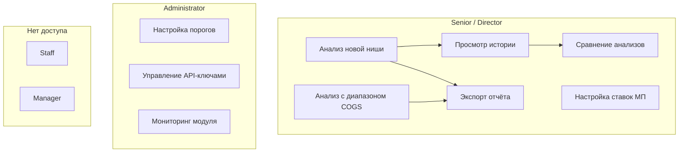
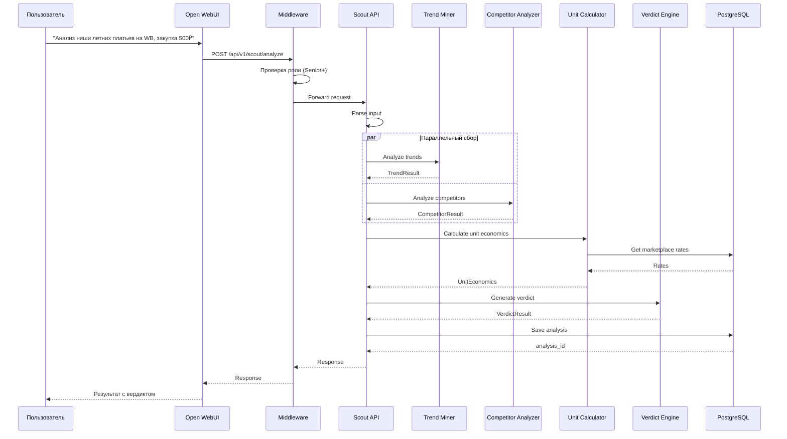

**Проект:** Предиктивная аналитика товарных ниш  
**Модуль:** Scout / Scenarios  
**Версия:** 1.0  
**Дата:** Январь 2026

---

## 6.1 Обзор сценариев

### Карта сценариев по ролям



### Матрица сценариев

| Сценарий | Senior | Director | Admin | Описание |
|----------|:------:|:--------:|:-----:|----------|
| Анализ ниши | ✅ | ✅ | ✅ | Базовый анализ с вердиктом |
| Анализ с диапазоном COGS | ✅ | ✅ | ✅ | Анализ при разных закупочных ценах |
| Просмотр истории | ✅ | ✅ | ✅ | История своих анализов |
| Сравнение анализов | ✅ | ✅ | ✅ | Сравнение двух анализов |
| Экспорт в PDF/Excel | ✅ | ✅ | ✅ | Генерация отчётов |
| Настройка ставок МП | ✅ | ✅ | ✅ | Изменение комиссий и расходов |
| Настройка порогов | ❌ | ❌ | ✅ | Изменение порогов светофора |
| Управление API-ключами | ❌ | ❌ | ✅ | Настройка внешних сервисов |

---

## 6.2 Сценарий: Анализ новой ниши

### 6.2.1 Описание

**Цель:** Оценить перспективность товарной ниши для выхода на маркетплейс.

**Участники:** Senior, Director, Administrator

**Предусловия:**
- Пользователь авторизован с ролью Senior+
- Известна закупочная цена товара

### 6.2.2 Диаграмма последовательности



### 6.2.3 Примеры диалогов

**Пример 1: Анализ по текстовому запросу**

```
👤 Пользователь (Senior):
Проанализируй нишу летних платьев на Wildberries, закупка 500 рублей

🤖 ADOLF Scout:
🔍 **Анализирую нишу...**

## 🟡 Вердикт: **CONSIDER**

_Ниша показывает стабильный спрос с небольшим ростом, но умеренная 
конкуренция и маржинальность на границе комфортной зоны требуют 
тщательного позиционирования._

### 📊 Ключевые метрики

| Метрика | Значение | Статус |
|---------|----------|--------|
| Тренд спроса | +0.12 | 🟡 |
| Монополизация | 48% | 🟢 |
| Ожид. маржа | 18.5% | 🟡 |

### 💰 Unit-экономика

**Wildberries**
- Цена продажи: 2 450 ₽
- Себестоимость: 500 ₽
- Расходы МП: 24.0%
- Чистая прибыль: 362 ₽
- Чистая маржа: **14.8%**
- Цена для 25% маржи: 980 ₽

### 💡 Рекомендации

1. Рассмотрите нишевые подкатегории: платья-рубашки, льняные платья
2. Для маржи 25% нужна закупка до 350₽ или цена продажи от 980₽
3. Сфокусируйтесь на уникальном дизайне для отстройки от конкурентов

### ⚠️ Риски

- **Сезонность спроса** (medium)
  _Митигация: планирование закупок к апрелю-маю_
- **Ценовая конкуренция** (medium)
  _Митигация: premium-позиционирование_

---
_ID анализа: `a1b2c3d4...` | 2026-01-21_

[📥 Экспорт PDF] [📊 Экспорт Excel] [📋 История]
```

**Пример 2: Анализ по URL категории**

```
👤 Пользователь (Director):
Оцени https://www.ozon.ru/category/platya-zhenskie-7502/ COGS 450

🤖 ADOLF Scout:
🔍 **Анализирую нишу...**

## 🟢 Вердикт: **GO**

_Категория женских платьев на Ozon показывает устойчивый рост спроса,
умеренную конкуренцию и хорошую маржинальность при указанной 
закупочной цене._

### 📊 Ключевые метрики

| Метрика | Значение | Статус |
|---------|----------|--------|
| Тренд спроса | +0.18 | 🟢 |
| Монополизация | 42% | 🟢 |
| Ожид. маржа | 22.1% | 🟡 |

### 💰 Unit-экономика

**Ozon**
- Цена продажи: 2 600 ₽
- Себестоимость: 450 ₽
- Расходы МП: 29.5%
- Чистая прибыль: 575 ₽
- Чистая маржа: **22.1%**

### 💡 Рекомендации

1. Оптимальное время входа — до начала весеннего сезона
2. Начните с тестовой партии 100-150 единиц
3. Используйте продвижение в первые 2 недели для набора отзывов

### 🚀 Возможности

- Рост категории +18% за квартал
- Недостаток предложения в сегменте 2000-3000₽
- Потенциал роста при добавлении видеоконтента

---
_ID анализа: `e5f6g7h8...` | 2026-01-21_
```

**Пример 3: Анализ по всем маркетплейсам**

```
👤 Пользователь (Senior):
Оцени нишу детских комбинезонов, закупка 800₽

🤖 ADOLF Scout:
🔍 **Анализирую нишу по всем маркетплейсам...**

## 🟢 Вердикт: **GO**

_Ниша детских комбинезонов демонстрирует стабильный спрос и хорошую
маржинальность на всех площадках. Рекомендуется вход с фокусом на WB._

### 📊 Ключевые метрики

| Метрика | Значение | Статус |
|---------|----------|--------|
| Тренд спроса | +0.21 | 🟢 |
| Монополизация | 38% (avg) | 🟢 |
| Ожид. маржа | 28.5% (avg) | 🟢 |

### 💰 Unit-экономика по маркетплейсам

| Показатель | Wildberries | Ozon | Яндекс.Маркет |
|------------|:-----------:|:----:|:-------------:|
| Ср. цена | 3 200 ₽ | 3 450 ₽ | 3 100 ₽ |
| Overhead | 24% | 29.5% | 28.5% |
| Чистая прибыль | 832 ₽ | 719 ₽ | 617 ₽ |
| Маржа | **26.0%** | **20.8%** | **19.9%** |

**Рекомендация:** Приоритет — Wildberries (макс. маржа 26%)

### 💡 Рекомендации

1. Начните с Wildberries — лучшее соотношение маржи и объёма
2. Добавьте Ozon через 1-2 месяца после отработки логистики
3. Сезонность: закупка к августу-сентябрю (back-to-school)

---
_ID анализа: `i9j0k1l2...` | 2026-01-21_
```

---

## 6.3 Сценарий: Анализ с диапазоном COGS

### 6.3.1 Описание

**Цель:** Оценить нишу при различных вариантах закупочной цены для выбора оптимального поставщика.

**Участники:** Senior, Director, Administrator

### 6.3.2 Пример диалога

```
👤 Пользователь (Senior):
Проанализируй нишу женских сумок на Ozon, закупка от 600 до 1200 рублей

🤖 ADOLF Scout:
🔍 **Анализирую нишу с диапазоном COGS...**

## 🟡 Вердикт: **CONSIDER**

_Маржинальность сильно зависит от закупочной цены. При COGS до 800₽ 
ниша перспективна, выше — требует premium-позиционирования._

### 📊 Ключевые метрики

| Метрика | Значение | Статус |
|---------|----------|--------|
| Тренд спроса | +0.09 | 🟡 |
| Монополизация | 55% | 🟡 |
| Ожид. маржа | 15-28% | 🟡/🟢 |

### 💰 Unit-экономика (диапазон COGS)

**Ozon** (средняя цена продажи: 3 800 ₽)

| COGS | Прибыль | Маржа | Статус | Комментарий |
|-----:|--------:|------:|:------:|-------------|
| 600 ₽ | 1 078 ₽ | 28.4% | 🟢 | Отличная маржа |
| 800 ₽ | 878 ₽ | 23.1% | 🟡 | Приемлемо |
| 1 000 ₽ | 678 ₽ | 17.8% | 🟡 | На границе |
| 1 200 ₽ | 478 ₽ | 12.6% | 🔴 | Риск убытка |

### 📈 Анализ чувствительности

```
Маржа %
30 ┤                    
25 ┤ ████                     🟢 Зелёная зона (&gt;25%)
20 ┤      ████               
15 ┤           ████           🟡 Жёлтая зона (15-25%)
10 ┤                ████     
 5 ┤                          🔴 Красная зона (&lt;15%)
   └─────────────────────
     600  800  1000  1200   COGS (₽)
```

### 💡 Рекомендации

1. **Оптимальный COGS:** до 800 ₽ для комфортной маржи
2. При COGS 1000+ требуется цена продажи от 4500₽
3. Ищите поставщиков с ценой до 700₽ для запаса маржи

### ⚠️ Критические точки

| Показатель | Значение |
|------------|----------|
| Точка безубыточности | COGS 1 480 ₽ |
| COGS для маржи 25% | до 780 ₽ |
| COGS для маржи 20% | до 970 ₽ |

---
_ID анализа: `m3n4o5p6...` | 2026-01-21_
```

---

## 6.4 Сценарий: Просмотр истории анализов

### 6.4.1 Описание

**Цель:** Просмотреть ранее выполненные анализы для отслеживания динамики или повторного изучения.

### 6.4.2 Примеры диалогов

**Пример 1: Последние анализы**

```
👤 Пользователь (Senior):
Покажи мои последние анализы

🤖 ADOLF Scout:
## 📋 История анализов

| Дата | Запрос | МП | Вердикт | Маржа |
|------|--------|:--:|:-------:|------:|
| 21.01 | летние платья | WB | 🟡 CONSIDER | 18.5% |
| 21.01 | женские сумки | Ozon | 🟡 CONSIDER | 23.1% |
| 20.01 | детские комбинезоны | all | 🟢 GO | 28.5% |
| 18.01 | мужские футболки | WB | 🟢 GO | 31.2% |
| 15.01 | кроссовки спортивные | Ozon | 🔴 RISKY | 8.5% |

_Показаны последние 5 анализов. Всего: 23 анализа._

Для детального просмотра: «Покажи анализ [ID]»
Для фильтрации: «Покажи анализы с вердиктом GO»
```

**Пример 2: Фильтрация по вердикту**

```
👤 Пользователь (Director):
Покажи все анализы с вердиктом GO за последний месяц

🤖 ADOLF Scout:
## 📋 Успешные анализы (GO) — январь 2026

| Дата | Запрос | МП | Маржа | Тренд |
|------|--------|:--:|------:|------:|
| 20.01 | детские комбинезоны | all | 28.5% | +0.21 |
| 18.01 | мужские футболки | WB | 31.2% | +0.19 |
| 12.01 | спортивные леггинсы | WB | 27.8% | +0.24 |
| 08.01 | детские пижамы | Ozon | 29.1% | +0.17 |
| 03.01 | женские свитера | all | 26.5% | +0.16 |

**Статистика GO-анализов:**
- Средняя маржа: 28.6%
- Средний тренд: +0.19
- Успешность прогнозов: отслеживается в v2.0

_Найдено 5 анализов с вердиктом GO_
```

**Пример 3: Детальный просмотр**

```
👤 Пользователь (Senior):
Покажи детали анализа детских комбинезонов от 20 января

🤖 ADOLF Scout:
## 📋 Детали анализа

**Запрос:** детские комбинезоны
**Дата:** 20.01.2026, 14:32
**ID:** `i9j0k1l2-...`

### Входные данные
- Маркетплейсы: Wildberries, Ozon, Яндекс.Маркет
- COGS: 800 ₽

### Результат
| Метрика | Значение | Статус |
|---------|----------|--------|
| Вердикт | **GO** | 🟢 |
| Тренд | +0.21 | 🟢 |
| Монополизация | 38% | 🟢 |
| Маржа (avg) | 28.5% | 🟢 |

### Unit-экономика
| МП | Цена | Маржа | Прибыль |
|----|-----:|------:|--------:|
| WB | 3 200 ₽ | 26.0% | 832 ₽ |
| Ozon | 3 450 ₽ | 20.8% | 719 ₽ |
| YM | 3 100 ₽ | 19.9% | 617 ₽ |

### Рекомендации (сохранённые)
1. Начните с Wildberries — лучшее соотношение маржи и объёма
2. Сезонность: закупка к августу-сентябрю

[📥 Экспорт PDF] [📊 Экспорт Excel] [🔄 Повторить анализ]
```

---

## 6.5 Сценарий: Сравнение анализов

### 6.5.1 Описание

**Цель:** Сравнить два анализа для оценки динамики ниши или выбора между вариантами.

### 6.5.2 Пример диалога

```
👤 Пользователь (Senior):
Сравни анализы летних платьев от 21 января и от 15 декабря

🤖 ADOLF Scout:
## 🔄 Сравнение анализов

**Запрос:** летние платья (Wildberries)

| Показатель | 15.12.2025 | 21.01.2026 | Δ Изменение |
|------------|:----------:|:----------:|:-----------:|
| **Вердикт** | 🟡 CONSIDER | 🟡 CONSIDER | — |
| Тренд | +0.05 | +0.12 | 📈 +0.07 |
| Монополизация | 52% | 48% | 📉 -4% |
| Маржа | 16.2% | 18.5% | 📈 +2.3% |
| Ср. цена | 2 280 ₽ | 2 450 ₽ | 📈 +7.5% |

### 📈 Динамика тренда

```
Slope
0.15 ┤                    ╭───  Порог GO
0.12 ┤               ●────╯     Сейчас
0.10 ┤          ╭────╯
0.05 ┤    ●─────╯               Было
0.00 ┤
     └────────────────────────
        Дек    Янв    
```

### 💡 Выводы

1. **Тренд улучшился** — спрос растёт активнее (+0.07)
2. **Конкуренция снизилась** — monopoly rate уменьшился на 4%
3. **Цены выросли** — средняя цена +7.5%, что улучшило маржу
4. **Вердикт не изменился** — всё ещё CONSIDER из-за маржи < 25%

### 🎯 Рекомендация

Ниша движется в сторону GO. При снижении COGS до 400₽ 
или росте цен до 2700₽ вердикт станет GO.

_Для мониторинга: запланируйте повторный анализ через 2-4 недели_
```

---

## 6.6 Сценарий: Экспорт отчёта

### 6.6.1 Описание

**Цель:** Выгрузить результаты анализа в формате PDF или Excel для презентации или архива.

### 6.6.2 Примеры диалогов

**Пример 1: Экспорт последнего анализа**

```
👤 Пользователь (Senior):
Экспорт в PDF

🤖 ADOLF Scout:
📤 Экспортирую последний анализ...

✅ Отчёт готов!

**Анализ:** летние платья (Wildberries)
**Формат:** PDF
**Размер:** 245 KB

📥 [Скачать отчёт](https://storage.adolf.local/exports/scout_a1b2c3d4_20260121.pdf)

_Ссылка действительна 24 часа._

---

**Содержание отчёта:**
1. Титульная страница
2. Executive Summary (вердикт + метрики)
3. Анализ трендов (графики)
4. Конкурентный анализ (ТОП продавцы)
5. Unit-экономика (расчёты)
6. Рекомендации и риски
7. Приложение (сырые данные)
```

**Пример 2: Экспорт конкретного анализа в Excel**

```
👤 Пользователь (Director):
Экспортируй анализ детских комбинезонов в Excel

🤖 ADOLF Scout:
📤 Экспортирую анализ `i9j0k1l2...` в Excel...

✅ Отчёт готов!

**Анализ:** детские комбинезоны (все МП)
**Формат:** XLSX
**Размер:** 128 KB

📥 [Скачать Excel](https://storage.adolf.local/exports/scout_i9j0k1l2_20260121.xlsx)

_Ссылка действительна 24 часа._

---

**Листы в файле:**
1. Summary — сводка и вердикт
2. Trends — данные о трендах по месяцам
3. Competitors — ТОП-50 товаров и продавцы
4. Unit Economics — расчёты по каждому МП
5. Recommendations — рекомендации и риски
```

---

## 6.7 Сценарий: Настройка ставок маркетплейсов

### 6.7.1 Описание

**Цель:** Актуализировать ставки расходов маркетплейсов для точного расчёта unit-экономики.

**Участники:** Senior, Director, Administrator

### 6.7.2 Примеры диалогов

**Пример 1: Просмотр текущих ставок**

```
👤 Пользователь (Senior):
Покажи текущие ставки маркетплейсов

🤖 ADOLF Scout:
## 📊 Текущие ставки маркетплейсов

_Категория: Одежда (default)_

| Статья расходов | Wildberries | Ozon | Яндекс.Маркет |
|-----------------|:-----------:|:----:|:-------------:|
| Комиссия | 15.0% | 18.0% | 15.0% |
| Логистика | 5.0% | 6.0% | 7.0% |
| Возвраты | 3.0% | 4.0% | 4.0% |
| Хранение | 1.0% | 1.5% | 1.0% |
| Эквайринг | 0.0% | 0.0% | 1.5% |
| **Итого** | **24.0%** | **29.5%** | **28.5%** |

_Последнее обновление: 15.01.2026_

Для изменения: «Установи комиссию WB 16%»
```

**Пример 2: Изменение ставки**

```
👤 Пользователь (Senior):
Установи комиссию Wildberries 16%, логистику 5.5%

🤖 ADOLF Scout:
⚙️ Обновляю ставки Wildberries...

✅ Ставки обновлены!

| Статья | Было | Стало |
|--------|:----:|:-----:|
| Комиссия | 15.0% | **16.0%** |
| Логистика | 5.0% | **5.5%** |
| **Итого** | 24.0% | **25.5%** |

_Изменения применятся к новым анализам._

⚠️ **Внимание:** Это повлияет на расчёт маржи:
- При COGS 500₽ и цене 2450₽: маржа снизится с 14.8% до 13.3%
```

**Пример 3: Сброс к умолчаниям**

```
👤 Пользователь (Director):
Сбрось ставки Ozon к значениям по умолчанию

🤖 ADOLF Scout:
🔄 Сбрасываю ставки Ozon...

✅ Ставки Ozon восстановлены по умолчанию:

| Статья | Значение |
|--------|:--------:|
| Комиссия | 18.0% |
| Логистика | 6.0% |
| Возвраты | 4.0% |
| Хранение | 1.5% |
| Эквайринг | 0.0% |
| **Итого** | **29.5%** |
```

---

## 6.8 Сценарий: Настройка порогов (Admin)

### 6.8.1 Описание

**Цель:** Настроить пороговые значения для системы «Светофор».

**Участники:** Administrator

### 6.8.2 Пример диалога

```
👤 Пользователь (Administrator):
Покажи настройки порогов светофора

🤖 ADOLF Scout:
## ⚙️ Настройки порогов «Светофор»

### Trend Slope (динамика спроса)
| Статус | Порог | Интерпретация |
|:------:|:-----:|---------------|
| 🟢 GO | > 0.15 | Активный рост |
| 🟡 | 0 — 0.15 | Стабильно/умеренный рост |
| 🔴 | < 0 | Падение |

### Monopoly Rate (монополизация)
| Статус | Порог | Интерпретация |
|:------:|:-----:|---------------|
| 🟢 | < 50% | Низкая конкуренция |
| 🟡 | 50% — 70% | Умеренная |
| 🔴 | > 70% | Высокая монополизация |

### Expected Margin (маржа)
| Статус | Порог | Интерпретация |
|:------:|:-----:|---------------|
| 🟢 | > 25% | Хорошая маржа |
| 🟡 | 15% — 25% | Приемлемая |
| 🔴 | < 15% | Низкая маржа |

---

Для изменения: «Установи порог маржи зелёный 30%»

👤 Пользователь (Administrator):
Установи порог маржи: зелёный > 30%, жёлтый > 20%

🤖 ADOLF Scout:
⚙️ Обновляю пороги маржи...

✅ Пороги обновлены!

| Статус | Было | Стало |
|:------:|:----:|:-----:|
| 🟢 | > 25% | **> 30%** |
| 🟡 | > 15% | **> 20%** |
| 🔴 | ≤ 15% | **≤ 20%** |

⚠️ **Влияние:** При новых порогах часть анализов с 
маржой 25-30% будет получать CONSIDER вместо GO.

_Рекомендуется: проверить несколько анализов с новыми порогами_
```

---

## 6.9 Сценарий: Обработка ошибок

### 6.9.1 Ошибка: Не указан COGS

```
👤 Пользователь (Senior):
Проанализируй нишу зимних курток на Wildberries

🤖 ADOLF Scout:
⚠️ **Не указана закупочная цена**

Для анализа unit-экономики необходимо указать COGS (себестоимость).

**Примеры:**
- `Анализ ниши зимних курток на WB, закупка 1500₽`
- `... COGS 1500`
- `... себестоимость от 1200 до 1800`

Укажите закупочную цену для продолжения.
```

### 6.9.2 Ошибка: Нет доступа

```
👤 Пользователь (Manager):
Проанализируй нишу летних платьев

🤖 ADOLF Scout:
⛔ **Доступ ограничен**

Модуль Scout доступен для ролей:
- Senior
- Director  
- Administrator

Ваша текущая роль: **Manager**

Для получения доступа обратитесь к администратору.
```

### 6.9.3 Ошибка: Таймаут анализа

```
👤 Пользователь (Senior):
Проанализируй нишу электроники на всех маркетплейсах, закупка 5000₽

🤖 ADOLF Scout:
🔍 **Анализирую нишу...**

⏱️ **Превышено время ожидания**

Анализ занял слишком много времени. Возможные причины:
- Высокая нагрузка на внешние сервисы
- Слишком широкий запрос

**Рекомендации:**
1. Повторите запрос через несколько минут
2. Уточните категорию: «ноутбуки», «смартфоны» вместо «электроника»
3. Ограничьте маркетплейсы: «на Wildberries»

[🔄 Повторить] [📋 История]
```

### 6.9.4 Частичные данные

```
👤 Пользователь (Senior):
Анализ ниши сумок на Ozon, закупка 800₽

🤖 ADOLF Scout:
🔍 **Анализирую нишу...**

⚠️ _Часть источников недоступна: Wordstat, SimilarWeb_

## 🟡 Вердикт: **CONSIDER** (уверенность: 65%)

_Анализ выполнен с ограниченными данными. Тренд оценён 
только по данным маркетплейса._

### 📊 Ключевые метрики

| Метрика | Значение | Статус | Источник |
|---------|----------|--------|----------|
| Тренд | +0.10 | 🟡 | Ozon Analytics |
| Монополизация | 45% | 🟢 | Watcher |
| Маржа | 21.5% | 🟡 | Расчёт |

⚠️ **Рекомендация:** повторите анализ позже для полных данных о трендах.

---
_Confidence: 65% (неполные данные)_
```

---

## 6.10 Сценарий: Отслеживание динамики ниши

### 6.10.1 Описание

**Цель:** Проанализировать изменения в нише за период на основе сохранённых анализов.

### 6.10.2 Пример диалога

```
👤 Пользователь (Director):
Покажи динамику анализов летних платьев за последние 3 месяца

🤖 ADOLF Scout:
## 📈 Динамика ниши: летние платья

_Период: ноябрь 2025 — январь 2026_
_Анализов: 6_

### Тренд метрик

| Дата | Trend Slope | Monopoly | Маржа | Вердикт |
|------|:-----------:|:--------:|:-----:|:-------:|
| 15.11 | +0.02 | 58% | 14.2% | 🔴 RISKY |
| 01.12 | +0.05 | 55% | 15.8% | 🟡 CONSIDER |
| 15.12 | +0.05 | 52% | 16.2% | 🟡 CONSIDER |
| 01.01 | +0.08 | 50% | 17.1% | 🟡 CONSIDER |
| 15.01 | +0.10 | 48% | 18.0% | 🟡 CONSIDER |
| 21.01 | +0.12 | 48% | 18.5% | 🟡 CONSIDER |

### 📊 Визуализация

```
Trend Slope                          Маржа %
0.15 ┤     ╭─── GO threshold    25 ┤     ╭─── GO threshold
0.12 ┤    ●╯                    20 ┤   ●─╯
0.08 ┤  ●╯                      18 ┤  ╯
0.05 ┤ ●╯                       15 ┤╭╯
0.02 ┤●╯                        14 ┤●
     └─────────────────            └─────────────────
      Ноя  Дек  Янв                 Ноя  Дек  Янв
```

### 💡 Выводы

1. **Положительная динамика** — все метрики улучшаются
2. **Тренд:** +0.02 → +0.12 (рост в 6 раз)
3. **Конкуренция:** снизилась с 58% до 48%
4. **Маржа:** выросла с 14.2% до 18.5%

### 🎯 Прогноз

При сохранении текущей динамики:
- Через ~4 недели тренд достигнет порога GO (0.15)
- Маржа приближается к 20%, но для GO нужно 25%

**Рекомендация:** Оптимизируйте COGS или ценообразование 
для достижения маржи 25% к моменту входа.
```

---

**Документ подготовлен:** Январь 2026  
**Версия:** 1.0  
**Статус:** Черновик
