# ADOLF SCOUT — Раздел 7: Celery

**Проект:** Предиктивная аналитика товарных ниш  
**Модуль:** Scout / Celery  
**Версия:** 1.0  
**Дата:** Январь 2026

---

## 7.1 Обзор задач

### Архитектура Celery

```mermaid
flowchart TB
    subgraph TRIGGERS["Триггеры"]
        SCHEDULE["Celery Beat<br/>(расписание)"]
        API["Scout API<br/>(on-demand)"]
        ADMIN["Admin Panel"]
    end

    subgraph BROKER["Message Broker"]
        REDIS["Redis"]
    end

    subgraph QUEUES["Очереди"]
        Q_DEFAULT["default<br/>(стандартные)"]
        Q_HEAVY["heavy<br/>(тяжёлые)"]
        Q_EXPORT["export<br/>(экспорт)"]
    end

    subgraph WORKERS["Workers"]
        W1["Worker 1<br/>(default)"]
        W2["Worker 2<br/>(default)"]
        W3["Worker 3<br/>(heavy)"]
        W4["Worker 4<br/>(export)"]
    end

    subgraph TASKS["Задачи"]
        T1["update_trend_data"]
        T2["refresh_category_stats"]
        T3["cleanup_old_analyses"]
        T4["recalculate_verdicts"]
        T5["analyze_niche"]
        T6["export_analysis"]
    end

    SCHEDULE --> REDIS
    API --> REDIS
    ADMIN --> REDIS

    REDIS --> Q_DEFAULT
    REDIS --> Q_HEAVY
    REDIS --> Q_EXPORT

    Q_DEFAULT --> W1
    Q_DEFAULT --> W2
    Q_HEAVY --> W3
    Q_EXPORT --> W4

    W1 --> T1
    W1 --> T2
    W2 --> T5
    W3 --> T3
    W3 --> T4
    W4 --> T6
```



### Сводная таблица задач

| Задача | Тип | Очередь | Расписание | Время |
|--------|-----|---------|------------|-------|
| `scout.update_trend_data` | Периодическая | default | Ежедневно 06:00 | ~10 мин |
| `scout.refresh_category_stats` | Периодическая | default | Ежедневно 08:00 | ~15 мин |
| `scout.cleanup_old_analyses` | Периодическая | heavy | Воскресенье 03:00 | ~5 мин |
| `scout.recalculate_verdicts` | Периодическая | heavy | 1-е число 04:00 | ~30 мин |
| `scout.analyze_niche` | On-demand | default | По запросу | 30-60 сек |
| `scout.export_analysis` | On-demand | export | По запросу | 5-15 сек |

---

## 7.2 Конфигурация Celery

### 7.2.1 Настройки

```python
# celery_config.py

from celery import Celery
from celery.schedules import crontab
from kombu import Queue

# Инициализация
app = Celery('adolf_scout')

# Брокер и бэкенд
app.conf.broker_url = 'redis://redis:6379/0'
app.conf.result_backend = 'redis://redis:6379/1'

# Сериализация
app.conf.task_serializer = 'json'
app.conf.result_serializer = 'json'
app.conf.accept_content = ['json']

# Временная зона
app.conf.timezone = 'Europe/Moscow'
app.conf.enable_utc = True

# Очереди
app.conf.task_queues = (
    Queue('default', routing_key='default'),
    Queue('heavy', routing_key='heavy'),
    Queue('export', routing_key='export'),
)

app.conf.task_default_queue = 'default'
app.conf.task_default_routing_key = 'default'

# Роутинг задач
app.conf.task_routes = {
    'scout.update_trend_data': {'queue': 'default'},
    'scout.refresh_category_stats': {'queue': 'default'},
    'scout.cleanup_old_analyses': {'queue': 'heavy'},
    'scout.recalculate_verdicts': {'queue': 'heavy'},
    'scout.analyze_niche': {'queue': 'default'},
    'scout.export_analysis': {'queue': 'export'},
}

# Лимиты
app.conf.task_time_limit = 300  # 5 минут максимум
app.conf.task_soft_time_limit = 240  # Soft limit 4 минуты
app.conf.worker_max_tasks_per_child = 100  # Перезапуск воркера после 100 задач
app.conf.worker_prefetch_multiplier = 4

# Retry
app.conf.task_acks_late = True
app.conf.task_reject_on_worker_lost = True

# Расписание
app.conf.beat_schedule = {
    'scout-update-trend-data': {
        'task': 'scout.update_trend_data',
        'schedule': crontab(hour=6, minute=0),
        'options': {'queue': 'default'}
    },
    'scout-refresh-category-stats': {
        'task': 'scout.refresh_category_stats',
        'schedule': crontab(hour=8, minute=0),
        'options': {'queue': 'default'}
    },
    'scout-cleanup-old-analyses': {
        'task': 'scout.cleanup_old_analyses',
        'schedule': crontab(hour=3, minute=0, day_of_week=0),  # Воскресенье
        'options': {'queue': 'heavy'}
    },
    'scout-recalculate-verdicts': {
        'task': 'scout.recalculate_verdicts',
        'schedule': crontab(hour=4, minute=0, day_of_month=1),  # 1-е число
        'options': {'queue': 'heavy'}
    },
}
```

### 7.2.2 Запуск воркеров

```bash
# Worker для очереди default (2 инстанса)
celery -A adolf worker -Q default -c 4 -n worker-default-1@%h
celery -A adolf worker -Q default -c 4 -n worker-default-2@%h

# Worker для очереди heavy (1 инстанс)
celery -A adolf worker -Q heavy -c 2 -n worker-heavy@%h

# Worker для очереди export (1 инстанс)
celery -A adolf worker -Q export -c 2 -n worker-export@%h

# Celery Beat (планировщик)
celery -A adolf beat -l INFO
```

### 7.2.3 Docker Compose

```yaml
# docker-compose.yml (фрагмент)

services:
  celery-worker-default:
    build: .
    command: celery -A adolf worker -Q default -c 4 -l INFO
    environment:
      - CELERY_BROKER_URL=redis://redis:6379/0
      - CELERY_RESULT_BACKEND=redis://redis:6379/1
    depends_on:
      - redis
      - postgres
    restart: unless-stopped
    deploy:
      replicas: 2

  celery-worker-heavy:
    build: .
    command: celery -A adolf worker -Q heavy -c 2 -l INFO
    environment:
      - CELERY_BROKER_URL=redis://redis:6379/0
      - CELERY_RESULT_BACKEND=redis://redis:6379/1
    depends_on:
      - redis
      - postgres
    restart: unless-stopped

  celery-worker-export:
    build: .
    command: celery -A adolf worker -Q export -c 2 -l INFO
    environment:
      - CELERY_BROKER_URL=redis://redis:6379/0
      - CELERY_RESULT_BACKEND=redis://redis:6379/1
    depends_on:
      - redis
      - postgres
    restart: unless-stopped

  celery-beat:
    build: .
    command: celery -A adolf beat -l INFO
    environment:
      - CELERY_BROKER_URL=redis://redis:6379/0
    depends_on:
      - redis
    restart: unless-stopped
```

---

## 7.3 Периодические задачи

### 7.3.1 scout.update_trend_data

**Назначение:** Обновление кэша трендов для популярных запросов.

**Расписание:** Ежедневно в 06:00 MSK

```python
# tasks/trend_tasks.py

from celery import shared_task
from celery.utils.log import get_task_logger
from datetime import datetime, timedelta
from typing import List, Dict

logger = get_task_logger(__name__)


@shared_task(
    name='scout.update_trend_data',
    bind=True,
    max_retries=3,
    default_retry_delay=300,
    autoretry_for=(Exception,),
    retry_backoff=True
)
def update_trend_data(self) -> Dict:
    """
    Обновление данных о трендах.
    
    Логика:
    1. Получить список запросов с истекающим кэшем
    2. Для каждого запроса собрать свежие данные
    3. Обновить кэш
    
    Returns:
        Статистика выполнения
    """
    logger.info("Starting trend data update")
    start_time = datetime.utcnow()
    
    stats = {
        'queries_processed': 0,
        'queries_updated': 0,
        'queries_failed': 0,
        'duration_seconds': 0
    }
    
    try:
        # Получение запросов с истекающим кэшем
        queries = get_expiring_trend_queries(hours_ahead=24)
        logger.info(f"Found {len(queries)} queries to update")
        
        for query_data in queries:
            try:
                # Сбор свежих данных
                trend_result = collect_trend_data_sync(
                    query=query_data['query'],
                    sources=['wordstat', 'ozon_analytics', 'wb_analytics']
                )
                
                # Обновление кэша
                update_trend_cache(
                    query_hash=query_data['query_hash'],
                    trend_data=trend_result,
                    ttl_hours=24
                )
                
                stats['queries_updated'] += 1
                
            except Exception as e:
                logger.warning(f"Failed to update trend for '{query_data['query']}': {e}")
                stats['queries_failed'] += 1
            
            stats['queries_processed'] += 1
        
        stats['duration_seconds'] = (datetime.utcnow() - start_time).total_seconds()
        
        logger.info(
            f"Trend update completed: {stats['queries_updated']}/{stats['queries_processed']} updated, "
            f"{stats['queries_failed']} failed, {stats['duration_seconds']:.1f}s"
        )
        
        return stats
        
    except Exception as e:
        logger.error(f"Trend update failed: {e}")
        raise self.retry(exc=e)


def get_expiring_trend_queries(hours_ahead: int = 24) -> List[Dict]:
    """Получение запросов с истекающим кэшем."""
    from database import get_db_session
    
    with get_db_session() as db:
        result = db.execute("""
            SELECT query_hash, query
            FROM scout_trend_cache
            WHERE expires_at < NOW() + INTERVAL '%s hours'
            ORDER BY expires_at
            LIMIT 100
        """, (hours_ahead,))
        
        return [{'query_hash': row[0], 'query': row[1]} for row in result]


def collect_trend_data_sync(query: str, sources: List[str]) -> Dict:
    """Синхронный сбор данных о трендах."""
    import asyncio
    from services.trend_miner import TrendMiner
    
    # Запуск async кода в sync контексте
    loop = asyncio.new_event_loop()
    asyncio.set_event_loop(loop)
    
    try:
        miner = TrendMiner()
        result = loop.run_until_complete(
            miner.collect_from_sources(query, sources)
        )
        return result
    finally:
        loop.close()


def update_trend_cache(query_hash: str, trend_data: Dict, ttl_hours: int):
    """Обновление кэша трендов."""
    from database import get_db_session
    
    with get_db_session() as db:
        db.execute("""
            UPDATE scout_trend_cache
            SET 
                trend_data = %s,
                trend_slope = %s,
                trend_status = %s,
                total_volume = %s,
                confidence = %s,
                sources_used = %s,
                expires_at = NOW() + INTERVAL '%s hours',
                updated_at = NOW()
            WHERE query_hash = %s
        """, (
            trend_data.get('raw_data', {}),
            trend_data.get('trend_slope', 0),
            trend_data.get('trend_status', 'unknown'),
            trend_data.get('total_volume', 0),
            trend_data.get('confidence', 0),
            trend_data.get('sources_used', []),
            ttl_hours,
            query_hash
        ))
        db.commit()
```

### 7.3.2 scout.refresh_category_stats

**Назначение:** Обновление статистики категорий из Watcher.

**Расписание:** Ежедневно в 08:00 MSK

```python
# tasks/trend_tasks.py

@shared_task(
    name='scout.refresh_category_stats',
    bind=True,
    max_retries=3,
    default_retry_delay=300
)
def refresh_category_stats(self) -> Dict:
    """
    Обновление статистики категорий.
    
    Логика:
    1. Получить список активных категорий из анализов
    2. Запросить свежую статистику из Watcher
    3. Обновить кэш категорий
    """
    logger.info("Starting category stats refresh")
    start_time = datetime.utcnow()
    
    stats = {
        'categories_processed': 0,
        'categories_updated': 0,
        'categories_failed': 0,
        'duration_seconds': 0
    }
    
    try:
        # Получение активных категорий (из анализов за последние 30 дней)
        categories = get_active_categories(days=30)
        logger.info(f"Found {len(categories)} active categories")
        
        for category in categories:
            try:
                # Запрос к Watcher API
                category_data = fetch_category_from_watcher(
                    marketplace=category['marketplace'],
                    category_url=category['category_url']
                )
                
                # Обновление кэша
                update_category_cache(
                    url_hash=category['url_hash'],
                    data=category_data,
                    ttl_hours=12
                )
                
                stats['categories_updated'] += 1
                
            except Exception as e:
                logger.warning(f"Failed to refresh category '{category['category_url']}': {e}")
                stats['categories_failed'] += 1
            
            stats['categories_processed'] += 1
        
        stats['duration_seconds'] = (datetime.utcnow() - start_time).total_seconds()
        
        logger.info(
            f"Category refresh completed: {stats['categories_updated']}/{stats['categories_processed']} updated"
        )
        
        return stats
        
    except Exception as e:
        logger.error(f"Category refresh failed: {e}")
        raise self.retry(exc=e)


def get_active_categories(days: int = 30) -> List[Dict]:
    """Получение активных категорий из недавних анализов."""
    from database import get_db_session
    
    with get_db_session() as db:
        # Извлечение уникальных URL категорий из competitor_results
        result = db.execute("""
            SELECT DISTINCT 
                mp.key as marketplace,
                mp.value->>'category_url' as category_url,
                MD5(mp.value->>'category_url') as url_hash
            FROM scout_analyses,
                 jsonb_each(competitor_results) as mp
            WHERE analyzed_at > NOW() - INTERVAL '%s days'
              AND mp.value->>'category_url' IS NOT NULL
            LIMIT 50
        """, (days,))
        
        return [
            {
                'marketplace': row[0],
                'category_url': row[1],
                'url_hash': row[2]
            }
            for row in result
        ]


def fetch_category_from_watcher(marketplace: str, category_url: str) -> Dict:
    """Запрос статистики категории из Watcher."""
    import httpx
    
    with httpx.Client(timeout=30) as client:
        response = client.get(
            f"http://middleware:8000/api/v1/watcher/category/analysis",
            params={
                'marketplace': marketplace,
                'category_url': category_url,
                'limit': 50
            }
        )
        response.raise_for_status()
        return response.json()
```

### 7.3.3 scout.cleanup_old_analyses

**Назначение:** Архивация старых анализов и очистка кэша.

**Расписание:** Воскресенье в 03:00 MSK

```python
# tasks/maintenance_tasks.py

@shared_task(
    name='scout.cleanup_old_analyses',
    bind=True,
    max_retries=2
)
def cleanup_old_analyses(self) -> Dict:
    """
    Архивация старых анализов и очистка.
    
    Операции:
    1. Перенос анализов старше 12 месяцев в архив
    2. Удаление устаревшего кэша трендов
    3. Удаление истёкших экспортов
    4. Очистка файлов экспорта
    """
    logger.info("Starting cleanup task")
    start_time = datetime.utcnow()
    
    stats = {
        'analyses_archived': 0,
        'trend_cache_deleted': 0,
        'exports_deleted': 0,
        'files_deleted': 0,
        'space_freed_mb': 0,
        'duration_seconds': 0
    }
    
    try:
        from database import get_db_session
        
        with get_db_session() as db:
            # 1. Архивация старых анализов
            result = db.execute("""
                WITH moved AS (
                    DELETE FROM scout_analyses
                    WHERE analyzed_at < NOW() - INTERVAL '12 months'
                    RETURNING *
                )
                INSERT INTO scout_analyses_archive
                SELECT * FROM moved
                RETURNING id
            """)
            stats['analyses_archived'] = result.rowcount
            logger.info(f"Archived {stats['analyses_archived']} analyses")
            
            # 2. Очистка кэша трендов
            result = db.execute("""
                DELETE FROM scout_trend_cache
                WHERE expires_at < NOW() - INTERVAL '7 days'
            """)
            stats['trend_cache_deleted'] = result.rowcount
            logger.info(f"Deleted {stats['trend_cache_deleted']} trend cache entries")
            
            # 3. Очистка экспортов
            result = db.execute("""
                DELETE FROM scout_export_jobs
                WHERE expires_at < NOW() - INTERVAL '1 day'
                RETURNING file_path
            """)
            
            deleted_files = [row[0] for row in result if row[0]]
            stats['exports_deleted'] = result.rowcount
            
            db.commit()
        
        # 4. Удаление файлов
        import os
        for file_path in deleted_files:
            try:
                if os.path.exists(file_path):
                    size = os.path.getsize(file_path)
                    os.remove(file_path)
                    stats['files_deleted'] += 1
                    stats['space_freed_mb'] += size / (1024 * 1024)
            except Exception as e:
                logger.warning(f"Failed to delete file {file_path}: {e}")
        
        stats['space_freed_mb'] = round(stats['space_freed_mb'], 2)
        stats['duration_seconds'] = (datetime.utcnow() - start_time).total_seconds()
        
        logger.info(
            f"Cleanup completed: archived={stats['analyses_archived']}, "
            f"cache={stats['trend_cache_deleted']}, exports={stats['exports_deleted']}, "
            f"freed={stats['space_freed_mb']}MB"
        )
        
        return stats
        
    except Exception as e:
        logger.error(f"Cleanup failed: {e}")
        raise self.retry(exc=e)
```

### 7.3.4 scout.recalculate_verdicts

**Назначение:** Пересчёт вердиктов для отслеживания точности прогнозов.

**Расписание:** 1-е число месяца в 04:00 MSK

```python
# tasks/maintenance_tasks.py

@shared_task(
    name='scout.recalculate_verdicts',
    bind=True,
    max_retries=2
)
def recalculate_verdicts(self) -> Dict:
    """
    Пересчёт вердиктов для оценки точности.
    
    Логика:
    1. Выбрать анализы за прошлый месяц
    2. Получить текущие данные по тем же нишам
    3. Сравнить прогноз с реальностью
    4. Сохранить метрики точности
    
    Это позволяет:
    - Оценить качество прогнозов
    - Калибровать пороги
    - Улучшать модель (v2.0)
    """
    logger.info("Starting verdict recalculation")
    start_time = datetime.utcnow()
    
    stats = {
        'analyses_checked': 0,
        'go_accurate': 0,
        'consider_accurate': 0,
        'risky_accurate': 0,
        'accuracy_rate': 0.0,
        'duration_seconds': 0
    }
    
    try:
        from database import get_db_session
        
        with get_db_session() as db:
            # Получение анализов за прошлый месяц
            analyses = db.execute("""
                SELECT 
                    id,
                    query,
                    marketplaces,
                    cogs,
                    verdict,
                    metrics
                FROM scout_analyses
                WHERE analyzed_at BETWEEN 
                    NOW() - INTERVAL '2 months' 
                    AND NOW() - INTERVAL '1 month'
                LIMIT 100
            """).fetchall()
            
            logger.info(f"Found {len(analyses)} analyses to check")
            
            for analysis in analyses:
                try:
                    # Получение текущих данных
                    current_data = get_current_niche_data(
                        query=analysis.query,
                        marketplaces=analysis.marketplaces
                    )
                    
                    # Оценка точности прогноза
                    is_accurate = evaluate_prediction_accuracy(
                        original_verdict=analysis.verdict,
                        original_metrics=analysis.metrics,
                        current_data=current_data
                    )
                    
                    if is_accurate:
                        if analysis.verdict == 'GO':
                            stats['go_accurate'] += 1
                        elif analysis.verdict == 'CONSIDER':
                            stats['consider_accurate'] += 1
                        else:
                            stats['risky_accurate'] += 1
                    
                    stats['analyses_checked'] += 1
                    
                except Exception as e:
                    logger.warning(f"Failed to check analysis {analysis.id}: {e}")
            
            # Расчёт общей точности
            total_accurate = stats['go_accurate'] + stats['consider_accurate'] + stats['risky_accurate']
            if stats['analyses_checked'] > 0:
                stats['accuracy_rate'] = round(total_accurate / stats['analyses_checked'] * 100, 1)
            
            # Сохранение метрик
            db.execute("""
                INSERT INTO scout_settings (key, value, description)
                VALUES ('metrics.accuracy.%s', %s, 'Accuracy metrics for month')
                ON CONFLICT (key) DO UPDATE SET value = EXCLUDED.value, updated_at = NOW()
            """, (
                datetime.utcnow().strftime('%Y-%m'),
                stats
            ))
            
            db.commit()
        
        stats['duration_seconds'] = (datetime.utcnow() - start_time).total_seconds()
        
        logger.info(
            f"Verdict recalculation completed: checked={stats['analyses_checked']}, "
            f"accuracy={stats['accuracy_rate']}%"
        )
        
        return stats
        
    except Exception as e:
        logger.error(f"Verdict recalculation failed: {e}")
        raise self.retry(exc=e)


def evaluate_prediction_accuracy(
    original_verdict: str,
    original_metrics: Dict,
    current_data: Dict
) -> bool:
    """
    Оценка точности прогноза.
    
    Критерии:
    - GO: ниша должна показать рост или стабильность
    - RISKY: ниша должна показать проблемы
    - CONSIDER: любой исход приемлем
    """
    if not current_data:
        return False
    
    original_trend = original_metrics.get('trend_slope', 0)
    current_trend = current_data.get('trend_slope', 0)
    
    if original_verdict == 'GO':
        # GO считается точным, если тренд не упал значительно
        return current_trend > -0.1
    
    elif original_verdict == 'RISKY':
        # RISKY считается точным, если тренд действительно плохой
        return current_trend < 0.1
    
    else:  # CONSIDER
        # CONSIDER всегда считается приемлемым
        return True
```

---

## 7.4 On-demand задачи

### 7.4.1 scout.analyze_niche

**Назначение:** Асинхронный анализ ниши по запросу пользователя.

```python
# tasks/analysis_tasks.py

from celery import shared_task
from celery.utils.log import get_task_logger
from typing import Dict, Optional
import uuid

logger = get_task_logger(__name__)


@shared_task(
    name='scout.analyze_niche',
    bind=True,
    max_retries=2,
    default_retry_delay=60,
    soft_time_limit=90,
    time_limit=120,
    track_started=True
)
def analyze_niche(
    self,
    query: str,
    cogs: float,
    marketplaces: Optional[list] = None,
    user_id: int = None,
    cogs_min: Optional[float] = None,
    cogs_max: Optional[float] = None
) -> Dict:
    """
    Асинхронный анализ ниши.
    
    Args:
        query: Поисковый запрос или URL категории
        cogs: Закупочная цена
        marketplaces: Список маркетплейсов
        user_id: ID пользователя
        cogs_min: Минимум диапазона COGS
        cogs_max: Максимум диапазона COGS
    
    Returns:
        Результат анализа
    """
    task_id = self.request.id
    logger.info(f"Starting niche analysis task {task_id}: query='{query}', cogs={cogs}")
    
    try:
        import asyncio
        from services.analysis_orchestrator import AnalysisOrchestrator
        from services.input_parser import ParsedInput
        
        # Формирование входных данных
        parsed_input = ParsedInput(
            marketplaces=marketplaces or ['wildberries', 'ozon', 'yandex_market'],
            query=query,
            cogs=cogs,
            cogs_min=cogs_min,
            cogs_max=cogs_max,
            raw_input=query
        )
        
        # Запуск async анализа
        loop = asyncio.new_event_loop()
        asyncio.set_event_loop(loop)
        
        try:
            orchestrator = AnalysisOrchestrator()
            result = loop.run_until_complete(
                orchestrator.analyze_async(parsed_input, user_id)
            )
        finally:
            loop.close()
        
        # Сериализация результата
        result_dict = {
            'analysis_id': str(result.analysis_id),
            'query': result.query,
            'marketplaces': result.marketplaces,
            'verdict': result.verdict.value,
            'color': result.color,
            'confidence': result.confidence,
            'metrics': {
                'trend_slope': result.metrics.trend_slope,
                'trend_status': result.metrics.trend_status,
                'monopoly_rate': result.metrics.monopoly_rate,
                'monopoly_status': result.metrics.monopoly_status,
                'expected_margin': result.metrics.expected_margin,
                'margin_status': result.metrics.margin_status
            },
            'summary': result.summary,
            'recommendations': result.recommendations,
            'risks': result.risks,
            'processing_time_ms': result.processing_time_ms
        }
        
        logger.info(
            f"Analysis completed: task={task_id}, verdict={result.verdict.value}, "
            f"time={result.processing_time_ms}ms"
        )
        
        return result_dict
        
    except Exception as e:
        logger.error(f"Analysis failed: task={task_id}, error={e}")
        raise self.retry(exc=e)


@shared_task(
    name='scout.analyze_niche_batch',
    bind=True,
    max_retries=1,
    soft_time_limit=300,
    time_limit=360
)
def analyze_niche_batch(
    self,
    queries: list,
    cogs: float,
    user_id: int
) -> Dict:
    """
    Пакетный анализ нескольких ниш.
    
    Args:
        queries: Список запросов
        cogs: Закупочная цена (одна для всех)
        user_id: ID пользователя
    
    Returns:
        Результаты по всем запросам
    """
    logger.info(f"Starting batch analysis: {len(queries)} queries")
    
    results = {
        'total': len(queries),
        'completed': 0,
        'failed': 0,
        'analyses': []
    }
    
    for query in queries[:10]:  # Лимит 10 запросов
        try:
            # Вызов основной задачи синхронно
            result = analyze_niche.apply(
                args=[query, cogs],
                kwargs={'user_id': user_id}
            ).get(timeout=120)
            
            results['analyses'].append(result)
            results['completed'] += 1
            
        except Exception as e:
            logger.warning(f"Batch item failed: query='{query}', error={e}")
            results['analyses'].append({
                'query': query,
                'error': str(e)
            })
            results['failed'] += 1
    
    logger.info(
        f"Batch analysis completed: {results['completed']}/{results['total']} successful"
    )
    
    return results
```

### 7.4.2 scout.export_analysis

**Назначение:** Генерация отчёта в PDF или Excel.

```python
# tasks/export_tasks.py

from celery import shared_task
from celery.utils.log import get_task_logger
from typing import Dict, Literal
import uuid
import os

logger = get_task_logger(__name__)

EXPORT_DIR = '/var/exports/scout'


@shared_task(
    name='scout.export_analysis',
    bind=True,
    max_retries=2,
    default_retry_delay=30,
    soft_time_limit=60,
    time_limit=90
)
def export_analysis(
    self,
    analysis_id: str,
    format: Literal['pdf', 'xlsx'] = 'pdf',
    user_id: int = None
) -> Dict:
    """
    Экспорт анализа в файл.
    
    Args:
        analysis_id: ID анализа (или 'latest' для последнего)
        format: Формат экспорта
        user_id: ID пользователя
    
    Returns:
        Информация о файле и ссылка для скачивания
    """
    task_id = self.request.id
    export_id = str(uuid.uuid4())
    
    logger.info(f"Starting export: task={task_id}, analysis={analysis_id}, format={format}")
    
    try:
        from database import get_db_session
        
        with get_db_session() as db:
            # Получение анализа
            if analysis_id == 'latest':
                analysis = db.execute("""
                    SELECT * FROM scout_analyses
                    WHERE user_id = %s
                    ORDER BY analyzed_at DESC
                    LIMIT 1
                """, (user_id,)).fetchone()
            else:
                analysis = db.execute("""
                    SELECT * FROM scout_analyses
                    WHERE id = %s AND user_id = %s
                """, (analysis_id, user_id)).fetchone()
            
            if not analysis:
                raise ValueError(f"Analysis not found: {analysis_id}")
            
            # Создание задачи экспорта
            db.execute("""
                INSERT INTO scout_export_jobs (id, analysis_id, format, status, user_id)
                VALUES (%s, %s, %s, 'processing', %s)
            """, (export_id, analysis.id, format, user_id))
            db.commit()
        
        # Генерация файла
        if format == 'pdf':
            file_path = generate_pdf_report(analysis, export_id)
        else:
            file_path = generate_xlsx_report(analysis, export_id)
        
        file_size = os.path.getsize(file_path)
        download_url = f"https://storage.adolf.local/exports/{os.path.basename(file_path)}"
        
        # Обновление статуса
        with get_db_session() as db:
            db.execute("""
                UPDATE scout_export_jobs
                SET 
                    status = 'completed',
                    file_path = %s,
                    download_url = %s,
                    file_size_bytes = %s,
                    expires_at = NOW() + INTERVAL '24 hours',
                    completed_at = NOW()
                WHERE id = %s
            """, (file_path, download_url, file_size, export_id))
            db.commit()
        
        result = {
            'export_id': export_id,
            'analysis_id': str(analysis.id),
            'format': format,
            'status': 'completed',
            'file_path': file_path,
            'download_url': download_url,
            'file_size_bytes': file_size
        }
        
        logger.info(f"Export completed: {export_id}, size={file_size}B")
        
        return result
        
    except Exception as e:
        logger.error(f"Export failed: {e}")
        
        # Обновление статуса ошибки
        try:
            with get_db_session() as db:
                db.execute("""
                    UPDATE scout_export_jobs
                    SET status = 'failed', error_message = %s
                    WHERE id = %s
                """, (str(e), export_id))
                db.commit()
        except:
            pass
        
        raise self.retry(exc=e)


def generate_pdf_report(analysis, export_id: str) -> str:
    """Генерация PDF-отчёта."""
    from reportlab.lib import colors
    from reportlab.lib.pagesizes import A4
    from reportlab.platypus import SimpleDocTemplate, Paragraph, Spacer, Table, TableStyle
    from reportlab.lib.styles import getSampleStyleSheet
    
    file_path = os.path.join(EXPORT_DIR, f"scout_{analysis.id}_{export_id[:8]}.pdf")
    
    doc = SimpleDocTemplate(file_path, pagesize=A4)
    styles = getSampleStyleSheet()
    story = []
    
    # Заголовок
    story.append(Paragraph(f"Анализ ниши: {analysis.query}", styles['Title']))
    story.append(Spacer(1, 12))
    
    # Вердикт
    verdict_text = f"Вердикт: {analysis.verdict}"
    story.append(Paragraph(verdict_text, styles['Heading1']))
    story.append(Spacer(1, 12))
    
    # Метрики
    metrics = analysis.metrics
    metrics_data = [
        ['Метрика', 'Значение', 'Статус'],
        ['Тренд спроса', f"{metrics.get('trend_slope', 0):+.2f}", metrics.get('trend_status', '')],
        ['Монополизация', f"{metrics.get('monopoly_rate', 0)*100:.0f}%", metrics.get('monopoly_status', '')],
        ['Ожид. маржа', f"{metrics.get('expected_margin', 0):.1f}%", metrics.get('margin_status', '')]
    ]
    
    metrics_table = Table(metrics_data)
    metrics_table.setStyle(TableStyle([
        ('BACKGROUND', (0, 0), (-1, 0), colors.grey),
        ('TEXTCOLOR', (0, 0), (-1, 0), colors.whitesmoke),
        ('GRID', (0, 0), (-1, -1), 1, colors.black)
    ]))
    
    story.append(metrics_table)
    story.append(Spacer(1, 20))
    
    # Рекомендации
    if analysis.recommendations:
        story.append(Paragraph("Рекомендации:", styles['Heading2']))
        for i, rec in enumerate(analysis.recommendations, 1):
            story.append(Paragraph(f"{i}. {rec}", styles['Normal']))
        story.append(Spacer(1, 12))
    
    # Генерация PDF
    doc.build(story)
    
    return file_path


def generate_xlsx_report(analysis, export_id: str) -> str:
    """Генерация Excel-отчёта."""
    import openpyxl
    from openpyxl.styles import Font, Alignment, PatternFill
    
    file_path = os.path.join(EXPORT_DIR, f"scout_{analysis.id}_{export_id[:8]}.xlsx")
    
    wb = openpyxl.Workbook()
    
    # Лист Summary
    ws_summary = wb.active
    ws_summary.title = "Summary"
    
    ws_summary['A1'] = "Анализ ниши"
    ws_summary['A1'].font = Font(bold=True, size=14)
    
    ws_summary['A3'] = "Запрос:"
    ws_summary['B3'] = analysis.query
    
    ws_summary['A4'] = "Вердикт:"
    ws_summary['B4'] = analysis.verdict
    
    ws_summary['A5'] = "Дата:"
    ws_summary['B5'] = str(analysis.analyzed_at)
    
    # Метрики
    ws_summary['A7'] = "Ключевые метрики"
    ws_summary['A7'].font = Font(bold=True)
    
    metrics = analysis.metrics
    ws_summary['A8'] = "Trend Slope"
    ws_summary['B8'] = metrics.get('trend_slope', 0)
    
    ws_summary['A9'] = "Monopoly Rate"
    ws_summary['B9'] = metrics.get('monopoly_rate', 0)
    
    ws_summary['A10'] = "Expected Margin"
    ws_summary['B10'] = metrics.get('expected_margin', 0)
    
    # Лист Unit Economics
    ws_unit = wb.create_sheet("Unit Economics")
    
    unit_econ = analysis.unit_economics
    row = 1
    for mp, data in unit_econ.items():
        ws_unit.cell(row=row, column=1, value=mp.upper())
        ws_unit.cell(row=row, column=1).font = Font(bold=True)
        row += 1
        
        for key, value in data.items():
            ws_unit.cell(row=row, column=1, value=key)
            ws_unit.cell(row=row, column=2, value=value)
            row += 1
        
        row += 1
    
    # Лист Recommendations
    ws_recs = wb.create_sheet("Recommendations")
    
    ws_recs['A1'] = "Рекомендации"
    ws_recs['A1'].font = Font(bold=True)
    
    for i, rec in enumerate(analysis.recommendations or [], 1):
        ws_recs.cell(row=i+1, column=1, value=f"{i}. {rec}")
    
    wb.save(file_path)
    
    return file_path
```

---

## 7.5 Мониторинг и алерты

### 7.5.1 Flower (мониторинг Celery)

```yaml
# docker-compose.yml

services:
  flower:
    image: mher/flower:0.9.7
    command: celery flower --broker=redis://redis:6379/0
    ports:
      - "5555:5555"
    environment:
      - CELERY_BROKER_URL=redis://redis:6379/0
    depends_on:
      - redis
```

### 7.5.2 Метрики задач

```python
# monitoring/celery_metrics.py

from prometheus_client import Counter, Histogram, Gauge

# Счётчики
scout_tasks_total = Counter(
    'scout_celery_tasks_total',
    'Total Scout Celery tasks',
    ['task_name', 'status']
)

# Гистограммы времени выполнения
scout_task_duration = Histogram(
    'scout_celery_task_duration_seconds',
    'Scout task duration',
    ['task_name'],
    buckets=[1, 5, 10, 30, 60, 120, 300]
)

# Текущее состояние
scout_tasks_active = Gauge(
    'scout_celery_tasks_active',
    'Currently active Scout tasks',
    ['task_name']
)


# Хуки Celery
from celery.signals import task_prerun, task_postrun, task_failure

@task_prerun.connect
def task_prerun_handler(task_id, task, **kwargs):
    if task.name.startswith('scout.'):
        scout_tasks_active.labels(task_name=task.name).inc()

@task_postrun.connect
def task_postrun_handler(task_id, task, retval, state, **kwargs):
    if task.name.startswith('scout.'):
        scout_tasks_active.labels(task_name=task.name).dec()
        scout_tasks_total.labels(task_name=task.name, status='success').inc()

@task_failure.connect
def task_failure_handler(task_id, exception, **kwargs):
    task_name = kwargs.get('sender', {}).name
    if task_name and task_name.startswith('scout.'):
        scout_tasks_active.labels(task_name=task_name).dec()
        scout_tasks_total.labels(task_name=task_name, status='failure').inc()
```

### 7.5.3 Алерты

```yaml
# alertmanager/scout_alerts.yml

groups:
  - name: scout_celery_alerts
    rules:
      - alert: ScoutTaskQueueBacklog
        expr: celery_queue_length{queue=~"default|heavy|export"} > 100
        for: 5m
        labels:
          severity: warning
          module: scout
        annotations:
          summary: "Scout task queue backlog"
          description: "Queue {{ $labels.queue }} has {{ $value }} pending tasks"

      - alert: ScoutTaskFailureRate
        expr: |
          rate(scout_celery_tasks_total{status="failure"}[5m]) 
          / rate(scout_celery_tasks_total[5m]) > 0.1
        for: 10m
        labels:
          severity: critical
          module: scout
        annotations:
          summary: "High Scout task failure rate"
          description: "Task {{ $labels.task_name }} failure rate is {{ $value | humanizePercentage }}"

      - alert: ScoutAnalysisSlowdown
        expr: |
          histogram_quantile(0.95, 
            rate(scout_celery_task_duration_seconds_bucket{task_name="scout.analyze_niche"}[15m])
          ) > 90
        for: 15m
        labels:
          severity: warning
          module: scout
        annotations:
          summary: "Scout analysis tasks are slow"
          description: "95th percentile analysis time is {{ $value }}s"

      - alert: ScoutWorkerDown
        expr: celery_workers{queue=~"default|heavy|export"} == 0
        for: 2m
        labels:
          severity: critical
          module: scout
        annotations:
          summary: "No Scout Celery workers"
          description: "No workers available for queue {{ $labels.queue }}"
```

---

## 7.6 Обработка ошибок

### 7.6.1 Retry-стратегия

```python
# tasks/base.py

from celery import Task
from celery.exceptions import MaxRetriesExceededError

class ScoutBaseTask(Task):
    """Базовый класс для задач Scout."""
    
    autoretry_for = (Exception,)
    retry_backoff = True
    retry_backoff_max = 600  # Максимум 10 минут между попытками
    retry_jitter = True
    
    def on_failure(self, exc, task_id, args, kwargs, einfo):
        """Обработка финального провала задачи."""
        logger.error(
            f"Task {self.name} failed permanently: "
            f"task_id={task_id}, error={exc}"
        )
        
        # Уведомление
        send_alert(
            title=f"Scout Task Failed: {self.name}",
            message=str(exc),
            severity="error"
        )
    
    def on_retry(self, exc, task_id, args, kwargs, einfo):
        """Логирование retry."""
        logger.warning(
            f"Task {self.name} retry: "
            f"task_id={task_id}, attempt={self.request.retries}, error={exc}"
        )
```

### 7.6.2 Dead Letter Queue

```python
# celery_config.py

# Настройка DLQ для неудачных задач
app.conf.task_routes = {
    'scout.*': {
        'queue': 'default',
        'dead_letter_exchange': 'scout_dlx',
        'dead_letter_routing_key': 'scout_dlq'
    }
}

# Обработчик DLQ
@shared_task(name='scout.process_dead_letter', queue='scout_dlq')
def process_dead_letter(body):
    """Обработка задач из Dead Letter Queue."""
    logger.error(f"Dead letter received: {body}")
    
    # Сохранение для анализа
    save_failed_task_for_analysis(body)
    
    # Уведомление
    send_alert(
        title="Scout Dead Letter",
        message=f"Task failed permanently: {body.get('task', 'unknown')}",
        severity="critical"
    )
```

---

## 7.7 Примеры использования

### 7.7.1 Запуск задачи из API

```python
# api/endpoints.py

from fastapi import APIRouter, BackgroundTasks
from tasks.analysis_tasks import analyze_niche

router = APIRouter()

@router.post("/api/v1/scout/analyze")
async def create_analysis(
    request: AnalyzeRequest,
    user: User = Depends(get_current_user)
):
    """Создание задачи анализа."""
    
    # Запуск async задачи
    task = analyze_niche.delay(
        query=request.query,
        cogs=request.cogs,
        marketplaces=request.marketplaces,
        user_id=user.id
    )
    
    return {
        "task_id": task.id,
        "status": "pending",
        "message": "Analysis started"
    }


@router.get("/api/v1/scout/analyze/{task_id}/status")
async def get_analysis_status(task_id: str):
    """Получение статуса задачи."""
    
    from celery.result import AsyncResult
    
    result = AsyncResult(task_id)
    
    if result.ready():
        if result.successful():
            return {
                "task_id": task_id,
                "status": "completed",
                "result": result.get()
            }
        else:
            return {
                "task_id": task_id,
                "status": "failed",
                "error": str(result.result)
            }
    else:
        return {
            "task_id": task_id,
            "status": result.status
        }
```

### 7.7.2 Ручной запуск периодической задачи

```python
# Из shell или admin panel

from tasks.trend_tasks import update_trend_data
from tasks.maintenance_tasks import cleanup_old_analyses

# Немедленный запуск
result = update_trend_data.apply_async()
print(f"Task ID: {result.id}")

# Запуск с задержкой
result = cleanup_old_analyses.apply_async(countdown=60)  # Через 1 минуту

# Запуск в определённое время
from datetime import datetime, timedelta
eta = datetime.utcnow() + timedelta(hours=2)
result = update_trend_data.apply_async(eta=eta)
```

---

**Документ подготовлен:** Январь 2026  
**Версия:** 1.0  
**Статус:** Черновик
