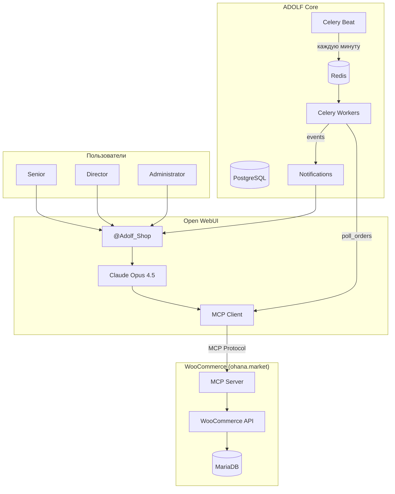
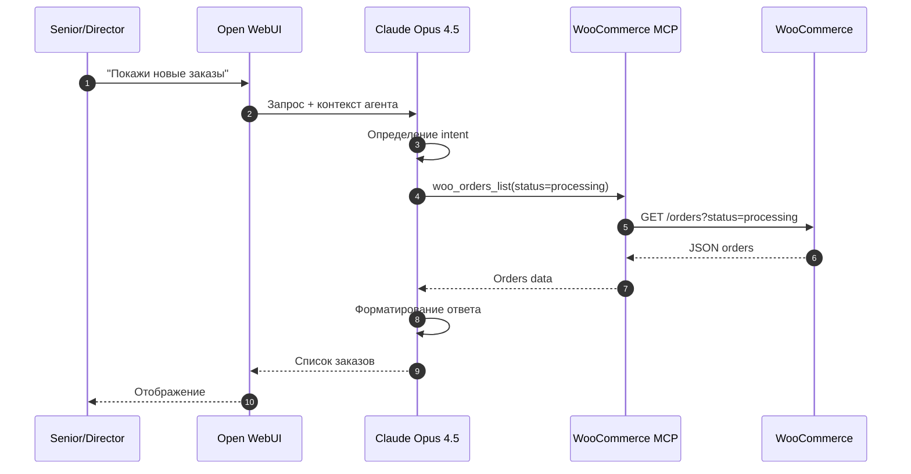
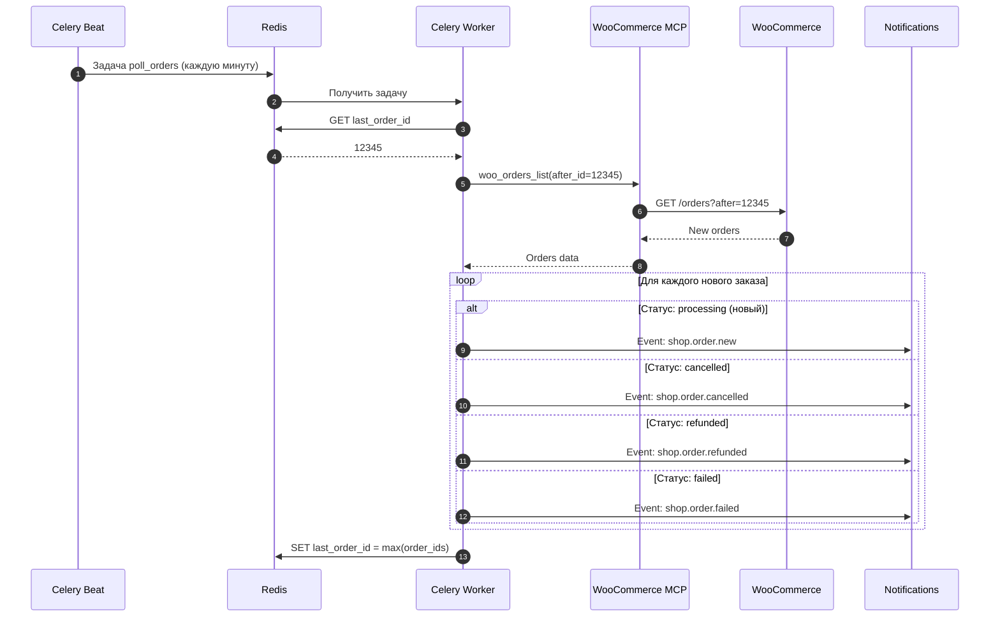
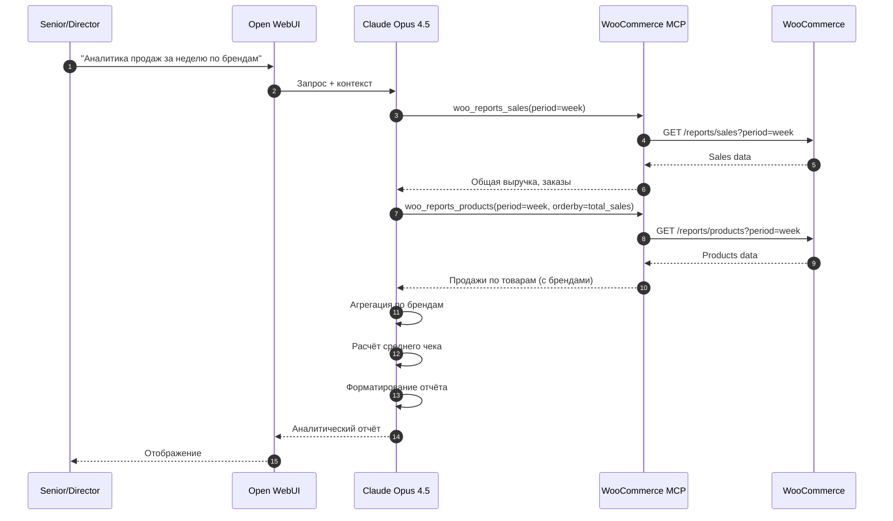
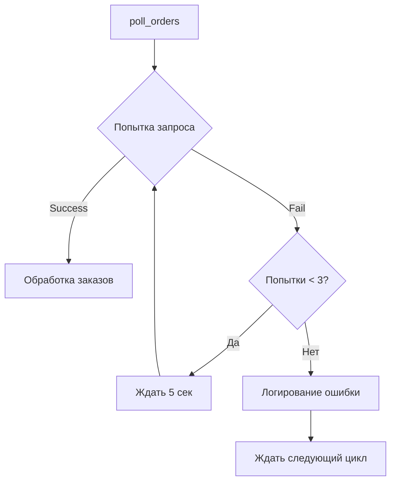
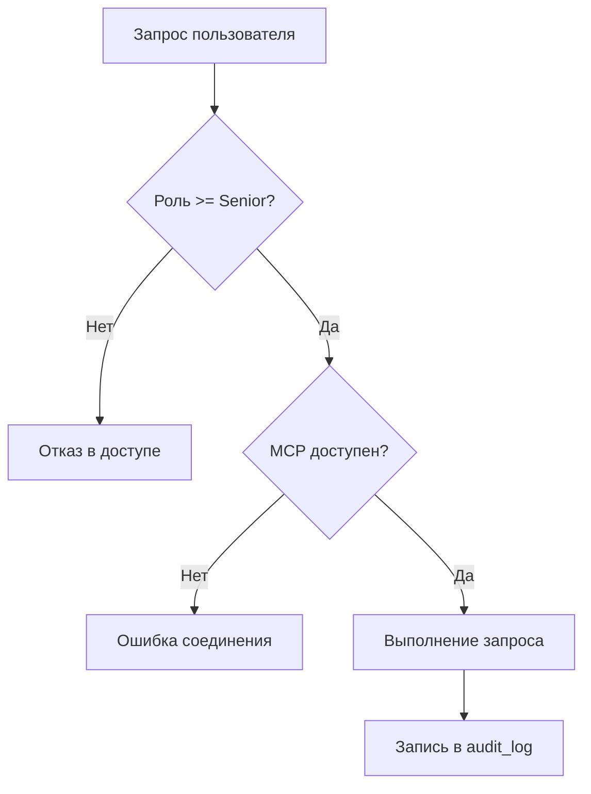

**Проект:** Интеллектуальная система управления интернет-магазином  
**Модуль:** Shop  
**Версия:** 1.0  
**Дата:** Январь 2026

---

## 1.1 Назначение модуля

### Цели модуля

ADOLF Shop — функциональный модуль системы ADOLF, обеспечивающий AI-управление интернет-магазином ohana.market через протокол MCP (Model Context Protocol).

**Основные цели:**

| Цель | Описание | Метрика успеха |
|------|----------|----------------|
| Оперативность | Мгновенное информирование о событиях | Уведомление &lt; 1 минуты |
| Единый интерфейс | Управление всеми каналами из одного места | 100% заказов в ADOLF |
| Аналитика | Понимание эффективности магазина | Ежедневные отчёты |
| Проактивность | Автоматическое выявление проблем | Оповещение о проблемных заказах |

### Задачи модуля

1. **Мониторинг заказов** — отслеживание новых заказов, отмен, возвратов
2. **Управление заказами** — просмотр деталей, поиск, фильтрация
3. **Поиск товаров** — поиск по каталогу через MCP
4. **Аналитика** — выручка, средний чек, топ товаров, продажи по брендам
5. **Уведомления** — push-оповещения о событиях

### Целевые пользователи

| Роль | Доступ | Функции |
|------|--------|---------|
| Senior | Полный доступ | Все функции модуля |
| Director | Полный доступ | Все функции + отчётность |
| Administrator | Полный доступ | Все функции + конфигурация |

&gt; **Примечание:** Роли Staff и Manager не имеют доступа к модулю Shop в v1.0.

---

## 1.2 Границы модуля

### Входит в модуль Shop

| Компонент | Описание |
|-----------|----------|
| MCP Client | Интеграция с WooCommerce через MCP tools |
| Polling Service | Периодическая проверка событий (каждую минуту) |
| Event Detector | Выявление новых заказов, отмен, возвратов |
| Analytics Engine | Расчёт метрик продаж |
| Open WebUI Agent | Интерфейс `@Adolf_Shop` для пользователей |
| Celery Tasks | Фоновые задачи polling |

### Не входит в модуль Shop

| Компонент | Где реализовано | Тип взаимодействия |
|-----------|-----------------|-------------------|
| Авторизация пользователей | ADOLF Core (Middleware) | Используется готовая |
| Хранение пользователей | ADOLF Core (PostgreSQL) | Чтение таблицы `users` |
| Система уведомлений | ADOLF Core (Notifications) | Event Bus |
| MCP Server | WooCommerce (плагин) | Внешний сервис |
| AI-модель | Claude Opus 4.5 | Через Open WebUI |
| Данные о товарах | WooCommerce | Через MCP |
| Данные о заказах | WooCommerce | Через MCP |

### Функционал v2.0 (будущее)

| Компонент | Описание |
|-----------|----------|
| Review Responder | Ответы на отзывы (интеграция с Reputation) |
| Catalog Manager | Управление каталогом товаров |
| Price Sync | Синхронизация цен |
| Stock Sync | Синхронизация остатков |
| CFO Integration | Передача данных для финансовой отчётности |
| Office Integration | Визуализация агента Shop |

---

## 1.3 Зависимости от ADOLF Core

### 1.3.1 Middleware (FastAPI)

**Используемые возможности:**

| Возможность | Применение в Shop |
|-------------|-------------------|
| Авторизация | Проверка `role >= senior` для доступа к функциям |
| Идентификация | Получение `user_id` из заголовков |
| Аудит | Логирование действий в `audit_log` |

&gt; **Примечание:** Модуль Shop не имеет собственных REST API endpoints. Все данные получаются через MCP напрямую из WooCommerce.

### 1.3.2 Celery Workers

**Задачи Shop:**

| Задача | Очередь | Периодичность | Описание |
|--------|---------|---------------|----------|
| `shop.poll_orders` | default | */1 * * * * | Проверка новых заказов |
| `shop.detect_events` | default | По событию | Выявление событий (отмены, возвраты) |
| `shop.send_notification` | default | По событию | Отправка уведомления |

**Расширение структуры tasks:**

```
tasks/
└── shop_tasks.py        # Реализация задач
```

### 1.3.3 PostgreSQL

**Новые таблицы:** Не требуются для MVP.

Модуль Shop работает в stateless-режиме:
- Все данные запрашиваются из WooCommerce через MCP в реальном времени
- Состояние polling хранится в Redis (Celery Beat)
- История событий — в таблице `notifications` (Core)

**Используемые таблицы Core:**

| Таблица | Использование |
|---------|---------------|
| `users` | Получение `role` для проверки доступа |
| `audit_log` | Запись действий пользователей |
| `notifications` | Создание уведомлений о событиях |

### 1.3.4 Redis

**Использование:**

| Применение | Описание |
|------------|----------|
| Celery Broker | Очередь задач polling |
| Celery Beat State | Хранение расписания и состояния задач |
| Last Poll State | ID последнего обработанного заказа |

### 1.3.5 Notification System

**Типы событий для уведомлений:**

| Событие | Уровень | Получатели | Описание |
|---------|---------|------------|----------|
| `shop.order.new` | info | Senior+ | Новый заказ |
| `shop.order.cancelled` | warning | Senior+ | Заказ отменён |
| `shop.order.refunded` | warning | Senior+ | Возврат средств |
| `shop.order.failed` | error | Senior+ | Ошибка оплаты |

### 1.3.6 Environment Variables

**Конфигурация WooCommerce MCP:**

```bash
# WooCommerce MCP
WOOCOMMERCE_MCP_URL=https://ohana.market/wp-json/mcp/v1
WOOCOMMERCE_MCP_ENABLED=true

# Polling
SHOP_POLLING_INTERVAL=60  # секунды
SHOP_PENDING_PAYMENT_THRESHOLD=48  # часы
```

---

## 1.4 Компоненты модуля

### 1.4.1 Архитектурная концепция

Ключевое отличие модуля Shop от других модулей ADOLF:

**Традиционная архитектура (Reputation, Content Factory и др.):**
```
User → Open WebUI → Pipeline → ADOLF API → External Service
```

**Архитектура Shop (Agentic Commerce):**
```
User → Open WebUI → Claude + MCP Tools → WooCommerce MCP Server
```

Claude напрямую использует MCP tools для взаимодействия с WooCommerce, минуя промежуточный API-слой ADOLF.

### 1.4.2 Структура компонентов



### 1.4.3 MCP Tools Layer

WooCommerce MCP предоставляет следующие tools:

**Заказы:**

| Tool | Описание |
|------|----------|
| `woo_orders_list` | Список заказов с фильтрацией |
| `woo_orders_get` | Детали заказа по ID |
| `woo_orders_search` | Поиск заказов |

**Товары:**

| Tool | Описание |
|------|----------|
| `woo_products_list` | Список товаров |
| `woo_products_get` | Детали товара по ID |
| `woo_products_search` | Поиск товаров |

**Аналитика:**

| Tool | Описание |
|------|----------|
| `woo_reports_sales` | Отчёт по продажам |
| `woo_reports_orders` | Отчёт по заказам |
| `woo_reports_products` | Отчёт по товарам |

### 1.4.4 Open WebUI Agent

**Агент:** `@Adolf_Shop`

**Функции агента (через MCP):**

| Функция | MCP Tool | Описание |
|---------|----------|----------|
| Новые заказы | `woo_orders_list` | Заказы со статусом processing |
| Заказы в ожидании | `woo_orders_list` | Заказы со статусом pending |
| Проблемные заказы | `woo_orders_list` | Заказы со статусами failed, refunded |
| Поиск заказов | `woo_orders_search` | По номеру, клиенту, дате |
| Детали заказа | `woo_orders_get` | Полная информация о заказе |
| Поиск товаров | `woo_products_search` | По названию, SKU, бренду |
| Аналитика продаж | `woo_reports_sales` | Выручка, количество заказов |
| Топ товаров | `woo_reports_products` | Лидеры продаж |

---

## 1.5 Потоки данных

### 1.5.1 Поток 1: Пользовательский запрос



### 1.5.2 Поток 2: Polling событий



### 1.5.3 Поток 3: Аналитика продаж



---

## 1.6 Обработка ошибок

### MCP Connection Errors

| Ошибка | Обработка |
|--------|-----------|
| Connection timeout | Retry через 5 секунд, max 3 попытки |
| Authentication error | Уведомление администратора |
| Rate limit | Exponential backoff |
| Server unavailable | Circuit breaker на 60 секунд |

### Polling Errors



### Единая политика

| Параметр | Значение |
|----------|----------|
| Timeout запроса MCP | 30 секунд |
| Retry стратегия | Exponential backoff: 5с → 10с → 20с |
| Максимум попыток | 3 |
| Circuit breaker открытие | После 5 последовательных ошибок |
| Circuit breaker reset | 60 секунд |

---

## 1.7 Безопасность

### Доступ к MCP

| Аспект | Реализация |
|--------|------------|
| Аутентификация | API ключи WooCommerce |
| Авторизация | Проверка роли в ADOLF Core |
| Шифрование | HTTPS для MCP-соединения |
| Аудит | Логирование в `audit_log` |

### Ограничения доступа



---

## 1.8 Масштабирование

### Текущая конфигурация

| Параметр | Значение |
|----------|----------|
| Polling interval | 1 минута |
| Celery workers | 1 (shared с другими модулями) |
| Expected orders/day | ~20-50 |

### Рекомендации по нагрузке

| Параметр | Значение v1.0 | Предел |
|----------|---------------|--------|
| Заказов в день | ~50 | 500 |
| Polling interval | 1 минута | 30 секунд |
| Concurrent MCP requests | 1 | 5 |

### Горизонтальное масштабирование

При росте нагрузки:
1. Увеличение количества Celery workers
2. Уменьшение polling interval
3. Кэширование аналитических данных в Redis

---

## Приложение А: Контрольные точки

| Критерий | Проверка |
|----------|----------|
| MCP соединение | Claude успешно вызывает woo_* tools |
| Polling работает | Логи Celery показывают задачи poll_orders |
| События детектируются | Новые заказы создают уведомления |
| Аналитика | Отчёты возвращают данные |
| Уведомления | События приходят в Open WebUI |

---

## Приложение Б: Расширение в v2.0

При переходе на v2.0 планируется добавление:

| Компонент | Описание |
|-----------|----------|
| ReviewResponder | Ответы на отзывы WooCommerce |
| CatalogManager | CRUD операции с товарами |
| PriceSync | Синхронизация цен с маркетплейсами |
| StockSync | Синхронизация остатков |
| CFOIntegration | Экспорт данных для финансов |
| OfficeIntegration | Агент в визуализации Office |

---

**Документ подготовлен:** Январь 2026  
**Версия:** 1.0  
**Статус:** Черновик
