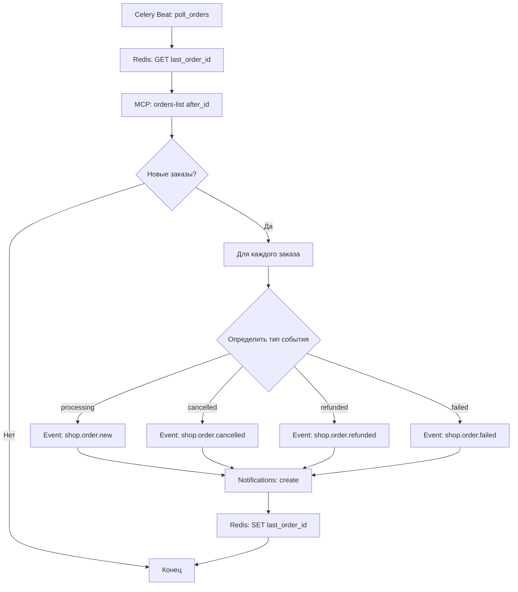
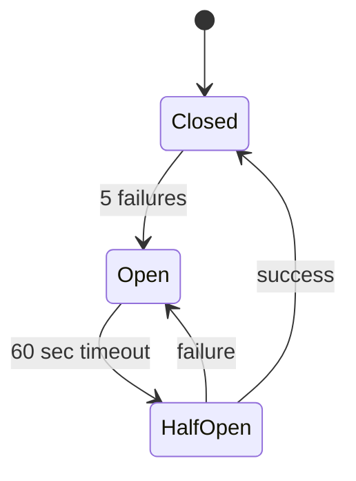

**Проект:** Интеллектуальная система управления интернет-магазином  
**Модуль:** Shop  
**Версия:** 1.0  
**Дата:** Январь 2026

---

## 2.1 Обзор MCP

### Что такое MCP

Model Context Protocol (MCP) — открытый стандарт, позволяющий AI-приложениям безопасно взаимодействовать с внешними источниками данных и инструментами. WooCommerce 10.3+ включает нативную поддержку MCP.

### Архитектура WooCommerce MCP

```
AI Client (Claude)
    ↓ (MCP protocol over stdio/JSON-RPC)
Local MCP Proxy (mcp-wordpress-remote)
    ↓ (HTTP/HTTPS requests with authentication)
Remote WordPress MCP Server (mcp-adapter)
    ↓ (WordPress Abilities API)
WooCommerce Abilities
    ↓ (REST API calls or direct operations)
WooCommerce Core
```

### Ключевые компоненты

| Компонент | Описание |
|-----------|----------|
| MCP Client | Claude Opus 4.5 в Open WebUI |
| MCP Proxy | `@automattic/mcp-wordpress-remote` |
| MCP Server | WooCommerce плагин (mcp-adapter) |
| Abilities API | WordPress система регистрации возможностей |
| Transport | HTTPS с API-ключами WooCommerce |

---

## 2.2 Доступные MCP Tools

### Product Management

| Ability | Описание | Параметры |
|---------|----------|-----------|
| `woocommerce/products-list` | Список товаров | `page`, `per_page`, `search`, `category`, `status` |
| `woocommerce/products-get` | Детали товара | `id` |
| `woocommerce/products-create` | Создание товара | Product object |
| `woocommerce/products-update` | Обновление товара | `id`, Product object |
| `woocommerce/products-delete` | Удаление товара | `id` |

### Order Management

| Ability | Описание | Параметры |
|---------|----------|-----------|
| `woocommerce/orders-list` | Список заказов | `page`, `per_page`, `status`, `customer`, `after`, `before` |
| `woocommerce/orders-get` | Детали заказа | `id` |
| `woocommerce/orders-create` | Создание заказа | Order object |
| `woocommerce/orders-update` | Обновление заказа | `id`, Order object |

### Использование в ADOLF Shop (MVP)

| Функция Shop | MCP Ability | Режим |
|--------------|-------------|-------|
| Новые заказы | `woocommerce/orders-list` | Read |
| Заказы в ожидании | `woocommerce/orders-list` | Read |
| Проблемные заказы | `woocommerce/orders-list` | Read |
| Поиск заказов | `woocommerce/orders-list` | Read |
| Детали заказа | `woocommerce/orders-get` | Read |
| Поиск товаров | `woocommerce/products-list` | Read |

> **Примечание:** В MVP используются только Read-операции. Write-операции планируются для v2.0.

---

## 2.3 Настройка MCP сервера

### Включение MCP в WooCommerce

**Вариант 1: Через фильтр WordPress**

```php
// В файле functions.php или плагине
add_filter( 'woocommerce_features', function( $features ) {
    $features['mcp_integration'] = true;
    return $features;
});
```

**Вариант 2: Через WP-CLI**

```bash
wp option update woocommerce_feature_mcp_integration_enabled yes
```

### Создание API-ключей

1. Перейти в **WooCommerce → Settings → Advanced → REST API**
2. Нажать **Add Key**
3. Заполнить:
   - **Description:** ADOLF Shop Integration
   - **User:** Администратор
   - **Permissions:** Read (для MVP)
4. Нажать **Generate API Key**
5. Сохранить Consumer Key и Consumer Secret

### MCP Endpoint

```
https://ohana.market/wp-json/woocommerce/mcp
```

---

## 2.4 Конфигурация MCP Client

### Подключение к Open WebUI

MCP Client настраивается в конфигурации Open WebUI для агента `@Adolf_Shop`.

**Конфигурация MCP сервера:**

```json
{
  "mcpServers": {
    "woocommerce_mcp": {
      "type": "stdio",
      "command": "npx",
      "args": [
        "-y",
        "@automattic/mcp-wordpress-remote@latest"
      ],
      "env": {
        "WP_API_URL": "https://ohana.market/wp-json/woocommerce/mcp",
        "CUSTOM_HEADERS": "{\"X-MCP-API-Key\": \"ck_xxx:cs_xxx\"}"
      }
    }
  }
}
```

### Environment Variables

```bash
# WooCommerce MCP Configuration
WOOCOMMERCE_MCP_URL=https://ohana.market/wp-json/woocommerce/mcp
WOOCOMMERCE_CONSUMER_KEY=ck_xxxxxxxxxxxxxxxxxxxxxxxxxxxxxxxxxxxxxxxx
WOOCOMMERCE_CONSUMER_SECRET=cs_xxxxxxxxxxxxxxxxxxxxxxxxxxxxxxxxxxxxxxxx

# Polling Configuration
SHOP_POLLING_INTERVAL=60
SHOP_PENDING_PAYMENT_THRESHOLD=48
```

---

## 2.5 Аутентификация и безопасность

### Формат API-ключа

```
X-MCP-API-Key: consumer_key:consumer_secret
```

Пример:
```
X-MCP-API-Key: ck_abc123def456:cs_xyz789ghi012
```

### Уровни доступа

| Permission | Операции | Использование в Shop |
|------------|----------|---------------------|
| `read` | GET запросы | MVP (v1.0) |
| `write` | POST, PUT, PATCH, DELETE | v2.0 |
| `read_write` | Все операции | v2.0 |

### Требования безопасности

| Требование | Значение |
|------------|----------|
| HTTPS | Обязательно |
| API Key rotation | Рекомендуется каждые 90 дней |
| Minimal permissions | Только `read` для MVP |
| IP whitelist | Рекомендуется (ADOLF server IP) |

### Отключение HTTPS (только для разработки)

```php
// НЕ ИСПОЛЬЗОВАТЬ В ПРОДАКШЕНЕ
add_filter( 'woocommerce_mcp_allow_insecure_transport', '__return_true' );
```

---

## 2.6 Работа с заказами через MCP

### Получение списка заказов

**MCP Ability:** `woocommerce/orders-list`

**Параметры:**

| Параметр | Тип | Описание |
|----------|-----|----------|
| `page` | integer | Номер страницы (default: 1) |
| `per_page` | integer | Записей на страницу (default: 10, max: 100) |
| `status` | string | Статус заказа |
| `customer` | integer | ID клиента |
| `after` | string | Заказы после даты (ISO 8601) |
| `before` | string | Заказы до даты (ISO 8601) |
| `order` | string | Сортировка: asc/desc |
| `orderby` | string | Поле сортировки: date, id, include, title, slug |

**Статусы заказов WooCommerce:**

| Статус | Описание | Использование в Shop |
|--------|----------|---------------------|
| `pending` | Ожидает оплаты | Заказы в ожидании |
| `processing` | В обработке | Новые заказы |
| `on-hold` | На удержании | — |
| `completed` | Выполнен | Аналитика |
| `cancelled` | Отменён | Сигнал об отмене |
| `refunded` | Возврат | Проблемные заказы |
| `failed` | Ошибка оплаты | Проблемные заказы |

**Пример запроса (новые заказы):**

```
woocommerce/orders-list
{
  "status": "processing",
  "per_page": 20,
  "orderby": "date",
  "order": "desc"
}
```

**Пример ответа:**

```json
[
  {
    "id": 12345,
    "status": "processing",
    "date_created": "2026-01-25T10:30:00",
    "total": "5990.00",
    "currency": "RUB",
    "billing": {
      "first_name": "Иван",
      "last_name": "Петров",
      "email": "ivan@example.com",
      "phone": "+7999123456"
    },
    "line_items": [
      {
        "id": 1,
        "name": "Платье летнее",
        "product_id": 567,
        "quantity": 1,
        "total": "5990.00"
      }
    ]
  }
]
```

### Получение деталей заказа

**MCP Ability:** `woocommerce/orders-get`

**Параметры:**

| Параметр | Тип | Описание |
|----------|-----|----------|
| `id` | integer | ID заказа (обязательный) |

**Пример запроса:**

```
woocommerce/orders-get
{
  "id": 12345
}
```

---

## 2.7 Работа с товарами через MCP

### Поиск товаров

**MCP Ability:** `woocommerce/products-list`

**Параметры:**

| Параметр | Тип | Описание |
|----------|-----|----------|
| `page` | integer | Номер страницы |
| `per_page` | integer | Записей на страницу |
| `search` | string | Поисковый запрос |
| `category` | integer | ID категории |
| `status` | string | Статус: publish, draft, pending |
| `sku` | string | Артикул товара |
| `min_price` | string | Минимальная цена |
| `max_price` | string | Максимальная цена |
| `stock_status` | string | instock, outofstock, onbackorder |

**Пример запроса (поиск по названию):**

```
woocommerce/products-list
{
  "search": "платье",
  "status": "publish",
  "per_page": 10
}
```

**Пример ответа:**

```json
[
  {
    "id": 567,
    "name": "Платье летнее",
    "slug": "plate-letnee",
    "status": "publish",
    "price": "5990",
    "regular_price": "7990",
    "sale_price": "5990",
    "sku": "DR-2026-001",
    "stock_quantity": 15,
    "stock_status": "instock",
    "categories": [
      {"id": 10, "name": "Платья"}
    ],
    "brands": [
      {"id": 5, "name": "Охана Style"}
    ],
    "images": [
      {"src": "https://ohana.market/wp-content/uploads/..."}
    ]
  }
]
```

### Фильтрация по бренду

WooCommerce Brands использует таксономию `product_brand`. Для фильтрации:

```
woocommerce/products-list
{
  "brand": 5,
  "status": "publish"
}
```

> **Примечание:** Параметр `brand` доступен при установленном плагине WooCommerce Brands.

---

## 2.8 Аналитика через MCP

### Ограничения MVP

WooCommerce MCP в текущей версии (10.4.3) не предоставляет прямой доступ к Reports API через MCP abilities. Для аналитики используется агрегация данных из orders-list.

### Расчёт метрик

**Выручка за период:**

```
1. woocommerce/orders-list (status=completed, after=start_date, before=end_date)
2. Claude агрегирует поле "total" из всех заказов
```

**Средний чек:**

```
1. Получить все completed заказы за период
2. Сумма total / количество заказов
```

**Топ товаров:**

```
1. Получить все completed заказы за период
2. Извлечь line_items из каждого заказа
3. Агрегировать по product_id: сумма quantity, сумма total
4. Сортировать по total desc
```

**Продажи по брендам:**

```
1. Получить топ товаров
2. Для каждого товара получить бренд через products-get
3. Агрегировать по brand_id
```

**Заказы без оплаты (> 48 часов):**

```
1. woocommerce/orders-list (status=pending, before=NOW-48h)
2. Вернуть список заказов
```

### Пример промпта для аналитики

```
User: "Аналитика продаж за последнюю неделю"

Claude:
1. Вызывает woocommerce/orders-list с:
   - status: completed
   - after: 2026-01-18T00:00:00
   - before: 2026-01-25T23:59:59
   - per_page: 100
2. Агрегирует данные
3. Формирует отчёт:
   - Выручка: 450,000 ₽
   - Заказов: 75
   - Средний чек: 6,000 ₽
   - Топ-5 товаров
   - Распределение по брендам
```

---

## 2.9 Polling через MCP

### Механизм polling

Celery Beat запускает задачу `shop.poll_orders` каждую минуту.

**Алгоритм:**



### Хранение состояния

```python
# Redis keys
SHOP_LAST_ORDER_ID = "shop:polling:last_order_id"
SHOP_LAST_POLL_TIME = "shop:polling:last_poll_time"
```

### MCP запрос для polling

```
woocommerce/orders-list
{
  "after": "2026-01-25T10:00:00",
  "per_page": 50,
  "orderby": "date",
  "order": "asc"
}
```

---

## 2.10 Обработка ошибок MCP

### Типы ошибок

| Код | Тип | Описание | Обработка |
|-----|-----|----------|-----------|
| 401 | Authentication | Неверный API-ключ | Логирование, алерт администратору |
| 403 | Permission | Недостаточно прав | Проверить scope ключа |
| 404 | Not Found | Ресурс не найден | Вернуть пользователю |
| 429 | Rate Limit | Превышен лимит запросов | Exponential backoff |
| 500 | Server Error | Ошибка WooCommerce | Retry с backoff |
| Timeout | Connection | Таймаут соединения | Retry, circuit breaker |

### Retry стратегия

```python
RETRY_CONFIG = {
    "max_retries": 3,
    "initial_delay": 5,  # секунды
    "backoff_factor": 2,  # 5s -> 10s -> 20s
    "max_delay": 60
}
```

### Circuit Breaker

```python
CIRCUIT_BREAKER_CONFIG = {
    "failure_threshold": 5,      # открытие после 5 ошибок
    "recovery_timeout": 60,      # секунды до half-open
    "half_open_requests": 1      # тестовых запросов
}
```

**Состояния:**



---

## 2.11 Расширение MCP (v2.0)

### Кастомные abilities для ADOLF

В v2.0 планируется создание собственных MCP abilities для расширенной функциональности:

**Пример: получение аналитики по брендам**

```php
add_action( 'abilities_api_init', function() {
    wp_register_ability(
        'adolf-shop/analytics-by-brand',
        array(
            'label'       => 'Аналитика по брендам',
            'description' => 'Получение статистики продаж по брендам за период',
            'execute_callback' => 'adolf_shop_analytics_by_brand',
            'permission_callback' => function () {
                return current_user_can( 'manage_woocommerce' );
            },
            'input_schema' => array(
                'type' => 'object',
                'properties' => array(
                    'start_date' => array(
                        'type' => 'string',
                        'format' => 'date',
                        'description' => 'Начало периода'
                    ),
                    'end_date' => array(
                        'type' => 'string',
                        'format' => 'date',
                        'description' => 'Конец периода'
                    )
                ),
                'required' => array( 'start_date', 'end_date' )
            ),
            'output_schema' => array(
                'type' => 'array',
                'items' => array(
                    'type' => 'object',
                    'properties' => array(
                        'brand_id' => array( 'type' => 'integer' ),
                        'brand_name' => array( 'type' => 'string' ),
                        'total_sales' => array( 'type' => 'number' ),
                        'orders_count' => array( 'type' => 'integer' )
                    )
                )
            )
        )
    );
});

// Включение в WooCommerce MCP
add_filter( 'woocommerce_mcp_include_ability', function( $include, $ability_id ) {
    if ( str_starts_with( $ability_id, 'adolf-shop/' ) ) {
        return true;
    }
    return $include;
}, 10, 2 );
```

---

## Приложение А: Справочник MCP abilities

### Orders

| Ability | Method | Endpoint |
|---------|--------|----------|
| `woocommerce/orders-list` | GET | /wc/v3/orders |
| `woocommerce/orders-get` | GET | /wc/v3/orders/{id} |
| `woocommerce/orders-create` | POST | /wc/v3/orders |
| `woocommerce/orders-update` | PUT | /wc/v3/orders/{id} |

### Products

| Ability | Method | Endpoint |
|---------|--------|----------|
| `woocommerce/products-list` | GET | /wc/v3/products |
| `woocommerce/products-get` | GET | /wc/v3/products/{id} |
| `woocommerce/products-create` | POST | /wc/v3/products |
| `woocommerce/products-update` | PUT | /wc/v3/products/{id} |
| `woocommerce/products-delete` | DELETE | /wc/v3/products/{id} |

---

## Приложение Б: Troubleshooting

### MCP Server Not Available

```bash
# Проверить feature flag
wp option get woocommerce_feature_mcp_integration_enabled

# Проверить endpoint
curl -I https://ohana.market/wp-json/woocommerce/mcp
```

### Authentication Failures

```bash
# Проверить формат ключа
echo "ck_xxx:cs_xxx" | base64

# Тест аутентификации
curl -H "X-MCP-API-Key: ck_xxx:cs_xxx" \
     https://ohana.market/wp-json/woocommerce/mcp
```

### Логи WooCommerce

Проверить **WooCommerce → Status → Logs** с источником `woocommerce-mcp`.

---

**Документ подготовлен:** Январь 2026  
**Версия:** 1.0  
**Статус:** Черновик
