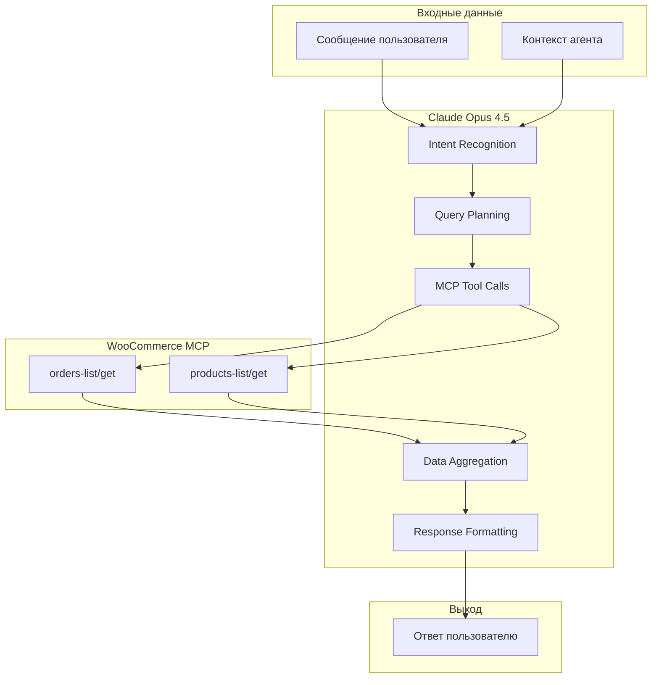
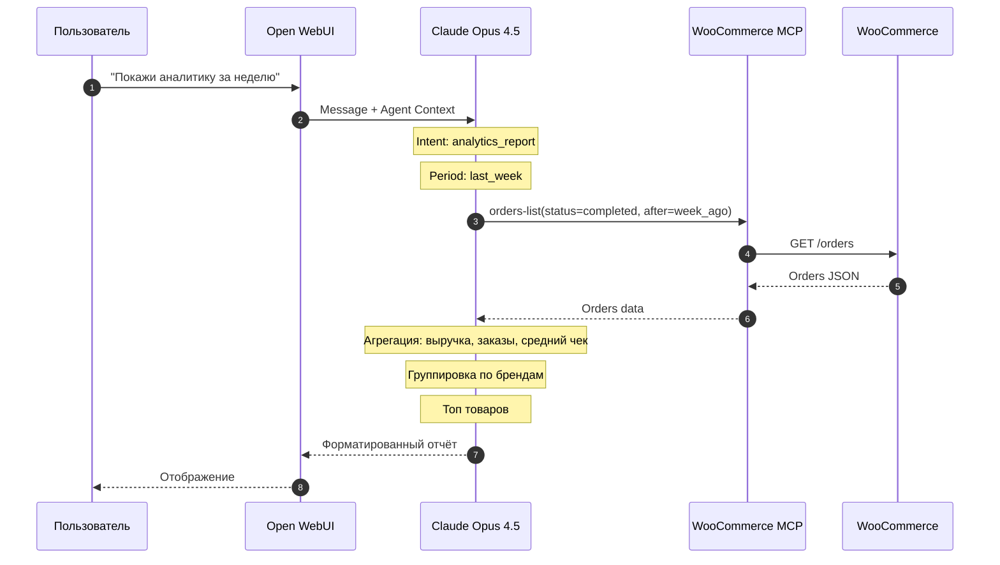

**Проект:** Интеллектуальная система управления интернет-магазином  
**Модуль:** Shop / AI Pipeline  
**Версия:** 1.0  
**Дата:** Январь 2026

---

## 3.1 Назначение и архитектура

### Назначение

AI Pipeline модуля Shop отличается от других модулей ADOLF — вся интеллектуальная обработка происходит непосредственно в Claude через MCP tools, без промежуточного backend-слоя.

| Функция | Описание | Реализация |
|---------|----------|------------|
| Понимание запроса | Определение intent пользователя | Claude NLU |
| Получение данных | Запросы к WooCommerce | MCP Tools |
| Агрегация | Расчёт метрик, группировка | Claude |
| Форматирование | Структурирование ответа | Claude |

### Архитектура Pipeline



### Последовательность обработки



---

## 3.2 Intent Recognition

### Классификация запросов

Claude автоматически определяет intent на основе текста запроса и контекста агента.

| Intent | Примеры запросов | MCP Tools |
|--------|------------------|-----------|
| `orders_new` | "новые заказы", "что нового" | `orders-list` |
| `orders_pending` | "заказы в ожидании", "неоплаченные" | `orders-list` |
| `orders_problem` | "проблемные заказы", "ошибки оплаты" | `orders-list` |
| `orders_search` | "найди заказ #123", "заказы Иванова" | `orders-list` |
| `order_details` | "детали заказа 12345", "покажи заказ" | `orders-get` |
| `products_search` | "найди платье", "товар артикул ABC" | `products-list` |
| `analytics_revenue` | "выручка за неделю", "сколько заработали" | `orders-list` |
| `analytics_top` | "топ товаров", "что продаётся лучше" | `orders-list` |
| `analytics_brands` | "продажи по брендам", "статистика Kids" | `orders-list` |

### Контекст агента

System prompt агента `@Adolf_Shop` содержит инструкции для правильной интерпретации:

```
Ты — AI-ассистент для управления интернет-магазином ohana.market.

Твои возможности:
1. Просмотр и поиск заказов
2. Поиск товаров в каталоге
3. Аналитика продаж

Бренды магазина:
- Охана Kids — детская одежда
- Охана Style — взрослая одежда
- Охана Care — товары для ухода
- Охана Lux — премиум-сегмент

При запросе аналитики:
- Всегда указывай период
- Группируй по брендам, если применимо
- Рассчитывай средний чек
- Показывай топ-5 товаров

При работе с заказами:
- Показывай ключевую информацию: номер, дата, сумма, статус
- Для деталей показывай состав заказа и контакты клиента
```

---

## 3.3 Query Planning

### Стратегии запросов

Claude определяет оптимальную стратегию запросов к MCP на основе intent:

**Простой запрос (single call):**

```
Intent: orders_new
Strategy: 
  1. orders-list(status=processing, per_page=20)
```

**Составной запрос (multiple calls):**

```
Intent: analytics_revenue (за месяц)
Strategy:
  1. orders-list(status=completed, after=month_start, per_page=100)
  2. Если total_pages > 1: orders-list(page=2)
  3. ... до получения всех данных
```

**Запрос с обогащением:**

```
Intent: analytics_top (топ товаров с деталями)
Strategy:
  1. orders-list(status=completed, after=period_start)
  2. Агрегация product_id → sales
  3. products-get(id=top_product_1) для получения названий
```

### Оптимизация запросов

| Ситуация | Оптимизация |
|----------|-------------|
| Много заказов | Использовать `per_page=100` |
| Поиск по номеру | Прямой запрос `orders-get(id)` |
| Аналитика за день | Фильтр `after` + `before` |
| Поиск товара | `products-list(search=query)` |

---

## 3.4 Обработка данных заказов

### Получение списка заказов

**Новые заказы:**

```
MCP: woocommerce/orders-list
Parameters:
  status: processing
  per_page: 20
  orderby: date
  order: desc
```

**Заказы в ожидании:**

```
MCP: woocommerce/orders-list
Parameters:
  status: pending
  per_page: 50
```

**Проблемные заказы:**

```
MCP: woocommerce/orders-list
Parameters:
  status: failed,refunded
  per_page: 50
```

**Заказы без оплаты > 48 часов:**

```
MCP: woocommerce/orders-list
Parameters:
  status: pending
  before: {NOW - 48 hours}
```

### Форматирование списка заказов

Claude форматирует ответ в читаемый вид:

```markdown
## Новые заказы (5)

| № | Дата | Клиент | Сумма | Товары |
|---|------|--------|-------|--------|
| #12345 | 25.01 10:30 | Иванов И. | 5 990 ₽ | Платье летнее (1) |
| #12344 | 25.01 09:15 | Петрова А. | 12 500 ₽ | Костюм (1), Блузка (2) |
| ... | | | | |

Общая сумма: 45 670 ₽
```

### Детали заказа

```
MCP: woocommerce/orders-get
Parameters:
  id: 12345
```

**Форматирование:**

```markdown
## Заказ #12345

**Статус:** В обработке
**Дата:** 25.01.2026 10:30
**Сумма:** 5 990 ₽

### Клиент
- Имя: Иван Петров
- Email: ivan@example.com
- Телефон: +7 999 123-45-67

### Адрес доставки
г. Москва, ул. Примерная, д. 1, кв. 10

### Состав заказа
| Товар | Артикул | Кол-во | Цена |
|-------|---------|--------|------|
| Платье летнее | DR-2026-001 | 1 | 5 990 ₽ |

### Комментарий
Позвонить перед доставкой
```

---

## 3.5 Обработка данных товаров

### Поиск товаров

```
MCP: woocommerce/products-list
Parameters:
  search: "платье"
  status: publish
  per_page: 10
```

### Форматирование результатов поиска

```markdown
## Найдено товаров: 8

| Название | Артикул | Цена | Остаток | Бренд |
|----------|---------|------|---------|-------|
| Платье летнее | DR-2026-001 | 5 990 ₽ | 15 шт | Style |
| Платье вечернее | DR-2026-002 | 12 990 ₽ | 3 шт | Lux |
| Платье детское | DR-K-001 | 2 990 ₽ | 25 шт | Kids |
```

### Фильтрация по бренду

При запросе типа "товары Kids" Claude добавляет фильтр:

```
MCP: woocommerce/products-list
Parameters:
  brand: {kids_brand_id}
  status: publish
```

---

## 3.6 Аналитика продаж

### Алгоритм расчёта метрик

**Выручка:**

```python
# Псевдокод логики Claude
orders = mcp.orders_list(status='completed', after=start, before=end)
revenue = sum(order.total for order in orders)
```

**Количество заказов:**

```python
orders_count = len(orders)
```

**Средний чек:**

```python
avg_check = revenue / orders_count if orders_count > 0 else 0
```

**Топ товаров:**

```python
# Агрегация по product_id
product_sales = {}
for order in orders:
    for item in order.line_items:
        if item.product_id not in product_sales:
            product_sales[item.product_id] = {
                'name': item.name,
                'quantity': 0,
                'total': 0
            }
        product_sales[item.product_id]['quantity'] += item.quantity
        product_sales[item.product_id]['total'] += item.total

# Сортировка по total
top_products = sorted(product_sales.values(), key=lambda x: x['total'], reverse=True)[:5]
```

**Продажи по брендам:**

```python
# Получение бренда для каждого товара
brand_sales = {}
for product_id, sales in product_sales.items():
    product = mcp.products_get(id=product_id)
    brand = product.brands[0].name if product.brands else 'Без бренда'
    
    if brand not in brand_sales:
        brand_sales[brand] = {'quantity': 0, 'total': 0}
    brand_sales[brand]['quantity'] += sales['quantity']
    brand_sales[brand]['total'] += sales['total']
```

### Форматирование аналитического отчёта

```markdown
## Аналитика продаж: 18.01 — 25.01.2026

### Общие показатели
- **Выручка:** 450 000 ₽
- **Заказов:** 75
- **Средний чек:** 6 000 ₽

### Продажи по брендам

| Бренд | Заказов | Выручка | Доля |
|-------|---------|---------|------|
| Style | 35 | 210 000 ₽ | 47% |
| Kids | 25 | 125 000 ₽ | 28% |
| Care | 10 | 65 000 ₽ | 14% |
| Lux | 5 | 50 000 ₽ | 11% |

### Топ-5 товаров

| # | Товар | Продано | Выручка |
|---|-------|---------|---------|
| 1 | Платье летнее | 15 шт | 89 850 ₽ |
| 2 | Костюм детский | 12 шт | 47 880 ₽ |
| 3 | Блузка шёлковая | 10 шт | 45 900 ₽ |
| 4 | Юбка миди | 8 шт | 31 920 ₽ |
| 5 | Футболка базовая | 20 шт | 29 800 ₽ |

### Заказы без оплаты (> 48ч)
Найдено: 3 заказа на сумму 18 500 ₽
```

---

## 3.7 Обработка периодов

### Интерпретация временных запросов

Claude интерпретирует естественные запросы о времени:

| Запрос | Интерпретация |
|--------|---------------|
| "за сегодня" | `after: TODAY 00:00, before: NOW` |
| "за вчера" | `after: YESTERDAY 00:00, before: YESTERDAY 23:59` |
| "за неделю" | `after: NOW - 7 days` |
| "за месяц" | `after: NOW - 30 days` |
| "за январь" | `after: 2026-01-01, before: 2026-01-31` |
| "с 1 по 15 января" | `after: 2026-01-01, before: 2026-01-15` |

### Форматирование дат для MCP

WooCommerce ожидает даты в ISO 8601:

```
after: 2026-01-18T00:00:00
before: 2026-01-25T23:59:59
```

---

## 3.8 Обработка ошибок

### Ошибки MCP

| Ошибка | Поведение Claude |
|--------|------------------|
| Connection timeout | "Не удалось подключиться к магазину. Попробуйте позже." |
| Authentication error | "Ошибка авторизации. Обратитесь к администратору." |
| No results | "По вашему запросу ничего не найдено." |
| Rate limit | "Слишком много запросов. Подождите минуту." |

### Валидация данных

Claude проверяет корректность полученных данных:

```python
# Псевдокод валидации
if not orders:
    return "Заказов за указанный период не найдено"

if any(order.total < 0 for order in orders):
    log.warning("Negative order total detected")
    # Исключить некорректные данные
```

### Graceful degradation

При частичной недоступности данных:

```markdown
## Аналитика продаж (частичные данные)

⚠️ Не удалось получить данные о брендах для некоторых товаров.

### Общие показатели
- **Выручка:** 450 000 ₽
- **Заказов:** 75

### Топ товаров
(без группировки по брендам)
```

---

## 3.9 Кэширование

### Стратегия кэширования

В MVP кэширование не реализуется — все данные запрашиваются в реальном времени.

**Планы v2.0:**

| Данные | TTL | Хранилище |
|--------|-----|-----------|
| Список брендов | 1 час | Redis |
| Категории товаров | 1 час | Redis |
| Аналитика за прошлые периоды | 24 часа | Redis |

---

## 3.10 Метрики и мониторинг

### Метрики AI Pipeline

| Метрика | Тип | Описание |
|---------|-----|----------|
| `shop_mcp_calls_total` | counter | Количество MCP вызовов |
| `shop_mcp_duration_seconds` | histogram | Время MCP запросов |
| `shop_mcp_errors_total` | counter | Ошибки MCP |
| `shop_intents_total` | counter | Распределение intent'ов |

### Логирование

```json
{
    "event": "shop_query_processed",
    "user_id": "user_123",
    "intent": "analytics_revenue",
    "mcp_calls": [
        {
            "tool": "orders-list",
            "params": {"status": "completed", "after": "2026-01-18"},
            "duration_ms": 450,
            "results_count": 75
        }
    ],
    "total_duration_ms": 1200
}
```

---

## Приложение А: Примеры диалогов

### Пример 1: Новые заказы

```
User: Какие новые заказы?

Claude: 
[MCP: orders-list(status=processing)]

## Новые заказы (3)

| № | Дата | Клиент | Сумма |
|---|------|--------|-------|
| #12347 | 25.01 11:45 | Сидорова М. | 8 990 ₽ |
| #12346 | 25.01 11:20 | Козлов А. | 3 490 ₽ |
| #12345 | 25.01 10:30 | Иванов И. | 5 990 ₽ |

Общая сумма: 18 470 ₽
```

### Пример 2: Поиск товара

```
User: Найди детские платья до 3000 рублей

Claude:
[MCP: products-list(search=платье, brand=kids, max_price=3000)]

## Найдено: 4 товара

| Название | Артикул | Цена | Остаток |
|----------|---------|------|---------|
| Платье праздничное | DR-K-010 | 2 990 ₽ | 8 шт |
| Платье повседневное | DR-K-011 | 1 990 ₽ | 15 шт |
| Платье летнее | DR-K-012 | 2 490 ₽ | 12 шт |
| Сарафан | DR-K-013 | 1 790 ₽ | 20 шт |
```

### Пример 3: Детали заказа

```
User: Покажи заказ 12345

Claude:
[MCP: orders-get(id=12345)]

## Заказ #12345

**Статус:** В обработке  
**Дата:** 25.01.2026 10:30  
**Сумма:** 5 990 ₽

### Клиент
Иван Петров | ivan@example.com | +7 999 123-45-67

### Состав
- Платье летнее (DR-2026-001) × 1 — 5 990 ₽

### Доставка
г. Москва, ул. Примерная, д. 1
```

---

## Приложение Б: Контрольные точки

| Критерий | Проверка |
|----------|----------|
| Intent recognition | Правильно определяется тип запроса |
| MCP calls | Вызываются нужные tools с правильными параметрами |
| Data aggregation | Метрики рассчитываются корректно |
| Formatting | Ответ читаемый и структурированный |
| Error handling | Ошибки обрабатываются gracefully |

---

**Документ подготовлен:** Январь 2026  
**Версия:** 1.0  
**Статус:** Черновик
