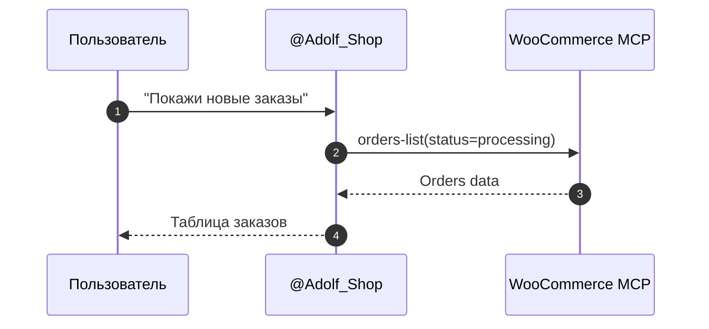
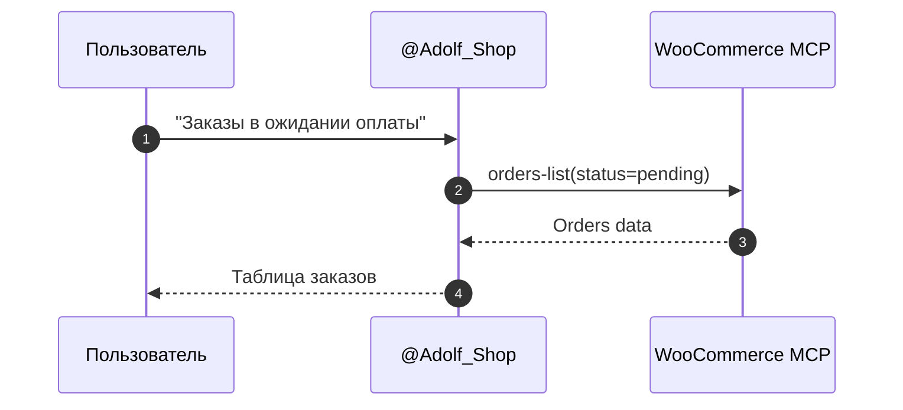
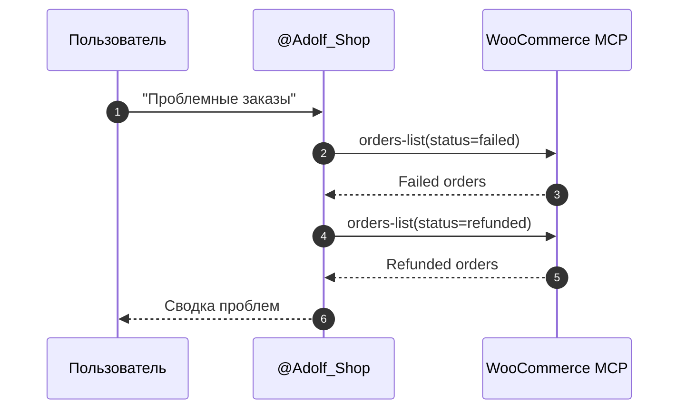
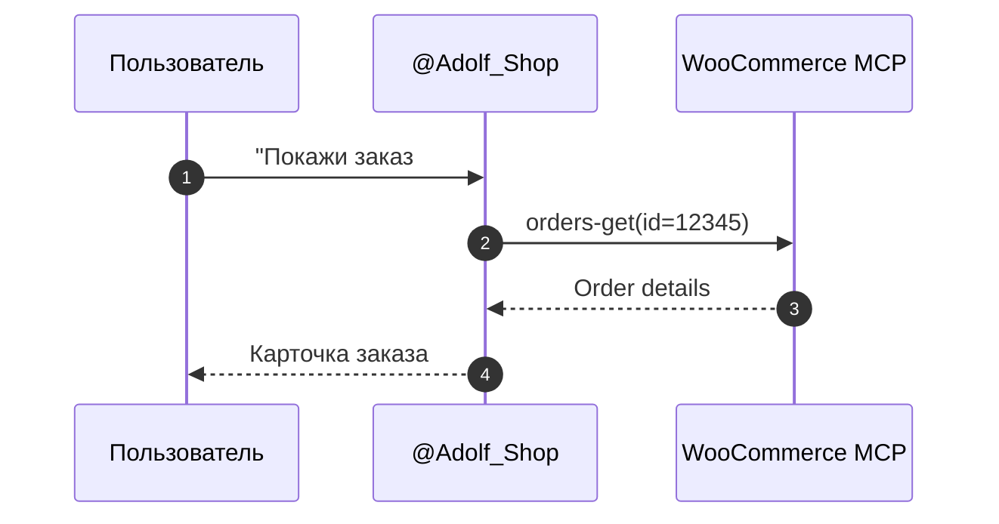
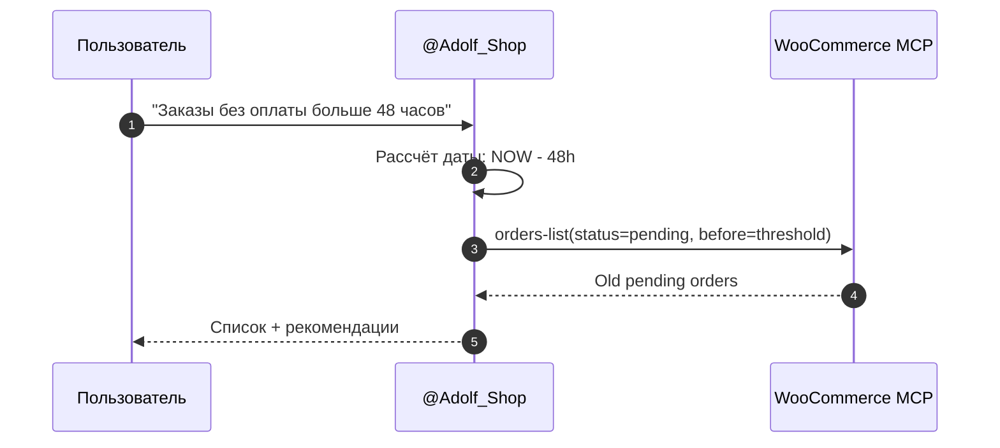
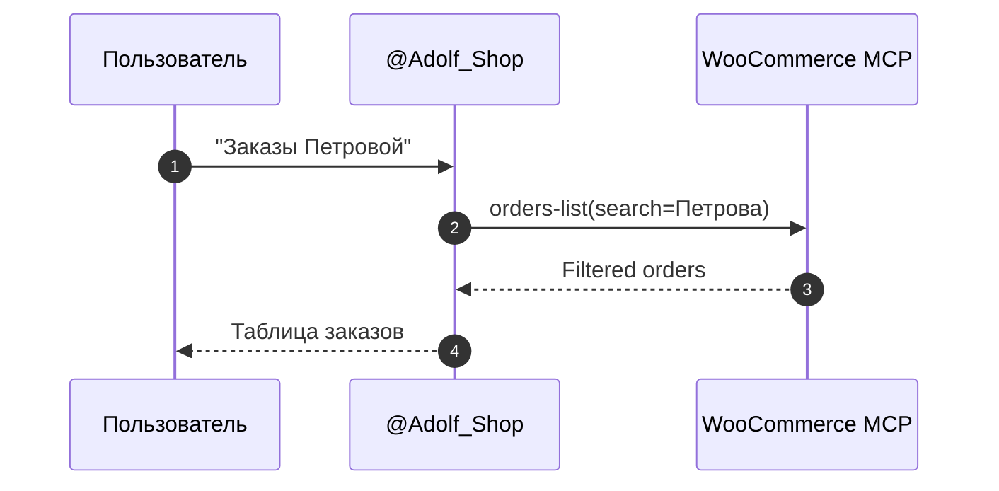
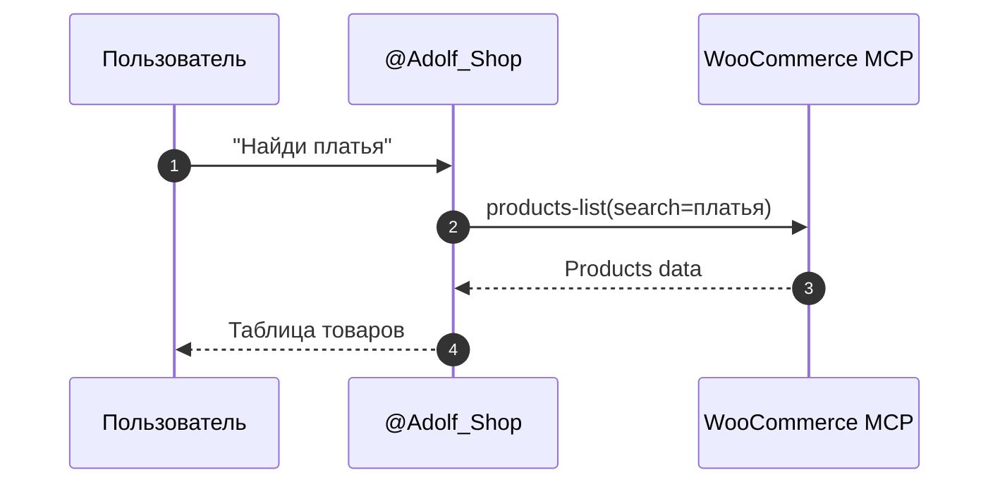
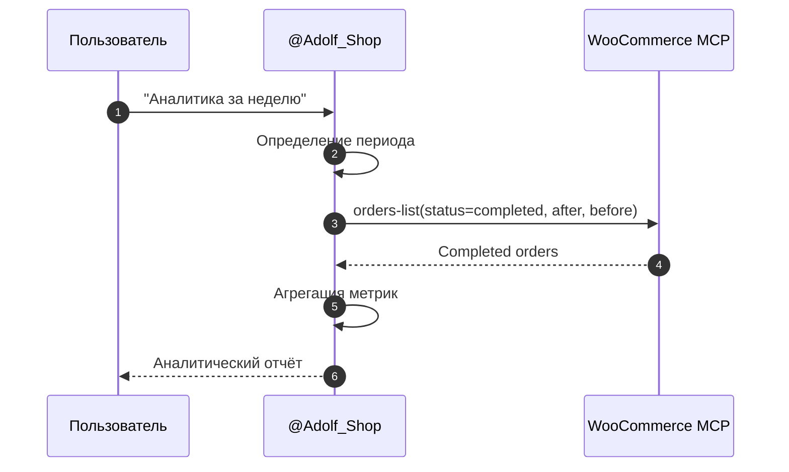
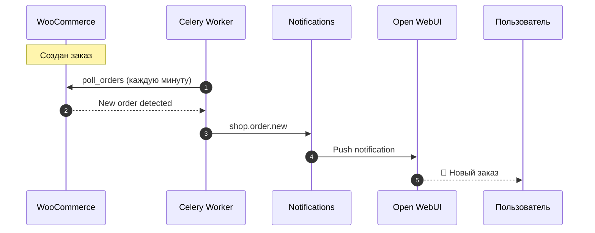
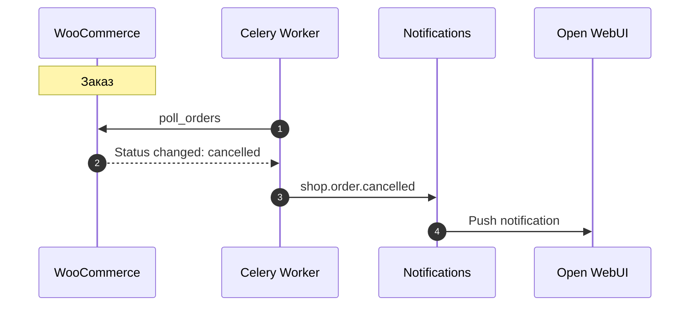

# ADOLF SHOP — Раздел 5: Сценарии использования

**Проект:** Интеллектуальная система управления интернет-магазином  
**Модуль:** Shop / Scenarios  
**Версия:** 1.0  
**Дата:** Январь 2026

---

## 5.1 Обзор сценариев

### Категории сценариев

| Категория | Описание | Количество |
|-----------|----------|------------|
| Мониторинг заказов | Отслеживание и просмотр заказов | 5 |
| Поиск | Поиск заказов и товаров | 3 |
| Аналитика | Отчёты и метрики продаж | 4 |
| Уведомления | Обработка событий | 4 |

### Роли и сценарии

| Сценарий | Senior | Director | Administrator |
|----------|:------:|:--------:|:-------------:|
| Просмотр новых заказов | ✅ | ✅ | ✅ |
| Просмотр проблемных заказов | ✅ | ✅ | ✅ |
| Поиск заказов | ✅ | ✅ | ✅ |
| Детали заказа | ✅ | ✅ | ✅ |
| Поиск товаров | ✅ | ✅ | ✅ |
| Аналитика продаж | ✅ | ✅ | ✅ |
| Настройка polling | ❌ | ❌ | ✅ |

---

## 5.2 Сценарии мониторинга заказов

### SC-01: Просмотр новых заказов

**Цель:** Получить список заказов, требующих обработки

**Актор:** Senior / Director / Administrator

**Предусловия:**
- Пользователь авторизован в Open WebUI
- Роль >= Senior

**Основной поток:**



**Шаги:**
1. Пользователь запрашивает новые заказы
2. Claude вызывает `woocommerce/orders-list` со статусом `processing`
3. WooCommerce возвращает список заказов
4. Claude форматирует и отображает таблицу

**Пример диалога:**

```
User: Покажи новые заказы

Claude: 
## Новые заказы (5)

| № | Дата | Клиент | Сумма | Товары |
|---|------|--------|-------|--------|
| #12347 | 25.01 11:45 | Сидорова М. | 8 990 ₽ | Костюм детский (1) |
| #12346 | 25.01 11:20 | Козлов А. | 3 490 ₽ | Футболка (2) |
| #12345 | 25.01 10:30 | Иванов И. | 5 990 ₽ | Платье летнее (1) |

**Итого:** 18 470 ₽
```

**Альтернативные потоки:**
- A1: Нет новых заказов → "Новых заказов нет"
- A2: Ошибка MCP → "Не удалось получить данные. Попробуйте позже."

---

### SC-02: Просмотр заказов в ожидании оплаты

**Цель:** Получить список неоплаченных заказов

**Актор:** Senior / Director / Administrator

**Основной поток:**



**Пример диалога:**

```
User: Заказы в ожидании оплаты

Claude:
## Заказы в ожидании (3)

| № | Дата создания | Клиент | Сумма | Ожидание |
|---|---------------|--------|-------|----------|
| #12350 | 25.01 12:00 | Новиков К. | 7 500 ₽ | 2 часа |
| #12348 | 25.01 08:30 | Петрова Л. | 4 200 ₽ | 5 часов |
| #12342 | 24.01 18:00 | Сергеев Д. | 9 990 ₽ | 20 часов |

**Рекомендация:** Заказ #12342 ожидает более 12 часов — рассмотрите отправку напоминания.
```

---

### SC-03: Просмотр проблемных заказов

**Цель:** Выявить заказы с ошибками оплаты и возвратами

**Актор:** Senior / Director / Administrator

**Основной поток:**



**Пример диалога:**

```
User: Есть проблемные заказы?

Claude:
## Проблемные заказы

### Ошибки оплаты (1)
| № | Дата | Клиент | Сумма | Причина |
|---|------|--------|-------|---------|
| #12340 | 24.01 | Козлова Н. | 6 500 ₽ | Недостаточно средств |

### Возвраты (2)
| № | Дата | Клиент | Сумма | Причина |
|---|------|--------|-------|---------|
| #12305 | 20.01 | Смирнов В. | 9 990 ₽ | Не подошёл размер |
| #12290 | 18.01 | Иванова Е. | 5 500 ₽ | Брак |

**Рекомендации:**
- #12340: связаться с клиентом
- #12305, #12290: проверить возврат товаров
```

---

### SC-04: Просмотр деталей заказа

**Цель:** Получить полную информацию о конкретном заказе

**Актор:** Senior / Director / Administrator

**Предусловия:**
- Известен номер заказа

**Основной поток:**



**Пример диалога:**

```
User: Заказ 12345

Claude:
## Заказ #12345

| Параметр | Значение |
|----------|----------|
| **Статус** | В обработке |
| **Дата** | 25.01.2026 10:30 |
| **Сумма** | 5 990 ₽ |
| **Способ оплаты** | Банковская карта |

### Клиент
- **Имя:** Иван Петров
- **Email:** ivan@example.com
- **Телефон:** +7 999 123-45-67

### Адрес доставки
г. Москва, ул. Примерная, д. 1, кв. 10
Индекс: 123456

### Состав заказа
| Товар | Артикул | Размер | Кол-во | Цена |
|-------|---------|--------|--------|------|
| Платье летнее | DR-2026-001 | M | 1 | 5 990 ₽ |

### Комментарий клиента
> Позвонить перед доставкой
```

**Альтернативные потоки:**
- A1: Заказ не найден → "Заказ #12345 не найден. Проверьте номер."

---

### SC-05: Заказы без оплаты > 48 часов

**Цель:** Выявить "зависшие" заказы для принятия решения

**Актор:** Senior / Director / Administrator

**Основной поток:**



**Пример диалога:**

```
User: Заказы без оплаты больше 48 часов

Claude:
## Заказы без оплаты > 48 часов (3)

| № | Создан | Клиент | Сумма | Ожидание |
|---|--------|--------|-------|----------|
| #12330 | 22.01 15:30 | Иванова Е. | 8 500 ₽ | 67 ч |
| #12325 | 22.01 10:00 | Сергеев П. | 4 200 ₽ | 72 ч |
| #12318 | 21.01 18:45 | Козлов Д. | 5 800 ₽ | 88 ч |

**Общая сумма:** 18 500 ₽

**Рекомендации:**
1. Отправить напоминание об оплате
2. При отсутствии реакции 24ч — рассмотреть отмену
3. #12318 ожидает более 3 дней — приоритетная обработка
```

---

## 5.3 Сценарии поиска

### SC-06: Поиск заказов по клиенту

**Цель:** Найти все заказы конкретного клиента

**Актор:** Senior / Director / Administrator

**Основной поток:**



**Пример диалога:**

```
User: Найди заказы Петровой за январь

Claude:
## Заказы клиента "Петрова" (январь 2026)

| № | Дата | Статус | Сумма | Товары |
|---|------|--------|-------|--------|
| #12344 | 25.01 | В обработке | 12 500 ₽ | Костюм, Блузка |
| #12298 | 18.01 | Выполнен | 7 890 ₽ | Платье |
| #12201 | 10.01 | Выполнен | 4 500 ₽ | Юбка |

**Итого:** 3 заказа на сумму 24 890 ₽
```

---

### SC-07: Поиск товаров по названию

**Цель:** Найти товары в каталоге

**Актор:** Senior / Director / Administrator

**Основной поток:**



**Пример диалога:**

```
User: Найди детские платья до 3000 рублей

Claude:
## Найдено: 4 товара

| Название | Артикул | Цена | Остаток | Бренд |
|----------|---------|------|---------|-------|
| Платье праздничное | DR-K-010 | 2 990 ₽ | 8 шт | Kids |
| Платье повседневное | DR-K-011 | 1 990 ₽ | 15 шт | Kids |
| Платье летнее | DR-K-012 | 2 490 ₽ | 12 шт | Kids |
| Сарафан | DR-K-013 | 1 790 ₽ | 20 шт | Kids |

Всего в наличии: 55 единиц
```

---

### SC-08: Поиск товара по артикулу

**Цель:** Найти конкретный товар по SKU

**Актор:** Senior / Director / Administrator

**Пример диалога:**

```
User: Товар с артикулом DR-2026-001

Claude:
## Платье летнее (DR-2026-001)

| Параметр | Значение |
|----------|----------|
| **Бренд** | Охана Style |
| **Категория** | Платья |
| **Цена** | 5 990 ₽ |
| **Старая цена** | 7 990 ₽ |
| **Скидка** | 25% |

### Остатки по размерам
| Размер | XS | S | M | L | XL |
|--------|:--:|:-:|:-:|:-:|:--:|
| Кол-во | 2 | 5 | 8 | 4 | 1 |

**Всего:** 20 единиц
```

---

## 5.4 Сценарии аналитики

### SC-09: Аналитика продаж за период

**Цель:** Получить сводный отчёт по продажам

**Актор:** Senior / Director / Administrator

**Основной поток:**



**Пример диалога:**

```
User: Аналитика продаж за последнюю неделю

Claude:
## Аналитика продаж: 18.01 — 25.01.2026

### Ключевые показатели
| Метрика | Значение | Изменение |
|---------|----------|-----------|
| **Выручка** | 450 000 ₽ | — |
| **Заказов** | 75 | — |
| **Средний чек** | 6 000 ₽ | — |
| **Товаров продано** | 142 шт | — |

### Распределение по дням
| День | Заказов | Выручка |
|------|---------|---------|
| Пн 20.01 | 8 | 48 000 ₽ |
| Вт 21.01 | 12 | 72 000 ₽ |
| Ср 22.01 | 10 | 55 000 ₽ |
| Чт 23.01 | 15 | 95 000 ₽ |
| Пт 24.01 | 18 | 108 000 ₽ |
| Сб 25.01 | 12 | 72 000 ₽ |

**Пиковый день:** Пятница (18 заказов)
```

---

### SC-10: Топ товаров по продажам

**Цель:** Определить лидеров продаж

**Актор:** Senior / Director / Administrator

**Пример диалога:**

```
User: Топ-10 товаров за месяц

Claude:
## Топ-10 товаров: январь 2026

| # | Товар | Бренд | Продано | Выручка |
|---|-------|-------|---------|---------|
| 1 | Платье летнее | Style | 45 шт | 269 550 ₽ |
| 2 | Костюм детский | Kids | 38 шт | 151 620 ₽ |
| 3 | Блузка шёлковая | Lux | 32 шт | 146 880 ₽ |
| 4 | Джинсы классические | Style | 30 шт | 119 700 ₽ |
| 5 | Футболка базовая | Care | 55 шт | 82 450 ₽ |
| 6 | Юбка миди | Style | 25 шт | 99 750 ₽ |
| 7 | Комбинезон детский | Kids | 22 шт | 65 780 ₽ |
| 8 | Кардиган | Style | 18 шт | 71 820 ₽ |
| 9 | Пижама детская | Kids | 28 шт | 55 720 ₽ |
| 10 | Халат | Care | 15 шт | 52 350 ₽ |

**Лидер продаж:** Платье летнее (Style) — 269 550 ₽
```

---

### SC-11: Продажи по брендам

**Цель:** Сравнить эффективность суббрендов

**Актор:** Senior / Director / Administrator

**Пример диалога:**

```
User: Продажи по брендам за январь

Claude:
## Продажи по брендам: январь 2026

| Бренд | Заказов | Выручка | Доля | Ср. чек |
|-------|---------|---------|------|---------|
| **Style** | 120 | 720 000 ₽ | 45% | 6 000 ₽ |
| **Kids** | 85 | 425 000 ₽ | 27% | 5 000 ₽ |
| **Care** | 45 | 270 000 ₽ | 17% | 6 000 ₽ |
| **Lux** | 18 | 180 000 ₽ | 11% | 10 000 ₽ |

**Итого:** 268 заказов, 1 595 000 ₽

### Выводы
- Style — лидер по выручке и количеству заказов
- Lux — самый высокий средний чек (10 000 ₽)
- Kids — стабильный второй результат
```

---

### SC-12: Сравнение периодов

**Цель:** Сравнить показатели за разные периоды

**Актор:** Senior / Director / Administrator

**Пример диалога:**

```
User: Сравни продажи этой и прошлой недели

Claude:
## Сравнение: текущая vs прошлая неделя

| Метрика | Прошлая (11-17.01) | Текущая (18-25.01) | Изменение |
|---------|--------------------|--------------------|-----------|
| Выручка | 380 000 ₽ | 450 000 ₽ | +18% ↑ |
| Заказов | 62 | 75 | +21% ↑ |
| Ср. чек | 6 129 ₽ | 6 000 ₽ | -2% ↓ |
| Товаров | 118 шт | 142 шт | +20% ↑ |

### Динамика по брендам
| Бренд | Прошлая | Текущая | Изменение |
|-------|---------|---------|-----------|
| Style | 170 000 ₽ | 210 000 ₽ | +24% ↑ |
| Kids | 100 000 ₽ | 125 000 ₽ | +25% ↑ |
| Care | 60 000 ₽ | 65 000 ₽ | +8% ↑ |
| Lux | 50 000 ₽ | 50 000 ₽ | 0% — |

**Вывод:** Рост продаж на 18%, особенно в сегментах Style и Kids.
```

---

## 5.5 Сценарии уведомлений

### SC-13: Получение уведомления о новом заказе

**Цель:** Оперативно узнать о поступлении заказа

**Актор:** Senior / Director / Administrator

**Предусловия:**
- Celery Beat polling активен
- Уведомления включены

**Основной поток:**



**Результат:**

```
🔔 Новый заказ
Заказ #12350 на сумму 7 500 ₽
Клиент: Новиков К.
```

---

### SC-14: Получение уведомления об отмене

**Цель:** Узнать об отмене заказа клиентом

**Основной поток:**



**Результат:**

```
⚠️ Заказ отменён
Клиент отменил заказ #12345
Сумма: 5 990 ₽
```

---

### SC-15: Получение уведомления о возврате

**Цель:** Узнать об оформлении возврата

**Результат:**

```
⚠️ Возврат средств
Оформлен возврат по заказу #12340
Сумма возврата: 6 500 ₽
```

---

### SC-16: Получение уведомления об ошибке оплаты

**Цель:** Узнать о неудачной попытке оплаты

**Результат:**

```
❌ Ошибка оплаты
Не удалась оплата заказа #12355
Причина: Недостаточно средств
Сумма: 8 990 ₽
```

---

## 5.6 Матрица покрытия

### Покрытие MCP Tools

| Сценарий | orders-list | orders-get | products-list | products-get |
|----------|:-----------:|:----------:|:-------------:|:------------:|
| SC-01 | ✅ | | | |
| SC-02 | ✅ | | | |
| SC-03 | ✅ | | | |
| SC-04 | | ✅ | | |
| SC-05 | ✅ | | | |
| SC-06 | ✅ | | | |
| SC-07 | | | ✅ | |
| SC-08 | | | ✅ | ✅ |
| SC-09 | ✅ | | | |
| SC-10 | ✅ | | | ✅ |
| SC-11 | ✅ | | | ✅ |
| SC-12 | ✅ | | | |

### Покрытие функциональности

| Функция | Сценарии |
|---------|----------|
| Просмотр заказов | SC-01, SC-02, SC-03, SC-04, SC-05 |
| Поиск | SC-06, SC-07, SC-08 |
| Аналитика | SC-09, SC-10, SC-11, SC-12 |
| Уведомления | SC-13, SC-14, SC-15, SC-16 |

---

## Приложение А: Тестовые данные

### Тестовые заказы

| ID | Статус | Клиент | Сумма | Дата |
|----|--------|--------|-------|------|
| 12345 | processing | Иванов И. | 5 990 ₽ | 25.01 10:30 |
| 12346 | processing | Козлов А. | 3 490 ₽ | 25.01 11:20 |
| 12340 | failed | Козлова Н. | 6 500 ₽ | 24.01 15:00 |
| 12330 | pending | Иванова Е. | 8 500 ₽ | 22.01 15:30 |
| 12305 | refunded | Смирнов В. | 9 990 ₽ | 20.01 12:00 |

### Тестовые товары

| Артикул | Название | Бренд | Цена | Остаток |
|---------|----------|-------|------|---------|
| DR-2026-001 | Платье летнее | Style | 5 990 ₽ | 20 |
| DR-K-010 | Платье праздничное | Kids | 2 990 ₽ | 8 |
| BL-L-001 | Блузка шёлковая | Lux | 4 590 ₽ | 12 |

---

**Документ подготовлен:** Январь 2026  
**Версия:** 1.0  
**Статус:** Черновик
