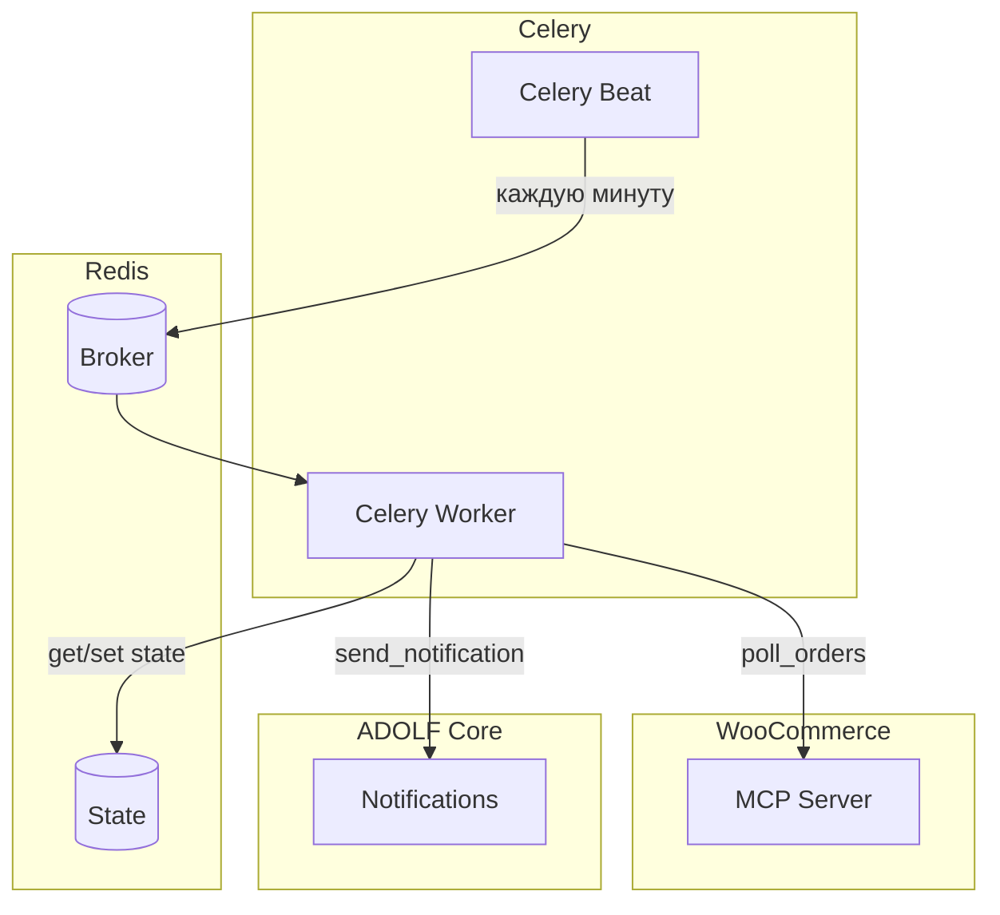
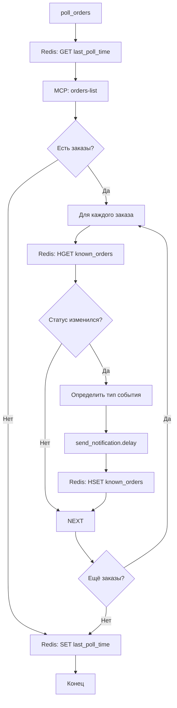

**Проект:** Интеллектуальная система управления интернет-магазином  
**Модуль:** Shop / Celery  
**Версия:** 1.0  
**Дата:** Январь 2026

---

## 6.1 Обзор задач

### Назначение

Celery в модуле Shop обеспечивает:
- Периодический polling событий из WooCommerce (каждую минуту)
- Детектирование новых заказов, отмен, возвратов
- Генерацию уведомлений через Notifications

### Реестр задач

| Задача | Тип | Периодичность | Описание |
|--------|-----|---------------|----------|
| `shop.poll_orders` | periodic | */1 * * * * | Проверка новых событий |
| `shop.send_notification` | async | по событию | Отправка уведомления |

### Архитектура



---

## 6.2 Task: poll_orders

### Назначение

Периодическая проверка WooCommerce на наличие новых событий:
- Новые заказы (статус `processing`)
- Отмены (статус `cancelled`)
- Возвраты (статус `refunded`)
- Ошибки оплаты (статус `failed`)

### Конфигурация

```python
# config/celery.py

CELERY_BEAT_SCHEDULE = {
    'shop-poll-orders': {
        'task': 'shop.poll_orders',
        'schedule': crontab(minute='*'),  # каждую минуту
        'options': {'queue': 'default'}
    },
}
```

### Реализация

```python
# tasks/shop_tasks.py

from celery import shared_task
from datetime import datetime, timedelta
import redis
import logging

from services.mcp_client import MCPClient
from services.notifications import NotificationPublisher

logger = logging.getLogger(__name__)

REDIS_KEY_LAST_ORDER_ID = "shop:polling:last_order_id"
REDIS_KEY_LAST_POLL_TIME = "shop:polling:last_poll_time"
REDIS_KEY_KNOWN_ORDERS = "shop:polling:known_orders"

@shared_task(
    name="shop.poll_orders",
    bind=True,
    max_retries=3,
    default_retry_delay=30,
    autoretry_for=(Exception,),
    retry_backoff=True
)
def poll_orders(self):
    """
    Периодическая проверка заказов в WooCommerce.
    Запускается каждую минуту через Celery Beat.
    """
    logger.info("Starting shop.poll_orders")
    
    redis_client = redis.Redis.from_url(settings.REDIS_URL)
    mcp_client = MCPClient()
    notification_publisher = NotificationPublisher()
    
    try:
        # 1. Получение состояния последнего polling
        last_poll_time = redis_client.get(REDIS_KEY_LAST_POLL_TIME)
        if last_poll_time:
            last_poll_time = datetime.fromisoformat(last_poll_time.decode())
        else:
            # Первый запуск — берём заказы за последний час
            last_poll_time = datetime.utcnow() - timedelta(hours=1)
        
        # 2. Запрос к WooCommerce MCP
        orders = mcp_client.orders_list(
            after=last_poll_time.isoformat(),
            per_page=100,
            orderby="date",
            order="asc"
        )
        
        logger.info(f"Fetched {len(orders)} orders since {last_poll_time}")
        
        # 3. Обработка каждого заказа
        for order in orders:
            process_order_event(order, redis_client, notification_publisher)
        
        # 4. Обновление состояния
        redis_client.set(
            REDIS_KEY_LAST_POLL_TIME,
            datetime.utcnow().isoformat()
        )
        
        logger.info("shop.poll_orders completed successfully")
        
    except Exception as e:
        logger.error(f"shop.poll_orders failed: {e}")
        raise


def process_order_event(order: dict, redis_client, notification_publisher):
    """Обработка события по заказу."""
    
    order_id = order["id"]
    status = order["status"]
    
    # Проверка, обрабатывали ли мы этот заказ ранее
    known_status = redis_client.hget(REDIS_KEY_KNOWN_ORDERS, str(order_id))
    known_status = known_status.decode() if known_status else None
    
    if known_status == status:
        # Статус не изменился — пропускаем
        return
    
    # Определение типа события
    event_type = None
    level = "info"
    title = ""
    message = ""
    
    if status == "processing" and known_status is None:
        # Новый заказ
        event_type = "shop.order.new"
        title = "Новый заказ"
        message = f"Заказ #{order_id} на сумму {order['total']} ₽"
        level = "info"
        
    elif status == "cancelled":
        # Отмена
        event_type = "shop.order.cancelled"
        title = "Заказ отменён"
        message = f"Клиент отменил заказ #{order_id}"
        level = "warning"
        
    elif status == "refunded":
        # Возврат
        event_type = "shop.order.refunded"
        title = "Возврат средств"
        message = f"Оформлен возврат по заказу #{order_id}"
        level = "warning"
        
    elif status == "failed":
        # Ошибка оплаты
        event_type = "shop.order.failed"
        title = "Ошибка оплаты"
        message = f"Не удалась оплата заказа #{order_id}"
        level = "error"
    
    # Отправка уведомления
    if event_type:
        send_notification.delay(
            event_type=event_type,
            title=title,
            message=message,
            level=level,
            order_id=order_id,
            order_data={
                "total": order.get("total"),
                "customer": order.get("billing", {}).get("first_name"),
                "status": status
            }
        )
    
    # Обновление known status
    redis_client.hset(REDIS_KEY_KNOWN_ORDERS, str(order_id), status)
```

### Диаграмма процесса



---

## 6.3 Task: send_notification

### Назначение

Асинхронная отправка уведомления через систему Notifications.

### Реализация

```python
@shared_task(
    name="shop.send_notification",
    bind=True,
    max_retries=3,
    default_retry_delay=10
)
def send_notification(
    self,
    event_type: str,
    title: str,
    message: str,
    level: str,
    order_id: int,
    order_data: dict
):
    """
    Отправка уведомления о событии заказа.
    """
    logger.info(f"Sending notification: {event_type} for order #{order_id}")
    
    notification_publisher = NotificationPublisher()
    
    try:
        notification_publisher.publish(
            event_type=event_type,
            title=title,
            message=message,
            source_module="shop",
            source_id=str(order_id),
            level=level,
            data=order_data
        )
        
        logger.info(f"Notification sent: {event_type} for order #{order_id}")
        
    except Exception as e:
        logger.error(f"Failed to send notification: {e}")
        raise self.retry(exc=e)
```

---

## 6.4 MCP Client для Celery

### Реализация

```python
# services/mcp_client.py

import httpx
from typing import Optional, List
import logging

logger = logging.getLogger(__name__)

class MCPClient:
    """Клиент для взаимодействия с WooCommerce MCP."""
    
    def __init__(self):
        self.base_url = settings.WOOCOMMERCE_MCP_URL
        self.api_key = f"{settings.WOOCOMMERCE_CONSUMER_KEY}:{settings.WOOCOMMERCE_CONSUMER_SECRET}"
        self.timeout = 30
    
    def _make_request(self, ability: str, params: dict) -> dict:
        """Выполнение MCP запроса."""
        
        headers = {
            "X-MCP-API-Key": self.api_key,
            "Content-Type": "application/json"
        }
        
        # MCP запрос через HTTP
        with httpx.Client(timeout=self.timeout) as client:
            response = client.post(
                f"{self.base_url}/execute",
                headers=headers,
                json={
                    "ability": ability,
                    "params": params
                }
            )
            response.raise_for_status()
            return response.json()
    
    def orders_list(
        self,
        status: Optional[str] = None,
        after: Optional[str] = None,
        before: Optional[str] = None,
        per_page: int = 100,
        orderby: str = "date",
        order: str = "desc"
    ) -> List[dict]:
        """Получение списка заказов."""
        
        params = {
            "per_page": per_page,
            "orderby": orderby,
            "order": order
        }
        
        if status:
            params["status"] = status
        if after:
            params["after"] = after
        if before:
            params["before"] = before
        
        result = self._make_request("woocommerce/orders-list", params)
        return result.get("data", [])
    
    def orders_get(self, order_id: int) -> dict:
        """Получение деталей заказа."""
        
        result = self._make_request(
            "woocommerce/orders-get",
            {"id": order_id}
        )
        return result.get("data", {})
```

---

## 6.5 Redis State Management

### Ключи Redis

| Ключ | Тип | Описание | TTL |
|------|-----|----------|-----|
| `shop:polling:last_poll_time` | string | Время последнего polling | — |
| `shop:polling:known_orders` | hash | Известные статусы заказов | 7 дней |

### Операции

```python
# Получение времени последнего polling
last_poll = redis.get("shop:polling:last_poll_time")

# Обновление времени
redis.set("shop:polling:last_poll_time", datetime.utcnow().isoformat())

# Проверка известного статуса заказа
known_status = redis.hget("shop:polling:known_orders", "12345")

# Обновление известного статуса
redis.hset("shop:polling:known_orders", "12345", "processing")

# Очистка старых записей (выполняется периодически)
redis.expire("shop:polling:known_orders", 7 * 24 * 3600)
```

---

## 6.6 Конфигурация

### Environment Variables

```bash
# Celery
CELERY_BROKER_URL=redis://localhost:6379/0
CELERY_RESULT_BACKEND=redis://localhost:6379/0

# Shop Polling
SHOP_POLLING_ENABLED=true
SHOP_POLLING_INTERVAL=60  # секунды

# WooCommerce MCP
WOOCOMMERCE_MCP_URL=https://ohana.market/wp-json/woocommerce/mcp
WOOCOMMERCE_CONSUMER_KEY=ck_xxx
WOOCOMMERCE_CONSUMER_SECRET=cs_xxx
```

### Celery Configuration

```python
# config/celery.py

from celery import Celery
from celery.schedules import crontab

app = Celery('adolf')

app.conf.update(
    broker_url=settings.CELERY_BROKER_URL,
    result_backend=settings.CELERY_RESULT_BACKEND,
    task_serializer='json',
    result_serializer='json',
    accept_content=['json'],
    timezone='Europe/Moscow',
    enable_utc=True,
    
    # Retry settings
    task_acks_late=True,
    task_reject_on_worker_lost=True,
    
    # Beat schedule
    beat_schedule={
        'shop-poll-orders': {
            'task': 'shop.poll_orders',
            'schedule': 60.0,  # каждые 60 секунд
            'options': {'queue': 'default'}
        },
    }
)
```

---

## 6.7 Обработка ошибок

### Retry стратегия

```python
@shared_task(
    bind=True,
    max_retries=3,
    default_retry_delay=30,
    autoretry_for=(ConnectionError, TimeoutError),
    retry_backoff=True,
    retry_backoff_max=300,
    retry_jitter=True
)
def poll_orders(self):
    ...
```

### Типы ошибок

| Ошибка | Действие | Max Retries |
|--------|----------|-------------|
| ConnectionError | Retry с backoff | 3 |
| TimeoutError | Retry с backoff | 3 |
| AuthenticationError | Логирование, алерт админу | 0 |
| RateLimitError | Retry через 60 сек | 3 |

### Логирование ошибок

```python
import logging
from celery.utils.log import get_task_logger

logger = get_task_logger(__name__)

@shared_task(bind=True)
def poll_orders(self):
    try:
        # ... polling logic ...
    except ConnectionError as e:
        logger.warning(f"MCP connection failed: {e}, retry {self.request.retries}")
        raise self.retry(exc=e, countdown=30)
    except Exception as e:
        logger.error(f"poll_orders failed: {e}", exc_info=True)
        raise
```

---

## 6.8 Мониторинг

### Метрики

| Метрика | Тип | Описание |
|---------|-----|----------|
| `shop_poll_duration_seconds` | histogram | Время выполнения polling |
| `shop_poll_orders_count` | counter | Количество обработанных заказов |
| `shop_poll_errors_total` | counter | Количество ошибок |
| `shop_notifications_sent` | counter | Отправленные уведомления |

### Prometheus метрики

```python
from prometheus_client import Counter, Histogram

POLL_DURATION = Histogram(
    'shop_poll_duration_seconds',
    'Time spent polling WooCommerce'
)

ORDERS_PROCESSED = Counter(
    'shop_poll_orders_count',
    'Number of orders processed',
    ['status']
)

POLL_ERRORS = Counter(
    'shop_poll_errors_total',
    'Number of polling errors',
    ['error_type']
)

@shared_task(bind=True)
def poll_orders(self):
    with POLL_DURATION.time():
        try:
            orders = mcp_client.orders_list(...)
            for order in orders:
                ORDERS_PROCESSED.labels(status=order['status']).inc()
                process_order_event(order, ...)
        except Exception as e:
            POLL_ERRORS.labels(error_type=type(e).__name__).inc()
            raise
```

### Health Check

```python
def check_celery_health():
    """Проверка здоровья Celery."""
    
    # Проверка Beat
    last_poll = redis.get("shop:polling:last_poll_time")
    if last_poll:
        last_poll_time = datetime.fromisoformat(last_poll.decode())
        if datetime.utcnow() - last_poll_time > timedelta(minutes=5):
            return {"status": "unhealthy", "reason": "Polling not running"}
    
    # Проверка Worker
    inspect = celery_app.control.inspect()
    if not inspect.active():
        return {"status": "unhealthy", "reason": "No active workers"}
    
    return {"status": "healthy"}
```

---

## 6.9 Управление задачами

### Запуск Celery

```bash
# Worker
celery -A app worker --loglevel=info --queues=default

# Beat (scheduler)
celery -A app beat --loglevel=info

# Flower (мониторинг)
celery -A app flower --port=5555
```

### Docker Compose

```yaml
services:
  celery-worker:
    build: .
    command: celery -A app worker --loglevel=info
    environment:
      - CELERY_BROKER_URL=redis://redis:6379/0
      - WOOCOMMERCE_MCP_URL=${WOOCOMMERCE_MCP_URL}
    depends_on:
      - redis
    
  celery-beat:
    build: .
    command: celery -A app beat --loglevel=info
    environment:
      - CELERY_BROKER_URL=redis://redis:6379/0
    depends_on:
      - redis
      - celery-worker
```

### Ручной запуск задачи

```python
# Принудительный polling
from tasks.shop_tasks import poll_orders
poll_orders.delay()

# Проверка статуса
result = poll_orders.delay()
print(result.status)  # PENDING, SUCCESS, FAILURE
```

---

## Приложение А: Контрольные точки

| Критерий | Проверка |
|----------|----------|
| Beat работает | Задачи появляются в очереди каждую минуту |
| Worker работает | Задачи обрабатываются |
| Polling работает | last_poll_time обновляется |
| Уведомления | События создают notifications |
| Retry работает | Ошибки не приводят к потере событий |

---

## Приложение Б: Troubleshooting

### Polling не запускается

```bash
# Проверить Beat
celery -A app beat --loglevel=debug

# Проверить очередь
redis-cli LLEN celery

# Проверить Worker
celery -A app inspect active
```

### Уведомления не приходят

```bash
# Проверить логи Worker
grep "send_notification" /var/log/celery/worker.log

# Проверить Redis state
redis-cli GET "shop:polling:last_poll_time"
redis-cli HGETALL "shop:polling:known_orders"
```

### Ошибки MCP

```bash
# Тест подключения
curl -H "X-MCP-API-Key: ck_xxx:cs_xxx" \
     https://ohana.market/wp-json/woocommerce/mcp

# Проверить логи
grep "MCP" /var/log/celery/worker.log
```

---

**Документ подготовлен:** Январь 2026  
**Версия:** 1.0  
**Статус:** Черновик
