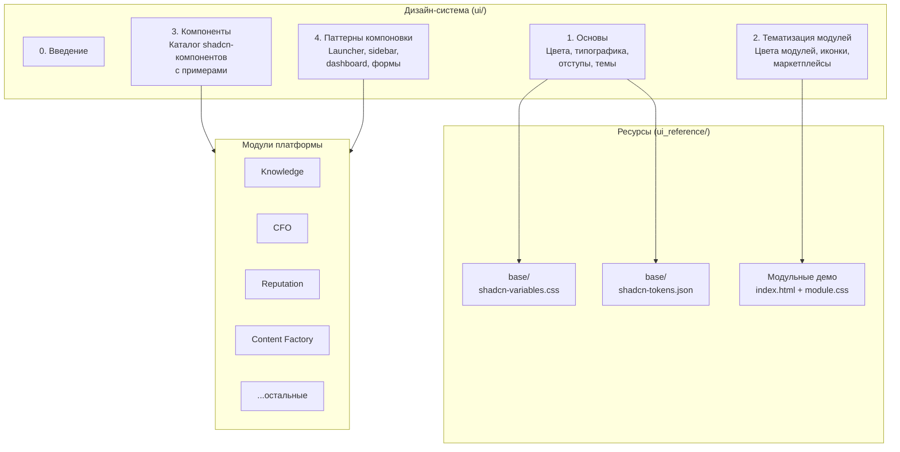

# Введение в дизайн-систему ADOLF

**Версия:** 1.0
**Дата:** Февраль 2026

## Обзор

Дизайн-система ADOLF определяет единый визуальный язык для всех модулей платформы. Система построена на базе [shadcn/ui](https://ui.shadcn.com/) — коллекции компонентов на [Radix UI](https://www.radix-ui.com/) и [Tailwind CSS](https://tailwindcss.com/), с иконографией [Lucide Icons](https://lucide.dev/).

Дизайн-система решает следующие задачи:

- Визуальная консистентность интерфейсов всех 12 модулей платформы
- Цветовая идентификация модулей и маркетплейсов
- Поддержка светлой и тёмной тем через CSS-переменные
- Единая типографика, отступы и скругления
- Готовый набор компонентов для быстрой разработки интерфейсов

## Почему shadcn/ui

| Критерий | shadcn/ui | Альтернативы (MUI, Ant Design) |
|:---------|:----------|:-------------------------------|
| Владение кодом | Компоненты копируются в проект, полный контроль | Зависимость от npm-пакета |
| Стилизация | Tailwind CSS + CSS-переменные (OKLCH) | CSS-in-JS или модули с ограниченной кастомизацией |
| Размер бандла | Только используемые компоненты | Полная библиотека в зависимостях |
| Доступность | Radix UI primitives (WAI-ARIA) | Встроенная, но менее гибкая |
| Тёмная тема | Нативная через CSS custom properties | Требует ThemeProvider или отдельной конфигурации |
| Кастомизация | Прямое редактирование исходников | Override-система с ограничениями |

shadcn/ui выбрана как оптимальный баланс между готовыми решениями и гибкостью кастомизации для внутренней корпоративной системы.

## Архитектура дизайн-системы



## Стек технологий

| Технология | Назначение | Версия |
|:-----------|:-----------|:-------|
| [shadcn/ui](https://ui.shadcn.com/) | Библиотека компонентов | latest |
| [Radix UI](https://www.radix-ui.com/) | Примитивы доступности (headless) | latest |
| [Tailwind CSS](https://tailwindcss.com/) | Утилитарный CSS-фреймворк | v4+ |
| [Lucide Icons](https://lucide.dev/) | Иконографическая библиотека | latest |
| OKLCH | Цветовая модель для CSS-переменных | CSS Color Level 4 |

## Принципы дизайна

### Consistency — Единообразие

Все модули используют общий набор CSS-переменных из `shadcn-variables.css`. Цветовая палитра, типографика и скругления наследуются из единого источника. Модуль-специфичные стили расширяют базовые, не переопределяя их.

### Modularity — Модульность

Каждый модуль имеет собственный акцентный цвет и Lucide-иконку. Модульные стили изолированы в отдельных CSS-файлах (`ui_reference/{module}/module.css`). Компоненты shadcn/ui используются как строительные блоки без модификации базовой структуры.

### Accessibility — Доступность

Компоненты наследуют WAI-ARIA паттерны от Radix UI. Цветовые контрасты соответствуют стандарту WCAG 2.1 AA. Тёмная тема переключается через CSS-класс `.dark` без потери читаемости.

### Adaptability — Адаптивность

Цвета определены в формате OKLCH — перцептуально-равномерная модель, обеспечивающая предсказуемое поведение при генерации оттенков (`-light`, `-dark` варианты). Система поддерживает расширение палитры без рефакторинга существующих стилей.

## Структура репозитория

```
Docs/
├── ui/                              # Документация дизайн-системы
│   ├── adolf_ui_0_introduction.md   # Введение (этот документ)
│   ├── adolf_ui_1_foundations.md     # CSS-переменные, цвета, типографика
│   ├── adolf_ui_2_module_theming.md  # Тематизация модулей и маркетплейсов
│   ├── adolf_ui_3_components.md      # Каталог компонентов
│   └── adolf_ui_4_layout_patterns.md # Паттерны компоновки
│
├── ui_reference/                    # Ресурсы и демо (не для рендера)
│   ├── base/
│   │   ├── shadcn-variables.css     # CSS-переменные дизайн-системы
│   │   ├── shadcn-tokens.json       # Design tokens (JSON)
│   │   └── README.md               # Справка по ресурсам
│   ├── cfo/                         # Демо: index.html + cfo.css
│   ├── content_factory/             # Демо: index.html + content-factory.css
│   ├── knowledge/                   # Демо: index.html + knowledge.css
│   ├── reputation/                  # Демо: index.html + reputation.css
│   ├── logistic/                    # Демо: index.html + logistic.css
│   └── README.md                    # Обзор UI Reference v3.0
```

Разделение на `ui/` и `ui_reference/` обеспечивает:

- `ui/` — документация в формате markdown, описывает правила и стандарты
- `ui_reference/` — рабочие ресурсы (CSS, JSON, HTML-демо), используемые при разработке

## Карта разделов

| Раздел | Файл | Описание |
|:-------|:-----|:---------|
| 0. Введение | `adolf_ui_0_introduction.md` | Обзор, архитектура, принципы (этот документ) |
| 1. Основы | `adolf_ui_1_foundations.md` | CSS-переменные, OKLCH-цвета, типографика, отступы, скругления, тёмная тема |
| 2. Тематизация | `adolf_ui_2_module_theming.md` | Цвета модулей, Lucide-иконки, палитры маркетплейсов, статусные и семантические цвета |
| 3. Компоненты | `adolf_ui_3_components.md` | Каталог shadcn-компонентов, используемых в ADOLF, с примерами применения |
| 4. Паттерны | `adolf_ui_4_layout_patterns.md` | Паттерны компоновки: Launcher, sidebar, dashboard cards, формы |

## Ресурсы

| Ресурс | URL |
|:-------|:----|
| shadcn/ui — документация | [ui.shadcn.com](https://ui.shadcn.com/) |
| shadcn/ui — GitHub | [github.com/shadcn-ui/ui](https://github.com/shadcn-ui/ui) |
| Lucide Icons — каталог | [lucide.dev/icons](https://lucide.dev/icons/) |
| Radix UI — примитивы | [radix-ui.com](https://www.radix-ui.com/) |
| Tailwind CSS — утилиты | [tailwindcss.com](https://tailwindcss.com/) |
| Figma Kit — shadcn/ui | [Figma Community](https://www.figma.com/community/file/1203061493325953101) |
| OKLCH — генератор | [oklch.com](https://oklch.com/) |

## Связанные документы

| Документ | Описание |
|:---------|:---------|
| `ui_reference/base/shadcn-variables.css` | CSS-переменные дизайн-системы |
| `ui_reference/base/shadcn-tokens.json` | Design tokens в формате JSON |
| `ui_reference/README.md` | Обзор UI Reference v3.0 |
| `core/adolf_core_3_1_launcher.md` | Launcher — использует дизайн-систему |

---

**Версия:** 1.0 | **Дата:** Февраль 2026
