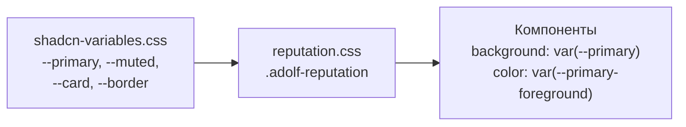
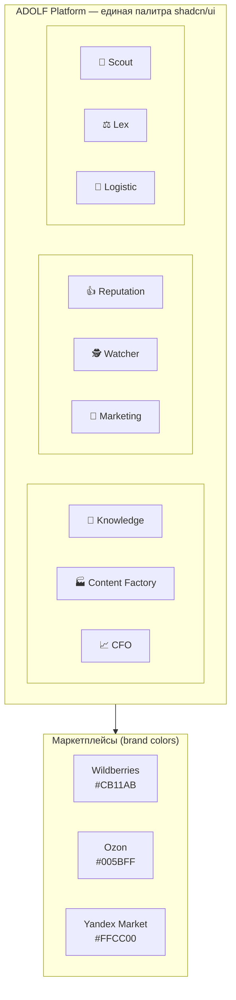

## Обзор

Все модули платформы ADOLF используют единую цветовую схему [shadcn/ui](https://ui.shadcn.com/) с базовым цветом **Neutral**. Акцентный цвет интерфейса — `--primary` — одинаков для всех модулей. Визуальная идентификация модулей осуществляется через Lucide-иконки, а не через цвет.

Раздел описывает:

- Систему Lucide-иконок для модулей
- Механизм CSS-стилизации компонентов на основе `--primary`
- Палитры маркетплейсов
- Семантические, статусные цвета и цвета аналитики

## Единая цветовая схема

Все модули ADOLF наследуют единую палитру из `shadcn-variables.css`. Акцентные элементы интерфейса (кнопки, активные состояния, заголовки карточек) используют `--primary` и связанные переменные.

| Элемент | CSS-переменная | Назначение |
|:--------|:---------------|:-----------|
| Акцент | `--primary` | Кнопки действий, активные элементы |
| Текст на акценте | `--primary-foreground` | Текст на `--primary` фоне |
| Вторичный | `--secondary` | Вторичные кнопки, фоны |
| Muted | `--muted` | Приглушённые фоны, фильтры |
| Accent | `--accent` | Hover-состояния |
| Destructive | `--destructive` | Удаление, ошибки |

Подробнее о переменных: [Раздел 1: Основы](/ui/adolf_ui_1_foundations)

## Иконки модулей (Lucide)

Каждому модулю назначена иконка из библиотеки [Lucide Icons](https://lucide.dev/icons/). Иконка — основной визуальный идентификатор модуля в sidebar, Launcher и заголовках карточек.

### Полная таблица

| Модуль | Lucide Name | React Import | Пакет |
|:-------|:------------|:-------------|:------|
| Knowledge | `database-search` | `DatabaseSearch` | lucide |
| Content Factory | `jacket` | `@lucide/lab` | @lucide/lab |
| CFO | `chart-candlestick` | `ChartCandlestick` | lucide |
| Reputation | `thumbs-up` | `ThumbsUp` | lucide |
| Watcher | `hat-glasses` | `HatGlasses` | lucide |
| Marketing | `target-arrow` | `@lucide/lab` | @lucide/lab |
| Scout | `binoculars` | `Binoculars` | lucide |
| Lex | `scale` | `Scale` | lucide |
| Logistic | `truck` | `Truck` | lucide |
| Office | `building-2` | `Building2` | lucide |
| Shop | `shopping-cart` | `ShoppingCart` | lucide |

Полный реестр иконок с миниатюрами, параметрами и ссылками: [Приложение A: Реестр иконок](/ui/adolf_ui_appendix_a_icons)

### React

```jsx
import {
  DatabaseSearch, ChartCandlestick, ThumbsUp,
  HatGlasses, Binoculars, Scale,
  Truck, Building2, ShoppingCart
} from 'lucide-react';

import { Icon } from 'lucide-react';
import { jacket, targetArrow } from '@lucide/lab';

// Стандартные иконки
<ThumbsUp size={24} strokeWidth={1.5} />

// Lab-иконки
<Icon iconNode={jacket} size={24} strokeWidth={1.5} />
```

### HTML (CDN)

```html
<script src="https://unpkg.com/lucide@latest/dist/umd/lucide.min.js"></script>
<script>
  lucide.createIcons({ attrs: { 'stroke-width': 1.5 } });
</script>

<i data-lucide="database-search"></i>
<i data-lucide="chart-candlestick"></i>
<i data-lucide="thumbs-up"></i>
<i data-lucide="hat-glasses"></i>
<i data-lucide="binoculars"></i>
<i data-lucide="scale"></i>
<i data-lucide="truck"></i>
<i data-lucide="building-2"></i>
<i data-lucide="shopping-cart"></i>
```

### SVG-файлы


## Механизм CSS-стилизации

Модульные CSS-файлы используют стандартные переменные shadcn/ui. Компоненты всех модулей стилизуются единообразно через `--primary`, `--muted`, `--card` и другие базовые переменные.

### Паттерн

```css
/* reputation.css */
.adolf-reputation {
  /* Все стили наследуют базовые переменные shadcn/ui */
}
```

### Использование в компонентах

```css
/* Заголовок карточки */
.adolf-rep-list-header {
  background: var(--muted);
  border-bottom: 1px solid var(--border);
}

/* Счётчик — акцентный цвет */
.adolf-rep-list-count {
  background: var(--primary);
  color: var(--primary-foreground);
  border-radius: var(--radius-full);
}

/* Кнопка действия */
.adolf-btn-export {
  background: var(--primary);
  color: var(--primary-foreground);
}
.adolf-btn-export:hover:not(:disabled) {
  opacity: 0.9;
}

/* Hover-эффект фильтра */
.adolf-rep-filter-chip:hover {
  border-color: var(--primary);
  color: var(--primary);
}

/* Активный фильтр */
.adolf-rep-filter-chip.active {
  background: var(--primary);
  border-color: var(--primary);
  color: var(--primary-foreground);
}
```

### Диаграмма наследования



### Соглашения об именовании CSS-классов

| Паттерн | Пример | Назначение |
|:--------|:-------|:-----------|
| `.adolf-{module}` | `.adolf-reputation` | Корневой контейнер модуля |
| `.adolf-{module}-{component}` | `.adolf-rep-list` | Компонент модуля |
| `.adolf-{module}-{component}-{element}` | `.adolf-rep-list-header` | Элемент компонента |
| `.adolf-btn-{action}` | `.adolf-btn-export` | Кнопка действия |
| `.adolf-{module}-mp-badge` | `.adolf-cfo-mp-badge` | Бейдж маркетплейса |

## Launcher — стилизация

Компонент Launcher использует атрибут `data-module` для идентификации модуля. Визуальная стилизация баннеров единообразна для всех модулей:

```html
<button class="banner" data-module="cfo">
  <i data-lucide="chart-candlestick" stroke-width="1.5"></i>
  <span>P&L отчёт</span>
</button>
```

```css
.banner:hover {
  border-color: var(--primary);
  box-shadow: var(--shadow-md);
}

.banner__icon {
  background: var(--muted);
  color: var(--primary);
}
```

Подробнее: [Core — Launcher](/core/adolf_core_3_1_launcher)

## Цвета маркетплейсов

Маркетплейсы используют официальные brand-цвета платформ. Это единственные элементы интерфейса с индивидуальной цветовой идентификацией.

| Маркетплейс | CSS-переменная | OKLCH | HEX |
|:------------|:---------------|:------|:----|
| Wildberries | `--mp-wildberries` | `oklch(0.55 0.25 328)` | #CB11AB |
| Ozon | `--mp-ozon` | `oklch(0.55 0.25 250)` | #005BFF |
| Yandex Market | `--mp-yandex` | `oklch(0.88 0.18 95)` | #FFCC00 |

Для Yandex Market определена дополнительная переменная `--mp-yandex-foreground: oklch(0.2 0 0)` — тёмный текст на жёлтом фоне.

### Использование в бейджах

```css
.adolf-cfo-mp-badge.wb   { background: var(--mp-wildberries); color: white; }
.adolf-cfo-mp-badge.ozon { background: var(--mp-ozon); color: white; }
.adolf-cfo-mp-badge.ym   { background: var(--mp-yandex); color: var(--mp-yandex-foreground); }
```

```html
<span class="adolf-cfo-mp-badge wb">WB</span>
<span class="adolf-cfo-mp-badge ozon">Ozon</span>
<span class="adolf-cfo-mp-badge ym">YM</span>
```

## Семантические цвета

Семантические цвета используются для обозначения состояний и обратной связи. Определены в `shadcn-variables.css` (см. [Раздел 1: Основы](/ui/adolf_ui_1_foundations)).

| Назначение | CSS-переменная | HEX | Применение в ADOLF |
|:-----------|:---------------|:----|:-------------------|
| Успех | `--success` | #22C55E | Успешная отправка ответа, завершение задачи |
| Предупреждение | `--warning` | #EAB308 | Истекающие сроки, пороговые значения |
| Информация | `--info` | #3B82F6 | Подсказки, информационные сообщения |
| Ошибка | `--destructive` | #EF4444 | Ошибки API, критические уведомления |

## Цвета тональности отзывов (Sentiment)

Используются модулем Reputation для визуальной классификации отзывов.

| Тональность | CSS-переменная | `-light` вариант | HEX |
|:------------|:---------------|:-----------------|:----|
| Positive | `--sentiment-positive` | `--sentiment-positive-light` | #22C55E |
| Neutral | `--sentiment-neutral` | `--sentiment-neutral-light` | #EAB308 |
| Negative | `--sentiment-negative` | `--sentiment-negative-light` | #EF4444 |

Пример применения:

```css
.adolf-rep-sentiment-positive { color: var(--sentiment-positive); }
.adolf-rep-sentiment-neutral  { color: var(--sentiment-neutral); }
.adolf-rep-sentiment-negative { color: var(--sentiment-negative); }

/* Фон карточки отзыва */
.adolf-rep-card.positive { background: var(--sentiment-positive-light); }
.adolf-rep-card.neutral  { background: var(--sentiment-neutral-light); }
.adolf-rep-card.negative { background: var(--sentiment-negative-light); }
```

## Цвета ABC-анализа

Используются модулем CFO для классификации товаров по вкладу в выручку.

| Класс | Доля выручки | CSS-переменная | `-light` вариант | HEX |
|:------|:-------------|:---------------|:-----------------|:----|
| A | Топ 20% | `--abc-a` | `--abc-a-light` | #22C55E |
| B | Следующие 30% | `--abc-b` | `--abc-b-light` | #3B82F6 |
| C | Следующие 30% | `--abc-c` | `--abc-c-light` | #EAB308 |
| D | Нижние 20% | `--abc-d` | `--abc-d-light` | #EF4444 |

## Сводная карта модулей



## Создание стилей нового модуля

При добавлении нового модуля необходимо:

**1. Создать модульный CSS** с использованием стандартных переменных shadcn/ui:

```css
.adolf-newmodule {
  /* Все стили наследуют базовые переменные */
}

/* Заголовок карточки */
.adolf-newmodule-header {
  background: var(--muted);
  border-bottom: 1px solid var(--border);
}

/* Кнопка действия */
.adolf-btn-newmodule-action {
  background: var(--primary);
  color: var(--primary-foreground);
}
```


**3. Обновить реестр** в [Приложении A](/ui/adolf_ui_appendix_a_icons).


## Связанные документы

| Документ | Описание |
|:---------|:---------|
| [Раздел 0: Введение](/ui/adolf_ui_0_introduction) | Обзор дизайн-системы |
| [Раздел 1: Основы](/ui/adolf_ui_1_foundations) | CSS-переменные, типографика, базовые цвета |
| [Раздел 3: Компоненты](/ui/adolf_ui_3_components) | Каталог компонентов shadcn/ui |
| [Приложение A: Иконки](/ui/adolf_ui_appendix_a_icons) | Полный реестр иконок |
| [Core — Launcher](/core/adolf_core_3_1_launcher) | Система баннерного подменю |
| `shadcn-variables.css` | Исходный CSS-файл |
| `shadcn-tokens.json` | Design tokens |

---

**Версия:** 1.1 | **Дата:** Февраль 2026
