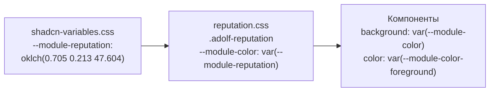
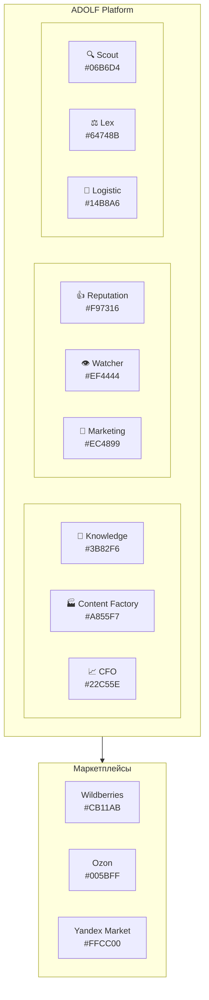

# Тематизация модулей ADOLF

**Версия:** 1.0
**Дата:** Февраль 2026

## Обзор

Каждый модуль платформы ADOLF обладает уникальной визуальной идентичностью: акцентным цветом и иконкой из библиотеки Lucide. Тематизация обеспечивает мгновенную визуальную навигацию — пользователь идентифицирует модуль по цвету до прочтения текста.

Раздел описывает:

- Цветовую палитру 12 модулей платформы
- Систему Lucide-иконок
- Механизм CSS-алиасинга для модульных стилей
- Палитры маркетплейсов
- Семантические, статусные цвета и цвета аналитики

## Цвета модулей

### Палитра

Каждый модуль имеет три CSS-переменные: основной цвет, осветлённый вариант и цвет текста на основном фоне.

| Модуль | CSS-переменная | OKLCH | HEX | Цвет |
|:-------|:---------------|:------|:----|:-----|
| Knowledge | `--module-knowledge` | `oklch(0.623 0.214 259.815)` | #3B82F6 | Blue |
| Content Factory | `--module-content` | `oklch(0.627 0.265 303.9)` | #A855F7 | Purple |
| CFO | `--module-cfo` | `oklch(0.723 0.191 142.495)` | #22C55E | Green |
| Reputation | `--module-reputation` | `oklch(0.705 0.213 47.604)` | #F97316 | Orange |
| Watcher | `--module-watcher` | `oklch(0.577 0.245 27.325)` | #EF4444 | Red |
| Marketing | `--module-marketing` | `oklch(0.656 0.241 354.308)` | #EC4899 | Pink |
| Scout | `--module-scout` | `oklch(0.715 0.152 194.769)` | #06B6D4 | Cyan |
| Lex | `--module-lex` | `oklch(0.554 0.046 257.417)` | #64748B | Slate |
| Logistic | `--module-logistic` | `oklch(0.72 0.14 180)` | #14B8A6 | Teal |

### Варианты цветов

Для каждого модуля определены три переменные:

```css
/* Пример: Knowledge */
--module-knowledge: oklch(0.623 0.214 259.815);           /* Основной */
--module-knowledge-light: oklch(0.95 0.04 259.815);       /* Осветлённый фон */
--module-knowledge-foreground: oklch(0.985 0 0);           /* Текст на основном */
```

Принцип генерации `-light` варианта:

- Светлая тема: `L = 0.95`, `C = 0.03–0.05`, `H` сохраняется
- Тёмная тема: `L = 0.3`, `C = 0.04–0.08`, `H` сохраняется

### Применение вариантов

| Вариант | Использование |
|:--------|:-------------|
| `--module-{name}` | Акцентный цвет: заголовки, иконки, активные элементы, кнопки действий |
| `--module-{name}-light` | Фон заголовков карточек, hover-состояния, подложки бейджей |
| `--module-{name}-foreground` | Текст на элементах с основным цветом модуля |

## Иконки модулей (Lucide)

Каждому модулю назначена иконка из библиотеки [Lucide Icons](https://lucide.dev/icons/).

### Полная таблица

| Модуль | Lucide Name | React Import | CSS-переменная | HEX |
|:-------|:------------|:-------------|:---------------|:----|
| Core | `server` | `Server` | — | — |
| Knowledge | `book-open-check` | `BookOpenCheck` | `--module-knowledge` | #3B82F6 |
| Content Factory | `factory` | `Factory` | `--module-content` | #A855F7 |
| CFO | `line-chart` | `LineChart` | `--module-cfo` | #22C55E |
| Reputation | `thumbs-up` | `ThumbsUp` | `--module-reputation` | #F97316 |
| Watcher | `eye` | `Eye` | `--module-watcher` | #EF4444 |
| Marketing | `megaphone` | `Megaphone` | `--module-marketing` | #EC4899 |
| Scout | `search` | `Search` | `--module-scout` | #06B6D4 |
| Lex | `scale` | `Scale` | `--module-lex` | #64748B |
| Logistic | `truck` | `Truck` | `--module-logistic` | #14B8A6 |
| Shop | `shopping-cart` | `ShoppingCart` | — | — |
| Office | `layout-grid` | `LayoutGrid` | — | — |
| Новый чат | `message-square` | `MessageSquare` | — | — |

### React

```jsx
import {
  Server, BookOpenCheck, Factory, LineChart,
  ThumbsUp, Eye, Megaphone, Search,
  Scale, Truck, ShoppingCart, LayoutGrid,
  MessageSquare
} from 'lucide-react';

// Применение с цветом модуля
<BookOpenCheck size={24} className="text-module-knowledge" />
<Factory size={24} className="text-module-content" />
<LineChart size={24} className="text-module-cfo" />
<ThumbsUp size={24} className="text-module-reputation" />
<Eye size={24} className="text-module-watcher" />
<Megaphone size={24} className="text-module-marketing" />
<Search size={24} className="text-module-scout" />
<Scale size={24} className="text-module-lex" />
<Truck size={24} className="text-module-logistic" />
```

### HTML (CDN)

```html
<script src="https://unpkg.com/lucide@latest/dist/umd/lucide.min.js"></script>
<script>lucide.createIcons();</script>

<!-- Использование -->
<i data-lucide="book-open-check"></i>
<i data-lucide="factory"></i>
<i data-lucide="line-chart"></i>
<i data-lucide="thumbs-up"></i>
<i data-lucide="eye"></i>
<i data-lucide="megaphone"></i>
<i data-lucide="search"></i>
<i data-lucide="scale"></i>
<i data-lucide="truck"></i>
<i data-lucide="shopping-cart"></i>
<i data-lucide="layout-grid"></i>
```

### SVG-файлы

Статические SVG-иконки модулей хранятся в `ui_reference/{module}/icon.svg` (Lucide Static v0.563.0). Используются в контекстах без JavaScript.

## Механизм CSS-алиасинга

Модульные CSS-файлы не дублируют цвета, а создают алиасы через CSS custom properties. Это позволяет писать общие компоненты, не привязанные к конкретному модулю.

### Паттерн

```css
/* ui_reference/reputation/reputation.css */
.adolf-reputation {
  --module-color: var(--module-reputation);
  --module-color-light: var(--module-reputation-light);
  --module-color-foreground: var(--module-reputation-foreground);
}
```

### Использование в компонентах

После алиасинга все вложенные элементы используют абстрактные переменные:

```css
/* Заголовок карточки — использует абстрактный --module-color */
.adolf-rep-list-header {
  background: var(--module-color-light);
  border-bottom: 1px solid var(--border);
}

/* Счётчик — основной цвет модуля */
.adolf-rep-list-count {
  background: var(--module-color);
  color: var(--module-color-foreground);
  border-radius: var(--radius-full);
}

/* Кнопка действия */
.adolf-btn-export {
  background: var(--module-color);
  color: var(--module-color-foreground);
}
.adolf-btn-export:hover:not(:disabled) {
  opacity: 0.9;
}
```

### Диаграмма наследования



### Соглашения об именовании CSS-классов

| Паттерн | Пример | Назначение |
|:--------|:-------|:-----------|
| `.adolf-{module}` | `.adolf-reputation` | Корневой контейнер модуля (определяет алиасы) |
| `.adolf-{module}-{component}` | `.adolf-rep-list` | Компонент модуля |
| `.adolf-{module}-{component}-{element}` | `.adolf-rep-list-header` | Элемент компонента |
| `.adolf-btn-{action}` | `.adolf-btn-export` | Кнопка действия |
| `.adolf-{module}-mp-badge` | `.adolf-cfo-mp-badge` | Бейдж маркетплейса |

## Launcher — цветовая интеграция

Компонент Launcher использует атрибут `data-module` для автоматического применения цвета модуля:

```html
<button class="banner" data-module="cfo">
  <i data-lucide="file-bar-chart"></i>
  <span>P&L отчёт</span>
</button>
```

CSS связывает `data-module` с соответствующими переменными:

```css
.banner[data-module="cfo"] {
  --module-color: var(--module-cfo);
  --module-color-light: var(--module-cfo-light);
}
```

Подробнее: [Core — Launcher](/core/adolf_core_3_1_launcher)

## Цвета маркетплейсов

Маркетплейсы используют официальные brand-цвета платформ.

| Маркетплейс | CSS-переменная | OKLCH | HEX |
|:------------|:---------------|:------|:----|
| Wildberries | `--mp-wildberries` | `oklch(0.55 0.25 328)` | #CB11AB |
| Ozon | `--mp-ozon` | `oklch(0.55 0.25 250)` | #005BFF |
| Yandex Market | `--mp-yandex` | `oklch(0.88 0.18 95)` | #FFCC00 |

Для Yandex Market определена дополнительная переменная `--mp-yandex-foreground: oklch(0.2 0 0)` — тёмный текст на жёлтом фоне.

### Использование в бейджах

```css
.adolf-cfo-mp-badge.wb   { background: var(--mp-wildberries); color: white; }
.adolf-cfo-mp-badge.ozon { background: var(--mp-ozon); color: white; }
.adolf-cfo-mp-badge.ym   { background: var(--mp-yandex); color: var(--mp-yandex-foreground); }
```

```html
<span class="adolf-cfo-mp-badge wb">WB</span>
<span class="adolf-cfo-mp-badge ozon">Ozon</span>
<span class="adolf-cfo-mp-badge ym">YM</span>
```

## Семантические цвета

Семантические цвета используются для обозначения состояний и обратной связи. Определены в `shadcn-variables.css` (см. [Раздел 1: Основы](/ui/adolf_ui_1_foundations)).

| Назначение | CSS-переменная | HEX | Применение в ADOLF |
|:-----------|:---------------|:----|:-------------------|
| Успех | `--success` | #22C55E | Успешная отправка ответа, завершение задачи |
| Предупреждение | `--warning` | #EAB308 | Истекающие сроки, пороговые значения |
| Информация | `--info` | #3B82F6 | Подсказки, информационные сообщения |
| Ошибка | `--destructive` | #EF4444 | Ошибки API, критические уведомления |

## Цвета тональности отзывов (Sentiment)

Используются модулем Reputation для визуальной классификации отзывов.

| Тональность | CSS-переменная | `-light` вариант | HEX |
|:------------|:---------------|:-----------------|:----|
| Positive | `--sentiment-positive` | `--sentiment-positive-light` | #22C55E |
| Neutral | `--sentiment-neutral` | `--sentiment-neutral-light` | #EAB308 |
| Negative | `--sentiment-negative` | `--sentiment-negative-light` | #EF4444 |

Пример применения:

```css
.adolf-rep-sentiment-positive { color: var(--sentiment-positive); }
.adolf-rep-sentiment-neutral  { color: var(--sentiment-neutral); }
.adolf-rep-sentiment-negative { color: var(--sentiment-negative); }

/* Фон карточки отзыва */
.adolf-rep-card.positive { background: var(--sentiment-positive-light); }
.adolf-rep-card.neutral  { background: var(--sentiment-neutral-light); }
.adolf-rep-card.negative { background: var(--sentiment-negative-light); }
```

## Цвета ABC-анализа

Используются модулем CFO для классификации товаров по вкладу в выручку.

| Класс | Доля выручки | CSS-переменная | `-light` вариант | HEX |
|:------|:-------------|:---------------|:-----------------|:----|
| A | Топ 20% | `--abc-a` | `--abc-a-light` | #22C55E |
| B | Следующие 30% | `--abc-b` | `--abc-b-light` | #3B82F6 |
| C | Следующие 30% | `--abc-c` | `--abc-c-light` | #EAB308 |
| D | Нижние 20% | `--abc-d` | `--abc-d-light` | #EF4444 |

## Сводная карта модулей



## Создание стилей нового модуля

При добавлении нового модуля необходимо:

**1. Добавить CSS-переменные** в `ui_reference/base/shadcn-variables.css`:

```css
/* Module Name - ColorName */
--module-newmodule: oklch(L C H);
--module-newmodule-light: oklch(0.95 0.04 H);
--module-newmodule-foreground: oklch(0.985 0 0);
```

**2. Добавить тёмную тему** в секцию `.dark`:

```css
--module-newmodule-light: oklch(0.3 0.06 H);
```

**3. Добавить в design tokens** `ui_reference/base/shadcn-tokens.json`:

```json
"newModule": {
  "color": "oklch(L C H)",
  "name": "ColorName"
}
```

**4. Создать модульный CSS** с алиасами:

```css
.adolf-newmodule {
  --module-color: var(--module-newmodule);
  --module-color-light: var(--module-newmodule-light);
  --module-color-foreground: var(--module-newmodule-foreground);
}
```

**5. Выбрать Lucide-иконку** на [lucide.dev/icons](https://lucide.dev/icons/) и добавить `icon.svg` в `ui_reference/{module}/`.

## Структура ресурсов модуля

```
ui_reference/{module}/
├── icon.svg           # Lucide SVG (статический экспорт)
├── index.html         # HTML-демо компонентов модуля
└── {module}.css       # CSS-стили с алиасингом переменных
```

Текущий статус модульных демо:

| Модуль | Демо | CSS | Иконка |
|:-------|:----:|:---:|:------:|
| Knowledge | ✅ | ✅ | ✅ |
| Content Factory | ✅ | ✅ | ✅ |
| CFO | ✅ | ✅ | ✅ |
| Reputation | ✅ | ✅ | ✅ |
| Logistic | ✅ | ✅ | ✅ |
| Watcher | — | — | — |
| Marketing | — | — | — |
| Scout | — | — | — |
| Lex | — | — | — |
| Shop | — | — | — |
| Office | — | — | — |

## Связанные документы

| Документ | Описание |
|:---------|:---------|
| [Раздел 0: Введение](/ui/adolf_ui_0_introduction) | Обзор дизайн-системы |
| [Раздел 1: Основы](/ui/adolf_ui_1_foundations) | CSS-переменные, типографика, базовые цвета |
| [Раздел 3: Компоненты](/ui/adolf_ui_3_components) | Каталог компонентов shadcn/ui |
| [Core — Launcher](/core/adolf_core_3_1_launcher) | Система баннерного подменю |
| `ui_reference/base/shadcn-variables.css` | Исходный CSS-файл |
| `ui_reference/base/shadcn-tokens.json` | Design tokens |

---

**Версия:** 1.0 | **Дата:** Февраль 2026
