# Каталог компонентов ADOLF

**Версия:** 1.1
**Дата:** Февраль 2026

## Обзор

Раздел описывает компоненты shadcn/ui, включённые в дизайн-систему ADOLF. Компоненты сгруппированы по категориям и снабжены примерами применения в контексте платформы.

Полный реестр компонентов определён в `ui_reference/base/shadcn-tokens.json` (секция `components`). Каждый компонент наследует CSS-переменные из `shadcn-variables.css` и поддерживает тёмную тему без дополнительной конфигурации.

Справочник shadcn/ui: [ui.shadcn.com/docs/components](https://ui.shadcn.com/docs/components)

## Архитектура компонентов

```mermaid
flowchart TB
    subgraph SHADCN["shadcn/ui"]
        RADIX["Radix UI Primitives<br/>Доступность, поведение"]
        TAILWIND["Tailwind CSS<br/>Стилизация"]
        RADIX --> COMP["Компоненты shadcn/ui"]
        TAILWIND --> COMP
    end

    subgraph ADOLF["ADOLF"]
        VARS["shadcn-variables.css<br/>CSS Custom Properties"]
        MODULE_CSS["Module CSS<br/>Стилизация через --primary"]
        VARS --> MODULE_CSS
        MODULE_CSS --> UI["Интерфейс модулей"]
        COMP --> UI
    end
```



## Общие (General)

### Button

Основной интерактивный элемент. В ADOLF используется для действий: отправка ответа, экспорт отчёта, навигация по баннерам Launcher.

**Варианты:**

| Вариант | CSS-класс | Применение в ADOLF |
|:--------|:----------|:-------------------|
| Default | `adolf-btn` | Стандартные действия |
| Primary | `adolf-btn-export` | Экспорт, основное действие модуля |
| Destructive | `adolf-btn` + destructive | Удаление, отклонение |
| Outline | `adolf-btn-skip` | Вторичные действия: пропустить, отменить |
| Ghost | — | Иконочные кнопки без фона |

**CSS-паттерн кнопки действия:**

```css
.adolf-btn {
  display: inline-flex;
  align-items: center;
  justify-content: center;
  gap: var(--spacing-2);
  padding: var(--spacing-2) var(--spacing-4);
  font-size: var(--text-sm);
  font-weight: var(--font-medium);
  border: 1px solid var(--border);
  border-radius: var(--radius-md);
  cursor: pointer;
  transition: all var(--transition-fast) var(--ease-in-out);
  height: var(--control-md);
}

/* Модульная кнопка действия */
.adolf-btn-export {
  background: var(--primary);
  color: var(--primary-foreground);
  border-color: var(--primary);
}
.adolf-btn-export:hover:not(:disabled) { opacity: 0.9; }

/* Outline-кнопка */
.adolf-btn-skip {
  background: transparent;
  color: var(--muted-foreground);
  border-color: var(--border);
}
.adolf-btn-skip:hover:not(:disabled) {
  background: var(--accent);
  color: var(--foreground);
}
```

**Размеры:**

| Размер | Высота | CSS | Применение |
|:-------|:-------|:----|:-----------|
| sm | `var(--control-sm)` / 32px | `adolf-btn-sm` | Компактные фильтры |
| md | `var(--control-md)` / 40px | `adolf-btn` | Стандарт |
| lg | `var(--control-lg)` / 48px | `adolf-btn-lg` | Primary actions |

### Badge

Компактный индикатор для статусов, счётчиков и меток.

**Применение в ADOLF:**

| Тип бейджа | CSS-класс | Пример |
|:-----------|:----------|:-------|
| Модульный счётчик | `adolf-rep-list-count` | Количество новых отзывов |
| Маркетплейс | `adolf-cfo-mp-badge.wb` | "WB", "Ozon", "YM" |
| Тональность | `adolf-rep-sentiment-badge.positive` | "Позитивный", "Негативный" |
| Статус | `adolf-rep-new-badge` | "NEW", "AI", "BETA" |
| SKU | `adolf-rep-review-sku` | Артикул товара (моноширинный) |

**CSS-паттерн бейджа:**

```css
.adolf-rep-sentiment-badge {
  display: inline-flex;
  align-items: center;
  gap: var(--spacing-1);
  padding: 2px var(--spacing-3);
  font-size: var(--text-sm);
  font-weight: var(--font-medium);
  border-radius: var(--radius-sm);
}

.adolf-rep-sentiment-badge.positive {
  background: var(--sentiment-positive-light);
  color: var(--sentiment-positive);
}
```

### Spinner

Индикатор загрузки.

```css
.adolf-rep-loading-spinner {
  width: 32px;
  height: 32px;
  border: 3px solid var(--border);
  border-top-color: var(--primary);
  border-radius: var(--radius-full);
  animation: adolf-spin 1s linear infinite;
}

@keyframes adolf-spin { to { transform: rotate(360deg); } }
```

## Компоновка (Layout)

### Card

Основной контейнер для группировки контента. В ADOLF каждый блок данных оформляется как карточка: список отзывов, финансовый отчёт, результат RAG-запроса.

**Структура карточки ADOLF:**

```
┌──────────────────────────────────────┐
│ Header (muted фон)      │
│  Icon + Title          Count Badge   │
├──────────────────────────────────────┤
│ Filters (muted фон, опционально)    │
├──────────────────────────────────────┤
│ Body (card фон)                      │
│  Content items...                    │
├──────────────────────────────────────┤
│ Actions (border-top, опционально)    │
│  [Export] [Insights] [Skip]          │
└──────────────────────────────────────┘
```

**CSS-паттерн:**

```css
/* Контейнер карточки */
.adolf-kb-result {
  background: var(--card);
  color: var(--card-foreground);
  border: 1px solid var(--border);
  border-radius: var(--radius-lg);
  overflow: hidden;
}

/* Заголовок карточки */
.adolf-kb-result-header {
  display: flex;
  align-items: center;
  gap: var(--spacing-3);
  padding: var(--spacing-4) var(--spacing-6);
  background: var(--muted);
  border-bottom: 1px solid var(--border);
}

/* Тело карточки */
.adolf-kb-result-body {
  padding: var(--spacing-6);
}

/* Блок действий */
.adolf-rep-actions {
  display: flex;
  flex-wrap: wrap;
  gap: var(--spacing-2);
  padding-top: var(--spacing-4);
  border-top: 1px solid var(--border);
  margin-top: var(--spacing-6);
}
```

### Separator

Горизонтальный разделитель. В ADOLF реализуется через `border-bottom` или `border-top` на элементах, а не как отдельный компонент.

```css
border-bottom: 1px solid var(--border);
/* или */
border-top: 1px solid var(--border);
```

## Навигация (Navigation)

### Tabs

Переключение между представлениями данных внутри одного контекста.

**Применение:** CFO (переключение периодов), Reputation (фильтрация по маркетплейсам).

```css
.adolf-cfo-period-btn {
  padding: var(--spacing-1) var(--spacing-2);
  font-size: var(--text-sm);
  font-weight: var(--font-medium);
  color: var(--muted-foreground);
  background: var(--muted);
  border: 1px solid var(--border);
  border-radius: var(--radius-sm);
  cursor: pointer;
  transition: all var(--transition-fast) var(--ease-in-out);
}

.adolf-cfo-period-btn:hover {
  border-color: var(--primary);
  color: var(--primary);
}

.adolf-cfo-period-btn.active {
  background: var(--primary);
  border-color: var(--primary);
  color: var(--primary-foreground);
}
```

### Sidebar

Боковая навигация по модулям. Использует переменные `--sidebar-*` из `shadcn-variables.css`. Подробнее в [Раздел 4: Паттерны компоновки](/ui/adolf_ui_4_layout_patterns).

### Pagination

Постраничная навигация для списков: отзывы в Reputation, товары в CFO, результаты в Scout.

## Ввод данных (Data Entry)

### Filter Chips

Кликабельные фильтры — ключевой паттерн ввода в ADOLF. Заменяют традиционные Select/Checkbox для быстрой фильтрации данных.

**Применение:** Reputation (тональность, маркетплейс, статус), CFO (период, бренд).

```css
.adolf-rep-filter-chip {
  display: inline-flex;
  align-items: center;
  gap: var(--spacing-1);
  padding: var(--spacing-1) var(--spacing-3);
  font-size: var(--text-sm);
  font-weight: var(--font-medium);
  color: var(--muted-foreground);
  background: var(--background);
  border: 1px solid var(--border);
  border-radius: var(--radius-sm);
  cursor: pointer;
  transition: all var(--transition-fast) var(--ease-in-out);
}

.adolf-rep-filter-chip:hover {
  border-color: var(--primary);
  color: var(--primary);
}

.adolf-rep-filter-chip.active {
  background: var(--primary);
  border-color: var(--primary);
  color: var(--primary-foreground);
}

/* Семантические варианты */
.adolf-rep-filter-chip.positive       { border-color: var(--sentiment-positive); color: var(--sentiment-positive); }
.adolf-rep-filter-chip.positive.active { background: var(--sentiment-positive); color: white; }
.adolf-rep-filter-chip.neutral        { border-color: var(--sentiment-neutral); color: var(--sentiment-neutral); }
.adolf-rep-filter-chip.neutral.active  { background: var(--sentiment-neutral); color: white; }
.adolf-rep-filter-chip.negative        { border-color: var(--sentiment-negative); color: var(--sentiment-negative); }
.adolf-rep-filter-chip.negative.active { background: var(--sentiment-negative); color: white; }
```

### Input, Textarea, Select, Combobox

Стандартные компоненты shadcn/ui для форм. Наследуют `--input`, `--ring`, `--border` из CSS-переменных. Используются в формах Launcher v2.0, настройках модулей.

### Calendar, Date Picker

Выбор дат и периодов. Используются в CFO (период отчёта), Watcher (диапазон мониторинга), Logistic (сроки поставок).

## Отображение данных (Data Display)

### Table

Табличное представление данных. В ADOLF используется для финансовых отчётов (CFO), списков товаров (Content Factory), результатов мониторинга (Watcher).

```css
.adolf-cfo-table {
  width: 100%;
  border-collapse: collapse;
  font-size: var(--text-sm);
}

.adolf-cfo-table th {
  padding: var(--spacing-3) var(--spacing-4);
  text-align: left;
  font-weight: var(--font-semibold);
  color: var(--muted-foreground);
  background: var(--muted);
  border-bottom: 1px solid var(--border);
}

.adolf-cfo-table td {
  padding: var(--spacing-3) var(--spacing-4);
  border-bottom: 1px solid var(--border);
}
```

### Metrics Grid

Сетка метрик — специфичный для ADOLF паттерн отображения KPI.

```css
.adolf-cfo-metrics {
  display: grid;
  grid-template-columns: repeat(auto-fit, minmax(140px, 1fr));
  gap: var(--spacing-4);
}

.adolf-rep-stat-card {
  background: var(--muted);
  border-radius: var(--radius-md);
  padding: var(--spacing-4);
  text-align: center;
}

.adolf-rep-stat-value {
  font-size: var(--text-xl);
  font-weight: var(--font-bold);
  color: var(--primary);
}

.adolf-rep-stat-label {
  font-size: var(--text-sm);
  color: var(--muted-foreground);
  margin-top: var(--spacing-1);
}
```

### Progress / Distribution Bar

Горизонтальная полоса для визуализации распределения. В ADOLF используется в Reputation (распределение тональности отзывов).

```css
.adolf-rep-sentiment-distribution {
  display: flex;
  height: 8px;
  border-radius: var(--radius-sm);
  overflow: hidden;
  margin-bottom: var(--spacing-3);
}

.adolf-rep-sentiment-segment {
  transition: flex var(--transition-normal) var(--ease-in-out);
}
.adolf-rep-sentiment-segment.positive { background: var(--sentiment-positive); }
.adolf-rep-sentiment-segment.neutral  { background: var(--sentiment-neutral); }
.adolf-rep-sentiment-segment.negative { background: var(--sentiment-negative); }
```

### Tooltip, Hover Card, Popover

Контекстная информация при наведении/клике. Наследуют `--popover` и `--popover-foreground` из CSS-переменных.

### Skeleton

Заглушки контента при загрузке. Используют `var(--muted)` как фоновый цвет.

## Обратная связь (Feedback)

### Alert

Информационные блоки. В ADOLF используются для AI-анализа в Reputation, подсказок в Knowledge.

```css
.adolf-rep-ai-analysis {
  background: var(--muted);
  border-radius: var(--radius-md);
  padding: var(--spacing-4);
  margin-bottom: var(--spacing-6);
  border-left: 4px solid var(--primary);
}
```

### Dialog, Alert Dialog

Модальные окна подтверждения. Используют `--shadow-lg` для эффекта поднятия.

**Применение:** подтверждение отправки ответа (Reputation), удаление данных, предупреждение о необратимых действиях.

### Toast / Sonner

Кратковременные уведомления о результатах операций (успех/ошибка). Используют семантические цвета: `--success`, `--destructive`, `--warning`.

## Оверлеи (Overlay)

### Dropdown Menu

Контекстное меню действий. Используется для дополнительных опций в карточках: экспорт, копирование, настройки.

### Accordion

Раскрывающиеся секции. Используются в Knowledge (детали источников RAG), Lex (развёрнутый текст нормативного акта).

### Command

Палитра команд (Cmd+K). Быстрый поиск и навигация по модулям. Наследует `--popover-*` переменные.

## Пустые состояния (Empty State)

Специфичный для ADOLF паттерн — отображение при отсутствии данных.

```css
.adolf-rep-empty {
  display: flex;
  flex-direction: column;
  align-items: center;
  justify-content: center;
  padding: var(--spacing-12);
  text-align: center;
}

.adolf-rep-empty-icon {
  font-size: 48px;
  margin-bottom: var(--spacing-4);
  opacity: 0.5;
}

.adolf-rep-empty-text {
  font-size: var(--text-base);
  color: var(--muted-foreground);
  margin: 0;
}
```

Аналогично — состояние ограниченного доступа:

```css
.adolf-cfo-restricted {
  display: flex;
  flex-direction: column;
  align-items: center;
  justify-content: center;
  padding: var(--spacing-12);
  text-align: center;
  background: var(--muted);
  border-radius: var(--radius-lg);
}
```

## Адаптивность (Responsive)

Все модульные компоненты включают медиа-запросы для мобильных устройств. Стандартная точка перелома — `768px`.

**Типичные адаптации:**

```css
@media (max-width: 768px) {
  /* Заголовки — вертикальная раскладка */
  .adolf-rep-list-header { flex-direction: column; align-items: flex-start; }

  /* Сетки — уменьшение колонок */
  .adolf-cfo-metrics { grid-template-columns: repeat(2, 1fr); }
  .adolf-rep-stats { grid-template-columns: repeat(2, 1fr); }

  /* Карточки — вертикальная раскладка */
  .adolf-rep-review-card { flex-direction: column; }

  /* Кнопки — полная ширина */
  .adolf-rep-actions { flex-direction: column; }
  .adolf-rep-actions .adolf-btn { width: 100%; justify-content: center; }

  /* Таблицы — горизонтальный скролл */
  .adolf-cfo-table { display: block; overflow-x: auto; }
}
```

## Сводная таблица компонентов

| Категория | Компонент | Статус | Применение в ADOLF |
|:----------|:----------|:------:|:-------------------|
| **General** | Button | ✅ | Действия во всех модулях |
| | Badge | ✅ | Счётчики, статусы, маркетплейсы |
| | Spinner | ✅ | Индикаторы загрузки |
| | Kbd | 📋 | Горячие клавиши (v2.0) |
| **Layout** | Card | ✅ | Контейнер данных во всех модулях |
| | Separator | ✅ | Через border-bottom/top |
| | Scroll Area | ✅ | Длинные списки |
| | Resizable | 📋 | Панели Launcher v2.0 |
| **Navigation** | Tabs | ✅ | Переключатели периодов, фильтров |
| | Sidebar | ✅ | Навигация по модулям |
| | Pagination | ✅ | Списки отзывов, товаров |
| | Breadcrumb | 📋 | Навигация Launcher v2.0 |
| **Data Entry** | Filter Chips | ✅ | Фильтрация данных |
| | Input | ✅ | Формы, поиск |
| | Textarea | ✅ | Редактирование ответов |
| | Select | ✅ | Выбор маркетплейса, бренда |
| | Calendar | 📋 | Выбор периода (v2.0) |
| | Date Picker | 📋 | Диапазоны дат (v2.0) |
| | Combobox | 📋 | Поиск товаров (v2.0) |
| **Data Display** | Table | ✅ | Финансовые отчёты, списки |
| | Metrics Grid | ✅ | KPI-карточки |
| | Distribution Bar | ✅ | Распределение тональности |
| | Tooltip | ✅ | Контекстные подсказки |
| | Skeleton | ✅ | Заглушки загрузки |
| | Progress | 📋 | Прогресс задач (v2.0) |
| **Feedback** | Alert | ✅ | AI-анализ, уведомления |
| | Dialog | ✅ | Подтверждения действий |
| | Toast / Sonner | ✅ | Результат операций |
| | Sheet / Drawer | 📋 | Детальный просмотр (v2.0) |
| **Overlay** | Dropdown Menu | ✅ | Контекстные действия |
| | Accordion | ✅ | Раскрывающийся контент |
| | Command | 📋 | Палитра команд (v2.0) |

Статусы: ✅ — реализован, 📋 — запланирован на v2.0

## Связанные документы

| Документ | Описание |
|:---------|:---------|
| [Раздел 1: Основы](/ui/adolf_ui_1_foundations) | CSS-переменные, используемые компонентами |
| [Раздел 2: Тематизация](/ui/adolf_ui_2_module_theming) | Единая цветовая схема, иконки, маркетплейсы |
| [Раздел 4: Паттерны компоновки](/ui/adolf_ui_4_layout_patterns) | Сборка компонентов в layouts |
| `ui_reference/reputation/reputation.css` | Полный CSS модуля Reputation |
| `ui_reference/cfo/cfo.css` | Полный CSS модуля CFO |
| `ui_reference/knowledge/knowledge.css` | Полный CSS модуля Knowledge |
| [shadcn/ui Components](https://ui.shadcn.com/docs/components) | Официальная документация |

---

**Версия:** 1.1 | **Дата:** Февраль 2026
