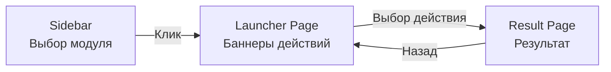
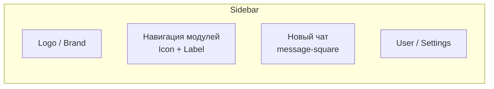
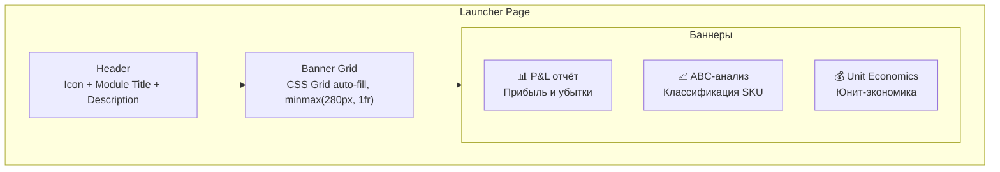
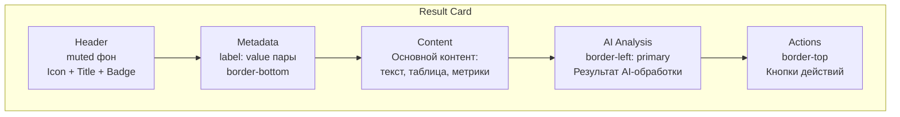
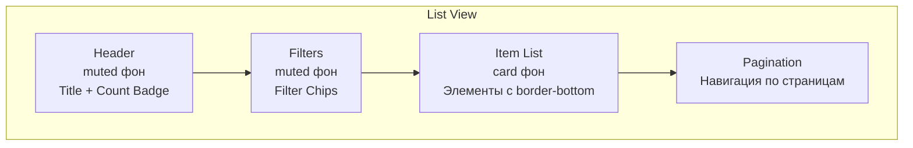
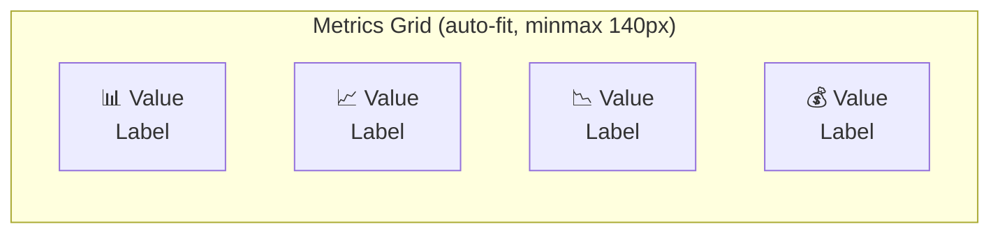
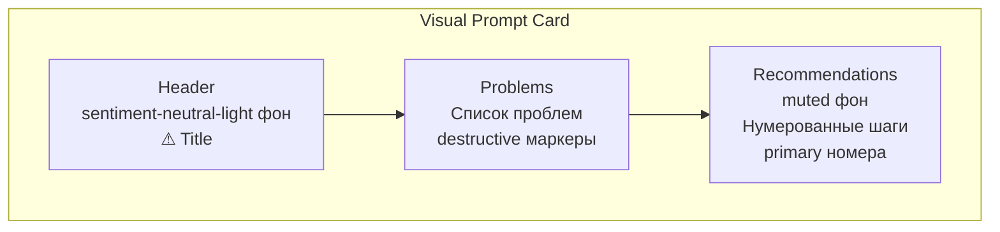
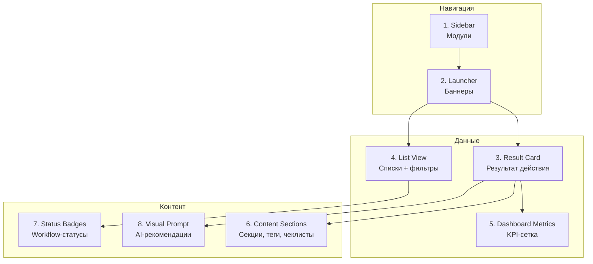

# Паттерны компоновки ADOLF

**Версия:** 1.1
**Дата:** Февраль 2026

## Обзор

Раздел описывает типовые паттерны компоновки, используемые в интерфейсах модулей ADOLF. Каждый паттерн — это устоявшаяся комбинация компонентов из [Раздела 3](/ui/adolf_ui_3_components), собранная в функциональный блок интерфейса.

Паттерны построены на единой системе CSS-переменных и модульного алиасинга, описанных в разделах [1](/ui/adolf_ui_1_foundations) и [2](/ui/adolf_ui_2_module_theming).

## Навигационная модель



Платформа ADOLF реализует трёхуровневую навигацию: Sidebar → Launcher → Result. Каждый уровень использует свой layout-паттерн.

## Паттерн 1: Sidebar

Боковая панель навигации по модулям. Фиксирована слева, содержит иконки и названия модулей. Использует переменные `--sidebar-*` из `shadcn-variables.css`.

### Структура



### CSS-переменные

| Элемент | Светлая тема | Тёмная тема |
|:--------|:-------------|:------------|
| Фон | `--sidebar` → `oklch(0.985 0 0)` | `oklch(0.205 0 0)` |
| Текст | `--sidebar-foreground` → `oklch(0.145 0 0)` | `oklch(0.985 0 0)` |
| Активный элемент | `--sidebar-primary` → `oklch(0.205 0 0)` | `oklch(0.488 0.243 264.376)` |
| Текст активного | `--sidebar-primary-foreground` → `oklch(0.985 0 0)` | `oklch(0.985 0 0)` |
| Hover-фон | `--sidebar-accent` → `oklch(0.97 0 0)` | `oklch(0.269 0 0)` |
| Граница | `--sidebar-border` → `oklch(0.922 0 0)` | `oklch(1 0 0 / 10%)` |

### Элемент навигации

Каждый модуль в sidebar отображается как элемент с Lucide-иконкой и цветовым акцентом:

```css
.sidebar-item {
  display: flex;
  align-items: center;
  gap: var(--spacing-3);
  padding: var(--spacing-2) var(--spacing-3);
  font-size: var(--text-sm);
  font-weight: var(--font-medium);
  color: var(--sidebar-foreground);
  border-radius: var(--radius-md);
  cursor: pointer;
  transition: all var(--transition-fast) var(--ease-in-out);
}

.sidebar-item:hover {
  background: var(--sidebar-accent);
  color: var(--sidebar-accent-foreground);
}

.sidebar-item.active {
  background: var(--sidebar-primary);
  color: var(--sidebar-primary-foreground);
}

/* Иконка модуля с акцентным цветом */
.sidebar-item-icon {
  width: 20px;
  height: 20px;
  flex-shrink: 0;
}
```

При активации модуля иконка окрашивается в акцентный цвет `--primary`.

## Паттерн 2: Launcher Page

Страница баннеров действий модуля. Пользователь видит сетку из визуальных карточек-баннеров, каждая из которых запускает конкретное действие.

Подробная спецификация: [Core — Launcher](/core/adolf_core_3_1_launcher)

### Структура страницы



### CSS-паттерн сетки баннеров

```css
.launcher-page {
  padding: var(--spacing-8);
  max-width: 1200px;
  margin: 0 auto;
}

.launcher-header {
  margin-bottom: var(--spacing-8);
}

.launcher-header-title {
  display: flex;
  align-items: center;
  gap: var(--spacing-3);
  font-size: var(--text-2xl);
  font-weight: var(--font-bold);
  color: var(--foreground);
  margin: 0 0 var(--spacing-2) 0;
}

.launcher-header-icon {
  color: var(--primary);
}

.launcher-header-description {
  font-size: var(--text-sm);
  color: var(--muted-foreground);
  margin: 0;
}

.banner-grid {
  display: grid;
  grid-template-columns: repeat(auto-fill, minmax(280px, 1fr));
  gap: var(--spacing-4);
}
```

### CSS-паттерн баннера

```css
.banner {
  display: flex;
  flex-direction: column;
  gap: var(--spacing-3);
  padding: var(--spacing-6);
  background: var(--card);
  border: 1px solid var(--border);
  border-radius: var(--radius-lg);
  cursor: pointer;
  transition: all var(--transition-fast) var(--ease-in-out);
  position: relative;
}

.banner:hover {
  border-color: var(--primary);
  box-shadow: var(--shadow-md);
  transform: translateY(-2px);
}

.banner__icon {
  width: 40px;
  height: 40px;
  display: flex;
  align-items: center;
  justify-content: center;
  background: var(--muted);
  color: var(--primary);
  border-radius: var(--radius-md);
}

.banner__title {
  font-size: var(--text-base);
  font-weight: var(--font-semibold);
  color: var(--foreground);
  margin: 0;
}

.banner__description {
  font-size: var(--text-sm);
  color: var(--muted-foreground);
  line-height: var(--leading-normal);
  margin: 0;
}

.banner__badge {
  position: absolute;
  top: var(--spacing-3);
  right: var(--spacing-3);
  padding: 2px var(--spacing-2);
  font-size: var(--text-xs);
  font-weight: var(--font-semibold);
  background: var(--primary);
  color: var(--primary-foreground);
  border-radius: var(--radius-sm);
}

.banner--disabled {
  opacity: 0.5;
  cursor: not-allowed;
  pointer-events: none;
}
```

### Цвет определяется атрибутом `data-module`

```html
<div class="launcher-page" data-module="cfo">
  <!-- Автоматически подставляются --primary из CSS -->
</div>
```

## Паттерн 3: Result Card

Основной паттерн отображения результата выполнения действия. Единая структура для всех модулей.

### Структура



### CSS-паттерн

Паттерн одинаков для всех модулей — отличается только цвет через алиасинг:

```css
/* Контейнер */
.adolf-{module}-result {
  background: var(--card);
  color: var(--card-foreground);
  border: 1px solid var(--border);
  border-radius: var(--radius-lg);
  overflow: hidden;
}

/* Заголовок карточки */
.adolf-{module}-result-header {
  display: flex;
  align-items: center;
  gap: var(--spacing-3);
  padding: var(--spacing-4) var(--spacing-6);
  background: var(--muted);
  border-bottom: 1px solid var(--border);
}

/* Метаданные */
.adolf-{module}-meta {
  display: flex;
  flex-wrap: wrap;
  gap: var(--spacing-4);
  margin-bottom: var(--spacing-6);
  padding-bottom: var(--spacing-4);
  border-bottom: 1px solid var(--border);
}

/* Тело карточки */
.adolf-{module}-result-body {
  padding: var(--spacing-6);
}

/* AI-блок с акцентной полосой */
.adolf-{module}-ai-analysis {
  background: var(--muted);
  border-radius: var(--radius-md);
  padding: var(--spacing-4);
  border-left: 4px solid var(--primary);
}

/* Панель действий */
.adolf-{module}-actions {
  display: flex;
  flex-wrap: wrap;
  gap: var(--spacing-2);
  padding-top: var(--spacing-4);
  border-top: 1px solid var(--border);
  margin-top: var(--spacing-6);
}
```

### Примеры по модулям

| Модуль | Карточка результата | Контент |
|:-------|:-------------------|:--------|
| Knowledge | `.adolf-kb-result` | RAG-ответ + источники |
| Content Factory | `.adolf-cf-result` | Сгенерированный контент + SEO-теги + валидация |
| CFO | `.adolf-cfo-report` | Финансовый отчёт + таблицы + метрики |
| Reputation | `.adolf-rep-detail` | Отзыв + AI-анализ + ответ |

## Паттерн 4: List View

Списковое представление данных с фильтрацией. Используется для отзывов (Reputation), черновиков (Content Factory), товаров (CFO).

### Структура



### CSS-паттерн

```css
/* Контейнер списка */
.adolf-rep-list {
  background: var(--card);
  color: var(--card-foreground);
  border: 1px solid var(--border);
  border-radius: var(--radius-lg);
  overflow: hidden;
}

/* Заголовок с счётчиком */
.adolf-rep-list-header {
  display: flex;
  align-items: center;
  justify-content: space-between;
  gap: var(--spacing-4);
  padding: var(--spacing-4) var(--spacing-6);
  background: var(--muted);
  border-bottom: 1px solid var(--border);
}

/* Полоса фильтров */
.adolf-rep-filters {
  display: flex;
  flex-wrap: wrap;
  align-items: center;
  gap: var(--spacing-3);
  padding: var(--spacing-4) var(--spacing-6);
  background: var(--muted);
  border-bottom: 1px solid var(--border);
}

/* Элемент списка */
.adolf-rep-review-card {
  display: flex;
  gap: var(--spacing-4);
  padding: var(--spacing-4) var(--spacing-6);
  border-bottom: 1px solid var(--border);
  cursor: pointer;
  transition: background var(--transition-fast) var(--ease-in-out);
}
.adolf-rep-review-card:last-child { border-bottom: none; }
.adolf-rep-review-card:hover { background: var(--accent); }
.adolf-rep-review-card.unread { background: var(--muted); }
```

### Табличный вариант (Content Factory)

Для структурированных данных список заменяется таблицей:

```css
.adolf-cf-draft-table {
  width: 100%;
  border-collapse: collapse;
}

.adolf-cf-draft-table th {
  font-size: var(--text-sm);
  font-weight: var(--font-medium);
  color: var(--muted-foreground);
  text-transform: uppercase;
  letter-spacing: 0.05em;
  background: var(--muted);
  padding: var(--spacing-3) var(--spacing-4);
  text-align: left;
  border-bottom: 1px solid var(--border);
}

.adolf-cf-draft-table tbody tr {
  cursor: pointer;
  transition: background var(--transition-fast) var(--ease-in-out);
}
.adolf-cf-draft-table tbody tr:hover { background: var(--accent); }
```

## Паттерн 5: Dashboard Metrics

Сетка KPI-карточек с числовыми показателями. Используется на страницах результатов CFO, Reputation, Content Factory.

### Структура



### CSS-паттерн

```css
.adolf-cfo-metrics {
  display: grid;
  grid-template-columns: repeat(auto-fit, minmax(140px, 1fr));
  gap: var(--spacing-4);
}

.adolf-rep-stat-card {
  background: var(--muted);
  border-radius: var(--radius-md);
  padding: var(--spacing-4);
  text-align: center;
}

.adolf-rep-stat-value {
  font-size: var(--text-xl);
  font-weight: var(--font-bold);
  color: var(--primary);
}

/* Семантические варианты */
.adolf-rep-stat-value.positive { color: var(--sentiment-positive); }
.adolf-rep-stat-value.negative { color: var(--sentiment-negative); }

.adolf-rep-stat-label {
  font-size: var(--text-sm);
  color: var(--muted-foreground);
  margin-top: var(--spacing-1);
}
```

### Вариант: Warehouse Card (Logistic)

Расширенный вариант метрик с внутренней сеткой 3-колонки:

```css
.adolf-warehouse-card {
  display: flex;
  flex-direction: column;
  padding: var(--spacing-4);
  background: var(--card);
  border: 1px solid var(--border);
  border-radius: var(--radius-lg);
  transition: all var(--transition-fast) var(--ease-in-out);
}

.adolf-warehouse-card:hover {
  border-color: var(--primary);
  box-shadow: 0 4px 12px oklch(0 0 0 / 0.08);
}

.adolf-warehouse-stats {
  display: grid;
  grid-template-columns: repeat(3, 1fr);
  gap: var(--spacing-3);
  padding-top: var(--spacing-3);
  border-top: 1px solid var(--border);
}
```

## Паттерн 6: Content Sections

Секции контента внутри Result Card. Используются для структурирования длинных результатов.

### Draft Section (Content Factory)

Отображение сгенерированного контента с метками полей:

```css
.adolf-cf-draft-section {
  margin-bottom: var(--spacing-4);
}

.adolf-cf-draft-label {
  display: flex;
  align-items: center;
  gap: var(--spacing-2);
  font-size: var(--text-sm);
  font-weight: var(--font-medium);
  color: var(--muted-foreground);
  margin-bottom: var(--spacing-2);
}

.adolf-cf-draft-title {
  font-size: var(--text-lg);
  font-weight: var(--font-semibold);
  line-height: var(--leading-snug);
  margin: 0;
  padding: var(--spacing-3);
  background: var(--muted);
  border-radius: var(--radius-md);
}

.adolf-cf-draft-description {
  font-size: var(--text-base);
  line-height: var(--leading-relaxed);
  margin: 0;
  padding: var(--spacing-3);
  background: var(--muted);
  border-radius: var(--radius-md);
  white-space: pre-wrap;
}
```

### SEO Tags (Content Factory)

Теги с интерактивным hover-эффектом:

```css
.adolf-cf-seo-tags {
  display: flex;
  flex-wrap: wrap;
  gap: var(--spacing-2);
  padding: var(--spacing-3);
  background: var(--muted);
  border-radius: var(--radius-md);
}

.adolf-cf-seo-tag {
  display: inline-flex;
  padding: 2px var(--spacing-2);
  font-size: var(--text-sm);
  color: var(--primary);
  background: var(--muted);
  border-radius: var(--radius-sm);
  transition: background var(--transition-fast) var(--ease-in-out);
}

.adolf-cf-seo-tag:hover {
  background: var(--primary);
  color: var(--primary-foreground);
}
```

### Validation Checklist (Content Factory)

Визуальный чеклист с семантическими индикаторами:

```css
.adolf-cf-validation {
  margin-top: var(--spacing-6);
  padding: var(--spacing-4);
  background: var(--muted);
  border-radius: var(--radius-md);
}

.adolf-cf-validation-item {
  display: flex;
  align-items: flex-start;
  gap: var(--spacing-2);
  font-size: var(--text-sm);
}

.adolf-cf-validation-item.success .adolf-cf-validation-icon { color: var(--success); }
.adolf-cf-validation-item.warning .adolf-cf-validation-icon { color: var(--warning); }
.adolf-cf-validation-item.error   .adolf-cf-validation-icon { color: var(--destructive); }
```

### Keyword Tags (Reputation)

Теги с семантической окраской:

```css
.adolf-rep-keywords { display: flex; flex-wrap: wrap; gap: var(--spacing-1); }

.adolf-rep-keyword {
  display: inline-flex;
  padding: 2px var(--spacing-2);
  font-size: var(--text-sm);
  background: var(--background);
  color: var(--muted-foreground);
  border-radius: var(--radius-sm);
}

.adolf-rep-keyword.problem { background: var(--sentiment-negative-light); color: var(--sentiment-negative); }
.adolf-rep-keyword.praise  { background: var(--sentiment-positive-light); color: var(--sentiment-positive); }
```

## Паттерн 7: Status Badges

Системный набор статусных бейджей для workflow.

### Content Factory Statuses

```css
.adolf-cf-status-badge {
  display: inline-flex;
  align-items: center;
  padding: 2px var(--spacing-2);
  font-size: var(--text-sm);
  font-weight: var(--font-medium);
  border-radius: var(--radius-sm);
}

.adolf-cf-status-badge.draft     { background: var(--muted); color: var(--muted-foreground); }
.adolf-cf-status-badge.pending   { background: var(--sentiment-neutral-light); color: var(--sentiment-neutral); }
.adolf-cf-status-badge.approved  { background: var(--success); color: var(--success-foreground); }
.adolf-cf-status-badge.published { background: var(--info); color: var(--info-foreground); }
.adolf-cf-status-badge.rejected  { background: var(--destructive); color: var(--destructive-foreground); }
```

### Stock Status (Logistic)

```css
.adolf-stock-status {
  display: inline-flex;
  align-items: center;
  gap: var(--spacing-1);
  padding: 2px var(--spacing-2);
  font-size: var(--text-xs);
  font-weight: var(--font-semibold);
  border-radius: var(--radius-full);
}

.adolf-stock-status.critical { background: oklch(0.577 0.245 27.325 / 0.15); color: oklch(0.577 0.245 27.325); }
.adolf-stock-status.low      { background: oklch(0.84 0.16 84 / 0.15); color: oklch(0.65 0.16 84); }
.adolf-stock-status.normal   { background: oklch(0.723 0.191 142.495 / 0.15); color: oklch(0.55 0.15 142); }
```

## Паттерн 8: Visual Prompt Card

Специализированный паттерн для модуля Content Factory — отображение AI-рекомендаций с проблемами и нумерованными шагами.



Отличия от стандартной Result Card: заголовок использует `--sentiment-neutral-light` вместо `--muted`, секция проблем окрашена `--destructive`, рекомендации с нумерованными кругами `--primary`.

## Адаптивная раскладка

Все паттерны включают адаптивные стили с точкой перелома `768px`.

### Принципы адаптации

| Desktop (> 768px) | Mobile (≤ 768px) |
|:-------------------|:-----------------|
| Горизонтальный header (flex-row) | Вертикальный header (flex-column) |
| Сетка метрик auto-fit | Сетка 2 колонки |
| Горизонтальные кнопки | Вертикальные кнопки, width: 100% |
| Таблица — стандарт | Таблица — горизонтальный скролл |
| Карточки списка — горизонтальные | Карточки — вертикальные |
| Padding: spacing-6 | Padding: spacing-4 |

### Общий CSS-паттерн адаптации

```css
@media (max-width: 768px) {
  /* Headers */
  .adolf-{module}-header {
    flex-direction: column;
    align-items: flex-start;
  }

  /* Body padding */
  .adolf-{module}-body {
    padding: var(--spacing-4);
  }

  /* Grids */
  .adolf-{module}-metrics {
    grid-template-columns: repeat(2, 1fr);
  }

  /* Tables */
  .adolf-{module}-table {
    display: block;
    overflow-x: auto;
  }

  /* Actions */
  .adolf-{module}-actions {
    flex-direction: column;
  }
  .adolf-{module}-actions .adolf-btn {
    width: 100%;
    justify-content: center;
  }
}
```

## Сводная карта паттернов



| # | Паттерн | Модули | Описание |
|:-:|:--------|:-------|:---------|
| 1 | Sidebar | Все | Навигация по модулям |
| 2 | Launcher Page | Все | Сетка баннеров действий |
| 3 | Result Card | Knowledge, CF, CFO, Reputation | Универсальная карточка результата |
| 4 | List View | Reputation, CF, Watcher | Список с фильтрами |
| 5 | Dashboard Metrics | CFO, Reputation, CF, Logistic | Сетка KPI |
| 6 | Content Sections | CF, Knowledge, Reputation | Секции контента, теги |
| 7 | Status Badges | CF, Logistic | Workflow-статусы |
| 8 | Visual Prompt | CF | AI-рекомендации с проблемами |

## Связанные документы

| Документ | Описание |
|:---------|:---------|
| [Раздел 1: Основы](/ui/adolf_ui_1_foundations) | CSS-переменные для всех паттернов |
| [Раздел 2: Тематизация](/ui/adolf_ui_2_module_theming) | Единая цветовая схема, иконки, маркетплейсы |
| [Раздел 3: Компоненты](/ui/adolf_ui_3_components) | Компоненты, составляющие паттерны |
| [Core — Launcher](/core/adolf_core_3_1_launcher) | Полная спецификация Launcher |

---

**Версия:** 1.1 | **Дата:** Февраль 2026
