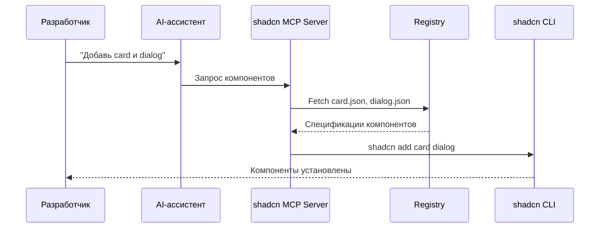

## Назначение

[shadcn MCP Server](https://ui.shadcn.com/docs/mcp) — это MCP-сервер, позволяющий AI-ассистентам взаимодействовать с реестрами компонентов shadcn/ui. Через MCP-протокол ассистент может просматривать доступные компоненты, искать нужные и устанавливать их в проект с помощью естественного языка.

Примеры запросов к AI-ассистенту:

- «Покажи все доступные компоненты в shadcn registry»
- «Добавь компоненты button, dialog и card в проект»
- «Создай форму обратной связи из компонентов shadcn»

## Что такое MCP

[Model Context Protocol (MCP)](https://modelcontextprotocol.io) — открытый протокол для безопасного подключения AI-ассистентов к внешним источникам данных и инструментам. shadcn MCP Server предоставляет доступ к:

- **Browse** — просмотр всех компонентов, блоков и шаблонов из настроенных реестров
- **Search** — поиск компонентов по имени или функциональности
- **Install** — установка компонентов через естественный язык
- **Multi-registry** — работа с публичными, приватными и сторонними реестрами

## Принцип работы



## Конфигурация MCP-клиентов

### Claude Code

Файл `.mcp.json` в корне проекта:

```json
{
  "mcpServers": {
    "shadcn": {
      "command": "npx",
      "args": ["shadcn@latest", "mcp"]
    }
  }
}
```

Инициализация через CLI:

```bash
pnpm dlx shadcn@latest mcp init --client claude
```

После добавления конфигурации — перезапустить Claude Code. Команда `/mcp` покажет статус подключения.

### Cursor

Файл `.cursor/mcp.json`:

```json
{
  "mcpServers": {
    "shadcn": {
      "command": "npx",
      "args": ["shadcn@latest", "mcp"]
    }
  }
}
```

После сохранения — включить shadcn MCP Server в Cursor Settings. Зелёная точка рядом с сервером означает успешное подключение.

### VS Code (GitHub Copilot)

Файл `.vscode/mcp.json`:

```json
{
  "servers": {
    "shadcn": {
      "command": "npx",
      "args": ["shadcn@latest", "mcp"]
    }
  }
}
```

После сохранения — открыть `.vscode/mcp.json` и нажать **Start** рядом с shadcn.

### Codex

Файл `~/.codex/config.toml` (ручная настройка):

```toml
[mcp_servers.shadcn]
command = "npx"
args = ["shadcn@latest", "mcp"]
```

Перезапустить Codex для загрузки MCP-сервера.

## Настройка реестров

Стандартный реестр shadcn/ui доступен без дополнительной конфигурации. Дополнительные реестры настраиваются в `components.json`:

```json
{
  "registries": {
    "@acme": "https://registry.acme.com/{name}.json",
    "@internal": {
      "url": "https://internal.company.com/{name}.json",
      "headers": {
        "Authorization": "Bearer ${REGISTRY_TOKEN}"
      }
    }
  }
}
```

Для приватных реестров переменные окружения задаются в `.env.local`:

```bash
REGISTRY_TOKEN=your_token_here
```

## Применение в ADOLF

В контексте платформы ADOLF shadcn MCP Server используется для:

- Быстрой установки компонентов из [каталога](/ui/adolf_ui_3_components) при разработке модулей
- Генерации UI-форм и дашбордов через AI-ассистентов с учётом единой цветовой схемы
- Прототипирования интерфейсов модулей с использованием Blocks и шаблонов shadcn/ui

Промпт для Claude Code при работе с ADOLF:

```
Используй shadcn MCP для установки компонентов. Все модули ADOLF 
используют единую цветовую схему shadcn/ui (base color: Neutral).
Stroke-width иконок Lucide: 1.5px. Стилизация через CSS-переменные 
--primary, --muted, --accent, --destructive.
```

## Связанные документы

| Документ | Описание |
|:---------|:---------|
| [Раздел 3: Компоненты](/ui/adolf_ui_3_components) | Каталог shadcn-компонентов ADOLF |
| [Раздел 2: Тематизация](/ui/adolf_ui_2_module_theming) | Единая цветовая схема, CSS-переменные |
| [shadcn/ui MCP Docs](https://ui.shadcn.com/docs/mcp) | Официальная документация |
| [MCP Protocol](https://modelcontextprotocol.io) | Спецификация Model Context Protocol |

---

**Версия:** 1.0 | **Дата:** Февраль 2026
