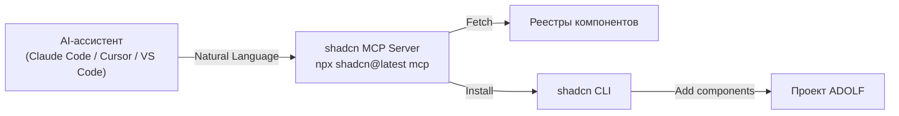

## Назначение

[shadcn MCP Server](https://ui.shadcn.com/docs/mcp) — сервер [Model Context Protocol](https://modelcontextprotocol.io), предоставляющий AI-ассистентам прямой доступ к реестрам компонентов shadcn/ui. Позволяет через естественный язык просматривать, искать и устанавливать компоненты в проект.

Возможности:

- Просмотр всех доступных компонентов, блоков и шаблонов из настроенных реестров
- Поиск компонентов по имени или функциональности
- Установка компонентов через промпт (`"add the button, dialog and card components"`)
- Работа с несколькими реестрами: публичными, приватными, сторонними

## Архитектура



## Конфигурация по клиентам

### Claude Code

Файл `.mcp.json` в корне проекта:

```json
{
  "mcpServers": {
    "shadcn": {
      "command": "npx",
      "args": ["shadcn@latest", "mcp"]
    }
  }
}
```

После добавления — перезапустить Claude Code. Команда `/mcp` покажет статус подключения.

### Cursor

Файл `.cursor/mcp.json`:

```json
{
  "mcpServers": {
    "shadcn": {
      "command": "npx",
      "args": ["shadcn@latest", "mcp"]
    }
  }
}
```

После добавления — включить shadcn MCP Server в Cursor Settings. Зелёная точка рядом с сервером означает успешное подключение.

### VS Code (GitHub Copilot)

Файл `.vscode/mcp.json`:

```json
{
  "servers": {
    "shadcn": {
      "command": "npx",
      "args": ["shadcn@latest", "mcp"]
    }
  }
}
```

После добавления — открыть `.vscode/mcp.json` и нажать **Start** напротив shadcn.

### Codex

Файл `~/.codex/config.toml` (редактируется вручную):

```toml
[mcp_servers.shadcn]
command = "npx"
args = ["shadcn@latest", "mcp"]
```

После добавления — перезапустить Codex.

## Настройка реестров

Реестры настраиваются в `components.json` проекта. Стандартный реестр shadcn/ui доступен без конфигурации.

### Базовая конфигурация

```json
{
  "registries": {
    "@acme": "https://registry.acme.com/{name}.json"
  }
}
```

### Приватный реестр с аутентификацией

```json
{
  "registries": {
    "@internal": {
      "url": "https://internal.company.com/{name}.json",
      "headers": {
        "Authorization": "Bearer ${REGISTRY_TOKEN}"
      }
    }
  }
}
```

Токены хранятся в `.env.local`:

```
REGISTRY_TOKEN=your_token_here
```

## Примеры промптов

| Промпт | Действие |
|:-------|:---------|
| `Show me all available components in the shadcn registry` | Список всех компонентов реестра |
| `Add the button, dialog and card components` | Установка компонентов в проект |
| `Find me a login form from the shadcn registry` | Поиск формы авторизации |
| `Build a landing page using components from the acme registry` | Сборка страницы из стороннего реестра |
| `What sidebar components are available?` | Поиск по функциональности |

## Применение в ADOLF

В контексте ADOLF MCP-сервер shadcn/ui используется для ускорения разработки UI-компонентов модулей. AI-ассистент может установить и настроить компоненты из [каталога](/ui/adolf_ui_3_components), адаптируя их под единую цветовую схему `--primary`.

### Инициализация

```bash
# Установка shadcn CLI
npx shadcn@latest init

# Подключение MCP (для Claude Code)
npx shadcn@latest mcp init --client claude
```

### Типовой workflow

1. Запрос AI-ассистенту: `"Add sidebar, card, badge and table components"`
2. MCP-сервер загружает компоненты из реестра
3. CLI устанавливает файлы в проект
4. Компоненты наследуют CSS-переменные из `shadcn-variables.css`
5. Стилизация через `--primary` — единая для всех модулей

## Связанные документы

| Документ | Описание |
|:---------|:---------|
| [Раздел 0: Введение](/ui/adolf_ui_0_introduction) | Обзор дизайн-системы |
| [Раздел 3: Компоненты](/ui/adolf_ui_3_components) | Каталог компонентов shadcn/ui |
| [shadcn/ui MCP](https://ui.shadcn.com/docs/mcp) | Официальная документация |
| [Model Context Protocol](https://modelcontextprotocol.io) | Спецификация MCP |

---

**Версия:** 1.0 | **Дата:** Февраль 2026
