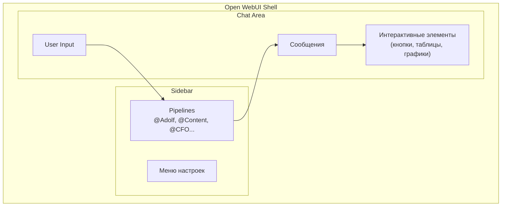
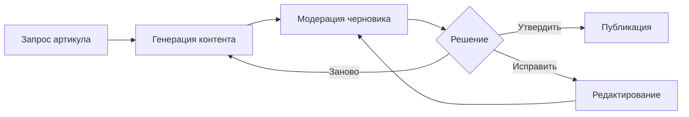
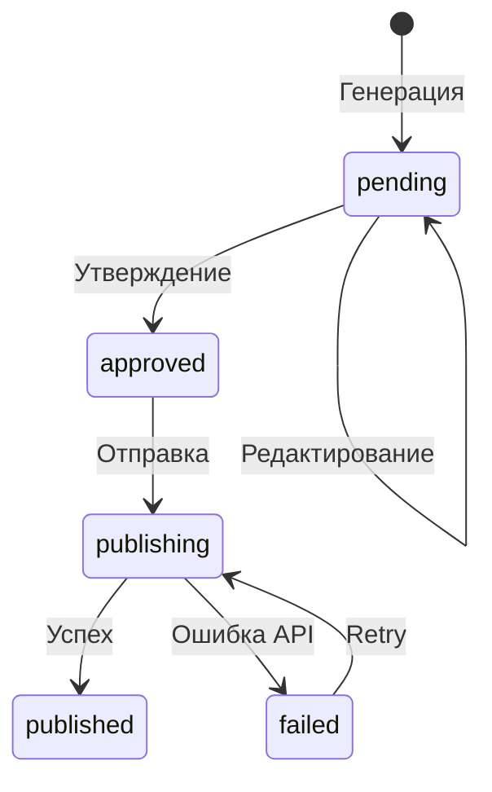
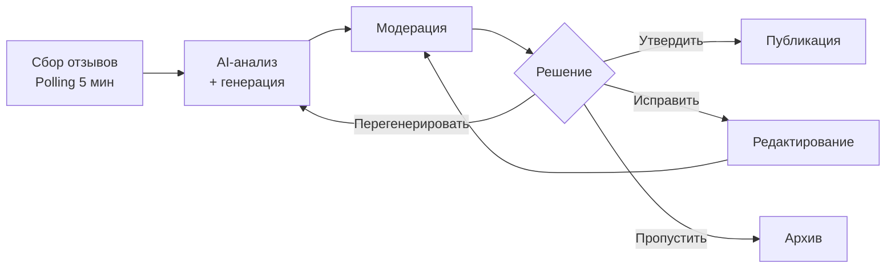

# ADOLF UI/UX Design Reference

**Проект:** Корпоративная AI-система для e-commerce  
**Платформа:** Open WebUI  
**Версия:** 1.0  
**Дата:** Январь 2026

---

## 1. Введение

### 1.1 Назначение документа

Данный документ является руководством по UI/UX дизайну для разработчиков, работающих над интерфейсом системы ADOLF. Документ содержит:

- Общие принципы и стили интерфейса
- Концептуальные wireframes для каждого модуля
- Рекомендации по компонентам и паттернам взаимодействия
- Спецификации интерактивных элементов в чате

### 1.2 Целевая аудитория

| Роль | Использование документа |
|------|-------------------------|
| Frontend-разработчик | Реализация компонентов и стилей |
| Backend-разработчик | Понимание формата данных для UI |
| Pipeline-разработчик | Форматирование ответов, Event Emitter |
| Тестировщик | Проверка соответствия макетам |

### 1.3 Технологический контекст

ADOLF использует **Open WebUI** как основной интерфейс. Это определяет:

- **Чат-центричный подход** — основное взаимодействие через сообщения
- **Комбинированный интерфейс** — чат + визуальные элементы (кнопки, карточки, графики)
- **Адаптивная тема** — автопереключение светлой/тёмной по системным настройкам
- **PWA-совместимость** — интерфейс работает на мобильных устройствах

### 1.4 Принципы дизайна ADOLF

| Принцип | Описание |
|---------|----------|
| **Минимализм** | Только необходимая информация, без визуального шума |
| **Консистентность** | Единые паттерны взаимодействия во всех модулях |
| **Контекстность** | Кнопки и действия релевантны текущей задаче |
| **Информативность** | Статусы, прогресс и результаты всегда видны |
| **Доступность** | Работает на десктопе, планшете и смартфоне |

### 1.5 Архитектура интерфейса



### 1.6 Модули системы

| Модуль | Pipeline | Назначение | Мин. роль |
|--------|----------|------------|-----------|
| Content Factory | `@Adolf_Content` | Генерация SEO-контента | Senior |
| CFO | `@Adolf_CFO` | Финансовая аналитика | Senior |
| Reputation | `@Adolf_Reputation` | Управление отзывами | Manager |
| Watcher | `@Adolf_Watcher` | Мониторинг цен | Manager |
| Knowledge | `@Adolf_Knowledge` | База знаний | Staff |
| Marketing | `@Adolf_Marketing` | Реклама | Manager |
| Scout | `@Adolf_Scout` | Аналитика ниш | Senior |
| Lex | `@Adolf_Lex` | Правовой мониторинг | Manager |

---

## 2. Общие стили и компоненты

### 2.1 Цветовая схема

Используется стандартная палитра Open WebUI с адаптивным переключением тем.

**Светлая тема (Light)**

| Элемент | Цвет | HEX |
|---------|------|-----|
| Фон основной | Белый | `#FFFFFF` |
| Фон карточки | Серый | `#F9FAFB` |
| Текст основной | Тёмно-серый | `#1F2937` |
| Текст вторичный | Серый | `#6B7280` |
| Акцент (primary) | Синий | `#3B82F6` |
| Успех (success) | Зелёный | `#10B981` |
| Предупреждение (warning) | Жёлтый | `#F59E0B` |
| Ошибка (error) | Красный | `#EF4444` |
| Граница | Светло-серый | `#E5E7EB` |

**Тёмная тема (Dark)**

| Элемент | Цвет | HEX |
|---------|------|-----|
| Фон основной | Тёмно-серый | `#1F2937` |
| Фон карточки | Серый | `#374151` |
| Текст основной | Белый | `#F9FAFB` |
| Текст вторичный | Светло-серый | `#9CA3AF` |
| Акцент (primary) | Синий | `#60A5FA` |
| Успех (success) | Зелёный | `#34D399` |
| Предупреждение (warning) | Жёлтый | `#FBBF24` |
| Ошибка (error) | Красный | `#F87171` |
| Граница | Серый | `#4B5563` |

### 2.2 Семантические цвета модулей

Для визуальной идентификации модулей используются акцентные цвета:

| Модуль | Цвет | HEX | Применение |
|--------|------|-----|------------|
| Content Factory | Фиолетовый | `#8B5CF6` | Иконка, бейджи |
| CFO | Изумрудный | `#059669` | Финансовые показатели |
| Reputation | Оранжевый | `#F97316` | Рейтинги, отзывы |
| Watcher | Голубой | `#0EA5E9` | Цены, графики |
| Knowledge | Индиго | `#6366F1` | Документы |
| Marketing | Розовый | `#EC4899` | Реклама, кампании |
| Scout | Янтарный | `#D97706` | Аналитика |
| Lex | Серый | `#6B7280` | Юридическое |

### 2.3 Типографика

Используются системные шрифты Open WebUI.

| Элемент | Размер | Вес | Применение |
|---------|--------|-----|------------|
| H1 | 24px | Bold (700) | Заголовки разделов |
| H2 | 20px | Semibold (600) | Подзаголовки |
| H3 | 16px | Semibold (600) | Названия карточек |
| Body | 14px | Regular (400) | Основной текст |
| Small | 12px | Regular (400) | Подписи, метаданные |
| Code | 13px | Mono | Артикулы, ID, код |

### 2.4 Иконки

**Иконки модулей:**

| Модуль | Эмодзи | Альтернатива |
|--------|--------|--------------|
| Content Factory | 📝 | `edit` |
| CFO | 💰 | `chart-bar` |
| Reputation | ⭐ | `star` |
| Watcher | 👁️ | `eye` |
| Knowledge | 📚 | `book-open` |
| Marketing | 📢 | `megaphone` |
| Scout | 🔭 | `search` |
| Lex | ⚖️ | `scale` |

**Статусные иконки:**

| Статус | Эмодзи | Значение |
|--------|--------|----------|
| Успех | ✅ | Операция выполнена |
| Ожидание | ⏳ | В процессе |
| Предупреждение | ⚠️ | Требует внимания |
| Ошибка | ❌ | Сбой операции |
| Информация | ℹ️ | Дополнительные сведения |

### 2.5 Базовые компоненты

#### 2.5.1 Кнопки действий

Кнопки отображаются после ответа ассистента через Event Emitter.

**Типы кнопок:**

| Тип | Стиль | Применение |
|-----|-------|------------|
| Primary | Заливка акцентным цветом | Основное действие (Утвердить, Сохранить) |
| Secondary | Граница, без заливки | Альтернативные действия |
| Danger | Красная заливка | Удаление, отмена |
| Ghost | Только текст | Вспомогательные действия |

**Структура кнопки (Event Emitter):**

```python
{
    "label": "✓ Утвердить",      # Текст с эмодзи
    "value": "Опубликуй черновик draft_abc123",  # Команда для чата
    "style": "primary"           # Опционально: primary/secondary/danger
}
```

#### 2.5.2 Карточки

Используются для отображения сущностей (товар, отзыв, документ).

**Элементы карточки:**

| Элемент | Описание |
|---------|----------|
| Заголовок | Иконка модуля + название + статус-бейдж |
| Метаданные | Ключевые параметры (артикул, дата, источник) |
| Контент | Превью основного содержимого |
| Действия | Кнопки для работы с сущностью |

#### 2.5.3 Таблицы

**Правила форматирования таблиц:**

| Тип данных | Выравнивание | Формат |
|------------|--------------|--------|
| Текст | По левому краю | — |
| Числа | По правому краю | С разделителями тысяч |
| Деньги | По правому краю | `1 234 567 ₽` |
| Проценты | По правому краю | `45.0%` |
| Даты | По левому краю | `15.01.2026` |

#### 2.5.4 Статус-бейджи

| Статус | Цвет | Текст |
|--------|------|-------|
| pending | Жёлтый | `ожидает` |
| approved | Зелёный | `утверждён` |
| published | Синий | `опубликован` |
| rejected | Красный | `отклонён` |
| draft | Серый | `черновик` |
| processing | Голубой | `обработка` |

### 2.6 Форматирование ответов (Markdown)

**Структура типового ответа:**

```markdown
## 📝 Заголовок операции

**Метаданные:** значение  
**Ещё данные:** значение

---

### Подзаголовок
Контент...

### ✅ Статус операции

[Кнопки действий через Event Emitter]
```

### 2.7 Event Emitter компоненты

#### 2.7.1 Кнопки (actions)

```python
await __event_emitter__({
    "type": "actions",
    "data": {
        "buttons": [
            {"label": "✓ Утвердить", "value": "Утверди черновик"},
            {"label": "✏️ Исправить", "value": "Хочу исправить"},
            {"label": "🔄 Заново", "value": "Сгенерируй заново"}
        ]
    }
})
```

#### 2.7.2 Статус загрузки

```python
await __event_emitter__({
    "type": "status",
    "data": {
        "description": "Генерация контента...",
        "done": False
    }
})
```

#### 2.7.3 Графики (charts)

```python
await __event_emitter__({
    "type": "chart",
    "data": {
        "type": "line",
        "title": "Динамика цены",
        "data": [
            {"date": "01.01", "price": 2499, "competitor": 2599},
            {"date": "02.01", "price": 2399, "competitor": 2499}
        ],
        "xKey": "date",
        "series": [
            {"key": "price", "label": "Наша цена", "color": "#10B981"},
            {"key": "competitor", "label": "Конкурент", "color": "#EF4444"}
        ]
    }
})
```

#### 2.7.4 Интерактивные таблицы

```python
await __event_emitter__({
    "type": "table",
    "data": {
        "columns": [
            {"key": "sku", "label": "Артикул", "sortable": True},
            {"key": "price", "label": "Цена", "sortable": True, "type": "number"},
            {"key": "margin", "label": "Маржа", "sortable": True}
        ],
        "rows": [...],
        "defaultSort": {"key": "margin", "direction": "desc"}
    }
})
```

---

## 3. Content Factory

### 3.1 Обзор модуля

**Назначение:** Генерация SEO-оптимизированного контента для карточек товаров.

**Ключевые сущности:**
- Черновик контента (draft)
- Карточка товара (product card)
- ТЗ для дизайнера (visual prompt)

**Доступ:** Senior, Director, Administrator

### 3.2 Workflow



### 3.3 Wireframe: Результат генерации

```
┌─────────────────────────────────────────────────────────────────┐
│  ## 📝 Сгенерированный контент                                  │
│                                                                 │
│  **Артикул:** OM-12345                                          │
│  **Маркетплейс:** Wildberries                                   │
│  **ID черновика:** `draft_abc123`                               │
│                                                                 │
│  ─────────────────────────────────────────────────────────────  │
│                                                                 │
│  ### Название                                                   │
│  ┌─────────────────────────────────────────────────────────┐   │
│  │ Охана Маркет Платье женское летнее миди с цветочным     │   │
│  │ принтом свободного кроя                                  │   │
│  └─────────────────────────────────────────────────────────┘   │
│  *Длина: 78 символов (макс. 100)*                               │
│                                                                 │
│  ### Описание                                                   │
│  ┌─────────────────────────────────────────────────────────┐   │
│  │ Элегантное летнее платье из натуральной ткани станет    │   │
│  │ незаменимым элементом вашего гардероба...               │   │
│  └─────────────────────────────────────────────────────────┘   │
│  *Длина: 1250 символов*                                         │
│                                                                 │
│  ### SEO-теги                                                   │
│  `платье женское` `летнее платье` `платье миди`                │
│                                                                 │
│  ### ✅ Валидация пройдена                                      │
│                                                                 │
│  ─────────────────────────────────────────────────────────────  │
│                                                                 │
│  [✓ Утвердить] [✏️ Исправить] [📸 ТЗ дизайн.] [🔄 Заново]      │
│                                                                 │
└─────────────────────────────────────────────────────────────────┘
```

### 3.4 Кнопки модуля

| Кнопка | Действие | Когда показывать |
|--------|----------|------------------|
| ✓ Утвердить | Публикация черновика | После генерации (статус pending) |
| ✏️ Исправить | Режим редактирования | После генерации |
| 📸 ТЗ дизайнеру | Генерация Visual Prompt | После генерации |
| 🔄 Заново | Повторная генерация | После генерации |
| 📋 Ещё товар | Новая генерация | После публикации |
| 🔗 Открыть МП | Ссылка на карточку | После публикации |

### 3.5 Состояния черновика



---

## 4. CFO (Финансовая аналитика)

### 4.1 Обзор модуля

**Назначение:** Финансовый учёт, P&L отчёты, ABC-анализ.

**Ключевые сущности:**
- P&L отчёт (по SKU, категориям, брендам, МП)
- ABC-класс товара (A, B, C, D)
- AI-инсайт (рекомендация)

**Доступ:** Senior (ограниченный), Director, Administrator

### 4.2 Матрица доступа

| Функция | Senior | Director | Admin |
|---------|:------:|:--------:|:-----:|
| P&L по категориям | ✅ | ✅ | ✅ |
| P&L по брендам | ✅ | ✅ | ✅ |
| P&L по маркетплейсам | ✅ | ✅ | ✅ |
| ABC-анализ | ✅ | ✅ | ✅ |
| P&L по SKU | ❌ | ✅ | ✅ |
| Кастомные отчёты | ❌ | ✅ | ✅ |
| Настройки порогов | ❌ | ❌ | ✅ |

### 4.3 Wireframe: P&L по категориям

```
┌─────────────────────────────────────────────────────────────────┐
│  ## 💰 P&L по категориям                                        │
│  **Период:** 13.01.2026 — 19.01.2026                            │
│                                                                 │
│  | Категория | Выручка      | Себест.    | Прибыль     | Маржа │
│  |-----------|--------------|------------|-------------|-------|
│  | Платья    | 2 450 000 ₽  | 980 000 ₽  | 1 102 500 ₽ | 45.0% │
│  | Блузки    | 1 230 000 ₽  | 492 000 ₽  |   553 500 ₽ | 45.0% │
│  | Брюки     |   890 000 ₽  | 356 000 ₽  |   400 500 ₽ | 45.0% │
│                                                                 │
│  **Итого:** 4 570 000 ₽ выручки, 2 056 500 ₽ прибыли            │
│                                                                 │
│  [🏷️ По брендам] [🛒 По МП] [🔤 ABC-анализ] [📥 Excel]         │
│                                                                 │
└─────────────────────────────────────────────────────────────────┘
```

### 4.4 Wireframe: ABC-анализ

```
┌─────────────────────────────────────────────────────────────────┐
│  ## 🔤 ABC-анализ товарного портфеля                            │
│  **Период:** Январь 2026                                        │
│                                                                 │
│  | Класс | SKU  | Доля выручки | Доля прибыли | Описание     |  │
│  |:-----:|:----:|:------------:|:------------:|--------------|  │
│  | **A** |  25  |    80.0%     |    75.0%     | Лидеры       |  │
│  | **B** |  50  |    15.0%     |    18.0%     | Середняки    |  │
│  | **C** | 100  |     4.5%     |     6.0%     | Аутсайдеры   |  │
│  | **D** |  25  |     0.5%     |     1.0%     | Убыточные    |  │
│                                                                 │
│  ### 🔴 Убыточные позиции (класс D)                             │
│  | Артикул  | Название          | Выручка    | Убыток    |     │
│  |----------|-------------------|------------|-----------|     │
│  | OM-099   | Блузка шифоновая  | 25 000 ₽   | -5 000 ₽  |     │
│                                                                 │
│  [🔴 Убыточные] [🤖 AI-инсайты]                                 │
│                                                                 │
└─────────────────────────────────────────────────────────────────┘
```

### 4.5 Визуализация ABC-классов

| Класс | Цвет | Иконка | Описание |
|:-----:|------|--------|----------|
| A | Зелёный `#10B981` | 🟢 | Лидеры (80% прибыли) |
| B | Синий `#3B82F6` | 🔵 | Средние (15% прибыли) |
| C | Жёлтый `#F59E0B` | 🟡 | Аутсайдеры (5% прибыли) |
| D | Красный `#EF4444` | 🔴 | Убыточные |

### 4.6 Кнопки модуля

| Кнопка | Действие | Доступ |
|--------|----------|--------|
| 📊 P&L по категориям | Отчёт по категориям | Senior+ |
| 🏷️ P&L по брендам | Отчёт по брендам | Senior+ |
| 🛒 P&L по МП | Отчёт по маркетплейсам | Senior+ |
| 📈 P&L по SKU | Отчёт по артикулам | Director+ |
| 🔤 ABC-анализ | Классификация SKU | Senior+ |
| 🔴 Убыточные SKU | Список класса D | Senior+ |
| 🤖 AI-инсайты | Рекомендации | Senior+ |
| 📥 Excel | Экспорт в Excel | Senior+ |

---

## 5. Reputation (Управление отзывами)

### 5.1 Обзор модуля

**Назначение:** Автоматизация обработки отзывов и вопросов покупателей.

**Ключевые сущности:**
- Отзыв (review)
- Вопрос (question)
- Черновик ответа (response draft)

**Доступ:** Manager (свой бренд), Senior+

### 5.2 Workflow



### 5.3 Wireframe: Список отзывов

```
┌─────────────────────────────────────────────────────────────────┐
│  ## ⭐ Отзывы на модерации (12)                                 │
│                                                                 │
│  | # | МП | ⭐  | Клиент  | Текст                    | Тональ. │
│  |---|----|----|---------|--------------------------|---------|
│  | 1 | WB | ⭐⭐ | Мария   | Ужасное качество, швы...| 🔴 негат│
│  | 2 | WB | ⭐⭐⭐⭐⭐| Анна | Отличное платье!       | 🟢 позит│
│  | 3 |Ozon| ⭐⭐⭐| Елена  | Размер не соответствует | 🟡 нейтр│
│                                                                 │
│  [🔴 Негативные] [🟢 Позитивные] [📊 Статистика]               │
│                                                                 │
└─────────────────────────────────────────────────────────────────┘
```

### 5.4 Wireframe: Детали отзыва

```
┌─────────────────────────────────────────────────────────────────┐
│  ## ⭐ Отзыв #1                                                 │
│                                                                 │
│  **Платформа:** Wildberries | **Рейтинг:** ⭐⭐ (2 из 5)        │
│  **Клиент:** Мария | **Товар:** Платье летнее (OM-12345)        │
│                                                                 │
│  ### Текст отзыва                                               │
│  ┌─────────────────────────────────────────────────────────┐   │
│  │ Ужасное качество! Швы кривые, нитки торчат...           │   │
│  └─────────────────────────────────────────────────────────┘   │
│                                                                 │
│  ### 🤖 AI-анализ                                               │
│  **Тональность:** 🔴 Негативная                                 │
│  **Темы:** `качество` `размер` `цвет`                          │
│                                                                 │
│  ### 📝 Черновик ответа                                         │
│  ┌─────────────────────────────────────────────────────────┐   │
│  │ Мария, благодарим за обратную связь и искренне          │   │
│  │ приносим извинения за доставленные неудобства...        │   │
│  └─────────────────────────────────────────────────────────┘   │
│                                                                 │
│  [✓ Утвердить] [✏️ Исправить] [🔄 Перегенер.] [⏭️ Пропустить]  │
│                                                                 │
└─────────────────────────────────────────────────────────────────┘
```

### 5.5 Индикаторы тональности

| Тональность | Цвет | Иконка | Приоритет |
|-------------|------|--------|-----------|
| Позитивная | Зелёный | 🟢 | Низкий |
| Нейтральная | Жёлтый | 🟡 | Средний |
| Негативная | Красный | 🔴 | Высокий |

### 5.6 Кнопки модуля

| Кнопка | Действие | Когда показывать |
|--------|----------|------------------|
| ✓ Утвердить | Публикация ответа | При просмотре отзыва |
| ✏️ Исправить | Редактирование ответа | При просмотре отзыва |
| 🔄 Перегенерировать | Новый черновик | При просмотре отзыва |
| ⏭️ Пропустить | Не отвечать | При просмотре отзыва |
| 🚨 Эскалация | Передать руководству | При негативном отзыве |
| ✓✓ Утвердить все | Массовое утверждение | В списке позитивных |

---

## 6. Watcher (Мониторинг цен)

### 6.1 Обзор модуля

**Назначение:** Отслеживание цен конкурентов и демпинг-алерты.

**Ключевые сущности:**
- Подписка на SKU (subscription)
- Конкурент (competitor)
- Ценовой алерт (alert)

**Доступ:** Manager (свой бренд), Senior+

### 6.2 Wireframe: Текущие цены

```
┌─────────────────────────────────────────────────────────────────┐
│  ## 👁️ Мониторинг цен: OM-12345                                 │
│  **Товар:** Платье летнее женское                               │
│                                                                 │
│  ### Наша цена: **2 499 ₽** (СПП: 1 999 ₽)                      │
│                                                                 │
│  ### Конкуренты                                                 │
│  | Продавец      | Цена     | Разница | Наличие | Рейтинг |    │
│  |---------------|----------|---------|---------|---------|    │
│  | 🟢 Fashion24  | 2 699 ₽  | +200 ₽  | ✅ есть | 4.7 ⭐  |    │
│  | 🟡 TrendyWear | 2 499 ₽  |   0 ₽   | ✅ есть | 4.8 ⭐  |    │
│  | 🔴 BestPrice  | 2 299 ₽  | -200 ₽  | ✅ есть | 4.3 ⭐  |    │
│                                                                 │
│  **Позиция:** средняя цена (3 из 5)                             │
│  **Обновлено:** 15.01.2026 07:00                                │
│                                                                 │
│  [📈 История] [🔔 Алерты] [➕ Конкурент]                        │
│                                                                 │
└─────────────────────────────────────────────────────────────────┘
```

### 6.3 Wireframe: Демпинг-алерты

```
┌─────────────────────────────────────────────────────────────────┐
│  ## 🔔 Демпинг-алерты (5)                                       │
│                                                                 │
│  ### 🔴 Критические                                             │
│  ┌─────────────────────────────────────────────────────────┐   │
│  │ ⚠️ **BestPrice** снизил цену на **OM-12345**            │   │
│  │ Было: 2 699 ₽ → Стало: **2 199 ₽** (-19%)               │   │
│  │ Наша цена: 2 499 ₽ (теперь дороже на 14%)               │   │
│  │ Дата: 15.01.2026 03:45                                   │   │
│  │ [Подробнее] [✓ Прочитано]                               │   │
│  └─────────────────────────────────────────────────────────┘   │
│                                                                 │
│  ### 🟡 Информационные (3)                                      │
│  • Fashion24: +5% на OM-12346                                   │
│  • StyleShop: товар закончился (OM-12340)                       │
│                                                                 │
└─────────────────────────────────────────────────────────────────┘
```

### 6.4 Индикаторы позиции цены

| Позиция | Цвет | Описание |
|---------|------|----------|
| 🟢 Выше рынка | Зелёный | Наша цена выше конкурента |
| 🟡 На уровне | Жёлтый | Цены равны (±2%) |
| 🔴 Ниже рынка | Красный | Конкурент дешевле |

### 6.5 Кнопки модуля

| Кнопка | Действие |
|--------|----------|
| 📈 История | График цен за период |
| 👥 Конкуренты | Список конкурентов |
| 🔔 Алерты | Демпинг-уведомления |
| ➕ Добавить SKU | Новая подписка |
| ✓ Прочитано | Отметить алерт |

---

## 7. Knowledge (База знаний)

### 7.1 Обзор модуля

**Назначение:** RAG-поиск по корпоративным документам.

**Доступ:** Staff+

### 7.2 Wireframe: Результаты поиска

```
┌─────────────────────────────────────────────────────────────────┐
│  ## 📚 Результаты поиска                                        │
│  **Запрос:** "условия возврата товара"                          │
│                                                                 │
│  ### Ответ                                                      │
│  Согласно внутренним правилам компании, возврат товара          │
│  возможен в течение **14 дней** с момента получения...          │
│                                                                 │
│  ### 📄 Источники                                               │
│  ┌─────────────────────────────────────────────────────────┐   │
│  │ 📄 **Политика возвратов v2.1**                          │   │
│  │ Категория: policy | Релевантность: 95%                   │   │
│  │ [Открыть документ]                                       │   │
│  └─────────────────────────────────────────────────────────┘   │
│                                                                 │
│  [🔍 Уточнить] [📊 Статистика]                                  │
│                                                                 │
└─────────────────────────────────────────────────────────────────┘
```

### 7.3 Кнопки модуля

| Кнопка | Действие | Доступ |
|--------|----------|--------|
| 📤 Загрузить | Добавить документ | Manager+ |
| 📄 Открыть документ | Просмотр источника | Staff+ |
| ✓ Утвердить | Одобрить документ | Senior+ |
| ❌ Отклонить | Отклонить документ | Senior+ |

---

## 8. Marketing (Управление рекламой)

### 8.1 Обзор модуля

**Назначение:** Автоматизация управления рекламными кампаниями.

**Доступ:** Manager+

### 8.2 Wireframe: Обзор кампаний

```
┌─────────────────────────────────────────────────────────────────┐
│  ## 📢 Рекламные кампании (Сегодня)                             │
│                                                                 │
│  ### Сводка                                                     │
│  | Метрика | WB       | Ozon     | YM       |                   │
│  |---------|----------|----------|----------|                   │
│  | Расход  | 45 000 ₽ | 32 000 ₽ | 18 000 ₽ |                   │
│  | CTR     | 3.0%     | 3.0%     | 3.0%     |                   │
│  | ДРР     | 8.5%     | 9.2%     | 10.1%    |                   │
│                                                                 │
│  ### Активные кампании (12)                                     │
│  | Кампания       | МП  | Бюджет    | Расход   | Статус |       │
│  |----------------|-----|-----------|----------|--------|       │
│  | Платья_лето_WB | WB  | 20 000 ₽  | 18 500 ₽ | 🟢 акт |       │
│  | Брюки_YM       | YM  | 10 000 ₽  | 10 000 ₽ | 🟡 лимит|      │
│                                                                 │
│  [📊 Аналитика] [⚙️ Настройки] [🔔 Алерты]                      │
│                                                                 │
└─────────────────────────────────────────────────────────────────┘
```

### 8.3 Кнопки модуля

| Кнопка | Действие |
|--------|----------|
| 📊 Аналитика | Детальная статистика |
| ✓ Применить AI | Принять рекомендации |
| ✏️ Ручная корр. | Изменение ставок |
| ⏸️ Пауза | Остановить кампанию |

---

## 9. Scout (Аналитика ниш)

### 9.1 Обзор модуля

**Назначение:** Предиктивный анализ новых товарных ниш.

**Доступ:** Senior+

### 9.2 Wireframe: Оценка ниши

```
┌─────────────────────────────────────────────────────────────────┐
│  ## 🔭 Оценка ниши: Спортивные костюмы женские                  │
│  **Маркетплейс:** Wildberries                                   │
│                                                                 │
│  ### Вердикт                                                    │
│  ┌─────────────────────────────────────────────────────────┐   │
│  │  🟢 **РЕКОМЕНДУЕТСЯ К ВХОДУ**                           │   │
│  │  ROI Score: **7.5 / 10**                                │   │
│  └─────────────────────────────────────────────────────────┘   │
│                                                                 │
│  ### Ключевые метрики                                           │
│  | Метрика         | Значение       | Оценка |                  │
│  |-----------------|----------------|--------|                  │
│  | Объём рынка     | 45 000 000 ₽   | 🟢     |                  │
│  | Рост за 3 мес   | +23%           | 🟢     |                  │
│  | Конкуренция     | Средняя (127)  | 🟡     |                  │
│  | Маржинальность  | ~35%           | 🟢     |                  │
│                                                                 │
│  [📊 Детальный] [📥 Экспорт] [🔍 Ещё ниша]                      │
│                                                                 │
└─────────────────────────────────────────────────────────────────┘
```

### 9.3 Вердикты Scout

| Вердикт | Цвет | ROI Score | Описание |
|---------|------|-----------|----------|
| 🟢 РЕКОМЕНДУЕТСЯ | Зелёный | 7.0+ | Высокий потенциал |
| 🟡 НЕЙТРАЛЬНО | Жёлтый | 4.0-6.9 | Требует доп. анализа |
| 🔴 НЕ РЕКОМЕНДУЕТСЯ | Красный | <4.0 | Высокие риски |

---

## 10. Lex (Правовой мониторинг)

### 10.1 Обзор модуля

**Назначение:** Мониторинг изменений в законодательстве.

**Доступ:** Manager+

### 10.2 Wireframe: Алерты

```
┌─────────────────────────────────────────────────────────────────┐
│  ## ⚖️ Правовые алерты (3)                                      │
│                                                                 │
│  ### 🔴 Требуют внимания                                        │
│  ┌─────────────────────────────────────────────────────────┐   │
│  │ ⚠️ **Изменения в законе о маркировке**                  │   │
│  │ Вступает в силу: **01.03.2026**                         │   │
│  │ Категория: маркировка                                    │   │
│  │ [Подробнее] [✓ Прочитано]                               │   │
│  └─────────────────────────────────────────────────────────┘   │
│                                                                 │
│  ### 📋 Вступают в силу в этом месяце                           │
│  | Дата       | Документ                | Категория    |       │
│  |------------|-------------------------|--------------|       │
│  | 20.01.2026 | Изм. в ФЗ о рекламе     | реклама      |       │
│                                                                 │
│  [🔍 Поиск] [⚙️ Ключ. слова]                                    │
│                                                                 │
└─────────────────────────────────────────────────────────────────┘
```

### 10.3 Кнопки модуля

| Кнопка | Действие |
|--------|----------|
| 📄 Подробнее | Полный текст документа |
| ✓ Прочитано | Отметить алерт |
| 🔍 Поиск | Поиск по правовым документам |
| ⚙️ Ключ. слова | Настройка мониторинга (Admin) |

---

## 11. Core (Системные элементы)

### 11.1 Навигация (Sidebar)

```
┌────────────────────┐
│  🏢 ADOLF          │
├────────────────────┤
│  💬 Чат            │
├────────────────────┤
│  📝 Content        │
│  💰 CFO            │
│  ⭐ Отзывы    (12) │
│  👁️ Watcher        │
│  📚 Knowledge      │
│  📢 Marketing      │
│  🔭 Scout          │
│  ⚖️ Lex       (3)  │
├────────────────────┤
│  🔔 Уведомления (5)│
│  ⚙️ Настройки      │
├────────────────────┤
│  👤 Иван Петров    │
│     Manager        │
└────────────────────┘
```

### 11.2 Матрица видимости меню

| Пункт | Staff | Manager | Senior | Director | Admin |
|-------|:-----:|:-------:|:------:|:--------:|:-----:|
| Чат | ✅ | ✅ | ✅ | ✅ | ✅ |
| Content | ❌ | ❌ | ✅ | ✅ | ✅ |
| CFO | ❌ | ❌ | ✅ | ✅ | ✅ |
| Отзывы | ❌ | ✅ | ✅ | ✅ | ✅ |
| Watcher | ❌ | ✅ | ✅ | ✅ | ✅ |
| Knowledge | ✅ | ✅ | ✅ | ✅ | ✅ |
| Marketing | ❌ | ✅ | ✅ | ✅ | ✅ |
| Scout | ❌ | ❌ | ✅ | ✅ | ✅ |
| Lex | ❌ | ✅ | ✅ | ✅ | ✅ |
| Настройки | ❌ | ❌ | ❌ | ❌ | ✅ |

### 11.3 Уровни уведомлений

| Уровень | Цвет | Иконка | Примеры |
|---------|------|--------|---------|
| Critical | Красный | 🔴 | Негативный отзыв, ошибка API |
| Warning | Жёлтый | 🟡 | Демпинг, бюджет кампании |
| Info | Зелёный | 🟢 | Успешная публикация |

---

## 12. Адаптивность

### 12.1 Breakpoints

| Устройство | Ширина | Изменения в UI |
|------------|--------|----------------|
| Desktop | >1024px | Полный интерфейс, sidebar развёрнут |
| Tablet | 768-1024px | Sidebar скрыт, вызывается по кнопке |
| Mobile | <768px | Только чат, меню в hamburger |

### 12.2 Mobile-правила

- Кнопки располагаются вертикально
- Таблицы скроллируются горизонтально
- Карточки занимают полную ширину
- Минимальный размер tap-target: 44x44px

---

## Приложение A: Чеклист разработчика

### При создании компонента

- [ ] Использованы цвета из палитры (раздел 2.1-2.2)
- [ ] Соблюдены размеры типографики (раздел 2.3)
- [ ] Кнопки имеют корректные стили (раздел 2.5.1)
- [ ] Статусы отображаются через бейджи (раздел 2.5.4)
- [ ] Event Emitter для интерактивных элементов (раздел 2.7)

### При форматировании ответа AI

- [ ] Использована markdown-разметка
- [ ] Заголовок содержит эмодзи модуля
- [ ] Числа с разделителями тысяч
- [ ] Даты в формате DD.MM.YYYY
- [ ] Кнопки через Event Emitter

---

## Приложение B: Глоссарий

| Термин | Определение |
|--------|-------------|
| Pipeline | Агент Open WebUI для конкретного модуля |
| Tool | Функция для Function Calling |
| Event Emitter | Механизм отправки интерактивных элементов |
| Valves | Конфигурационные параметры Pipeline |
| Черновик | Предварительная версия перед публикацией |
| Бейдж | Визуальный индикатор статуса или количества |
| Алерт | Уведомление о событии |

---

**Документ подготовлен:** Январь 2026  
**Версия:** 1.0  
**Статус:** Готов к согласованию
