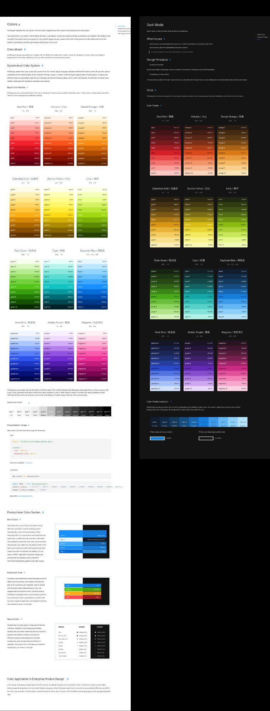
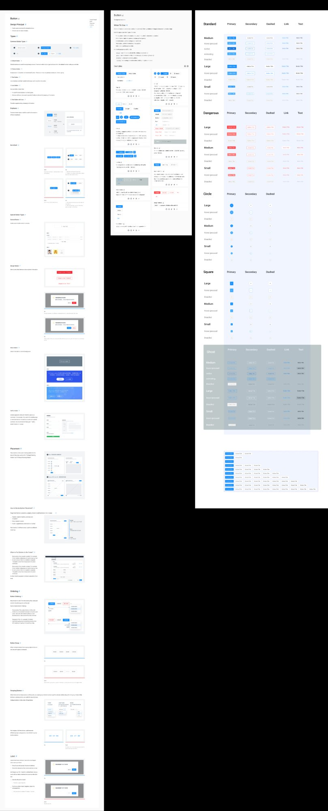
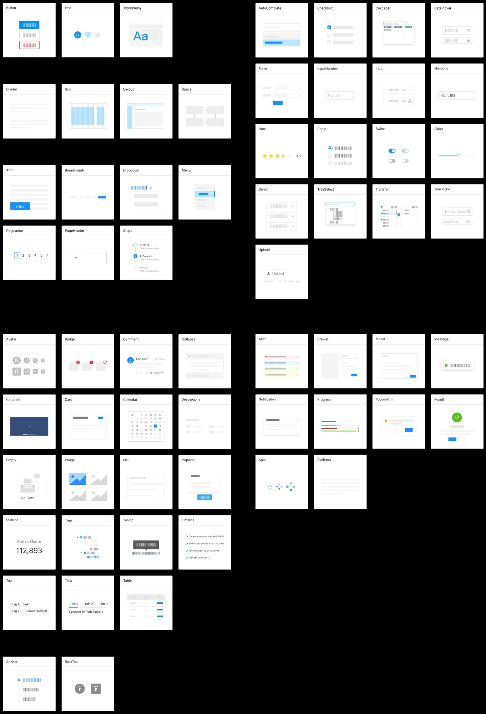

# ADOLF Base Design System

**На основе:** Ant Design Open Source (Figma Community)  
**Версия:** 5.0  
**Figma File ID:** QQPVCkjdkmV2UPHoqM1Jyn

---

## Содержимое

| Файл | Описание |
|------|----------|
| `ant-design-variables.css` | CSS-переменные для использования в стилях |
| `ant-design-tokens.json` | Design tokens в JSON для программного использования |
| `images/` | Визуальные референсы компонентов |

---

## Быстрый старт

```html
<link rel="stylesheet" href="base/ant-design-variables.css">
```

```css
.my-button {
  background: var(--ant-color-primary);
  border-radius: var(--ant-border-radius);
  padding: var(--ant-padding-sm) var(--ant-padding);
}
```

---

## Цветовая палитра

Ant Design использует систематическую палитру из 13 цветов, каждый с 10 оттенками (от светлого 1 до тёмного 10).



### Основные цвета

| Цвет | Основной (#6) | CSS-переменная |
|------|---------------|----------------|
| **Primary (Blue)** | `#1890ff` | `--ant-blue-6` |
| **Red** | `#f5222d` | `--ant-red-6` |
| **Volcano** | `#fa541c` | `--ant-volcano-6` |
| **Orange** | `#fa8c16` | `--ant-orange-6` |
| **Gold** | `#faad14` | `--ant-gold-6` |
| **Yellow** | `#fadb14` | `--ant-yellow-6` |
| **Lime** | `#a0d911` | `--ant-lime-6` |
| **Green** | `#52c41a` | `--ant-green-6` |
| **Cyan** | `#13c2c2` | `--ant-cyan-6` |
| **Geek Blue** | `#2f54eb` | `--ant-geekblue-6` |
| **Purple** | `#722ed1` | `--ant-purple-6` |
| **Magenta** | `#eb2f96` | `--ant-magenta-6` |
| **Gray** | `#8c8c8c` | `--ant-gray-6` |

### Семантические цвета

```css
--ant-color-primary: #1890ff;   /* Основной акцент */
--ant-color-success: #52c41a;   /* Успех */
--ant-color-warning: #faad14;   /* Предупреждение */
--ant-color-error: #f5222d;     /* Ошибка */
--ant-color-info: #1890ff;      /* Информация */
--ant-color-link: #1890ff;      /* Ссылки */
```

### Цвета текста

```css
--ant-color-text: rgba(0, 0, 0, 0.88);           /* Основной */
--ant-color-text-secondary: rgba(0, 0, 0, 0.65); /* Вторичный */
--ant-color-text-tertiary: rgba(0, 0, 0, 0.45);  /* Третичный */
--ant-color-text-quaternary: rgba(0, 0, 0, 0.25);/* Подсказки */
--ant-color-text-disabled: rgba(0, 0, 0, 0.25);  /* Отключенный */
```

### Цвета фона

```css
--ant-color-bg-container: #ffffff;              /* Контейнеры */
--ant-color-bg-elevated: #ffffff;               /* Приподнятые элементы */
--ant-color-bg-layout: #f5f5f5;                 /* Фон страницы */
--ant-color-bg-spotlight: rgba(0, 0, 0, 0.85);  /* Оверлеи */
--ant-color-bg-mask: rgba(0, 0, 0, 0.45);       /* Маски */
```

---

## Типографика



### Шрифты

```css
--ant-font-family: -apple-system, BlinkMacSystemFont, 'Segoe UI', Roboto, 'Helvetica Neue', Arial, 'Noto Sans', sans-serif;
--ant-font-family-code: 'SFMono-Regular', Consolas, 'Liberation Mono', Menlo, Courier, monospace;
```

### Размеры шрифтов

| Стиль | Размер | Вес | Line Height | CSS-переменная |
|-------|--------|-----|-------------|----------------|
| Display Large | 38px | 600 | 46px | `--ant-font-size-heading-1` |
| Display Medium | 30px | 600 | 38px | `--ant-font-size-heading-2` |
| Display Small | 24px | 600 | 32px | `--ant-font-size-heading-3` |
| Heading 4 | 20px | 600 | 28px | `--ant-font-size-heading-4` |
| Heading 5 | 16px | 600 | 24px | `--ant-font-size-heading-5` |
| Body Large | 16px | 400 | 24px | `--ant-font-size-lg` |
| Body Default | 14px | 400 | 22px | `--ant-font-size` |
| Body Small | 12px | 400 | 20px | `--ant-font-size-sm` |

---

## Отступы (Spacing)

| Токен | Размер | CSS-переменная |
|-------|--------|----------------|
| XXS | 4px | `--ant-padding-xxs` / `--ant-margin-xxs` |
| XS | 8px | `--ant-padding-xs` / `--ant-margin-xs` |
| SM | 12px | `--ant-padding-sm` / `--ant-margin-sm` |
| MD (default) | 16px | `--ant-padding` / `--ant-margin` |
| LG | 24px | `--ant-padding-lg` / `--ant-margin-lg` |
| XL | 32px | `--ant-padding-xl` / `--ant-margin-xl` |
| XXL | 48px | `--ant-margin-xxl` |

---

## Скругления (Border Radius)

| Токен | Размер | CSS-переменная |
|-------|--------|----------------|
| XS | 2px | `--ant-border-radius-xs` |
| SM | 4px | `--ant-border-radius-sm` |
| Default | 6px | `--ant-border-radius` |
| LG | 8px | `--ant-border-radius-lg` |

---

## Тени (Box Shadow)

```css
/* Hover / Primary */
--ant-box-shadow: 0 1px 2px 0 rgba(0,0,0,0.03), 
                  0 1px 6px -1px rgba(0,0,0,0.02), 
                  0 2px 4px 0 rgba(0,0,0,0.02);

/* Secondary / Default */
--ant-box-shadow-secondary: 0 6px 16px 0 rgba(0,0,0,0.08), 
                            0 3px 6px -4px rgba(0,0,0,0.12), 
                            0 9px 28px 8px rgba(0,0,0,0.05);
```

---

## Высота контролов

| Токен | Высота | CSS-переменная |
|-------|--------|----------------|
| XS | 24px | `--ant-control-height-xs` |
| SM | 24px | `--ant-control-height-sm` |
| Default | 32px | `--ant-control-height` |
| LG | 40px | `--ant-control-height-lg` |

---

## Анимации (Motion)

### Длительность

```css
--ant-motion-duration-fast: 0.1s;
--ant-motion-duration-mid: 0.2s;
--ant-motion-duration-slow: 0.3s;
```

### Easing функции

```css
--ant-motion-ease-in-out: cubic-bezier(0.645, 0.045, 0.355, 1);
--ant-motion-ease-out: cubic-bezier(0.215, 0.61, 0.355, 1);
--ant-motion-ease-in: cubic-bezier(0.55, 0.055, 0.675, 0.19);
--ant-motion-ease-out-back: cubic-bezier(0.12, 0.4, 0.29, 1.46);
```

---

## Компоненты



### General
Button, Icon, Typography

### Layout
Grid, Divider, Layout, Space

### Navigation
Breadcrumb, Dropdown, Menu, PageHeader, Pagination, Steps

### Data Entry
AutoComplete, Cascader, Checkbox, DatePicker, Form, Input, InputNumber, Radio, Rate, Select, Slider, Switch, TimePicker, Transfer, TreeSelect, Upload

### Data Display
Avatar, Badge, Calendar, Card, Carousel, Collapse, Comment, Descriptions, Empty, Image, List, Popover, Statistic, Table, Tabs, Tag, Timeline, Tooltip, Tree

### Feedback
Alert, Drawer, Message, Modal, Notification, Popconfirm, Progress, Result, Skeleton, Spin

---

## Тёмная тема

Для активации тёмной темы добавьте атрибут `data-theme="dark"` на body:

```html
<body data-theme="dark">
```

В тёмной теме автоматически меняются:
- Цвета текста (на светлые)
- Цвета фона (на тёмные)
- Цвета границ
- Цвета заливки

---

## Использование в проекте

### CSS

```css
.card {
  background: var(--ant-color-bg-container);
  border: 1px solid var(--ant-color-border);
  border-radius: var(--ant-border-radius-lg);
  padding: var(--ant-padding-lg);
  box-shadow: var(--ant-box-shadow);
}

.card:hover {
  box-shadow: var(--ant-box-shadow-secondary);
}
```

### JavaScript (tokens.json)

```javascript
import tokens from './ant-design-tokens.json';

const primaryColor = tokens.colors.primary["6"]; // #1890ff
const fontSize = tokens.typography.fontSize; // 14
```

---

## Ссылки

- [Ant Design](https://ant.design/)
- [Figma Community](https://www.figma.com/community/file/831698976089873405)
- [Design Tokens Documentation](https://ant.design/docs/react/customize-theme)
