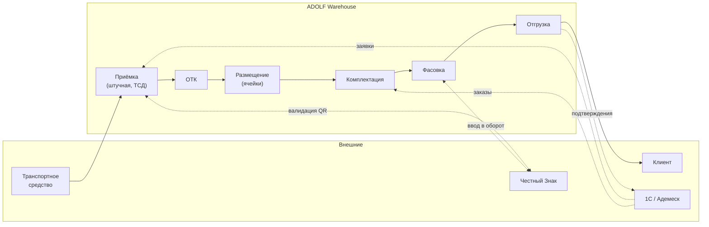

# ADOLF WAREHOUSE — Раздел 0: Введение

**Проект:** Управление физическим складом с поштучной маркировкой Честного Знака  
**Модуль:** Warehouse (Склад)  
**Версия:** 1.0 (черновик)  
**Дата:** Май 2026

---

## Назначение документа

Данный документ является введением в модуль ADOLF WAREHOUSE и содержит:
- Общее описание модуля
- Бизнес-цели и контекст
- Поддерживаемые процессы
- Структуру документации
- Краткий обзор функциональности

---

## Что такое ADOLF WAREHOUSE

ADOLF WAREHOUSE — функциональный модуль системы ADOLF, обеспечивающий автоматизированный учёт товаров на физическом складе компании ОХАНА МАРКЕТ с поштучной идентификацией каждой единицы по QR-кодам Честного Знака.

Заменяет текущую связку **Cleverence + Адемеск** на собственное решение, интегрированное со всей экосистемой ADOLF (Watcher, Reputation, Content Factory, CFO).

### Что важно знать про текущий контекст

- Компания продаёт одежду (Охана Маркет — взрослая, Охана Кидс — детская) с обязательной маркировкой Честного Знака
- Каждая единица товара имеет уникальный QR-код, внутри которого зашит общий GTIN артикула + размер/цвет
- Сейчас приёмка ведётся **пачками от поставщика** (КИТУ-коды), что приводит к проблемам — недостачи, дубликаты QR-кодов выявляются через месяцы
- Цель — **штучная приёмка через ТСД** для контроля качества данных на входе

### Ключевые сущности

| Термин | Описание |
|--------|----------|
| **GTIN** | Глобальный штрихкод (для РФ начинается с `04...`), привязан к артикулу + размеру + цвету |
| **QR-код Честного Знака** | Уникальный код единицы товара, внутри содержит GTIN + криптоключ |
| **КИТУ** | Код Идентификации Транспортной Упаковки — групповой код от поставщика, разбираемый при приёмке на индивидуальные QR |
| **ТСД** | Терминал Сбора Данных — телефон/планшет/«браслет» со сканером (Urovo, Атол, Pole — выбран Urovo) |
| **Адемеск** | Внешняя учётная система (1С-конфигурация), сейчас источник заявок и справочников |
| **ОТК** | Отдел Технического Контроля — зона на складе для проверки качества при приёмке |

---

## Бизнес-цели и метрики

| Цель | Описание | Метрика успеха |
|------|----------|----------------|
| Точность приёмки | Дубликаты и недостачи выявляются при приёмке, а не на готовом товаре | < 0.1% брака доходит до зоны хранения |
| Скорость работы ТСД | Мгновенный отклик при сканировании, даже на старых Android | < 100мс от скана до подтверждения на экране |
| Offline-устойчивость | Работа склада не зависит от интернета | 100% операций оффлайн с автосинком |
| Прозрачность движений | Полный аудит-трейл каждой единицы | Каждое движение логируется с user_id + ts |
| Скорость отгрузки | Сборка заказов клиентов | До 2 раз быстрее текущего темпа |

---

## Поддерживаемые процессы

| Процесс | Описание |
|---------|----------|
| **Приёмка** | Разгрузка ТС, штучная сверка с ГТД, проверка дубликатов QR, расформирование КИТУ, ввод в оборот |
| **ОТК** | Перемещение в зону Контроля, проверка на брак (фото/видео фиксация), списание/исправление, корректировка |
| **Размещение** | Развоз товара по ячейкам (динамическое или статичное размещение по правилу артикула) |
| **Внутрискладские** | Перемещения, пополнение зон отбора, подтверждение остатков ячейки, инициирование пересчётов |
| **Комплектация** | Отбор товара по заказам клиентов, перемещение в зону фасовки |
| **Фасовка** | Сборка финальной упаковки (сейф-пакеты/короба/мешки/КИТУ для клиента), наполнение QR-кодами |
| **Отгрузка** | Консолидация заказов, сверка с документами, погрузка в ТС |
| **Перемаркировка** | Запрос новых КИЗов в Честный Знак для повреждённых/дублированных кодов |
| **Инвентаризация** | Периодический пересчёт через ТСД, корректировки остатков |

---

## Структура документации

| Раздел | Содержание |
|--------|------------|
| **0. Введение** | Общий обзор (этот документ) |
| **1. Архитектура** | Компоненты, зависимости, интеграции |
| **2. ТСД** | Сканеры, оффлайн-режим, протоколы |
| **3. Workflow-процессы** | Детальное описание каждого процесса (приёмка, ОТК, ...) |
| **4. Open WebUI** | Интерфейс, страницы, тулзы и пермишены |
| **5. Database** | Схема БД (таблицы, индексы, аудит) |
| **6. Сценарии** | Пользовательские сценарии для каждой роли |
| **7. Celery** | Фоновые задачи (синк с 1С/ЧЗ, периодические алерты) |
| **8. 1С Integration** | Интеграция с Адемеск/1С |

---

## Роли и доступ

Модуль доступен от **Director+**. Простые сотрудники склада сейчас не входят в систему ADOLF — для них есть отдельный режим **«ТСД-страница»** (см. раздел 2), где не требуется аккаунт ADOLF, авторизация через ПИН-код или физический бейдж.

| Роль ADOLF | Описание | Доступ |
|------------|----------|--------|
| Director | Директор склада | Все процессы кроме настройки топологии |
| Administrator | Администратор системы | Полный доступ + конфигурация зон/ячеек/правил |
| ТСД-оператор (без ADOLF-аккаунта) | Кладовщик | Только ТСД-режим: сканирование под текущую задачу |

### Матрица доступа к функциям (default)

| Функция | Director | Admin |
|---------|:--------:|:-----:|
| Просмотр остатков | ✅ | ✅ |
| Создание приходов/отгрузок | ✅ | ✅ |
| ОТК-операции | ✅ | ✅ |
| Перемаркировка (запрос КИЗов в ЧЗ) | ✅ | ✅ |
| Инвентаризация | ✅ | ✅ |
| Управление зонами и ячейками | ❌ | ✅ |
| Конфигурация правил | ❌ | ✅ |
| Экспорт остатков | ✅ | ✅ |

---

## Источники данных

### Внешние системы

| Источник | Тип | Данные | Направление |
|----------|-----|--------|-------------|
| **1С / Адемеск** | REST API (через свой коннектор) | Номенклатура, GTIN-ы, заказы клиентов | Из 1С → в ADOLF |
| **Честный Знак** | REST API (через 1С прокси) | Запросы новых КИЗов, статус кодов | Двусторонний |
| **ТСД-устройства** | WebSocket / IndexedDB sync | События сканирования | Из ТСД → в ADOLF |
| **ГТД** | Excel/PDF загрузка | План приёмки | Из 1С → в ADOLF |

### Подтверждения наружу

| Получатель | Что отправляем |
|------------|----------------|
| 1С / Адемеск | Подтверждения приёмки, отгрузки, корректировки |
| Честный Знак | Ввод в оборот, вывод из оборота, перемаркировка |

---

## Поддерживаемое оборудование (ТСД)

| Производитель | Статус | Замечания |
|---------------|--------|-----------|
| **Urovo** (TC40 и аналоги) | ✅ Стандарт | Дороже, но не «дохнут» через 2 года |
| Атол (бюджетные) | ⚠️ Совместимы, но не рекомендуются | После 2 лет — проблемы со сканированием |
| Pole Smart / Pole Prime | ⚠️ Совместимы, не рекомендуются | Аналогично Атолу |
| Универсальный Android (Bluetooth-сканер) | ✅ Поддерживается | Для сценария «телефон + браслет-сканер» |

ТСД-страница работает в любом современном **Chromium** (минимум Android 8) с подключением сканера через **Web Serial API** или **WebHID API**. Альтернативно поддерживается ввод через системную HID-клавиатуру (когда сканер эмулирует ввод символов).

---

## Технологический стек

| Компонент | Технология |
|-----------|------------|
| Backend | FastAPI (Python 3.12) |
| Database | PostgreSQL 15 |
| ТСД-frontend | SvelteKit, IndexedDB (Dexie.js), Service Worker |
| Sync | WebSocket + REST fallback |
| AI (валидация) | Claude Opus (для сложных кейсов брака) |
| Scanner integration | Web Serial API, WebHID API |

---

## Зависимости от ADOLF Core

| Компонент Core | Использование |
|----------------|---------------|
| Middleware | Авторизация Director/Admin, фильтрация по бренду |
| ETL | Загрузка ГТД из Excel |
| PostgreSQL | Хранение всех таблиц склада |
| Celery | Синхронизация с 1С (ежечасно), периодическая инвентаризация |
| Redis | Кэш справочников, очередь синков |
| Notifications | Алерты директору при критичных событиях (большая недостача, авария ТСД) |

---

## Зависимости от других модулей

| Модуль | Использование |
|--------|---------------|
| **CFO** | Получает данные о движениях для расчёта COGS и оборачиваемости |
| Watcher | Не используется напрямую, но артикулы и GTIN-ы пересекаются |
| Reputation | Не используется |
| Content Factory | В перспективе — учёт остатков для приоритизации генерации контента |

---

## Функционал v2.0+ (планы)

| Функция | Описание |
|---------|----------|
| Прогноз движений | Предсказание спроса на основе истории отгрузок |
| Автозаявки в Адемеск | Автоматический запрос пополнения от поставщика при достижении пороговых остатков |
| Видеоархив ОТК | Сохранение видео-фиксации брака с распознаванием объектов |
| Маршрутизация комплектации | Оптимальный путь по складу для отбора заказа |
| Голосовое управление ТСД | Hands-free режим для кладовщика |

---

## Workflow модуля (high-level)

---

## Контакты

| Вопрос | Ответственный |
|--------|---------------|
| Бизнес-процессы склада | Директор склада |
| Техническая поддержка ТСД | Administrator |
| Интеграция с 1С | Administrator + 1С-разработчик |
| Honest Sign / Честный Знак | Administrator |

---

**Документ подготовлен:** Май 2026  
**Версия:** 1.0 (черновик)  
**Статус:** Драфт, дописывается итеративно
