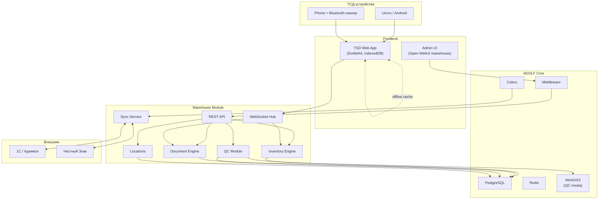
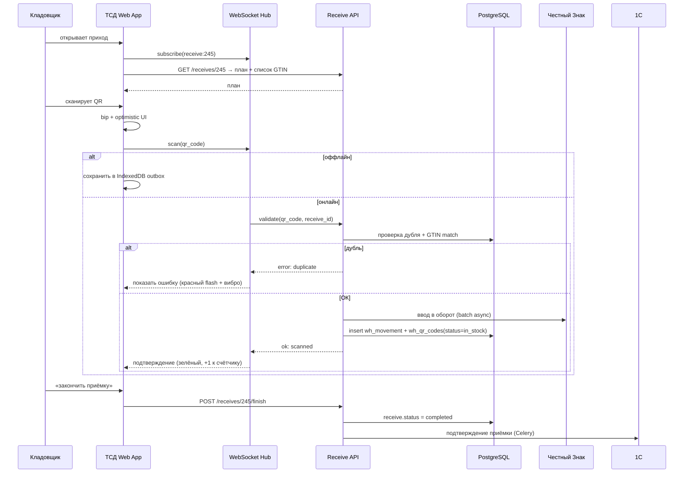
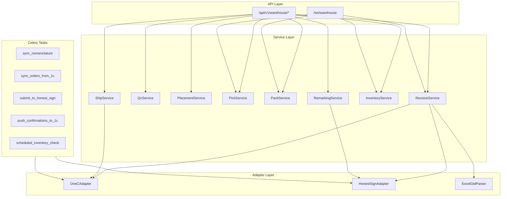
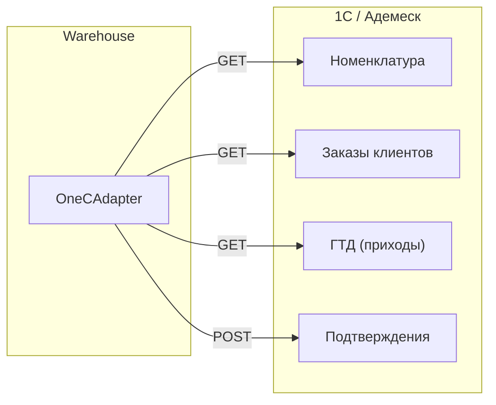
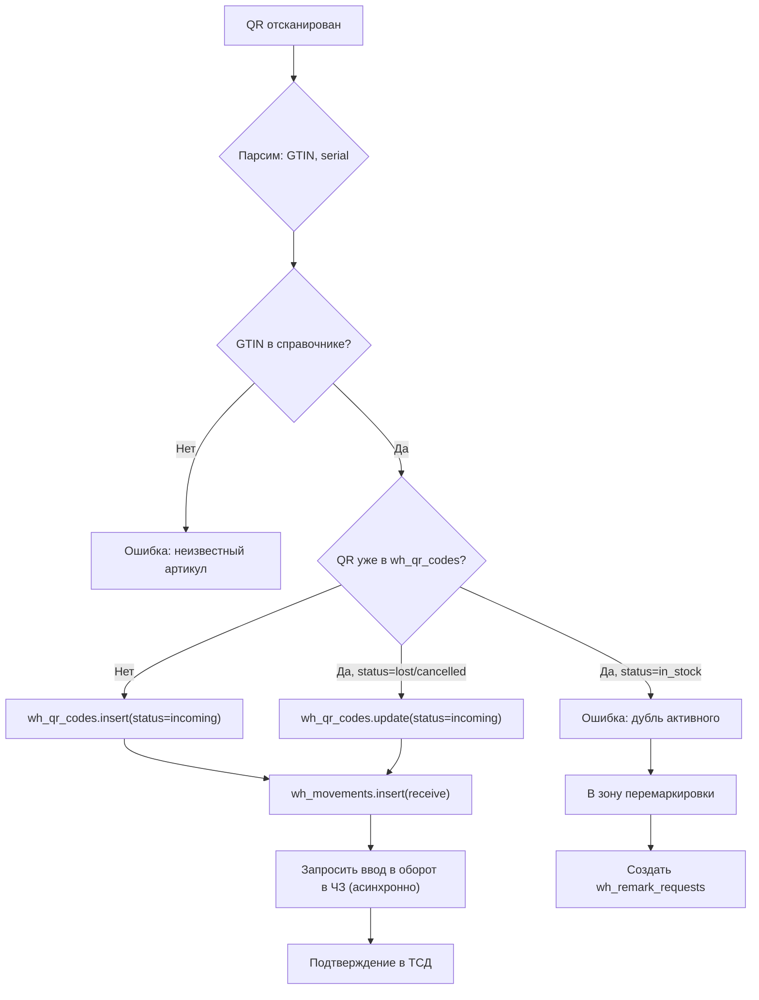

# ADOLF WAREHOUSE — Раздел 1: Архитектура

**Проект:** Управление физическим складом  
**Модуль:** Warehouse  
**Версия:** 1.0 (черновик)  
**Дата:** Май 2026

---

## 1.1 Назначение модуля

Warehouse — модуль управления физическим складом с поштучной маркировкой Честного Знака. Заменяет связку Cleverence + Адемеск на собственное решение в экосистеме ADOLF.

### Основные функции

| Функция | Описание |
|---------|----------|
| Tracking | Поштучный учёт каждой единицы товара по QR-коду ЧЗ |
| Receiving | Приёмка с валидацией дубликатов и сверкой с ГТД |
| QC | ОТК-проверка с фото/видео фиксацией |
| Locations | Управление зонами и ячейками (статичные/динамические) |
| Picking & Packing | Комплектация заказов и фасовка |
| Shipping | Отгрузка с консолидацией и сверкой |
| Inventory | Инвентаризация и корректировки |
| Sync | Двусторонний синк с 1С/Адемеск и Честным Знаком |
| TSD | Mobile-first интерфейс для кладовщиков, offline-first |

### Целевые пользователи

| Роль | Основные задачи |
|------|-----------------|
| Director | Контроль процессов, разбор инцидентов, отчёты |
| Administrator | Настройка топологии склада, ролей, интеграций |
| ТСД-оператор (кладовщик) | Сканирование позиций при приёмке/отгрузке/перемещении |

---

## 1.2 Границы модуля

### Входит в модуль Warehouse

| Компонент | Описание |
|-----------|----------|
| TSD Web App | SvelteKit-страница для сканирования (offline-first) |
| Sync Service | Синхронизация ТСД ↔ Backend через WebSocket + REST fallback |
| Honest Sign Adapter | Запросы в Честный Знак (через 1С или напрямую) |
| 1C Adapter | Получение справочников/заказов, отправка подтверждений |
| Inventory Engine | Расчёт текущих остатков, резервов, движений |
| Document Engine | Создание приходов, отгрузок, инвентаризаций |
| QC Module | Хранение фото/видео брака, статусы инспекции |
| Locations Manager | CRUD зон/ячеек, привязки к артикулам |
| REST API | Endpoints для управления |
| Open WebUI Pages | UI для Director/Admin |

### Не входит в модуль Warehouse

| Компонент | Где реализовано |
|-----------|-----------------|
| Авторизация ADOLF-аккаунтов | ADOLF Core (Middleware) |
| Финансовый учёт (COGS, маржа) | ADOLF CFO (получает данные) |
| Хранение справочника номенклатуры | ADOLF Core / 1C (синхронизируется) |
| Маркетплейс-операции (продажи на WB/Ozon/YM) | ADOLF Core |
| Управление поставщиками | 1С |

### Функционал v2.0+ (не входит в MVP)

| Компонент | Описание |
|-----------|----------|
| Predictive Restocking | ML-прогноз пополнения на основе истории |
| Voice TSD | Голосовое управление кладовщиком |
| Computer Vision QC | Авто-обнаружение брака по фото |
| Pick-Path Optimization | Оптимальный маршрут по складу |
| Multi-warehouse | Несколько физических локаций |

---

## 1.3 Архитектура модуля

### 1.3.1 Общая схема

### 1.3.2 Поток данных при штучной приёмке

### 1.3.3 Компонентная диаграмма

---

## 1.4 Зависимости от ADOLF Core

### 1.4.1 Middleware

| Возможность | Применение |
|-------------|------------|
| Авторизация | Проверка `role IN (director, admin)` |
| Идентификация | `user_id` для аудита движений |
| Роутинг | Регистрация `/api/v1/warehouse/*` |
| ТСД-аутентификация | Отдельный механизм (PIN-код кладовщика) |

### 1.4.2 PostgreSQL

Используемые таблицы (детальная схема — раздел 5):

| Таблица | Назначение |
|---------|------------|
| `wh_items` | Справочник номенклатуры (синк из 1С) |
| `wh_qr_codes` | Все QR-коды ЧЗ с состоянием (in_stock / sold / lost / duplicate) |
| `wh_locations` | Зоны и ячейки склада |
| `wh_stock` | Остатки по ячейкам (агрегаты для быстрого доступа) |
| `wh_documents` | Приходы / отгрузки / инвентаризации |
| `wh_doc_items` | Позиции документов (план-факт) |
| `wh_movements` | Аудит-журнал всех движений (immutable) |
| `wh_qc_reports` | Отчёты ОТК с фото/видео |
| `wh_inventory_tasks` | Задания на пересчёт ячеек |
| `wh_remark_requests` | Запросы на перемаркировку в ЧЗ |
| `wh_tsd_operators` | Учётки кладовщиков (без доступа к ADOLF, ПИН-код) |

### 1.4.3 Celery

| Задача | Описание | Расписание |
|--------|----------|------------|
| `wh.sync_nomenclature` | Подтянуть новую номенклатуру из 1С | Каждый час |
| `wh.sync_orders_from_1c` | Получить новые заказы клиентов | Каждые 15 мин |
| `wh.submit_to_honest_sign` | Отправить накопленные операции в ЧЗ | Каждые 5 мин |
| `wh.push_confirmations_to_1c` | Подтверждения приёмки/отгрузки в 1С | После каждого закрытия документа |
| `wh.scheduled_inventory_check` | Создать задания на пересчёт ячеек по графику | Раз в неделю |
| `wh.cleanup_old_qc_media` | Удалить старые фото ОТК | Раз в месяц |

### 1.4.4 Redis

| Использование | Описание |
|---------------|----------|
| Кэш справочника номенклатуры | По GTIN → артикул/размер/цвет (быстрый lookup при скане) |
| Очередь WebSocket-сообщений | Pub/Sub между процессами |
| Распределённые блокировки | Чтобы два кладовщика не открыли один приход |

### 1.4.5 Notifications

| Событие | Уровень | Получатели |
|---------|---------|------------|
| `wh.duplicate_qr` | warning | Director |
| `wh.large_shortage` | critical | Director + Admin |
| `wh.qc_defect_reported` | info | Director |
| `wh.tsd_offline_for_long` | warning | Admin |
| `wh.honest_sign_error` | critical | Admin |
| `wh.1c_sync_failed` | critical | Admin |

---

## 1.5 Внешние интеграции

### 1.5.1 1С / Адемеск

API-связка с 1С через REST (детали в разделе 8).

### 1.5.2 Честный Знак

| Операция | Назначение |
|----------|------------|
| `validate_code` | Проверка существования и статуса QR при приёмке |
| `enter_into_circulation` | Ввод в оборот при приёмке |
| `withdraw` | Вывод из оборота при списании |
| `request_remarking_codes` | Запрос новых КИЗов на перемаркировку |
| `confirm_shipment` | Подтверждение отгрузки конечному покупателю |

Связка с Честным Знаком идёт **через 1С-прокси** (1С хранит токены и сертификаты), либо напрямую с ИНН/токеном Охана Маркет (выбор — раздел 8).

---

## 1.6 Компоненты модуля

### 1.6.1 ReceiveService — приёмка

**Назначение:** обработка штучной приёмки с валидацией дубликатов.

**Алгоритм при сканировании QR:**

### 1.6.2 QcService — отдел контроля качества

**Назначение:** хранение результатов проверки качества.

| Поле в `wh_qc_reports` | Описание |
|------------------------|----------|
| `defect_type` | brak / mismatch_label / wrong_size / no_qr / other |
| `severity` | critical (списать) / minor (исправить) / cosmetic (продать со скидкой) |
| `photos` | Массив URL в S3 |
| `video` | Опциональное видео |
| `inspector_id` | Кто проверил |
| `action_taken` | written_off / fixed / returned_to_supplier |

### 1.6.3 PlacementService — размещение

**Назначение:** перемещение товара из ОТК в ячейки хранения.

Поддерживается **два режима размещения**:
- **Динамический:** ТСД подсказывает ближайшую свободную ячейку. Простой, не требует настройки.
- **Статичный (правило артикула):** ТСД жёстко требует положить артикул в назначенную ячейку. Точнее, но требует поддерживать правила в актуальном состоянии.

Конфигурация в `wh_settings.placement_mode` ∈ `{dynamic, static, hybrid}`.

### 1.6.4 PickService — комплектация

**Назначение:** отбор товаров под заказы клиентов.

Логика:
1. Заказ синхронизируется из 1С
2. PickService разбивает заказ на «маршрутный лист» — список ячеек с количествами
3. Кладовщик через ТСД сканирует каждую единицу при сборке
4. После сборки — переход в фасовку

### 1.6.5 PackService — фасовка

**Назначение:** формирование финальной упаковки для клиента.

Поддерживаемые упаковки:
- Сейф-пакет
- Короб
- Мешок
- КИТУ (групповая упаковка для крупных клиентов)

Каждая единица сканируется в момент укладки в упаковку (вариант А — см. раздел 6 Сценарии). Параллельно собираются QR-коды для финального ЧЗ-подтверждения.

### 1.6.6 ShipService — отгрузка

**Назначение:** передача товара перевозчику.

Сверка с документами на отгрузку, погрузка, фиксация события «передано перевозчику» с подписью/ID транспорта.

### 1.6.7 InventoryService — инвентаризация

**Назначение:** периодический пересчёт остатков.

| Тип инвентаризации | Описание |
|--------------------|----------|
| Полная | Закрытие склада, пересчёт всего |
| Циклическая (по ячейкам) | Каждую неделю — пересчёт N ячеек по графику |
| По требованию | При выявлении расхождения в одной ячейке |

### 1.6.8 RemarkingService — перемаркировка

**Назначение:** запрос новых КИЗов в ЧЗ для повреждённых/дублированных кодов.

Workflow:
1. Кладовщик при приёмке/инвентаризации помечает QR как «нужна перемаркировка»
2. Создаётся `wh_remark_requests` с артикулом + количеством
3. Director или автоматически — запрос в Честный Знак (батч на N кодов)
4. Полученные QR-коды печатаются и клеятся (отдельный процесс печати)

---

## 1.7 Настройки модуля

### 1.7.1 Environment Variables

| Переменная | Описание | Пример |
|------------|----------|--------|
| `WH_ONEC_API_URL` | URL API 1С/Адемеск | `https://1c.adolf.local/api` |
| `WH_ONEC_TOKEN` | Токен авторизации в 1С | `Bearer ...` |
| `WH_HONEST_SIGN_MODE` | `direct` или `via_1c` | `via_1c` |
| `WH_HONEST_SIGN_TOKEN` | Токен ЧЗ (если direct) | `...` |
| `WH_QC_MEDIA_BUCKET` | MinIO/S3 bucket для фото ОТК | `wh-qc-media` |
| `WH_TSD_PIN_LENGTH` | Длина ПИН-кода кладовщика | `4` |

### 1.7.2 Настройки в БД (`wh_settings`)

| Ключ | Тип | Описание | Default |
|------|-----|----------|---------|
| `placement_mode` | enum | dynamic / static / hybrid | `dynamic` |
| `receive_mode` | enum | per_unit / per_pack | `per_unit` |
| `auto_remark_threshold` | int | После N дублей — авто-запрос перемаркировки | `5` |
| `tsd_idle_timeout_min` | int | Авто-выход с ТСД после простоя | `30` |
| `low_stock_threshold` | int | Минимум перед алертом | `10` |
| `inventory_cycle_days` | int | Период циклической инвентаризации | `30` |

---

## 1.8 Технические ограничения

| Параметр | Ограничение |
|----------|-------------|
| Параллельная работа ТСД | До 25 устройств одновременно (target) |
| Скорость скана на ТСД | < 100 мс от скана до подтверждения |
| Размер outbox в IndexedDB | 10 000 событий (после — sync обязателен) |
| Хранение QC-фото | 12 месяцев (потом архив) |
| Audit-лог движений | Бессрочно |

---

## 1.9 Безопасность

| Мера | Реализация |
|------|------------|
| Авторизация ADOLF UI | Middleware: role IN (director, admin) |
| Авторизация ТСД | ПИН-код кладовщика + IP-allowlist (склад только) |
| Аудит | Все движения логируются в `wh_movements` (immutable) |
| Подписи фото ОТК | EXIF + hash при загрузке (защита от подмены) |
| Шифрование секретов | API-ключи 1С/ЧЗ в Vault |

---

**Документ подготовлен:** Май 2026  
**Версия:** 1.0 (черновик)  
**Статус:** Драфт, дописывается итеративно
