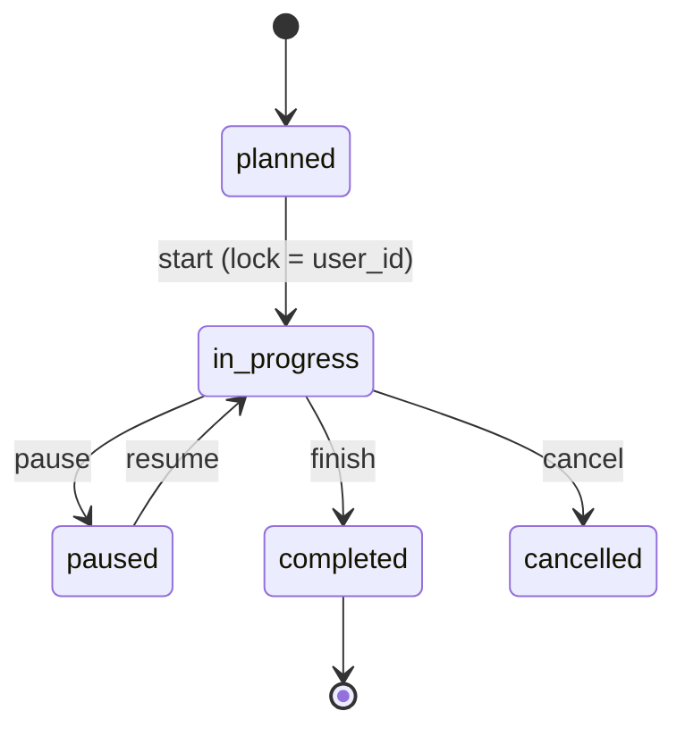

# ADOLF WAREHOUSE — Раздел 3: Workflow-процессы

**Проект:** Управление физическим складом  
**Модуль:** Warehouse  
**Версия:** 1.0 (черновик)  
**Дата:** Май 2026

---

## 3.1 Назначение

Раздел детально описывает каждый бизнес-процесс склада: что входит, что выходит, переходы статусов, обработка edge-cases.

В отличие от раздела 6 (Сценарии), здесь — формальная спецификация для разработчиков и интеграторов.

---

## 3.2 Карта процессов

```mermaid
stateDiagram-v2
    direction LR

    [*] --> ReceivePlanned: Заявка из 1С
    ReceivePlanned --> ReceiveInProgress: Старт приёмки
    ReceiveInProgress --> ReceiveCompleted: Завершение
    ReceiveCompleted --> QcInProgress: Партия в ОТК
    QcInProgress --> QcDone: Решение по браку
    QcDone --> Placed: Размещение
    Placed --> Stored: На хранении

    Stored --> Picking: Заказ клиента
    Picking --> Packing: Скомплектовано
    Packing --> Shipping: Запаковано
    Shipping --> [*]: Передан перевозчику

    Stored --> Inventory: Инвентаризация
    Inventory --> Stored: Подтверждено
    Inventory --> Adjustment: Расхождение
    Adjustment --> Stored

    QcDone --> Remarking: Дубль/брак QR
    Remarking --> Placed: Получены новые QR
```

---

## 3.3 Приёмка (Receiving)

### Статусы документа `wh_documents` типа `receive`

| Статус | Описание |
|--------|----------|
| `planned` | Создан из 1С/ГТД, ждёт начала |
| `in_progress` | Кладовщик начал сканирование |
| `paused` | Временно приостановлен |
| `completed` | Все позиции отсканированы или подтверждена недостача |
| `cancelled` | Отменён |

### Переходы

### Структура `wh_doc_items` для прихода

| Поле | Описание |
|------|----------|
| `doc_id` | FK на wh_documents |
| `item_id` | FK на wh_items (артикул) |
| `gtin` | GTIN |
| `planned_qty` | Сколько ожидаем |
| `fact_qty` | Сколько отсканировано |
| `duplicate_qty` | Сколько дубликатов |
| `unknown_qty` | Сканы вне плана поставки |

### Обработка дубликатов

См. раздел 6.2.4 → При дубле создаётся `wh_remark_requests` со статусом `pending` для последующего запроса перемаркировки.

---

## 3.4 ОТК (Quality Control)

### Методы проверки

| Метод | Описание |
|-------|----------|
| Сплошной (full) | Каждая единица проверяется |
| Выборочный (sample) | N штук случайно по правилу |
| По требованию | При возврате клиента |

### Правила выборки

В `wh_settings.qc_sample_rule` хранится JSON с правилами:
- По бренду
- По поставщику
- По уровню риска (если в истории были браки)

Пример: `{"brand=ohana_market": "sample:5%", "brand=ohana_kids_supplier=ABC": "sample:15%"}`.

### Решения по браку

См. раздел 6.3.2.

---

## 3.5 Размещение (Placement)

Два режима — `dynamic` и `static`. Подробности в Architecture (1.6.3).

### Логика выбора ячейки в dynamic-режиме

1. Ищем ячейки в той же зоне что и предыдущая партия этого артикула (для группировки)
2. Если нет — ищем свободные ячейки нужного типа (storage)
3. Сортируем по близости к зоне ОТК (минимизация перемещения)
4. Подсказываем верхнюю → кладовщик подтверждает или выбирает другую

---

## 3.6 Внутрискладские перемещения

Любое перемещение между ячейками (без выхода со склада):
- Из storage в picking-zone (пополнение)
- Из storage в storage (реорганизация)
- Из picking в picking (между зонами отбора)

### Обязательные поля движения

`wh_movements`: `qr_code, item_id, from_location, to_location, user_id, ts, reason`

---

## 3.7 Комплектация (Picking)

### Алгоритм построения маршрута

1. Группируем позиции по зонам/стеллажам
2. Сортируем по физическому пути (TSP-подобная задача, упрощённо — left-to-right zigzag)
3. Выдаём кладовщику пошагово

### Резервирование

При создании задания на сборку — резервируем `wh_stock.reserved += qty`. При сборке двигаем в picking-basket. При отгрузке — `qty -= , reserved -=`.

---

## 3.8 Фасовка (Packing)

### Типы упаковки

| Тип | Использование |
|-----|---------------|
| `safe_pack` | Сейф-пакет — для конечного клиента (мелкий заказ) |
| `box` | Короб — крупные заказы |
| `bag` | Мешок — оптовые отгрузки |
| `kitu` | КИТУ — групповая для крупных партнёров |

### Агрегация в Честном Знаке

Для `kitu` отправляется агрегат «КИТУ → дочерние QR». Это нужно для правильного учёта в гос. системе.

---

## 3.9 Отгрузка (Shipping)

### Маршруты

`wh_shipping_routes`:
- ID маршрута
- Перевозчик
- ТС (марка + номер)
- Список заказов
- Дата отгрузки

При сканировании пакета на этапе погрузки в ТС:
- `wh_movements(to=route_X)`
- Подтверждение в 1С (отгрузка зафиксирована)
- Подтверждение в ЧЗ (вывод из оборота — для сейф-пакетов конечному клиенту)

---

## 3.10 Инвентаризация (Inventory)

### Типы

См. раздел 1.6.7 (полная / циклическая / по требованию).

### Алгоритм циклической

Раз в `wh_settings.inventory_cycle_days` дней Celery-задача выбирает N ячеек (приоритет: давно не проверялись + высокая активность) и создаёт `wh_inventory_tasks` для них.

### Обработка расхождений

| Расхождение | Действие |
|-------------|----------|
| Факт > План (нашли) | `adjustment +`, причина = "found_during_inventory" |
| Факт < План (потеряно) | `adjustment -`, причина = "missing_during_inventory", алерт директору |
| Чужой QR в ячейке | Перемещение в правильную ячейку или в зону «разбора» |

---

## 3.11 Перемаркировка (Remarking)

См. раздел 1.6.8 + 6.9.1.

### Процесс получения новых КИЗов

1. Director выбирает накопленные `wh_remark_requests` (батч N кодов)
2. Запрос в Честный Знак (`POST /codes/request_remarking`)
3. ЧЗ возвращает массив новых QR
4. Печать (через службу печати — в перспективе)
5. Кладовщик клеит → сканирует «новый QR заменяет старый» → `wh_qr_codes.update(replaced_by=...)`

---

## 3.12 Возвраты от клиента

(В v1.1 — детальная проработка)

Базовая логика: пакет возвращается → сканируем код пакета → видим список QR → каждую единицу проверяем (ОТК) → решение (вернуть в продажу / в брак / в перемаркировку).

---

**Дописать:** конкретные state machine code, формулы расчёта стандартного времени операции, KPI каждого процесса, edge cases возврата с маркетплейса.
