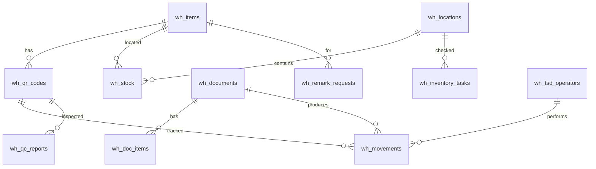

# ADOLF WAREHOUSE — Раздел 5: Database

**Проект:** Управление физическим складом  
**Модуль:** Warehouse  
**Версия:** 1.0 (черновик)  
**Дата:** Май 2026

---

## 5.1 Общая схема



---

## 5.2 Таблицы

### 5.2.1 `wh_items` — Справочник номенклатуры

Синхронизируется из 1С/Адемеск. Read-only из ADOLF (только синк).

| Поле | Тип | Описание |
|------|-----|----------|
| `id` | UUID | PK |
| `external_id` | TEXT | ID в 1С |
| `sku` | TEXT | Артикул (OM-1024) |
| `name` | TEXT | Название |
| `gtin` | TEXT | GTIN (общий для всех QR этого артикула/размера/цвета) |
| `size` | TEXT | Размер |
| `color` | TEXT | Цвет |
| `brand` | TEXT | ohana_market / ohana_kids |
| `category` | TEXT | Платья / Блузки / ... |
| `unit_weight_g` | INT | Вес единицы (для отгрузок) |
| `created_at`, `updated_at` | TIMESTAMP | |

**Индексы:** `gtin` (unique), `sku`, `external_id`.

### 5.2.2 `wh_qr_codes` — QR-коды Честного Знака

Каждая физическая единица товара = одна строка.

| Поле | Тип | Описание |
|------|-----|----------|
| `code` | TEXT | PK, полный QR-код ЧЗ |
| `item_id` | UUID | FK на wh_items |
| `gtin` | TEXT | Денормализация для быстрого lookup |
| `serial` | TEXT | Серийная часть кода |
| `status` | ENUM | `incoming / in_stock / picked / packed / shipped / sold / returned / lost / defect / written_off / replaced / duplicate` |
| `current_location_id` | UUID | FK на wh_locations (где сейчас) |
| `replaced_by` | TEXT | Если был заменён через перемаркировку — ссылка на новый QR |
| `cs_circulation_state` | ENUM | Статус в Честном Знаке: `unknown / pending / introduced / withdrawn` |
| `created_at`, `updated_at` | TIMESTAMP | |

**Индексы:** `code` (PK), `item_id`, `status`, `current_location_id`.

### 5.2.3 `wh_locations` — Зоны и ячейки

| Поле | Тип | Описание |
|------|-----|----------|
| `id` | UUID | PK |
| `code` | TEXT | A-12-3 / B-04 / etc. (unique) |
| `parent_id` | UUID | Иерархия (зона → стеллаж → ячейка) |
| `type` | ENUM | `zone / rack / cell / picking / packing / qc / receive / ship / staging` |
| `capacity_units` | INT | Сколько единиц помещается (опционально) |
| `current_qty` | INT | Текущее заполнение (агрегат из wh_stock) |
| `is_active` | BOOL | |
| `metadata` | JSONB | Произвольные поля (координаты на схеме склада, температура и т.п.) |

**Индексы:** `code` (unique), `parent_id`, `type`.

### 5.2.4 `wh_stock` — Остатки (агрегат)

Денормализованная таблица для быстрого ответа «сколько в ячейке X». Поддерживается триггерами при движениях.

| Поле | Тип | Описание |
|------|-----|----------|
| `item_id` | UUID | FK |
| `location_id` | UUID | FK |
| `qty` | INT | Текущее количество |
| `reserved` | INT | Зарезервировано под заказы |
| `last_changed` | TIMESTAMP | |

**PK:** `(item_id, location_id)`.

### 5.2.5 `wh_documents` — Документы

Все приходы/отгрузки/инвентаризации.

| Поле | Тип | Описание |
|------|-----|----------|
| `id` | UUID | PK |
| `external_id` | TEXT | ID в 1С (если есть) |
| `type` | ENUM | `receive / ship / move / inventory / remarking` |
| `status` | ENUM | `planned / in_progress / paused / completed / cancelled` |
| `counterparty` | TEXT | Поставщик / клиент |
| `reference` | TEXT | Номер ГТД, накладной и т.п. |
| `lock_user_id` | UUID | Кто сейчас работает с документом |
| `started_at`, `completed_at` | TIMESTAMP | |
| `metadata` | JSONB | |

**Индексы:** `type, status`, `external_id`, `lock_user_id`.

### 5.2.6 `wh_doc_items` — Позиции документов

| Поле | Тип | Описание |
|------|-----|----------|
| `doc_id` | UUID | FK |
| `item_id` | UUID | FK |
| `gtin` | TEXT | |
| `planned_qty` | INT | |
| `fact_qty` | INT | |
| `duplicate_qty` | INT | |
| `unknown_qty` | INT | |

**PK:** `(doc_id, item_id)`.

### 5.2.7 `wh_movements` — Аудит-журнал

Append-only. Никаких UPDATE/DELETE.

| Поле | Тип | Описание |
|------|-----|----------|
| `id` | UUID | PK |
| `qr_code` | TEXT | Может быть NULL для агрегатных движений |
| `item_id` | UUID | |
| `from_location_id` | UUID | NULL если поступление |
| `to_location_id` | UUID | NULL если выбытие |
| `doc_id` | UUID | FK на wh_documents |
| `user_id` | UUID | ADOLF user_id или wh_tsd_operators.id |
| `user_kind` | ENUM | `adolf_user / tsd_operator / system` |
| `action` | TEXT | receive / move / pick / pack / ship / write_off / found / etc |
| `qty` | INT | Для агрегатных (без QR) |
| `reason` | TEXT | Опционально (например "found_during_inventory") |
| `ts` | TIMESTAMP | |

**Индексы:** `qr_code, ts`, `item_id, ts`, `doc_id`, `user_id`.

### 5.2.8 `wh_qc_reports` — Отчёты ОТК

| Поле | Тип | Описание |
|------|-----|----------|
| `id` | UUID | PK |
| `qr_code` | TEXT | NULL если выборка по партии без скана конкретной |
| `item_id` | UUID | |
| `doc_id` | UUID | Связан с приходом, инспектируемым |
| `defect_type` | ENUM | `none / brak_factory / mismatch_label / wrong_size / no_qr / damaged_packaging / other` |
| `severity` | ENUM | `critical / minor / cosmetic` |
| `action_taken` | ENUM | `none / written_off / fixed / returned_to_supplier / discounted` |
| `inspector_id` | UUID | Кто проверял |
| `photos` | TEXT[] | URL в S3/MinIO |
| `video` | TEXT | Опциональное видео |
| `notes` | TEXT | Комментарий |
| `ts` | TIMESTAMP | |

### 5.2.9 `wh_inventory_tasks` — Задания на инвентаризацию

| Поле | Тип | Описание |
|------|-----|----------|
| `id` | UUID | PK |
| `location_id` | UUID | |
| `kind` | ENUM | `full / cyclic / on_demand` |
| `planned_at` | DATE | |
| `started_at`, `completed_at` | TIMESTAMP | |
| `assigned_to` | UUID | tsd_operator_id |
| `status` | ENUM | `planned / in_progress / completed` |
| `planned_qty` | INT | Что было до инвентаризации (по wh_stock) |
| `fact_qty` | INT | Что реально пересчитано |
| `delta` | INT | fact - planned |

### 5.2.10 `wh_remark_requests` — Запросы перемаркировки

| Поле | Тип | Описание |
|------|-----|----------|
| `id` | UUID | PK |
| `item_id` | UUID | |
| `original_qr_codes` | TEXT[] | Какие коды нужно перемаркировать |
| `qty` | INT | Сколько новых нужно |
| `status` | ENUM | `pending / submitted / received / printed / applied / cancelled` |
| `cs_request_id` | TEXT | ID в Честном Знаке |
| `new_qr_codes` | TEXT[] | Полученные новые коды |
| `requested_by` | UUID | |
| `requested_at`, `received_at`, `applied_at` | TIMESTAMP | |

### 5.2.11 `wh_tsd_operators` — Кладовщики

| Поле | Тип | Описание |
|------|-----|----------|
| `id` | UUID | PK |
| `name` | TEXT | |
| `pin_hash` | TEXT | bcrypt от ПИН-кода |
| `is_active` | BOOL | |
| `last_login_at` | TIMESTAMP | |
| `created_at` | TIMESTAMP | |

### 5.2.12 `wh_settings` — Настройки модуля

Key-value:

| key | value (JSON) |
|-----|--------------|
| `placement_mode` | `"dynamic"` |
| `receive_mode` | `"per_unit"` |
| `auto_remark_threshold` | `5` |
| `tsd_idle_timeout_min` | `30` |
| `qc_sample_rule` | `{"default": "sample:5%"}` |
| `inventory_cycle_days` | `30` |

---

## 5.3 Триггеры

### 5.3.1 Update wh_stock from wh_movements

После каждого INSERT в `wh_movements` — пересчёт `wh_stock`:

```sql
-- псевдокод
ON INSERT wh_movements
  IF from_location_id IS NOT NULL:
    wh_stock(item_id, from_location_id).qty -= 1
  IF to_location_id IS NOT NULL:
    wh_stock(item_id, to_location_id).qty += 1
```

### 5.3.2 Update wh_qr_codes.current_location_id

То же — при движении синхронизируем `current_location_id`.

---

## 5.4 Вьюхи

### 5.4.1 `wh_v_low_stock`

Артикулы с остатком ниже порога:

```sql
SELECT i.*, COALESCE(SUM(s.qty), 0) - COALESCE(SUM(s.reserved), 0) AS available
FROM wh_items i
LEFT JOIN wh_stock s ON s.item_id = i.id
GROUP BY i.id
HAVING COALESCE(SUM(s.qty), 0) - COALESCE(SUM(s.reserved), 0) < (SELECT (value::int) FROM wh_settings WHERE key = 'low_stock_threshold');
```

---

## 5.5 Migrations

Будут жить в `backend/open_webui/internal/migrations/peewee_migrate/` (или alembic, по существующему паттерну ADOLF).

---

**Дописать:** все индексы под реальные запросы, процедуры разрешения конфликтов синка, sharding/partitioning для wh_movements (большие объёмы за годы).
