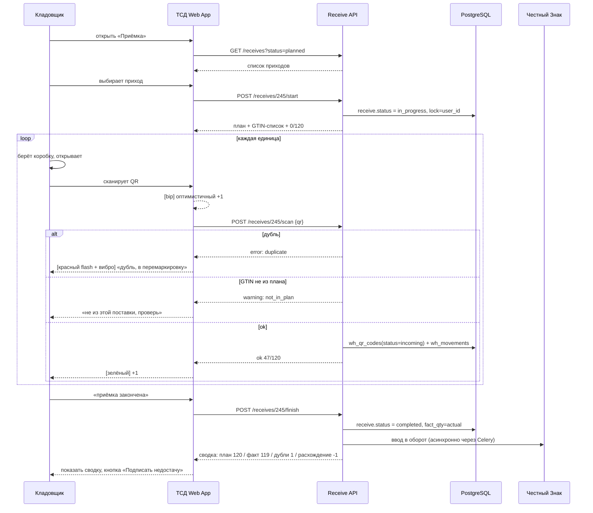

# ADOLF WAREHOUSE — Раздел 6: Сценарии

**Проект:** Управление физическим складом  
**Модуль:** Warehouse  
**Версия:** 1.0 (черновик)  
**Дата:** Май 2026

---

## 6.1 Назначение

Раздел описывает пользовательские сценарии работы со складом для каждой роли — от кладовщика на ТСД до директора в Open WebUI.

### Карта сценариев по ролям

| Сценарий | ТСД-оператор | Director | Admin |
|----------|:------------:|:--------:|:-----:|
| Приёмка товара (штучная) | ✅ | ✅ | ✅ |
| ОТК (проверка качества) | ✅ | ✅ | ✅ |
| Размещение по ячейкам | ✅ | ✅ | ✅ |
| Внутрискладские перемещения | ✅ | ✅ | ✅ |
| Подтверждение остатков ячейки | ✅ | ✅ | ✅ |
| Комплектация заказов | ✅ | ✅ | ✅ |
| Фасовка | ✅ | ✅ | ✅ |
| Отгрузка | ✅ | ✅ | ✅ |
| Инвентаризация | ✅ | ✅ | ✅ |
| Перемаркировка (запрос КИЗов) | ❌ | ✅ | ✅ |
| Управление ячейками/зонами | ❌ | ❌ | ✅ |
| Просмотр аналитики и отчётов | ❌ | ✅ | ✅ |
| Конфигурация правил | ❌ | ❌ | ✅ |

---

## 6.2 ТСД-оператор: штучная приёмка

### 6.2.1 Описание

**Цель:** оприходовать товар поставщика на склад с проверкой каждой единицы по QR.

**Предусловия:**
- В 1С создана ГТД с планом поставки (артикулы + GTIN + плановое кол-во)
- ГТД синхронизировалась в ADOLF, создан `wh_documents` типа `receive` со статусом `planned`
- Кладовщик авторизовался на ТСД через ПИН

### 6.2.2 Диаграмма последовательности



### 6.2.3 ТСД-экран

```
┌─────────────────────────────────┐
│ ← Приёмка #245    Поставщик ABC │
├─────────────────────────────────┤
│                                 │
│              47                 │
│             /120                │
│                                 │
│        ████░░░░░░  39%          │
│                                 │
├─────────────────────────────────┤
│  ✓ OM-1024 R44 — принят         │
│  ⚠ OM-2156 — ДУБЛЬ, отложить    │
│  ✓ OK-0521 R98 — принят         │
│  ✓ OM-1024 R44 — принят         │
│                                 │
├─────────────────────────────────┤
│  [⏸ Пауза]  [↻ Сканировать]    │
│           [✔ Закончить]         │
└─────────────────────────────────┘
```

### 6.2.4 Ошибки и edge-cases

| Ситуация | Поведение |
|----------|-----------|
| Дубль активного QR | Красный flash + вибро 200мс. Алерт в журнал. Товар откладывается в зону перемаркировки. |
| QR не парсится | «Не QR Честного Знака», звук ошибки |
| GTIN не в плане поставки | Жёлтое предупреждение, можно принять кнопкой «всё равно принять» |
| QR ранее списан как `lost` | Зелёный, статус сменится на `in_stock` (нашли потеряшку) |
| Сканер потерял связь | Иконка «оффлайн», события пишутся в IndexedDB outbox |
| Поставка идёт вторым человеком одновременно | API возвращает 409 Conflict, `lock=other_user` |

---

## 6.3 ТСД-оператор: ОТК

### 6.3.1 Пример: брак с фото-фиксацией

```
Кладовщик: открывает «ОТК» → видит партию «Платья ROSE OM-1024»

ТСД: 
  План проверить: 47 шт.
  Метод: выборочный (5 случайных) | полный

Кладовщик: выборочный
ТСД: показывает «Сканируй 1-ю единицу»

Кладовщик: сканирует QR
ТСД: «OM-1024 R44 — открой и проверь»
       [Брака нет] [Брак: фото]

Кладовщик: видит порванный шов → жмёт [Брак: фото]
ТСД: открывает камеру → 3 фото (общий вид, проблема, этикетка)
Кладовщик: тип брака — «брак фабрики», тяжесть «возврат поставщику»
ТСД: «Записано. Положи в зону возвратов»

→ wh_qr_codes(status=defect)
→ wh_qc_reports(...)
→ сразу алерт директору в Telegram
```

### 6.3.2 Решения по выявленному браку

| Решение | Что происходит |
|---------|----------------|
| Возврат поставщику | wh_qr_codes.status = `to_return`. Включается в претензионный лист. |
| Списание | wh_qr_codes.status = `written_off`. Запрос в ЧЗ на вывод из оборота. |
| Исправление | Переход в зону «исправление» (мелкий ремонт, перешивка) |
| Продажа со скидкой | Помечается как `discounted`, идёт отдельно при отгрузке |

---

## 6.4 ТСД-оператор: размещение

### 6.4.1 Динамический режим

```
Кладовщик: завозит коробку из ОТК → жмёт «Разместить»
ТСД: «Поднеси QR любого товара из коробки»

Кладовщик: сканирует
ТСД: «OM-1024 R44 → 47 шт. → ячейка A-12-3 (свободно)»
       [Положил] [Другая ячейка]

Кладовщик: кладёт пачку, жмёт [Положил]
ТСД: 
  Сканируй каждую следующую единицу (или жми «Все одинаковые»)

→ wh_movements(qr_code, from=qc_zone, to=A-12-3)
→ wh_stock(item_id, location=A-12-3, qty +=)
```

### 6.4.2 Статичный режим (правило артикула)

```
Кладовщик: сканирует QR
ТСД: «OM-1024 R44 → правило артикула: B-08-2»
       [Перейти к B-08-2]

Кладовщик: идёт к B-08-2, сканирует QR ячейки
ТСД: «Ячейка B-08-2 подтверждена. Положи и сканируй следующий QR товара»
```

В статичном режиме система **не разрешит** положить артикул в неправильную ячейку.

---

## 6.5 ТСД-оператор: пополнение зон отбора + проверка ячейки

### 6.5.1 Подтверждение остатка ячейки

При отборе из ячейки — если остаток меньше планового или ячейка пуста, ТСД спрашивает:

```
ТСД: «Ячейка A-12-3 пуста? Подтверди»
     [Да, пуста] [Нет, есть товар: ввести количество]

Если «Нет, есть» → ввод количества → автоматически создаётся 
wh_inventory_tasks(location=A-12-3, planned=20, fact=N) 
для официальной фиксации расхождения
```

### 6.5.2 Пополнение зоны отбора

```
Кладовщик: видит, что в ячейке отбора C-04 заканчивается «Платье OM-1024»
ТСД: «Пополнить C-04 из A-12-3 (47 шт.)»
     [Идти за товаром]

→ Кладовщик переносит → сканирует QR при кладке в C-04 → подтверждение
```

---

## 6.6 ТСД-оператор: комплектация заказа клиента

### 6.6.1 Сборка через сканирование (Вариант А — выбран)

```
Заказ #1234 → 4 позиции:
  - OM-1024 R44 × 2
  - OM-2156 R46 × 1
  - OK-0521 R98 × 1

ТСД: маршрут (по ячейкам в оптимальном порядке):
  1) C-04-2 — OM-1024 (×2)
  2) C-08-1 — OM-2156 (×1)
  3) D-02-3 — OK-0521 (×1)

Кладовщик: идёт к C-04-2
ТСД: «Сканируй QR ячейки»
Кладовщик: сканирует QR ячейки (метка на стеллаже)
ТСД: «Ок. Сканируй 1-й QR товара»

Кладовщик: берёт первое OM-1024, сканирует QR ТСД
ТСД: [bip] «✓ 1/2»
Кладовщик: берёт второе, сканирует
ТСД: [bip] «✓ 2/2 — переход к OM-2156»

→ wh_movements(qr=...,  to=picking_basket, doc=order_1234)
→ wh_stock(C-04-2 -= 2)
```

### 6.6.2 Ошибки при комплектации

| Ситуация | Поведение |
|----------|-----------|
| Артикул не из заказа | «Эта позиция не из заказа #1234, верни на место» |
| QR в статусе lost / defect | «Этот товар нельзя отгружать (брак). Положи отдельно.» |
| Ячейка пуста (нечего отбирать) | Создаёт инвент-задание + подсказывает альтернативную ячейку |

---

## 6.7 ТСД-оператор: фасовка

### 6.7.1 Формирование сейф-пакета (Вариант А — пик при укладке)

```
ТСД: «Заказ #1234 — фасовка»
     Тип упаковки: [Сейф-пакет] [Короб] [Мешок] [КИТУ]

Кладовщик: выбирает «Сейф-пакет», берёт чистый пакет, наклеивает уникальный код пакета
ТСД: «Сканируй код пакета»

Кладовщик: сканирует штрихкод пакета 7-100-12345
ТСД: «Пакет 7-100-12345 готов. Сканируй позиции при укладке»

Кладовщик: кладёт OM-1024, сканирует QR
ТСД: [bip] «1/4 уложено»
Кладовщик: продолжает
ТСД: «4/4 ✓ — закрой пакет»

→ wh_movements(qr_code, to=package_7-100-12345)
→ Подтверждение в ЧЗ агрегата (асинхронно)
```

### 6.7.2 КИТУ для крупного клиента

Для отгрузок крупным клиентам (опт) формируется КИТУ — групповая упаковка с собственным кодом, в которой много единичных QR.

```
ТСД: «Заказ #1234 (крупный) — КИТУ»
ТСД: «Сканируй или сгенерируй код КИТУ»
Кладовщик: «Сгенерировать»
ТСД: показывает QR-код КИТУ (можно распечатать на принтере) → клеит на короб

Дальше — сканирование позиций, как с сейф-пакетом, только в один большой контейнер.
В Честный Знак отправляется агрегат «КИТУ → дочерние QR-коды».
```

---

## 6.8 ТСД-оператор: отгрузка

```
ТСД: «Отгрузка маршрут #M-15»
     План: 12 заказов / 47 пакетов

Кладовщик: видит ТС у разгрузочной зоны
Кладовщик: сканирует код первого пакета 7-100-12345
ТСД: «✓ 1/47»
... (продолжает)
ТСД: «47/47 ✓ Поднеси QR-маршрута для финализации»

Кладовщик: сканирует QR-маршрута / водитель подписывает
ТСД: «Готово. Отгрузка зафиксирована, перевозчик: ИП Смирнов, ТС А123БВ»

→ Подтверждение в 1С
→ Подтверждение в ЧЗ (вывод из оборота)
```

---

## 6.9 Director: разбор инцидентов

### 6.9.1 Просмотр недавних дублей QR

```
Director открывает /warehouse → вкладка «Перемаркировка»

| Дата | QR | Артикул | Источник | Действие |
|------|----|---------|----------|---------|
| 14.05 | 04602...A1 | OM-1024 | Приход #245 | [Запросить перемаркировку] |
| 14.05 | 04602...B7 | OK-0521 | Приход #248 | [Запросить перемаркировку] |
| 13.05 | 04602...C2 | OM-2156 | Инвентаризация | [Запросить перемаркировку] |

Director выбирает все 3 → жмёт [Запросить перемаркировку у поставщика]
→ Создаётся обращение к поставщику + параллельно запрос в ЧЗ на новые КИЗы для замены
```

### 6.9.2 Разбор недостачи на приёмке

```
Director: фильтрует приёмки → видит «Приход #245 → план 120 / факт 119 / -1»

Открывает детали:
  План: 120 шт OM-1024 R44
  Факт: 119 шт (отсканировано)
  Дубли: 0

Решения:
  [Подписать недостачу 1 шт]    → wh_movements (loss adjustment)
  [Связаться с поставщиком]     → создать претензию в 1С
  [Запросить пересчёт ОТК]      → создать wh_inventory_tasks
```

---

## 6.10 Director: аналитика

### 6.10.1 Общий дашборд

| Метрика | Значение | Изменение |
|---------|----------|-----------|
| Всего позиций на складе | 14 230 SKU | — |
| Общий остаток | 87 350 шт | +2.3% за неделю |
| Средняя оборачиваемость | 28 дней | стабильно |
| Дубликатов за неделю | 12 шт | -40% к прошлой неделе |
| Брак выявлен ОТК | 0.8% | -0.2% |
| Загруженность ТСД | 76% времени смены | ✓ |

### 6.10.2 Топ проблемных артикулов

Артикулы с наибольшим количеством дублей / брака за период.

---

## 6.11 Admin: настройка ячеек

### 6.11.1 Добавление новой зоны

```
Admin: /warehouse → Зоны и ячейки → [+ Новая зона]
  Код: D
  Название: Зона D — детская одежда
  Тип: storage
  Стеллажей: 12
  Ячеек на стеллаж: 4

→ Создаётся 48 ячеек D-01-1...D-12-4
```

### 6.11.2 Привязка артикулов к ячейкам (статичный режим)

```
Admin: выбирает зону → вкладка «Привязки»
  OM-1024 (R40-R52) → C-04-1 ... C-04-4
  OM-2156 (все размеры) → C-08-1, C-08-2
  OK-0521 (все) → D-02-1 ... D-02-4

→ В статичном режиме ТСД будет требовать укладку только в эти ячейки
```

---

## 6.12 Admin: сценарий «полная инвентаризация»

```
Admin: создаёт инвентаризацию
  Тип: полная
  Старт: 18.05 22:00
  Заморозка склада: да (никаких приходов/отгрузок)

Все ТСД-операторы получают задание «инвентаризация»
Каждый идёт по назначенным зонам, сканирует все QR в каждой ячейке

После завершения:
  | Ячейка | План | Факт | Δ |
  |--------|------|------|---|
  | A-12-3 | 47 | 47 | ✓ |
  | A-12-4 | 23 | 22 | -1 |
  | ... | ... | ... | ... |

Admin: разбирает расхождения, создаёт корректировки
```

---

## 6.13 Сценарии ошибок

### 6.13.1 Сеть пропала во время приёмки

```
Кладовщик: продолжает сканировать
ТСД: показывает иконку «оффлайн», все события пишет в IndexedDB

Сеть вернулась:
ТСД: автоматически синхронизирует outbox → сервер
   alert: «Синхронизировано 47 событий за 12 минут»

Если в outbox были дубли (с другого ТСД, который был онлайн), 
они помечаются на сервере как duplicate и видны Director-у в журнале.
```

### 6.13.2 Сканер сломался

```
Кладовщик: жмёт «Ввод вручную»
ТСД: открывает поле для ввода серийной части QR
Кладовщик: вводит руками 18 символов (медленно, но работает)
```

### 6.13.3 ТСД сел / упал

```
Кладовщик: берёт другой ТСД, авторизуется тем же ПИН
Видит свою прерванную приёмку в списке «В работе»
Продолжает с места останова (все сканы которые синхронизировались — уже на сервере)
```

---

**Документ подготовлен:** Май 2026  
**Версия:** 1.0 (черновик)  
**Статус:** Драфт, дописывается итеративно
