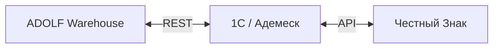
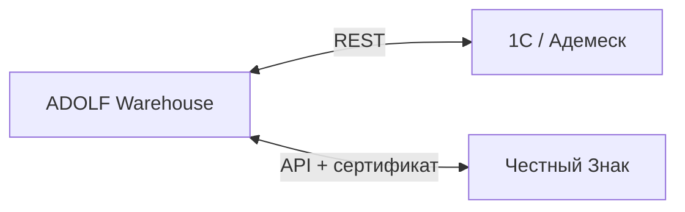

# ADOLF WAREHOUSE — Раздел 8: Интеграция с 1С

**Проект:** Управление физическим складом  
**Модуль:** Warehouse  
**Версия:** 1.0 (черновик)  
**Дата:** Май 2026

---

## 8.1 Назначение

Описание интеграции модуля Warehouse с 1С / Адемеск — синхронизация номенклатуры, заказов клиентов, ГТД, передача подтверждений приёмки/отгрузки. Также — связка с Честным Знаком через 1С-прокси.

---

## 8.2 Архитектура связки

Два варианта рассматриваются:

### Вариант А: Через 1С-прокси (предпочтительно)



**Плюсы:** 1С уже подключён к ЧЗ (есть сертификаты), всё в одном месте, проще аудит.  
**Минусы:** зависимость от стабильности 1С.

### Вариант Б: ADOLF напрямую к ЧЗ



**Плюсы:** независимость от 1С для критичных операций (приёмка не падает если 1С упал).  
**Минусы:** дублирование сертификатов и токенов, больше точек отказа.

**Решение:** стартуем с Варианта А (через 1С), переход на Вариант Б — в v1.1 если 1С станет узким местом.

---

## 8.3 REST API контракт (1С → Warehouse)

### 8.3.1 Endpoints, которые предоставит 1С

| Method | Endpoint | Назначение |
|--------|----------|------------|
| GET | `/items?since=<ts>` | Список номенклатуры обновлённой после `ts` |
| GET | `/items/{external_id}` | Карточка артикула |
| GET | `/orders?status=ready_for_picking` | Заказы клиентов готовые к сборке |
| GET | `/gtd?status=incoming` | ГТД ожидающие приёмки |
| POST | `/receives/{id}/confirm` | Подтверждение приёмки (с фактическим количеством) |
| POST | `/orders/{id}/confirm_shipment` | Подтверждение отгрузки |
| POST | `/honest_sign/codes/request_remarking` | Прокси-запрос новых КИЗов |
| POST | `/honest_sign/codes/validate` | Валидация QR (проверка статуса в ЧЗ) |
| POST | `/honest_sign/aggregate` | Агрегация (создание КИТУ) |

### 8.3.2 Аутентификация

Bearer-токен (выдаёт 1С администратору ADOLF). Токен в env `WH_ONEC_TOKEN`.

### 8.3.3 Формат данных

JSON, UTF-8. Ошибки — в формате:

```json
{
  "error": {
    "code": "DUPLICATE_QR",
    "message": "QR-код уже введён в оборот",
    "details": {...}
  }
}
```

---

## 8.4 Синхронизация номенклатуры

### 8.4.1 Алгоритм

1. Celery `wh.sync_nomenclature` каждый час
2. `GET /items?since=<last_sync_ts>` → массив изменений
3. UPSERT в `wh_items` по `external_id`
4. Обновление `last_sync_ts` в `wh_settings`

### 8.4.2 Обработка удалений

Если в 1С артикул помечен `is_deleted=true` — в `wh_items` ставим `is_active=false`. Не удаляем физически (audit trail).

---

## 8.5 Синхронизация заказов клиентов

### 8.5.1 Алгоритм

1. Celery `wh.sync_orders_from_1c` каждые 15 минут
2. `GET /orders?status=ready_for_picking&since=<ts>` 
3. Создаём `wh_documents(type=ship, status=planned)` для каждого
4. Создаём `wh_doc_items` — план сборки

### 8.5.2 Резервирование

При получении заказа сразу резервируем остатки: `wh_stock.reserved += planned_qty`.

Если остатков не хватает — статус заказа `wh_documents.status = 'shortage'` + алерт директору.

---

## 8.6 Подтверждения наружу

### 8.6.1 Подтверждение приёмки

После завершения приёмки:
- POST `/receives/{external_id}/confirm` с фактом
- Если в ответе ошибка — retry, в случае постоянной — алерт админу

### 8.6.2 Подтверждение отгрузки

Аналогично — после `wh_documents.type=ship → status=completed`:
- POST `/orders/{external_id}/confirm_shipment`
- Включает список QR-кодов, упаковок, перевозчика, ТС

---

## 8.7 Связка с Честным Знаком (через 1С)

### 8.7.1 Ввод в оборот

При успешной приёмке (после ОТК — точнее, после `wh_movements.action='place'`):
- POST `/honest_sign/introduce` с массивом QR
- 1С отправляет в ЧЗ, возвращает результат

### 8.7.2 Вывод из оборота

При отгрузке конечному клиенту (через сейф-пакеты):
- POST `/honest_sign/withdraw` с массивом QR из пакетов

### 8.7.3 Перемаркировка

См. раздел 1.6.8 + 6.9.1:
- POST `/honest_sign/codes/request_remarking` с item_id + qty
- Получаем массив новых QR-кодов
- Сохраняем в `wh_remark_requests.new_qr_codes`

### 8.7.4 Агрегация (КИТУ)

При формировании КИТУ для крупного клиента:
- POST `/honest_sign/aggregate` с parent КИТУ-кодом + массив дочерних QR

---

## 8.8 Обработка конфликтов

### 8.8.1 Конкурентное изменение заказа в 1С

Если заказ в 1С был изменён после того как мы начали комплектацию:
- Получаем notification (или версию при следующем sync)
- Если позиции добавились — добавляем в наш `wh_doc_items`
- Если убрались — алерт кладовщику «отмени сборку этой позиции»
- Если сменилось количество — пересчитываем `reserved`

### 8.8.2 Дубль QR в ADOLF, но «введён в оборот» в ЧЗ

Возможный сценарий: поставщик дал нам QR, который уже был у предыдущего покупателя (фабричный косяк). При попытке ввода в оборот ЧЗ вернёт ошибку — мы помечаем QR как `duplicate` и создаём `wh_remark_request`.

---

## 8.9 Тестовое окружение

Для разработки:
- Mock 1C-сервер (Docker-image с предзаписанными ответами)
- Sandbox ЧЗ (есть тестовый стенд у провайдера)

---

**Дописать:** детальные JSON-схемы для каждого endpoint, контракт с разработчиком 1С, тест-план интеграции.
