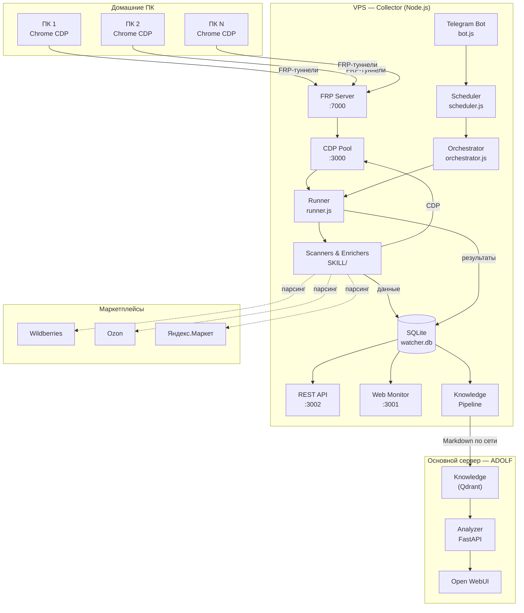
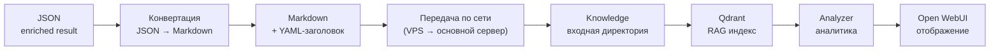

**Проект:** ADOLF — AI-Driven Operations Layer Framework  
**Модуль:** Watcher  
**Версия:** 4.0  
**Дата:** Февраль 2026

---

## 0.1 Назначение модуля

### Описание

Watcher — модуль системы ADOLF, предназначенный для автоматизированного сбора, обогащения и аналитической обработки данных о товарах конкурентов на маркетплейсах. Модуль обеспечивает непрерывную подпитку базы знаний ADOLF актуальной информацией о ценах, скидках, ассортименте и стратегиях конкурентов.

В отличие от предыдущих версий, Watcher v4.0 реализован как двухчастная система: автономный Collector на выделенном VPS собирает сырые данные через реальные браузеры на домашних ПК, а Analyzer на основном сервере ADOLF извлекает данные из базы знаний и формирует аналитику для отображения в Open WebUI.

### Бизнес-цели

| Цель | Описание |
|------|----------|
| Мониторинг конкурентов | Регулярный сбор каталогов продавцов с ценами, рейтингами, отзывами |
| Обогащение данных | Детальная информация по каждому SKU: характеристики, описания, варианты, изображения |
| Подпитка базы знаний | Автоматическая конвертация данных в Markdown и передача в модуль Knowledge (Qdrant) |
| Конкурентная аналитика | Ценовая, ассортиментная, трендовая аналитика и алерты на основе накопленных данных |
| Данные для других модулей | Предоставление данных модулям Marketing, Scout, Content Factory |

### Эволюция модуля

| Версия | Архитектура | Стек | Статус |
|--------|-------------|------|--------|
| v2.0 | Офисные ПК + USB-модемы + VPS | Python, FastAPI, PostgreSQL, Celery | Заменена |
| v3.0 | Офисные ПК + FRP-туннели + VPS | Python, FastAPI, PostgreSQL, Celery | Заменена |
| **v4.0** | **Домашние ПК + FRP-туннели + VPS + основной сервер** | **Node.js (Collector) + Python/FastAPI (Analyzer)** | **Актуальная** |

Ключевые отличия v4.0: полный переход Collector на Node.js, замена PostgreSQL на SQLite для локального хранения, Telegram-бот вместо Open WebUI как интерфейс управления Collector, добавление Knowledge Pipeline для интеграции с RAG-системой.

---

## 0.2 Двухчастная архитектура

Watcher v4.0 состоит из двух независимых подсистем, взаимодействующих через модуль Knowledge.

### Collector (VPS, Node.js)

Автономная подсистема сбора данных. Работает на отдельном VPS, управляется через Telegram-бот и Web-интерфейс мониторинга. Не зависит от основного сервера ADOLF в процессе сбора.

Функции: сканирование каталогов продавцов, обогащение данных по SKU, хранение истории цен, конвертация результатов в Markdown, передача документов в Knowledge.

### Analyzer (основной сервер, Python/FastAPI)

Аналитическая подсистема на основном сервере ADOLF. Извлекает данные о конкурентах из базы знаний (Qdrant), выполняет аналитическую обработку и предоставляет результаты через Open WebUI.

Функции: ценовая аналитика, ассортиментный анализ, конкурентное позиционирование, трендовая аналитика, формирование алертов.

### Схема взаимодействия



---

## 0.3 Поддерживаемые маркетплейсы

| Приоритет | Маркетплейс | Сканер | Обогатитель | Метод обогащения |
|:---------:|-------------|--------|-------------|------------------|
| 1 | Wildberries | scanner\_wb.js | enricher\_wb.js | HTTP API (без браузера) |
| 2 | Ozon | scanner\_ozon.js | enricher\_ozon.js | CDP (браузер) |
| 3 | Яндекс.Маркет | scanner\_ymarket.js | enricher\_ymarket.js | CDP (браузер) |

Все сканеры используют Chrome через CDP (Chrome DevTools Protocol), подключаясь к домашним ПК по FRP-туннелям. Обогатитель Wildberries работает через HTTP-запросы к внутренним API маркетплейса, обогатители Ozon и Яндекс.Маркет требуют реального браузера из-за антибот-защиты.

---

## 0.4 Собираемые данные

### Сканирование каталога (каждые 72 часа)

| Категория | Параметры |
|-----------|-----------|
| Идентификация | SKU, URL, название, бренд, позиция в каталоге |
| Цены | Текущая цена, старая цена, размер скидки (%, абс.) |
| Репутация | Рейтинг, количество отзывов, количество заказов (если доступно) |
| Состояние | Наличие (in\_stock), бейджи (Бестселлер и др.) |
| Медиа | URL основного изображения |

### Обогащение данных (каждые 24 часа)

| Категория | Параметры |
|-----------|-----------|
| Контент | Полное описание, все характеристики, состав |
| Медиа | Все изображения, количество видео |
| Варианты | Размеры/цвета с наличием и ценами |
| Категоризация | Категория, путь категории |
| Продавец | Название продавца, ОГРН (WB) |
| Остатки | Общий остаток (если доступно) |
| Отзывы | Распределение оценок (1–5 звёзд) |
| История | История изменения цен |

### Доступность полей по маркетплейсам

| Поле | WB | Ozon | YM |
|------|:--:|:----:|:--:|
| SKU, название, бренд | ✓ | ✓ | ✓ |
| Цена, старая цена, скидка | ✓ | ✓ | ✓ |
| Рейтинг, отзывы | ✓ | ✓ | ✓ |
| Количество заказов | — | ✓ | ? |
| Категория | ✓ | ✓ | ✓ |
| Описание, характеристики | ✓ | ✓ | ✓ |
| Изображения | ✓ | ✓ | ✓ |
| Варианты (размеры/цвета) | ✓ | ✓ | ✓ |
| Остатки на складах | ~ | ~ | ~ |
| ОГРН продавца | ✓ | — | — |
| Количество вопросов | — | ✓ | ✓ |

`✓` — доступно, `~` — частично/через API, `—` — недоступно, `?` — требует проверки.

Отсутствующие поля сохраняются как `null` в едином формате данных.

---

## 0.5 Knowledge Pipeline

### Поток данных в базу знаний

По завершении обогащения Collector конвертирует JSON-результат в структурированный Markdown-документ и передаёт его по локальной сети (между VPS) в директорию модуля Knowledge. Далее Knowledge индексирует документ в Qdrant для использования RAG-системой.



### Формат Markdown-документа

Каждый документ, передаваемый в Knowledge, содержит YAML-заголовок для классификации и маршрутизации в RAG-системе:

```yaml
---
title: "Конкурент: Seller Name (Wildberries)"
category: competitive_intelligence
subcategory: enriched_catalog
marketplace: wildberries
seller_id: "1025130"
seller_name: "Seller Name"
enrichment_date: "2026-02-12"
total_products: 142
brand_id: all
access_level: manager
source: watcher_collector
---
```

### Данные, поступающие в Knowledge

| Тип документа | Периодичность | Содержание |
|---------------|---------------|------------|
| Обогащённый каталог | 24 часа | Полные данные по всем SKU продавца |
| Ценовые изменения | 24 часа | Diff между текущим и предыдущим обогащением |
| Сводка по продавцу | 72 часа | Агрегированные метрики: ассортимент, средние цены, рейтинги |

---

## 0.6 Аналитические возможности

Analyzer извлекает данные из Knowledge и формирует следующие виды аналитики.

### Ценовая аналитика

| Метрика | Описание |
|---------|----------|
| Динамика цен по SKU | Графики изменения цен конкурентов во времени |
| Средняя скидка продавца | Анализ скидочной политики конкурента |
| Частота изменения цен | Как часто конкурент корректирует цены |
| Ценовые стратегии | Выявление паттернов: завышение old\_price, сезонные скидки |
| Ценовое позиционирование | Сравнение цен конкурентов с нашими товарами по категориям |

### Ассортиментная аналитика

| Метрика | Описание |
|---------|----------|
| Скорость обновления | Количество новых/удалённых SKU за период |
| Глубина ассортимента | Распределение товаров по категориям |
| ABC-анализ | Ранжирование по рейтингу/отзывам как прокси продаж |
| Бестселлеры и аутсайдеры | Товары с максимальным/минимальным рейтингом и отзывами |
| Размерные линейки | Анализ доступных размеров и наличия |

### Конкурентное позиционирование

| Метрика | Описание |
|---------|----------|
| Пересечение ассортимента | Общие бренды и похожие товары с нашим каталогом |
| Сравнение рейтингов | Рейтинги конкурентов vs наши в одинаковых категориях |
| Анализ контента | Качество описаний и характеристик карточек конкурентов |
| Анализ отзывов | Распределение оценок, выявление слабых мест конкурентов |

### Трендовая аналитика

| Метрика | Описание |
|---------|----------|
| Сезонные паттерны | Циклические изменения цен и ассортимента |
| Рост/падение отзывов | Косвенный индикатор динамики продаж |
| Новые категории | Выход конкурента в новые товарные ниши |
| Динамика наличия | Тренды по остаткам и доступности размеров |

### Алерты

| Событие | Описание |
|---------|----------|
| Резкое снижение цены | Конкурент снизил цену на аналог нашего товара |
| Новый товар в категории | Конкурент вывел товар в нашей категории |
| Бейдж «Бестселлер» | Товар конкурента получил бейдж |
| Массовый вывод товаров | Возможная ликвидация остатков |
| Значительный рост отзывов | Косвенный признак роста продаж |

---

## 0.7 Технологический стек

### Collector (VPS)

| Компонент | Технология |
|-----------|------------|
| Runtime | Node.js |
| База данных | SQLite (WAL-режим) |
| Браузерная автоматизация | Playwright CDP |
| Управление | Telegram Bot API |
| HTTP API | Native http.createServer (без фреймворков) |
| Web-мониторинг | Node.js + WebSocket |
| Туннели | FRP (frps/frpc) |
| UI-фреймворк | Tailwind CSS + Lucide Icons + shadcn/ui tokens |
| Процесс-менеджмент | systemd |
| Reverse proxy | Nginx + Let's Encrypt SSL |

### Analyzer (основной сервер)

| Компонент | Технология |
|-----------|------------|
| API | FastAPI (Python) |
| База знаний | Qdrant (через модуль Knowledge) |
| Очередь | Redis + Celery |
| AI | GPT-5 mini (рутинная аналитика), Claude Opus 4.5 (глубокий анализ) |
| Интерфейс | Open WebUI |

### Коммуникация между частями

| Канал | Протокол | Направление |
|-------|----------|-------------|
| Knowledge Pipeline | Файловая передача по сети (VPS → основной сервер) | Collector → Knowledge |
| Формат передачи | Markdown с YAML-заголовком | — |
| Индексация | Qdrant vector DB | Knowledge → Analyzer |

---

## 0.8 Ролевая модель

### Collector (Telegram-бот)

Управление Collector осуществляется через Telegram-бот. Доступ ограничен `ADMIN_CHAT_ID` в конфигурации.

| Функция | Доступ |
|---------|--------|
| Добавление/удаление продавцов | Admin |
| Запуск сканирования и обогащения | Admin |
| Мониторинг статуса системы | Admin |
| Настройка расписаний и параметров | Admin |
| Web-мониторинг (agent.adolf.su) | Admin (auth по паролю) |

### Analyzer (Open WebUI)

| Функция | Manager | Senior | Director | Admin |
|---------|:-------:|:------:|:--------:|:-----:|
| Просмотр цен конкурентов | ✅ | ✅ | ✅ | ✅ |
| Просмотр аналитики | ✅ | ✅ | ✅ | ✅ |
| Просмотр алертов | ✅ | ✅ | ✅ | ✅ |
| Сравнение с нашими товарами | ✅ | ✅ | ✅ | ✅ |
| Экспорт данных | ❌ | ✅ | ✅ | ✅ |
| Настройка порогов алертов | ❌ | ❌ | ❌ | ✅ |

Фильтрация по брендам применяется в соответствии с ролевой моделью ADOLF Core.

---

## 0.9 Интеграции

### Зависимости Collector

| Компонент | Назначение |
|-----------|------------|
| FRP Server | Туннели к домашним ПК |
| Chrome на домашних ПК | Браузеры для CDP-подключения |
| Telegram Bot API | Управление и уведомления |
| Модуль Knowledge | Приём Markdown-документов |

### Зависимости Analyzer

| Компонент ADOLF | Использование |
|-----------------|---------------|
| Core Middleware | Авторизация, роутинг API |
| Knowledge (Qdrant) | Источник данных о конкурентах |
| Celery | Фоновые задачи аналитики |
| Redis | Кэширование, очередь задач |
| Open WebUI | Пользовательский интерфейс |

### Потребители данных Watcher

| Модуль | Использование данных |
|--------|---------------------|
| Marketing | Ценовые данные конкурентов для стратегии рекламных ставок |
| Scout | Данные для анализа ниш и прогнозирования |
| Content Factory | Характеристики и описания конкурентов для SEO-оптимизации |

---

## 0.10 Механизмы защиты от блокировок

| Механизм | Описание |
|----------|----------|
| Домашние IP | Каждый ПК использует собственный домашний IP-адрес |
| FRP-туннели | Подключение к ПК без проброса портов, через VPS |
| Эмуляция поведения | Кривые Безье для мыши, коэффициент усталости, случайные отвлечения |
| Оркестрация | Чередование ПК по маркетплейсам и продавцам, штрафы за повторы |
| Cooldown | Автоматическая пауза при нарушении правил чередования |
| CAPTCHA-обработка | Ожидание до 2 минут, пропуск SKU с fallback-данными |

### Эмуляция поведения (human.js)

| Компонент | Описание |
|-----------|----------|
| bezierMove | Движение мыши по кубической кривой Безье с перелётом и дрожанием |
| humanClick | Клик со случайным смещением |
| smoothScroll | Скролл порциями 200–450px с учётом усталости |
| humanType | Ввод текста с 12% вероятностью опечаток (QWERTY-соседи) |
| Отвлечения | Наведение, просмотр карточки, выделение текста, поиск, правый клик, переключение вкладок |
| Коэффициент усталости | Прогрессивное замедление по мере сбора данных |

---

## 0.11 Структура документации

| Раздел | Содержание | Подсистема |
|--------|------------|------------|
| **0. Введение** | Обзор, архитектура, цели (этот документ) | Общая |
| **1. Архитектура** | Компоненты, потоки данных, инфраструктура | Общая |
| **2. Telegram-бот и планировщик** | bot.js, scheduler.js, команды, расписания | Collector |
| **3. Оркестратор и исполнитель** | orchestrator.js, runner.js, распределение задач | Collector |
| **4. Сканеры и обогатители** | SKILL/, human.js, маркетплейс-специфика | Collector |
| **5. База данных и REST API** | SQLite-схема, api.js, файловое хранилище | Collector |
| **6. Analyzer и Open WebUI** | Knowledge Pipeline, дашборд, AI-чат, Celery, алерты | Analyzer |
| **7. Мониторинг и развёртывание** | cdp-pool.js, monitor/, config.js, systemd, FRP, nginx | Collector |
| **8. Задачи разработки** | Статус, backlog, технический долг, roadmap | Общая |

---

## 0.12 Быстрый старт

### Для администратора (Collector)

1. Установите Chrome на домашних ПК, настройте FRP-клиент (`frpc`) для проброса CDP-порта
2. На VPS: клонируйте репозиторий, выполните `npm install`
3. Заполните `.env` (`BOT_TOKEN`, `ADMIN_CHAT_ID`)
4. Запустите systemd-сервисы: `cdp-pool`, `watcher-bot`, `watcher-api`, `watcher-monitor`
5. В Telegram отправьте боту `WB1025130` для первого сканирования
6. Откройте `https://agent.adolf.su` для мониторинга

### Для менеджера (Analyzer)

1. Откройте Open WebUI
2. Задайте вопрос: «Покажи цены конкурента Seller Name на Wildberries»
3. Для сравнения: «Сравни наши цены с конкурентом в категории Худи»
4. Для алертов: «Какие конкуренты снизили цены за последнюю неделю?»

---

## 0.13 Репозитории

| Репозиторий | Содержание |
|-------------|------------|
| [Sign25/watcher](https://github.com/Sign25/watcher) | Collector: исходный код, сканеры, обогатители, мониторинг |
| [Sign25/Docs](https://github.com/Sign25/Docs) | Документация модуля (директория `watcher/`) |

---

**Документ подготовлен:** Февраль 2026  
**Версия:** 4.0  
**Статус:** Черновик
