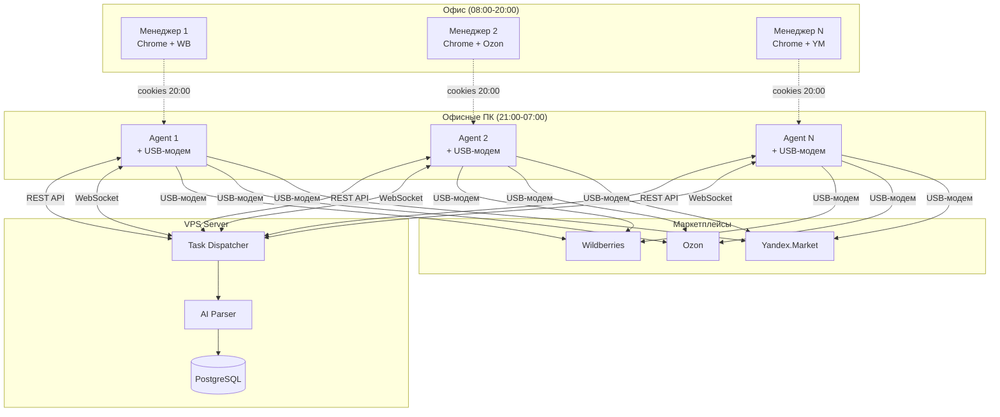

**Проект:** Интеллектуальная система мониторинга цен конкурентов  
**Модуль:** Watcher  
**Версия:** 2.0  
**Дата:** Январь 2026

---

## 0.1 Назначение модуля

### Описание

Watcher — модуль системы ADOLF, предназначенный для автоматизированного сбора данных о ценах и характеристиках товаров конкурентов на маркетплейсах. Модуль использует распределённую архитектуру с агентами на офисных компьютерах, работающими в ночное время.

### Бизнес-цели

| Цель | Описание |
|------|----------|
| Мониторинг конкурентов | Отслеживание цен, остатков, рейтингов конкурентов |
| Демпинг-алерты | Мгновенное оповещение о снижении цен конкурентами |
| Данные для аналитики | Предоставление данных модулям Marketing, Scout, Content Factory |
| Конкурентная разведка | Сбор информации о позициях в выдаче, рекламных ставках |

### Ключевая особенность

Watcher Agent копирует cookies из браузера менеджера в конце рабочего дня. Это позволяет агенту авторизоваться на маркетплейсе как менеджер и видеть:

- Специальные цены (СПП) на Wildberries
- Персональные предложения
- Закрытую информацию о ставках
- Данные, недоступные неавторизованным пользователям

Фактически, агент становится «ночным менеджером» — работает от имени сотрудника, пока тот отдыхает.

---

## 0.2 Поддерживаемые маркетплейсы

| Приоритет | Маркетплейс | Описание |
|:---------:|-------------|----------|
| 1 | Wildberries | Основной маркетплейс, максимальный объём SKU |
| 2 | Ozon | Второй по приоритету |
| 3 | Yandex.Market | Третий по приоритету |

---

## 0.3 Собираемые данные

### Типы данных

| Категория | Параметры |
|-----------|-----------|
| Цены | Текущая цена, старая цена, цена по СПП |
| Наличие | Остатки (in_stock) |
| Рейтинг | Средний рейтинг товара |
| Отзывы | Количество отзывов |
| Позиция | Позиция в поисковой выдаче |
| Реклама | Рекламные ставки конкурентов |
| Продажи | Количество продаж (если доступно) |
| Карточка | Описание, атрибуты товара |

### Объём мониторинга

| Параметр | Значение |
|----------|----------|
| Собственные SKU | ~1 000 на каждый маркетплейс |
| Количество площадок | 3 (WB, Ozon, YM) |
| Всего собственных SKU | ~3 000 |
| Конкуренты | ~30 продавцов |
| SKU конкурентов | ~30 000 |
| **Итого URL для парсинга** | **~33 000 ежедневно** |

---

## 0.4 Архитектура высокого уровня

### Компоненты системы

| Компонент | Расположение | Назначение |
|-----------|--------------|------------|
| Watcher Agent | Офисные ПК (3-15 шт.) | Сбор данных, эмуляция поведения |
| Browser Cloner | Офисные ПК | Копирование профиля и cookies Chrome |
| Task Dispatcher | VPS | Оркестрация задач, распределение нагрузки |
| AI Parser | VPS | Извлечение данных из текста (GPT-5 mini) |
| IP Semaphore | VPS | Предотвращение коллизий IP-адресов |

---

## 0.5 Режимы работы

### Дневной режим (08:00–20:00)

- Менеджеры работают в браузерах
- Агенты неактивны
- Офисные ПК используют офисную сеть (Ethernet)

### Вечерний режим (20:00–21:00)

- Автоматическое копирование cookies из браузеров менеджеров
- Переключение сетевого интерфейса на USB-модем
- Завершение процессов Chrome
- Подготовка агентов к работе

### Ночной режим (21:00–07:00)

- Агенты активны
- Парсинг ~33 000 URL
- Работа через USB-модемы (отдельный IP для каждого агента)
- Отправка данных на сервер

### Утренний режим (07:00–08:00)

- Завершение работы агентов
- Переключение на офисную сеть (Ethernet)
- Очистка временных профилей браузера
- Подготовка к дневному режиму

---

## 0.6 Ролевая модель

### Матрица доступа

| Функция | Manager | Senior | Director | Admin |
|---------|:-------:|:------:|:--------:|:-----:|
| Просмотр цен по SKU | ✅ | ✅ | ✅ | ✅ |
| Просмотр демпинг-алертов | ✅ | ✅ | ✅ | ✅ |
| Добавление SKU на мониторинг | ✅ | ✅ | ✅ | ✅ |
| Добавление конкурентов | ✅ | ✅ | ✅ | ✅ |
| Настройка порогов алертов | ❌ | ❌ | ❌ | ✅ |
| Управление агентами | ❌ | ❌ | ❌ | ✅ |
| Мониторинг агентов в реальном времени | ❌ | ❌ | ❌ | ✅ |
| Настройки эмуляции | ❌ | ❌ | ❌ | ✅ |

### Фильтрация по брендам

| Роль | brand_id | Видимость данных |
|------|----------|------------------|
| Manager | ohana_market | Только данные Охана Маркет |
| Manager | ohana_kids | Только данные Охана Кидс |
| Manager | all | Данные всех брендов |
| Senior+ | all | Данные всех брендов |

---

## 0.7 Интеграции

### Зависимости от ADOLF Core

| Компонент Core | Использование в Watcher |
|----------------|-------------------------|
| Middleware | Авторизация, роутинг API, prompt-инъекция |
| PostgreSQL | Хранение данных: задачи, агенты, история цен, подписки |
| Celery | Фоновые задачи: генерация задач, очистка, алерты |
| Redis | Очередь задач, IP Semaphore |
| Notifications | Демпинг-алерты, алерты о состоянии агентов |
| Open WebUI | Интерфейс пользователя (Pipeline, Tools) |

### Потребители данных Watcher

| Модуль | Использование данных |
|--------|---------------------|
| Marketing | Реальные ставки конкурентов для Bid Correction |
| Scout | Данные о ценах/конкурентах для анализа ниш |
| Content Factory | Данные о конкурентах для TF-IDF (v2.0) |
| Lex | Использует инфраструктуру агентов Watcher |

---

## 0.8 Механизмы защиты

### Защита от блокировок

| Механизм | Описание |
|----------|----------|
| USB-модемы | Каждый агент использует отдельный IP мобильного оператора |
| Split Tunneling | Трафик агента через модем, системный — через офисную сеть |
| Browser Cloning | Копирование реального профиля Chrome с cookies |
| IP Semaphore | Один IP — один поток к домену (предотвращение коллизий) |
| Эмуляция поведения | Случайные паузы, скролл, движения мыши (кривые Безье) |
| Panic Mode | При CAPTCHA — остановка, алерт, перезагрузка модема |

### Перезагрузка модема при Panic Mode

| Способ | Описание |
|--------|----------|
| Программный | AT-команды через COM-порт (основной) |
| Аппаратный | USB-хаб с управлением питанием (резервный) |

---

## 0.9 Технологический стек

### Серверная часть (VPS)

| Компонент | Технология |
|-----------|------------|
| API | FastAPI (Python 3.11) |
| WebSocket | FastAPI WebSocket |
| База данных | PostgreSQL 15 |
| Очередь | Redis + Celery |
| AI | GPT-5 mini (Timeweb AI Agent) |

### Клиентская часть (Agent)

| Компонент | Технология |
|-----------|------------|
| Язык | Python 3.11 |
| Браузерная автоматизация | Playwright |
| ОС | Windows 10/11 |
| Запуск | Windows Service (MVP), Tray App (v2.0) |
| Конфигурация | YAML |

### Коммуникация

| Канал | Протокол | Назначение |
|-------|----------|------------|
| Задачи | REST API | Получение задач, отправка результатов |
| Управление | WebSocket | Команды: stop, pause, resume, reload_config, reboot_modem, refresh_cookies |
| Аутентификация | API Key | Уникальный ключ для каждого агента |

---

## 0.10 Структура документации

| Раздел | Содержание |
|--------|------------|
| **0. Introduction** | Обзор, роли, быстрый старт (этот документ) |
| **1. Architecture** | Компоненты, зависимости, интеграции |
| **2. Agent** | Клиентское приложение, Browser Cloner, эмуляция |
| **3. Task Dispatcher** | Серверная часть, очередь задач, IP Semaphore |
| **4. AI Parser** | Извлечение данных, промпты, валидация |
| **5. Database** | Схема базы данных |
| **6. Open WebUI** | Pipeline, Tools, интерфейс |
| **7. Celery** | Фоновые задачи |
| **8. Scenarios** | Пользовательские сценарии |

---

## 0.11 Быстрый старт

### Для менеджера

1. Откройте Open WebUI
2. Выберите Pipeline `@Adolf_Watcher`
3. Напишите: «Покажи цены на артикул OM-12345»
4. Для добавления конкурента: «Добавь конкурента https://www.wildberries.ru/catalog/12345678»
5. Для просмотра алертов: «Покажи демпинг-алерты»

### Для администратора

1. Установите Watcher Agent на офисные ПК (3-15 машин)
2. Подключите USB-модемы к каждому ПК
3. Настройте config.yaml на каждом агенте
4. Зарегистрируйте агентов на сервере (получите API Key)
5. Настройте Windows Service для автозапуска агента
6. Убедитесь, что менеджеры работают в Chrome (для cookies)
7. Настройте пороги алертов в Open WebUI → Настройки → Watcher

---

## 0.12 Способы добавления товаров на мониторинг

### MVP

| Способ | Описание |
|--------|----------|
| По URL | Вставка ссылки на карточку товара |
| По артикулу/SKU | Ввод артикула, система формирует URL |

### v2.0

| Способ | Описание |
|--------|----------|
| Пакетная загрузка | CSV/Excel со списком товаров |

---

## 0.13 Хранение данных

### Сроки хранения

| Тип данных | Срок хранения |
|------------|---------------|
| История цен | 5 лет |
| Демпинг-алерты | 5 лет |
| Логи агентов | 5 лет |

### Формат хранения

- **Полная история** — каждый парсинг сохраняется как отдельная запись
- Без агрегации и сжатия для максимальной детализации аналитики

---

## 0.14 Демпинг-алерты

### Настраиваемые пороги

Все пороги алертов настраиваются администратором:

| Порог | Описание | Пример |
|-------|----------|--------|
| Снижение цены | Конкурент снизил цену на X% | 10%, 20%, 30% |
| Цена ниже нашей | Цена конкурента ниже нашей на Y% | 5%, 10%, 15% |
| Появление нового конкурента | Новый продавец в категории | — |
| Изменение позиции | Конкурент поднялся в выдаче | ТОП-5, ТОП-10 |

### Получатели алертов

- Manager (по своему бренду)
- Senior (все бренды)
- Director (все бренды)

---

## 0.15 Пропускная способность

### Расчёт нагрузки

| Параметр | Значение |
|----------|----------|
| Всего URL | ~33 000 |
| Ночное окно | 10 часов (21:00–07:00) |
| Агентов (мин) | 3 |
| Агентов (макс) | 15 |

### Производительность

| Агентов | URL/агент/ночь | URL/мин/агент |
|:-------:|:--------------:|:-------------:|
| 3 | ~11 000 | ~18 |
| 5 | ~6 600 | ~11 |
| 10 | ~3 300 | ~5.5 |
| 15 | ~2 200 | ~3.7 |

При консервативной оценке (3-5 URL/мин с учётом эмуляции) рекомендуется 10-15 агентов.

---

## 0.16 Разграничение MVP и v2.0

### MVP

| Функция | Статус |
|---------|:------:|
| Сбор цен, остатков, рейтингов | ✅ |
| Добавление по URL и артикулу | ✅ |
| Демпинг-алерты | ✅ |
| Ручная установка агентов | ✅ |
| Консольное приложение агента | ✅ |
| Равномерное распределение задач | ✅ |

### v2.0

| Функция | Статус |
|---------|:------:|
| Пакетная загрузка CSV/Excel | 🔜 |
| Автообновление агентов | 🔜 |
| Tray-приложение агента | 🔜 |
| Приоритеты мониторинга | 🔜 |
| Дифференциация частоты по приоритетам | 🔜 |

---

## 0.17 Контакты и ответственные

| Область | Ответственный |
|---------|---------------|
| Техническая поддержка | Administrator |
| Настройка агентов | Administrator |
| Добавление товаров | Manager+ |
| Настройка алертов | Administrator |

---

**Документ подготовлен:** Январь 2026  
**Версия:** 2.0  
**Статус:** Черновик
