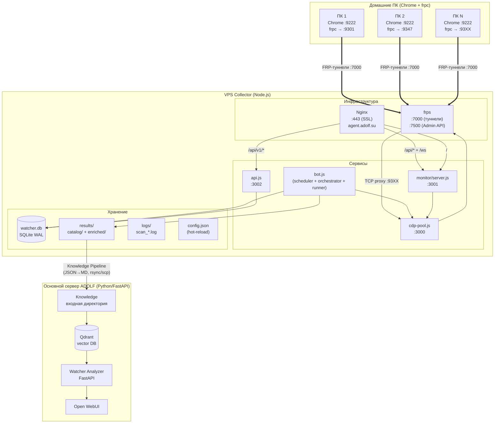
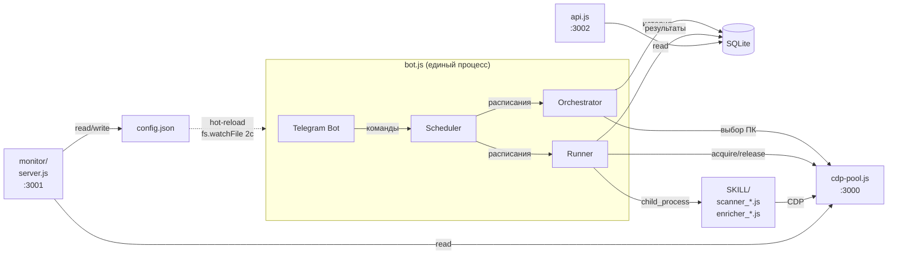
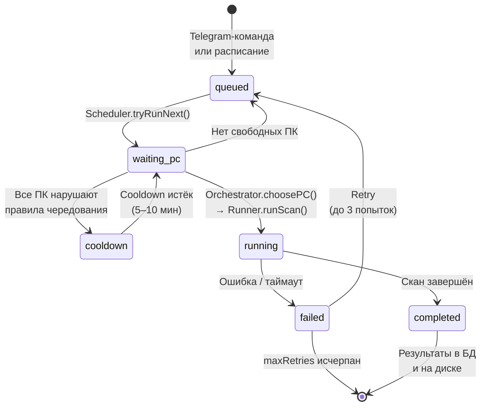
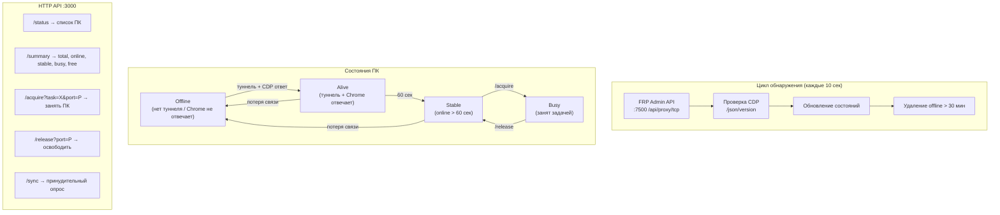
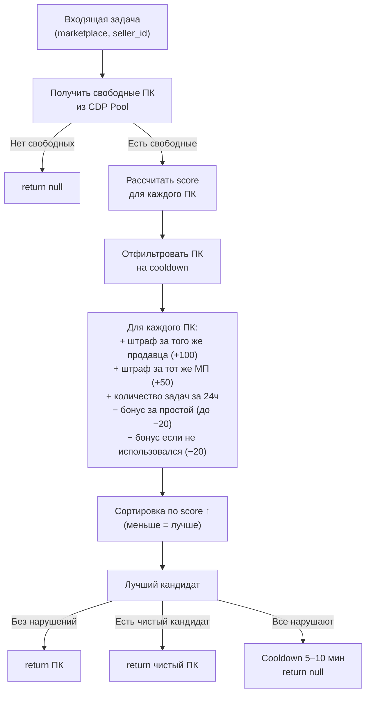
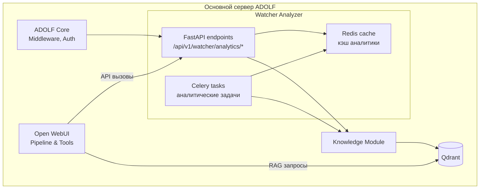
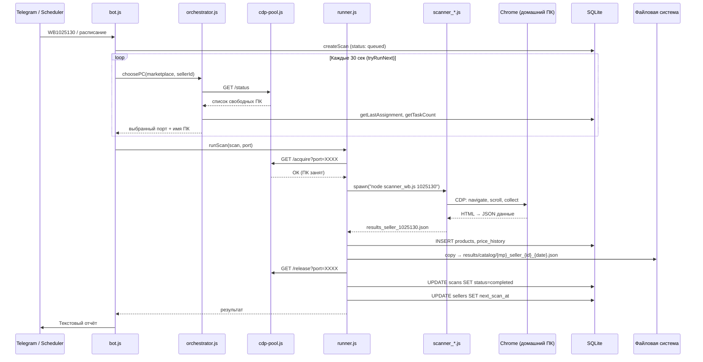
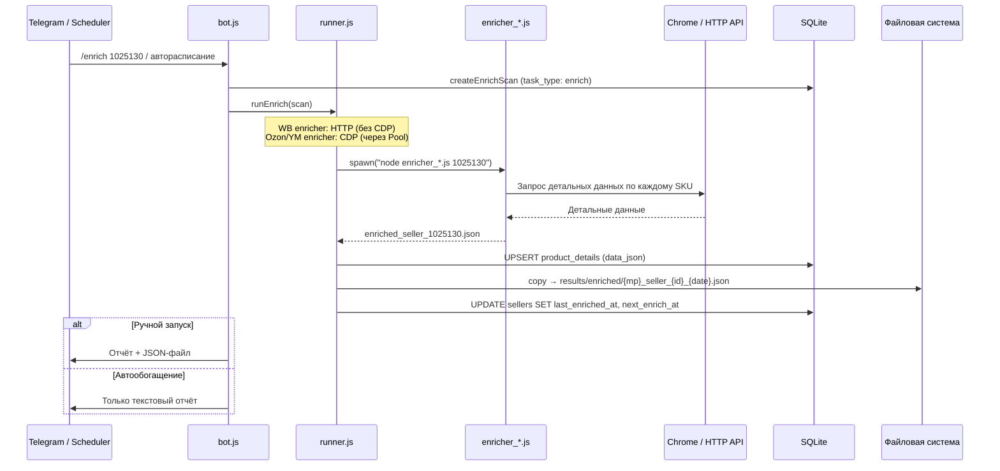
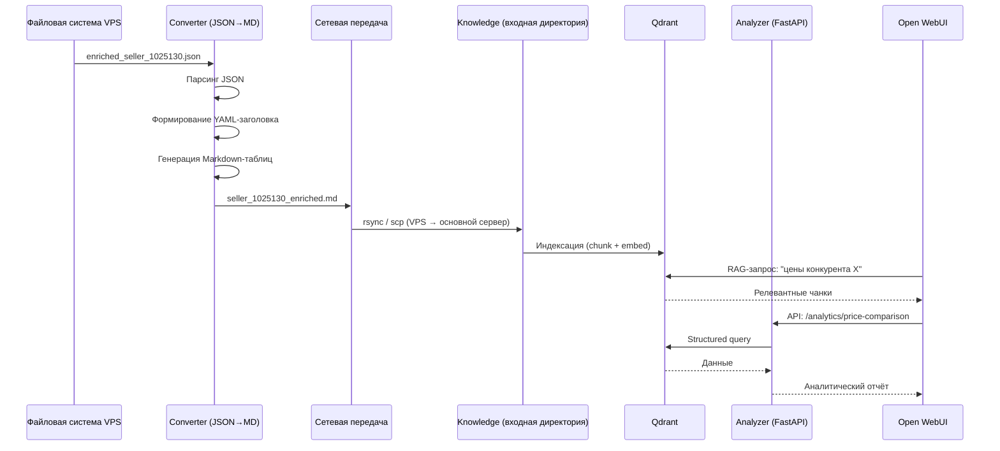

**Проект:** ADOLF — AI-Driven Operations Layer Framework  
**Модуль:** Watcher / Architecture  
**Версия:** 4.0  
**Дата:** Февраль 2026

---

## 1.1 Принципы проектирования

| Принцип | Описание |
|---------|----------|
| Двухчастность | Collector (сбор данных) и Analyzer (аналитика) — независимые подсистемы |
| Автономность Collector | Работает без подключения к основному серверу ADOLF; связь только через Knowledge Pipeline |
| Распределённость | Домашние ПК как браузерные агенты, VPS как управляющий узел |
| Отказоустойчивость | Выход ПК из строя не останавливает систему; автоматическое обнаружение и повторные попытки |
| Масштабируемость | Пул ПК расширяется без изменения архитектуры (порты 9300–9399, до 100 агентов) |
| Защита от блокировок | Домашние IP, FRP-туннели, эмуляция поведения, оркестрация чередования |
| Минимализм зависимостей | 4 npm-пакета для Collector; native HTTP-серверы без фреймворков |

---

## 1.2 Топология развёртывания



---

## 1.3 Компоненты Collector

### Карта процессов и портов

| Процесс | systemd-сервис | Порт | Протокол | Описание |
|---------|---------------|------|----------|----------|
| frps | `frps.service` | 7000 (туннели), 7500 (Admin API) | TCP, HTTP | FRP-сервер для туннелей к домашним ПК |
| cdp-pool.js | `cdp-pool.service` | 3000 | HTTP | Управление пулом браузеров |
| bot.js | `watcher-bot.service` | — | Telegram API | Бот + scheduler + orchestrator + runner |
| api.js | `watcher-api.service` | 3002 | HTTP/JSON | REST API для программного доступа |
| monitor/server.js | `watcher-monitor.service` | 3001 | HTTP + WebSocket | Web-интерфейс мониторинга |
| nginx | `nginx.service` | 443 | HTTPS | Reverse proxy + SSL (agent.adolf.su) |

### Взаимодействие компонентов



### Жизненный цикл задачи



---

## 1.4 Подробная архитектура компонентов

### cdp-pool.js — Пул браузеров

Автономный процесс, управляющий жизненным циклом подключений к домашним ПК.



Ключевые параметры: стабильность после 60 секунд online (защита от flapping), удаление из пула после 30 минут offline, автообнаружение новых ПК через FRP Admin API.

### bot.js — Telegram-бот

Точка входа Collector (`node bot.js`). Запускает scheduler.js при старте. Принимает команды из Telegram и обрабатывает их.

Типы входных данных:

| Ввод | Интерпретация |
|------|---------------|
| `WB125487` | Быстрый скан продавца 125487 на Wildberries |
| `OZ465656` | Быстрый скан продавца 465656 на Ozon |
| `YM213246` | Быстрый скан продавца 213246 на Яндекс.Маркет |
| Голое число | Выбор маркетплейса через inline-кнопки |
| `/add <mp> <id> <имя>` | Добавление продавца в отслеживание |
| `/scan <id>` | Ручной запуск сканирования |
| `/enrich <id>` | Ручной запуск обогащения |

Полный список команд описан в [Разделе 2: Telegram-бот и планировщик](/watcher/adolf_watcher_2_bot_scheduler).

### scheduler.js — Планировщик

Работает внутри процесса bot.js. Управляет шестью циклическими задачами.

| Цикл | Интервал по умолчанию | Hot-reload | Описание |
|------|----------------------|:----------:|----------|
| checkSchedules | 5 мин | Нет (после рестарта) | Проверяет `next_scan_at`, создаёт задачи в очереди |
| checkEnrichSchedules | 5 мин | Нет (после рестарта) | Проверяет `next_enrich_at`, создаёт enrich-задачи |
| tryRunNext | 30 сек | Нет (после рестарта) | Берёт задачи из очереди, запрашивает ПК, запускает |
| monitorPCs | 15 сек | Нет (после рестарта) | Отслеживает online/offline ПК, отправляет алерты |
| rotateFiles | 24 часа | Нет (после рестарта) | Удаляет старые файлы результатов |
| morningSummary | 05:00 UTC (ежедневно) | Да | Утренняя сводка в Telegram |

Пять интервалов планировщика применяются только после перезапуска сервиса. Остальные 18 параметров конфигурации (оркестратор, раннер, монитор) применяются мгновенно через hot-reload.

### orchestrator.js — Оркестратор

Алгоритм выбора ПК для задачи. Реализует скоринговую модель с штрафами и бонусами.



История назначений хранится в таблице `assignments` (SQLite), что обеспечивает персистентность при перезапусках.

### runner.js — Исполнитель

Запускает сканеры и обогатители как дочерние процессы (`child_process.spawn`).

| Параметр | Сканирование | Обогащение |
|----------|-------------|------------|
| Процесс | `node SKILL/scanner_*.js <seller_id>` | `node SKILL/enricher_*.js <seller_id>` |
| Переменные окружения | `CDP_PORT`, `MARKETPLACE`, `SELLER_SLUG` | `CDP_PORT` (если нужен CDP) |
| Таймаут | 3 часа (`runner.scanTimeoutMs`) | 30 мин (`runner.enrichTimeoutMs`) |
| Повторные попытки | До 3 (`runner.maxRetries`) | Нет |
| Требует CDP | Всегда | WB — нет; Ozon, YM — да |
| Результат | `results/results_seller_<id>.json` | `results/enriched_seller_<id>.json` |
| Архивная копия | `results/catalog/{mp}_seller_{id}_{date}.json` | `results/enriched/{mp}_seller_{id}_{date}.json` |

Параллельность: runner поддерживает запуск нескольких задач одновременно (по числу свободных ПК). Каждая задача отслеживается в `Map` по `scanId`.

---

## 1.5 Компоненты Analyzer

Analyzer работает на основном сервере ADOLF в составе Python/FastAPI-стека.



### Взаимодействие с Knowledge

Analyzer не хранит данные о конкурентах самостоятельно. Все данные извлекаются из Qdrant через модуль Knowledge:

| Операция | Метод | Описание |
|----------|-------|----------|
| Поиск по продавцу | Semantic search | Поиск документов по `seller_id` + `marketplace` |
| Поиск по SKU | Semantic search | Поиск обогащённых данных конкретного товара |
| Поиск изменений | Metadata filter | Фильтр по `subcategory: price_changes` + дате |
| Агрегация | Multi-query | Сбор данных за период для трендового анализа |

### Open WebUI интеграция

| Компонент | Тип | Описание |
|-----------|-----|----------|
| Watcher Pipeline | Pipeline | Обработка запросов о конкурентах через RAG |
| Watcher Tools | Tool | Прямые API-вызовы для структурированных данных |
| Watcher Alerts | Notification | Push-уведомления о критических изменениях |

---

## 1.6 Потоки данных

### Поток 1: Сканирование каталога



### Поток 2: Обогащение данных



### Поток 3: Knowledge Pipeline



---

## 1.7 Инфраструктура

### FRP-туннели

FRP (Fast Reverse Proxy) обеспечивает подключение к домашним ПК без проброса портов на роутерах.

| Компонент | Расположение | Конфигурация |
|-----------|-------------|--------------|
| frps (сервер) | VPS | Порт 7000 (туннели), 7500 (Admin API, Basic auth) |
| frpc (клиент) | Каждый домашний ПК | Пробрасывает локальный Chrome CDP-порт (9222) на VPS (9300–9399) |

Автоназначение портов: `remotePort = 0` в конфиге frpc — сервер выделяет порт из диапазона 9300–9399 автоматически. CDP Pool обнаруживает новые туннели через FRP Admin API каждые 10 секунд.

### Nginx

Reverse proxy `agent.adolf.su` с SSL (Let's Encrypt).

| Location | Upstream | Описание |
|----------|----------|----------|
| `/api/v1/*` | `127.0.0.1:3002` | REST API (api.js) |
| `/api/*` | `127.0.0.1:3001` | Monitor API |
| `/ws` | `127.0.0.1:3001` | WebSocket (Monitor) |
| `/` | `127.0.0.1:3001` | Frontend Monitor (через Node.js для auth-проверки) |

### systemd-сервисы

| Сервис | Зависимости | Описание |
|--------|-------------|----------|
| `frps.service` | — | FRP-сервер (запускается первым) |
| `cdp-pool.service` | `frps.service` | CDP Pool API |
| `watcher-bot.service` | `cdp-pool.service` | Telegram-бот + scheduler + orchestrator + runner |
| `watcher-api.service` | — | REST API (независимый процесс) |
| `watcher-monitor.service` | `cdp-pool.service` | Web UI backend |
| `nginx.service` | — | Reverse proxy |

Порядок запуска: frps → cdp-pool → watcher-bot. Остальные сервисы могут запускаться параллельно.

---

## 1.8 Система конфигурации

### Централизованный конфиг (config.js)

Все настраиваемые параметры хранятся в `config.json` и управляются через модуль `config.js`.

| Характеристика | Описание |
|----------------|----------|
| Формат | JSON (`config.json`) |
| Дефолты | Встроены в `config.js`, применяются при отсутствии файла |
| Hot-reload | `fs.watchFile` с интервалом 2 секунды |
| Валидация | Тип, min/max, кросс-валидация |
| API | `get(dotPath)`, `set(dotPath, value)`, `getAll()`, `getSchema()` |
| Параметров | 23 (7 оркестратор, 12 планировщик, 3 раннер, 1 монитор) |

### Группы параметров

| Группа | Кол-во | Hot-reload | Примеры |
|--------|:------:|:----------:|---------|
| orchestrator | 7 | Да | `penaltySameSeller`, `cooldownMinMs`, `idleBonusMax` |
| scheduler | 12 | Частично (5 интервалов — после рестарта) | `defaultScanScheduleHours`, `enrichLimit`, `catalogKeepPerSeller` |
| runner | 3 | Да | `scanTimeoutMs`, `enrichTimeoutMs`, `maxRetries` |
| monitor | 1 | Да | `pollIntervalMs` |

Изменение через Web UI: вкладка «Настройки» на agent.adolf.su. Автосохранение с debounce 800 мс, WebSocket-синхронизация между вкладками.

---

## 1.9 Зависимости

### npm-пакеты Collector

| Пакет | Версия | Назначение |
|-------|--------|------------|
| `better-sqlite3` | ^12.6.2 | SQLite с синхронным API |
| `dotenv` | ^17.2.4 | Переменные окружения из .env |
| `node-telegram-bot-api` | ^0.63.0 | Telegram Bot API |
| `playwright-core` | ^1.58.2 | CDP-подключение к браузерам |

Сканеры и обогатители используют `playwright-core` для CDP-подключения. Playwright не управляет установкой браузера — Chrome установлен на домашних ПК пользователями вручную.

### Внешние зависимости Monitor

| Ресурс | Источник | Назначение |
|--------|----------|------------|
| Tailwind CSS | CDN | Стилизация UI |
| Lucide Icons | CDN | Иконки |
| WebSocket (ws) | npm (в monitor/package.json) | Realtime-обновления |

### Python-зависимости Analyzer

| Пакет | Назначение |
|-------|------------|
| FastAPI | REST API |
| Celery | Фоновые аналитические задачи |
| Redis | Кэш и очередь |
| qdrant-client | Взаимодействие с Qdrant |
| httpx | HTTP-запросы (при необходимости) |

---

## 1.10 Безопасность

### Collector

| Уровень | Механизм |
|---------|----------|
| Telegram | `ADMIN_CHAT_ID` — доступ только для администратора |
| Web Monitor | Login/password, HttpOnly cookie-сессия (7 дней) |
| REST API | Слушает `127.0.0.1:3002` — недоступен извне напрямую |
| CDP Pool | Слушает `127.0.0.1:3000` — только локальный доступ |
| FRP Admin | Basic auth на `127.0.0.1:7500` |
| Nginx | SSL (Let's Encrypt), проксирование через auth-проверку |
| .env | Секреты (`BOT_TOKEN`, `ADMIN_CHAT_ID`) вне git |

### Analyzer

| Уровень | Механизм |
|---------|----------|
| API | ADOLF Core Middleware (JWT, роли) |
| Данные | Фильтрация по `brand_id` и `access_level` через ролевую модель |
| Open WebUI | Стандартная авторизация ADOLF |

---

## 1.11 Отказоустойчивость

| Сценарий | Поведение |
|----------|-----------|
| ПК ушёл offline во время задачи | Runner фиксирует таймаут, задача переходит в `failed`, автоповтор (до 3 раз) |
| CDP Pool недоступен | Scheduler использует fallback: если runner не занят, пытается запустить одну задачу |
| Все ПК нарушают правила чередования | Orchestrator назначает cooldown (5–10 мин), задача откладывается |
| Ошибка сканера (CAPTCHA, crash) | try/catch на уровне SKU, сохранение прогресса каждые 20 SKU, resume при рестарте |
| config.json повреждён | config.js использует встроенные дефолты |
| Перезапуск bot.js | Состояние задач в SQLite, очередь восстанавливается; история назначений сохранена |
| Потеря связи VPS → основной сервер | Knowledge Pipeline откладывает передачу; данные накапливаются на VPS |

---

## 1.12 Файловая структура проекта

```
/opt/watcher/
├── bot.js                  # Telegram-бот (точка входа)
├── scheduler.js            # Планировщик задач
├── orchestrator.js         # Оркестратор (распределение по ПК)
├── runner.js               # Исполнитель задач
├── config.js               # Конфигурация (hot-reload)
├── config.json             # Файл конфига (создаётся автоматически)
├── api.js                  # REST API (:3002)
├── cdp-pool.js             # CDP Pool Service (:3000)
├── cdp.js                  # CDP Client Module
├── db.js                   # БД (SQLite)
├── utils.js                # Утилиты (computeDiff)
├── package.json            # 4 зависимости
├── .env                    # Секреты (gitignored)
├── watcher.db              # SQLite база (gitignored)
├── frp-port-memory.json    # Персистентная карта FRP-портов
│
├── SKILL/
│   ├── SKILL.md            # Описание skill для Claude Code
│   ├── scanner_wb.js       # Сканер Wildberries (CDP)
│   ├── scanner_ozon.js     # Сканер Ozon (CDP)
│   ├── scanner_ymarket.js  # Сканер Яндекс.Маркет (CDP)
│   ├── enricher_wb.js      # Обогатитель Wildberries (HTTP)
│   ├── enricher_ozon.js    # Обогатитель Ozon (CDP)
│   ├── enricher_ymarket.js # Обогатитель Яндекс.Маркет (CDP)
│   └── human.js            # Эмуляция поведения
│
├── monitor/
│   ├── server.js           # Backend Web UI (:3001)
│   ├── package.json        # Зависимость: ws
│   └── public/             # Frontend (HTML/CSS/JS)
│       ├── index.html
│       ├── login.html
│       └── ...
│
├── results/                # JSON-результаты (gitignored)
│   ├── results_seller_*.json     # Текущие результаты сканов
│   ├── enriched_seller_*.json    # Текущие результаты обогащения
│   ├── catalog/                  # Архив сканов (датированные)
│   └── enriched/                 # Архив обогащений (датированные)
│
└── logs/                   # Логи сканов (gitignored)
    └── scan_<id>_<seller>.log
```

---

**Документ подготовлен:** Февраль 2026  
**Версия:** 4.0  
**Статус:** Черновик
