**Проект:** Интеллектуальная система мониторинга цен конкурентов  
**Модуль:** Watcher / Agent  
**Версия:** 2.0  
**Дата:** Январь 2026

---

## 2.1 Обзор агента

### Назначение

Watcher Agent — клиентское приложение, работающее на офисных ПК менеджеров. Агент выполняет парсинг страниц маркетплейсов в ночное время, используя cookies менеджера для доступа к закрытой информации.

### Характеристики

| Параметр | Значение |
|----------|----------|
| Язык | Python 3.11 |
| Браузерная автоматизация | Playwright |
| ОС | Windows 10/11 |
| Режим работы | Windows Service (MVP) |
| Конфигурация | YAML |
| Локальное хранилище | SQLite |

### Структура проекта

```
watcher-agent/
├── agent/
│   ├── __init__.py
│   ├── main.py              # Точка входа
│   ├── config.py            # Загрузка конфигурации
│   ├── service.py           # Windows Service wrapper
│   │
│   ├── core/
│   │   ├── __init__.py
│   │   ├── scheduler.py     # Планировщик режимов
│   │   ├── task_manager.py  # Управление задачами
│   │   └── state_machine.py # Состояния агента
│   │
│   ├── browser/
│   │   ├── __init__.py
│   │   ├── cloner.py        # Browser Cloner
│   │   ├── controller.py    # Playwright controller
│   │   └── emulation.py     # Эмуляция поведения
│   │
│   ├── network/
│   │   ├── __init__.py
│   │   ├── switcher.py      # Network Switcher
│   │   ├── modem.py         # Modem Controller
│   │   └── routing.py       # Route management
│   │
│   ├── communication/
│   │   ├── __init__.py
│   │   ├── rest_client.py   # REST API client
│   │   ├── ws_client.py     # WebSocket client
│   │   └── retry.py         # Retry logic
│   │
│   ├── cache/
│   │   ├── __init__.py
│   │   ├── local_db.py      # SQLite cache
│   │   └── sync.py          # Cache synchronization
│   │
│   └── utils/
│       ├── __init__.py
│       ├── logging.py       # Логирование
│       ├── crypto.py        # Шифрование cookies
│       └── helpers.py       # Вспомогательные функции
│
├── config.yaml              # Конфигурация
├── requirements.txt         # Зависимости
├── install_service.py       # Установка Windows Service
├── uninstall_service.py     # Удаление Windows Service
└── README.md
```

---

## 2.2 Жизненный цикл агента

### Диаграмма состояний

```mermaid
stateDiagram-v2
    [*] --> Idle: Запуск службы
    
    Idle --> PreparingCookies: 20:00
    PreparingCookies --> PreparingNetwork: cookies скопированы
    PreparingNetwork --> Ready: сеть переключена
    
    Ready --> Working: 21:00
    Working --> Working: task loop
    Working --> Paused: команда pause
    Paused --> Working: команда resume
    Working --> Panic: CAPTCHA/403
    Panic --> Working: cooldown завершён
    Panic --> Panic: перезагрузка модема
    
    Working --> Cleanup: 07:00
    Cleanup --> Idle: очистка завершена
    
    Working --> Offline: потеря связи
    Offline --> Working: связь восстановлена
    Offline --> Offline: работа из кэша
    
    Panic --> Stopped: критическая ошибка
    Stopped --> Idle: ручной перезапуск
```



### Описание состояний

| Состояние | Описание | Действия |
|-----------|----------|----------|
| `Idle` | Ожидание (дневной режим) | Heartbeat каждые 30 сек |
| `PreparingCookies` | Копирование cookies | Завершение Chrome, копирование |
| `PreparingNetwork` | Переключение сети | Смена интерфейса на USB-модем |
| `Ready` | Готов к работе | Ожидание 21:00 |
| `Working` | Активный парсинг | Получение задач, парсинг, отправка |
| `Paused` | Приостановлен | Ожидание команды resume |
| `Panic` | Аварийный режим | Cooldown, перезагрузка модема |
| `Offline` | Нет связи с сервером | Работа из локального кэша |
| `Cleanup` | Завершение работы | Очистка профиля, смена сети |
| `Stopped` | Остановлен | Ожидание ручного вмешательства |

---

## 2.3 Browser Cloner

### Назначение

Копирование cookies из профиля Chrome менеджера для авторизации агента на маркетплейсах.

### Расположение cookies в Chrome

```
Windows:
C:\Users\{Username}\AppData\Local\Google\Chrome\User Data\Default\
├── Cookies          # SQLite база с cookies
├── Login Data       # Сохранённые пароли (не используем)
└── Local State      # Ключ шифрования
```

### Алгоритм копирования

```mermaid
flowchart TD
    A["Начало (20:00)"] --> B["Проверка: Chrome запущен?"]
    B -->|Да| C["Завершение процессов Chrome"]
    B -->|Нет| D["Продолжение"]
    C --> D
    
    D --> E["Чтение Local State"]
    E --> F["Извлечение master key (DPAPI)"]
    F --> G["Чтение Cookies SQLite"]
    
    G --> H["Для каждого cookie"]
    H --> I["Расшифровка encrypted_value"]
    I --> J["Фильтрация по доменам"]
    
    J --> K{{"Домен в списке?"}}
    K -->|Да| L["Добавить в результат"]
    K -->|Нет| M["Пропустить"]
    L --> H
    M --> H
    
    H -->|Все обработаны| N["Сохранение cookies.json"]
    N --> O["Отправка статуса на сервер"]
    O --> P["Завершение"]
```



### Реализация

```python
# agent/browser/cloner.py

import os
import json
import sqlite3
import shutil
import base64
from pathlib import Path
from typing import List, Dict, Optional
from datetime import datetime

import win32crypt
from Cryptodome.Cipher import AES


class BrowserCloner:
    """Копирование cookies из Chrome."""
    
    # Домены для копирования
    TARGET_DOMAINS = [
        ".wildberries.ru",
        ".ozon.ru",
        ".yandex.ru",
        ".market.yandex.ru",
    ]
    
    def __init__(self, chrome_profile_path: str, output_path: str):
        self.chrome_profile_path = Path(chrome_profile_path)
        self.output_path = Path(output_path)
        self.master_key: Optional[bytes] = None
    
    def clone(self) -> bool:
        """
        Основной метод копирования cookies.
        
        Returns:
            True если успешно, False при ошибке
        """
        try:
            # 1. Завершение Chrome
            self._kill_chrome()
            
            # 2. Получение master key
            self.master_key = self._get_master_key()
            if not self.master_key:
                raise Exception("Failed to get master key")
            
            # 3. Копирование и расшифровка cookies
            cookies = self._extract_cookies()
            
            # 4. Фильтрация по доменам
            filtered = self._filter_cookies(cookies)
            
            # 5. Сохранение
            self._save_cookies(filtered)
            
            return True
            
        except Exception as e:
            logging.error(f"Cookie cloning failed: {e}")
            return False
    
    def _kill_chrome(self) -> None:
        """Завершение всех процессов Chrome."""
        import subprocess
        
        processes = ["chrome.exe", "chromedriver.exe"]
        for proc in processes:
            subprocess.run(
                ["taskkill", "/F", "/IM", proc],
                capture_output=True
            )
        
        # Ожидание завершения
        import time
        time.sleep(2)
    
    def _get_master_key(self) -> Optional[bytes]:
        """Извлечение master key из Local State."""
        local_state_path = self.chrome_profile_path.parent / "Local State"
        
        with open(local_state_path, "r", encoding="utf-8") as f:
            local_state = json.load(f)
        
        encrypted_key = base64.b64decode(
            local_state["os_crypt"]["encrypted_key"]
        )
        
        # Удаление префикса "DPAPI"
        encrypted_key = encrypted_key[5:]
        
        # Расшифровка через Windows DPAPI
        master_key = win32crypt.CryptUnprotectData(
            encrypted_key, None, None, None, 0
        )[1]
        
        return master_key
    
    def _extract_cookies(self) -> List[Dict]:
        """Извлечение cookies из SQLite базы."""
        cookies_db = self.chrome_profile_path / "Cookies"
        
        # Копирование базы (избежание блокировки)
        temp_db = self.output_path / "Cookies_temp"
        shutil.copy2(cookies_db, temp_db)
        
        conn = sqlite3.connect(temp_db)
        cursor = conn.cursor()
        
        cursor.execute("""
            SELECT host_key, name, encrypted_value, path, 
                   expires_utc, is_secure, is_httponly
            FROM cookies
        """)
        
        cookies = []
        for row in cursor.fetchall():
            decrypted_value = self._decrypt_value(row[2])
            
            cookies.append({
                "domain": row[0],
                "name": row[1],
                "value": decrypted_value,
                "path": row[3],
                "expires": row[4],
                "secure": bool(row[5]),
                "httpOnly": bool(row[6]),
            })
        
        conn.close()
        os.remove(temp_db)
        
        return cookies
    
    def _decrypt_value(self, encrypted_value: bytes) -> str:
        """Расшифровка значения cookie."""
        if not encrypted_value:
            return ""
        
        # Chrome v80+ использует AES-256-GCM
        if encrypted_value[:3] == b"v10" or encrypted_value[:3] == b"v11":
            nonce = encrypted_value[3:15]
            ciphertext = encrypted_value[15:]
            
            cipher = AES.new(self.master_key, AES.MODE_GCM, nonce=nonce)
            decrypted = cipher.decrypt(ciphertext)[:-16]  # Remove auth tag
            
            return decrypted.decode("utf-8")
        
        # Старые версии Chrome (DPAPI)
        return win32crypt.CryptUnprotectData(
            encrypted_value, None, None, None, 0
        )[1].decode("utf-8")
    
    def _filter_cookies(self, cookies: List[Dict]) -> List[Dict]:
        """Фильтрация cookies по целевым доменам."""
        filtered = []
        
        for cookie in cookies:
            domain = cookie["domain"]
            for target in self.TARGET_DOMAINS:
                if domain.endswith(target) or domain == target.lstrip("."):
                    filtered.append(cookie)
                    break
        
        return filtered
    
    def _save_cookies(self, cookies: List[Dict]) -> None:
        """Сохранение cookies в JSON файл."""
        output_file = self.output_path / "cookies.json"
        
        data = {
            "extracted_at": datetime.now().isoformat(),
            "source": str(self.chrome_profile_path),
            "cookies": cookies,
            "count": len(cookies),
        }
        
        with open(output_file, "w", encoding="utf-8") as f:
            json.dump(data, f, ensure_ascii=False, indent=2)
```

### Формат cookies.json

```json
{
  "extracted_at": "2026-01-15T20:00:05",
  "source": "C:\\Users\\Manager\\AppData\\Local\\Google\\Chrome\\User Data\\Default",
  "count": 47,
  "cookies": [
    {
      "domain": ".wildberries.ru",
      "name": "___wbu",
      "value": "xxx...",
      "path": "/",
      "expires": 1737936000000000,
      "secure": true,
      "httpOnly": true
    },
    {
      "domain": ".ozon.ru",
      "name": "__Secure-access-token",
      "value": "yyy...",
      "path": "/",
      "expires": 1737849600000000,
      "secure": true,
      "httpOnly": true
    }
  ]
}
```

---

## 2.4 Network Switcher

### Назначение

Переключение сетевого интерфейса между офисной сетью (Ethernet) и USB-модемом.

### Алгоритм переключения

```mermaid
flowchart TD
    A["Начало переключения"] --> B["Определение текущего интерфейса"]
    B --> C{{"Целевой режим?"}}
    
    C -->|Модем| D["Проверка USB-модема"]
    D --> E{{"Модем подключён?"}}
    E -->|Нет| F["Ошибка: модем не найден"]
    E -->|Да| G["Отключение Ethernet"]
    G --> H["Установка маршрутов для модема"]
    H --> I["Проверка IP через модем"]
    I --> J["Успех"]
    
    C -->|Офис| K["Отключение маршрутов модема"]
    K --> L["Включение Ethernet"]
    L --> M["Восстановление default route"]
    M --> N["Проверка офисного IP"]
    N --> J
```



### Реализация

```python
# agent/network/switcher.py

import subprocess
import socket
import time
from typing import Optional, Tuple
from dataclasses import dataclass

import requests


@dataclass
class NetworkInterface:
    name: str
    ip: Optional[str]
    gateway: Optional[str]
    is_up: bool


class NetworkSwitcher:
    """Управление сетевыми интерфейсами."""
    
    # Домены маркетплейсов для маршрутизации через модем
    MARKETPLACE_HOSTS = [
        "www.wildberries.ru",
        "wildberries.ru",
        "www.ozon.ru",
        "ozon.ru",
        "market.yandex.ru",
    ]
    
    def __init__(
        self,
        modem_interface: str,
        office_interface: str,
        vps_ip: str
    ):
        self.modem_interface = modem_interface
        self.office_interface = office_interface
        self.vps_ip = vps_ip
    
    def switch_to_modem(self) -> bool:
        """
        Переключение на USB-модем.
        
        Returns:
            True если успешно
        """
        try:
            # 1. Проверка модема
            if not self._is_interface_available(self.modem_interface):
                raise Exception(f"Interface {self.modem_interface} not found")
            
            # 2. Получение gateway модема
            modem_gateway = self._get_gateway(self.modem_interface)
            if not modem_gateway:
                raise Exception("Modem gateway not found")
            
            # 3. Добавление маршрутов для маркетплейсов
            for host in self.MARKETPLACE_HOSTS:
                ips = self._resolve_host(host)
                for ip in ips:
                    self._add_route(ip, modem_gateway, self.modem_interface)
            
            # 4. Сохранение маршрута к VPS через офисную сеть
            office_gateway = self._get_gateway(self.office_interface)
            if office_gateway:
                self._add_route(self.vps_ip, office_gateway, self.office_interface)
            
            # 5. Проверка
            modem_ip = self._get_external_ip_via(self.modem_interface)
            if not modem_ip:
                raise Exception("Failed to get modem external IP")
            
            logging.info(f"Switched to modem. External IP: {modem_ip}")
            return True
            
        except Exception as e:
            logging.error(f"Failed to switch to modem: {e}")
            return False
    
    def switch_to_office(self) -> bool:
        """
        Переключение на офисную сеть.
        
        Returns:
            True если успешно
        """
        try:
            # 1. Удаление маршрутов маркетплейсов
            for host in self.MARKETPLACE_HOSTS:
                ips = self._resolve_host(host)
                for ip in ips:
                    self._delete_route(ip)
            
            # 2. Удаление специфичного маршрута к VPS
            self._delete_route(self.vps_ip)
            
            # 3. Проверка офисного подключения
            office_ip = self._get_external_ip_via(self.office_interface)
            
            logging.info(f"Switched to office. External IP: {office_ip}")
            return True
            
        except Exception as e:
            logging.error(f"Failed to switch to office: {e}")
            return False
    
    def _is_interface_available(self, interface: str) -> bool:
        """Проверка доступности интерфейса."""
        result = subprocess.run(
            ["netsh", "interface", "show", "interface", interface],
            capture_output=True,
            text=True
        )
        return "Connected" in result.stdout
    
    def _get_gateway(self, interface: str) -> Optional[str]:
        """Получение gateway для интерфейса."""
        result = subprocess.run(
            ["netsh", "interface", "ip", "show", "config", interface],
            capture_output=True,
            text=True
        )
        
        for line in result.stdout.split("\n"):
            if "Default Gateway" in line:
                parts = line.split(":")
                if len(parts) > 1:
                    gateway = parts[1].strip()
                    if gateway:
                        return gateway
        
        return None
    
    def _resolve_host(self, host: str) -> list:
        """Разрешение DNS имени в IP-адреса."""
        try:
            return list(set(
                info[4][0] for info in socket.getaddrinfo(host, 443)
            ))
        except socket.gaierror:
            return []
    
    def _add_route(
        self,
        destination: str,
        gateway: str,
        interface: str
    ) -> None:
        """Добавление маршрута."""
        subprocess.run(
            [
                "route", "add", destination, "mask", "255.255.255.255",
                gateway, "metric", "1", "if", self._get_interface_index(interface)
            ],
            capture_output=True
        )
    
    def _delete_route(self, destination: str) -> None:
        """Удаление маршрута."""
        subprocess.run(
            ["route", "delete", destination],
            capture_output=True
        )
    
    def _get_interface_index(self, interface: str) -> str:
        """Получение индекса интерфейса."""
        result = subprocess.run(
            ["netsh", "interface", "ipv4", "show", "interfaces"],
            capture_output=True,
            text=True
        )
        
        for line in result.stdout.split("\n"):
            if interface in line:
                parts = line.split()
                if parts:
                    return parts[0]
        
        return "1"
    
    def _get_external_ip_via(self, interface: str) -> Optional[str]:
        """Получение внешнего IP через указанный интерфейс."""
        try:
            # Привязка к интерфейсу
            local_ip = self._get_local_ip(interface)
            
            response = requests.get(
                "https://api.ipify.org",
                timeout=10,
                # Используем source_address для привязки
            )
            return response.text
        except:
            return None
    
    def _get_local_ip(self, interface: str) -> Optional[str]:
        """Получение локального IP интерфейса."""
        result = subprocess.run(
            ["netsh", "interface", "ip", "show", "addresses", interface],
            capture_output=True,
            text=True
        )
        
        for line in result.stdout.split("\n"):
            if "IP Address" in line:
                parts = line.split(":")
                if len(parts) > 1:
                    return parts[1].strip()
        
        return None
```

---

## 2.5 Modem Controller

### Назначение

Управление USB-модемом через AT-команды: проверка статуса, перезагрузка, получение информации.

### AT-команды

| Команда | Описание | Ответ |
|---------|----------|-------|
| `AT` | Проверка связи | `OK` |
| `AT+CPIN?` | Статус SIM-карты | `+CPIN: READY` |
| `AT+CSQ` | Уровень сигнала | `+CSQ: 15,99` |
| `AT+COPS?` | Текущий оператор | `+COPS: 0,0,"MegaFon"` |
| `AT+CGDCONT?` | Настройки APN | `+CGDCONT: 1,"IP","internet"` |
| `AT^RESET` | Перезагрузка модема | — |
| `AT+CFUN=1,1` | Перезагрузка (альтернатива) | `OK` |

### Реализация

```python
# agent/network/modem.py

import serial
import time
from typing import Optional, Tuple
from dataclasses import dataclass
from enum import Enum


class ModemStatus(Enum):
    OK = "ok"
    NO_SIM = "no_sim"
    NO_SIGNAL = "no_signal"
    ERROR = "error"
    NOT_FOUND = "not_found"


@dataclass
class ModemInfo:
    status: ModemStatus
    operator: Optional[str]
    signal_strength: Optional[int]  # 0-31, 99=unknown
    sim_ready: bool


class ModemController:
    """Управление USB-модемом через AT-команды."""
    
    def __init__(self, com_port: str, baud_rate: int = 115200):
        self.com_port = com_port
        self.baud_rate = baud_rate
        self.serial: Optional[serial.Serial] = None
    
    def connect(self) -> bool:
        """Подключение к модему."""
        try:
            self.serial = serial.Serial(
                port=self.com_port,
                baudrate=self.baud_rate,
                timeout=5,
                write_timeout=5
            )
            
            # Проверка связи
            response = self._send_command("AT")
            return "OK" in response
            
        except serial.SerialException as e:
            logging.error(f"Failed to connect to modem: {e}")
            return False
    
    def disconnect(self) -> None:
        """Отключение от модема."""
        if self.serial and self.serial.is_open:
            self.serial.close()
    
    def get_info(self) -> ModemInfo:
        """Получение информации о модеме."""
        if not self.serial or not self.serial.is_open:
            return ModemInfo(
                status=ModemStatus.NOT_FOUND,
                operator=None,
                signal_strength=None,
                sim_ready=False
            )
        
        # Проверка SIM
        sim_response = self._send_command("AT+CPIN?")
        sim_ready = "READY" in sim_response
        
        if not sim_ready:
            return ModemInfo(
                status=ModemStatus.NO_SIM,
                operator=None,
                signal_strength=None,
                sim_ready=False
            )
        
        # Уровень сигнала
        signal_response = self._send_command("AT+CSQ")
        signal_strength = self._parse_signal(signal_response)
        
        if signal_strength == 99 or signal_strength == 0:
            return ModemInfo(
                status=ModemStatus.NO_SIGNAL,
                operator=None,
                signal_strength=signal_strength,
                sim_ready=True
            )
        
        # Оператор
        operator_response = self._send_command("AT+COPS?")
        operator = self._parse_operator(operator_response)
        
        return ModemInfo(
            status=ModemStatus.OK,
            operator=operator,
            signal_strength=signal_strength,
            sim_ready=True
        )
    
    def reboot(self) -> bool:
        """
        Перезагрузка модема.
        
        Returns:
            True если команда отправлена успешно
        """
        try:
            # Попытка 1: AT^RESET (Huawei)
            response = self._send_command("AT^RESET", timeout=2)
            
            if "ERROR" in response:
                # Попытка 2: AT+CFUN=1,1 (универсальная)
                response = self._send_command("AT+CFUN=1,1", timeout=2)
            
            # Закрываем соединение
            self.disconnect()
            
            # Ожидание перезагрузки
            time.sleep(30)
            
            # Попытка переподключения
            for attempt in range(5):
                time.sleep(5)
                if self.connect():
                    info = self.get_info()
                    if info.status == ModemStatus.OK:
                        return True
            
            return False
            
        except Exception as e:
            logging.error(f"Modem reboot failed: {e}")
            return False
    
    def _send_command(
        self,
        command: str,
        timeout: float = 5
    ) -> str:
        """Отправка AT-команды и получение ответа."""
        if not self.serial or not self.serial.is_open:
            return ""
        
        # Очистка буфера
        self.serial.reset_input_buffer()
        
        # Отправка команды
        self.serial.write(f"{command}\r\n".encode())
        
        # Чтение ответа
        response = ""
        start_time = time.time()
        
        while time.time() - start_time < timeout:
            if self.serial.in_waiting:
                chunk = self.serial.read(self.serial.in_waiting).decode("utf-8", errors="ignore")
                response += chunk
                
                if "OK" in response or "ERROR" in response:
                    break
            
            time.sleep(0.1)
        
        return response
    
    def _parse_signal(self, response: str) -> int:
        """Парсинг уровня сигнала из ответа AT+CSQ."""
        # +CSQ: 15,99
        try:
            if "+CSQ:" in response:
                parts = response.split(":")[1].split(",")
                return int(parts[0].strip())
        except:
            pass
        return 99
    
    def _parse_operator(self, response: str) -> Optional[str]:
        """Парсинг оператора из ответа AT+COPS?."""
        # +COPS: 0,0,"MegaFon",7
        try:
            if "+COPS:" in response and '"' in response:
                start = response.index('"') + 1
                end = response.index('"', start)
                return response[start:end]
        except:
            pass
        return None
```

### Аппаратная перезагрузка через USB Hub

```python
# agent/network/modem.py (дополнение)

class USBHubController:
    """
    Управление USB-хабом с контролем питания.
    Поддерживаемые модели: Yepkit YKUSH, Acroname USBHub
    """
    
    def __init__(self, hub_type: str, port: int):
        self.hub_type = hub_type
        self.port = port
    
    def power_cycle(self, off_duration: int = 10) -> bool:
        """
        Цикл питания: выключить → подождать → включить.
        
        Args:
            off_duration: Время без питания в секундах
        
        Returns:
            True если успешно
        """
        try:
            if self.hub_type == "ykush":
                return self._ykush_power_cycle(off_duration)
            else:
                raise ValueError(f"Unknown hub type: {self.hub_type}")
                
        except Exception as e:
            logging.error(f"USB power cycle failed: {e}")
            return False
    
    def _ykush_power_cycle(self, off_duration: int) -> bool:
        """Управление через Yepkit YKUSH."""
        import subprocess
        
        # Выключение порта
        result = subprocess.run(
            ["ykushcmd", "-d", str(self.port)],
            capture_output=True
        )
        
        if result.returncode != 0:
            return False
        
        time.sleep(off_duration)
        
        # Включение порта
        result = subprocess.run(
            ["ykushcmd", "-u", str(self.port)],
            capture_output=True
        )
        
        return result.returncode == 0
```

---

## 2.6 Browser Controller

### Назначение

Управление браузером Playwright для парсинга страниц с эмуляцией человеческого поведения.

### Реализация

```python
# agent/browser/controller.py

import asyncio
import random
from typing import Optional, Dict, List
from pathlib import Path

from playwright.async_api import async_playwright, Browser, Page, BrowserContext


class BrowserController:
    """Управление браузером для парсинга."""
    
    def __init__(
        self,
        cookies_path: str,
        headless: bool = True,
        user_agent: Optional[str] = None
    ):
        self.cookies_path = Path(cookies_path)
        self.headless = headless
        self.user_agent = user_agent or self._generate_user_agent()
        
        self.playwright = None
        self.browser: Optional[Browser] = None
        self.context: Optional[BrowserContext] = None
        self.page: Optional[Page] = None
    
    async def start(self) -> None:
        """Запуск браузера."""
        self.playwright = await async_playwright().start()
        
        self.browser = await self.playwright.chromium.launch(
            headless=self.headless,
            args=[
                "--disable-blink-features=AutomationControlled",
                "--disable-dev-shm-usage",
                "--no-sandbox",
            ]
        )
        
        self.context = await self.browser.new_context(
            user_agent=self.user_agent,
            viewport={"width": 1920, "height": 1080},
            locale="ru-RU",
            timezone_id="Europe/Moscow",
        )
        
        # Загрузка cookies
        await self._load_cookies()
        
        # Антидетект
        await self._setup_antidetect()
        
        self.page = await self.context.new_page()
    
    async def stop(self) -> None:
        """Остановка браузера."""
        if self.page:
            await self.page.close()
        if self.context:
            await self.context.close()
        if self.browser:
            await self.browser.close()
        if self.playwright:
            await self.playwright.stop()
    
    async def navigate(self, url: str) -> str:
        """
        Переход на страницу с эмуляцией поведения.
        
        Args:
            url: URL страницы
        
        Returns:
            Текстовое содержимое страницы
        """
        if not self.page:
            raise RuntimeError("Browser not started")
        
        # Переход
        await self.page.goto(url, wait_until="domcontentloaded")
        
        # Ожидание загрузки
        await self.page.wait_for_load_state("networkidle")
        
        # Извлечение текста
        text = await self.page.evaluate("document.body.innerText")
        
        return text
    
    async def _load_cookies(self) -> None:
        """Загрузка cookies из файла."""
        import json
        
        with open(self.cookies_path, "r", encoding="utf-8") as f:
            data = json.load(f)
        
        cookies = []
        for cookie in data.get("cookies", []):
            cookies.append({
                "name": cookie["name"],
                "value": cookie["value"],
                "domain": cookie["domain"],
                "path": cookie.get("path", "/"),
                "secure": cookie.get("secure", False),
                "httpOnly": cookie.get("httpOnly", False),
            })
        
        await self.context.add_cookies(cookies)
    
    async def _setup_antidetect(self) -> None:
        """Настройка антидетект скриптов."""
        await self.context.add_init_script("""
            // Скрытие webdriver
            Object.defineProperty(navigator, 'webdriver', {
                get: () => undefined
            });
            
            // Подмена plugins
            Object.defineProperty(navigator, 'plugins', {
                get: () => [1, 2, 3, 4, 5]
            });
            
            // Подмена languages
            Object.defineProperty(navigator, 'languages', {
                get: () => ['ru-RU', 'ru', 'en-US', 'en']
            });
            
            // Chrome runtime
            window.chrome = {
                runtime: {}
            };
            
            // Permissions
            const originalQuery = window.navigator.permissions.query;
            window.navigator.permissions.query = (parameters) => (
                parameters.name === 'notifications' ?
                    Promise.resolve({ state: Notification.permission }) :
                    originalQuery(parameters)
            );
        """)
    
    def _generate_user_agent(self) -> str:
        """Генерация реалистичного User-Agent."""
        chrome_versions = ["120.0.0.0", "121.0.0.0", "122.0.0.0"]
        version = random.choice(chrome_versions)
        
        return (
            f"Mozilla/5.0 (Windows NT 10.0; Win64; x64) "
            f"AppleWebKit/537.36 (KHTML, like Gecko) "
            f"Chrome/{version} Safari/537.36"
        )
```

---

## 2.7 Emulation Engine

### Назначение

Эмуляция человеческого поведения при просмотре страниц: движения мыши, скролл, задержки.

### Параметры эмуляции

| Параметр | Описание | Диапазон |
|----------|----------|----------|
| `min_delay_ms` | Минимальная задержка между действиями | 1000-5000 |
| `max_delay_ms` | Максимальная задержка между действиями | 3000-10000 |
| `scroll_enabled` | Включение скролла | true/false |
| `scroll_steps` | Количество шагов скролла | 1-10 |
| `mouse_movement` | Включение движений мыши | true/false |
| `mouse_curve` | Тип кривой движения | bezier/linear |
| `page_view_min_ms` | Минимальное время просмотра страницы | 2000-5000 |
| `page_view_max_ms` | Максимальное время просмотра страницы | 5000-15000 |

### Реализация

```python
# agent/browser/emulation.py

import asyncio
import random
import math
from typing import Tuple, List
from dataclasses import dataclass

from playwright.async_api import Page


@dataclass
class EmulationConfig:
    """Конфигурация эмуляции."""
    min_delay_ms: int = 2000
    max_delay_ms: int = 5000
    scroll_enabled: bool = True
    scroll_steps: int = 3
    mouse_movement: bool = True
    mouse_curve: str = "bezier"  # bezier | linear
    page_view_min_ms: int = 3000
    page_view_max_ms: int = 8000
    random_order: bool = True


class EmulationEngine:
    """Движок эмуляции человеческого поведения."""
    
    def __init__(self, page: Page, config: EmulationConfig):
        self.page = page
        self.config = config
        self.current_position = (0, 0)
    
    async def emulate_page_view(self) -> None:
        """Полная эмуляция просмотра страницы."""
        # 1. Начальная задержка (человек читает заголовок)
        await self._random_delay(1000, 2000)
        
        # 2. Движение мыши в случайную точку
        if self.config.mouse_movement:
            await self._move_mouse_to_random()
        
        # 3. Скролл страницы
        if self.config.scroll_enabled:
            await self._scroll_page()
        
        # 4. Время просмотра контента
        await self._random_delay(
            self.config.page_view_min_ms,
            self.config.page_view_max_ms
        )
        
        # 5. Дополнительные случайные действия
        if random.random() < 0.3:  # 30% шанс
            await self._move_mouse_to_random()
    
    async def wait_between_actions(self) -> None:
        """Задержка между действиями."""
        await self._random_delay(
            self.config.min_delay_ms,
            self.config.max_delay_ms
        )
    
    async def _random_delay(self, min_ms: int, max_ms: int) -> None:
        """Случайная задержка."""
        delay = random.randint(min_ms, max_ms) / 1000
        await asyncio.sleep(delay)
    
    async def _move_mouse_to_random(self) -> None:
        """Движение мыши в случайную точку."""
        viewport = self.page.viewport_size
        if not viewport:
            return
        
        # Случайная целевая точка
        target_x = random.randint(100, viewport["width"] - 100)
        target_y = random.randint(100, viewport["height"] - 100)
        
        # Движение по кривой
        if self.config.mouse_curve == "bezier":
            await self._move_mouse_bezier(target_x, target_y)
        else:
            await self._move_mouse_linear(target_x, target_y)
        
        self.current_position = (target_x, target_y)
    
    async def _move_mouse_bezier(self, target_x: int, target_y: int) -> None:
        """Движение мыши по кривой Безье."""
        start_x, start_y = self.current_position
        
        # Контрольные точки
        ctrl1_x = start_x + random.randint(-100, 100)
        ctrl1_y = start_y + random.randint(-100, 100)
        ctrl2_x = target_x + random.randint(-100, 100)
        ctrl2_y = target_y + random.randint(-100, 100)
        
        # Генерация точек кривой
        steps = random.randint(20, 40)
        points = self._bezier_curve(
            (start_x, start_y),
            (ctrl1_x, ctrl1_y),
            (ctrl2_x, ctrl2_y),
            (target_x, target_y),
            steps
        )
        
        # Движение по точкам
        for x, y in points:
            await self.page.mouse.move(x, y)
            await asyncio.sleep(random.uniform(0.01, 0.03))
    
    async def _move_mouse_linear(self, target_x: int, target_y: int) -> None:
        """Линейное движение мыши."""
        start_x, start_y = self.current_position
        
        steps = random.randint(10, 20)
        
        for i in range(steps + 1):
            t = i / steps
            x = int(start_x + (target_x - start_x) * t)
            y = int(start_y + (target_y - start_y) * t)
            
            # Небольшое случайное отклонение
            x += random.randint(-2, 2)
            y += random.randint(-2, 2)
            
            await self.page.mouse.move(x, y)
            await asyncio.sleep(random.uniform(0.02, 0.05))
    
    def _bezier_curve(
        self,
        p0: Tuple[int, int],
        p1: Tuple[int, int],
        p2: Tuple[int, int],
        p3: Tuple[int, int],
        steps: int
    ) -> List[Tuple[int, int]]:
        """Генерация точек кубической кривой Безье."""
        points = []
        
        for i in range(steps + 1):
            t = i / steps
            
            # Кубическая кривая Безье
            x = (
                (1 - t) ** 3 * p0[0] +
                3 * (1 - t) ** 2 * t * p1[0] +
                3 * (1 - t) * t ** 2 * p2[0] +
                t ** 3 * p3[0]
            )
            y = (
                (1 - t) ** 3 * p0[1] +
                3 * (1 - t) ** 2 * t * p1[1] +
                3 * (1 - t) * t ** 2 * p2[1] +
                t ** 3 * p3[1]
            )
            
            points.append((int(x), int(y)))
        
        return points
    
    async def _scroll_page(self) -> None:
        """Скролл страницы."""
        viewport = self.page.viewport_size
        if not viewport:
            return
        
        # Получение высоты страницы
        page_height = await self.page.evaluate("document.body.scrollHeight")
        viewport_height = viewport["height"]
        
        if page_height <= viewport_height:
            return
        
        # Скролл вниз
        current_scroll = 0
        scroll_amount = viewport_height * 0.7  # 70% экрана за шаг
        
        for _ in range(self.config.scroll_steps):
            # Случайная величина скролла
            scroll = scroll_amount * random.uniform(0.8, 1.2)
            
            await self.page.mouse.wheel(0, scroll)
            current_scroll += scroll
            
            # Пауза после скролла
            await self._random_delay(500, 1500)
            
            # Случайное движение мыши
            if self.config.mouse_movement and random.random() < 0.5:
                await self._move_mouse_to_random()
            
            if current_scroll >= page_height - viewport_height:
                break
        
        # Возврат наверх (иногда)
        if random.random() < 0.3:
            await self._random_delay(500, 1000)
            await self.page.evaluate("window.scrollTo(0, 0)")
```

---

## 2.8 Task Manager

### Назначение

Управление задачами: получение с сервера, выполнение, отправка результатов, работа с локальным кэшем.

### Реализация

```python
# agent/core/task_manager.py

import asyncio
from typing import Optional, List, Dict
from dataclasses import dataclass
from datetime import datetime
from enum import Enum

from agent.communication.rest_client import RestClient
from agent.browser.controller import BrowserController
from agent.browser.emulation import EmulationEngine, EmulationConfig
from agent.cache.local_db import LocalCache


class TaskStatus(Enum):
    PENDING = "pending"
    IN_PROGRESS = "in_progress"
    COMPLETED = "completed"
    FAILED = "failed"


@dataclass
class Task:
    id: str
    url: str
    marketplace: str
    sku: str
    competitor_id: Optional[str]
    priority: int
    created_at: datetime


@dataclass
class TaskResult:
    task_id: str
    raw_text: str
    timing_ms: int
    success: bool
    error: Optional[str] = None


class TaskManager:
    """Управление задачами парсинга."""
    
    def __init__(
        self,
        rest_client: RestClient,
        browser: BrowserController,
        emulation_config: EmulationConfig,
        cache: LocalCache,
        batch_size: int = 10
    ):
        self.rest_client = rest_client
        self.browser = browser
        self.emulation = EmulationEngine(browser.page, emulation_config)
        self.cache = cache
        self.batch_size = batch_size
        
        self.current_task: Optional[Task] = None
        self.is_running = False
    
    async def run(self) -> None:
        """Основной цикл выполнения задач."""
        self.is_running = True
        
        while self.is_running:
            try:
                # Получение задачи
                task = await self._get_next_task()
                
                if not task:
                    # Нет задач — ожидание
                    await asyncio.sleep(5)
                    continue
                
                self.current_task = task
                
                # Выполнение задачи
                result = await self._execute_task(task)
                
                # Отправка результата
                await self._submit_result(result)
                
                self.current_task = None
                
                # Задержка между задачами
                await self.emulation.wait_between_actions()
                
            except Exception as e:
                logging.error(f"Task loop error: {e}")
                await asyncio.sleep(10)
    
    def stop(self) -> None:
        """Остановка выполнения задач."""
        self.is_running = False
    
    async def _get_next_task(self) -> Optional[Task]:
        """Получение следующей задачи."""
        try:
            # Попытка получить с сервера
            task_data = await self.rest_client.get_next_task()
            
            if task_data:
                task = Task(
                    id=task_data["id"],
                    url=task_data["url"],
                    marketplace=task_data["marketplace"],
                    sku=task_data["sku"],
                    competitor_id=task_data.get("competitor_id"),
                    priority=task_data.get("priority", 0),
                    created_at=datetime.fromisoformat(task_data["created_at"])
                )
                
                # Сохранение в кэш
                self.cache.save_task(task)
                
                return task
            
            # Нет задач на сервере — проверка кэша
            return self.cache.get_pending_task()
            
        except ConnectionError:
            # Сервер недоступен — работа из кэша
            logging.warning("Server unavailable, using cache")
            return self.cache.get_pending_task()
    
    async def _execute_task(self, task: Task) -> TaskResult:
        """Выполнение задачи парсинга."""
        start_time = datetime.now()
        
        try:
            # Переход на страницу
            raw_text = await self.browser.navigate(task.url)
            
            # Эмуляция просмотра
            await self.emulation.emulate_page_view()
            
            timing_ms = int((datetime.now() - start_time).total_seconds() * 1000)
            
            return TaskResult(
                task_id=task.id,
                raw_text=raw_text,
                timing_ms=timing_ms,
                success=True
            )
            
        except Exception as e:
            timing_ms = int((datetime.now() - start_time).total_seconds() * 1000)
            
            return TaskResult(
                task_id=task.id,
                raw_text="",
                timing_ms=timing_ms,
                success=False,
                error=str(e)
            )
    
    async def _submit_result(self, result: TaskResult) -> None:
        """Отправка результата на сервер."""
        try:
            await self.rest_client.submit_result(
                task_id=result.task_id,
                raw_text=result.raw_text,
                timing_ms=result.timing_ms,
                success=result.success,
                error=result.error
            )
            
            # Удаление из кэша
            self.cache.mark_completed(result.task_id)
            
        except ConnectionError:
            # Сервер недоступен — сохранение в кэш
            logging.warning("Server unavailable, caching result")
            self.cache.save_result(result)
    
    async def sync_cached_results(self) -> int:
        """Синхронизация кэшированных результатов с сервером."""
        results = self.cache.get_pending_results()
        synced = 0
        
        for result in results:
            try:
                await self.rest_client.submit_result(
                    task_id=result.task_id,
                    raw_text=result.raw_text,
                    timing_ms=result.timing_ms,
                    success=result.success,
                    error=result.error
                )
                
                self.cache.mark_result_synced(result.task_id)
                synced += 1
                
            except ConnectionError:
                break
        
        return synced
```

---

## 2.9 Communication Layer

### REST Client

```python
# agent/communication/rest_client.py

import aiohttp
from typing import Optional, Dict, Any
from dataclasses import dataclass


@dataclass
class RestClientConfig:
    base_url: str
    api_key: str
    timeout: int = 30
    retry_attempts: int = 3
    retry_delay: int = 5


class RestClient:
    """REST API клиент для связи с сервером."""
    
    def __init__(self, config: RestClientConfig, agent_id: str):
        self.config = config
        self.agent_id = agent_id
        self.session: Optional[aiohttp.ClientSession] = None
    
    async def start(self) -> None:
        """Инициализация HTTP сессии."""
        self.session = aiohttp.ClientSession(
            base_url=self.config.base_url,
            headers={
                "Authorization": f"Bearer {self.config.api_key}",
                "X-Agent-ID": self.agent_id,
                "Content-Type": "application/json"
            },
            timeout=aiohttp.ClientTimeout(total=self.config.timeout)
        )
    
    async def stop(self) -> None:
        """Закрытие HTTP сессии."""
        if self.session:
            await self.session.close()
    
    async def get_next_task(self) -> Optional[Dict]:
        """Получение следующей задачи."""
        response = await self._request("GET", "/tasks/next")
        
        if response.status == 200:
            return await response.json()
        elif response.status == 204:
            return None
        else:
            raise Exception(f"Unexpected status: {response.status}")
    
    async def submit_result(
        self,
        task_id: str,
        raw_text: str,
        timing_ms: int,
        success: bool,
        error: Optional[str] = None
    ) -> None:
        """Отправка результата задачи."""
        payload = {
            "raw_text": raw_text,
            "timing_ms": timing_ms,
            "success": success,
            "error": error
        }
        
        response = await self._request(
            "POST",
            f"/tasks/{task_id}/report",
            json=payload
        )
        
        if response.status != 200:
            raise Exception(f"Submit failed: {response.status}")
    
    async def send_heartbeat(self, status: str, current_task: Optional[str] = None) -> None:
        """Отправка heartbeat."""
        payload = {
            "status": status,
            "current_task": current_task,
            "timestamp": datetime.utcnow().isoformat()
        }
        
        await self._request("POST", "/agents/heartbeat", json=payload)
    
    async def report_panic(self, reason: str, details: Dict) -> None:
        """Сообщение о PANIC режиме."""
        payload = {
            "reason": reason,
            "details": details,
            "timestamp": datetime.utcnow().isoformat()
        }
        
        await self._request("POST", "/agents/panic", json=payload)
    
    async def get_emulation_config(self) -> Dict:
        """Получение глобальной конфигурации эмуляции."""
        response = await self._request("GET", "/config/emulation")
        return await response.json()
    
    async def _request(
        self,
        method: str,
        path: str,
        **kwargs
    ) -> aiohttp.ClientResponse:
        """Выполнение HTTP запроса с retry."""
        last_error = None
        
        for attempt in range(self.config.retry_attempts):
            try:
                response = await self.session.request(method, path, **kwargs)
                return response
                
            except aiohttp.ClientError as e:
                last_error = e
                if attempt < self.config.retry_attempts - 1:
                    await asyncio.sleep(self.config.retry_delay * (attempt + 1))
        
        raise ConnectionError(f"Request failed after {self.config.retry_attempts} attempts: {last_error}")
```

### WebSocket Client

```python
# agent/communication/ws_client.py

import asyncio
import json
from typing import Optional, Callable, Dict, Any

import websockets
from websockets.client import WebSocketClientProtocol


class WebSocketClient:
    """WebSocket клиент для получения команд управления."""
    
    def __init__(
        self,
        ws_url: str,
        api_key: str,
        agent_id: str,
        on_command: Callable[[str, Dict], None]
    ):
        self.ws_url = ws_url
        self.api_key = api_key
        self.agent_id = agent_id
        self.on_command = on_command
        
        self.websocket: Optional[WebSocketClientProtocol] = None
        self.is_running = False
        self.reconnect_delay = 5
    
    async def connect(self) -> None:
        """Подключение к WebSocket серверу."""
        self.is_running = True
        
        while self.is_running:
            try:
                uri = f"{self.ws_url}?api_key={self.api_key}&agent_id={self.agent_id}"
                
                async with websockets.connect(uri) as websocket:
                    self.websocket = websocket
                    self.reconnect_delay = 5  # Reset delay on successful connect
                    
                    logging.info("WebSocket connected")
                    
                    await self._listen()
                    
            except Exception as e:
                logging.error(f"WebSocket error: {e}")
                
                if self.is_running:
                    logging.info(f"Reconnecting in {self.reconnect_delay}s...")
                    await asyncio.sleep(self.reconnect_delay)
                    
                    # Exponential backoff
                    self.reconnect_delay = min(self.reconnect_delay * 2, 60)
    
    async def disconnect(self) -> None:
        """Отключение от WebSocket сервера."""
        self.is_running = False
        
        if self.websocket:
            await self.websocket.close()
    
    async def send_ack(self, command_id: str, status: str) -> None:
        """Отправка подтверждения команды."""
        if self.websocket:
            message = json.dumps({
                "type": "ack",
                "command_id": command_id,
                "status": status,
                "agent_id": self.agent_id
            })
            
            await self.websocket.send(message)
    
    async def _listen(self) -> None:
        """Прослушивание входящих сообщений."""
        async for message in self.websocket:
            try:
                data = json.loads(message)
                
                if data.get("type") == "command":
                    action = data.get("action")
                    params = data.get("params", {})
                    command_id = data.get("command_id")
                    
                    logging.info(f"Received command: {action}")
                    
                    # Вызов обработчика
                    self.on_command(action, params)
                    
                    # Отправка подтверждения
                    await self.send_ack(command_id, "received")
                    
            except json.JSONDecodeError:
                logging.error(f"Invalid JSON: {message}")
```

---

## 2.10 Local Cache

### Назначение

Локальное хранилище задач и результатов для работы при потере связи с сервером.

### Реализация

```python
# agent/cache/local_db.py

import sqlite3
import json
from pathlib import Path
from typing import Optional, List
from datetime import datetime
from dataclasses import asdict


class LocalCache:
    """Локальный кэш задач и результатов."""
    
    def __init__(self, db_path: str, max_tasks: int = 500):
        self.db_path = Path(db_path)
        self.max_tasks = max_tasks
        self._init_db()
    
    def _init_db(self) -> None:
        """Инициализация базы данных."""
        conn = sqlite3.connect(self.db_path)
        cursor = conn.cursor()
        
        cursor.executescript("""
            CREATE TABLE IF NOT EXISTS tasks (
                id TEXT PRIMARY KEY,
                url TEXT NOT NULL,
                marketplace TEXT NOT NULL,
                sku TEXT NOT NULL,
                competitor_id TEXT,
                priority INTEGER DEFAULT 0,
                created_at TEXT NOT NULL,
                status TEXT DEFAULT 'pending'
            );
            
            CREATE TABLE IF NOT EXISTS results (
                task_id TEXT PRIMARY KEY,
                raw_text TEXT,
                timing_ms INTEGER,
                success INTEGER,
                error TEXT,
                created_at TEXT NOT NULL,
                synced INTEGER DEFAULT 0
            );
            
            CREATE INDEX IF NOT EXISTS idx_tasks_status ON tasks(status);
            CREATE INDEX IF NOT EXISTS idx_results_synced ON results(synced);
        """)
        
        conn.commit()
        conn.close()
    
    def save_task(self, task) -> None:
        """Сохранение задачи в кэш."""
        conn = sqlite3.connect(self.db_path)
        cursor = conn.cursor()
        
        cursor.execute("""
            INSERT OR REPLACE INTO tasks 
            (id, url, marketplace, sku, competitor_id, priority, created_at, status)
            VALUES (?, ?, ?, ?, ?, ?, ?, 'pending')
        """, (
            task.id,
            task.url,
            task.marketplace,
            task.sku,
            task.competitor_id,
            task.priority,
            task.created_at.isoformat()
        ))
        
        conn.commit()
        conn.close()
        
        # Очистка старых задач
        self._cleanup_old_tasks()
    
    def get_pending_task(self) -> Optional:
        """Получение задачи из кэша."""
        conn = sqlite3.connect(self.db_path)
        cursor = conn.cursor()
        
        cursor.execute("""
            SELECT id, url, marketplace, sku, competitor_id, priority, created_at
            FROM tasks
            WHERE status = 'pending'
            ORDER BY priority DESC, created_at ASC
            LIMIT 1
        """)
        
        row = cursor.fetchone()
        conn.close()
        
        if row:
            from agent.core.task_manager import Task
            return Task(
                id=row[0],
                url=row[1],
                marketplace=row[2],
                sku=row[3],
                competitor_id=row[4],
                priority=row[5],
                created_at=datetime.fromisoformat(row[6])
            )
        
        return None
    
    def mark_completed(self, task_id: str) -> None:
        """Пометка задачи как выполненной."""
        conn = sqlite3.connect(self.db_path)
        cursor = conn.cursor()
        
        cursor.execute(
            "UPDATE tasks SET status = 'completed' WHERE id = ?",
            (task_id,)
        )
        
        conn.commit()
        conn.close()
    
    def save_result(self, result) -> None:
        """Сохранение результата для последующей синхронизации."""
        conn = sqlite3.connect(self.db_path)
        cursor = conn.cursor()
        
        cursor.execute("""
            INSERT OR REPLACE INTO results
            (task_id, raw_text, timing_ms, success, error, created_at, synced)
            VALUES (?, ?, ?, ?, ?, ?, 0)
        """, (
            result.task_id,
            result.raw_text,
            result.timing_ms,
            1 if result.success else 0,
            result.error,
            datetime.utcnow().isoformat()
        ))
        
        conn.commit()
        conn.close()
    
    def get_pending_results(self) -> List:
        """Получение несинхронизированных результатов."""
        conn = sqlite3.connect(self.db_path)
        cursor = conn.cursor()
        
        cursor.execute("""
            SELECT task_id, raw_text, timing_ms, success, error
            FROM results
            WHERE synced = 0
            ORDER BY created_at ASC
        """)
        
        rows = cursor.fetchall()
        conn.close()
        
        from agent.core.task_manager import TaskResult
        return [
            TaskResult(
                task_id=row[0],
                raw_text=row[1],
                timing_ms=row[2],
                success=bool(row[3]),
                error=row[4]
            )
            for row in rows
        ]
    
    def mark_result_synced(self, task_id: str) -> None:
        """Пометка результата как синхронизированного."""
        conn = sqlite3.connect(self.db_path)
        cursor = conn.cursor()
        
        cursor.execute(
            "UPDATE results SET synced = 1 WHERE task_id = ?",
            (task_id,)
        )
        
        conn.commit()
        conn.close()
    
    def _cleanup_old_tasks(self) -> None:
        """Очистка старых задач при превышении лимита."""
        conn = sqlite3.connect(self.db_path)
        cursor = conn.cursor()
        
        cursor.execute("SELECT COUNT(*) FROM tasks WHERE status = 'pending'")
        count = cursor.fetchone()[0]
        
        if count > self.max_tasks:
            # Удаление самых старых задач
            delete_count = count - self.max_tasks
            cursor.execute("""
                DELETE FROM tasks
                WHERE id IN (
                    SELECT id FROM tasks
                    WHERE status = 'pending'
                    ORDER BY created_at ASC
                    LIMIT ?
                )
            """, (delete_count,))
            
            conn.commit()
        
        conn.close()
    
    def get_stats(self) -> Dict:
        """Статистика кэша."""
        conn = sqlite3.connect(self.db_path)
        cursor = conn.cursor()
        
        cursor.execute("SELECT COUNT(*) FROM tasks WHERE status = 'pending'")
        pending_tasks = cursor.fetchone()[0]
        
        cursor.execute("SELECT COUNT(*) FROM results WHERE synced = 0")
        pending_results = cursor.fetchone()[0]
        
        conn.close()
        
        return {
            "pending_tasks": pending_tasks,
            "pending_results": pending_results
        }
```

---

## 2.11 Windows Service

### Установка

```python
# install_service.py

import sys
import win32serviceutil
import win32service
import win32event
import servicemanager

from agent.main import WatcherAgent


class WatcherService(win32serviceutil.ServiceFramework):
    """Windows Service wrapper для Watcher Agent."""
    
    _svc_name_ = "WatcherAgent"
    _svc_display_name_ = "ADOLF Watcher Agent"
    _svc_description_ = "Автоматический сбор данных о ценах конкурентов"
    
    def __init__(self, args):
        win32serviceutil.ServiceFramework.__init__(self, args)
        self.stop_event = win32event.CreateEvent(None, 0, 0, None)
        self.agent = None
    
    def SvcStop(self):
        """Остановка службы."""
        self.ReportServiceStatus(win32service.SERVICE_STOP_PENDING)
        win32event.SetEvent(self.stop_event)
        
        if self.agent:
            self.agent.stop()
    
    def SvcDoRun(self):
        """Запуск службы."""
        servicemanager.LogMsg(
            servicemanager.EVENTLOG_INFORMATION_TYPE,
            servicemanager.PYS_SERVICE_STARTED,
            (self._svc_name_, "")
        )
        
        self.agent = WatcherAgent()
        self.agent.run()


if __name__ == "__main__":
    if len(sys.argv) == 1:
        servicemanager.Initialize()
        servicemanager.PrepareToHostSingle(WatcherService)
        servicemanager.StartServiceCtrlDispatcher()
    else:
        win32serviceutil.HandleCommandLine(WatcherService)
```

### Команды управления

```bash
# Установка службы
python install_service.py install

# Запуск
python install_service.py start

# Остановка
python install_service.py stop

# Удаление
python install_service.py remove

# Статус
sc query WatcherAgent
```

---

## 2.12 Конфигурация агента

### config.yaml (полный пример)

```yaml
# Идентификация агента
agent_id: "AGENT-PC-MANAGER1"
api_key: "watcher_sk_xxxxxxxxxxxxx"

# Подключение к серверу
server:
  api_url: "https://adolf.su/api/v1/watcher"
  ws_url: "wss://adolf.su/ws/watcher"
  timeout: 30
  retry_attempts: 3
  retry_delay: 5

# Сетевые настройки
network:
  modem_interface: "Mobile Broadband Connection"
  office_interface: "Ethernet"
  vps_ip: "185.xxx.xxx.xxx"
  modem:
    com_port: "COM3"
    baud_rate: 115200
  usb_hub:
    enabled: false
    type: "ykush"
    port: 1

# Расписание работы
schedule:
  cookies_copy_time: "20:00"
  work_start_time: "21:00"
  work_end_time: "07:00"
  timezone: "Europe/Moscow"

# Браузер
browser:
  chrome_profile_path: "C:\\Users\\Manager1\\AppData\\Local\\Google\\Chrome\\User Data\\Default"
  headless: true
  user_agent: null  # null = автогенерация

# Эмуляция (локальные переопределения)
# null = использовать глобальные настройки с сервера
emulation:
  min_delay_ms: null
  max_delay_ms: null
  scroll_enabled: null
  scroll_steps: null
  mouse_movement: null
  mouse_curve: null
  page_view_min_ms: null
  page_view_max_ms: null

# Локальный кэш
cache:
  enabled: true
  max_tasks: 500
  db_path: "./data/cache.db"

# Логирование
logging:
  level: "INFO"  # DEBUG | INFO | WARNING | ERROR
  file: "./logs/agent.log"
  max_size_mb: 50
  backup_count: 5
  console: true

# Panic режим
panic:
  cooldown_minutes: 60
  modem_reboot_enabled: true
  usb_hub_reboot_enabled: false
```

---

## Приложение А: Контрольные точки агента

| Критерий | Проверка |
|----------|----------|
| Служба установлена | `sc query WatcherAgent` |
| Служба запускается | Статус = RUNNING |
| Cookies копируются | Файл `cookies.json` обновляется в 20:00 |
| Сеть переключается | Внешний IP меняется |
| Задачи получаются | Логи показывают GET /tasks/next |
| Результаты отправляются | Логи показывают POST /tasks/\{id\}/report |
| WebSocket подключён | Команды выполняются |
| Кэш работает | При потере связи задачи выполняются |

---

**Документ подготовлен:** Январь 2026  
**Версия:** 2.0  
**Статус:** Черновик
