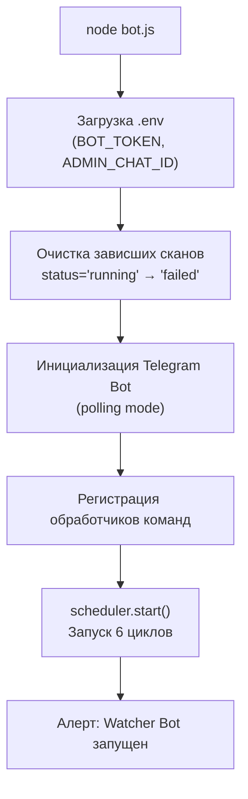
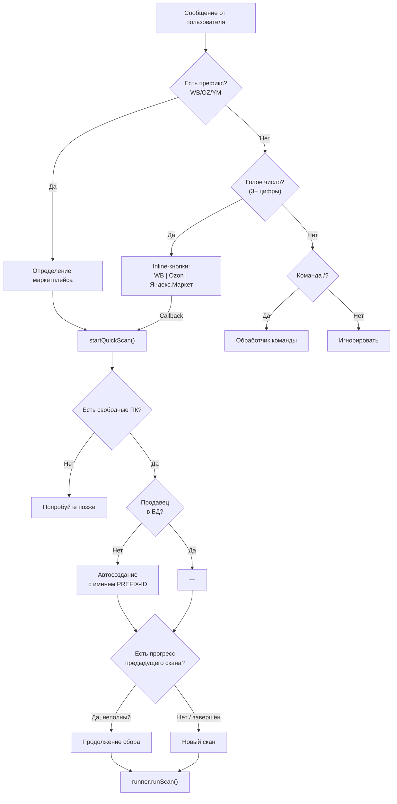
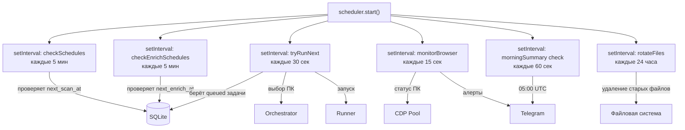
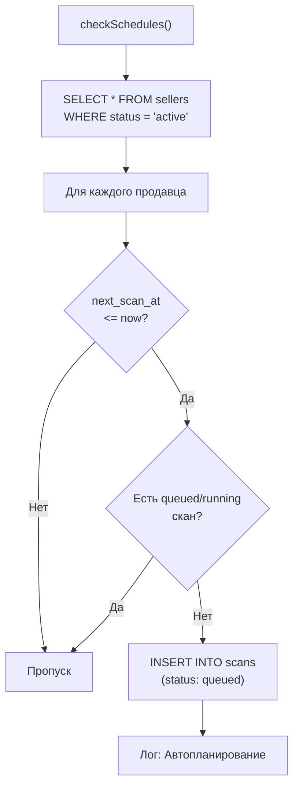

**Проект:** ADOLF — AI-Driven Operations Layer Framework  
**Модуль:** Watcher / Bot & Scheduler  
**Версия:** 4.0  
**Дата:** Февраль 2026

---

## 2.1 Обзор

Telegram-бот (`bot.js`) — точка входа и основной интерфейс управления подсистемой Collector. Процесс `bot.js` объединяет в себе четыре функциональных модуля:

| Модуль | Файл | Роль |
|--------|------|------|
| Telegram Bot | bot.js | Приём команд, отправка отчётов и алертов |
| Scheduler | scheduler.js | Циклические задачи: расписания, очередь, мониторинг |
| Orchestrator | orchestrator.js | Выбор ПК для задач (описан в [Разделе 3](/watcher/adolf_watcher_3_orchestrator_runner)) |
| Runner | runner.js | Запуск сканеров/обогатителей (описан в [Разделе 3](/watcher/adolf_watcher_3_orchestrator_runner)) |

Запуск: `node bot.js` (systemd: `watcher-bot.service`).

### Конфигурация

Переменные окружения (`.env`):

| Переменная | Описание |
|------------|----------|
| `BOT_TOKEN` | Токен Telegram-бота (обязательно) |
| `ADMIN_CHAT_ID` | ID чата администратора (обязательно) |

Доступ к боту ограничен проверкой `msg.chat.id === ADMIN_CHAT_ID` на каждую команду.

### Инициализация при запуске

При старте `bot.js` выполняет последовательность:



Очистка зависших сканов гарантирует, что задачи, прерванные аварийным рестартом, не блокируют очередь. Они помечаются как `failed` с пометкой `Orphaned (bot restart)`.

---

## 2.2 Команды бота

### Быстрый скан

Самый частый сценарий — отправка ID продавца с префиксом маркетплейса.

| Ввод | Маркетплейс | Пример |
|------|-------------|--------|
| `WB<id>` | Wildberries | `WB1025130` |
| `OZ<id>` или `OZON<id>` | Ozon | `OZ465656` |
| `YM<id>` | Яндекс.Маркет | `YM213246` |
| Голое число | Выбор кнопками | `1025130` |



Быстрый скан автоматически создаёт продавца в БД (если не существует) с именем `PREFIX-ID` и приоритетом `normal`. Если на диске есть незавершённый файл `results_seller_<id>.json`, сканер продолжит сбор с последней точки.

### Управление продавцами

| Команда | Синтаксис | Описание |
|---------|-----------|----------|
| `/add` | `/add <mp> <id> "<имя>" [приоритет]` | Добавить продавца. `mp`: wb, oz, ym. Приоритет: low, normal, high, critical |
| `/list` | `/list` | Список всех продавцов с приоритетами, расписаниями и датой последнего скана |
| `/remove` | `/remove <id>` | Пометить продавца как removed (мягкое удаление) |
| `/pause` | `/pause <id>` | Приостановить сканирование продавца |
| `/resume` | `/resume <id>` | Возобновить сканирование |
| `/priority` | `/priority <id> <уровень>` | Изменить приоритет (low, normal, high, critical) |
| `/schedule` | `/schedule <id> <часы>` | Изменить интервал сканирования (в часах) |
| `/autoenrich` | `/autoenrich <id> [часы]` | Настроить автообогащение. 0 = отключить, по умолчанию 24ч |

Пример добавления продавца:

```
/add wb 1025130 "Конкурент А" high
```

Ответ:

```
✅ Добавлен:
• Конкурент А (wildberries)
• ID: 1025130
• Приоритет: high
```

### Управление задачами

| Команда | Синтаксис | Описание |
|---------|-----------|----------|
| `/scan` | `/scan <id>` | Ручной запуск сканирования. Если нет свободных ПК — задача попадает в очередь |
| `/enrich` | `/enrich <id>` | Ручной запуск обогащения. Требует предварительного скана |
| `/newscan` | `/newscan <id>` | Удалить прогресс предыдущего скана и начать заново |
| `/queue` | `/queue` | Текущая очередь и выполняемые задачи |
| `/running` | `/running` | Активные задачи с временем выполнения и портами ПК |
| `/history` | `/history [N]` | История последних N сканов (по умолчанию 10) |
| `/retry` | `/retry` | Переставить все упавшие задачи в очередь |

### Результаты

| Команда | Синтаксис | Описание |
|---------|-----------|----------|
| `/result` | `/result <id>` | Краткий отчёт последнего скана: товаров, диапазон цен, рейтинг, время |
| `/diff` | `/diff <id>` | Сравнение двух последних сканов: новые, исчезнувшие, изменения цен |
| `/file` | `/file <id>` | Скачать JSON-файл последнего скана (`results_seller_<id>.json`) |

### Инфраструктура

| Команда | Синтаксис | Описание |
|---------|-----------|----------|
| `/status` | `/status` | Общий статус: ПК (online/offline/busy/free), продавцов, очередь, выполнено, ошибки |
| `/pc` | `/pc` | Детали каждого ПК: имя, порт, браузер, ОС, задач выполнено, время последнего ответа |
| `/screenshot` | `/screenshot` | Скриншот текущей страницы первого доступного ПК |
| `/summary` | `/summary` | Ручной вызов утренней сводки |

### Главное меню (/start, /help)

Команда `/start` или `/help` отображает справку и inline-клавиатуру для быстрого доступа:

```
┌─────────────────────────────────────────┐
│  📊 Статус  │  🖥️ ПК   │  📷 Скриншот │
├─────────────────────────────────────────┤
│  📋 Продавцы │  ⏳ Очередь │  📜 История │
├─────────────────────────────────────────┤
│  🔄 Повторить упавшие  │  📊 Сводка   │
└─────────────────────────────────────────┘
```

Нажатие кнопки генерирует синтетическое сообщение с соответствующей командой (`/status`, `/pc`, `/screenshot`, `/list`, `/queue`, `/history`, `/retry`, `/summary`), которое обрабатывается стандартными обработчиками.

---

## 2.3 Поведение уведомлений

### Отправка результатов в Telegram

| Событие | Текстовый отчёт | JSON-файл |
|---------|:---------------:|:---------:|
| Завершение скана (ручной или автоматический) | ✅ | ❌ |
| Ручной `/enrich` | ✅ | ✅ |
| Автообогащение (по расписанию) | ✅ | ❌ |
| Ошибка задачи | ✅ (с описанием ошибки) | ❌ |

Принцип: JSON-файлы отправляются только при ручном запуске обогащения. Все остальные данные хранятся на диске и доступны через REST API.

### Формат отчёта о скане

```
✅ Сканирование завершено

Продавец: Конкурент А
Маркетплейс: Wildberries
ID: 1025130
Товаров найдено: 142
Диапазон цен: 590 – 8 900₽
Средний рейтинг: 4.6
Время сканирования: 95 мин
Браузер: moscow-ivan
```

### Алерты мониторинга ПК

| Событие | Сообщение |
|---------|-----------|
| ПК подключился | `🟢 ПК подключился: moscow-ivan (порт 9301)` + версия Chrome |
| ПК отключился | `🔴 ПК отключился: moscow-ivan (порт 9301)` |
| Первый запуск (ПК уже online) | `🟢 ПК онлайн: moscow-ivan (порт 9301)` |

Мониторинг сравнивает текущее состояние каждого ПК с предыдущим (`previousPcStates`). Алерты отправляются только при смене состояния. Первый опрос после старта бота сообщает обо всех найденных ПК как `онлайн`.

---

## 2.4 Планировщик (scheduler.js)

### Архитектура

Scheduler запускается вызовом `scheduler.start()` из `bot.js` при инициализации. Все циклы работают на `setInterval` внутри единого процесса Node.js.



### Цикл 1: checkSchedules — расписания сканов

Интервал: `scheduler.scheduleCheckIntervalMs` (по умолчанию 5 мин).

Логика: перебирает всех активных продавцов, проверяет `next_scan_at`. Если время наступило и нет активной/ожидающей задачи для данного продавца — создаёт запись в `scans` со статусом `queued`.



### Цикл 2: checkEnrichSchedules — расписания обогащения

Интервал: `scheduler.enrichCheckIntervalMs` (по умолчанию 5 мин).

Аналогичен циклу 1, но проверяет `next_enrich_at` и создаёт задачи с `task_type = 'enrich'`, `source = 'auto'`. Дополнительно проверяет наличие файла скана на диске — без него обогатитель не сможет работать.

### Цикл 3: tryRunNext — запуск из очереди

Интервал: `scheduler.tryRunNextIntervalMs` (по умолчанию 30 сек).

Основной цикл диспетчеризации. Обрабатывает два типа задач.

**Scan-задачи** (требуют ПК):

1. Получить список `queued` scan-задач из БД
2. Запросить количество свободных ПК через CDP Pool (`/summary`)
3. Для каждой задачи (до количества свободных ПК): вызвать `orchestrator.choosePC()` → `runner.runScan()`
4. Задержка 500 мс между запусками (чтобы `/acquire` успел пометить ПК как busy)

**Enrich-задачи** (WB без CDP, Ozon/YM — с CDP):

1. Проверить лимит параллельного обогащения (`scheduler.enrichLimit`, по умолчанию 2)
2. Для CDP-маркетплейсов: запросить ПК через оркестратор
3. Для WB (HTTP only): запуск без выделения ПК
4. Файл отправляется в Telegram только при `source = 'manual'`

```mermaid
flowchart TB
    TICK["tryRunNext()"] --> SCANS["Получить queued scan-задачи"]
    SCANS --> FREE{"Свободные ПК > 0?"}
    FREE -->|Нет| ENRICH_PHASE
    FREE -->|Да| SCAN_LOOP["Для каждой задачи<br/>(до кол-ва свободных ПК)"]
    SCAN_LOOP --> CHOOSE["orchestrator.choosePC()"]
    CHOOSE -->|null| NEXT_TASK["Следующая задача"]
    CHOOSE -->|ПК найден| RUN_SCAN["runner.runScan(task, port)"]
    RUN_SCAN --> DELAY["Задержка 500 мс"]
    DELAY --> NEXT_TASK

    NEXT_TASK --> ENRICH_PHASE["Получить queued enrich-задачи"]
    ENRICH_PHASE --> LIMIT{"enrichRunning<br/>&lt; enrichLimit?"}
    LIMIT -->|Нет| END["Конец цикла"]
    LIMIT -->|Да| ENRICH_LOOP["Для каждой enrich-задачи"]
    ENRICH_LOOP --> NEEDS_CDP{"Нужен CDP?<br/>(Ozon, YM)"}
    NEEDS_CDP -->|Да| CHOOSE_E["orchestrator.choosePC()"]
    NEEDS_CDP -->|Нет (WB)| RUN_ENRICH["runner.runEnrich(task, null)"]
    CHOOSE_E -->|null| SKIP_E["Пропуск"]
    CHOOSE_E -->|ПК| RUN_ENRICH_CDP["runner.runEnrich(task, port)"]
```

### Цикл 4: monitorBrowser — мониторинг ПК

Интервал: `scheduler.monitorIntervalMs` (по умолчанию 15 сек).

Запрашивает `/status` у CDP Pool и сравнивает с предыдущим состоянием каждого ПК. Отправляет алерты при изменении: подключение, отключение, удаление из пула.

Хранение состояния — in-memory объект `previousPcStates: { name: { alive, browser } }`. Не персистентный — при рестарте бота первый опрос сообщает обо всех найденных ПК как «онлайн».

### Цикл 5: rotateFiles — ротация файлов

Интервал: `scheduler.rotationIntervalMs` (по умолчанию 24 часа).

Удаляет старые файлы результатов по двум директориям:

| Директория | Параметр лимита | По умолчанию |
|------------|----------------|:------------:|
| `results/catalog/` | `scheduler.catalogKeepPerSeller` | 10 файлов |
| `results/enriched/` | `scheduler.enrichedKeepPerSeller` | 30 файлов |

Логика ротации: файлы группируются по ключу `{mp}_seller_{id}`, сортируются по дате (из имени файла), самые старые сверх лимита удаляются.

### Цикл 6: morningSummary — утренняя сводка

Проверка: каждую минуту, срабатывает при совпадении UTC-часа и минуты с параметрами `scheduler.morningSummaryUtcHour` и `scheduler.morningSummaryUtcMinute` (по умолчанию 05:00 UTC = 08:00 MSK).

Формат сводки:

```
📊 Утренняя сводка

ПК: 🟢 moscow-ivan, moscow-anna
Продавцов: 12
В очереди: 3
Выполняется: 1
Завершено: 287
Ошибок: 2

Последние сканы:
✅ Конкурент А — 142 шт.
✅ Конкурент Б — 89 шт.
❌ Конкурент В — 0 шт.
```

---

## 2.5 Параметры конфигурации планировщика

Все параметры управляются через `config.json` (модуль `config.js`).

### Параметры с hot-reload

Изменения применяются мгновенно (через `fs.watchFile`), без перезапуска сервиса.

| Параметр | По умолчанию | Мин | Макс | Описание |
|----------|:------------:|:---:|:----:|----------|
| `scheduler.defaultScanScheduleHours` | 72 | 1 | 720 | Интервал сканирования для новых продавцов (часы) |
| `scheduler.defaultEnrichScheduleHours` | 24 | 1 | 720 | Интервал обогащения для новых продавцов (часы) |
| `scheduler.enrichLimit` | 2 | 1 | 20 | Макс. параллельных обогащений |
| `scheduler.catalogKeepPerSeller` | 10 | 1 | 100 | Файлов сканов на продавца |
| `scheduler.enrichedKeepPerSeller` | 30 | 1 | 200 | Файлов обогащений на продавца |
| `scheduler.morningSummaryUtcHour` | 5 | 0 | 23 | Час утренней сводки (UTC) |
| `scheduler.morningSummaryUtcMinute` | 0 | 0 | 59 | Минута утренней сводки (UTC) |

### Параметры без hot-reload

Применяются после перезапуска `watcher-bot.service`. Это интервалы `setInterval`, которые устанавливаются однократно при `scheduler.start()`.

| Параметр | По умолчанию | Мин | Макс | Описание |
|----------|:------------:|:---:|:----:|----------|
| `scheduler.scheduleCheckIntervalMs` | 300 000 (5 мин) | 10 000 | 3 600 000 | Проверка расписаний сканов |
| `scheduler.enrichCheckIntervalMs` | 300 000 (5 мин) | 10 000 | 3 600 000 | Проверка расписаний обогащения |
| `scheduler.tryRunNextIntervalMs` | 30 000 (30 сек) | 5 000 | 600 000 | Цикл запуска из очереди |
| `scheduler.monitorIntervalMs` | 15 000 (15 сек) | 5 000 | 300 000 | Мониторинг ПК |
| `scheduler.rotationIntervalMs` | 86 400 000 (24 ч) | 3 600 000 | 604 800 000 | Ротация файлов |

---

## 2.6 Обработка ошибок

### На уровне бота

| Ситуация | Поведение |
|----------|-----------|
| Неизвестная команда | Ответ: `❓ Неизвестная команда. /help для списка.` |
| Продавец не найден | Поиск по всем маркетплейсам; если не найден: `❌ Продавец X не найден` |
| Нет свободных ПК при `/scan` | Задача добавляется в очередь: `⏳ Нет свободных ПК. Добавлен в очередь.` |
| Нет свободных ПК при быстром скане | Сообщение: `⏳ Нет свободных ПК. Попробуйте позже.` |
| Нет скана для `/enrich` | `❌ Нет завершённого скана. Сначала /scan <id>` |
| Обогащение уже запущено | `⏳ Обогащение для X уже в процессе` |

### На уровне планировщика

| Ситуация | Поведение |
|----------|-----------|
| CDP Pool недоступен при tryRunNext | Fallback: если runner не занят, пытается запустить одну задачу |
| Оркестратор вернул null | Задача пропускается в текущем цикле, будет повторена через 30 сек |
| Ошибка запуска задачи | `db.updateScanFailed`, лог в консоль |
| CDP Pool недоступен при monitorBrowser | Пропуск цикла мониторинга |
| Нет файла скана для автообогащения | Пропуск задачи с логом: `Пропуск автообогащения: нет файла скана` |

### При рестарте процесса

Все задачи со статусом `running` помечаются как `failed` с сообщением `Orphaned (bot restart)`. Это предотвращает зависание очереди.

---

## 2.7 Экспортируемые функции

### bot.js

Не экспортирует функций — является точкой входа (`node bot.js`).

Внутренние функции, доступные обработчикам:

| Функция | Описание |
|---------|----------|
| `isAdmin(msg)` | Проверка `msg.chat.id === ADMIN_CHAT_ID` |
| `sendAlert(text)` | Отправка Markdown-сообщения в `ADMIN_CHAT_ID` |
| `startQuickScan(msg, sellerId, marketplace)` | Полный цикл быстрого скана: проверка ПК, автосоздание продавца, resume, запуск |

### scheduler.js

| Функция | Описание |
|---------|----------|
| `start()` | Запуск всех 6 циклов |
| `setAlertFn(fn)` | Установка функции для отправки алертов (передаётся `sendAlert` из bot.js) |
| `setSendFileFn(fn)` | Установка функции для отправки файлов (передаётся `bot.sendDocument`) |
| `tryRunNext()` | Ручной вызов цикла запуска (используется из `/enrich` для немедленного старта) |
| `getMorningSummary()` | Генерация текста утренней сводки (используется в `/summary`) |

---

**Документ подготовлен:** Февраль 2026  
**Версия:** 4.0  
**Статус:** Черновик
