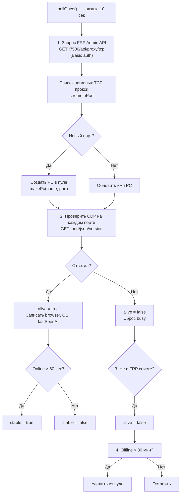
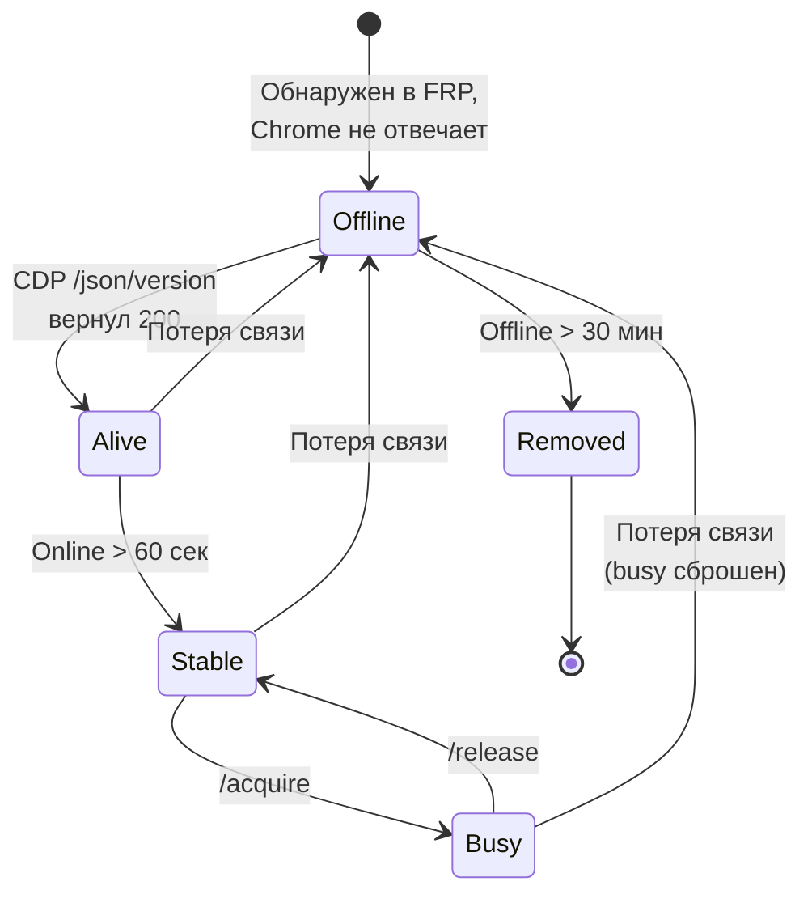
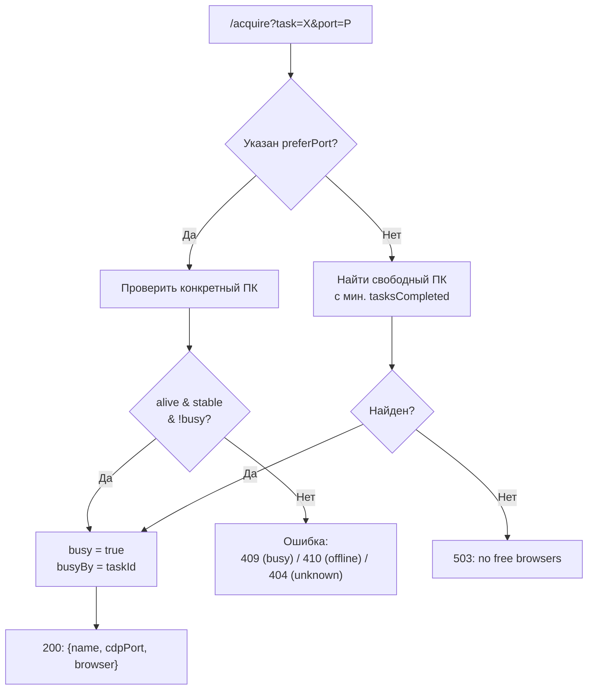
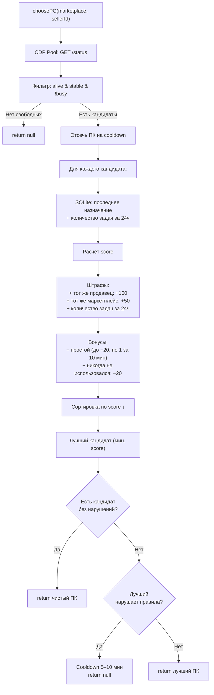
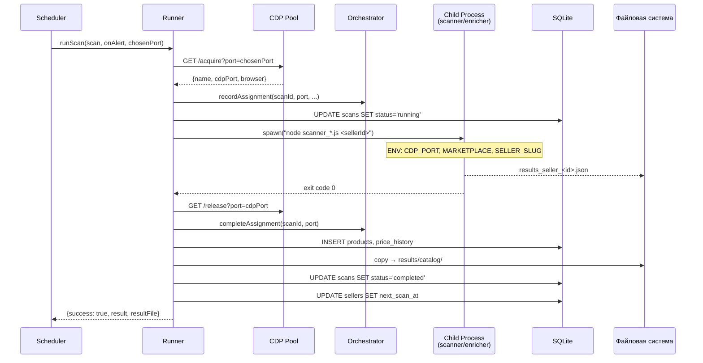
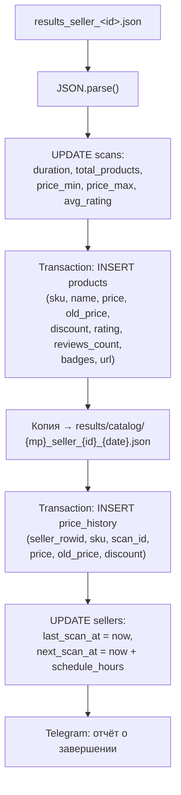
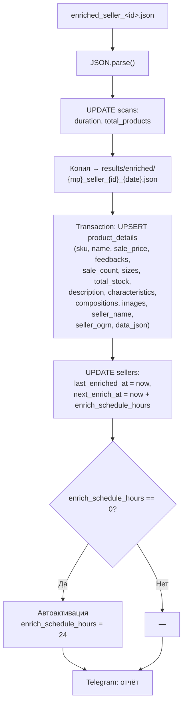
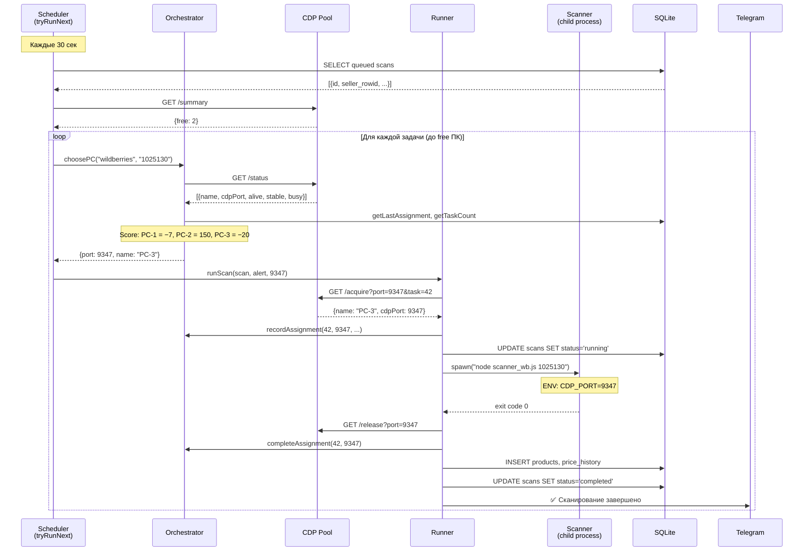

**Проект:** ADOLF — AI-Driven Operations Layer Framework  
**Модуль:** Watcher / Orchestrator & Runner  
**Версия:** 4.0  
**Дата:** Февраль 2026

---

## 3.1 Обзор

Раздел описывает три модуля, обеспечивающих выбор ПК, управление пулом браузеров и выполнение задач сбора данных.

| Модуль | Файл | Процесс | Роль |
|--------|------|---------|------|
| CDP Pool | cdp-pool.js | `cdp-pool.service` (:3000) | Обнаружение, мониторинг и блокировка браузеров |
| Orchestrator | orchestrator.js | внутри `bot.js` | Выбор оптимального ПК для задачи |
| Runner | runner.js | внутри `bot.js` | Запуск сканеров/обогатителей как дочерних процессов |

Цепочка вызовов: `scheduler.tryRunNext()` → `orchestrator.choosePC()` → `cdp.acquireBrowser()` → `runner.runScan()` / `runner.runEnrich()`.

---

## 3.2 CDP Pool (cdp-pool.js)

Автономный HTTP-сервис на порту 3000 (localhost). Управляет жизненным циклом подключений к Chrome-браузерам на домашних ПК через FRP-туннели.

### Цикл обнаружения

CDP Pool каждые 10 секунд выполняет полный цикл обнаружения и проверки.



### Состояния ПК



Только ПК в состоянии `Stable` (alive + stable + не busy) доступны для назначения задач.

### Структура объекта PC

| Поле | Тип | Описание |
|------|-----|----------|
| `name` | string | Имя ПК (из FRP: `cdp-<name>` → `<name>`) |
| `cdpPort` | number | Порт на VPS (9300–9399) |
| `alive` | boolean | CDP отвечает |
| `stable` | boolean | Online более 60 секунд |
| `busy` | boolean | Занят задачей |
| `busyBy` | string/null | ID задачи, занявшей ПК |
| `clientIP` | string/null | IP клиента (зарезервировано) |
| `browser` | string/null | Версия Chrome (из `/json/version`) |
| `os` | string/null | ОС (из User-Agent) |
| `connectedAt` | ISO string | Время обнаружения |
| `lastSeenAt` | ISO string | Время последнего ответа CDP |
| `tasksCompleted` | number | Счётчик выполненных задач |

### HTTP API (:3000)

| Метод | Endpoint | Описание | Ответ |
|-------|----------|----------|-------|
| GET | `/status` | Список всех ПК | `[{name, cdpPort, alive, stable, busy, ...}]` |
| GET | `/summary` | Агрегированная статистика | `{total, online, stable, busy, free}` |
| GET | `/acquire?task=X&port=P` | Занять ПК для задачи | 200: `{name, cdpPort, browser}` |
| GET | `/release?port=P` | Освободить ПК | 200: `{ok: true}` |
| GET | `/sync` | Принудительный цикл обнаружения | `{total, online, stable, busy, free}` |

### Логика /acquire



Если `preferPort` указан (от оркестратора) — используется конкретный ПК. Если нет — выбирается свободный с наименьшим `tasksCompleted` (балансировка нагрузки на уровне пула).

### Константы

| Константа | Значение | Описание |
|-----------|----------|----------|
| `POOL_PORT` | 3000 | Порт HTTP API |
| `FRP_API_PORT` | 7500 | Порт FRP Admin API |
| `POLL_INTERVAL` | 10 000 мс | Интервал обнаружения |
| `STABLE_AFTER_MS` | 60 000 мс | Время до стабильности |
| `OFFLINE_REMOVE_MS` | 1 800 000 мс (30 мин) | Время до удаления из пула |

---

## 3.3 Orchestrator (orchestrator.js)

Модуль выбора оптимального ПК для задачи. Реализует скоринговую модель, предотвращающую детектирование паттернов маркетплейсами.

### Алгоритм choosePC

Вход: `marketplace` (wildberries | ozon | yandex\_market), `sellerId`.



### Скоринговая модель

| Фактор | Влияние на score | Описание |
|--------|:----------------:|----------|
| Тот же продавец | +100 | Последняя задача на этом ПК была для того же продавца |
| Тот же маркетплейс | +50 | Последняя задача на том же маркетплейсе |
| Количество задач | +N | Число задач за последние 24 часа |
| Простой | −(до 20) | 1 балл за каждые 10 мин простоя (макс. −20) |
| Никогда не использовался | −20 | Максимальный бонус для нового ПК |

Пример расчёта для 3 ПК при задаче `wildberries / seller_123`:

| ПК | Последняя задача | Задач/24ч | Простой | Score |
|:--:|:----------------:|:---------:|:-------:|:-----:|
| PC-1 | ozon / seller\_456 | 5 | 2ч | 5 − 12 = −7 |
| PC-2 | wildberries / seller\_123 | 3 | 30мин | 100 + 50 + 3 − 3 = 150 |
| PC-3 | (нет) | 0 | — | 0 − 20 = −20 |

Результат: выбран PC-3 (score −20, наименьший).

### Cooldown

Если **все** кандидаты нарушают правила чередования (тот же продавец или маркетплейс), оркестратор устанавливает cooldown для лучшего кандидата и возвращает `null`.

| Параметр | Значение | Hot-reload | Описание |
|----------|:--------:|:----------:|----------|
| `orchestrator.cooldownMinMs` | 300 000 (5 мин) | Да | Минимальный cooldown |
| `orchestrator.cooldownMaxMs` | 600 000 (10 мин) | Да | Максимальный cooldown |

Cooldown хранится in-memory (`Map: port → cooldownUntil`). Очищается при завершении задачи на данном ПК (`completeAssignment`).

### История назначений

Оркестратор записывает каждое назначение в SQLite-таблицу `assignments`:

```sql
CREATE TABLE assignments (
    id INTEGER PRIMARY KEY AUTOINCREMENT,
    scan_id INTEGER REFERENCES scans(id),
    pc_port INTEGER NOT NULL,
    pc_name TEXT,
    marketplace TEXT NOT NULL,
    seller_id TEXT NOT NULL,
    started_at TEXT DEFAULT (datetime('now')),
    completed_at TEXT
);
```

Функции:

| Функция | Описание |
|---------|----------|
| `recordAssignment(scanId, port, name, mp, sellerId)` | Запись нового назначения |
| `completeAssignment(scanId, port)` | Установка `completed_at`, очистка cooldown |
| `nextCooldownExpiry()` | Секунд до ближайшего освобождения cooldown |

### Параметры конфигурации

| Параметр | По умолчанию | Мин | Макс | Hot-reload | Описание |
|----------|:------------:|:---:|:----:|:----------:|----------|
| `orchestrator.cooldownMinMs` | 300 000 | 0 | 3 600 000 | Да | Мин. cooldown |
| `orchestrator.cooldownMaxMs` | 600 000 | 0 | 7 200 000 | Да | Макс. cooldown |
| `orchestrator.penaltySameSeller` | 100 | 0 | 1 000 | Да | Штраф за того же продавца |
| `orchestrator.penaltySameMarketplace` | 50 | 0 | 1 000 | Да | Штраф за тот же маркетплейс |
| `orchestrator.idleBonusMax` | 20 | 0 | 100 | Да | Макс. бонус за простой |
| `orchestrator.idleBonusIntervalMs` | 600 000 (10 мин) | 60 000 | 3 600 000 | Да | Интервал начисления бонуса |
| `orchestrator.neverUsedBonus` | 20 | 0 | 100 | Да | Бонус для нового ПК |

Кросс-валидация: `cooldownMinMs` ≤ `cooldownMaxMs`.

---

## 3.4 Runner (runner.js)

Модуль запуска и управления задачами сбора данных. Выполняет сканеры и обогатители как дочерние процессы Node.js (`child_process.spawn`).

### Архитектура запуска



### Типы задач

| Тип | Карта скриптов | Таймаут | Повтор | CDP |
|-----|---------------|:-------:|:------:|:---:|
| scan | `SCANNER_MAP` | 3 часа | До 3 раз | Всегда |
| enrich | `ENRICHER_MAP` | 30 мин | Нет | WB: нет; Ozon, YM: да |

Карты скриптов:

```
SCANNER_MAP:
  wildberries   → /opt/watcher/SKILL/scanner_wb.js
  ozon          → /opt/watcher/SKILL/scanner_ozon.js
  yandex_market → /opt/watcher/SKILL/scanner_ymarket.js

ENRICHER_MAP:
  wildberries   → /opt/watcher/SKILL/enricher_wb.js
  ozon          → /opt/watcher/SKILL/enricher_ozon.js
  yandex_market → /opt/watcher/SKILL/enricher_ymarket.js

ENRICHER_NEEDS_CDP:
  ozon: true
  yandex_market: true
  (wildberries — HTTP, без CDP)
```

### Параметры дочернего процесса

**Аргументы командной строки:**

| Аргумент | Позиция | Описание |
|----------|:-------:|----------|
| `sellerId` | 1 | ID продавца на маркетплейсе |
| `resultDir` | 2 | Директория для записи результатов (`/opt/watcher/results`) |

**Переменные окружения:**

| Переменная | Описание | Наличие |
|------------|----------|---------|
| `CDP_PORT` | Порт Chrome CDP на VPS | Scan: всегда; Enrich: только Ozon/YM |
| `MARKETPLACE` | Идентификатор маркетплейса | Только scan |
| `SELLER_SLUG` | Slug продавца (для URL) | Только scan |

**stdio:** stdin — ignore, stdout/stderr — pipe в лог-файл.

### Обработка результатов скана

При exit code 0 и наличии файла `results_seller_<id>.json`:



Обе вставки (`products` и `price_history`) выполняются в транзакциях (`db.transaction`) для атомарности.

### Обработка результатов обогащения

При exit code 0 и наличии файла `enriched_seller_<id>.json`:



Автоактивация: при первом обогащении продавца с `enrich_schedule_hours = 0` автоматически устанавливается расписание из `scheduler.defaultEnrichScheduleHours` (24ч).

### Обработка ошибок

| Ситуация | Поведение |
|----------|-----------|
| Exit code ≠ 0 | `scans.status = 'failed'`, `error_message = 'Exit code: N'` |
| Файл результата отсутствует | Аналогично exit code ≠ 0 |
| Ошибка парсинга JSON | `scans.status = 'failed'`, `error_message = 'Parse error: ...'` |
| Таймаут (scan: 3ч, enrich: 30мин) | `SIGTERM` дочернему процессу, освобождение ПК |
| Pool недоступен при acquire | Исключение, обработка в scheduler |
| Нет свободных браузеров | Исключение, обработка в scheduler |

### Автоповтор (только scan)

При `exit code ≠ 0`, если `retry_count < maxRetries`:

1. Создаётся новая запись в `scans` для того же продавца (`status: queued`)
2. Отправляется алерт: `🔄 Автоповтор (попытка N/3)`
3. Новая задача будет подхвачена `scheduler.tryRunNext()` в следующем цикле

`retry_count` инкрементируется на уровне БД при создании повторной задачи. После 3 неудачных попыток задача остаётся в `failed` без автоповтора.

Обогащение не имеет автоповтора — при необходимости перезапускается вручную через `/enrich`.

### Параллельность

Runner поддерживает одновременное выполнение нескольких задач:

| Трекер | Хранилище | Описание |
|--------|-----------|----------|
| `runningTasks` | `Map<scanId, taskInfo>` | Активные scan-задачи |
| `runningEnrichTasks` | `Map<scanId, taskInfo>` | Активные enrich-задачи |

Лимит scan-задач определяется количеством свободных ПК в CDP Pool. Лимит enrich-задач — параметром `scheduler.enrichLimit` (по умолчанию 2).

Структура `taskInfo`:

| Поле | Тип | Описание |
|------|-----|----------|
| `scanId` | number | ID задачи в `scans` |
| `sellerId` | string | ID продавца |
| `sellerName` | string | Имя продавца |
| `startedAt` | number | `Date.now()` при запуске |
| `cdpPort` | number/null | Порт CDP (null для WB enrich) |
| `taskType` | string | `'enrich'` (только для enrich-задач) |

### Параметры конфигурации

| Параметр | По умолчанию | Мин | Макс | Hot-reload | Описание |
|----------|:------------:|:---:|:----:|:----------:|----------|
| `runner.scanTimeoutMs` | 10 800 000 (3 ч) | 60 000 | 86 400 000 | Да | Таймаут сканирования |
| `runner.enrichTimeoutMs` | 1 800 000 (30 мин) | 60 000 | 86 400 000 | Да | Таймаут обогащения |
| `runner.maxRetries` | 3 | 0 | 10 | Да | Макс. автоповторов (scan) |

---

## 3.5 CDP Client Module (cdp.js)

Модуль-клиент для взаимодействия с CDP Pool из bot.js / runner.js.

| Функция | HTTP-вызов | Описание |
|---------|------------|----------|
| `getPoolSummary()` | `GET :3000/summary` | `{total, online, stable, busy, free}` |
| `getPoolStatus()` | `GET :3000/status` | Массив объектов ПК |
| `acquireBrowser(taskId, preferPort)` | `GET :3000/acquire?task=X&port=P` | Занять ПК; `null` если нет свободных |
| `releaseBrowser(port)` | `GET :3000/release?port=P` | Освободить ПК |
| `checkBrowser()` | `getPoolSummary + getPoolStatus` | Есть ли хотя бы один alive ПК (fallback) |
| `takeScreenshot(port)` | CDP `/json/list` + exec | Скриншот текущей страницы |

Таймауты: 3 сек для summary/status/release, 5 сек для acquire.

---

## 3.6 Утилиты (utils.js)

### computeDiff(current, previous)

Сравнение двух наборов продуктов по SKU. Используется командой `/diff`.

Вход: два массива объектов `{sku, name, price, ...}`.

Выход:

| Поле | Описание |
|------|----------|
| `newProducts` | Товары, присутствующие в current, но не в previous |
| `removed` | Товары, присутствующие в previous, но не в current |
| `priceChanges` | Товары с изменённой ценой (отсортированы по |%| убыванию) |

Каждый элемент `priceChanges` содержит: исходные поля товара + `prevPrice`, `change` (абсолютное), `pct` (процентное).

---

## 3.7 Полная цепочка выполнения

Диаграмма объединяет все три модуля раздела в единый поток:



---

**Документ подготовлен:** Февраль 2026  
**Версия:** 4.0  
**Статус:** Черновик
