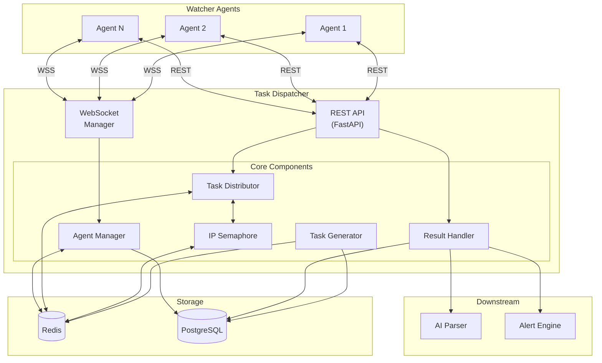
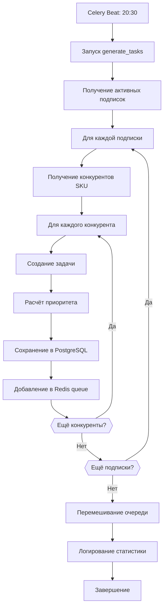
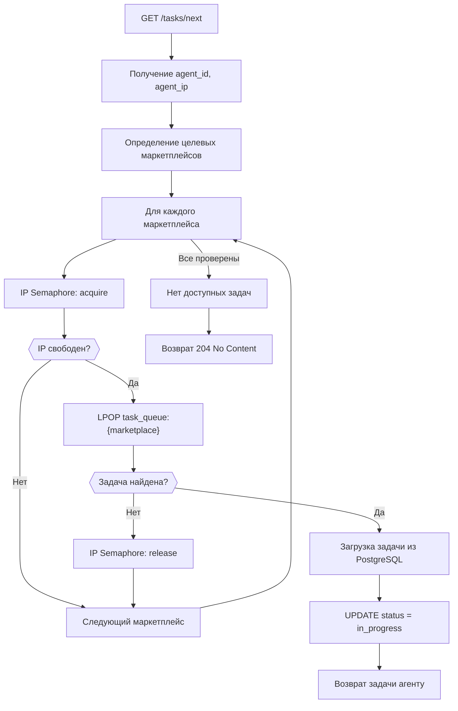
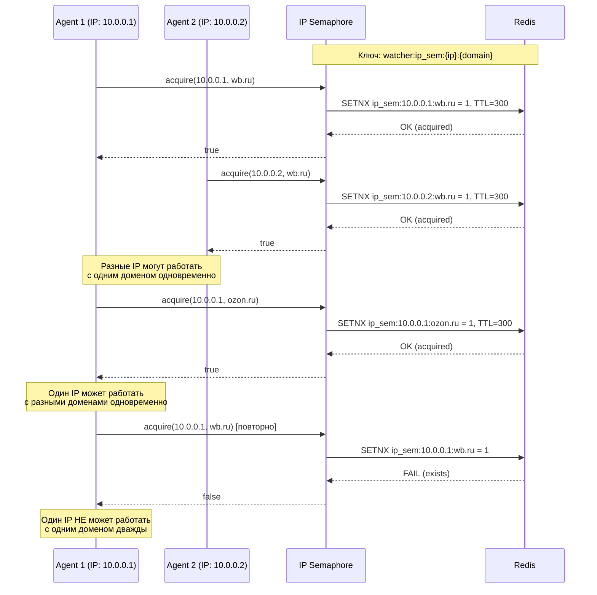
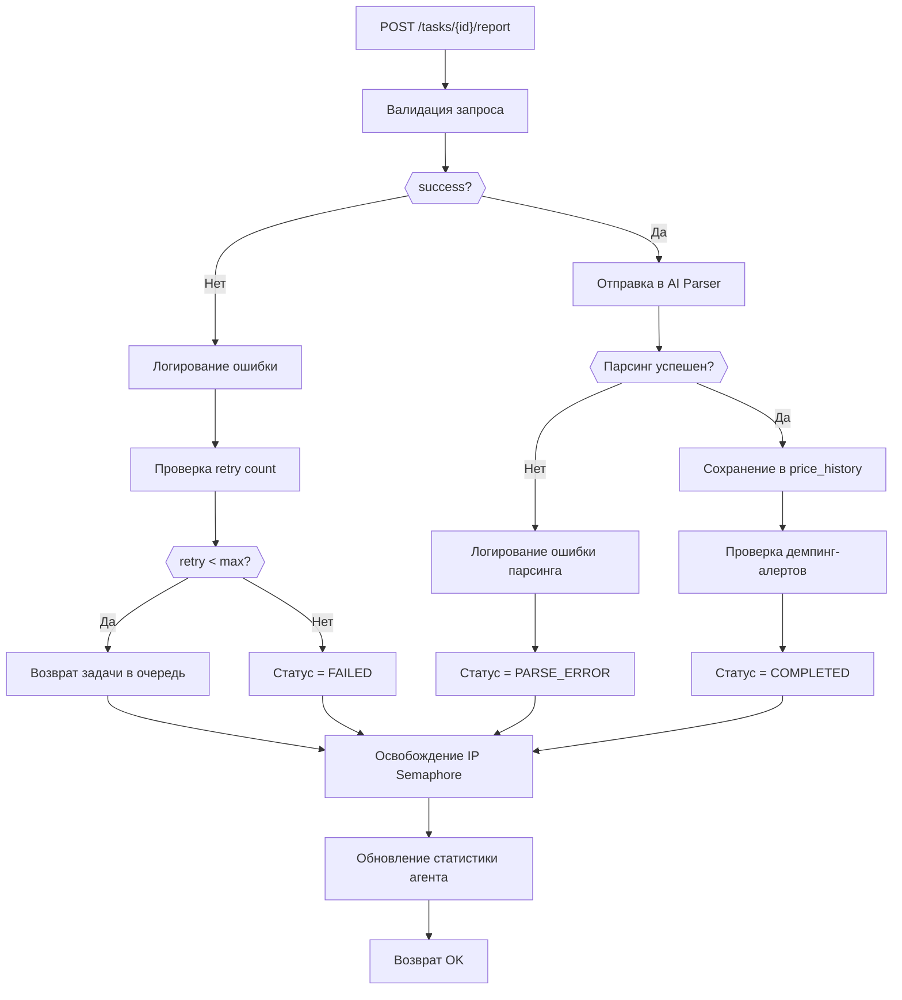

**Проект:** Интеллектуальная система мониторинга цен конкурентов  
**Модуль:** Watcher / Task Dispatcher  
**Версия:** 2.0  
**Дата:** Январь 2026

---

## 3.1 Обзор

### Назначение

Task Dispatcher — серверный компонент, отвечающий за:

- Генерацию задач парсинга на основе подписок
- Равномерное распределение задач между агентами
- Предотвращение коллизий IP-адресов (IP Semaphore)
- Обработку результатов и передачу в AI Parser
- Мониторинг состояния агентов
- Обработку команд управления

### Архитектура



---

## 3.2 REST API

### Endpoints

| Method | Path | Описание | Auth |
|--------|------|----------|------|
| `GET` | `/api/v1/watcher/tasks/next` | Получение следующей задачи | API Key |
| `POST` | `/api/v1/watcher/tasks/{id}/report` | Отправка результата | API Key |
| `POST` | `/api/v1/watcher/agents/heartbeat` | Heartbeat агента | API Key |
| `POST` | `/api/v1/watcher/agents/panic` | Сообщение о Panic Mode | API Key |
| `GET` | `/api/v1/watcher/config/emulation` | Получение настроек эмуляции | API Key |
| `POST` | `/api/v1/watcher/agents/{id}/command` | Отправка команды агенту | JWT (Admin) |
| `GET` | `/api/v1/watcher/agents` | Список агентов | JWT (Admin) |
| `GET` | `/api/v1/watcher/agents/{id}` | Информация об агенте | JWT (Admin) |
| `GET` | `/api/v1/watcher/tasks/stats` | Статистика задач | JWT (Manager+) |

### Реализация API

```python
# app/api/v1/watcher/router.py

from fastapi import APIRouter, Depends, HTTPException, status
from fastapi.security import HTTPBearer, HTTPAuthorizationCredentials
from typing import Optional
from datetime import datetime

from app.api.v1.watcher.schemas import (
    TaskResponse,
    TaskReportRequest,
    HeartbeatRequest,
    PanicRequest,
    EmulationConfigResponse,
    CommandRequest,
    AgentListResponse,
    AgentDetailResponse,
    TaskStatsResponse
)
from app.services.watcher.task_dispatcher import TaskDispatcher
from app.services.watcher.agent_manager import AgentManager
from app.core.auth import verify_api_key, verify_jwt, require_role


router = APIRouter(prefix="/api/v1/watcher", tags=["watcher"])
security = HTTPBearer()


# === Agent Endpoints (API Key Auth) ===

@router.get("/tasks/next", response_model=Optional[TaskResponse])
async def get_next_task(
    credentials: HTTPAuthorizationCredentials = Depends(security),
    dispatcher: TaskDispatcher = Depends(get_task_dispatcher)
):
    """
    Получение следующей задачи для агента.
    
    Returns:
        TaskResponse или 204 No Content если задач нет
    """
    agent = await verify_api_key(credentials.credentials)
    
    task = await dispatcher.get_next_task(
        agent_id=agent.id,
        agent_ip=agent.current_ip
    )
    
    if not task:
        raise HTTPException(status_code=status.HTTP_204_NO_CONTENT)
    
    return TaskResponse(
        id=task.id,
        url=task.url,
        marketplace=task.marketplace,
        sku=task.sku,
        competitor_id=task.competitor_id,
        priority=task.priority,
        created_at=task.created_at.isoformat()
    )


@router.post("/tasks/{task_id}/report")
async def submit_task_report(
    task_id: str,
    request: TaskReportRequest,
    credentials: HTTPAuthorizationCredentials = Depends(security),
    dispatcher: TaskDispatcher = Depends(get_task_dispatcher)
):
    """
    Отправка результата выполнения задачи.
    """
    agent = await verify_api_key(credentials.credentials)
    
    await dispatcher.process_report(
        task_id=task_id,
        agent_id=agent.id,
        raw_text=request.raw_text,
        timing_ms=request.timing_ms,
        success=request.success,
        error=request.error
    )
    
    return {"status": "ok"}


@router.post("/agents/heartbeat")
async def agent_heartbeat(
    request: HeartbeatRequest,
    credentials: HTTPAuthorizationCredentials = Depends(security),
    agent_manager: AgentManager = Depends(get_agent_manager)
):
    """
    Heartbeat от агента.
    """
    agent = await verify_api_key(credentials.credentials)
    
    await agent_manager.update_heartbeat(
        agent_id=agent.id,
        status=request.status,
        current_task=request.current_task,
        stats=request.stats
    )
    
    return {"status": "ok"}


@router.post("/agents/panic")
async def agent_panic(
    request: PanicRequest,
    credentials: HTTPAuthorizationCredentials = Depends(security),
    agent_manager: AgentManager = Depends(get_agent_manager)
):
    """
    Сообщение о Panic Mode от агента.
    """
    agent = await verify_api_key(credentials.credentials)
    
    await agent_manager.handle_panic(
        agent_id=agent.id,
        reason=request.reason,
        details=request.details
    )
    
    return {"status": "ok"}


@router.get("/config/emulation", response_model=EmulationConfigResponse)
async def get_emulation_config(
    credentials: HTTPAuthorizationCredentials = Depends(security),
    dispatcher: TaskDispatcher = Depends(get_task_dispatcher)
):
    """
    Получение глобальных настроек эмуляции.
    """
    await verify_api_key(credentials.credentials)
    
    config = await dispatcher.get_emulation_config()
    
    return EmulationConfigResponse(**config)


# === Admin Endpoints (JWT Auth) ===

@router.post("/agents/{agent_id}/command")
async def send_agent_command(
    agent_id: str,
    request: CommandRequest,
    credentials: HTTPAuthorizationCredentials = Depends(security),
    agent_manager: AgentManager = Depends(get_agent_manager)
):
    """
    Отправка команды агенту (только Admin).
    """
    user = await verify_jwt(credentials.credentials)
    require_role(user, ["admin"])
    
    success = await agent_manager.send_command(
        agent_id=agent_id,
        command=request.command,
        params=request.params
    )
    
    if not success:
        raise HTTPException(
            status_code=status.HTTP_503_SERVICE_UNAVAILABLE,
            detail="Agent not connected"
        )
    
    return {"status": "ok", "command": request.command}


@router.get("/agents", response_model=AgentListResponse)
async def list_agents(
    credentials: HTTPAuthorizationCredentials = Depends(security),
    agent_manager: AgentManager = Depends(get_agent_manager)
):
    """
    Список всех агентов (только Admin).
    """
    user = await verify_jwt(credentials.credentials)
    require_role(user, ["admin"])
    
    agents = await agent_manager.list_agents()
    
    return AgentListResponse(agents=agents)


@router.get("/agents/{agent_id}", response_model=AgentDetailResponse)
async def get_agent_detail(
    agent_id: str,
    credentials: HTTPAuthorizationCredentials = Depends(security),
    agent_manager: AgentManager = Depends(get_agent_manager)
):
    """
    Детальная информация об агенте (только Admin).
    """
    user = await verify_jwt(credentials.credentials)
    require_role(user, ["admin"])
    
    agent = await agent_manager.get_agent(agent_id)
    
    if not agent:
        raise HTTPException(status_code=404, detail="Agent not found")
    
    return AgentDetailResponse(**agent)


@router.get("/tasks/stats", response_model=TaskStatsResponse)
async def get_task_stats(
    credentials: HTTPAuthorizationCredentials = Depends(security),
    dispatcher: TaskDispatcher = Depends(get_task_dispatcher)
):
    """
    Статистика задач (Manager+).
    """
    user = await verify_jwt(credentials.credentials)
    require_role(user, ["manager", "senior", "director", "admin"])
    
    stats = await dispatcher.get_stats()
    
    return TaskStatsResponse(**stats)
```

### Схемы данных

```python
# app/api/v1/watcher/schemas.py

from pydantic import BaseModel, Field
from typing import Optional, List, Dict, Any
from datetime import datetime
from enum import Enum


class Marketplace(str, Enum):
    WB = "wildberries"
    OZON = "ozon"
    YM = "yandex_market"


class AgentStatus(str, Enum):
    IDLE = "idle"
    PREPARING = "preparing"
    READY = "ready"
    WORKING = "working"
    PAUSED = "paused"
    PANIC = "panic"
    OFFLINE = "offline"


class CommandType(str, Enum):
    STOP = "stop"
    PAUSE = "pause"
    RESUME = "resume"
    RELOAD_CONFIG = "reload_config"
    REBOOT_MODEM = "reboot_modem"
    REFRESH_COOKIES = "refresh_cookies"


# === Request Schemas ===

class TaskReportRequest(BaseModel):
    raw_text: str = Field(..., description="Сырой текст страницы")
    timing_ms: int = Field(..., ge=0, description="Время выполнения в мс")
    success: bool = Field(..., description="Успешность выполнения")
    error: Optional[str] = Field(None, description="Текст ошибки")


class HeartbeatRequest(BaseModel):
    status: AgentStatus = Field(..., description="Текущий статус агента")
    current_task: Optional[str] = Field(None, description="ID текущей задачи")
    stats: Optional[Dict[str, Any]] = Field(None, description="Статистика агента")


class PanicRequest(BaseModel):
    reason: str = Field(..., description="Причина panic mode")
    details: Dict[str, Any] = Field(default_factory=dict, description="Детали")


class CommandRequest(BaseModel):
    command: CommandType = Field(..., description="Команда")
    params: Dict[str, Any] = Field(default_factory=dict, description="Параметры")


# === Response Schemas ===

class TaskResponse(BaseModel):
    id: str
    url: str
    marketplace: Marketplace
    sku: str
    competitor_id: Optional[str]
    priority: int
    created_at: str


class EmulationConfigResponse(BaseModel):
    min_delay_ms: int
    max_delay_ms: int
    scroll_enabled: bool
    scroll_steps: int
    mouse_movement: bool
    mouse_curve: str
    page_view_min_ms: int
    page_view_max_ms: int
    random_order: bool


class AgentSummary(BaseModel):
    id: str
    name: str
    status: AgentStatus
    current_ip: Optional[str]
    last_heartbeat: Optional[datetime]
    tasks_completed_today: int
    tasks_failed_today: int


class AgentListResponse(BaseModel):
    agents: List[AgentSummary]


class AgentDetailResponse(BaseModel):
    id: str
    name: str
    status: AgentStatus
    current_ip: Optional[str]
    modem_operator: Optional[str]
    signal_strength: Optional[int]
    cookies_updated_at: Optional[datetime]
    last_heartbeat: Optional[datetime]
    current_task: Optional[str]
    tasks_completed_today: int
    tasks_failed_today: int
    avg_task_time_ms: Optional[int]
    version: str
    created_at: datetime


class TaskStatsResponse(BaseModel):
    total_queued: int
    total_in_progress: int
    total_completed_today: int
    total_failed_today: int
    by_marketplace: Dict[str, int]
    by_agent: Dict[str, int]
    avg_completion_time_ms: int
    estimated_completion_time: Optional[str]
```

---

## 3.3 Task Generator

### Назначение

Генерация задач парсинга на основе подписок (watcher_subscriptions) и списка конкурентов (watcher_competitors).

### Алгоритм генерации



### Реализация

```python
# app/services/watcher/task_generator.py

import uuid
from datetime import datetime, date
from typing import List, Dict
import random

from sqlalchemy.ext.asyncio import AsyncSession
from sqlalchemy import select, and_

from app.models.watcher import (
    WatcherSubscription,
    WatcherCompetitor,
    WatcherTask,
    TaskStatus
)
from app.core.redis import RedisClient


class TaskGenerator:
    """Генератор задач парсинга."""
    
    MARKETPLACE_URLS = {
        "wildberries": "https://www.wildberries.ru/catalog/{sku}/detail.aspx",
        "ozon": "https://www.ozon.ru/product/{sku}/",
        "yandex_market": "https://market.yandex.ru/product/{sku}"
    }
    
    def __init__(self, db: AsyncSession, redis: RedisClient):
        self.db = db
        self.redis = redis
    
    async def generate_daily_tasks(self) -> Dict[str, int]:
        """
        Генерация задач на ночь.
        
        Returns:
            Статистика: {marketplace: count}
        """
        stats = {"wildberries": 0, "ozon": 0, "yandex_market": 0}
        tasks_batch = []
        
        # 1. Получение активных подписок
        subscriptions = await self._get_active_subscriptions()
        
        for subscription in subscriptions:
            # 2. Задача для собственного SKU
            task = self._create_task(
                sku=subscription.sku,
                marketplace=subscription.marketplace,
                brand_id=subscription.brand_id,
                competitor_id=None,
                priority=subscription.priority or 0
            )
            tasks_batch.append(task)
            stats[subscription.marketplace] += 1
            
            # 3. Задачи для конкурентов
            competitors = await self._get_competitors(
                sku=subscription.sku,
                marketplace=subscription.marketplace
            )
            
            for competitor in competitors:
                task = self._create_task(
                    sku=competitor.competitor_sku,
                    marketplace=subscription.marketplace,
                    brand_id=subscription.brand_id,
                    competitor_id=competitor.id,
                    priority=competitor.priority or 0
                )
                tasks_batch.append(task)
                stats[subscription.marketplace] += 1
        
        # 4. Сохранение в PostgreSQL
        self.db.add_all(tasks_batch)
        await self.db.commit()
        
        # 5. Добавление в Redis очереди (с перемешиванием)
        await self._enqueue_tasks(tasks_batch)
        
        return stats
    
    async def _get_active_subscriptions(self) -> List[WatcherSubscription]:
        """Получение активных подписок."""
        query = select(WatcherSubscription).where(
            WatcherSubscription.is_active == True
        )
        result = await self.db.execute(query)
        return result.scalars().all()
    
    async def _get_competitors(
        self,
        sku: str,
        marketplace: str
    ) -> List[WatcherCompetitor]:
        """Получение конкурентов для SKU."""
        query = select(WatcherCompetitor).where(
            and_(
                WatcherCompetitor.our_sku == sku,
                WatcherCompetitor.marketplace == marketplace,
                WatcherCompetitor.is_active == True
            )
        )
        result = await self.db.execute(query)
        return result.scalars().all()
    
    def _create_task(
        self,
        sku: str,
        marketplace: str,
        brand_id: str,
        competitor_id: str | None,
        priority: int
    ) -> WatcherTask:
        """Создание объекта задачи."""
        url = self.MARKETPLACE_URLS[marketplace].format(sku=sku)
        
        return WatcherTask(
            id=str(uuid.uuid4()),
            url=url,
            marketplace=marketplace,
            sku=sku,
            brand_id=brand_id,
            competitor_id=competitor_id,
            priority=priority,
            status=TaskStatus.PENDING,
            scheduled_date=date.today(),
            created_at=datetime.utcnow()
        )
    
    async def _enqueue_tasks(self, tasks: List[WatcherTask]) -> None:
        """Добавление задач в Redis очереди."""
        # Группировка по маркетплейсам
        by_marketplace = {"wildberries": [], "ozon": [], "yandex_market": []}
        
        for task in tasks:
            by_marketplace[task.marketplace].append(task.id)
        
        # Перемешивание и добавление в очереди
        for marketplace, task_ids in by_marketplace.items():
            if task_ids:
                random.shuffle(task_ids)
                
                queue_key = f"watcher:task_queue:{marketplace}"
                
                # Очистка старой очереди
                await self.redis.delete(queue_key)
                
                # Добавление новых задач
                await self.redis.rpush(queue_key, *task_ids)
```

---

## 3.4 Task Distributor

### Назначение

Распределение задач между агентами с учётом IP Semaphore.

### Алгоритм распределения



### Реализация

```python
# app/services/watcher/task_distributor.py

from datetime import datetime
from typing import Optional, List
import logging

from sqlalchemy.ext.asyncio import AsyncSession
from sqlalchemy import select, update

from app.models.watcher import WatcherTask, TaskStatus
from app.services.watcher.ip_semaphore import IPSemaphore
from app.core.redis import RedisClient


logger = logging.getLogger(__name__)


class TaskDistributor:
    """Распределение задач между агентами."""
    
    # Порядок проверки маркетплейсов (по приоритету)
    MARKETPLACE_ORDER = ["wildberries", "ozon", "yandex_market"]
    
    # Домены для IP Semaphore
    MARKETPLACE_DOMAINS = {
        "wildberries": "wildberries.ru",
        "ozon": "ozon.ru",
        "yandex_market": "market.yandex.ru"
    }
    
    def __init__(
        self,
        db: AsyncSession,
        redis: RedisClient,
        semaphore: IPSemaphore
    ):
        self.db = db
        self.redis = redis
        self.semaphore = semaphore
    
    async def get_next_task(
        self,
        agent_id: str,
        agent_ip: str
    ) -> Optional[WatcherTask]:
        """
        Получение следующей задачи для агента.
        
        Args:
            agent_id: ID агента
            agent_ip: Текущий IP агента (USB-модем)
        
        Returns:
            WatcherTask или None
        """
        for marketplace in self.MARKETPLACE_ORDER:
            domain = self.MARKETPLACE_DOMAINS[marketplace]
            
            # Попытка захвата семафора
            acquired = await self.semaphore.acquire(agent_ip, domain)
            
            if not acquired:
                logger.debug(
                    f"IP {agent_ip} blocked for {domain}, trying next marketplace"
                )
                continue
            
            # Получение задачи из очереди
            task = await self._pop_task(marketplace)
            
            if not task:
                # Нет задач — освобождаем семафор
                await self.semaphore.release(agent_ip, domain)
                continue
            
            # Обновление статуса задачи
            await self._assign_task(task.id, agent_id)
            
            logger.info(
                f"Task {task.id} assigned to agent {agent_id} "
                f"(marketplace: {marketplace}, ip: {agent_ip})"
            )
            
            return task
        
        # Нет доступных задач
        return None
    
    async def _pop_task(self, marketplace: str) -> Optional[WatcherTask]:
        """Извлечение задачи из очереди Redis."""
        queue_key = f"watcher:task_queue:{marketplace}"
        
        task_id = await self.redis.lpop(queue_key)
        
        if not task_id:
            return None
        
        # Загрузка из PostgreSQL
        query = select(WatcherTask).where(WatcherTask.id == task_id)
        result = await self.db.execute(query)
        task = result.scalar_one_or_none()
        
        if not task:
            logger.warning(f"Task {task_id} not found in database")
            return None
        
        return task
    
    async def _assign_task(self, task_id: str, agent_id: str) -> None:
        """Назначение задачи агенту."""
        query = (
            update(WatcherTask)
            .where(WatcherTask.id == task_id)
            .values(
                status=TaskStatus.IN_PROGRESS,
                agent_id=agent_id,
                started_at=datetime.utcnow()
            )
        )
        await self.db.execute(query)
        await self.db.commit()
    
    async def release_task(self, task_id: str, agent_ip: str) -> None:
        """
        Освобождение задачи (при ошибке или отмене).
        
        Задача возвращается в очередь.
        """
        # Получение задачи
        query = select(WatcherTask).where(WatcherTask.id == task_id)
        result = await self.db.execute(query)
        task = result.scalar_one_or_none()
        
        if not task:
            return
        
        # Возврат в очередь
        queue_key = f"watcher:task_queue:{task.marketplace}"
        await self.redis.lpush(queue_key, task_id)
        
        # Обновление статуса
        query = (
            update(WatcherTask)
            .where(WatcherTask.id == task_id)
            .values(
                status=TaskStatus.PENDING,
                agent_id=None,
                started_at=None
            )
        )
        await self.db.execute(query)
        await self.db.commit()
        
        # Освобождение семафора
        domain = self.MARKETPLACE_DOMAINS[task.marketplace]
        await self.semaphore.release(agent_ip, domain)
    
    async def get_queue_stats(self) -> dict:
        """Статистика очередей."""
        stats = {}
        
        for marketplace in self.MARKETPLACE_ORDER:
            queue_key = f"watcher:task_queue:{marketplace}"
            count = await self.redis.llen(queue_key)
            stats[marketplace] = count
        
        return stats
```

---

## 3.5 IP Semaphore

### Назначение

Предотвращение одновременных запросов к одному домену с одного IP-адреса.

### Принцип работы



### Реализация

```python
# app/services/watcher/ip_semaphore.py

import logging
from typing import Optional

from app.core.redis import RedisClient


logger = logging.getLogger(__name__)


class IPSemaphore:
    """
    Семафор для предотвращения коллизий IP.
    
    Правило: один IP может одновременно работать только с одним доменом.
    """
    
    KEY_PREFIX = "watcher:ip_sem"
    DEFAULT_TTL = 300  # 5 минут (защита от зависших агентов)
    
    def __init__(self, redis: RedisClient, ttl: int = None):
        self.redis = redis
        self.ttl = ttl or self.DEFAULT_TTL
    
    async def acquire(self, ip: str, domain: str) -> bool:
        """
        Попытка захвата семафора.
        
        Args:
            ip: IP-адрес агента
            domain: Целевой домен
        
        Returns:
            True если семафор захвачен, False если занят
        """
        key = self._make_key(ip, domain)
        
        # SETNX с TTL
        acquired = await self.redis.set(
            key,
            value="1",
            nx=True,  # Only set if not exists
            ex=self.ttl
        )
        
        if acquired:
            logger.debug(f"Semaphore acquired: {ip} -> {domain}")
        else:
            logger.debug(f"Semaphore blocked: {ip} -> {domain}")
        
        return bool(acquired)
    
    async def release(self, ip: str, domain: str) -> bool:
        """
        Освобождение семафора.
        
        Args:
            ip: IP-адрес агента
            domain: Целевой домен
        
        Returns:
            True если семафор был освобождён
        """
        key = self._make_key(ip, domain)
        
        deleted = await self.redis.delete(key)
        
        if deleted:
            logger.debug(f"Semaphore released: {ip} -> {domain}")
        
        return bool(deleted)
    
    async def extend(self, ip: str, domain: str) -> bool:
        """
        Продление TTL семафора.
        
        Args:
            ip: IP-адрес агента
            domain: Целевой домен
        
        Returns:
            True если TTL продлён
        """
        key = self._make_key(ip, domain)
        
        return await self.redis.expire(key, self.ttl)
    
    async def is_locked(self, ip: str, domain: str) -> bool:
        """Проверка блокировки."""
        key = self._make_key(ip, domain)
        return await self.redis.exists(key)
    
    async def get_locks_for_ip(self, ip: str) -> list:
        """Получение всех блокировок для IP."""
        pattern = f"{self.KEY_PREFIX}:{ip}:*"
        keys = await self.redis.keys(pattern)
        
        domains = []
        for key in keys:
            # watcher:ip_sem:10.0.0.1:wb.ru -> wb.ru
            parts = key.split(":")
            if len(parts) >= 4:
                domains.append(parts[3])
        
        return domains
    
    async def release_all_for_ip(self, ip: str) -> int:
        """Освобождение всех блокировок для IP."""
        pattern = f"{self.KEY_PREFIX}:{ip}:*"
        keys = await self.redis.keys(pattern)
        
        if keys:
            return await self.redis.delete(*keys)
        
        return 0
    
    async def get_stats(self) -> dict:
        """Статистика семафоров."""
        pattern = f"{self.KEY_PREFIX}:*"
        keys = await self.redis.keys(pattern)
        
        stats = {
            "total_locks": len(keys),
            "by_domain": {},
            "by_ip": {}
        }
        
        for key in keys:
            parts = key.split(":")
            if len(parts) >= 4:
                ip = parts[2]
                domain = parts[3]
                
                stats["by_domain"][domain] = stats["by_domain"].get(domain, 0) + 1
                stats["by_ip"][ip] = stats["by_ip"].get(ip, 0) + 1
        
        return stats
    
    def _make_key(self, ip: str, domain: str) -> str:
        """Формирование ключа Redis."""
        return f"{self.KEY_PREFIX}:{ip}:{domain}"
```

---

## 3.6 Result Handler

### Назначение

Обработка результатов парсинга: передача в AI Parser, сохранение, освобождение ресурсов.

### Алгоритм обработки



### Реализация

```python
# app/services/watcher/result_handler.py

import logging
from datetime import datetime
from typing import Optional, Dict, Any

from sqlalchemy.ext.asyncio import AsyncSession
from sqlalchemy import select, update

from app.models.watcher import (
    WatcherTask,
    WatcherPriceHistory,
    TaskStatus
)
from app.services.watcher.ip_semaphore import IPSemaphore
from app.services.watcher.ai_parser import AIParser
from app.services.watcher.alert_engine import AlertEngine
from app.core.redis import RedisClient


logger = logging.getLogger(__name__)


class ResultHandler:
    """Обработка результатов парсинга."""
    
    MAX_RETRIES = 3
    
    def __init__(
        self,
        db: AsyncSession,
        redis: RedisClient,
        semaphore: IPSemaphore,
        ai_parser: AIParser,
        alert_engine: AlertEngine
    ):
        self.db = db
        self.redis = redis
        self.semaphore = semaphore
        self.ai_parser = ai_parser
        self.alert_engine = alert_engine
    
    async def process_report(
        self,
        task_id: str,
        agent_id: str,
        raw_text: str,
        timing_ms: int,
        success: bool,
        error: Optional[str] = None
    ) -> Dict[str, Any]:
        """
        Обработка отчёта о выполнении задачи.
        
        Args:
            task_id: ID задачи
            agent_id: ID агента
            raw_text: Сырой текст страницы
            timing_ms: Время выполнения
            success: Успешность получения страницы
            error: Текст ошибки
        
        Returns:
            Результат обработки
        """
        # Загрузка задачи
        task = await self._get_task(task_id)
        
        if not task:
            logger.error(f"Task {task_id} not found")
            return {"status": "error", "reason": "task_not_found"}
        
        # Получение IP агента для освобождения семафора
        agent_ip = await self._get_agent_ip(agent_id)
        
        try:
            if not success:
                # Обработка ошибки выполнения
                return await self._handle_failure(
                    task=task,
                    agent_ip=agent_ip,
                    error=error,
                    timing_ms=timing_ms
                )
            
            # AI-парсинг
            parsed_data = await self.ai_parser.parse(
                raw_text=raw_text,
                marketplace=task.marketplace,
                sku=task.sku
            )
            
            if not parsed_data or not parsed_data.get("success"):
                return await self._handle_parse_error(
                    task=task,
                    agent_ip=agent_ip,
                    error=parsed_data.get("error", "Unknown parse error"),
                    timing_ms=timing_ms
                )
            
            # Сохранение результата
            await self._save_price_history(task, parsed_data)
            
            # Проверка алертов
            await self.alert_engine.check_alerts(
                sku=task.sku,
                marketplace=task.marketplace,
                competitor_id=task.competitor_id,
                new_data=parsed_data
            )
            
            # Завершение задачи
            await self._complete_task(task, timing_ms)
            
            return {"status": "ok", "parsed": True}
            
        finally:
            # Освобождение семафора
            if agent_ip:
                domain = self._get_domain(task.marketplace)
                await self.semaphore.release(agent_ip, domain)
            
            # Обновление статистики
            await self._update_agent_stats(agent_id, success, timing_ms)
    
    async def _handle_failure(
        self,
        task: WatcherTask,
        agent_ip: Optional[str],
        error: str,
        timing_ms: int
    ) -> Dict[str, Any]:
        """Обработка ошибки выполнения."""
        task.retry_count = (task.retry_count or 0) + 1
        
        if task.retry_count < self.MAX_RETRIES:
            # Возврат в очередь
            logger.warning(
                f"Task {task.id} failed (attempt {task.retry_count}), "
                f"returning to queue: {error}"
            )
            
            await self._return_to_queue(task)
            
            return {"status": "retry", "attempt": task.retry_count}
        
        else:
            # Максимум попыток исчерпан
            logger.error(
                f"Task {task.id} failed permanently after "
                f"{self.MAX_RETRIES} attempts: {error}"
            )
            
            await self._fail_task(task, error, timing_ms)
            
            return {"status": "failed", "reason": error}
    
    async def _handle_parse_error(
        self,
        task: WatcherTask,
        agent_ip: Optional[str],
        error: str,
        timing_ms: int
    ) -> Dict[str, Any]:
        """Обработка ошибки парсинга."""
        logger.error(f"Task {task.id} parse error: {error}")
        
        query = (
            update(WatcherTask)
            .where(WatcherTask.id == task.id)
            .values(
                status=TaskStatus.PARSE_ERROR,
                error=error,
                completed_at=datetime.utcnow(),
                execution_time_ms=timing_ms
            )
        )
        await self.db.execute(query)
        await self.db.commit()
        
        return {"status": "parse_error", "reason": error}
    
    async def _save_price_history(
        self,
        task: WatcherTask,
        parsed_data: Dict[str, Any]
    ) -> None:
        """Сохранение данных в историю цен."""
        history = WatcherPriceHistory(
            sku=task.sku,
            marketplace=task.marketplace,
            brand_id=task.brand_id,
            competitor_id=task.competitor_id,
            
            current_price=parsed_data.get("current_price"),
            old_price=parsed_data.get("old_price"),
            spp_price=parsed_data.get("spp_price"),
            
            in_stock=parsed_data.get("in_stock"),
            stock_quantity=parsed_data.get("stock_quantity"),
            
            rating=parsed_data.get("rating"),
            reviews_count=parsed_data.get("reviews_count"),
            
            position=parsed_data.get("position"),
            ad_bid=parsed_data.get("ad_bid"),
            sales_count=parsed_data.get("sales_count"),
            
            card_title=parsed_data.get("title"),
            card_description=parsed_data.get("description"),
            card_attributes=parsed_data.get("attributes"),
            
            parsed_at=datetime.utcnow()
        )
        
        self.db.add(history)
        await self.db.commit()
    
    async def _complete_task(self, task: WatcherTask, timing_ms: int) -> None:
        """Завершение задачи."""
        query = (
            update(WatcherTask)
            .where(WatcherTask.id == task.id)
            .values(
                status=TaskStatus.COMPLETED,
                completed_at=datetime.utcnow(),
                execution_time_ms=timing_ms
            )
        )
        await self.db.execute(query)
        await self.db.commit()
    
    async def _return_to_queue(self, task: WatcherTask) -> None:
        """Возврат задачи в очередь."""
        query = (
            update(WatcherTask)
            .where(WatcherTask.id == task.id)
            .values(
                status=TaskStatus.PENDING,
                agent_id=None,
                started_at=None,
                retry_count=task.retry_count
            )
        )
        await self.db.execute(query)
        await self.db.commit()
        
        # Добавление в Redis очередь
        queue_key = f"watcher:task_queue:{task.marketplace}"
        await self.redis.rpush(queue_key, task.id)
    
    async def _fail_task(
        self,
        task: WatcherTask,
        error: str,
        timing_ms: int
    ) -> None:
        """Пометка задачи как провалившейся."""
        query = (
            update(WatcherTask)
            .where(WatcherTask.id == task.id)
            .values(
                status=TaskStatus.FAILED,
                error=error,
                completed_at=datetime.utcnow(),
                execution_time_ms=timing_ms
            )
        )
        await self.db.execute(query)
        await self.db.commit()
    
    async def _get_task(self, task_id: str) -> Optional[WatcherTask]:
        """Получение задачи по ID."""
        query = select(WatcherTask).where(WatcherTask.id == task_id)
        result = await self.db.execute(query)
        return result.scalar_one_or_none()
    
    async def _get_agent_ip(self, agent_id: str) -> Optional[str]:
        """Получение IP агента из Redis."""
        key = f"watcher:agent:{agent_id}:ip"
        return await self.redis.get(key)
    
    async def _update_agent_stats(
        self,
        agent_id: str,
        success: bool,
        timing_ms: int
    ) -> None:
        """Обновление статистики агента."""
        today = datetime.utcnow().strftime("%Y-%m-%d")
        
        if success:
            key = f"watcher:agent:{agent_id}:completed:{today}"
            await self.redis.incr(key)
            await self.redis.expire(key, 86400 * 2)  # 2 дня
            
            # Скользящее среднее времени выполнения
            timing_key = f"watcher:agent:{agent_id}:timing"
            await self.redis.lpush(timing_key, str(timing_ms))
            await self.redis.ltrim(timing_key, 0, 99)  # Последние 100
        else:
            key = f"watcher:agent:{agent_id}:failed:{today}"
            await self.redis.incr(key)
            await self.redis.expire(key, 86400 * 2)
    
    @staticmethod
    def _get_domain(marketplace: str) -> str:
        """Получение домена по маркетплейсу."""
        domains = {
            "wildberries": "wildberries.ru",
            "ozon": "ozon.ru",
            "yandex_market": "market.yandex.ru"
        }
        return domains.get(marketplace, "")
```

---

## 3.7 Agent Manager

### Назначение

Управление агентами: мониторинг состояния, обработка heartbeat, отправка команд.

### Реализация

```python
# app/services/watcher/agent_manager.py

import logging
from datetime import datetime, timedelta
from typing import Optional, List, Dict, Any
import uuid

from sqlalchemy.ext.asyncio import AsyncSession
from sqlalchemy import select, update

from app.models.watcher import WatcherAgent, AgentStatus
from app.core.redis import RedisClient
from app.services.watcher.websocket_manager import WebSocketManager
from app.services.notifications import NotificationService


logger = logging.getLogger(__name__)


class AgentManager:
    """Управление агентами Watcher."""
    
    HEARTBEAT_TIMEOUT = 120  # секунд
    
    def __init__(
        self,
        db: AsyncSession,
        redis: RedisClient,
        ws_manager: WebSocketManager,
        notifications: NotificationService
    ):
        self.db = db
        self.redis = redis
        self.ws_manager = ws_manager
        self.notifications = notifications
    
    async def update_heartbeat(
        self,
        agent_id: str,
        status: str,
        current_task: Optional[str] = None,
        stats: Optional[Dict] = None
    ) -> None:
        """
        Обновление heartbeat от агента.
        """
        now = datetime.utcnow()
        
        # Обновление в Redis (для быстрого доступа)
        await self.redis.hset(
            f"watcher:agent:{agent_id}:state",
            mapping={
                "status": status,
                "current_task": current_task or "",
                "last_heartbeat": now.isoformat(),
                "stats": str(stats) if stats else ""
            }
        )
        await self.redis.expire(f"watcher:agent:{agent_id}:state", 300)
        
        # Обновление в PostgreSQL
        query = (
            update(WatcherAgent)
            .where(WatcherAgent.id == agent_id)
            .values(
                status=status,
                current_task=current_task,
                last_heartbeat=now
            )
        )
        await self.db.execute(query)
        await self.db.commit()
    
    async def handle_panic(
        self,
        agent_id: str,
        reason: str,
        details: Dict[str, Any]
    ) -> None:
        """
        Обработка Panic Mode от агента.
        """
        logger.warning(f"Agent {agent_id} entered PANIC mode: {reason}")
        
        # Обновление статуса
        await self.update_heartbeat(agent_id, AgentStatus.PANIC.value)
        
        # Сохранение информации о panic
        await self.redis.hset(
            f"watcher:agent:{agent_id}:panic",
            mapping={
                "reason": reason,
                "details": str(details),
                "timestamp": datetime.utcnow().isoformat()
            }
        )
        
        # Блокировка IP на час
        ip = details.get("ip")
        if ip:
            await self.redis.setex(
                f"watcher:ip_blocked:{ip}",
                3600,  # 1 час
                reason
            )
        
        # Отправка уведомления администратору
        await self.notifications.send(
            user_role="admin",
            event_type="watcher_agent_panic",
            data={
                "agent_id": agent_id,
                "reason": reason,
                "details": details
            }
        )
    
    async def send_command(
        self,
        agent_id: str,
        command: str,
        params: Dict[str, Any] = None
    ) -> bool:
        """
        Отправка команды агенту через WebSocket.
        
        Returns:
            True если агент подключён и команда отправлена
        """
        command_id = str(uuid.uuid4())
        
        message = {
            "type": "command",
            "command_id": command_id,
            "action": command,
            "params": params or {}
        }
        
        success = await self.ws_manager.send_to_agent(agent_id, message)
        
        if success:
            logger.info(f"Command '{command}' sent to agent {agent_id}")
            
            # Логирование команды
            await self.redis.lpush(
                f"watcher:agent:{agent_id}:commands",
                f"{datetime.utcnow().isoformat()}|{command}|{params}"
            )
            await self.redis.ltrim(f"watcher:agent:{agent_id}:commands", 0, 99)
        else:
            logger.warning(f"Failed to send command to agent {agent_id}: not connected")
        
        return success
    
    async def list_agents(self) -> List[Dict[str, Any]]:
        """Список всех агентов."""
        query = select(WatcherAgent).order_by(WatcherAgent.name)
        result = await self.db.execute(query)
        agents = result.scalars().all()
        
        summaries = []
        for agent in agents:
            # Получение статистики из Redis
            today = datetime.utcnow().strftime("%Y-%m-%d")
            completed = await self.redis.get(
                f"watcher:agent:{agent.id}:completed:{today}"
            ) or 0
            failed = await self.redis.get(
                f"watcher:agent:{agent.id}:failed:{today}"
            ) or 0
            
            summaries.append({
                "id": agent.id,
                "name": agent.name,
                "status": agent.status,
                "current_ip": agent.current_ip,
                "last_heartbeat": agent.last_heartbeat,
                "tasks_completed_today": int(completed),
                "tasks_failed_today": int(failed)
            })
        
        return summaries
    
    async def get_agent(self, agent_id: str) -> Optional[Dict[str, Any]]:
        """Детальная информация об агенте."""
        query = select(WatcherAgent).where(WatcherAgent.id == agent_id)
        result = await self.db.execute(query)
        agent = result.scalar_one_or_none()
        
        if not agent:
            return None
        
        # Статистика из Redis
        today = datetime.utcnow().strftime("%Y-%m-%d")
        completed = await self.redis.get(
            f"watcher:agent:{agent.id}:completed:{today}"
        ) or 0
        failed = await self.redis.get(
            f"watcher:agent:{agent.id}:failed:{today}"
        ) or 0
        
        # Среднее время выполнения
        timings = await self.redis.lrange(
            f"watcher:agent:{agent.id}:timing", 0, -1
        )
        avg_timing = None
        if timings:
            avg_timing = int(sum(int(t) for t in timings) / len(timings))
        
        return {
            "id": agent.id,
            "name": agent.name,
            "status": agent.status,
            "current_ip": agent.current_ip,
            "modem_operator": agent.modem_operator,
            "signal_strength": agent.signal_strength,
            "cookies_updated_at": agent.cookies_updated_at,
            "last_heartbeat": agent.last_heartbeat,
            "current_task": agent.current_task,
            "tasks_completed_today": int(completed),
            "tasks_failed_today": int(failed),
            "avg_task_time_ms": avg_timing,
            "version": agent.version,
            "created_at": agent.created_at
        }
    
    async def check_offline_agents(self) -> List[str]:
        """
        Проверка агентов, не отвечающих на heartbeat.
        
        Returns:
            Список ID агентов, ставших offline
        """
        threshold = datetime.utcnow() - timedelta(seconds=self.HEARTBEAT_TIMEOUT)
        
        query = (
            select(WatcherAgent)
            .where(
                WatcherAgent.status != AgentStatus.OFFLINE.value,
                WatcherAgent.last_heartbeat < threshold
            )
        )
        result = await self.db.execute(query)
        agents = result.scalars().all()
        
        offline_ids = []
        
        for agent in agents:
            logger.warning(f"Agent {agent.id} went offline (no heartbeat)")
            
            # Обновление статуса
            query = (
                update(WatcherAgent)
                .where(WatcherAgent.id == agent.id)
                .values(status=AgentStatus.OFFLINE.value)
            )
            await self.db.execute(query)
            
            offline_ids.append(agent.id)
            
            # Уведомление администратора
            await self.notifications.send(
                user_role="admin",
                event_type="watcher_agent_offline",
                data={
                    "agent_id": agent.id,
                    "agent_name": agent.name,
                    "last_heartbeat": agent.last_heartbeat.isoformat()
                }
            )
        
        if offline_ids:
            await self.db.commit()
        
        return offline_ids
```

---

## 3.8 WebSocket Manager

### Назначение

Управление WebSocket соединениями с агентами.

### Реализация

```python
# app/services/watcher/websocket_manager.py

import logging
import json
from typing import Dict, Optional, Any
from datetime import datetime

from fastapi import WebSocket, WebSocketDisconnect

from app.core.redis import RedisClient


logger = logging.getLogger(__name__)


class WebSocketManager:
    """Управление WebSocket соединениями агентов."""
    
    def __init__(self, redis: RedisClient):
        self.redis = redis
        self.active_connections: Dict[str, WebSocket] = {}
    
    async def connect(
        self,
        websocket: WebSocket,
        agent_id: str,
        api_key: str
    ) -> bool:
        """
        Подключение агента.
        
        Args:
            websocket: WebSocket соединение
            agent_id: ID агента
            api_key: API ключ для аутентификации
        
        Returns:
            True если аутентификация успешна
        """
        # Проверка API ключа
        if not await self._verify_api_key(agent_id, api_key):
            await websocket.close(code=4001, reason="Invalid API key")
            return False
        
        await websocket.accept()
        
        # Закрытие старого соединения (если есть)
        if agent_id in self.active_connections:
            old_ws = self.active_connections[agent_id]
            try:
                await old_ws.close(code=4002, reason="New connection")
            except:
                pass
        
        self.active_connections[agent_id] = websocket
        
        # Сохранение сессии в Redis
        await self.redis.hset(
            f"watcher:agent:{agent_id}:ws",
            mapping={
                "connected_at": datetime.utcnow().isoformat(),
                "active": "1"
            }
        )
        
        logger.info(f"Agent {agent_id} connected via WebSocket")
        
        return True
    
    async def disconnect(self, agent_id: str) -> None:
        """Отключение агента."""
        if agent_id in self.active_connections:
            del self.active_connections[agent_id]
        
        await self.redis.hset(
            f"watcher:agent:{agent_id}:ws",
            "active", "0"
        )
        
        logger.info(f"Agent {agent_id} disconnected from WebSocket")
    
    async def send_to_agent(
        self,
        agent_id: str,
        message: Dict[str, Any]
    ) -> bool:
        """
        Отправка сообщения агенту.
        
        Returns:
            True если сообщение отправлено
        """
        websocket = self.active_connections.get(agent_id)
        
        if not websocket:
            return False
        
        try:
            await websocket.send_json(message)
            return True
        except WebSocketDisconnect:
            await self.disconnect(agent_id)
            return False
        except Exception as e:
            logger.error(f"Failed to send to agent {agent_id}: {e}")
            return False
    
    async def broadcast(self, message: Dict[str, Any]) -> int:
        """
        Отправка сообщения всем агентам.
        
        Returns:
            Количество успешно отправленных сообщений
        """
        success_count = 0
        
        for agent_id in list(self.active_connections.keys()):
            if await self.send_to_agent(agent_id, message):
                success_count += 1
        
        return success_count
    
    async def handle_message(
        self,
        agent_id: str,
        message: str
    ) -> None:
        """Обработка входящего сообщения от агента."""
        try:
            data = json.loads(message)
            
            if data.get("type") == "ack":
                # Подтверждение команды
                command_id = data.get("command_id")
                status = data.get("status")
                
                logger.debug(
                    f"Agent {agent_id} ack: command={command_id}, status={status}"
                )
                
                # Сохранение ACK в Redis
                await self.redis.setex(
                    f"watcher:command:{command_id}:ack",
                    60,
                    json.dumps({"status": status, "agent_id": agent_id})
                )
            
            elif data.get("type") == "status":
                # Обновление статуса (дополнение к heartbeat)
                status = data.get("status")
                
                await self.redis.hset(
                    f"watcher:agent:{agent_id}:state",
                    "status", status
                )
            
        except json.JSONDecodeError:
            logger.warning(f"Invalid JSON from agent {agent_id}: {message}")
    
    def is_connected(self, agent_id: str) -> bool:
        """Проверка подключения агента."""
        return agent_id in self.active_connections
    
    def get_connected_agents(self) -> list:
        """Список подключённых агентов."""
        return list(self.active_connections.keys())
    
    async def _verify_api_key(self, agent_id: str, api_key: str) -> bool:
        """Проверка API ключа агента."""
        stored_key = await self.redis.hget(
            f"watcher:agent:{agent_id}",
            "api_key_hash"
        )
        
        if not stored_key:
            return False
        
        # В реальности — хеширование и сравнение
        import hashlib
        key_hash = hashlib.sha256(api_key.encode()).hexdigest()
        
        return key_hash == stored_key
```

### WebSocket Endpoint

```python
# app/api/v1/watcher/websocket.py

from fastapi import APIRouter, WebSocket, WebSocketDisconnect, Query

from app.services.watcher.websocket_manager import WebSocketManager


router = APIRouter()


@router.websocket("/ws/watcher")
async def websocket_endpoint(
    websocket: WebSocket,
    api_key: str = Query(...),
    agent_id: str = Query(...),
    ws_manager: WebSocketManager = Depends(get_ws_manager)
):
    """
    WebSocket endpoint для агентов.
    
    Query params:
        api_key: API ключ агента
        agent_id: ID агента
    """
    connected = await ws_manager.connect(websocket, agent_id, api_key)
    
    if not connected:
        return
    
    try:
        while True:
            message = await websocket.receive_text()
            await ws_manager.handle_message(agent_id, message)
            
    except WebSocketDisconnect:
        await ws_manager.disconnect(agent_id)
```

---

## 3.9 Конфигурация

### Environment Variables

```bash
# Task Dispatcher
WATCHER_TASK_BATCH_SIZE=100
WATCHER_TASK_MAX_RETRIES=3

# IP Semaphore
WATCHER_IP_SEMAPHORE_TTL=300

# Agent Management
WATCHER_AGENT_HEARTBEAT_TIMEOUT=120
WATCHER_AGENT_PANIC_COOLDOWN=3600

# Task Generator
WATCHER_TASK_GENERATION_TIME="20:30"

# Queues
WATCHER_QUEUE_PRIORITY_WB=1
WATCHER_QUEUE_PRIORITY_OZON=2
WATCHER_QUEUE_PRIORITY_YM=3
```

### Настройки эмуляции (PostgreSQL)

```sql
-- Глобальные настройки (watcher_settings)
INSERT INTO watcher_settings (key, value) VALUES
('emulation.min_delay_ms', '2000'),
('emulation.max_delay_ms', '5000'),
('emulation.scroll_enabled', 'true'),
('emulation.scroll_steps', '3'),
('emulation.mouse_movement', 'true'),
('emulation.mouse_curve', 'bezier'),
('emulation.page_view_min_ms', '3000'),
('emulation.page_view_max_ms', '8000'),
('emulation.random_order', 'true');
```

---

## 3.10 Мониторинг Task Dispatcher

### Метрики

| Метрика | Описание | Источник |
|---------|----------|----------|
| `watcher_tasks_queued` | Задач в очередях | Redis |
| `watcher_tasks_distributed` | Распределено задач | Counter |
| `watcher_tasks_completed` | Выполнено задач | PostgreSQL |
| `watcher_tasks_failed` | Провалено задач | PostgreSQL |
| `watcher_semaphore_locks` | Активных блокировок IP | Redis |
| `watcher_agents_online` | Агентов онлайн | Redis |
| `watcher_ws_connections` | WebSocket соединений | In-memory |

### Health Check

```python
# app/api/v1/watcher/health.py

@router.get("/health")
async def health_check(
    redis: RedisClient = Depends(get_redis),
    db: AsyncSession = Depends(get_db)
):
    """Health check для Task Dispatcher."""
    checks = {}
    
    # Redis
    try:
        await redis.ping()
        checks["redis"] = "ok"
    except:
        checks["redis"] = "error"
    
    # PostgreSQL
    try:
        await db.execute("SELECT 1")
        checks["postgresql"] = "ok"
    except:
        checks["postgresql"] = "error"
    
    # Queue stats
    total_queued = 0
    for mp in ["wildberries", "ozon", "yandex_market"]:
        count = await redis.llen(f"watcher:task_queue:{mp}")
        total_queued += count
    checks["tasks_queued"] = total_queued
    
    # Status
    all_ok = all(v == "ok" for k, v in checks.items() if k in ["redis", "postgresql"])
    
    return {
        "status": "healthy" if all_ok else "unhealthy",
        "checks": checks,
        "timestamp": datetime.utcnow().isoformat()
    }
```

---

## Приложение А: Контрольные точки Task Dispatcher

| Критерий | Проверка |
|----------|----------|
| API доступен | GET /api/v1/watcher/health → 200 |
| Redis подключён | health.checks.redis == "ok" |
| PostgreSQL подключён | health.checks.postgresql == "ok" |
| Задачи генерируются | Очереди заполняются в 20:30 |
| Задачи распределяются | GET /tasks/next возвращает задачи |
| IP Semaphore работает | Нет коллизий в логах |
| WebSocket работает | Агенты подключаются |
| Команды доставляются | POST /agents/{id}/command → ACK |

---

**Документ подготовлен:** Январь 2026  
**Версия:** 2.0  
**Статус:** Черновик
