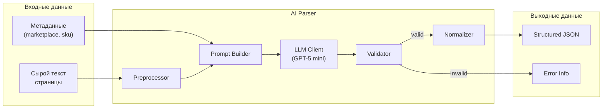
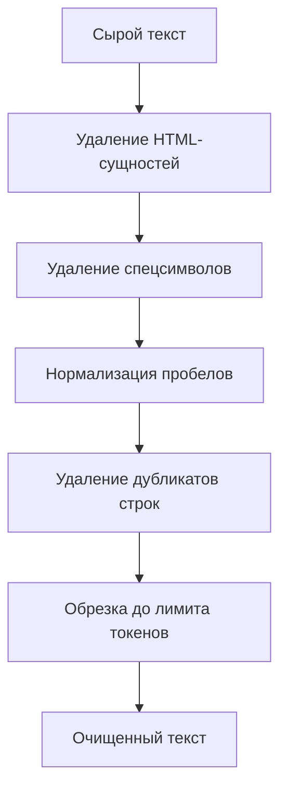
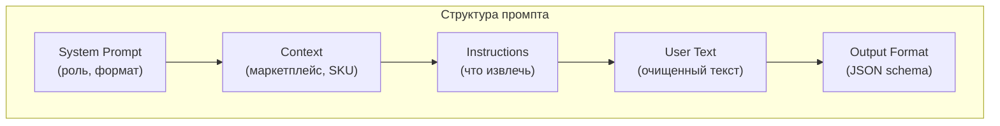
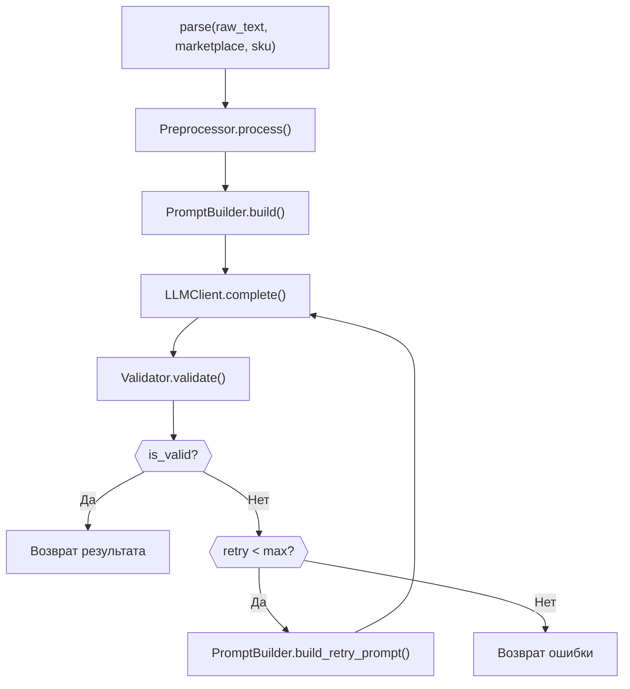

**Проект:** Интеллектуальная система мониторинга цен конкурентов  
**Модуль:** Watcher / AI Parser  
**Версия:** 2.0  
**Дата:** Январь 2026

---

## 4.1 Обзор

### Назначение

AI Parser — компонент извлечения структурированных данных из сырого текста страниц маркетплейсов с использованием LLM. В отличие от традиционного парсинга (CSS-селекторы, XPath), AI Parser устойчив к изменениям вёрстки и способен извлекать данные из любого текстового представления.

### Преимущества AI-подхода

| Критерий | CSS/XPath парсинг | AI Parser |
|----------|-------------------|-----------|
| Устойчивость к изменениям | Низкая | Высокая |
| Время на адаптацию | Часы/дни | Минуты |
| Обработка нестандартных форматов | Сложно | Автоматически |
| Извлечение из текста | Невозможно | Да |
| Стоимость за запрос | ~0 ₽ | ~0.1-0.5 ₽ |
| Скорость | ~50 мс | ~500-2000 мс |

### Архитектура



---

## 4.2 Извлекаемые данные

### Структура данных

| Поле | Тип | Описание | Обязательное |
|------|-----|----------|:------------:|
| `current_price` | float | Текущая цена | ✓ |
| `old_price` | float | Старая цена (до скидки) | — |
| `spp_price` | float | Цена с СПП (WB) | — |
| `discount_percent` | int | Процент скидки | — |
| `in_stock` | bool | Наличие товара | ✓ |
| `stock_quantity` | int | Количество на складе | — |
| `rating` | float | Рейтинг (1.0-5.0) | — |
| `reviews_count` | int | Количество отзывов | — |
| `sales_count` | int | Количество продаж | — |
| `position` | int | Позиция в выдаче | — |
| `ad_bid` | float | Рекламная ставка | — |
| `seller_name` | string | Название продавца | — |
| `title` | string | Заголовок карточки | — |
| `description` | string | Описание товара | — |
| `attributes` | dict | Характеристики | — |
| `category` | string | Категория | — |

### Пример выходного JSON

```json
{
  "success": true,
  "data": {
    "current_price": 2499.0,
    "old_price": 4999.0,
    "spp_price": 2249.0,
    "discount_percent": 50,
    "in_stock": true,
    "stock_quantity": 156,
    "rating": 4.7,
    "reviews_count": 1234,
    "sales_count": 5678,
    "position": null,
    "ad_bid": null,
    "seller_name": "Fashion Store",
    "title": "Платье женское летнее миди",
    "description": "Элегантное летнее платье из натурального хлопка...",
    "attributes": {
      "Состав": "100% хлопок",
      "Размер": "S, M, L, XL",
      "Цвет": "Синий",
      "Длина": "Миди"
    },
    "category": "Женщинам / Одежда / Платья"
  },
  "confidence": 0.95,
  "parse_time_ms": 1250
}
```

---

## 4.3 Preprocessor

### Назначение

Подготовка сырого текста перед отправкой в LLM: очистка, нормализация, сокращение.

### Алгоритм обработки



### Реализация

```python
# app/services/watcher/ai_parser/preprocessor.py

import re
import html
from typing import Optional


class Preprocessor:
    """Предобработка текста перед AI-парсингом."""
    
    # Максимальная длина текста (символы)
    MAX_LENGTH = 15000
    
    # Паттерны для удаления
    REMOVE_PATTERNS = [
        r'<script[^>]*>.*?</script>',  # JavaScript
        r'<style[^>]*>.*?</style>',     # CSS
        r'<!--.*?-->',                   # HTML-комментарии
        r'\{[^}]*\}',                    # JSON-подобные блоки
        r'data:[^,]+,[^\s]+',            # Data URLs
    ]
    
    # Бесполезные строки (навигация, футер и т.д.)
    SKIP_PHRASES = [
        'войти в личный кабинет',
        'корзина',
        'избранное',
        'политика конфиденциальности',
        'пользовательское соглашение',
        'служба поддержки',
        'скачать приложение',
    ]
    
    def process(self, raw_text: str) -> str:
        """
        Очистка и нормализация текста.
        
        Args:
            raw_text: Сырой текст страницы
        
        Returns:
            Очищенный текст
        """
        text = raw_text
        
        # 1. Декодирование HTML-сущностей
        text = html.unescape(text)
        
        # 2. Удаление паттернов
        for pattern in self.REMOVE_PATTERNS:
            text = re.sub(pattern, ' ', text, flags=re.DOTALL | re.IGNORECASE)
        
        # 3. Удаление Unicode-мусора
        text = self._clean_unicode(text)
        
        # 4. Нормализация пробелов
        text = re.sub(r'\s+', ' ', text)
        text = re.sub(r'\n\s*\n', '\n', text)
        
        # 5. Удаление бесполезных строк
        lines = text.split('\n')
        filtered_lines = []
        
        for line in lines:
            line_lower = line.lower().strip()
            
            # Пропуск коротких строк
            if len(line_lower) < 3:
                continue
            
            # Пропуск бесполезных фраз
            if any(phrase in line_lower for phrase in self.SKIP_PHRASES):
                continue
            
            filtered_lines.append(line.strip())
        
        text = '\n'.join(filtered_lines)
        
        # 6. Удаление дубликатов строк
        text = self._remove_duplicate_lines(text)
        
        # 7. Обрезка до лимита
        if len(text) > self.MAX_LENGTH:
            text = self._smart_truncate(text, self.MAX_LENGTH)
        
        return text.strip()
    
    def _clean_unicode(self, text: str) -> str:
        """Очистка Unicode-символов."""
        # Удаление zero-width символов
        text = re.sub(r'[\u200b-\u200f\u2028-\u202f\u205f-\u206f]', '', text)
        
        # Замена специальных пробелов на обычные
        text = re.sub(r'[\u00a0\u2000-\u200a]', ' ', text)
        
        return text
    
    def _remove_duplicate_lines(self, text: str) -> str:
        """Удаление повторяющихся строк."""
        lines = text.split('\n')
        seen = set()
        unique_lines = []
        
        for line in lines:
            normalized = line.strip().lower()
            
            if normalized and normalized not in seen:
                seen.add(normalized)
                unique_lines.append(line)
        
        return '\n'.join(unique_lines)
    
    def _smart_truncate(self, text: str, max_length: int) -> str:
        """
        Умная обрезка текста.
        
        Сохраняет начало (заголовок, цена) и середину (характеристики).
        """
        if len(text) <= max_length:
            return text
        
        # 60% начала, 40% конца
        head_length = int(max_length * 0.6)
        tail_length = max_length - head_length - 50  # 50 символов на разделитель
        
        head = text[:head_length]
        tail = text[-tail_length:]
        
        # Обрезка по границам слов
        head = head.rsplit(' ', 1)[0]
        tail = tail.split(' ', 1)[-1] if ' ' in tail else tail
        
        return f"{head}\n\n[...контент обрезан...]\n\n{tail}"
```

---

## 4.4 Prompt Builder

### Назначение

Формирование промптов для LLM с учётом маркетплейса и типа задачи.

### Структура промпта



### Реализация

```python
# app/services/watcher/ai_parser/prompt_builder.py

from typing import Dict, Any, Optional
from enum import Enum


class Marketplace(str, Enum):
    WILDBERRIES = "wildberries"
    OZON = "ozon"
    YANDEX_MARKET = "yandex_market"


class PromptBuilder:
    """Построение промптов для AI-парсинга."""
    
    SYSTEM_PROMPT = """Ты — точный парсер данных о товарах с маркетплейсов.
Твоя задача — извлечь структурированную информацию из текста страницы товара.

ВАЖНЫЕ ПРАВИЛА:
1. Извлекай ТОЛЬКО данные, которые явно присутствуют в тексте
2. Если данные не найдены — используй null
3. Числа должны быть без пробелов и разделителей тысяч
4. Цены — в рублях, без копеек (если копейки = 00)
5. Рейтинг — число от 1.0 до 5.0
6. Отвечай ТОЛЬКО валидным JSON без markdown-блоков"""

    MARKETPLACE_CONTEXT = {
        Marketplace.WILDBERRIES: """
Маркетплейс: Wildberries
Особенности:
- СПП (Скидка Постоянного Покупателя) — дополнительная скидка для зарегистрированных пользователей
- "Цена с WB Кошельком" — ещё одна цена со скидкой
- Рейтинг отображается как число со звёздами (например, "4.7 ★")
- Количество отзывов часто написано как "1234 отзыва"
""",
        Marketplace.OZON: """
Маркетплейс: Ozon
Особенности:
- "Ozon Карта" — цена со скидкой по карте лояльности
- Баллы — бонусные баллы за покупку
- Рейтинг и отзывы отображаются рядом с названием
- "Premium цена" — для подписчиков Premium
""",
        Marketplace.YANDEX_MARKET: """
Маркетплейс: Яндекс.Маркет
Особенности:
- Может быть несколько продавцов с разными ценами
- "Яндекс Плюс" — скидка для подписчиков
- Кэшбэк баллами отображается отдельно
- Рейтинг магазина и рейтинг товара — разные вещи
"""
    }
    
    EXTRACTION_INSTRUCTIONS = """
Извлеки следующие данные из текста:

1. ЦЕНЫ:
   - current_price: текущая цена товара (основная, которую платит покупатель)
   - old_price: старая цена до скидки (перечёркнутая)
   - spp_price: цена с дополнительной скидкой (СПП, карта, подписка)
   - discount_percent: процент скидки (число без %)

2. НАЛИЧИЕ:
   - in_stock: есть ли товар в наличии (true/false)
   - stock_quantity: количество на складе (если указано)

3. ОТЗЫВЫ И РЕЙТИНГ:
   - rating: рейтинг товара (1.0-5.0)
   - reviews_count: количество отзывов
   - sales_count: количество продаж/заказов

4. ПОЗИЦИЯ И РЕКЛАМА:
   - position: позиция в поисковой выдаче (если видно)
   - ad_bid: рекламная ставка (если видно)

5. ИНФОРМАЦИЯ О ПРОДАВЦЕ:
   - seller_name: название продавца/магазина

6. КОНТЕНТ КАРТОЧКИ:
   - title: заголовок/название товара
   - description: описание (первые 500 символов)
   - attributes: характеристики товара (dict)
   - category: категория/путь в каталоге
"""

    OUTPUT_FORMAT = """
Ответь СТРОГО в формате JSON:
{
  "current_price": <число или null>,
  "old_price": <число или null>,
  "spp_price": <число или null>,
  "discount_percent": <число или null>,
  "in_stock": <true/false>,
  "stock_quantity": <число или null>,
  "rating": <число 1.0-5.0 или null>,
  "reviews_count": <число или null>,
  "sales_count": <число или null>,
  "position": <число или null>,
  "ad_bid": <число или null>,
  "seller_name": <строка или null>,
  "title": <строка или null>,
  "description": <строка или null>,
  "attributes": <объект или null>,
  "category": <строка или null>
}

НЕ добавляй никакого текста до или после JSON.
НЕ используй markdown-блоки (```json).
"""

    def build(
        self,
        marketplace: Marketplace,
        sku: str,
        cleaned_text: str,
        extra_context: Optional[Dict[str, Any]] = None
    ) -> list:
        """
        Построение промпта для LLM.
        
        Args:
            marketplace: Маркетплейс
            sku: Артикул товара
            cleaned_text: Очищенный текст страницы
            extra_context: Дополнительный контекст
        
        Returns:
            Список сообщений для Chat API
        """
        # Контекст маркетплейса
        marketplace_ctx = self.MARKETPLACE_CONTEXT.get(
            marketplace,
            "Маркетплейс: неизвестный"
        )
        
        # Формирование user prompt
        user_content = f"""
{marketplace_ctx}

Артикул товара: {sku}

{self.EXTRACTION_INSTRUCTIONS}

=== ТЕКСТ СТРАНИЦЫ ===
{cleaned_text}
=== КОНЕЦ ТЕКСТА ===

{self.OUTPUT_FORMAT}
"""
        
        messages = [
            {"role": "system", "content": self.SYSTEM_PROMPT},
            {"role": "user", "content": user_content}
        ]
        
        return messages
    
    def build_retry_prompt(
        self,
        original_messages: list,
        error: str,
        raw_response: str
    ) -> list:
        """
        Построение промпта для повторной попытки при ошибке.
        
        Args:
            original_messages: Исходные сообщения
            error: Описание ошибки
            raw_response: Сырой ответ LLM
        
        Returns:
            Обновлённые сообщения
        """
        retry_message = f"""
Твой предыдущий ответ содержал ошибку: {error}

Твой ответ был:
{raw_response[:500]}...

Пожалуйста, исправь ответ и верни ТОЛЬКО валидный JSON без markdown-блоков.
Помни: используй null для отсутствующих данных, не выдумывай значения.
"""
        
        messages = original_messages.copy()
        messages.append({"role": "assistant", "content": raw_response})
        messages.append({"role": "user", "content": retry_message})
        
        return messages
```

---

## 4.5 LLM Client

### Назначение

Взаимодействие с Timeweb AI API (GPT-5 mini) для выполнения AI-парсинга.

### Конфигурация

| Параметр | Значение | Описание |
|----------|----------|----------|
| Model | `gpt-5-mini` | Модель для парсинга |
| Temperature | `0.1` | Низкая для детерминированности |
| Max tokens | `2000` | Лимит ответа |
| Timeout | `30 сек` | Таймаут запроса |
| Retry | `2` | Количество повторов |

### Реализация

```python
# app/services/watcher/ai_parser/llm_client.py

import asyncio
import logging
from typing import Dict, Any, Optional, List
from datetime import datetime

import httpx


logger = logging.getLogger(__name__)


class LLMClientError(Exception):
    """Ошибка LLM клиента."""
    pass


class LLMClient:
    """Клиент для Timeweb AI API."""
    
    DEFAULT_MODEL = "gpt-5-mini"
    DEFAULT_TEMPERATURE = 0.1
    DEFAULT_MAX_TOKENS = 2000
    DEFAULT_TIMEOUT = 30
    MAX_RETRIES = 2
    
    def __init__(
        self,
        api_url: str,
        api_key: str,
        model: str = None,
        temperature: float = None,
        max_tokens: int = None,
        timeout: int = None
    ):
        self.api_url = api_url.rstrip('/')
        self.api_key = api_key
        self.model = model or self.DEFAULT_MODEL
        self.temperature = temperature or self.DEFAULT_TEMPERATURE
        self.max_tokens = max_tokens or self.DEFAULT_MAX_TOKENS
        self.timeout = timeout or self.DEFAULT_TIMEOUT
        
        self.client = httpx.AsyncClient(
            timeout=httpx.Timeout(self.timeout),
            headers={
                "Authorization": f"Bearer {self.api_key}",
                "Content-Type": "application/json"
            }
        )
    
    async def complete(
        self,
        messages: List[Dict[str, str]],
        temperature: float = None,
        max_tokens: int = None
    ) -> Dict[str, Any]:
        """
        Выполнение запроса к LLM.
        
        Args:
            messages: Список сообщений (system, user, assistant)
            temperature: Температура (переопределение)
            max_tokens: Максимум токенов (переопределение)
        
        Returns:
            Ответ LLM с метаданными
        
        Raises:
            LLMClientError: При ошибке запроса
        """
        payload = {
            "model": self.model,
            "messages": messages,
            "temperature": temperature or self.temperature,
            "max_tokens": max_tokens or self.max_tokens
        }
        
        start_time = datetime.now()
        last_error = None
        
        for attempt in range(self.MAX_RETRIES + 1):
            try:
                response = await self.client.post(
                    f"{self.api_url}/chat/completions",
                    json=payload
                )
                
                if response.status_code == 429:
                    # Rate limit — ждём и повторяем
                    retry_after = int(response.headers.get("Retry-After", 5))
                    logger.warning(f"Rate limited, waiting {retry_after}s")
                    await asyncio.sleep(retry_after)
                    continue
                
                response.raise_for_status()
                
                data = response.json()
                
                elapsed_ms = int((datetime.now() - start_time).total_seconds() * 1000)
                
                return {
                    "content": data["choices"][0]["message"]["content"],
                    "model": data.get("model", self.model),
                    "usage": data.get("usage", {}),
                    "elapsed_ms": elapsed_ms,
                    "attempt": attempt + 1
                }
                
            except httpx.TimeoutException as e:
                last_error = f"Timeout after {self.timeout}s"
                logger.warning(f"LLM timeout (attempt {attempt + 1})")
                
            except httpx.HTTPStatusError as e:
                last_error = f"HTTP {e.response.status_code}: {e.response.text}"
                logger.warning(f"LLM HTTP error: {last_error}")
                
                if e.response.status_code >= 500:
                    # Серверная ошибка — повторяем
                    await asyncio.sleep(2 ** attempt)
                    continue
                else:
                    # Клиентская ошибка — не повторяем
                    break
                    
            except Exception as e:
                last_error = str(e)
                logger.error(f"LLM unexpected error: {e}")
        
        raise LLMClientError(f"LLM request failed after {self.MAX_RETRIES + 1} attempts: {last_error}")
    
    async def close(self):
        """Закрытие HTTP клиента."""
        await self.client.aclose()
```

---

## 4.6 Validator

### Назначение

Валидация ответа LLM: проверка JSON-структуры, типов данных, логических ограничений.

### Правила валидации

| Поле | Тип | Ограничения |
|------|-----|-------------|
| `current_price` | float | &gt; 0 |
| `old_price` | float | &gt; current_price (если оба заданы) |
| `spp_price` | float | &lt; current_price (если оба заданы) |
| `discount_percent` | int | 0-99 |
| `in_stock` | bool | — |
| `stock_quantity` | int | &gt;= 0 |
| `rating` | float | 1.0-5.0 |
| `reviews_count` | int | &gt;= 0 |
| `sales_count` | int | &gt;= 0 |

### Реализация

```python
# app/services/watcher/ai_parser/validator.py

import json
import re
from typing import Dict, Any, Optional, Tuple
from dataclasses import dataclass


@dataclass
class ValidationResult:
    """Результат валидации."""
    is_valid: bool
    data: Optional[Dict[str, Any]]
    errors: list
    warnings: list


class Validator:
    """Валидация ответа AI Parser."""
    
    # Обязательные поля
    REQUIRED_FIELDS = ["current_price", "in_stock"]
    
    # Типы полей
    FIELD_TYPES = {
        "current_price": (int, float),
        "old_price": (int, float, type(None)),
        "spp_price": (int, float, type(None)),
        "discount_percent": (int, type(None)),
        "in_stock": (bool,),
        "stock_quantity": (int, type(None)),
        "rating": (int, float, type(None)),
        "reviews_count": (int, type(None)),
        "sales_count": (int, type(None)),
        "position": (int, type(None)),
        "ad_bid": (int, float, type(None)),
        "seller_name": (str, type(None)),
        "title": (str, type(None)),
        "description": (str, type(None)),
        "attributes": (dict, type(None)),
        "category": (str, type(None)),
    }
    
    def validate(self, raw_response: str) -> ValidationResult:
        """
        Валидация ответа LLM.
        
        Args:
            raw_response: Сырой текст ответа
        
        Returns:
            ValidationResult
        """
        errors = []
        warnings = []
        
        # 1. Парсинг JSON
        data, parse_error = self._parse_json(raw_response)
        
        if parse_error:
            return ValidationResult(
                is_valid=False,
                data=None,
                errors=[parse_error],
                warnings=[]
            )
        
        # 2. Проверка обязательных полей
        for field in self.REQUIRED_FIELDS:
            if field not in data or data[field] is None:
                errors.append(f"Missing required field: {field}")
        
        # 3. Проверка типов
        for field, expected_types in self.FIELD_TYPES.items():
            if field in data:
                value = data[field]
                if not isinstance(value, expected_types):
                    errors.append(
                        f"Invalid type for {field}: expected {expected_types}, "
                        f"got {type(value).__name__}"
                    )
        
        # 4. Логические проверки
        logic_errors, logic_warnings = self._validate_logic(data)
        errors.extend(logic_errors)
        warnings.extend(logic_warnings)
        
        # 5. Нормализация значений
        if not errors:
            data = self._normalize(data)
        
        return ValidationResult(
            is_valid=len(errors) == 0,
            data=data if len(errors) == 0 else None,
            errors=errors,
            warnings=warnings
        )
    
    def _parse_json(self, raw_response: str) -> Tuple[Optional[Dict], Optional[str]]:
        """Парсинг JSON из ответа."""
        text = raw_response.strip()
        
        # Удаление markdown-блоков
        if text.startswith("```"):
            # Удаление ```json и ```
            text = re.sub(r'^```(?:json)?\s*', '', text)
            text = re.sub(r'\s*```$', '', text)
        
        # Поиск JSON в тексте
        json_match = re.search(r'\{[\s\S]*\}', text)
        
        if not json_match:
            return None, "No JSON object found in response"
        
        json_str = json_match.group()
        
        try:
            data = json.loads(json_str)
            return data, None
        except json.JSONDecodeError as e:
            return None, f"JSON parse error: {e}"
    
    def _validate_logic(self, data: Dict) -> Tuple[list, list]:
        """Логическая валидация данных."""
        errors = []
        warnings = []
        
        current_price = data.get("current_price")
        old_price = data.get("old_price")
        spp_price = data.get("spp_price")
        discount_percent = data.get("discount_percent")
        rating = data.get("rating")
        
        # Цена должна быть положительной
        if current_price is not None and current_price <= 0:
            errors.append(f"Invalid current_price: {current_price} (must be > 0)")
        
        # Старая цена должна быть больше текущей
        if current_price and old_price:
            if old_price <= current_price:
                warnings.append(
                    f"old_price ({old_price}) <= current_price ({current_price})"
                )
        
        # СПП цена должна быть меньше текущей
        if current_price and spp_price:
            if spp_price >= current_price:
                warnings.append(
                    f"spp_price ({spp_price}) >= current_price ({current_price})"
                )
        
        # Скидка должна быть 0-99%
        if discount_percent is not None:
            if discount_percent < 0 or discount_percent > 99:
                warnings.append(
                    f"Invalid discount_percent: {discount_percent} (expected 0-99)"
                )
        
        # Рейтинг должен быть 1.0-5.0
        if rating is not None:
            if rating < 1.0 or rating > 5.0:
                warnings.append(
                    f"Invalid rating: {rating} (expected 1.0-5.0)"
                )
        
        # Проверка соответствия скидки и цен
        if current_price and old_price and discount_percent:
            expected_discount = int((1 - current_price / old_price) * 100)
            if abs(expected_discount - discount_percent) > 5:
                warnings.append(
                    f"Discount mismatch: stated {discount_percent}%, "
                    f"calculated {expected_discount}%"
                )
        
        return errors, warnings
    
    def _normalize(self, data: Dict) -> Dict:
        """Нормализация значений."""
        normalized = data.copy()
        
        # Округление цен до 2 знаков
        for field in ["current_price", "old_price", "spp_price", "ad_bid"]:
            if normalized.get(field) is not None:
                normalized[field] = round(float(normalized[field]), 2)
        
        # Округление рейтинга до 1 знака
        if normalized.get("rating") is not None:
            normalized["rating"] = round(float(normalized["rating"]), 1)
        
        # Целые числа
        for field in ["discount_percent", "stock_quantity", "reviews_count", 
                      "sales_count", "position"]:
            if normalized.get(field) is not None:
                normalized[field] = int(normalized[field])
        
        # Обрезка длинных строк
        if normalized.get("description") and len(normalized["description"]) > 1000:
            normalized["description"] = normalized["description"][:1000] + "..."
        
        if normalized.get("title") and len(normalized["title"]) > 500:
            normalized["title"] = normalized["title"][:500]
        
        return normalized
```

---

## 4.7 AI Parser Service

### Назначение

Основной сервис AI-парсинга, объединяющий все компоненты.

### Алгоритм работы



### Реализация

```python
# app/services/watcher/ai_parser/service.py

import logging
from typing import Dict, Any, Optional
from datetime import datetime

from app.services.watcher.ai_parser.preprocessor import Preprocessor
from app.services.watcher.ai_parser.prompt_builder import PromptBuilder, Marketplace
from app.services.watcher.ai_parser.llm_client import LLMClient, LLMClientError
from app.services.watcher.ai_parser.validator import Validator


logger = logging.getLogger(__name__)


class AIParser:
    """Сервис AI-парсинга данных с маркетплейсов."""
    
    MAX_RETRIES = 1  # Одна повторная попытка при ошибке валидации
    
    def __init__(
        self,
        llm_client: LLMClient,
        preprocessor: Preprocessor = None,
        prompt_builder: PromptBuilder = None,
        validator: Validator = None
    ):
        self.llm_client = llm_client
        self.preprocessor = preprocessor or Preprocessor()
        self.prompt_builder = prompt_builder or PromptBuilder()
        self.validator = validator or Validator()
    
    async def parse(
        self,
        raw_text: str,
        marketplace: str,
        sku: str,
        extra_context: Optional[Dict[str, Any]] = None
    ) -> Dict[str, Any]:
        """
        Парсинг данных о товаре.
        
        Args:
            raw_text: Сырой текст страницы
            marketplace: Маркетплейс (wildberries, ozon, yandex_market)
            sku: Артикул товара
            extra_context: Дополнительный контекст
        
        Returns:
            {
                "success": bool,
                "data": {...} или None,
                "error": str или None,
                "confidence": float,
                "parse_time_ms": int,
                "retries": int
            }
        """
        start_time = datetime.now()
        retries = 0
        
        try:
            # 1. Предобработка текста
            cleaned_text = self.preprocessor.process(raw_text)
            
            if len(cleaned_text) < 100:
                return self._error_response(
                    "Text too short after preprocessing",
                    start_time
                )
            
            # 2. Построение промпта
            marketplace_enum = Marketplace(marketplace)
            messages = self.prompt_builder.build(
                marketplace=marketplace_enum,
                sku=sku,
                cleaned_text=cleaned_text,
                extra_context=extra_context
            )
            
            # 3. Запрос к LLM с retry
            llm_response = None
            validation_result = None
            
            for attempt in range(self.MAX_RETRIES + 1):
                try:
                    llm_response = await self.llm_client.complete(messages)
                    
                    # 4. Валидация
                    validation_result = self.validator.validate(
                        llm_response["content"]
                    )
                    
                    if validation_result.is_valid:
                        break
                    
                    # Если не валидно — пробуем ещё раз с уточнением
                    if attempt < self.MAX_RETRIES:
                        logger.warning(
                            f"Validation failed (attempt {attempt + 1}): "
                            f"{validation_result.errors}"
                        )
                        
                        messages = self.prompt_builder.build_retry_prompt(
                            original_messages=messages,
                            error="; ".join(validation_result.errors),
                            raw_response=llm_response["content"]
                        )
                        retries += 1
                        
                except LLMClientError as e:
                    if attempt < self.MAX_RETRIES:
                        retries += 1
                        continue
                    raise
            
            # 5. Формирование результата
            elapsed_ms = int((datetime.now() - start_time).total_seconds() * 1000)
            
            if validation_result and validation_result.is_valid:
                # Расчёт confidence на основе warnings
                confidence = self._calculate_confidence(validation_result)
                
                return {
                    "success": True,
                    "data": validation_result.data,
                    "error": None,
                    "confidence": confidence,
                    "warnings": validation_result.warnings,
                    "parse_time_ms": elapsed_ms,
                    "retries": retries,
                    "llm_usage": llm_response.get("usage", {})
                }
            else:
                return {
                    "success": False,
                    "data": None,
                    "error": "; ".join(validation_result.errors) if validation_result else "Unknown error",
                    "confidence": 0.0,
                    "parse_time_ms": elapsed_ms,
                    "retries": retries
                }
                
        except LLMClientError as e:
            logger.error(f"AI Parser LLM error: {e}")
            return self._error_response(str(e), start_time, retries)
            
        except Exception as e:
            logger.exception(f"AI Parser unexpected error: {e}")
            return self._error_response(f"Unexpected error: {e}", start_time, retries)
    
    def _calculate_confidence(self, validation_result) -> float:
        """Расчёт уровня уверенности."""
        base_confidence = 1.0
        
        # Снижение за warnings
        warning_penalty = 0.05 * len(validation_result.warnings)
        
        # Снижение за отсутствующие данные
        data = validation_result.data
        missing_penalty = 0
        
        important_fields = ["rating", "reviews_count", "seller_name", "title"]
        for field in important_fields:
            if data.get(field) is None:
                missing_penalty += 0.05
        
        confidence = base_confidence - warning_penalty - missing_penalty
        
        return max(0.5, min(1.0, round(confidence, 2)))
    
    def _error_response(
        self,
        error: str,
        start_time: datetime,
        retries: int = 0
    ) -> Dict[str, Any]:
        """Формирование ответа с ошибкой."""
        elapsed_ms = int((datetime.now() - start_time).total_seconds() * 1000)
        
        return {
            "success": False,
            "data": None,
            "error": error,
            "confidence": 0.0,
            "parse_time_ms": elapsed_ms,
            "retries": retries
        }
```

---

## 4.8 Интеграция с Result Handler

### Вызов AI Parser

```python
# app/services/watcher/result_handler.py (фрагмент)

class ResultHandler:
    
    async def process_report(
        self,
        task_id: str,
        agent_id: str,
        raw_text: str,
        timing_ms: int,
        success: bool,
        error: Optional[str] = None
    ) -> Dict[str, Any]:
        
        # ... проверки ...
        
        # AI-парсинг
        parsed_data = await self.ai_parser.parse(
            raw_text=raw_text,
            marketplace=task.marketplace,
            sku=task.sku
        )
        
        if not parsed_data["success"]:
            return await self._handle_parse_error(
                task=task,
                agent_ip=agent_ip,
                error=parsed_data["error"],
                timing_ms=timing_ms
            )
        
        # Логирование confidence
        if parsed_data["confidence"] < 0.8:
            logger.warning(
                f"Low confidence parse for {task.id}: "
                f"{parsed_data['confidence']}"
            )
        
        # Сохранение результата
        await self._save_price_history(task, parsed_data["data"])
        
        # ...
```

---

## 4.9 Кэширование и оптимизация

### Кэширование промптов

```python
# app/services/watcher/ai_parser/cache.py

from functools import lru_cache
import hashlib


class PromptCache:
    """Кэширование результатов парсинга."""
    
    def __init__(self, redis_client, ttl: int = 3600):
        self.redis = redis_client
        self.ttl = ttl
    
    async def get(self, raw_text: str, marketplace: str) -> Optional[Dict]:
        """Получение кэшированного результата."""
        key = self._make_key(raw_text, marketplace)
        
        cached = await self.redis.get(key)
        
        if cached:
            return json.loads(cached)
        
        return None
    
    async def set(self, raw_text: str, marketplace: str, result: Dict) -> None:
        """Сохранение результата в кэш."""
        key = self._make_key(raw_text, marketplace)
        
        await self.redis.setex(
            key,
            self.ttl,
            json.dumps(result)
        )
    
    def _make_key(self, raw_text: str, marketplace: str) -> str:
        """Формирование ключа кэша."""
        text_hash = hashlib.md5(raw_text.encode()).hexdigest()[:16]
        return f"watcher:parse_cache:{marketplace}:{text_hash}"
```

### Batch Processing

```python
# app/services/watcher/ai_parser/batch.py

class BatchParser:
    """Пакетная обработка для оптимизации."""
    
    def __init__(self, ai_parser: AIParser, batch_size: int = 5):
        self.ai_parser = ai_parser
        self.batch_size = batch_size
    
    async def parse_batch(
        self,
        items: List[Dict[str, Any]]
    ) -> List[Dict[str, Any]]:
        """
        Параллельный парсинг нескольких страниц.
        
        Args:
            items: [{"raw_text": ..., "marketplace": ..., "sku": ...}, ...]
        
        Returns:
            Список результатов
        """
        import asyncio
        
        results = []
        
        # Разбиение на батчи
        for i in range(0, len(items), self.batch_size):
            batch = items[i:i + self.batch_size]
            
            # Параллельный запуск
            tasks = [
                self.ai_parser.parse(
                    raw_text=item["raw_text"],
                    marketplace=item["marketplace"],
                    sku=item["sku"]
                )
                for item in batch
            ]
            
            batch_results = await asyncio.gather(*tasks, return_exceptions=True)
            
            for item, result in zip(batch, batch_results):
                if isinstance(result, Exception):
                    results.append({
                        "success": False,
                        "error": str(result),
                        "sku": item["sku"]
                    })
                else:
                    result["sku"] = item["sku"]
                    results.append(result)
        
        return results
```

---

## 4.10 Мониторинг и метрики

### Метрики AI Parser

| Метрика | Описание | Тип |
|---------|----------|-----|
| `ai_parser_requests_total` | Всего запросов | Counter |
| `ai_parser_success_total` | Успешных парсингов | Counter |
| `ai_parser_failures_total` | Ошибок парсинга | Counter |
| `ai_parser_duration_ms` | Время парсинга | Histogram |
| `ai_parser_confidence` | Уровень уверенности | Histogram |
| `ai_parser_retries_total` | Количество retry | Counter |
| `ai_parser_tokens_used` | Использовано токенов | Counter |

### Реализация метрик

```python
# app/services/watcher/ai_parser/metrics.py

from prometheus_client import Counter, Histogram
import logging


logger = logging.getLogger(__name__)


class AIParserMetrics:
    """Метрики AI Parser."""
    
    def __init__(self):
        self.requests = Counter(
            'ai_parser_requests_total',
            'Total AI parser requests',
            ['marketplace']
        )
        
        self.successes = Counter(
            'ai_parser_success_total',
            'Successful AI parser requests',
            ['marketplace']
        )
        
        self.failures = Counter(
            'ai_parser_failures_total',
            'Failed AI parser requests',
            ['marketplace', 'error_type']
        )
        
        self.duration = Histogram(
            'ai_parser_duration_ms',
            'AI parser request duration in milliseconds',
            ['marketplace'],
            buckets=[100, 250, 500, 1000, 2000, 5000, 10000]
        )
        
        self.confidence = Histogram(
            'ai_parser_confidence',
            'AI parser confidence score',
            ['marketplace'],
            buckets=[0.5, 0.6, 0.7, 0.8, 0.9, 0.95, 1.0]
        )
        
        self.retries = Counter(
            'ai_parser_retries_total',
            'AI parser retry count',
            ['marketplace']
        )
        
        self.tokens = Counter(
            'ai_parser_tokens_used',
            'Total tokens used',
            ['marketplace', 'type']
        )
    
    def record_request(self, marketplace: str):
        """Запись запроса."""
        self.requests.labels(marketplace=marketplace).inc()
    
    def record_success(
        self,
        marketplace: str,
        duration_ms: int,
        confidence: float,
        tokens_used: dict
    ):
        """Запись успешного парсинга."""
        self.successes.labels(marketplace=marketplace).inc()
        self.duration.labels(marketplace=marketplace).observe(duration_ms)
        self.confidence.labels(marketplace=marketplace).observe(confidence)
        
        if tokens_used:
            self.tokens.labels(
                marketplace=marketplace, type='prompt'
            ).inc(tokens_used.get('prompt_tokens', 0))
            self.tokens.labels(
                marketplace=marketplace, type='completion'
            ).inc(tokens_used.get('completion_tokens', 0))
    
    def record_failure(self, marketplace: str, error_type: str):
        """Запись ошибки."""
        self.failures.labels(
            marketplace=marketplace,
            error_type=error_type
        ).inc()
    
    def record_retry(self, marketplace: str):
        """Запись retry."""
        self.retries.labels(marketplace=marketplace).inc()
```

### Логирование

```python
# Структурированные логи для AI Parser

# Успешный парсинг
logger.info(
    "AI parse success",
    extra={
        "task_id": task_id,
        "sku": sku,
        "marketplace": marketplace,
        "confidence": result["confidence"],
        "duration_ms": result["parse_time_ms"],
        "retries": result["retries"],
        "warnings": result.get("warnings", [])
    }
)

# Ошибка парсинга
logger.warning(
    "AI parse failed",
    extra={
        "task_id": task_id,
        "sku": sku,
        "marketplace": marketplace,
        "error": result["error"],
        "duration_ms": result["parse_time_ms"],
        "retries": result["retries"]
    }
)
```

---

## 4.11 Конфигурация

### Environment Variables

```bash
# Timeweb AI
TIMEWEB_AI_URL=https://api.timeweb.cloud/ai/v1
TIMEWEB_AI_KEY=your-api-key

# AI Parser settings
AI_PARSER_MODEL=gpt-5-mini
AI_PARSER_TEMPERATURE=0.1
AI_PARSER_MAX_TOKENS=2000
AI_PARSER_TIMEOUT=30
AI_PARSER_MAX_RETRIES=2

# Preprocessor
AI_PARSER_MAX_TEXT_LENGTH=15000

# Cache
AI_PARSER_CACHE_ENABLED=true
AI_PARSER_CACHE_TTL=3600
```

### Пример инициализации

```python
# app/services/watcher/ai_parser/__init__.py

from app.core.config import settings
from app.core.redis import get_redis
from app.services.watcher.ai_parser.llm_client import LLMClient
from app.services.watcher.ai_parser.service import AIParser
from app.services.watcher.ai_parser.cache import PromptCache


async def get_ai_parser() -> AIParser:
    """Factory для AI Parser."""
    llm_client = LLMClient(
        api_url=settings.TIMEWEB_AI_URL,
        api_key=settings.TIMEWEB_AI_KEY,
        model=settings.AI_PARSER_MODEL,
        temperature=settings.AI_PARSER_TEMPERATURE,
        max_tokens=settings.AI_PARSER_MAX_TOKENS,
        timeout=settings.AI_PARSER_TIMEOUT
    )
    
    return AIParser(llm_client=llm_client)
```

---

## 4.12 Тестирование

### Unit Tests

```python
# tests/services/watcher/ai_parser/test_validator.py

import pytest
from app.services.watcher.ai_parser.validator import Validator


class TestValidator:
    
    def setup_method(self):
        self.validator = Validator()
    
    def test_valid_response(self):
        response = '''
        {
            "current_price": 2499.0,
            "old_price": 4999.0,
            "in_stock": true,
            "rating": 4.7,
            "reviews_count": 1234
        }
        '''
        
        result = self.validator.validate(response)
        
        assert result.is_valid
        assert result.data["current_price"] == 2499.0
        assert result.data["in_stock"] == True
    
    def test_missing_required_field(self):
        response = '''
        {
            "old_price": 4999.0,
            "in_stock": true
        }
        '''
        
        result = self.validator.validate(response)
        
        assert not result.is_valid
        assert "current_price" in str(result.errors)
    
    def test_invalid_json(self):
        response = "This is not JSON"
        
        result = self.validator.validate(response)
        
        assert not result.is_valid
        assert "JSON" in str(result.errors)
    
    def test_price_logic_warning(self):
        response = '''
        {
            "current_price": 5000.0,
            "old_price": 3000.0,
            "in_stock": true
        }
        '''
        
        result = self.validator.validate(response)
        
        assert result.is_valid
        assert len(result.warnings) > 0
        assert "old_price" in str(result.warnings)
```

### Integration Tests

```python
# tests/services/watcher/ai_parser/test_service.py

import pytest
from unittest.mock import AsyncMock, patch

from app.services.watcher.ai_parser.service import AIParser
from app.services.watcher.ai_parser.llm_client import LLMClient


class TestAIParser:
    
    @pytest.fixture
    def mock_llm_client(self):
        client = AsyncMock(spec=LLMClient)
        client.complete.return_value = {
            "content": '''
            {
                "current_price": 1999.0,
                "in_stock": true,
                "rating": 4.5,
                "title": "Test Product"
            }
            ''',
            "usage": {"prompt_tokens": 100, "completion_tokens": 50}
        }
        return client
    
    @pytest.mark.asyncio
    async def test_successful_parse(self, mock_llm_client):
        parser = AIParser(llm_client=mock_llm_client)
        
        result = await parser.parse(
            raw_text="Some product page text with price 1999 руб",
            marketplace="wildberries",
            sku="12345"
        )
        
        assert result["success"]
        assert result["data"]["current_price"] == 1999.0
        assert result["confidence"] >= 0.8
    
    @pytest.mark.asyncio
    async def test_parse_with_retry(self, mock_llm_client):
        # Первый ответ невалидный, второй — валидный
        mock_llm_client.complete.side_effect = [
            {"content": "invalid json", "usage": {}},
            {
                "content": '{"current_price": 999, "in_stock": true}',
                "usage": {}
            }
        ]
        
        parser = AIParser(llm_client=mock_llm_client)
        
        result = await parser.parse(
            raw_text="Some text",
            marketplace="ozon",
            sku="67890"
        )
        
        assert result["success"]
        assert result["retries"] == 1
```

---

## Приложение А: Примеры промптов и ответов

### Wildberries

**Входной текст (фрагмент):**
```
Платье женское летнее миди
Fashion Store
4.7 ★ 1234 отзыва
2 499 ₽
4 999 ₽ −50%
с WB Кошельком 2 249 ₽
В наличии 156 шт.
Состав: 100% хлопок
Размер: S, M, L, XL
```

**Ответ LLM:**
```json
{
  "current_price": 2499.0,
  "old_price": 4999.0,
  "spp_price": 2249.0,
  "discount_percent": 50,
  "in_stock": true,
  "stock_quantity": 156,
  "rating": 4.7,
  "reviews_count": 1234,
  "seller_name": "Fashion Store",
  "title": "Платье женское летнее миди",
  "attributes": {
    "Состав": "100% хлопок",
    "Размер": "S, M, L, XL"
  }
}
```

### Ozon

**Входной текст (фрагмент):**
```
Смартфон Samsung Galaxy A54
TechShop Official
4.8 • 5 678 отзывов
29 990 ₽
с Ozon Картой 28 490 ₽
Кэшбэк 1 500 баллов
Есть в наличии
Доставка завтра
```

**Ответ LLM:**
```json
{
  "current_price": 29990.0,
  "old_price": null,
  "spp_price": 28490.0,
  "discount_percent": null,
  "in_stock": true,
  "rating": 4.8,
  "reviews_count": 5678,
  "seller_name": "TechShop Official",
  "title": "Смартфон Samsung Galaxy A54"
}
```

---

## Приложение Б: Контрольные точки AI Parser

| Критерий | Проверка |
|----------|----------|
| LLM Client подключён | Тестовый запрос возвращает ответ |
| Preprocessor работает | Текст очищается корректно |
| Validator работает | JSON парсится и валидируется |
| Успешный парсинг | confidence &gt;= 0.8 |
| Retry работает | При невалидном JSON — повтор |
| Метрики собираются | Prometheus endpoint отвечает |

---

**Документ подготовлен:** Январь 2026  
**Версия:** 2.0  
**Статус:** Черновик
