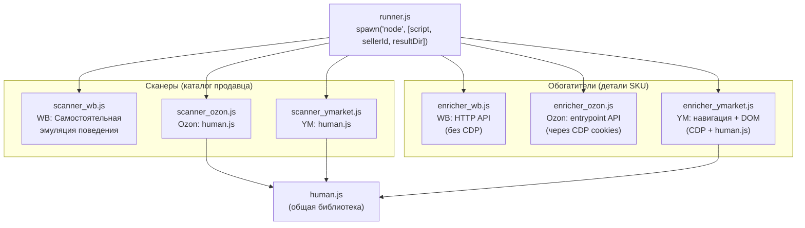
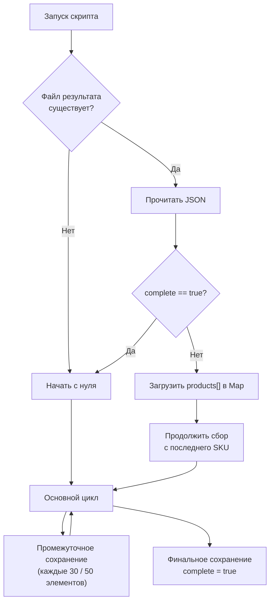
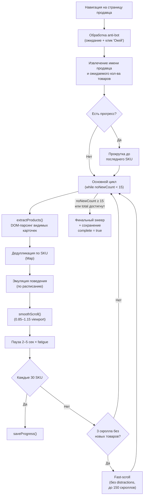
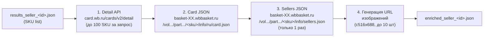
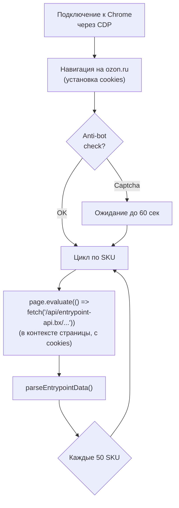
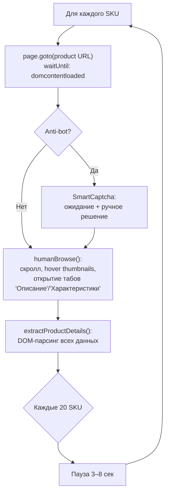
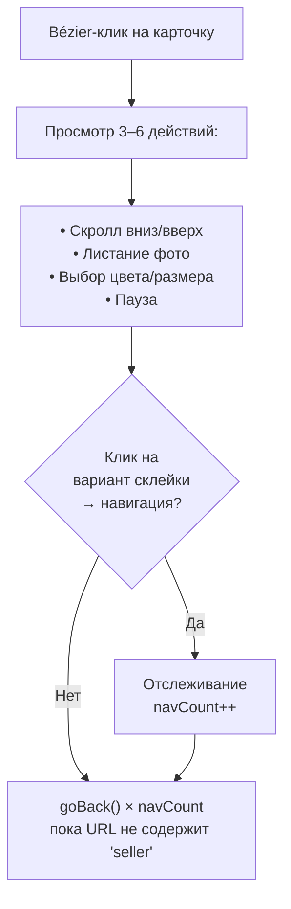

**Проект:** ADOLF — AI-Driven Operations Layer Framework  
**Модуль:** Watcher / Scanners & Enrichers  
**Версия:** 4.0  
**Дата:** Февраль 2026

---

## 4.1 Обзор

Сканеры и обогатители — дочерние процессы Node.js, запускаемые модулем Runner (см. [Раздел 3](/watcher/adolf_watcher_3_orchestrator_runner)). Расположены в директории `/opt/watcher/SKILL/`.

| Скрипт | Маркетплейс | Тип | Метод доступа | Размер |
|--------|-------------|-----|---------------|:------:|
| `scanner_wb.js` | Wildberries | Сканер | CDP (Playwright) | 35 KB |
| `scanner_ozon.js` | Ozon | Сканер | CDP (Playwright) | 20 KB |
| `scanner_ymarket.js` | Яндекс.Маркет | Сканер | CDP (Playwright) | 19 KB |
| `enricher_wb.js` | Wildberries | Обогатитель | HTTP (stdlib) | 13 KB |
| `enricher_ozon.js` | Ozon | Обогатитель | CDP (fetch в контексте) | 13 KB |
| `enricher_ymarket.js` | Яндекс.Маркет | Обогатитель | CDP (навигация + DOM) | 21 KB |
| `human.js` | Все | Библиотека | — | 12 KB |

### Архитектура вызовов



scanner\_wb.js содержит собственную копию функций эмуляции (исторически первый сканер), остальные сканеры используют общий модуль `human.js`.

---

## 4.2 Общий протокол

Все сканеры и обогатители следуют единому протоколу взаимодействия с Runner.

### Входные данные

**Сканеры:**

| Аргумент / ENV | Описание |
|---------------|----------|
| `argv[2]` — seller\_id | ID продавца на маркетплейсе |
| `argv[3]` — output\_dir | Директория для результата (по умолчанию `cwd`) |
| `--fresh` | Флаг: игнорировать прогресс, начать заново |
| `CDP_PORT` (env) | Порт Chrome CDP на VPS |
| `MARKETPLACE` (env) | Идентификатор маркетплейса |
| `SELLER_SLUG` (env) | Slug продавца (только YM) |

**Обогатители:**

| Аргумент / ENV | Описание |
|---------------|----------|
| `argv[2]` — seller\_id | ID продавца |
| `argv[3]` — output\_dir | Директория для результатов |
| `CDP_PORT` (env) | Порт Chrome CDP (только Ozon, YM) |

### Выходные файлы

| Тип | Файл | Формат |
|-----|------|--------|
| Скан (текущий) | `results_seller_<id>.json` | `{seller_id, marketplace, total_products, complete, products[], summary}` |
| Обогащение (текущее) | `enriched_seller_<id>.json` | `{seller_id, marketplace, total_enriched, total_input, complete, products[]}` |

### Exit codes

| Код | Значение |
|:---:|----------|
| 0 | Успех (для обогатителя: обогащено ≥ 50% SKU) |
| 1 | Ошибка / обогащено &lt; 50% |

### Resume-механизм

Все скрипты поддерживают возобновление прерванной работы:



---

## 4.3 Сканеры

### scanner\_wb.js — Wildberries

Самый крупный сканер (811 строк). Содержит собственную реализацию эмуляции поведения.

**URL:** `https://www.wildberries.ru/seller/<seller_id>`

**Подключение к браузеру:**

```javascript
const browser = await chromium.connectOverCDP(`http://localhost:${process.env.CDP_PORT}`);
const page = contexts[0].pages()[0]; // Использует существующую вкладку
```

Playwright подключается к уже работающему Chrome (не запускает новый экземпляр). Браузер остаётся запущенным после отключения.

**Извлечение данных:** DOM-парсинг через `page.evaluate()`.

| Селектор | Данные |
|----------|--------|
| `article.product-card[data-nm-id]` | Карточка товара (SKU из `data-nm-id`) |
| `.product-card__brand` | Бренд |
| `.product-card__name` | Название |
| `ins.price__lower-price` | Текущая цена |
| `del` | Старая цена |
| `.product-card__tip--sale` | Скидка |
| `span` (regex `/^[1-5][,.]\d+$/`) | Рейтинг |
| `span` (regex `/(\d+)\s*оцен/`) | Количество оценок |
| `.product-card__tip` | Бейджи |

**Алгоритм сбора:**



**Восстановление позиции (ensureOnSellerPage):**

При навигации на другую страницу (карточка товара, поиск, ошибка) сканер автоматически возвращается на страницу продавца и прокручивает до последнего собранного SKU (до 80 попыток скролла).

### scanner\_ozon.js — Ozon

**URL:** `https://www.ozon.ru/seller/<seller_id>/products/`

Использует общий модуль `human.js`. Извлечение данных через специфичные для Ozon селекторы.

| Селектор | Данные |
|----------|--------|
| `div.tile-root[data-index]` | Карточка товара |
| `[favlistslink]` attr | SKU (из `sku=(\d+)`) |
| `span.tsBody500Medium` | Название |
| `span.tsHeadline500Medium` | Текущая цена |
| CSS-класс `c35_3_12-b ` | Старая цена |
| Regex `/[−\-](\d+)%/` | Скидка |
| Regex `/(\d+)\s*отзыв/` | Количество отзывов |
| `section div[title]` | Бейджи |
| Regex `/([\d\s]+)\s*шт\s*остал/` | Остаток |

Дополнительное поле: `stock` (остаток на складе).

### scanner\_ymarket.js — Яндекс.Маркет

**URL:** `https://market.yandex.ru/business--<SELLER_SLUG>/<seller_id>/`

Требует `SELLER_SLUG` (env) — часть URL продавца. Использует `human.js`.

| Селектор | Данные |
|----------|--------|
| `[data-zone-name="productSnippet"]` | Карточка товара |
| `[data-auto="snippet-title"]` | Название |
| `[data-auto="snippet-link"]` | Ссылка (SKU из href) |
| `[data-auto="snippet-price-current"]` | Текущая цена |
| `[data-auto="snippet-price-old"]` | Старая цена |
| `[data-auto="reviews"]` | Отзывы / рейтинг |

SKU извлекается из href по паттерну `/card/{slug}/{id}` (последние цифры).

---

## 4.4 Обогатители

### enricher\_wb.js — Wildberries (HTTP)

Единственный обогатитель, не требующий CDP. Работает через публичные HTTP API Wildberries.

**Три API-источника:**



**Detail API** (`card.wb.ru/cards/v2/detail`): батч-запрос до 100 SKU. Возвращает актуальную цену, количество отзывов, продажи, размеры с остатками по складам.

**Card JSON** (`basket-XX.wbbasket.ru/.../card.json`): описание товара, характеристики (`options`/`grouped_options`), состав (`compositions`). Запрашивается для каждого SKU отдельно.

**Sellers JSON** (`basket-XX.wbbasket.ru/.../sellers.json`): имя поставщика и ОГРН. Запрашивается один раз (данные одинаковы для всех SKU продавца).

**Basket Host:** URL формируется на основе SKU через алгоритм `getBasketHost(sku)` — вычисление `vol`, `part` и номера бакета (`basket-01` — `basket-18`) по диапазонам `vol`.

**Задержки:** 300 мс между batch-запросами, 200 мс между per-SKU запросами, 100 мс между card.json и sellers.json.

### enricher\_ozon.js — Ozon (CDP + internal API)

Использует Chrome CDP для доступа к внутреннему API Ozon с действующими cookies.

**Метод:** `page.evaluate()` вызывает `fetch('/api/entrypoint-api.bx/page/json/v2?url=/product/<sku>/')` в контексте браузера. Это позволяет обойти PoW-защиту Ozon, недоступную через прямые HTTP-запросы.

**Извлечение данных из ответа API:**

| Источник | Данные |
|----------|--------|
| `seo.script` (JSON-LD) | Название, описание, цена, рейтинг, отзывы, изображение |
| `widgetStates` (различные ключи) | Цены, характеристики, описание, галерея, информация о продавце, наличие |

**Подключение к сессии:**



### enricher\_ymarket.js — Яндекс.Маркет (CDP + навигация)

Самый сложный обогатитель (509 строк). Открывает страницу каждого товара в браузере и извлекает данные из DOM.

**Метод:** полноценная навигация на страницу товара с эмуляцией поведения (human.js).

**Цикл обогащения:**



**Эмуляция поведения на странице товара:**

| Действие | Описание |
|----------|----------|
| Скролл | 2–3 скролла вниз по ~0.7 viewport |
| Hover thumbnails | Наведение на 2–3 миниатюры галереи (Bézier) |
| Открытие табов | Клик на «Описание» и «Характеристики» |
| Паузы | Случайные задержки 1–3 сек между действиями |

---

## 4.5 Эмуляция поведения (human.js)

Общая библиотека для имитации человеческого поведения при скроллинге и навигации. Используется сканерами Ozon, YM и обогатителем YM. Scanner WB содержит собственную копию этих функций.

### Утилиты

| Функция | Описание |
|---------|----------|
| `randInt(a, b)` | Случайное целое в диапазоне [a, b] |
| `sleep(ms)` | Промис-задержка |
| `getFatigue(collected, total)` | Коэффициент усталости: 1.0 (0–30%), 1.1 (30–70%), 1.25 (70–100%) |
| `humanType(page, text)` | Набор текста с опечатками (~12%) и паузами (~8%) |

### Коэффициент усталости (fatigue)

Имитирует замедление при длительной работе. Применяется как множитель к паузам.

| Прогресс сбора | Коэффициент | Эффект |
|:--------------:|:-----------:|--------|
| 0–30% | 1.0 | Нормальная скорость |
| 30–70% | 1.1 | +10% к паузам |
| 70–100% | 1.25 | +25% к паузам |

### Движение мыши (Bézier)

`bezierMove(page, fx, fy, tx, ty)` — перемещение курсора по кубической кривой Безье с двумя контрольными точками.

| Параметр | Значение |
|----------|----------|
| Шагов | 8–15 |
| Контрольные точки | Смещение ±60px (первая), ±30px (вторая) |
| Задержка между шагами | 10–30 мс |
| Overshoot (20% шанс) | Промах на ±30px → коррекция |
| Jitter (1–3 микродвижения) | ±5px после достижения цели |

### Клик и скролл

`humanClick(page, x, y)` — клик со случайным смещением ±10px и задержкой 200–500 мс.

`smoothScroll(page, delta, fatigue)` — плавный скролл порциями 200–450px с паузами 50–150 мс × fatigue.

### Набор текста с опечатками

`humanType(page, text)` — посимвольный ввод с эмуляцией:

| Элемент | Параметры |
|---------|-----------|
| Скорость ввода | 70–220 мс/символ |
| Вероятность опечатки | ~12% |
| Опечатка | Соседняя клавиша по русской QWERTY |
| Коррекция | Backspace через 200–600 мс |
| «Задумался» | ~8% шанс паузы 400–1200 мс |

Карта соседних клавиш (`RU_NEIGHBORS`): 30 символов русской раскладки с 2–3 соседями на каждый.

### Distractions (отвлечения)

Фабричные функции, создающие процедуры отвлечения для вставки между циклами сбора данных.

| Функция | Описание | Частота (WB) |
|---------|----------|:------------:|
| `makeHoverDistraction` | Наведение на случайную карточку (3–7 сек) | Каждые 2–3 товара |
| `makeViewCardDistraction` | Открытие карточки товара: скролл, фото, цвет/размер → goBack | Каждые 2–4 товара |
| `makeTextSelectDistraction` | Выделение текста названия → клик мимо | Каждые 8–18 товаров |
| `makeSearchDistraction` | Поиск: ввод запроса → вариации (Enter, подсказки, стирание) | Каждые 5–10 товаров |
| `makeRightClickDistraction` | Правый клик → Escape | Каждые 20–40 товаров |
| `makeTabDistraction` | Открытие новой вкладки (ozon.ru, yandex.ru, rbc.ru, vc.ru), скролл → закрытие | Каждые 10–20 товаров |
| Focus loss | Пауза 3–8 сек (имитация переключения на другое окно) | Каждые 10–20 товаров |
| Long pause | Пауза 10–25 сек (перерыв) | Каждые 25–50 товаров |

Каждая distraction обёрнута в `safeDistraction()`, которая после выполнения вызывает `ensureOnSellerPage()` для гарантии возврата на страницу продавца.

**ViewCard distraction** — наиболее сложная:



**Search distraction** — три варианта поведения после ввода запроса:

| Вариант | Вероятность | Действия |
|:-------:|:----------:|----------|
| 1 | 20% | Enter → скролл результатов → (35%) клик на товар → safeDistraction вернёт обратно |
| 2–3 | 40% | Просмотр автоподсказок → клик мимо |
| 4–5 | 40% | Побуквенное стирание (передумал) |

---

## 4.6 Выходная структура данных

### Результат сканирования

```json
{
  "seller_id": "1025130",
  "seller_name": "Конкурент А",
  "marketplace": "wildberries",
  "scan_date": "2026-02-14T03:00:00.000Z",
  "scan_duration_minutes": 95,
  "total_products": 142,
  "complete": true,
  "products": [
    {
      "sku": "123456789",
      "seller": "BrandName",
      "name": "Платье летнее миди",
      "price": 2990,
      "old_price": 5980,
      "discount": 50,
      "rating": 4.7,
      "reviews_count": 1284,
      "image_url": "https://...",
      "badges": ["Бестселлер"],
      "url": "https://www.wildberries.ru/catalog/123456789/detail.aspx"
    }
  ],
  "summary": {
    "price_min": 590,
    "price_max": 8900,
    "avg_rating": 4.6,
    "total_collected": 142,
    "pages_scanned": 47,
    "errors": 0
  }
}
```

### Результат обогащения

```json
{
  "seller_id": "1025130",
  "marketplace": "wildberries",
  "enriched_at": "2026-02-14T05:00:00.000Z",
  "duration_minutes": 12,
  "total_enriched": 138,
  "total_input": 142,
  "complete": true,
  "products": [
    {
      "sku": "123456789",
      "name": "Платье летнее миди A-line",
      "sale_price": 2990,
      "feedbacks": 1284,
      "sale_count": 5420,
      "sizes": "[{\"name\":\"42\",\"stocks\":[{\"wh\":507,\"qty\":12}]}]",
      "total_stock": 47,
      "description": "Лёгкое платье из вискозы...",
      "characteristics": "[{\"name\":\"Состав\",\"value\":\"Вискоза 100%\"}]",
      "compositions": "[{\"name\":\"Основной материал\",\"value\":\"Вискоза\"}]",
      "images": "[\"https://basket-12.wbbasket.ru/.../1.webp\",...]",
      "seller_name": "ООО Конкурент",
      "seller_ogrn": "1234567890123"
    }
  ]
}
```

### Сравнение полей

| Поле | Сканер | Обогатитель WB | Обогатитель Ozon | Обогатитель YM |
|------|:------:|:--------------:|:----------------:|:--------------:|
| sku | ✅ | ✅ | ✅ | ✅ |
| name | ✅ (краткое) | ✅ (полное) | ✅ | ✅ |
| price / sale\_price | ✅ | ✅ (актуальная) | ✅ | ✅ |
| old\_price | ✅ | — | — | — |
| discount | ✅ | — | — | — |
| rating | ✅ | — | ✅ | ✅ |
| reviews\_count / feedbacks | ✅ | ✅ | ✅ | ✅ |
| sale\_count | — | ✅ | — | — |
| sizes | — | ✅ (JSON) | — | ✅ |
| total\_stock | — | ✅ | ✅ | — |
| description | — | ✅ | ✅ | ✅ |
| characteristics | — | ✅ (JSON) | ✅ | ✅ |
| compositions | — | ✅ (JSON) | — | — |
| images | ✅ (1 шт) | ✅ (до 10) | ✅ | ✅ |
| seller\_name | — | ✅ | ✅ | ✅ |
| seller\_ogrn | — | ✅ | — | — |

---

## 4.7 Anti-bot и восстановление

### Механизмы по маркетплейсам

| Маркетплейс | Anti-bot | Обработка |
|-------------|----------|-----------|
| Wildberries | «Почти готово» (JS challenge) | Ожидание до 60 сек + клик «Окей» |
| Ozon | PoW / Captcha | Ожидание до 60 сек; при enrichment — cookies из сессии |
| Яндекс.Маркет | SmartCaptcha | Ожидание + ручное решение (если доступен ПК) |

### Fast-scroll recovery

При 3 скроллах подряд без новых товаров (и `collected < total`):

1. Проверка: находимся ли на странице продавца
2. Если нет — навигация обратно
3. Быстрая прокрутка (без distractions) — до 150 скроллов по viewport
4. Каждые 5 скроллов — проверка новых SKU
5. Каждые 20 — пауза для ленивой подгрузки
6. При обнаружении нового SKU — возврат к нормальному режиму

### Pagination fallback

При достижении конца страницы и `noNewCount ≥ 3` — попытка кликнуть кнопку пагинации:

| Селектор | Маркетплейс |
|----------|-------------|
| `button:has-text("Показать ещё")` | WB |
| `[class*="show-more"]` | WB/Ozon |
| `a[class*="pagination__next"]` | WB/Ozon |

До 3 попыток пагинации за скан.

---

## 4.8 SKILL.md — Claude Code интеграция

Файл `SKILL.md` в директории `/opt/watcher/SKILL/` содержит инструкции для Claude Code, позволяющие ИИ-агенту модифицировать и создавать сканеры/обогатители.

**Ключевые ограничения SKILL.md:**

| Правило | Описание |
|---------|----------|
| Единственный npm-пакет | `playwright-core` (подключение к существующему Chrome) |
| Без headless | Chrome запущен пользователем, подключение через CDP |
| Всегда `process.exit()` | Явный выход с кодом 0 или 1 |
| Без закрытия браузера | `browser.close()` запрещён — Chrome общий |
| Промежуточное сохранение | Обязательно каждые N элементов |
| Человеческое поведение | human.js для всех новых скриптов |

---

**Документ подготовлен:** Февраль 2026  
**Версия:** 4.0  
**Статус:** Черновик
