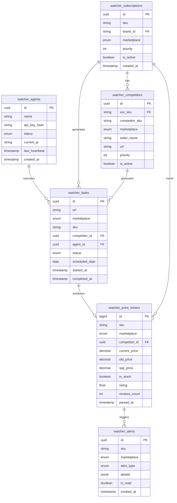

**Проект:** Интеллектуальная система мониторинга цен конкурентов  
**Модуль:** Watcher / Database  
**Версия:** 2.0  
**Дата:** Январь 2026

---

## 5.1 Обзор

### Хранилища данных

| Хранилище | Назначение | Данные |
|-----------|------------|--------|
| **PostgreSQL** | Основное хранилище | Агенты, задачи, история цен, подписки, конкуренты, алерты |
| **Redis** | Оперативные данные | Очереди задач, IP Semaphore, статусы агентов, кэш |

### Схема данных



---

## 5.2 Таблицы PostgreSQL

### 5.2.1 watcher_agents

Реестр агентов парсинга.

```sql
CREATE TABLE watcher_agents (
    id UUID PRIMARY KEY DEFAULT gen_random_uuid(),
    
    -- Идентификация
    name VARCHAR(100) NOT NULL,
    description TEXT,
    api_key_hash VARCHAR(64) NOT NULL UNIQUE,
    
    -- Привязка к менеджеру
    manager_user_id UUID REFERENCES users(id),
    pc_name VARCHAR(100),
    
    -- Состояние
    status VARCHAR(20) NOT NULL DEFAULT 'offline',
    current_ip VARCHAR(45),
    current_task_id UUID,
    
    -- Информация о модеме
    modem_operator VARCHAR(50),
    signal_strength INTEGER,
    
    -- Cookies
    cookies_updated_at TIMESTAMP,
    cookies_valid BOOLEAN DEFAULT FALSE,
    
    -- Статистика
    tasks_completed_total INTEGER DEFAULT 0,
    tasks_failed_total INTEGER DEFAULT 0,
    avg_task_time_ms INTEGER,
    
    -- Версия и метаданные
    version VARCHAR(20),
    config JSONB DEFAULT '{}',
    
    -- Timestamps
    last_heartbeat TIMESTAMP,
    created_at TIMESTAMP NOT NULL DEFAULT NOW(),
    updated_at TIMESTAMP NOT NULL DEFAULT NOW(),
    
    -- Constraints
    CONSTRAINT chk_agent_status CHECK (
        status IN ('idle', 'preparing', 'ready', 'working', 'paused', 'panic', 'offline', 'stopped')
    )
);

-- Indexes
CREATE INDEX idx_watcher_agents_status ON watcher_agents(status);
CREATE INDEX idx_watcher_agents_last_heartbeat ON watcher_agents(last_heartbeat);

-- Comments
COMMENT ON TABLE watcher_agents IS 'Реестр агентов парсинга Watcher';
COMMENT ON COLUMN watcher_agents.api_key_hash IS 'SHA-256 хеш API ключа';
COMMENT ON COLUMN watcher_agents.status IS 'Текущий статус агента';
```

### 5.2.2 watcher_subscriptions

Подписки на мониторинг SKU.

```sql
CREATE TABLE watcher_subscriptions (
    id UUID PRIMARY KEY DEFAULT gen_random_uuid(),
    
    -- Идентификация товара
    sku VARCHAR(50) NOT NULL,
    marketplace VARCHAR(20) NOT NULL,
    brand_id VARCHAR(20) NOT NULL,
    
    -- URL карточки (для собственных товаров)
    url VARCHAR(500),
    
    -- Настройки мониторинга
    priority INTEGER DEFAULT 0,
    is_active BOOLEAN NOT NULL DEFAULT TRUE,
    
    -- Настройки алертов
    alert_price_drop_percent INTEGER DEFAULT 10,
    alert_price_rise_percent INTEGER DEFAULT 20,
    alert_out_of_stock BOOLEAN DEFAULT TRUE,
    
    -- Метаданные
    notes TEXT,
    created_by UUID REFERENCES users(id),
    
    -- Timestamps
    created_at TIMESTAMP NOT NULL DEFAULT NOW(),
    updated_at TIMESTAMP NOT NULL DEFAULT NOW(),
    
    -- Constraints
    CONSTRAINT chk_subscription_marketplace CHECK (
        marketplace IN ('wildberries', 'ozon', 'yandex_market')
    ),
    CONSTRAINT chk_subscription_brand CHECK (
        brand_id IN ('ohana_market', 'ohana_kids', 'all')
    ),
    CONSTRAINT uq_subscription_sku_marketplace UNIQUE (sku, marketplace)
);

-- Indexes
CREATE INDEX idx_watcher_subscriptions_sku ON watcher_subscriptions(sku);
CREATE INDEX idx_watcher_subscriptions_marketplace ON watcher_subscriptions(marketplace);
CREATE INDEX idx_watcher_subscriptions_brand ON watcher_subscriptions(brand_id);
CREATE INDEX idx_watcher_subscriptions_active ON watcher_subscriptions(is_active) WHERE is_active = TRUE;

-- Comments
COMMENT ON TABLE watcher_subscriptions IS 'Подписки на мониторинг собственных SKU';
COMMENT ON COLUMN watcher_subscriptions.priority IS 'Приоритет мониторинга (0 = обычный)';
```

### 5.2.3 watcher_competitors

Конкуренты для мониторинга.

```sql
CREATE TABLE watcher_competitors (
    id UUID PRIMARY KEY DEFAULT gen_random_uuid(),
    
    -- Привязка к нашему товару
    our_sku VARCHAR(50) NOT NULL,
    subscription_id UUID REFERENCES watcher_subscriptions(id) ON DELETE CASCADE,
    
    -- Данные конкурента
    competitor_sku VARCHAR(50) NOT NULL,
    marketplace VARCHAR(20) NOT NULL,
    seller_name VARCHAR(200),
    url VARCHAR(500) NOT NULL,
    
    -- Категоризация
    category VARCHAR(200),
    
    -- Настройки
    priority INTEGER DEFAULT 0,
    is_active BOOLEAN NOT NULL DEFAULT TRUE,
    
    -- Метаданные
    notes TEXT,
    added_by UUID REFERENCES users(id),
    
    -- Timestamps
    created_at TIMESTAMP NOT NULL DEFAULT NOW(),
    updated_at TIMESTAMP NOT NULL DEFAULT NOW(),
    
    -- Constraints
    CONSTRAINT chk_competitor_marketplace CHECK (
        marketplace IN ('wildberries', 'ozon', 'yandex_market')
    ),
    CONSTRAINT uq_competitor_url UNIQUE (url)
);

-- Indexes
CREATE INDEX idx_watcher_competitors_our_sku ON watcher_competitors(our_sku);
CREATE INDEX idx_watcher_competitors_marketplace ON watcher_competitors(marketplace);
CREATE INDEX idx_watcher_competitors_active ON watcher_competitors(is_active) WHERE is_active = TRUE;
CREATE INDEX idx_watcher_competitors_subscription ON watcher_competitors(subscription_id);

-- Comments
COMMENT ON TABLE watcher_competitors IS 'Конкуренты для мониторинга цен';
COMMENT ON COLUMN watcher_competitors.our_sku IS 'Артикул нашего товара, с которым сравниваем';
COMMENT ON COLUMN watcher_competitors.priority IS 'Приоритет мониторинга (влияет на частоту в v2.0)';
```

### 5.2.4 watcher_tasks

Задачи парсинга.

```sql
CREATE TABLE watcher_tasks (
    id UUID PRIMARY KEY DEFAULT gen_random_uuid(),
    
    -- Цель парсинга
    url VARCHAR(500) NOT NULL,
    marketplace VARCHAR(20) NOT NULL,
    sku VARCHAR(50) NOT NULL,
    brand_id VARCHAR(20) NOT NULL,
    
    -- Связи
    subscription_id UUID REFERENCES watcher_subscriptions(id),
    competitor_id UUID REFERENCES watcher_competitors(id),
    
    -- Исполнение
    agent_id UUID REFERENCES watcher_agents(id),
    status VARCHAR(20) NOT NULL DEFAULT 'pending',
    priority INTEGER DEFAULT 0,
    
    -- Планирование
    scheduled_date DATE NOT NULL,
    
    -- Timing
    started_at TIMESTAMP,
    completed_at TIMESTAMP,
    execution_time_ms INTEGER,
    
    -- Результат
    retry_count INTEGER DEFAULT 0,
    error TEXT,
    
    -- Timestamps
    created_at TIMESTAMP NOT NULL DEFAULT NOW(),
    
    -- Constraints
    CONSTRAINT chk_task_status CHECK (
        status IN ('pending', 'in_progress', 'completed', 'failed', 'parse_error', 'cancelled')
    ),
    CONSTRAINT chk_task_marketplace CHECK (
        marketplace IN ('wildberries', 'ozon', 'yandex_market')
    )
);

-- Indexes
CREATE INDEX idx_watcher_tasks_status ON watcher_tasks(status);
CREATE INDEX idx_watcher_tasks_scheduled ON watcher_tasks(scheduled_date);
CREATE INDEX idx_watcher_tasks_agent ON watcher_tasks(agent_id);
CREATE INDEX idx_watcher_tasks_sku ON watcher_tasks(sku);
CREATE INDEX idx_watcher_tasks_marketplace_status ON watcher_tasks(marketplace, status);

-- Partitioning by scheduled_date (для производительности)
-- В production рекомендуется партиционирование по месяцам

-- Comments
COMMENT ON TABLE watcher_tasks IS 'Задачи парсинга (генерируются ежедневно)';
COMMENT ON COLUMN watcher_tasks.scheduled_date IS 'Дата, на которую запланирована задача';
COMMENT ON COLUMN watcher_tasks.retry_count IS 'Количество повторных попыток';
```

### 5.2.5 watcher_price_history

История цен (основная таблица данных).

```sql
CREATE TABLE watcher_price_history (
    id BIGSERIAL PRIMARY KEY,
    
    -- Идентификация
    sku VARCHAR(50) NOT NULL,
    marketplace VARCHAR(20) NOT NULL,
    brand_id VARCHAR(20) NOT NULL,
    
    -- Связи
    subscription_id UUID REFERENCES watcher_subscriptions(id),
    competitor_id UUID REFERENCES watcher_competitors(id),
    task_id UUID REFERENCES watcher_tasks(id),
    
    -- Цены
    current_price DECIMAL(12, 2),
    old_price DECIMAL(12, 2),
    spp_price DECIMAL(12, 2),
    discount_percent INTEGER,
    
    -- Наличие
    in_stock BOOLEAN,
    stock_quantity INTEGER,
    
    -- Рейтинг и отзывы
    rating DECIMAL(2, 1),
    reviews_count INTEGER,
    sales_count INTEGER,
    
    -- Позиция и реклама
    position INTEGER,
    ad_bid DECIMAL(10, 2),
    
    -- Информация о продавце
    seller_name VARCHAR(200),
    
    -- Контент карточки
    card_title VARCHAR(500),
    card_description TEXT,
    card_attributes JSONB,
    category VARCHAR(500),
    
    -- AI Parser метаданные
    parse_confidence DECIMAL(3, 2),
    
    -- Timestamps
    parsed_at TIMESTAMP NOT NULL DEFAULT NOW(),
    
    -- Constraints
    CONSTRAINT chk_price_history_marketplace CHECK (
        marketplace IN ('wildberries', 'ozon', 'yandex_market')
    ),
    CONSTRAINT chk_price_history_rating CHECK (
        rating IS NULL OR (rating >= 1.0 AND rating <= 5.0)
    )
);

-- Indexes для запросов
CREATE INDEX idx_watcher_price_history_sku ON watcher_price_history(sku);
CREATE INDEX idx_watcher_price_history_marketplace ON watcher_price_history(marketplace);
CREATE INDEX idx_watcher_price_history_brand ON watcher_price_history(brand_id);
CREATE INDEX idx_watcher_price_history_parsed_at ON watcher_price_history(parsed_at);
CREATE INDEX idx_watcher_price_history_competitor ON watcher_price_history(competitor_id);

-- Composite index для типичных запросов
CREATE INDEX idx_watcher_price_history_sku_mp_date 
    ON watcher_price_history(sku, marketplace, parsed_at DESC);

-- Partial index для собственных товаров
CREATE INDEX idx_watcher_price_history_own 
    ON watcher_price_history(sku, marketplace, parsed_at DESC) 
    WHERE competitor_id IS NULL;

-- Comments
COMMENT ON TABLE watcher_price_history IS 'История цен и данных о товарах (5 лет хранения)';
COMMENT ON COLUMN watcher_price_history.parse_confidence IS 'Уверенность AI Parser (0.0-1.0)';
```

### 5.2.6 watcher_alerts

Алерты о ценовых изменениях.

```sql
CREATE TABLE watcher_alerts (
    id UUID PRIMARY KEY DEFAULT gen_random_uuid(),
    
    -- Контекст
    sku VARCHAR(50) NOT NULL,
    marketplace VARCHAR(20) NOT NULL,
    brand_id VARCHAR(20) NOT NULL,
    competitor_id UUID REFERENCES watcher_competitors(id),
    
    -- Тип и детали
    alert_type VARCHAR(30) NOT NULL,
    severity VARCHAR(10) NOT NULL DEFAULT 'warning',
    
    -- Данные алерта
    details JSONB NOT NULL,
    /*
    Примеры details:
    {
        "old_price": 2999,
        "new_price": 1999,
        "change_percent": -33.3,
        "competitor_name": "Fashion Store"
    }
    */
    
    -- Статус
    is_read BOOLEAN NOT NULL DEFAULT FALSE,
    read_at TIMESTAMP,
    read_by UUID REFERENCES users(id),
    
    -- Действия
    is_resolved BOOLEAN NOT NULL DEFAULT FALSE,
    resolved_at TIMESTAMP,
    resolved_by UUID REFERENCES users(id),
    resolution_notes TEXT,
    
    -- Timestamps
    created_at TIMESTAMP NOT NULL DEFAULT NOW(),
    
    -- Constraints
    CONSTRAINT chk_alert_type CHECK (
        alert_type IN (
            'price_drop',           -- Снижение цены конкурента
            'price_rise',           -- Повышение цены конкурента
            'out_of_stock',         -- Товар закончился
            'back_in_stock',        -- Товар снова в наличии
            'new_competitor',       -- Новый конкурент
            'rating_drop',          -- Падение рейтинга
            'dumping_detected'      -- Обнаружен демпинг
        )
    ),
    CONSTRAINT chk_alert_severity CHECK (
        severity IN ('info', 'warning', 'critical')
    )
);

-- Indexes
CREATE INDEX idx_watcher_alerts_sku ON watcher_alerts(sku);
CREATE INDEX idx_watcher_alerts_brand ON watcher_alerts(brand_id);
CREATE INDEX idx_watcher_alerts_type ON watcher_alerts(alert_type);
CREATE INDEX idx_watcher_alerts_unread ON watcher_alerts(is_read, created_at DESC) WHERE is_read = FALSE;
CREATE INDEX idx_watcher_alerts_created ON watcher_alerts(created_at DESC);

-- Comments
COMMENT ON TABLE watcher_alerts IS 'Алерты об изменениях цен и наличия';
COMMENT ON COLUMN watcher_alerts.severity IS 'Критичность: info, warning, critical';
```

### 5.2.7 watcher_settings

Глобальные настройки модуля.

```sql
CREATE TABLE watcher_settings (
    key VARCHAR(100) PRIMARY KEY,
    value TEXT NOT NULL,
    description TEXT,
    updated_at TIMESTAMP NOT NULL DEFAULT NOW(),
    updated_by UUID REFERENCES users(id)
);

-- Default settings
INSERT INTO watcher_settings (key, value, description) VALUES
-- Эмуляция
('emulation.min_delay_ms', '2000', 'Минимальная задержка между действиями (мс)'),
('emulation.max_delay_ms', '5000', 'Максимальная задержка между действиями (мс)'),
('emulation.scroll_enabled', 'true', 'Включить эмуляцию скролла'),
('emulation.scroll_steps', '3', 'Количество шагов скролла'),
('emulation.mouse_movement', 'true', 'Включить эмуляцию движений мыши'),
('emulation.mouse_curve', 'bezier', 'Тип кривой движения мыши'),
('emulation.page_view_min_ms', '3000', 'Минимальное время просмотра страницы (мс)'),
('emulation.page_view_max_ms', '8000', 'Максимальное время просмотра страницы (мс)'),
('emulation.random_order', 'true', 'Случайный порядок обхода URL'),

-- Алерты
('alerts.price_drop_threshold', '10', 'Порог снижения цены для алерта (%)'),
('alerts.price_rise_threshold', '20', 'Порог повышения цены для алерта (%)'),
('alerts.dumping_threshold', '30', 'Порог демпинга (%)'),

-- Система
('system.task_max_retries', '3', 'Максимум повторных попыток для задачи'),
('system.agent_heartbeat_timeout', '120', 'Таймаут heartbeat агента (сек)'),
('system.ip_semaphore_ttl', '300', 'TTL блокировки IP Semaphore (сек)'),
('system.panic_cooldown', '3600', 'Время cooldown после PANIC (сек)');

-- Comments
COMMENT ON TABLE watcher_settings IS 'Глобальные настройки модуля Watcher';
```

### 5.2.8 watcher_agent_logs

Логи событий агентов.

```sql
CREATE TABLE watcher_agent_logs (
    id BIGSERIAL PRIMARY KEY,
    
    agent_id UUID NOT NULL REFERENCES watcher_agents(id),
    
    -- Событие
    event_type VARCHAR(50) NOT NULL,
    severity VARCHAR(10) NOT NULL DEFAULT 'info',
    message TEXT NOT NULL,
    details JSONB,
    
    -- Timestamps
    created_at TIMESTAMP NOT NULL DEFAULT NOW(),
    
    -- Constraints
    CONSTRAINT chk_agent_log_event CHECK (
        event_type IN (
            'status_change', 'heartbeat', 'task_start', 'task_complete', 
            'task_fail', 'panic', 'cookies_update', 'network_switch',
            'modem_reboot', 'command_received', 'error'
        )
    ),
    CONSTRAINT chk_agent_log_severity CHECK (
        severity IN ('debug', 'info', 'warning', 'error', 'critical')
    )
);

-- Indexes
CREATE INDEX idx_watcher_agent_logs_agent ON watcher_agent_logs(agent_id);
CREATE INDEX idx_watcher_agent_logs_event ON watcher_agent_logs(event_type);
CREATE INDEX idx_watcher_agent_logs_created ON watcher_agent_logs(created_at DESC);

-- Автоматическая очистка старых логов (30 дней)
-- Рекомендуется настроить pg_partman или pg_cron

-- Comments
COMMENT ON TABLE watcher_agent_logs IS 'Логи событий агентов (30 дней хранения)';
```

---

## 5.3 Структуры Redis

### 5.3.1 Очереди задач

```
# Очередь задач по маркетплейсам (List)
watcher:task_queue:wildberries    = [task_id_1, task_id_2, ...]
watcher:task_queue:ozon           = [task_id_1, task_id_2, ...]
watcher:task_queue:yandex_market  = [task_id_1, task_id_2, ...]

# Операции:
LPOP  watcher:task_queue:{marketplace}        # Получение задачи
RPUSH watcher:task_queue:{marketplace} {id}   # Добавление задачи
LLEN  watcher:task_queue:{marketplace}        # Количество в очереди
```

### 5.3.2 IP Semaphore

```
# Блокировка IP для домена (String с TTL)
watcher:ip_sem:{ip}:{domain} = "1"
TTL = 300 секунд

# Примеры:
watcher:ip_sem:10.0.0.1:wildberries.ru = "1"
watcher:ip_sem:10.0.0.2:ozon.ru = "1"

# Операции:
SET   watcher:ip_sem:{ip}:{domain} 1 NX EX 300   # Захват
DEL   watcher:ip_sem:{ip}:{domain}               # Освобождение
EXISTS watcher:ip_sem:{ip}:{domain}              # Проверка
```

### 5.3.3 Состояние агентов

```
# Текущее состояние агента (Hash)
watcher:agent:{agent_id}:state = {
    "status": "working",
    "current_task": "task_uuid",
    "last_heartbeat": "2026-01-15T22:30:00",
    "current_ip": "10.0.0.1"
}
TTL = 300 секунд (обновляется при heartbeat)

# IP агента (String)
watcher:agent:{agent_id}:ip = "10.0.0.1"

# WebSocket сессия (Hash)
watcher:agent:{agent_id}:ws = {
    "connected_at": "2026-01-15T21:00:00",
    "active": "1"
}

# Статистика за день (String)
watcher:agent:{agent_id}:completed:2026-01-15 = "1234"
watcher:agent:{agent_id}:failed:2026-01-15 = "5"
TTL = 172800 секунд (2 дня)

# Среднее время выполнения (List, последние 100)
watcher:agent:{agent_id}:timing = ["1250", "980", "1100", ...]
```

### 5.3.4 Panic и блокировки

```
# Заблокированные IP (String с TTL)
watcher:ip_blocked:{ip} = "captcha_detected"
TTL = 3600 секунд (1 час)

# Информация о Panic (Hash)
watcher:agent:{agent_id}:panic = {
    "reason": "captcha",
    "details": "{...}",
    "timestamp": "2026-01-15T23:45:00"
}
```

### 5.3.5 Кэш парсинга

```
# Кэш результатов AI Parser (String)
watcher:parse_cache:{marketplace}:{text_hash} = "{...json...}"
TTL = 3600 секунд (1 час)
```

### 5.3.6 Дневная статистика

```
# Глобальная статистика (Hash)
watcher:stats:2026-01-15 = {
    "tasks_total": "33000",
    "tasks_completed": "32500",
    "tasks_failed": "500",
    "avg_parse_time_ms": "1250",
    "alerts_generated": "15"
}
TTL = 604800 секунд (7 дней)
```

---

## 5.4 Миграции

### Начальная миграция

```python
# alembic/versions/001_create_watcher_tables.py

"""Create Watcher tables

Revision ID: 001
Create Date: 2026-01-15
"""

from alembic import op
import sqlalchemy as sa
from sqlalchemy.dialects.postgresql import UUID, JSONB


revision = '001'
down_revision = None
branch_labels = None
depends_on = None


def upgrade():
    # watcher_agents
    op.create_table(
        'watcher_agents',
        sa.Column('id', UUID(), primary_key=True, server_default=sa.text('gen_random_uuid()')),
        sa.Column('name', sa.String(100), nullable=False),
        sa.Column('description', sa.Text()),
        sa.Column('api_key_hash', sa.String(64), nullable=False, unique=True),
        sa.Column('manager_user_id', UUID(), sa.ForeignKey('users.id')),
        sa.Column('pc_name', sa.String(100)),
        sa.Column('status', sa.String(20), nullable=False, server_default='offline'),
        sa.Column('current_ip', sa.String(45)),
        sa.Column('current_task_id', UUID()),
        sa.Column('modem_operator', sa.String(50)),
        sa.Column('signal_strength', sa.Integer()),
        sa.Column('cookies_updated_at', sa.DateTime()),
        sa.Column('cookies_valid', sa.Boolean(), server_default='false'),
        sa.Column('tasks_completed_total', sa.Integer(), server_default='0'),
        sa.Column('tasks_failed_total', sa.Integer(), server_default='0'),
        sa.Column('avg_task_time_ms', sa.Integer()),
        sa.Column('version', sa.String(20)),
        sa.Column('config', JSONB(), server_default='{}'),
        sa.Column('last_heartbeat', sa.DateTime()),
        sa.Column('created_at', sa.DateTime(), nullable=False, server_default=sa.text('NOW()')),
        sa.Column('updated_at', sa.DateTime(), nullable=False, server_default=sa.text('NOW()'))
    )
    
    op.create_index('idx_watcher_agents_status', 'watcher_agents', ['status'])
    op.create_index('idx_watcher_agents_last_heartbeat', 'watcher_agents', ['last_heartbeat'])
    
    # watcher_subscriptions
    op.create_table(
        'watcher_subscriptions',
        sa.Column('id', UUID(), primary_key=True, server_default=sa.text('gen_random_uuid()')),
        sa.Column('sku', sa.String(50), nullable=False),
        sa.Column('marketplace', sa.String(20), nullable=False),
        sa.Column('brand_id', sa.String(20), nullable=False),
        sa.Column('url', sa.String(500)),
        sa.Column('priority', sa.Integer(), server_default='0'),
        sa.Column('is_active', sa.Boolean(), nullable=False, server_default='true'),
        sa.Column('alert_price_drop_percent', sa.Integer(), server_default='10'),
        sa.Column('alert_price_rise_percent', sa.Integer(), server_default='20'),
        sa.Column('alert_out_of_stock', sa.Boolean(), server_default='true'),
        sa.Column('notes', sa.Text()),
        sa.Column('created_by', UUID(), sa.ForeignKey('users.id')),
        sa.Column('created_at', sa.DateTime(), nullable=False, server_default=sa.text('NOW()')),
        sa.Column('updated_at', sa.DateTime(), nullable=False, server_default=sa.text('NOW()')),
        sa.UniqueConstraint('sku', 'marketplace', name='uq_subscription_sku_marketplace')
    )
    
    op.create_index('idx_watcher_subscriptions_sku', 'watcher_subscriptions', ['sku'])
    op.create_index('idx_watcher_subscriptions_marketplace', 'watcher_subscriptions', ['marketplace'])
    op.create_index('idx_watcher_subscriptions_brand', 'watcher_subscriptions', ['brand_id'])
    
    # watcher_competitors
    op.create_table(
        'watcher_competitors',
        sa.Column('id', UUID(), primary_key=True, server_default=sa.text('gen_random_uuid()')),
        sa.Column('our_sku', sa.String(50), nullable=False),
        sa.Column('subscription_id', UUID(), sa.ForeignKey('watcher_subscriptions.id', ondelete='CASCADE')),
        sa.Column('competitor_sku', sa.String(50), nullable=False),
        sa.Column('marketplace', sa.String(20), nullable=False),
        sa.Column('seller_name', sa.String(200)),
        sa.Column('url', sa.String(500), nullable=False, unique=True),
        sa.Column('category', sa.String(200)),
        sa.Column('priority', sa.Integer(), server_default='0'),
        sa.Column('is_active', sa.Boolean(), nullable=False, server_default='true'),
        sa.Column('notes', sa.Text()),
        sa.Column('added_by', UUID(), sa.ForeignKey('users.id')),
        sa.Column('created_at', sa.DateTime(), nullable=False, server_default=sa.text('NOW()')),
        sa.Column('updated_at', sa.DateTime(), nullable=False, server_default=sa.text('NOW()'))
    )
    
    op.create_index('idx_watcher_competitors_our_sku', 'watcher_competitors', ['our_sku'])
    op.create_index('idx_watcher_competitors_marketplace', 'watcher_competitors', ['marketplace'])
    
    # watcher_tasks
    op.create_table(
        'watcher_tasks',
        sa.Column('id', UUID(), primary_key=True, server_default=sa.text('gen_random_uuid()')),
        sa.Column('url', sa.String(500), nullable=False),
        sa.Column('marketplace', sa.String(20), nullable=False),
        sa.Column('sku', sa.String(50), nullable=False),
        sa.Column('brand_id', sa.String(20), nullable=False),
        sa.Column('subscription_id', UUID(), sa.ForeignKey('watcher_subscriptions.id')),
        sa.Column('competitor_id', UUID(), sa.ForeignKey('watcher_competitors.id')),
        sa.Column('agent_id', UUID(), sa.ForeignKey('watcher_agents.id')),
        sa.Column('status', sa.String(20), nullable=False, server_default='pending'),
        sa.Column('priority', sa.Integer(), server_default='0'),
        sa.Column('scheduled_date', sa.Date(), nullable=False),
        sa.Column('started_at', sa.DateTime()),
        sa.Column('completed_at', sa.DateTime()),
        sa.Column('execution_time_ms', sa.Integer()),
        sa.Column('retry_count', sa.Integer(), server_default='0'),
        sa.Column('error', sa.Text()),
        sa.Column('created_at', sa.DateTime(), nullable=False, server_default=sa.text('NOW()'))
    )
    
    op.create_index('idx_watcher_tasks_status', 'watcher_tasks', ['status'])
    op.create_index('idx_watcher_tasks_scheduled', 'watcher_tasks', ['scheduled_date'])
    op.create_index('idx_watcher_tasks_agent', 'watcher_tasks', ['agent_id'])
    op.create_index('idx_watcher_tasks_sku', 'watcher_tasks', ['sku'])
    
    # watcher_price_history
    op.create_table(
        'watcher_price_history',
        sa.Column('id', sa.BigInteger(), primary_key=True, autoincrement=True),
        sa.Column('sku', sa.String(50), nullable=False),
        sa.Column('marketplace', sa.String(20), nullable=False),
        sa.Column('brand_id', sa.String(20), nullable=False),
        sa.Column('subscription_id', UUID(), sa.ForeignKey('watcher_subscriptions.id')),
        sa.Column('competitor_id', UUID(), sa.ForeignKey('watcher_competitors.id')),
        sa.Column('task_id', UUID(), sa.ForeignKey('watcher_tasks.id')),
        sa.Column('current_price', sa.Numeric(12, 2)),
        sa.Column('old_price', sa.Numeric(12, 2)),
        sa.Column('spp_price', sa.Numeric(12, 2)),
        sa.Column('discount_percent', sa.Integer()),
        sa.Column('in_stock', sa.Boolean()),
        sa.Column('stock_quantity', sa.Integer()),
        sa.Column('rating', sa.Numeric(2, 1)),
        sa.Column('reviews_count', sa.Integer()),
        sa.Column('sales_count', sa.Integer()),
        sa.Column('position', sa.Integer()),
        sa.Column('ad_bid', sa.Numeric(10, 2)),
        sa.Column('seller_name', sa.String(200)),
        sa.Column('card_title', sa.String(500)),
        sa.Column('card_description', sa.Text()),
        sa.Column('card_attributes', JSONB()),
        sa.Column('category', sa.String(500)),
        sa.Column('parse_confidence', sa.Numeric(3, 2)),
        sa.Column('parsed_at', sa.DateTime(), nullable=False, server_default=sa.text('NOW()'))
    )
    
    op.create_index('idx_watcher_price_history_sku', 'watcher_price_history', ['sku'])
    op.create_index('idx_watcher_price_history_marketplace', 'watcher_price_history', ['marketplace'])
    op.create_index('idx_watcher_price_history_brand', 'watcher_price_history', ['brand_id'])
    op.create_index('idx_watcher_price_history_parsed_at', 'watcher_price_history', ['parsed_at'])
    op.create_index('idx_watcher_price_history_sku_mp_date', 'watcher_price_history', 
                    ['sku', 'marketplace', sa.text('parsed_at DESC')])
    
    # watcher_alerts
    op.create_table(
        'watcher_alerts',
        sa.Column('id', UUID(), primary_key=True, server_default=sa.text('gen_random_uuid()')),
        sa.Column('sku', sa.String(50), nullable=False),
        sa.Column('marketplace', sa.String(20), nullable=False),
        sa.Column('brand_id', sa.String(20), nullable=False),
        sa.Column('competitor_id', UUID(), sa.ForeignKey('watcher_competitors.id')),
        sa.Column('alert_type', sa.String(30), nullable=False),
        sa.Column('severity', sa.String(10), nullable=False, server_default='warning'),
        sa.Column('details', JSONB(), nullable=False),
        sa.Column('is_read', sa.Boolean(), nullable=False, server_default='false'),
        sa.Column('read_at', sa.DateTime()),
        sa.Column('read_by', UUID(), sa.ForeignKey('users.id')),
        sa.Column('is_resolved', sa.Boolean(), nullable=False, server_default='false'),
        sa.Column('resolved_at', sa.DateTime()),
        sa.Column('resolved_by', UUID(), sa.ForeignKey('users.id')),
        sa.Column('resolution_notes', sa.Text()),
        sa.Column('created_at', sa.DateTime(), nullable=False, server_default=sa.text('NOW()'))
    )
    
    op.create_index('idx_watcher_alerts_sku', 'watcher_alerts', ['sku'])
    op.create_index('idx_watcher_alerts_brand', 'watcher_alerts', ['brand_id'])
    op.create_index('idx_watcher_alerts_type', 'watcher_alerts', ['alert_type'])
    op.create_index('idx_watcher_alerts_unread', 'watcher_alerts', ['is_read', 'created_at'],
                    postgresql_where=sa.text('is_read = false'))
    
    # watcher_settings
    op.create_table(
        'watcher_settings',
        sa.Column('key', sa.String(100), primary_key=True),
        sa.Column('value', sa.Text(), nullable=False),
        sa.Column('description', sa.Text()),
        sa.Column('updated_at', sa.DateTime(), nullable=False, server_default=sa.text('NOW()')),
        sa.Column('updated_by', UUID(), sa.ForeignKey('users.id'))
    )
    
    # watcher_agent_logs
    op.create_table(
        'watcher_agent_logs',
        sa.Column('id', sa.BigInteger(), primary_key=True, autoincrement=True),
        sa.Column('agent_id', UUID(), sa.ForeignKey('watcher_agents.id'), nullable=False),
        sa.Column('event_type', sa.String(50), nullable=False),
        sa.Column('severity', sa.String(10), nullable=False, server_default='info'),
        sa.Column('message', sa.Text(), nullable=False),
        sa.Column('details', JSONB()),
        sa.Column('created_at', sa.DateTime(), nullable=False, server_default=sa.text('NOW()'))
    )
    
    op.create_index('idx_watcher_agent_logs_agent', 'watcher_agent_logs', ['agent_id'])
    op.create_index('idx_watcher_agent_logs_event', 'watcher_agent_logs', ['event_type'])
    op.create_index('idx_watcher_agent_logs_created', 'watcher_agent_logs', [sa.text('created_at DESC')])


def downgrade():
    op.drop_table('watcher_agent_logs')
    op.drop_table('watcher_settings')
    op.drop_table('watcher_alerts')
    op.drop_table('watcher_price_history')
    op.drop_table('watcher_tasks')
    op.drop_table('watcher_competitors')
    op.drop_table('watcher_subscriptions')
    op.drop_table('watcher_agents')
```

---

## 5.5 Модели SQLAlchemy

```python
# app/models/watcher.py

from datetime import datetime, date
from typing import Optional, List
from enum import Enum as PyEnum

from sqlalchemy import (
    Column, String, Integer, BigInteger, Boolean, Text, Date, 
    DateTime, Numeric, ForeignKey, UniqueConstraint, Index
)
from sqlalchemy.dialects.postgresql import UUID, JSONB
from sqlalchemy.orm import relationship
import uuid

from app.core.database import Base


class AgentStatus(str, PyEnum):
    IDLE = "idle"
    PREPARING = "preparing"
    READY = "ready"
    WORKING = "working"
    PAUSED = "paused"
    PANIC = "panic"
    OFFLINE = "offline"
    STOPPED = "stopped"


class TaskStatus(str, PyEnum):
    PENDING = "pending"
    IN_PROGRESS = "in_progress"
    COMPLETED = "completed"
    FAILED = "failed"
    PARSE_ERROR = "parse_error"
    CANCELLED = "cancelled"


class Marketplace(str, PyEnum):
    WILDBERRIES = "wildberries"
    OZON = "ozon"
    YANDEX_MARKET = "yandex_market"


class AlertType(str, PyEnum):
    PRICE_DROP = "price_drop"
    PRICE_RISE = "price_rise"
    OUT_OF_STOCK = "out_of_stock"
    BACK_IN_STOCK = "back_in_stock"
    NEW_COMPETITOR = "new_competitor"
    RATING_DROP = "rating_drop"
    DUMPING_DETECTED = "dumping_detected"


class WatcherAgent(Base):
    __tablename__ = "watcher_agents"
    
    id = Column(UUID(as_uuid=True), primary_key=True, default=uuid.uuid4)
    name = Column(String(100), nullable=False)
    description = Column(Text)
    api_key_hash = Column(String(64), nullable=False, unique=True)
    manager_user_id = Column(UUID(as_uuid=True), ForeignKey("users.id"))
    pc_name = Column(String(100))
    status = Column(String(20), nullable=False, default=AgentStatus.OFFLINE.value)
    current_ip = Column(String(45))
    current_task_id = Column(UUID(as_uuid=True))
    modem_operator = Column(String(50))
    signal_strength = Column(Integer)
    cookies_updated_at = Column(DateTime)
    cookies_valid = Column(Boolean, default=False)
    tasks_completed_total = Column(Integer, default=0)
    tasks_failed_total = Column(Integer, default=0)
    avg_task_time_ms = Column(Integer)
    version = Column(String(20))
    config = Column(JSONB, default={})
    last_heartbeat = Column(DateTime)
    created_at = Column(DateTime, nullable=False, default=datetime.utcnow)
    updated_at = Column(DateTime, nullable=False, default=datetime.utcnow, onupdate=datetime.utcnow)
    
    # Relationships
    tasks = relationship("WatcherTask", back_populates="agent")
    logs = relationship("WatcherAgentLog", back_populates="agent")


class WatcherSubscription(Base):
    __tablename__ = "watcher_subscriptions"
    
    id = Column(UUID(as_uuid=True), primary_key=True, default=uuid.uuid4)
    sku = Column(String(50), nullable=False)
    marketplace = Column(String(20), nullable=False)
    brand_id = Column(String(20), nullable=False)
    url = Column(String(500))
    priority = Column(Integer, default=0)
    is_active = Column(Boolean, nullable=False, default=True)
    alert_price_drop_percent = Column(Integer, default=10)
    alert_price_rise_percent = Column(Integer, default=20)
    alert_out_of_stock = Column(Boolean, default=True)
    notes = Column(Text)
    created_by = Column(UUID(as_uuid=True), ForeignKey("users.id"))
    created_at = Column(DateTime, nullable=False, default=datetime.utcnow)
    updated_at = Column(DateTime, nullable=False, default=datetime.utcnow, onupdate=datetime.utcnow)
    
    __table_args__ = (
        UniqueConstraint('sku', 'marketplace', name='uq_subscription_sku_marketplace'),
    )
    
    # Relationships
    competitors = relationship("WatcherCompetitor", back_populates="subscription")
    tasks = relationship("WatcherTask", back_populates="subscription")
    price_history = relationship("WatcherPriceHistory", back_populates="subscription")


class WatcherCompetitor(Base):
    __tablename__ = "watcher_competitors"
    
    id = Column(UUID(as_uuid=True), primary_key=True, default=uuid.uuid4)
    our_sku = Column(String(50), nullable=False)
    subscription_id = Column(UUID(as_uuid=True), ForeignKey("watcher_subscriptions.id", ondelete="CASCADE"))
    competitor_sku = Column(String(50), nullable=False)
    marketplace = Column(String(20), nullable=False)
    seller_name = Column(String(200))
    url = Column(String(500), nullable=False, unique=True)
    category = Column(String(200))
    priority = Column(Integer, default=0)
    is_active = Column(Boolean, nullable=False, default=True)
    notes = Column(Text)
    added_by = Column(UUID(as_uuid=True), ForeignKey("users.id"))
    created_at = Column(DateTime, nullable=False, default=datetime.utcnow)
    updated_at = Column(DateTime, nullable=False, default=datetime.utcnow, onupdate=datetime.utcnow)
    
    # Relationships
    subscription = relationship("WatcherSubscription", back_populates="competitors")
    tasks = relationship("WatcherTask", back_populates="competitor")
    price_history = relationship("WatcherPriceHistory", back_populates="competitor")
    alerts = relationship("WatcherAlert", back_populates="competitor")


class WatcherTask(Base):
    __tablename__ = "watcher_tasks"
    
    id = Column(UUID(as_uuid=True), primary_key=True, default=uuid.uuid4)
    url = Column(String(500), nullable=False)
    marketplace = Column(String(20), nullable=False)
    sku = Column(String(50), nullable=False)
    brand_id = Column(String(20), nullable=False)
    subscription_id = Column(UUID(as_uuid=True), ForeignKey("watcher_subscriptions.id"))
    competitor_id = Column(UUID(as_uuid=True), ForeignKey("watcher_competitors.id"))
    agent_id = Column(UUID(as_uuid=True), ForeignKey("watcher_agents.id"))
    status = Column(String(20), nullable=False, default=TaskStatus.PENDING.value)
    priority = Column(Integer, default=0)
    scheduled_date = Column(Date, nullable=False)
    started_at = Column(DateTime)
    completed_at = Column(DateTime)
    execution_time_ms = Column(Integer)
    retry_count = Column(Integer, default=0)
    error = Column(Text)
    created_at = Column(DateTime, nullable=False, default=datetime.utcnow)
    
    # Relationships
    subscription = relationship("WatcherSubscription", back_populates="tasks")
    competitor = relationship("WatcherCompetitor", back_populates="tasks")
    agent = relationship("WatcherAgent", back_populates="tasks")
    price_history = relationship("WatcherPriceHistory", back_populates="task", uselist=False)


class WatcherPriceHistory(Base):
    __tablename__ = "watcher_price_history"
    
    id = Column(BigInteger, primary_key=True, autoincrement=True)
    sku = Column(String(50), nullable=False)
    marketplace = Column(String(20), nullable=False)
    brand_id = Column(String(20), nullable=False)
    subscription_id = Column(UUID(as_uuid=True), ForeignKey("watcher_subscriptions.id"))
    competitor_id = Column(UUID(as_uuid=True), ForeignKey("watcher_competitors.id"))
    task_id = Column(UUID(as_uuid=True), ForeignKey("watcher_tasks.id"))
    current_price = Column(Numeric(12, 2))
    old_price = Column(Numeric(12, 2))
    spp_price = Column(Numeric(12, 2))
    discount_percent = Column(Integer)
    in_stock = Column(Boolean)
    stock_quantity = Column(Integer)
    rating = Column(Numeric(2, 1))
    reviews_count = Column(Integer)
    sales_count = Column(Integer)
    position = Column(Integer)
    ad_bid = Column(Numeric(10, 2))
    seller_name = Column(String(200))
    card_title = Column(String(500))
    card_description = Column(Text)
    card_attributes = Column(JSONB)
    category = Column(String(500))
    parse_confidence = Column(Numeric(3, 2))
    parsed_at = Column(DateTime, nullable=False, default=datetime.utcnow)
    
    # Relationships
    subscription = relationship("WatcherSubscription", back_populates="price_history")
    competitor = relationship("WatcherCompetitor", back_populates="price_history")
    task = relationship("WatcherTask", back_populates="price_history")


class WatcherAlert(Base):
    __tablename__ = "watcher_alerts"
    
    id = Column(UUID(as_uuid=True), primary_key=True, default=uuid.uuid4)
    sku = Column(String(50), nullable=False)
    marketplace = Column(String(20), nullable=False)
    brand_id = Column(String(20), nullable=False)
    competitor_id = Column(UUID(as_uuid=True), ForeignKey("watcher_competitors.id"))
    alert_type = Column(String(30), nullable=False)
    severity = Column(String(10), nullable=False, default="warning")
    details = Column(JSONB, nullable=False)
    is_read = Column(Boolean, nullable=False, default=False)
    read_at = Column(DateTime)
    read_by = Column(UUID(as_uuid=True), ForeignKey("users.id"))
    is_resolved = Column(Boolean, nullable=False, default=False)
    resolved_at = Column(DateTime)
    resolved_by = Column(UUID(as_uuid=True), ForeignKey("users.id"))
    resolution_notes = Column(Text)
    created_at = Column(DateTime, nullable=False, default=datetime.utcnow)
    
    # Relationships
    competitor = relationship("WatcherCompetitor", back_populates="alerts")


class WatcherSetting(Base):
    __tablename__ = "watcher_settings"
    
    key = Column(String(100), primary_key=True)
    value = Column(Text, nullable=False)
    description = Column(Text)
    updated_at = Column(DateTime, nullable=False, default=datetime.utcnow, onupdate=datetime.utcnow)
    updated_by = Column(UUID(as_uuid=True), ForeignKey("users.id"))


class WatcherAgentLog(Base):
    __tablename__ = "watcher_agent_logs"
    
    id = Column(BigInteger, primary_key=True, autoincrement=True)
    agent_id = Column(UUID(as_uuid=True), ForeignKey("watcher_agents.id"), nullable=False)
    event_type = Column(String(50), nullable=False)
    severity = Column(String(10), nullable=False, default="info")
    message = Column(Text, nullable=False)
    details = Column(JSONB)
    created_at = Column(DateTime, nullable=False, default=datetime.utcnow)
    
    # Relationships
    agent = relationship("WatcherAgent", back_populates="logs")
```

---

## 5.6 Типовые запросы

### 5.6.1 Получение истории цен

```sql
-- История цен для SKU за последние 30 дней
SELECT 
    parsed_at::date as date,
    current_price,
    old_price,
    spp_price,
    in_stock,
    rating,
    reviews_count
FROM watcher_price_history
WHERE sku = 'OM-12345'
  AND marketplace = 'wildberries'
  AND competitor_id IS NULL  -- Только наш товар
  AND parsed_at >= NOW() - INTERVAL '30 days'
ORDER BY parsed_at DESC;
```

### 5.6.2 Сравнение с конкурентами

```sql
-- Текущие цены конкурентов для SKU
WITH latest_prices AS (
    SELECT DISTINCT ON (competitor_id)
        competitor_id,
        current_price,
        spp_price,
        in_stock,
        seller_name,
        parsed_at
    FROM watcher_price_history
    WHERE sku = 'OM-12345'
      AND marketplace = 'wildberries'
      AND competitor_id IS NOT NULL
    ORDER BY competitor_id, parsed_at DESC
)
SELECT 
    c.seller_name,
    lp.current_price,
    lp.spp_price,
    lp.in_stock,
    lp.parsed_at
FROM latest_prices lp
JOIN watcher_competitors c ON c.id = lp.competitor_id
WHERE c.is_active = TRUE
ORDER BY lp.current_price ASC;
```

### 5.6.3 Статистика задач за день

```sql
-- Статистика выполнения задач
SELECT 
    status,
    COUNT(*) as count,
    AVG(execution_time_ms) as avg_time_ms
FROM watcher_tasks
WHERE scheduled_date = CURRENT_DATE
GROUP BY status;
```

### 5.6.4 Непрочитанные алерты

```sql
-- Непрочитанные алерты для менеджера
SELECT 
    a.id,
    a.alert_type,
    a.severity,
    a.sku,
    a.marketplace,
    a.details,
    a.created_at,
    c.seller_name as competitor_name
FROM watcher_alerts a
LEFT JOIN watcher_competitors c ON c.id = a.competitor_id
WHERE a.brand_id IN ('ohana_market', 'all')  -- Фильтр по бренду
  AND a.is_read = FALSE
ORDER BY 
    CASE a.severity 
        WHEN 'critical' THEN 1 
        WHEN 'warning' THEN 2 
        ELSE 3 
    END,
    a.created_at DESC
LIMIT 50;
```

### 5.6.5 Производительность агентов

```sql
-- Статистика агентов за сегодня
SELECT 
    a.id,
    a.name,
    a.status,
    COUNT(CASE WHEN t.status = 'completed' THEN 1 END) as completed,
    COUNT(CASE WHEN t.status = 'failed' THEN 1 END) as failed,
    AVG(t.execution_time_ms) as avg_time_ms,
    a.last_heartbeat
FROM watcher_agents a
LEFT JOIN watcher_tasks t ON t.agent_id = a.id 
    AND t.scheduled_date = CURRENT_DATE
GROUP BY a.id, a.name, a.status, a.last_heartbeat
ORDER BY completed DESC;
```

---

## 5.7 Политики хранения данных

### Сроки хранения

| Таблица | Срок | Действие |
|---------|------|----------|
| `watcher_price_history` | 5 лет | Партиционирование по месяцам |
| `watcher_tasks` | 90 дней | Удаление старых записей |
| `watcher_alerts` | 1 год | Удаление разрешённых алертов |
| `watcher_agent_logs` | 30 дней | Автоматическая очистка |

### Автоматическая очистка

```sql
-- Задача для pg_cron (ежедневно в 04:00)

-- Очистка старых задач
DELETE FROM watcher_tasks
WHERE scheduled_date < CURRENT_DATE - INTERVAL '90 days';

-- Очистка старых логов агентов
DELETE FROM watcher_agent_logs
WHERE created_at < NOW() - INTERVAL '30 days';

-- Очистка разрешённых алертов старше года
DELETE FROM watcher_alerts
WHERE is_resolved = TRUE
  AND created_at < NOW() - INTERVAL '1 year';

-- Вакуум после удаления
VACUUM ANALYZE watcher_tasks;
VACUUM ANALYZE watcher_agent_logs;
VACUUM ANALYZE watcher_alerts;
```

### Партиционирование price_history

```sql
-- Создание партиционированной таблицы (при необходимости)
CREATE TABLE watcher_price_history_partitioned (
    LIKE watcher_price_history INCLUDING ALL
) PARTITION BY RANGE (parsed_at);

-- Создание партиций по месяцам
CREATE TABLE watcher_price_history_2026_01 
    PARTITION OF watcher_price_history_partitioned
    FOR VALUES FROM ('2026-01-01') TO ('2026-02-01');

CREATE TABLE watcher_price_history_2026_02 
    PARTITION OF watcher_price_history_partitioned
    FOR VALUES FROM ('2026-02-01') TO ('2026-03-01');

-- И т.д.
```

---

## 5.8 Резервное копирование

### Стратегия

| Тип | Частота | Хранение |
|-----|---------|----------|
| Full backup | Ежедневно 03:00 | 30 дней |
| WAL архивирование | Непрерывно | 7 дней |
| Snapshots Redis | Каждые 15 мин | 24 часа |

### Скрипт бэкапа

```bash
#!/bin/bash
# /opt/scripts/watcher_backup.sh

DATE=$(date +%Y%m%d_%H%M%S)
BACKUP_DIR="/var/backups/watcher"
PG_DUMP="/usr/bin/pg_dump"

# PostgreSQL backup (только таблицы Watcher)
$PG_DUMP -h localhost -U adolf -d adolf \
    -t 'watcher_*' \
    -F c \
    -f "$BACKUP_DIR/watcher_pg_$DATE.dump"

# Redis backup (RDB)
redis-cli BGSAVE
cp /var/lib/redis/dump.rdb "$BACKUP_DIR/watcher_redis_$DATE.rdb"

# Очистка старых бэкапов (>30 дней)
find $BACKUP_DIR -name "*.dump" -mtime +30 -delete
find $BACKUP_DIR -name "*.rdb" -mtime +1 -delete

# Логирование
echo "$(date): Backup completed" >> /var/log/watcher_backup.log
```

---

## Приложение А: Оценка размера данных

### Расчёт (5 лет)

| Данные | Записей/день | Размер записи | За 5 лет |
|--------|:------------:|:-------------:|:--------:|
| price_history | 33 000 | ~500 байт | ~30 GB |
| tasks | 33 000 | ~300 байт | ~18 GB |
| alerts | ~50 | ~200 байт | ~18 MB |
| agent_logs | ~10 000 | ~150 байт | ~2.7 GB |

**Итого:** ~50 GB (без учёта индексов)  
**С индексами:** ~75-100 GB

### Рекомендации

- SSD хранилище для PostgreSQL
- Партиционирование price_history по месяцам
- Регулярный VACUUM ANALYZE
- Мониторинг роста таблиц

---

## Приложение Б: Контрольные точки Database

| Критерий | Проверка |
|----------|----------|
| Таблицы созданы | `\dt watcher_*` в psql |
| Индексы созданы | `\di watcher_*` в psql |
| FK constraints | Нет orphan записей |
| Redis структуры | `KEYS watcher:*` |
| Бэкапы работают | Файлы в /var/backups/watcher |
| Очистка работает | Нет записей старше лимита |

---

**Документ подготовлен:** Январь 2026  
**Версия:** 2.0  
**Статус:** Черновик
