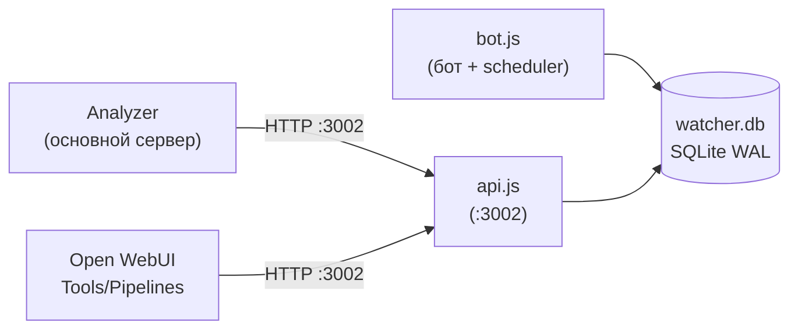
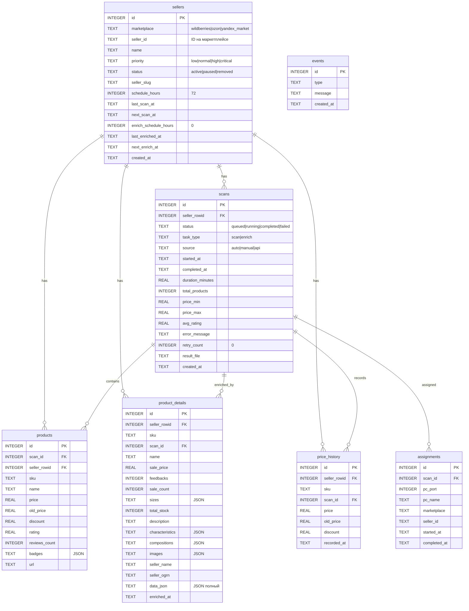
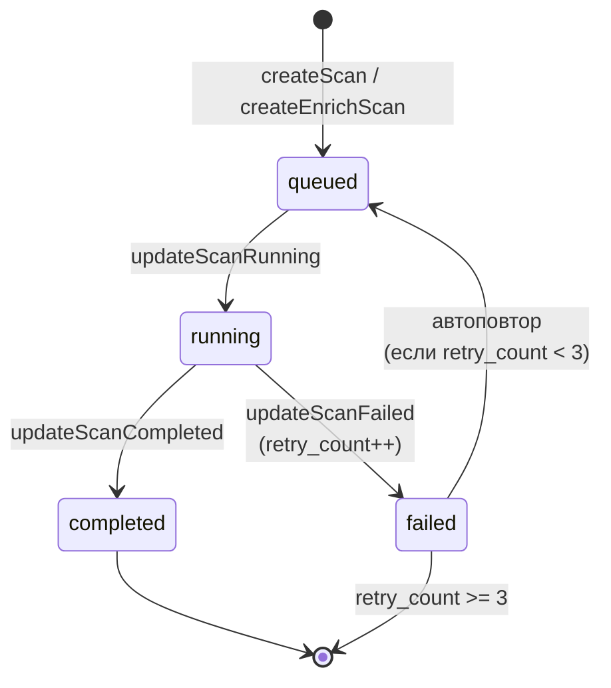
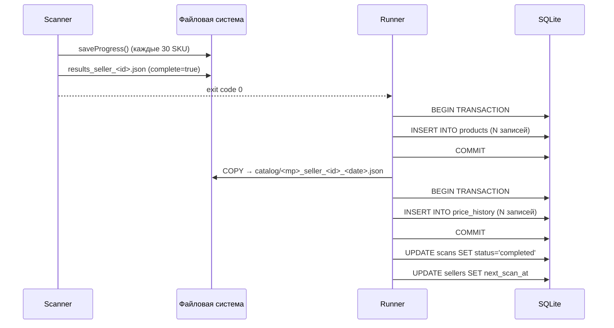
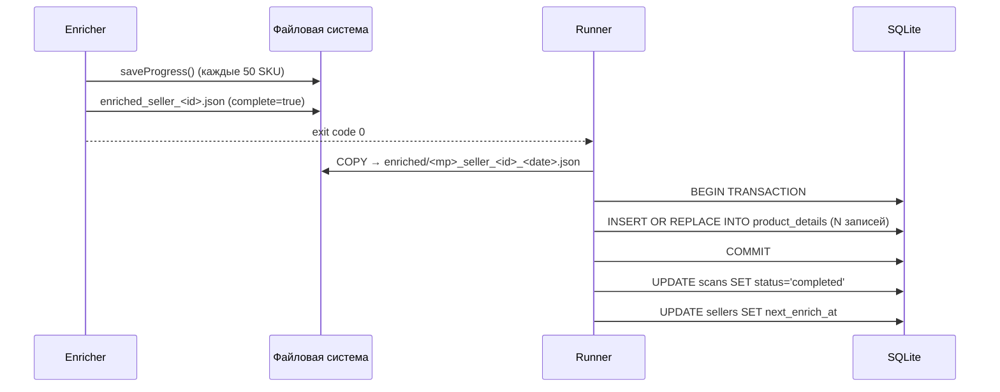
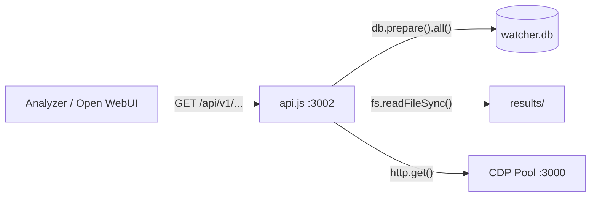

**Проект:** ADOLF — AI-Driven Operations Layer Framework  
**Модуль:** Watcher / Database & API  
**Версия:** 4.0  
**Дата:** Февраль 2026

---

## 5.1 Обзор

Collector использует SQLite (через `better-sqlite3`) как единственное хранилище структурированных данных. REST API (`api.js`) предоставляет HTTP-доступ к данным для Analyzer и внешних потребителей.

| Компонент | Файл | Процесс | Порт |
|-----------|------|---------|:----:|
| Database | db.js | внутри `bot.js` и `api.js` | — |
| REST API | api.js | `watcher-api.service` | 3002 |

Файл БД: `/opt/watcher/watcher.db` (WAL-режим для производительности).



---

## 5.2 Схема базы данных

### ER-диаграмма



### Таблица sellers

Реестр отслеживаемых продавцов. Уникальность по паре `(marketplace, seller_id)`.

| Поле | Тип | По умолчанию | Описание |
|------|-----|:------------:|----------|
| `id` | INTEGER PK | auto | Внутренний ID |
| `marketplace` | TEXT | `'wildberries'` | `wildberries`, `ozon`, `yandex_market` |
| `seller_id` | TEXT | — | ID продавца на маркетплейсе |
| `name` | TEXT | — | Отображаемое имя |
| `priority` | TEXT | `'normal'` | `low`, `normal`, `high`, `critical` (CHECK) |
| `status` | TEXT | `'active'` | `active`, `paused`, `removed` (CHECK) |
| `seller_slug` | TEXT | `''` | Slug для YM URL (миграция) |
| `schedule_hours` | INTEGER | 72 | Интервал сканирования (часы) |
| `last_scan_at` | TEXT | NULL | Время последнего скана |
| `next_scan_at` | TEXT | NULL | Время следующего скана |
| `enrich_schedule_hours` | INTEGER | 0 | Интервал обогащения (0 = выключено, миграция) |
| `last_enriched_at` | TEXT | NULL | Время последнего обогащения (миграция) |
| `next_enrich_at` | TEXT | NULL | Время следующего обогащения (миграция) |
| `created_at` | TEXT | `datetime('now')` | Время создания |

Автоматическое обновление расписаний при завершении задач:

- `next_scan_at = datetime('now', '+' || schedule_hours || ' hours')` — после скана
- `next_enrich_at = datetime('now', '+' || enrich_schedule_hours || ' hours')` — после обогащения (если `enrich_schedule_hours > 0`)

### Таблица scans

Журнал всех задач (сканирование и обогащение).

| Поле | Тип | По умолчанию | Описание |
|------|-----|:------------:|----------|
| `id` | INTEGER PK | auto | ID задачи |
| `seller_rowid` | INTEGER FK | — | Ссылка на `sellers.id` |
| `status` | TEXT | `'queued'` | `queued`, `running`, `completed`, `failed` (CHECK) |
| `task_type` | TEXT | `'scan'` | `scan` или `enrich` (миграция) |
| `source` | TEXT | `'auto'` | `auto`, `manual`, `api` (миграция) |
| `started_at` | TEXT | NULL | Время начала выполнения |
| `completed_at` | TEXT | NULL | Время завершения |
| `duration_minutes` | REAL | NULL | Длительность (минуты) |
| `total_products` | INTEGER | NULL | Количество товаров / обогащённых SKU |
| `price_min` | REAL | NULL | Минимальная цена (только scan) |
| `price_max` | REAL | NULL | Максимальная цена (только scan) |
| `avg_rating` | REAL | NULL | Средний рейтинг (только scan) |
| `error_message` | TEXT | NULL | Текст ошибки (при `failed`) |
| `retry_count` | INTEGER | 0 | Счётчик повторов (инкрементируется при `updateScanFailed`) |
| `result_file` | TEXT | NULL | Путь к JSON-файлу результата |
| `created_at` | TEXT | `datetime('now')` | Время постановки в очередь |

Жизненный цикл задачи:



### Таблица products

Товары из каталога продавца (данные сканов). Каждый скан создаёт новый набор записей.

| Поле | Тип | Описание |
|------|-----|----------|
| `id` | INTEGER PK | Auto |
| `scan_id` | INTEGER FK | Ссылка на `scans.id` |
| `seller_rowid` | INTEGER FK | Ссылка на `sellers.id` |
| `sku` | TEXT | Артикул товара на маркетплейсе |
| `name` | TEXT | Название товара |
| `price` | REAL | Текущая цена |
| `old_price` | REAL | Старая цена (до скидки) |
| `discount` | REAL | Процент скидки |
| `rating` | REAL | Рейтинг товара |
| `reviews_count` | INTEGER | Количество отзывов/оценок |
| `badges` | TEXT | JSON-массив бейджей |
| `url` | TEXT | URL карточки товара |

Вставка через транзакцию `db.transaction` в runner.js для атомарности (все товары скана за один коммит).

### Таблица product\_details

Обогащённые данные товаров. UPSERT по уникальному ключу `(seller_rowid, sku)` — при повторном обогащении данные перезаписываются.

| Поле | Тип | Описание |
|------|-----|----------|
| `id` | INTEGER PK | Auto |
| `seller_rowid` | INTEGER FK | Ссылка на `sellers.id` |
| `sku` | TEXT | Артикул товара |
| `scan_id` | INTEGER FK | Ссылка на `scans.id` (enrich-задача) |
| `name` | TEXT | Полное название (миграция) |
| `sale_price` | REAL | Актуальная цена продажи |
| `feedbacks` | INTEGER | Количество отзывов |
| `sale_count` | INTEGER | Количество продаж |
| `sizes` | TEXT | JSON: массив размеров с остатками по складам |
| `total_stock` | INTEGER | Суммарный остаток |
| `description` | TEXT | Описание товара |
| `characteristics` | TEXT | JSON: характеристики/опции |
| `compositions` | TEXT | JSON: состав |
| `images` | TEXT | JSON: массив URL изображений |
| `seller_name` | TEXT | Юридическое имя продавца |
| `seller_ogrn` | TEXT | ОГРН/ОГРНИП продавца |
| `data_json` | TEXT | Полный JSON обогащённых данных (миграция) |
| `enriched_at` | TEXT | Время обогащения |

### Таблица price\_history

История изменения цен. Запись создаётся при каждом скане для каждого товара с ненулевой ценой.

| Поле | Тип | Описание |
|------|-----|----------|
| `id` | INTEGER PK | Auto |
| `seller_rowid` | INTEGER FK | Ссылка на `sellers.id` |
| `sku` | TEXT | Артикул товара |
| `scan_id` | INTEGER FK | Ссылка на `scans.id` |
| `price` | REAL | Текущая цена |
| `old_price` | REAL | Старая цена |
| `discount` | REAL | Процент скидки |
| `recorded_at` | TEXT | Время записи |

Индекс: `idx_ph_seller_sku ON price_history(seller_rowid, sku, recorded_at)`.

### Таблица assignments

История назначений задач на ПК. Используется оркестратором для скоринга (см. [Раздел 3](/watcher/adolf_watcher_3_orchestrator_runner)).

| Поле | Тип | Описание |
|------|-----|----------|
| `id` | INTEGER PK | Auto |
| `scan_id` | INTEGER FK | Ссылка на `scans.id` |
| `pc_port` | INTEGER | Порт CDP на VPS |
| `pc_name` | TEXT | Имя ПК |
| `marketplace` | TEXT | Маркетплейс задачи |
| `seller_id` | TEXT | ID продавца |
| `started_at` | TEXT | Время начала |
| `completed_at` | TEXT | Время завершения |

### Таблица events

Лог системных событий (мониторинг, завершение задач, ошибки).

| Поле | Тип | Описание |
|------|-----|----------|
| `id` | INTEGER PK | Auto |
| `type` | TEXT | Тип: `scan_start`, `scan_complete`, `scan_failed`, `enrich_start`, `enrich_complete`, `enrich_failed`, `pc_connected`, `pc_disconnected` |
| `message` | TEXT | Текст события |
| `created_at` | TEXT | Время события |

---

## 5.3 Миграции

БД использует inline-миграции через `try { ALTER TABLE ... } catch {}`. Каждая миграция добавляет поле, которое может не существовать в ранних версиях БД.

| Миграция | Таблица | Поле | По умолчанию |
|----------|---------|------|:------------:|
| 1 | sellers | `seller_slug` | `''` |
| 2 | scans | `task_type` | `'scan'` |
| 3 | sellers | `last_enriched_at` | NULL |
| 4 | sellers | `enrich_schedule_hours` | 0 |
| 5 | sellers | `next_enrich_at` | NULL |
| 6 | scans | `source` | `'auto'` |
| 7 | product\_details | `data_json` | NULL |
| 8 | product\_details | `name` | NULL |

Миграции идемпотентны: повторный запуск ничего не меняет (ALTER TABLE выбрасывает ошибку «duplicate column», которая перехватывается).

---

## 5.4 Prepared Statements

Модуль `db.js` экспортирует 30+ prepared statements. Группы:

### Продавцы (9 statements)

| Statement | Метод | Описание |
|-----------|:-----:|----------|
| `addSeller` | `.run()` | INSERT OR IGNORE нового продавца |
| `getSellers` | `.all()` | Все продавцы (кроме removed), сортировка: priority → next\_scan\_at |
| `getSeller` | `.get()` | Поиск по `(seller_id, marketplace)` |
| `getSellerById` | `.get()` | Поиск по `id` |
| `updateSellerStatus` | `.run()` | Изменение статуса |
| `updateSellerPriority` | `.run()` | Изменение приоритета |
| `updateSellerSchedule` | `.run()` | Изменение schedule\_hours |
| `updateSellerLastScan` | `.run()` | Обновление last\_scan\_at + next\_scan\_at |
| `updateSellerLastEnrich` | `.run()` | Обновление last\_enriched\_at + next\_enrich\_at |

Дополнительно: `updateSellerEnrichSchedule`, `updateSellerEnrichScheduleById`, `getSellersNeedingEnrich`.

### Задачи (12 statements)

| Statement | Метод | Описание |
|-----------|:-----:|----------|
| `createScan` | `.run()` | Создать scan-задачу (queued) |
| `createEnrichScan` | `.run()` | Создать enrich-задачу (queued) |
| `getScan` | `.get()` | Получить задачу по ID |
| `getQueuedScans` | `.all()` | Очередь scan-задач (приоритет → время) |
| `getNextQueued` | `.get()` | Следующая задача из очереди (LIMIT 1) |
| `getRunningScans` | `.all()` | Выполняемые scan-задачи |
| `getQueuedEnrichScans` | `.all()` | Очередь enrich-задач |
| `getRunningEnrichScans` | `.all()` | Выполняемые enrich-задачи |
| `updateScanRunning` | `.run()` | queued → running + started\_at |
| `updateScanCompleted` | `.run()` | running → completed + метрики |
| `updateScanFailed` | `.run()` | running → failed + error + retry\_count++ |
| `getRecentScans` | `.all()` | Последние N задач (для /history) |

Дополнительно: `getLastScanForSeller`, `getFailedScans`.

### Товары и обогащение (8 statements)

| Statement | Метод | Описание |
|-----------|:-----:|----------|
| `insertProduct` | `.run()` | Вставка товара из скана |
| `getProductsByScan` | `.all()` | Все товары скана |
| `getLastTwoScansProducts` | `.all()` | Товары двух последних сканов (для diff) |
| `insertProductDetail` | `.run()` | UPSERT обогащённых данных |
| `getProductDetailsBySeller` | `.all()` | Все обогащённые товары продавца |
| `getProductDetailBySku` | `.get()` | Обогащённые данные по SKU |
| `getProductDetailBySkuAndMp` | `.get()` | Обогащённые данные по SKU + маркетплейс |
| `insertPriceHistory` | `.run()` | Запись в историю цен |

Дополнительно: `getPriceHistory`, `getPriceHistoryBySeller`, `getPriceHistoryBySku`.

### Инфраструктура (6 statements)

| Statement | Метод | Описание |
|-----------|:-----:|----------|
| `addEvent` | `.run()` | Запись события |
| `getStats` | `.get()` | Агрегированная статистика системы |
| `insertAssignment` | `.run()` | Запись назначения ПК |
| `completeAssignment` | `.run()` | Завершение назначения |
| `getLastAssignmentForPC` | `.get()` | Последнее назначение ПК (для скоринга) |
| `getAssignmentCountForPC` | `.get()` | Количество задач ПК за 24ч |

Дополнительно: `getRecentAssignmentsForPC`.

---

## 5.5 REST API (api.js)

HTTP-сервер на порту 3002 (localhost). Запускается отдельным процессом (`watcher-api.service`).

### Общие характеристики

| Параметр | Значение |
|----------|----------|
| Фреймворк | `http` (stdlib Node.js) |
| Формат | JSON |
| Роутинг | Шаблоны с `:param` |
| CORS | `Access-Control-Allow-Origin: *` |
| Базовый путь | `/api/v1` |
| Аутентификация | Нет (localhost) |

### Эндпоинты

#### Продавцы

| Метод | Путь | Query params | Описание |
|:-----:|------|:------------:|----------|
| GET | `/api/v1/sellers` | `marketplace`, `status` | Список продавцов (фильтрация) |
| GET | `/api/v1/sellers/:id` | — | Детали продавца + последний скан |
| POST | `/api/v1/sellers` | — | Создание продавца |
| PUT | `/api/v1/sellers/:id` | — | Обновление (name, priority, status, schedule\_hours, enrich\_schedule\_hours) |
| DELETE | `/api/v1/sellers/:id` | — | Мягкое удаление (status → removed) |

POST `/api/v1/sellers` body:

```json
{
  "marketplace": "wildberries",
  "seller_id": "1025130",
  "name": "Конкурент А",
  "priority": "high"
}
```

#### Товары продавца

| Метод | Путь | Описание |
|:-----:|------|----------|
| GET | `/api/v1/sellers/:id/products` | Товары последнего скана |
| GET | `/api/v1/sellers/:id/enriched` | Обогащённые товары |
| GET | `/api/v1/sellers/:id/diff` | Сравнение двух последних сканов (computeDiff) |

#### Задачи

| Метод | Путь | Query params | Описание |
|:-----:|------|:------------:|----------|
| GET | `/api/v1/scans` | `seller_id`, `status`, `limit` | Список задач (фильтрация) |
| GET | `/api/v1/scans/:id` | — | Детали задачи + товары |
| POST | `/api/v1/scans` | — | Создание scan-задачи |
| POST | `/api/v1/enrichments` | — | Создание enrich-задачи |

POST body для обоих:

```json
{
  "seller_id": "1025130",
  "marketplace": "wildberries"
}
```

#### Товары по SKU

| Метод | Путь | Query params | Описание |
|:-----:|------|:------------:|----------|
| GET | `/api/v1/products/:sku` | `marketplace` | Обогащённые данные товара |
| GET | `/api/v1/products/:sku/enriched` | `marketplace` | Аналог (совместимость) |
| GET | `/api/v1/products/:sku/history` | `limit` | История цен (по умолчанию 100 записей) |

#### Файлы

| Метод | Путь | Описание |
|:-----:|------|----------|
| GET | `/api/v1/files/catalog` | Список файлов каталогов |
| GET | `/api/v1/files/enriched` | Список файлов обогащения |
| GET | `/api/v1/files/:type/:filename` | Скачивание JSON-файла |

Защита от path traversal: проверка на `..`, `/`, `\` в имени файла. Допустимые типы: `catalog`, `enriched`.

#### Инфраструктура

| Метод | Путь | Описание |
|:-----:|------|----------|
| GET | `/api/v1/pool/status` | Проксирование CDP Pool `/status` |
| GET | `/api/v1/pool/summary` | Проксирование CDP Pool `/summary` |
| GET | `/api/v1/tasks` | Текущие задачи: running, queued, enrich\_running, enrich\_queued |
| GET | `/api/v1/stats` | Системная статистика: продавцы, задачи, товары, обогащения, история цен |

### Формат ответа /stats

```json
{
  "active_sellers": 12,
  "queued": 3,
  "running": 1,
  "completed": 287,
  "failed": 2,
  "total_products": 15420,
  "enriched_products": 8930,
  "price_history_records": 47820
}
```

### Коды ответов

| Код | Ситуация |
|:---:|----------|
| 200 | Успех |
| 201 | Создано (POST) |
| 204 | CORS preflight |
| 400 | Ошибка валидации |
| 404 | Ресурс не найден |
| 500 | Внутренняя ошибка |
| 502 | CDP Pool недоступен |

---

## 5.6 Файловое хранилище

Помимо SQLite, Collector хранит JSON-файлы результатов на диске.

### Структура директорий

```
/opt/watcher/results/
├── results_seller_1025130.json      # Текущий скан (перезаписывается)
├── enriched_seller_1025130.json     # Текущее обогащение (перезаписывается)
├── catalog/                         # Архив сканов (версионированные копии)
│   ├── wildberries_seller_1025130_2026-02-12.json
│   ├── wildberries_seller_1025130_2026-02-14.json
│   └── ozon_seller_465656_2026-02-13.json
└── enriched/                        # Архив обогащений
    ├── wildberries_seller_1025130_2026-02-12.json
    └── ozon_seller_465656_2026-02-13.json
```

### Жизненный цикл файлов

| Файл | Создаётся | Перезаписывается | Ротация |
|------|-----------|:----------------:|---------|
| `results_seller_<id>.json` | Сканером (промежуточно и финально) | При каждом скане | Нет (текущий) |
| `enriched_seller_<id>.json` | Обогатителем | При каждом обогащении | Нет (текущий) |
| `catalog/<mp>_seller_<id>_<date>.json` | Runner (копия) | Нет (уникальное имя) | `catalogKeepPerSeller` (10) |
| `enriched/<mp>_seller_<id>_<date>.json` | Runner (копия) | Нет (уникальное имя) | `enrichedKeepPerSeller` (30) |

Ротация выполняется планировщиком каждые 24 часа (см. [Раздел 2, цикл 5](/watcher/adolf_watcher_2_bot_scheduler)).

---

## 5.7 Потоки данных

### Запись данных при скане



### Запись данных при обогащении



### Чтение данных через API



---

**Документ подготовлен:** Февраль 2026  
**Версия:** 4.0  
**Статус:** Черновик
