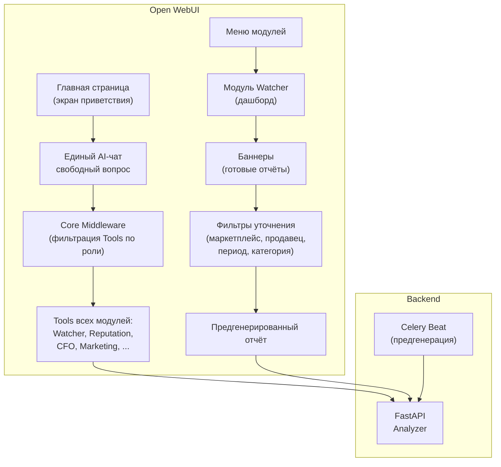
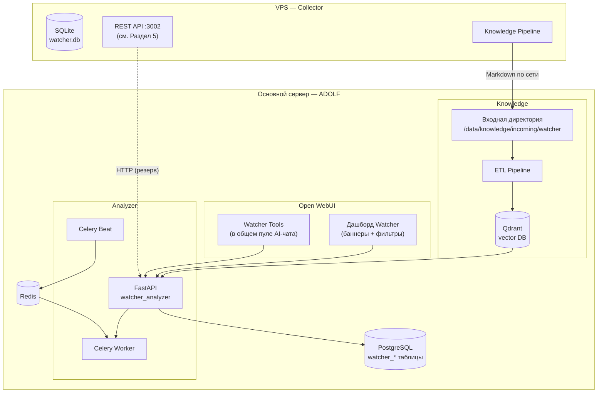
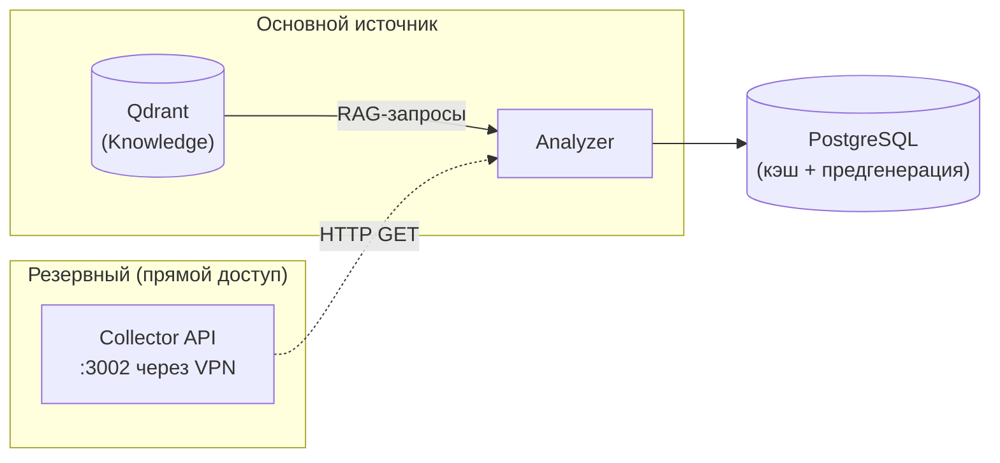
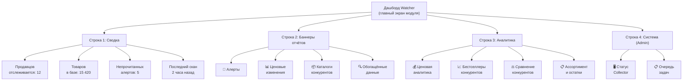
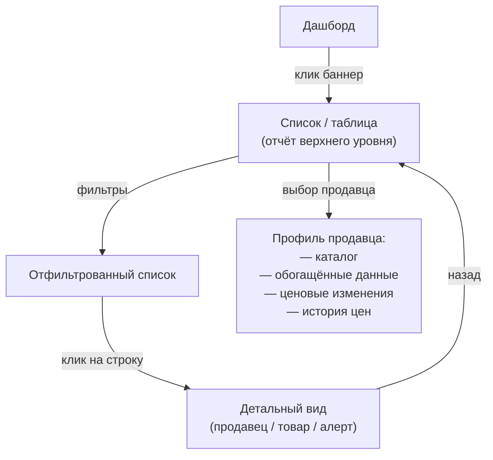
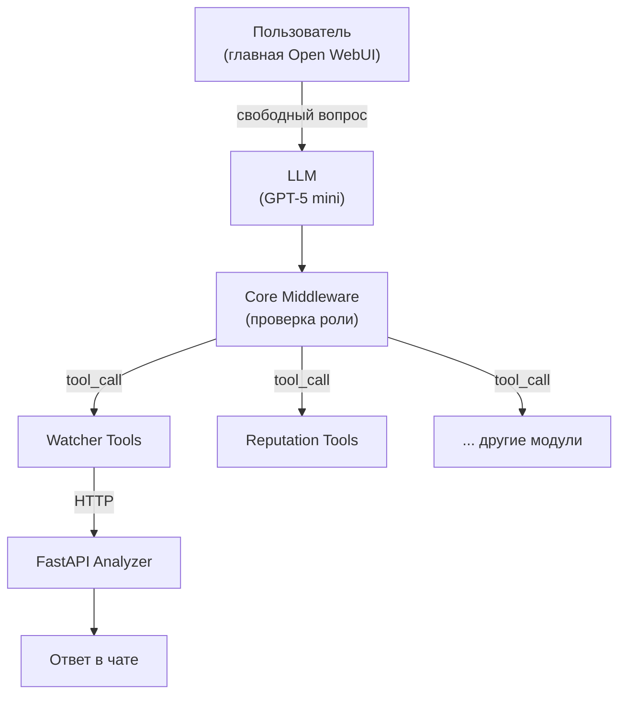

**Проект:** ADOLF — AI-Driven Operations Layer Framework  
**Модуль:** Watcher / Analyzer  
**Версия:** 4.3  
**Дата:** Февраль 2026

---

## 6.1 Обзор

Analyzer — аналитическая подсистема Watcher, работающая на основном сервере ADOLF. Получает данные из модуля Knowledge (Qdrant), выполняет аналитику и предоставляет результаты через Open WebUI.

В отличие от Collector (Node.js, VPS), Analyzer интегрирован в стандартную инфраструктуру ADOLF: FastAPI, PostgreSQL, Celery, Open WebUI.

### Два режима доступа к данным

| Режим | Где | Интерфейс | Назначение |
|-------|-----|-----------|------------|
| **Дашборд** | Модуль Watcher (пункт меню Open WebUI) | Баннеры → готовые отчёты → фильтры уточнения | Повседневная работа с предгенерированными данными |
| **AI-чат** | Главная страница Open WebUI (экран приветствия) | Свободный текстовый запрос | Произвольные вопросы (в т.ч. о конкурентах) |

Дашборд не содержит строки ввода для ИИ. Пользователь выбирает баннер, получает готовый отчёт и при необходимости уточняет выборку через фильтры (маркетплейс, продавец, период, категория).

AI-чат — единый для всей платформы ADOLF. На главной странице Open WebUI пользователь задаёт свободный вопрос, а LLM имеет доступ к Tools всех модулей одновременно (Watcher, Reputation, CFO и др.). Набор доступных Tools определяется ролью пользователя через ADOLF Core Middleware. Модуль Watcher регистрирует свои Tools в общем пуле.



### Архитектура



### Статус реализации

| Компонент | Статус |
|-----------|--------|
| Knowledge Pipeline (Collector) | 🔲 Спецификация |
| Markdown-конвертер | 🔲 Спецификация |
| Analyzer FastAPI | 🔲 Спецификация |
| Дашборд (баннеры) | 🔲 Спецификация |
| AI-чат (Tools) | 🔲 Спецификация |
| Celery-задачи (предгенерация) | 🔲 Спецификация |

---

## 6.2 Knowledge Pipeline

### Назначение

Knowledge Pipeline обеспечивает однонаправленный поток данных: Collector (VPS) → Knowledge (основной сервер). Данные конвертируются из JSON в Markdown с YAML-заголовком и передаются в модуль Knowledge для индексации в Qdrant.

### Поток данных


### Входные данные

Knowledge Pipeline использует данные из Collector (см. [Раздел 4](/watcher/adolf_watcher_4_scanners_enrichers) и [Раздел 5](/watcher/adolf_watcher_5_database_api)):

| Источник | Файл / таблица | Ключевые поля |
|----------|----------------|---------------|
| Scan | `results_seller_<id>.json` | seller\_name, marketplace, total\_products, products\[\] (sku, name, price, old\_price, discount, rating, reviews\_count, badges) |
| Enrich | `enriched_seller_<id>.json` | products\[\] (sku, name, sale\_price, feedbacks, sale\_count, sizes, total\_stock, description, characteristics, images, seller\_name, seller\_ogrn) |
| DB | `price_history` table | sku, price, old\_price, discount, recorded\_at |
| DB | `products` table | Два последних скана для computeDiff() |

### Типы выходных документов

| Тип | Файл | Триггер | Содержание |
|-----|------|---------|------------|
| Обогащённый каталог | `{mp}_seller_{id}_catalog.md` | После enrich | Полные данные по всем SKU |
| Ценовые изменения | `{mp}_seller_{id}_diff.md` | После повторного scan | Diff между двумя сканами |
| Сводка по продавцу | `{mp}_seller_{id}_summary.md` | После scan | Агрегированные метрики |

### Формат Markdown-документа

#### YAML-заголовок

```yaml
---
title: "Конкурент: Seller Name (Wildberries)"
category: competitive_intelligence
subcategory: enriched_catalog
marketplace: wildberries
seller_id: "1025130"
seller_name: "Seller Name"
enrichment_date: "2026-02-14"
total_products: 142
brand_id: all
access_level: manager
source: watcher_collector
---
```

| Поле | Назначение в RAG |
|------|-----------------|
| `category` | Фильтрация по типу данных (`competitive_intelligence`) |
| `subcategory` | Уточнение: `enriched_catalog`, `price_diff`, `seller_summary` |
| `marketplace` | Фильтрация по маркетплейсу |
| `seller_id` | Идентификация конкурента |
| `brand_id` | Ролевая фильтрация (`all` = доступно всем брендам) |
| `access_level` | Минимальная роль для доступа |

#### Тело: обогащённый каталог

```markdown
# Каталог: Seller Name (Wildberries)

**Дата обогащения:** 2026-02-14
**Товаров:** 142
**Средняя цена:** 2 450 ₽
**Средний рейтинг:** 4.6

## Товары

### SKU 123456789 — Платье летнее миди

- **Цена:** 2 990 ₽ (старая: 5 980 ₽, скидка 50%)
- **Рейтинг:** 4.7 (1 284 отзыва, 5 420 продаж)
- **Наличие:** 47 шт (размеры: 42, 44, 46, 48, 50)
- **Описание:** Лёгкое платье из вискозы...
- **Характеристики:** Состав: вискоза 100%; Цвет: красный; Сезон: лето
- **Продавец:** ООО Конкурент (ОГРН 1234567890123)
```

#### Тело: ценовые изменения

Формируется из `computeDiff()` (см. [Раздел 3, utils](/watcher/adolf_watcher_3_orchestrator_runner)).

```markdown
# Ценовые изменения: Seller Name (Wildberries)

**Период:** 2026-02-12 → 2026-02-14
**Новых товаров:** 3
**Удалённых товаров:** 1
**Изменений цен:** 12

## Подорожавшие (5)

- SKU 123456789 «Платье летнее»: 2 500 ₽ → 2 990 ₽ (+19.6%)

## Подешевевшие (7)

- SKU 345678901 «Худи оверсайз»: 4 300 ₽ → 3 010 ₽ (−30.0%)

## Новые товары (3)

- SKU 456789012 «Юбка миди» — 1 890 ₽, рейтинг 0 (новинка)

## Снятые с продажи (1)

- SKU 567890123 «Шапка зимняя» — последняя цена 990 ₽
```

### Передача файлов

| Метод | Описание | Приоритет |
|-------|----------|:---------:|
| rsync по SSH | `rsync -az /opt/watcher/knowledge/ user@main:/data/knowledge/incoming/watcher/` | 1 |
| NFS mount | Сетевая директория, примонтированная на VPS | 2 |
| scp | Простое копирование файлов | 3 |

---

## 6.3 Analyzer: FastAPI-сервис

### Регистрация в ADOLF Core

```python
# Промпт для Claude Code:
#
# Создай FastAPI-роутер для модуля Watcher Analyzer.
# Файл: /opt/adolf/modules/watcher/router.py
# Prefix: /api/v1/watcher
# Зависимости: Knowledge (Qdrant), PostgreSQL, Redis
# Авторизация: через ADOLF Core Middleware (depends=[check_role("manager")])
# Эндпоинты: см. спецификацию ниже
```

### Эндпоинты для дашборда

Дашборд получает данные через эти эндпоинты. Каждый эндпоинт возвращает предгенерированный или рассчитываемый на лету отчёт.

| Метод | Путь | Роли | Баннер |
|:-----:|------|:----:|--------|
| GET | `/api/v1/watcher/dashboard/alerts` | Manager+ | Алерты |
| GET | `/api/v1/watcher/dashboard/price-changes` | Manager+ | Ценовые изменения |
| GET | `/api/v1/watcher/dashboard/sellers` | Manager+ | Обзор конкурентов |
| GET | `/api/v1/watcher/dashboard/seller/{id}/catalog` | Manager+ | Каталог продавца |
| GET | `/api/v1/watcher/dashboard/seller/{id}/enriched` | Manager+ | Обогащённые данные |
| GET | `/api/v1/watcher/dashboard/seller/{id}/price-history` | Manager+ | История цен |
| GET | `/api/v1/watcher/dashboard/seller/{id}/diff` | Manager+ | Diff последних сканов |
| GET | `/api/v1/watcher/dashboard/analytics/pricing` | Manager+ | Ценовая аналитика |
| GET | `/api/v1/watcher/dashboard/analytics/assortment` | Manager+ | Ассортиментный анализ |
| GET | `/api/v1/watcher/dashboard/analytics/bestsellers` | Manager+ | Бестселлеры конкурентов |
| GET | `/api/v1/watcher/dashboard/analytics/compare` | Manager+ | Сравнение конкурентов |
| GET | `/api/v1/watcher/dashboard/analytics/stock` | Manager+ | Остатки и размерные сетки |
| GET | `/api/v1/watcher/dashboard/system` | Admin | Статус системы |

Все эндпоинты поддерживают query-параметры фильтрации: `marketplace`, `seller_id`, `period` (`7d`, `30d`, `90d`), `category`.

### Эндпоинты для AI-чата

| Метод | Путь | Роли | Описание |
|:-----:|------|:----:|----------|
| GET | `/api/v1/watcher/prices/{sku}` | Manager+ | Данные по SKU (для Tool) |
| GET | `/api/v1/watcher/prices/{sku}/history` | Manager+ | Ценовая история (для Tool) |
| GET | `/api/v1/watcher/compare` | Manager+ | Сравнение конкурентов (для Tool) |

### Управление

| Метод | Путь | Роли | Описание |
|:-----:|------|:----:|----------|
| PUT | `/api/v1/watcher/alerts/{id}/read` | Manager+ | Пометить алерт прочитанным |
| GET | `/api/v1/watcher/alerts/settings` | Admin | Настройки порогов |
| PUT | `/api/v1/watcher/alerts/settings` | Admin | Обновить пороги |
| GET | `/api/v1/watcher/subscriptions` | Manager+ | Список подписок |
| POST | `/api/v1/watcher/subscriptions` | Manager+ | Добавить подписку |
| DELETE | `/api/v1/watcher/subscriptions/{id}` | Manager+ | Удалить подписку |
| GET | `/api/v1/watcher/status` | Admin | Статус Collector (проксирование :3002) |
| POST | `/api/v1/watcher/command` | Admin | Команда Collector |

### Источники данных



Основной: Qdrant через RAG-запросы к модулю Knowledge.

Резервный: прямой HTTP к Collector REST API :3002 (см. [Раздел 5.5](/watcher/adolf_watcher_5_database_api)). Для real-time данных и когда Knowledge Pipeline ещё не обработал свежие данные.

---

## 6.4 Дашборд Watcher

Дашборд — основной интерфейс модуля. Отображается при выборе «Watcher» в меню Open WebUI. Не содержит строки ввода для ИИ.

### Структура дашборда



### Баннеры и отчёты

Каждый баннер при нажатии открывает соответствующий отчёт с возможностью фильтрации.

#### Строка 1: Сводка (числовые карточки)

Четыре метрики верхнего уровня, обновляются автоматически.

| Карточка | Источник данных | API |
|----------|-----------------|-----|
| Продавцов отслеживается | `sellers` (status=active) | `/dashboard/sellers` |
| Товаров в базе | `products` + `product_details` | `/dashboard/sellers` |
| Непрочитанных алертов | `watcher_alerts` (status=unread) | `/dashboard/alerts` |
| Последний скан | `scans` (status=completed, MAX created\_at) | `/dashboard/sellers` |

#### Строка 2: Баннеры основных отчётов

| Баннер | Содержание отчёта | Фильтры | Источник данных |
|--------|-------------------|---------|-----------------|
| **Алерты** | Список алертов по приоритету: снижение цен, новые товары, бестселлеры, массовый вывод, рост отзывов | Тип, маркетплейс, продавец, период | `watcher_alerts` (PostgreSQL) |
| **Ценовые изменения** | Подорожавшие / подешевевшие товары, новые / снятые с продажи. Сводка по всем продавцам | Маркетплейс, продавец, порог %, период | `computeDiff()` → `price_diff` документы (Qdrant) |
| **Каталоги конкурентов** | Выбор продавца → таблица товаров: SKU, название, цена, скидка, рейтинг, отзывы, бейджи | Маркетплейс, продавец, сортировка (цена, рейтинг, отзывы) | `products` (SQLite) → Qdrant |
| **Обогащённые данные** | Выбор продавца → детали: описание, характеристики, состав, размеры, остатки, фото, ОГРН | Маркетплейс, продавец, SKU | `product_details` (SQLite) → Qdrant |

#### Строка 3: Аналитические отчёты

| Баннер | Содержание отчёта | Фильтры | Источник данных |
|--------|-------------------|---------|-----------------|
| **Ценовая аналитика** | Средние цены и скидки по продавцам, частота изменений, ценовые диапазоны | Маркетплейс, период | `price_history` + `product_details` (агрегация) |
| **Бестселлеры конкурентов** | Топ товаров по рейтингу, отзывам и продажам. ABC-анализ ассортимента | Маркетплейс, продавец, топ N | `product_details` (sale\_count, feedbacks, rating) |
| **Сравнение конкурентов** | Таблица: продавец × метрика (кол-во товаров, средняя цена, средняя скидка, средний рейтинг, глубина ассортимента) | Маркетплейс, выбор продавцов | `sellers` + `products` + `product_details` (агрегация) |
| **Ассортимент и остатки** | Размерные сетки, остатки по складам, товары с низким стоком, скорость обновления ассортимента (new/removed за период) | Маркетплейс, продавец, порог остатка | `product_details` (sizes, total\_stock) + `computeDiff()` |

#### Строка 4: Система (только Admin)

| Баннер | Содержание отчёта | Источник данных |
|--------|-------------------|-----------------|
| **Статус Collector** | ПК: онлайн/оффлайн/занят, задачи: running/queued, статистика: сканов, товаров, обогащений | CDP Pool `/summary` + Collector `/stats` + `/tasks` |
| **Очередь задач** | Текущие и ожидающие задачи (scan + enrich), приоритеты, время ожидания | Collector `/tasks` |

### Навигация пользователя



Пример цепочки: Дашборд → «Ценовые изменения» → фильтр «Wildberries» → фильтр «Подешевевшие &gt; 20%» → клик на продавца → профиль продавца с детализацией.

### Карточка продавца

При выборе конкретного продавца (из любого баннера) открывается профиль с табами:

| Таб | Содержание | API |
|-----|------------|-----|
| Каталог | Таблица товаров последнего скана | `/dashboard/seller/{id}/catalog` |
| Детали | Обогащённые данные: описания, характеристики, фото | `/dashboard/seller/{id}/enriched` |
| Цены | История цен по SKU (таблица / график) | `/dashboard/seller/{id}/price-history` |
| Изменения | Diff последних двух сканов | `/dashboard/seller/{id}/diff` |
| Инфо | Имя, маркетплейс, приоритет, расписание, последний скан | `/dashboard/sellers` |

---

## 6.5 Watcher Tools (AI-чат)

Watcher регистрирует свои Tools в общем пуле ADOLF. На главной странице Open WebUI пользователь задаёт свободный вопрос — LLM автоматически выбирает подходящий Tool из всех модулей. Доступность каждого Tool определяется ролью пользователя через ADOLF Core Middleware.

### Архитектура



### Watcher Tools

| Tool | Описание | Роли |
|------|----------|:----:|
| `watcher_get_prices` | Текущие цены конкурентов по SKU | Manager+ |
| `watcher_price_history` | История цен за период | Manager+ |
| `watcher_compare_competitors` | Сравнение ценового позиционирования | Manager+ |
| `watcher_get_alerts` | Активные алерты | Manager+ |
| `watcher_add_subscription` | Добавление продавца для мониторинга | Manager+ |
| `watcher_list_subscriptions` | Список отслеживаемых конкурентов | Manager+ |
| `watcher_mark_alert_read` | Пометить алерт прочитанным | Manager+ |
| `watcher_agent_status` | Статус системы Collector | Admin |
| `watcher_agent_command` | Управление Collector | Admin |
| `watcher_settings` | Настройки алертов и порогов | Admin |

### Примеры взаимодействия

| Запрос пользователя | Tool | Ответ |
|---------------------|------|-------|
| «Какая цена на артикул 12345?» | watcher\_get\_prices | Таблица цен по конкурентам |
| «Как менялась цена товара 12345 за месяц?» | watcher\_price\_history | Таблица изменений + сводка |
| «Сравни цены Seller A и Seller B» | watcher\_compare\_competitors | Сводная таблица + AI-анализ |
| «Что нового у конкурентов?» | watcher\_get\_alerts | Список алертов |
| «Добавь продавца 1025130 с WB» | watcher\_add\_subscription | Подтверждение добавления |
| «Статус системы сбора» | watcher\_agent\_status | Отчёт о Collector |

### Промпты для Claude Code (Tools)

```python
# Промпт для Claude Code:
#
# Создай Open WebUI Tool: watcher_get_prices
# Файл: /opt/adolf/tools/watcher_get_prices.py
#
# Описание для LLM:
#   "Получение текущих цен конкурентов для товара по SKU.
#    Используй когда пользователь спрашивает о ценах конкурентов,
#    стоимости товара на маркетплейсах, или просит сравнить цены."
#
# Параметры:
#   sku: str — артикул товара
#   marketplace: Optional[str] — фильтр маркетплейса
#
# Логика:
#   1. Запрос к Analyzer API: GET /api/v1/watcher/prices/{sku}
#   2. Форматирование ответа в Markdown-таблицу
#   3. Если есть история — добавить краткую сводку динамики
```

```python
# Промпт для Claude Code:
#
# Создай Open WebUI Tool: watcher_compare_competitors
# Файл: /opt/adolf/tools/watcher_compare_competitors.py
#
# Описание для LLM:
#   "Сравнение ценового позиционирования конкурентов."
#
# Параметры:
#   seller_ids: List[str] — ID продавцов для сравнения
#   marketplace: Optional[str]
#
# Логика:
#   1. RAG-запрос к Knowledge
#   2. Fallback к Collector API (GET /api/v1/sellers/:id/enriched)
#   3. Агрегация: средние цены, скидки, ассортимент
#   4. AI-анализ (GPT-5 mini): выявление стратегий
```

```python
# Промпт для Claude Code:
#
# Создай Open WebUI Tool: watcher_agent_status
# Файл: /opt/adolf/tools/watcher_agent_status.py
#
# Описание для LLM:
#   "Получение статуса системы сбора данных Watcher Collector.
#    Только для администраторов."
#
# Логика:
#   1. HTTP GET к Collector API: /api/v1/pool/summary
#   2. HTTP GET к Collector API: /api/v1/tasks
#   3. HTTP GET к Collector API: /api/v1/stats
#   4. Форматирование в читаемый отчёт
#
# Collector API: см. Раздел 5.5
```

---

## 6.6 Celery-задачи

### Предгенерация отчётов

Celery Beat генерирует отчёты заранее, чтобы дашборд открывался мгновенно. Результаты кэшируются в PostgreSQL (`watcher_analytics_cache`).

| Задача | Расписание | Что генерирует |
|--------|:----------:|----------------|
| `watcher.pregenerate_alerts` | Каждый час | Список алертов из свежих данных |
| `watcher.pregenerate_pricing` | Каждые 6 часов | Ценовая аналитика (средние, диапазоны, частота изменений) |
| `watcher.pregenerate_bestsellers` | Каждые 6 часов | Топ товаров по sale\_count, feedbacks, rating |
| `watcher.pregenerate_comparison` | Каждые 6 часов | Таблица сравнения всех активных продавцов |
| `watcher.pregenerate_assortment` | Каждые 6 часов | Ассортиментные метрики, остатки, размерные сетки |

### Периодические задачи (обслуживание)

| Задача | Расписание | Описание |
|--------|:----------:|----------|
| `watcher.sync_knowledge` | Каждые 30 мин | Проверка входной директории Knowledge, запуск индексации |
| `watcher.cleanup_alerts` | Ежедневно 03:00 | Удаление прочитанных алертов старше 90 дней |
| `watcher.cleanup_cache` | Ежедневно 04:00 | Удаление просроченных записей из `watcher_analytics_cache` |
| `watcher.collector_health` | Каждые 5 мин | Проверка доступности Collector API (:3002) |

### Задачи по запросу

| Задача | Триггер | Описание |
|--------|---------|----------|
| `watcher.analyze_seller` | AI-чат Tool | Глубокий AI-анализ конкурента (Claude Opus 4.5) |
| `watcher.export_data` | AI-чат Tool (Senior+) | Экспорт данных в XLSX |
| `watcher.forward_command` | AI-чат Tool (Admin) | Передача команды Collector API |

---

## 6.7 Аналитические модели

### Ценовая аналитика

| Метрика | Источник данных | AI-модель |
|---------|-----------------|-----------|
| Динамика цен по SKU | `price_diff` документы | Без AI (расчёт) |
| Средняя скидка продавца | `enriched_catalog` документы | Без AI (расчёт) |
| Частота изменения цен | `price_diff` за период | Без AI (расчёт) |
| Ценовые стратегии | Все документы продавца | GPT-5 mini |
| Ценовое позиционирование | Каталоги нескольких продавцов | GPT-5 mini |

### Ассортиментная аналитика

| Метрика | Источник данных | AI-модель |
|---------|-----------------|-----------|
| Скорость обновления | `price_diff` (new/removed) | Без AI |
| Глубина ассортимента | `enriched_catalog` | Без AI |
| Бестселлеры и аутсайдеры | `enriched_catalog` (rating, reviews) | Без AI |
| ABC-анализ | `enriched_catalog` (sale\_count, feedbacks) | Без AI |
| Пересечение с нашим каталогом | Knowledge (watcher + own products) | GPT-5 mini |

### Алерты

| Алерт | Условие (по умолчанию) | Параметр |
|-------|------------------------|----------|
| Резкое снижение цены | price\_change &lt; −15% | `alert_price_drop_pct` |
| Резкое повышение цены | price\_change &gt; +20% | `alert_price_rise_pct` |
| Новый товар в категории | new\_product в отслеживаемой категории | `alert_categories[]` |
| Бейдж «Бестселлер» | badge = 'Бестселлер' (новый) | — |
| Массовый вывод | removed &gt; 10% ассортимента за день | `alert_mass_removal_pct` |
| Рост отзывов | reviews\_count delta &gt; +50 за сутки | `alert_review_surge` |

---

## 6.8 Схема PostgreSQL (Analyzer)

```sql
-- Алерты
CREATE TABLE watcher_alerts (
    id SERIAL PRIMARY KEY,
    type VARCHAR(50) NOT NULL,
    severity VARCHAR(20) DEFAULT 'info',
    marketplace VARCHAR(30),
    seller_id VARCHAR(50),
    seller_name VARCHAR(200),
    sku VARCHAR(50),
    product_name VARCHAR(500),
    message TEXT NOT NULL,
    data JSONB,
    status VARCHAR(20) DEFAULT 'unread',
    created_at TIMESTAMPTZ DEFAULT NOW(),
    read_at TIMESTAMPTZ,
    read_by INTEGER REFERENCES users(id)
);

-- Настройки алертов
CREATE TABLE watcher_alert_settings (
    id SERIAL PRIMARY KEY,
    key VARCHAR(100) UNIQUE NOT NULL,
    value JSONB NOT NULL,
    updated_at TIMESTAMPTZ DEFAULT NOW(),
    updated_by INTEGER REFERENCES users(id)
);

-- Подписки пользователей на конкурентов
CREATE TABLE watcher_subscriptions (
    id SERIAL PRIMARY KEY,
    user_id INTEGER REFERENCES users(id),
    marketplace VARCHAR(30) NOT NULL,
    seller_id VARCHAR(50) NOT NULL,
    seller_name VARCHAR(200),
    notify_price_change BOOLEAN DEFAULT TRUE,
    notify_new_products BOOLEAN DEFAULT TRUE,
    notify_badges BOOLEAN DEFAULT FALSE,
    created_at TIMESTAMPTZ DEFAULT NOW(),
    UNIQUE(user_id, marketplace, seller_id)
);

-- Кэш предгенерированных отчётов для дашборда
CREATE TABLE watcher_analytics_cache (
    id SERIAL PRIMARY KEY,
    cache_key VARCHAR(200) UNIQUE NOT NULL,
    data JSONB NOT NULL,
    expires_at TIMESTAMPTZ NOT NULL,
    created_at TIMESTAMPTZ DEFAULT NOW()
);

-- Индексы
CREATE INDEX idx_wa_status ON watcher_alerts(status, created_at DESC);
CREATE INDEX idx_wa_seller ON watcher_alerts(seller_id, marketplace);
CREATE INDEX idx_ws_user ON watcher_subscriptions(user_id);
CREATE INDEX idx_wac_key ON watcher_analytics_cache(cache_key);
CREATE INDEX idx_wac_expires ON watcher_analytics_cache(expires_at);
```

---

## 6.9 Ролевая модель

### Матрица доступа

| Функция | Staff | Manager | Senior | Director | Admin |
|---------|:-----:|:-------:|:------:|:--------:|:-----:|
| Дашборд: сводка | — | ✅ | ✅ | ✅ | ✅ |
| Дашборд: алерты | — | ✅ | ✅ | ✅ | ✅ |
| Дашборд: каталоги и цены | — | ✅ | ✅ | ✅ | ✅ |
| Дашборд: аналитика | — | ✅ | ✅ | ✅ | ✅ |
| Дашборд: система | — | — | — | — | ✅ |
| Tool: цены и сравнение | — | ✅ | ✅ | ✅ | ✅ |
| Tool: подписки | — | ✅ | ✅ | ✅ | ✅ |
| Tool: экспорт данных | — | — | ✅ | ✅ | ✅ |
| Tool: глубокий AI-анализ | — | — | ✅ | ✅ | ✅ |
| Tool: управление Collector | — | — | — | — | ✅ |
| Tool: настройки алертов | — | — | — | — | ✅ |

Фильтрация по брендам (`brand_id`) через ADOLF Core Middleware.

---

## 6.10 Конфигурация

### Переменные окружения (Analyzer)

| Переменная | По умолчанию | Описание |
|------------|:------------:|----------|
| `WATCHER_COLLECTOR_URL` | `http://10.0.0.2:3002` | URL Collector REST API (через VPN) |
| `WATCHER_KNOWLEDGE_DIR` | `/data/knowledge/incoming/watcher` | Директория приёма Markdown |
| `WATCHER_QDRANT_COLLECTION` | `competitive_intelligence` | Коллекция Qdrant |
| `WATCHER_ALERT_CHECK_INTERVAL` | `3600` | Интервал проверки алертов (секунды) |
| `WATCHER_ANALYTICS_TTL` | `21600` | TTL кэша аналитики (секунды) |
| `WATCHER_AI_MODEL_ROUTINE` | `gpt-5-mini` | Модель для рутинной аналитики |
| `WATCHER_AI_MODEL_DEEP` | `claude-opus-4-5` | Модель для глубокого анализа |

---

**Документ подготовлен:** Февраль 2026  
**Версия:** 4.3  
**Статус:** Спецификация (реализация pending)
