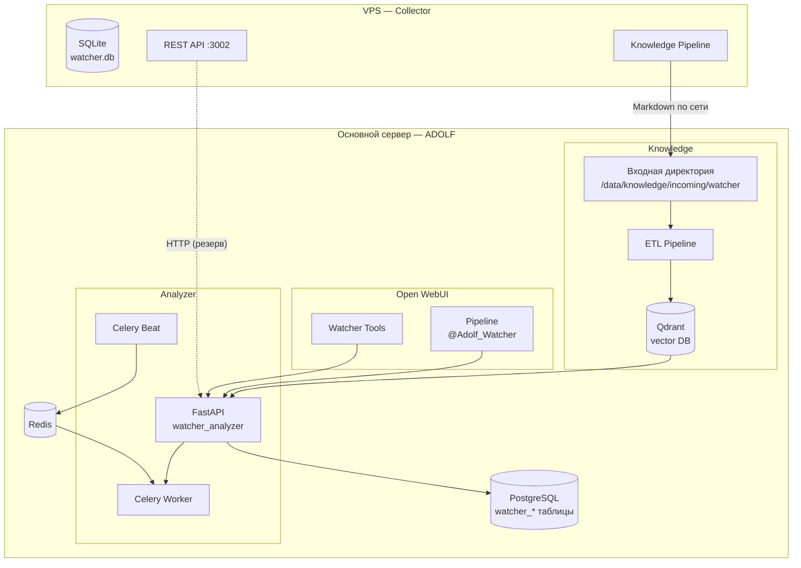
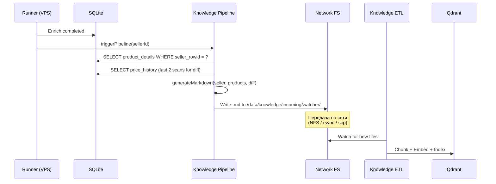
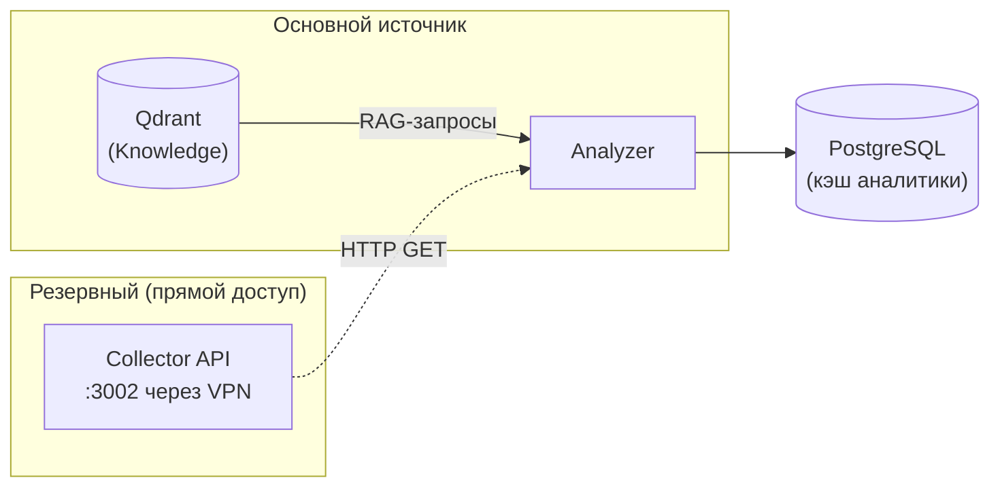
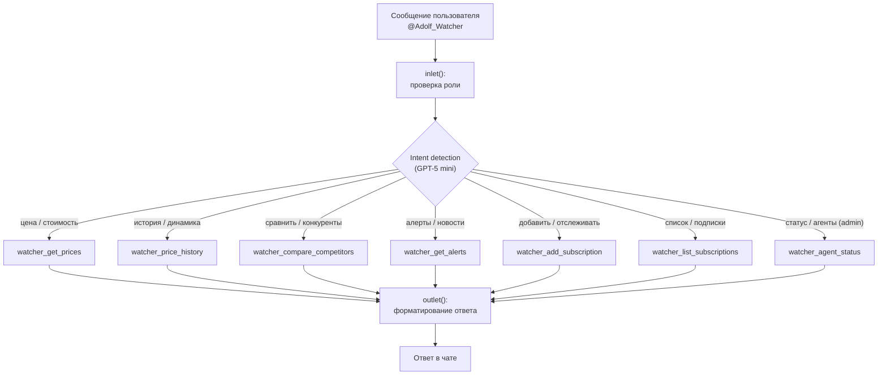

**Проект:** ADOLF — AI-Driven Operations Layer Framework  
**Модуль:** Watcher / Analyzer  
**Версия:** 4.0  
**Дата:** Февраль 2026

---

## 6.1 Обзор

Analyzer — аналитическая подсистема Watcher, работающая на основном сервере ADOLF. Получает данные из модуля Knowledge (Qdrant), выполняет аналитику и предоставляет результаты через Open WebUI.

В отличие от Collector (Node.js, VPS), Analyzer интегрирован в стандартную инфраструктуру ADOLF: FastAPI, PostgreSQL, Celery, Open WebUI.



### Статус реализации

| Компонент | Статус |
|-----------|--------|
| Knowledge Pipeline (Collector) | 🔲 Спецификация |
| Markdown-конвертер | 🔲 Спецификация |
| Analyzer FastAPI | 🔲 Спецификация |
| Open WebUI Tools | 🔲 Спецификация |
| Open WebUI Pipeline | 🔲 Спецификация |
| Celery-задачи | 🔲 Спецификация |

---

## 6.2 Knowledge Pipeline

### Назначение

Knowledge Pipeline обеспечивает однонаправленный поток данных: Collector (VPS) → Knowledge (основной сервер). Данные конвертируются из JSON в Markdown с YAML-заголовком и передаются в модуль Knowledge для индексации в Qdrant.

### Поток данных



### Типы документов

| Тип | Файл | Триггер | Содержание |
|-----|------|---------|------------|
| Обогащённый каталог | `{mp}_seller_{id}_catalog.md` | После enrich | Полные данные по всем SKU |
| Ценовые изменения | `{mp}_seller_{id}_diff.md` | После повторного scan | Diff между двумя сканами |
| Сводка по продавцу | `{mp}_seller_{id}_summary.md` | После scan | Агрегированные метрики |

### Формат Markdown-документа

#### YAML-заголовок

```yaml
---
title: "Конкурент: Seller Name (Wildberries)"
category: competitive_intelligence
subcategory: enriched_catalog
marketplace: wildberries
seller_id: "1025130"
seller_name: "Seller Name"
enrichment_date: "2026-02-14"
total_products: 142
brand_id: all
access_level: manager
source: watcher_collector
---
```

Поля заголовка соответствуют метаданным для RAG-маршрутизации в Knowledge:

| Поле | Назначение в RAG |
|------|-----------------|
| `category` | Фильтрация по типу данных (`competitive_intelligence`) |
| `subcategory` | Уточнение: `enriched_catalog`, `price_diff`, `seller_summary` |
| `marketplace` | Фильтрация по маркетплейсу |
| `seller_id` | Идентификация конкурента |
| `brand_id` | Ролевая фильтрация (`all` = доступно всем брендам) |
| `access_level` | Минимальная роль для доступа |

#### Тело документа (обогащённый каталог)

```markdown
# Каталог: Seller Name (Wildberries)

**Дата обогащения:** 2026-02-14
**Товаров:** 142
**Средняя цена:** 2 450 ₽
**Средний рейтинг:** 4.6

## Товары

### SKU 123456789 — Платье летнее миди

- **Цена:** 2 990 ₽ (старая: 5 980 ₽, скидка 50%)
- **Рейтинг:** 4.7 (1 284 отзыва, 5 420 продаж)
- **Наличие:** 47 шт (размеры: 42, 44, 46, 48, 50)
- **Описание:** Лёгкое платье из вискозы...
- **Характеристики:** Состав: вискоза 100%; Цвет: красный; Сезон: лето
- **Продавец:** ООО Конкурент (ОГРН 1234567890123)

### SKU 234567890 — Худи оверсайз

...
```

#### Тело документа (ценовые изменения)

```markdown
# Ценовые изменения: Seller Name (Wildberries)

**Период:** 2026-02-12 → 2026-02-14
**Новых товаров:** 3
**Удалённых товаров:** 1
**Изменений цен:** 12

## Подорожавшие (5)

- SKU 123456789 «Платье летнее»: 2 500 ₽ → 2 990 ₽ (+19.6%)
- ...

## Подешевевшие (7)

- SKU 345678901 «Худи оверсайз»: 4 300 ₽ → 3 010 ₽ (−30.0%)
- ...

## Новые товары (3)

- SKU 456789012 «Юбка миди» — 1 890 ₽, рейтинг 0 (новинка)
- ...

## Снятые с продажи (1)

- SKU 567890123 «Шапка зимняя» — последняя цена 990 ₽
```

### Передача файлов

| Метод | Описание | Приоритет |
|-------|----------|:---------:|
| rsync по SSH | `rsync -az /opt/watcher/knowledge/ user@main:/data/knowledge/incoming/watcher/` | 1 |
| NFS mount | Сетевая директория, примонтированная на VPS | 2 |
| scp | Простое копирование файлов | 3 |

Передача запускается после генерации каждого Markdown-документа. Celery Beat на основном сервере мониторит входную директорию и запускает индексацию.

---

## 6.3 Analyzer: FastAPI-сервис

### Регистрация в ADOLF Core

```python
# Промпт для Claude Code:
#
# Создай FastAPI-роутер для модуля Watcher Analyzer.
# Файл: /opt/adolf/modules/watcher/router.py
# Prefix: /api/v1/watcher
# Зависимости: Knowledge (Qdrant), PostgreSQL, Redis
# Авторизация: через ADOLF Core Middleware (depends=[check_role("manager")])
# Эндпоинты: см. спецификацию ниже
```

### Эндпоинты

#### Цены и товары

| Метод | Путь | Роли | Описание |
|:-----:|------|:----:|----------|
| GET | `/api/v1/watcher/prices/{sku}` | Manager+ | Текущая цена и история по SKU |
| GET | `/api/v1/watcher/prices/{sku}/history` | Manager+ | Ценовая история за период |
| GET | `/api/v1/watcher/sellers/{seller_id}/products` | Manager+ | Товары конкурента |
| GET | `/api/v1/watcher/sellers/{seller_id}/enriched` | Manager+ | Обогащённые данные |
| GET | `/api/v1/watcher/sellers/{seller_id}/diff` | Manager+ | Ценовые изменения |

#### Аналитика

| Метод | Путь | Роли | Описание |
|:-----:|------|:----:|----------|
| GET | `/api/v1/watcher/analytics/pricing` | Manager+ | Ценовая аналитика (сводка по конкурентам) |
| GET | `/api/v1/watcher/analytics/assortment` | Manager+ | Ассортиментный анализ |
| GET | `/api/v1/watcher/analytics/trends` | Manager+ | Трендовая аналитика |
| GET | `/api/v1/watcher/compare` | Manager+ | Сравнение конкурентов между собой |

#### Алерты

| Метод | Путь | Роли | Описание |
|:-----:|------|:----:|----------|
| GET | `/api/v1/watcher/alerts` | Manager+ | Список активных алертов |
| PUT | `/api/v1/watcher/alerts/{id}/read` | Manager+ | Пометить алерт прочитанным |
| GET | `/api/v1/watcher/alerts/settings` | Admin | Настройки порогов |
| PUT | `/api/v1/watcher/alerts/settings` | Admin | Обновить пороги |

#### Подписки

| Метод | Путь | Роли | Описание |
|:-----:|------|:----:|----------|
| GET | `/api/v1/watcher/subscriptions` | Manager+ | Список отслеживаемых продавцов |
| POST | `/api/v1/watcher/subscriptions` | Manager+ | Добавить продавца для отслеживания |
| DELETE | `/api/v1/watcher/subscriptions/{id}` | Manager+ | Удалить подписку |

#### Инфраструктура

| Метод | Путь | Роли | Описание |
|:-----:|------|:----:|----------|
| GET | `/api/v1/watcher/status` | Admin | Статус Collector (проксирование :3002) |
| POST | `/api/v1/watcher/command` | Admin | Команда Collector (через API :3002) |

### Источники данных

Analyzer получает данные из двух источников:



Основной: Qdrant через RAG-запросы к модулю Knowledge. Данные уже проиндексированы и доступны с семантическим поиском.

Резервный: прямой HTTP-доступ к REST API Collector (порт 3002) через VPN между серверами. Используется для real-time данных (статус задач, пул ПК) или когда Knowledge Pipeline ещё не обработал свежие данные.

---

## 6.4 Open WebUI Tools

### Список Tools

| Tool | Описание | Роли |
|------|----------|:----:|
| `watcher_get_prices` | Текущие цены конкурентов по SKU | Manager+ |
| `watcher_price_history` | История цен за период | Manager+ |
| `watcher_compare_competitors` | Сравнение ценового позиционирования | Manager+ |
| `watcher_add_subscription` | Добавление продавца для мониторинга | Manager+ |
| `watcher_list_subscriptions` | Список отслеживаемых конкурентов | Manager+ |
| `watcher_get_alerts` | Активные алерты о конкурентах | Manager+ |
| `watcher_mark_alert_read` | Пометить алерт прочитанным | Manager+ |
| `watcher_agent_status` | Статус системы Collector | Admin |
| `watcher_agent_command` | Управление Collector | Admin |
| `watcher_settings` | Настройки алертов и порогов | Admin |

### watcher\_get\_prices

```python
# Промпт для Claude Code:
#
# Создай Open WebUI Tool: watcher_get_prices
# Файл: /opt/adolf/tools/watcher_get_prices.py
#
# Описание для LLM:
#   "Получение текущих цен конкурентов для товара по SKU.
#    Используй когда пользователь спрашивает о ценах конкурентов,
#    стоимости товара на маркетплейсах, или просит сравнить цены."
#
# Параметры:
#   sku: str — артикул товара
#   marketplace: Optional[str] — фильтр маркетплейса
#
# Логика:
#   1. Запрос к Analyzer API: GET /api/v1/watcher/prices/{sku}
#   2. Форматирование ответа в Markdown-таблицу
#   3. Если есть история — добавить мини-график (ASCII или ссылка)
#
# Ответ пользователю:
#   "## Цены на SKU 123456789
#    | Конкурент | Маркетплейс | Цена | Скидка | Рейтинг |
#    |-----------|-------------|------|--------|---------|
#    | Seller A  | WB          | 2990 | -50%   | 4.7     |
#    | Seller B  | Ozon        | 3150 | -40%   | 4.5     |
#    
#    📊 Динамика за 30 дней: 3500 → 2990 (−14.6%)"
```

### watcher\_compare\_competitors

```python
# Промпт для Claude Code:
#
# Создай Open WebUI Tool: watcher_compare_competitors
# Файл: /opt/adolf/tools/watcher_compare_competitors.py
#
# Описание для LLM:
#   "Сравнение ценового позиционирования конкурентов.
#    Используй когда пользователь просит сравнить конкурентов,
#    проанализировать ценовую стратегию или найти лучшую цену."
#
# Параметры:
#   seller_ids: List[str] — ID продавцов для сравнения
#   marketplace: Optional[str]
#   category: Optional[str] — фильтр по категории
#
# Логика:
#   1. RAG-запрос к Knowledge: "ценовое позиционирование {sellers}"
#   2. Если RAG недостаточно — fallback к Collector API
#   3. Агрегация: средние цены, скидки, ассортимент
#   4. AI-анализ (GPT-5 mini): выявление стратегий
#
# Ответ: сводная таблица + AI-комментарий
```

### watcher\_get\_alerts

```python
# Промпт для Claude Code:
#
# Создай Open WebUI Tool: watcher_get_alerts
# Файл: /opt/adolf/tools/watcher_get_alerts.py
#
# Описание для LLM:
#   "Получение алертов о значимых изменениях у конкурентов.
#    Используй когда пользователь спрашивает о новостях конкурентов,
#    важных изменениях цен или ассортимента."
#
# Параметры:
#   status: str = "unread" — фильтр (unread | all)
#   limit: int = 10
#
# Типы алертов:
#   price_drop — снижение цены > порога
#   new_product — новый товар в отслеживаемой категории
#   bestseller — товар получил бейдж «Бестселлер»
#   mass_removal — массовый вывод товаров (>10% за день)
#   review_surge — резкий рост отзывов
#
# Ответ: список алертов с эмодзи, отсортированный по важности
```

### watcher\_agent\_status (Admin)

```python
# Промпт для Claude Code:
#
# Создай Open WebUI Tool: watcher_agent_status
# Файл: /opt/adolf/tools/watcher_agent_status.py
#
# Описание для LLM:
#   "Получение статуса системы сбора данных Watcher Collector.
#    Только для администраторов."
#
# Логика:
#   1. HTTP GET к Collector API: /api/v1/pool/summary
#   2. HTTP GET к Collector API: /api/v1/tasks
#   3. HTTP GET к Collector API: /api/v1/stats
#   4. Форматирование в читаемый отчёт
#
# Ответ:
#   "## Статус Watcher Collector
#    🖥️ ПК: 3 всего, 2 онлайн, 1 занят, 1 свободен
#    📋 Задачи: 1 выполняется, 3 в очереди
#    📊 Статистика: 12 продавцов, 287 сканов, 15420 товаров"
```

---

## 6.5 Open WebUI Pipeline

### Регистрация

```yaml
# open_webui/config/pipelines.yaml
pipelines:
  - name: Adolf_Watcher
    module: pipelines.watcher_pipeline
    class: WatcherPipeline
    enabled: true
    access_roles: ["manager", "senior", "director", "admin"]
    tools: true
```

### Обработка запросов

Pipeline определяет intent пользователя и вызывает соответствующий Tool.



### Примеры взаимодействия

| Запрос пользователя | Intent | Tool | Ответ |
|---------------------|--------|------|-------|
| «Какая цена на артикул 12345?» | price\_query | watcher\_get\_prices | Таблица цен по конкурентам |
| «Как менялась цена товара 12345 за месяц?» | price\_history | watcher\_price\_history | График + таблица изменений |
| «Сравни цены Seller A и Seller B» | compare | watcher\_compare\_competitors | Сводная таблица + AI-анализ |
| «Что нового у конкурентов?» | alerts | watcher\_get\_alerts | Список алертов |
| «Добавь продавца 1025130 с WB» | subscribe | watcher\_add\_subscription | Подтверждение добавления |
| «Статус системы сбора» | admin\_status | watcher\_agent\_status | Отчёт о Collector |

---

## 6.6 Celery-задачи

### Периодические задачи (Celery Beat)

| Задача | Расписание | Описание |
|--------|:----------:|----------|
| `watcher.sync_knowledge` | Каждые 30 мин | Проверка входной директории Knowledge, запуск индексации |
| `watcher.generate_alerts` | Каждый час | Анализ новых данных, генерация алертов |
| `watcher.refresh_analytics` | Каждые 6 часов | Пересчёт аналитических метрик (кэш в PostgreSQL) |
| `watcher.cleanup_alerts` | Ежедневно 03:00 | Удаление прочитанных алертов старше 90 дней |
| `watcher.collector_health` | Каждые 5 мин | Проверка доступности Collector API |

### Задачи по запросу

| Задача | Триггер | Описание |
|--------|---------|----------|
| `watcher.analyze_seller` | Tool вызов | Глубокий AI-анализ конкурента (Claude Opus 4.5) |
| `watcher.export_data` | Tool вызов (Senior+) | Экспорт данных в XLSX |
| `watcher.forward_command` | Tool вызов (Admin) | Передача команды Collector API |

---

## 6.7 Аналитические модели

### Ценовая аналитика

Analyzer строит аналитику на основе данных из Knowledge (Qdrant):

| Метрика | Источник данных | AI-модель |
|---------|-----------------|-----------|
| Динамика цен по SKU | `price_diff` документы | Без AI (расчёт) |
| Средняя скидка продавца | `enriched_catalog` документы | Без AI (расчёт) |
| Частота изменения цен | `price_diff` за период | Без AI (расчёт) |
| Ценовые стратегии | Все документы продавца | GPT-5 mini |
| Ценовое позиционирование | Каталоги нескольких продавцов | GPT-5 mini |

### Ассортиментная аналитика

| Метрика | Источник данных | AI-модель |
|---------|-----------------|-----------|
| Скорость обновления | `price_diff` (new/removed) | Без AI |
| Глубина ассортимента | `enriched_catalog` | Без AI |
| Бестселлеры и аутсайдеры | `enriched_catalog` (rating, reviews) | Без AI |
| ABC-анализ | `enriched_catalog` | Без AI |
| Пересечение с нашим каталогом | Knowledge (watcher + own products) | GPT-5 mini |

### Алерты

Генерация алертов на основе пороговых значений:

| Алерт | Условие (по умолчанию) | Параметр |
|-------|------------------------|----------|
| Резкое снижение цены | price\_change &lt; −15% | `alert_price_drop_pct` |
| Резкое повышение цены | price\_change &gt; +20% | `alert_price_rise_pct` |
| Новый товар в категории | new\_product в отслеживаемой категории | `alert_categories[]` |
| Бейдж «Бестселлер» | badge = 'Бестселлер' (новый) | — |
| Массовый вывод | removed &gt; 10% ассортимента за день | `alert_mass_removal_pct` |
| Рост отзывов | reviews\_count delta &gt; +50 за сутки | `alert_review_surge` |

Пороги настраиваются администратором через Tool `watcher_settings` или через API.

---

## 6.8 Схема PostgreSQL (Analyzer)

Analyzer хранит кэш аналитики и настройки в PostgreSQL основного сервера.

```sql
-- Алерты
CREATE TABLE watcher_alerts (
    id SERIAL PRIMARY KEY,
    type VARCHAR(50) NOT NULL,          -- price_drop, new_product, bestseller, ...
    severity VARCHAR(20) DEFAULT 'info', -- info, warning, critical
    marketplace VARCHAR(30),
    seller_id VARCHAR(50),
    seller_name VARCHAR(200),
    sku VARCHAR(50),
    product_name VARCHAR(500),
    message TEXT NOT NULL,
    data JSONB,                          -- Дополнительные данные
    status VARCHAR(20) DEFAULT 'unread', -- unread, read, dismissed
    created_at TIMESTAMPTZ DEFAULT NOW(),
    read_at TIMESTAMPTZ,
    read_by INTEGER REFERENCES users(id)
);

-- Настройки алертов
CREATE TABLE watcher_alert_settings (
    id SERIAL PRIMARY KEY,
    key VARCHAR(100) UNIQUE NOT NULL,
    value JSONB NOT NULL,
    updated_at TIMESTAMPTZ DEFAULT NOW(),
    updated_by INTEGER REFERENCES users(id)
);

-- Подписки пользователей на конкурентов
CREATE TABLE watcher_subscriptions (
    id SERIAL PRIMARY KEY,
    user_id INTEGER REFERENCES users(id),
    marketplace VARCHAR(30) NOT NULL,
    seller_id VARCHAR(50) NOT NULL,
    seller_name VARCHAR(200),
    notify_price_change BOOLEAN DEFAULT TRUE,
    notify_new_products BOOLEAN DEFAULT TRUE,
    notify_badges BOOLEAN DEFAULT FALSE,
    created_at TIMESTAMPTZ DEFAULT NOW(),
    UNIQUE(user_id, marketplace, seller_id)
);

-- Кэш аналитических расчётов
CREATE TABLE watcher_analytics_cache (
    id SERIAL PRIMARY KEY,
    cache_key VARCHAR(200) UNIQUE NOT NULL,
    data JSONB NOT NULL,
    expires_at TIMESTAMPTZ NOT NULL,
    created_at TIMESTAMPTZ DEFAULT NOW()
);

-- Индексы
CREATE INDEX idx_wa_status ON watcher_alerts(status, created_at DESC);
CREATE INDEX idx_wa_seller ON watcher_alerts(seller_id, marketplace);
CREATE INDEX idx_ws_user ON watcher_subscriptions(user_id);
CREATE INDEX idx_wac_expires ON watcher_analytics_cache(expires_at);
```

---

## 6.9 Ролевая модель

### Матрица доступа

| Функция | Staff | Manager | Senior | Director | Admin |
|---------|:-----:|:-------:|:------:|:--------:|:-----:|
| Просмотр цен конкурентов | ❌ | ✅ | ✅ | ✅ | ✅ |
| История цен | ❌ | ✅ | ✅ | ✅ | ✅ |
| Сравнение конкурентов | ❌ | ✅ | ✅ | ✅ | ✅ |
| Алерты (просмотр) | ❌ | ✅ | ✅ | ✅ | ✅ |
| Подписки (управление) | ❌ | ✅ | ✅ | ✅ | ✅ |
| Экспорт данных | ❌ | ❌ | ✅ | ✅ | ✅ |
| Глубокий AI-анализ | ❌ | ❌ | ✅ | ✅ | ✅ |
| Статус Collector | ❌ | ❌ | ❌ | ❌ | ✅ |
| Управление Collector | ❌ | ❌ | ❌ | ❌ | ✅ |
| Настройки алертов | ❌ | ❌ | ❌ | ❌ | ✅ |

Фильтрация по брендам (`brand_id`) применяется через ADOLF Core Middleware в соответствии со стандартной ролевой моделью.

---

## 6.10 Конфигурация

### Переменные окружения (Analyzer)

| Переменная | По умолчанию | Описание |
|------------|:------------:|----------|
| `WATCHER_COLLECTOR_URL` | `http://10.0.0.2:3002` | URL Collector REST API (через VPN) |
| `WATCHER_KNOWLEDGE_DIR` | `/data/knowledge/incoming/watcher` | Директория приёма Markdown |
| `WATCHER_QDRANT_COLLECTION` | `competitive_intelligence` | Коллекция Qdrant |
| `WATCHER_ALERT_CHECK_INTERVAL` | `3600` | Интервал проверки алертов (секунды) |
| `WATCHER_ANALYTICS_TTL` | `21600` | TTL кэша аналитики (секунды) |
| `WATCHER_AI_MODEL_ROUTINE` | `gpt-5-mini` | Модель для рутинной аналитики |
| `WATCHER_AI_MODEL_DEEP` | `claude-opus-4-5` | Модель для глубокого анализа |

---

**Документ подготовлен:** Февраль 2026  
**Версия:** 4.0  
**Статус:** Спецификация (реализация pending)
