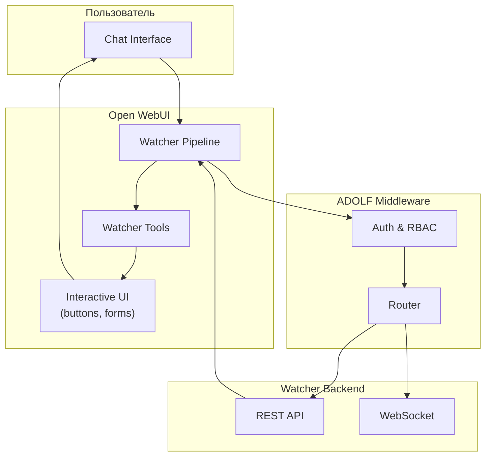

**Проект:** Интеллектуальная система мониторинга цен конкурентов  
**Модуль:** Watcher / Open WebUI  
**Версия:** 2.0  
**Дата:** Январь 2026

---

## 6.1 Обзор интеграции

### Назначение

Open WebUI служит основным интерфейсом для взаимодействия пользователей с модулем Watcher через:

- **Tools** — функции для выполнения действий (добавление SKU, просмотр цен)
- **Pipelines** — обработка запросов и форматирование ответов
- **Интерактивные элементы** — кнопки, формы, таблицы в чате

### Архитектура интеграции



---

## 6.2 Watcher Tools

### Список Tools

| Tool | Описание | Роли |
|------|----------|------|
| `watcher_get_prices` | Получение текущих цен для SKU | Manager+ |
| `watcher_price_history` | История цен за период | Manager+ |
| `watcher_compare_competitors` | Сравнение с конкурентами | Manager+ |
| `watcher_add_subscription` | Добавление SKU для мониторинга | Manager+ |
| `watcher_add_competitor` | Добавление конкурента | Manager+ |
| `watcher_list_subscriptions` | Список подписок | Manager+ |
| `watcher_list_competitors` | Список конкурентов | Manager+ |
| `watcher_get_alerts` | Получение алертов | Manager+ |
| `watcher_mark_alert_read` | Пометка алерта прочитанным | Manager+ |
| `watcher_agent_status` | Статус агентов | Admin |
| `watcher_agent_command` | Команда агенту | Admin |
| `watcher_settings` | Настройки модуля | Admin |

### 6.2.1 watcher_get_prices

```python
# tools/watcher_get_prices.py

class Tools:
    def __init__(self):
        self.name = "watcher_get_prices"
        self.description = """
        Получение текущих цен для товара.
        
        Используй этот инструмент когда пользователь спрашивает:
        - "Какая сейчас цена на [SKU]?"
        - "Покажи цены товара [артикул]"
        - "Сколько стоит [SKU] на маркетплейсах?"
        """
    
    class Valves(BaseModel):
        api_base_url: str = Field(
            default="http://middleware:8000",
            description="URL Middleware API"
        )
    
    class UserValves(BaseModel):
        pass
    
    async def run(
        self,
        sku: str,
        marketplace: str = None,
        __user__: dict = None,
        __event_emitter__=None
    ) -> str:
        """
        Получение текущих цен для SKU.
        
        Args:
            sku: Артикул товара (например, "OM-12345")
            marketplace: Маркетплейс (wildberries/ozon/yandex_market) или None для всех
        
        Returns:
            Форматированный ответ с ценами
        """
        user_id = __user__.get("id")
        
        # Запрос к API
        params = {"sku": sku}
        if marketplace:
            params["marketplace"] = marketplace
        
        response = await self._api_request(
            method="GET",
            endpoint="/api/v1/watcher/prices/current",
            params=params,
            user_id=user_id
        )
        
        if not response.get("success"):
            return f"❌ Ошибка: {response.get('error', 'Неизвестная ошибка')}"
        
        data = response.get("data", {})
        
        # Форматирование ответа
        result = f"## 💰 Цены для {sku}\n\n"
        
        for mp_data in data.get("marketplaces", []):
            mp_name = self._marketplace_name(mp_data["marketplace"])
            result += f"### {mp_name}\n\n"
            
            # Наш товар
            own = mp_data.get("own")
            if own:
                result += f"**Наша цена:** {own['current_price']:,.0f} ₽"
                if own.get("old_price"):
                    result += f" ~~{own['old_price']:,.0f} ₽~~"
                if own.get("spp_price"):
                    result += f" (СПП: {own['spp_price']:,.0f} ₽)"
                result += "\n"
                result += f"**Наличие:** {'✅ В наличии' if own.get('in_stock') else '❌ Нет в наличии'}\n"
                if own.get("rating"):
                    result += f"**Рейтинг:** {own['rating']}⭐ ({own.get('reviews_count', 0)} отзывов)\n"
            
            # Конкуренты
            competitors = mp_data.get("competitors", [])
            if competitors:
                result += f"\n**Конкуренты ({len(competitors)}):**\n\n"
                
                for i, comp in enumerate(competitors[:5], 1):
                    price_diff = ""
                    if own and own.get("current_price") and comp.get("current_price"):
                        diff = comp["current_price"] - own["current_price"]
                        if diff > 0:
                            price_diff = f" (+{diff:,.0f} ₽)"
                        elif diff < 0:
                            price_diff = f" ({diff:,.0f} ₽) ⚠️"
                    
                    result += f"{i}. **{comp.get('seller_name', 'Неизвестный')}**: "
                    result += f"{comp['current_price']:,.0f} ₽{price_diff}\n"
            
            result += "\n"
        
        # Интерактивные кнопки
        if __event_emitter__:
            await __event_emitter__({
                "type": "actions",
                "data": {
                    "actions": [
                        {
                            "id": f"history_{sku}",
                            "label": "📊 История цен",
                            "action": f"Покажи историю цен для {sku} за 30 дней"
                        },
                        {
                            "id": f"competitors_{sku}",
                            "label": "👥 Все конкуренты",
                            "action": f"Покажи всех конкурентов для {sku}"
                        },
                        {
                            "id": f"alerts_{sku}",
                            "label": "🔔 Алерты",
                            "action": f"Покажи алерты для {sku}"
                        }
                    ]
                }
            })
        
        return result
    
    def _marketplace_name(self, code: str) -> str:
        names = {
            "wildberries": "🟣 Wildberries",
            "ozon": "🔵 Ozon",
            "yandex_market": "🔴 Яндекс.Маркет"
        }
        return names.get(code, code)
    
    async def _api_request(self, method: str, endpoint: str, **kwargs):
        import httpx
        async with httpx.AsyncClient() as client:
            response = await client.request(
                method=method,
                url=f"{self.valves.api_base_url}{endpoint}",
                **kwargs
            )
            return response.json()
```

### 6.2.2 watcher_price_history

```python
# tools/watcher_price_history.py

class Tools:
    def __init__(self):
        self.name = "watcher_price_history"
        self.description = """
        Получение истории цен для товара.
        
        Используй этот инструмент когда пользователь спрашивает:
        - "Покажи историю цен [SKU]"
        - "Как менялась цена [артикул] за последний месяц?"
        - "График цен для [SKU]"
        """
    
    async def run(
        self,
        sku: str,
        days: int = 30,
        marketplace: str = None,
        include_competitors: bool = False,
        __user__: dict = None,
        __event_emitter__=None
    ) -> str:
        """
        Получение истории цен.
        
        Args:
            sku: Артикул товара
            days: Количество дней (по умолчанию 30)
            marketplace: Маркетплейс или None для всех
            include_competitors: Включить цены конкурентов
        """
        user_id = __user__.get("id")
        
        params = {
            "sku": sku,
            "days": min(days, 365),  # Максимум год
            "include_competitors": include_competitors
        }
        if marketplace:
            params["marketplace"] = marketplace
        
        response = await self._api_request(
            method="GET",
            endpoint="/api/v1/watcher/prices/history",
            params=params,
            user_id=user_id
        )
        
        if not response.get("success"):
            return f"❌ Ошибка: {response.get('error')}"
        
        data = response.get("data", {})
        history = data.get("history", [])
        
        if not history:
            return f"📭 Нет данных о ценах для {sku} за последние {days} дней"
        
        # Форматирование
        result = f"## 📊 История цен: {sku}\n"
        result += f"*Период: последние {days} дней*\n\n"
        
        # Статистика
        prices = [h["current_price"] for h in history if h.get("current_price")]
        if prices:
            result += f"**Минимум:** {min(prices):,.0f} ₽\n"
            result += f"**Максимум:** {max(prices):,.0f} ₽\n"
            result += f"**Среднее:** {sum(prices)/len(prices):,.0f} ₽\n"
            
            if len(prices) >= 2:
                change = prices[0] - prices[-1]  # Первый = последний по времени
                change_pct = (change / prices[-1]) * 100 if prices[-1] else 0
                emoji = "📈" if change > 0 else "📉" if change < 0 else "➡️"
                result += f"**Изменение:** {emoji} {change:+,.0f} ₽ ({change_pct:+.1f}%)\n"
        
        result += "\n"
        
        # Таблица последних значений
        result += "### Последние записи\n\n"
        result += "| Дата | Цена | СПП | Наличие | Рейтинг |\n"
        result += "|------|------|-----|---------|--------|\n"
        
        for h in history[:10]:
            date = h["parsed_at"][:10]
            price = f"{h['current_price']:,.0f} ₽" if h.get("current_price") else "—"
            spp = f"{h['spp_price']:,.0f} ₽" if h.get("spp_price") else "—"
            stock = "✅" if h.get("in_stock") else "❌"
            rating = f"{h['rating']}⭐" if h.get("rating") else "—"
            
            result += f"| {date} | {price} | {spp} | {stock} | {rating} |\n"
        
        # График (если поддерживается)
        if __event_emitter__ and len(prices) >= 2:
            chart_data = [
                {"date": h["parsed_at"][:10], "price": h.get("current_price")}
                for h in history
                if h.get("current_price")
            ]
            
            await __event_emitter__({
                "type": "chart",
                "data": {
                    "type": "line",
                    "title": f"Динамика цены {sku}",
                    "data": chart_data,
                    "xKey": "date",
                    "yKey": "price",
                    "yLabel": "Цена, ₽"
                }
            })
        
        return result
```

### 6.2.3 watcher_add_subscription

```python
# tools/watcher_add_subscription.py

class Tools:
    def __init__(self):
        self.name = "watcher_add_subscription"
        self.description = """
        Добавление товара для мониторинга цен.
        
        Используй этот инструмент когда пользователь говорит:
        - "Добавь товар [SKU] для мониторинга"
        - "Начни отслеживать цены на [артикул]"
        - "Мониторь этот товар: [URL]"
        """
    
    async def run(
        self,
        sku: str = None,
        url: str = None,
        marketplace: str = None,
        brand_id: str = None,
        __user__: dict = None,
        __event_emitter__=None
    ) -> str:
        """
        Добавление подписки на мониторинг.
        
        Args:
            sku: Артикул товара (если известен)
            url: URL карточки товара (альтернатива SKU)
            marketplace: Маркетплейс
            brand_id: Бренд (ohana_market/ohana_kids)
        """
        user_id = __user__.get("id")
        
        # Валидация входных данных
        if not sku and not url:
            return "❓ Укажите артикул (SKU) или URL карточки товара"
        
        # Если указан URL — извлекаем SKU и маркетплейс
        if url and not sku:
            parsed = self._parse_marketplace_url(url)
            if not parsed:
                return "❌ Не удалось распознать URL маркетплейса"
            sku = parsed["sku"]
            marketplace = parsed["marketplace"]
        
        if not marketplace:
            return "❓ Укажите маркетплейс (wildberries, ozon, yandex_market)"
        
        # Определение бренда из роли пользователя (если не указан)
        if not brand_id:
            user_brand = __user__.get("brand_id")
            if user_brand and user_brand != "all":
                brand_id = user_brand
            else:
                # Запрашиваем у пользователя
                if __event_emitter__:
                    await __event_emitter__({
                        "type": "select",
                        "data": {
                            "id": "brand_select",
                            "label": "Выберите бренд",
                            "options": [
                                {"value": "ohana_market", "label": "Охана Маркет"},
                                {"value": "ohana_kids", "label": "Охана Кидс"}
                            ],
                            "callback": f"Добавь {sku} на {marketplace} для бренда {{value}}"
                        }
                    })
                    return "👆 Выберите бренд для товара"
        
        # Запрос к API
        payload = {
            "sku": sku,
            "marketplace": marketplace,
            "brand_id": brand_id,
            "url": url
        }
        
        response = await self._api_request(
            method="POST",
            endpoint="/api/v1/watcher/subscriptions",
            json=payload,
            user_id=user_id
        )
        
        if not response.get("success"):
            error = response.get("error", "Неизвестная ошибка")
            if "already exists" in error.lower():
                return f"ℹ️ Товар {sku} уже отслеживается на {self._marketplace_name(marketplace)}"
            return f"❌ Ошибка: {error}"
        
        result = f"✅ Товар добавлен для мониторинга!\n\n"
        result += f"**SKU:** {sku}\n"
        result += f"**Маркетплейс:** {self._marketplace_name(marketplace)}\n"
        result += f"**Бренд:** {brand_id}\n\n"
        result += "Первые данные появятся после ночного парсинга (21:00-07:00).\n"
        
        # Кнопки для следующих действий
        if __event_emitter__:
            await __event_emitter__({
                "type": "actions",
                "data": {
                    "actions": [
                        {
                            "id": f"add_competitor_{sku}",
                            "label": "➕ Добавить конкурента",
                            "action": f"Добавь конкурента для {sku}"
                        },
                        {
                            "id": "add_another",
                            "label": "➕ Добавить ещё товар",
                            "action": "Добавь ещё товар для мониторинга"
                        }
                    ]
                }
            })
        
        return result
    
    def _parse_marketplace_url(self, url: str) -> dict | None:
        import re
        
        patterns = {
            "wildberries": r"wildberries\.ru/catalog/(\d+)",
            "ozon": r"ozon\.ru/product/[^/]+-(\d+)",
            "yandex_market": r"market\.yandex\.ru/product/(\d+)"
        }
        
        for marketplace, pattern in patterns.items():
            match = re.search(pattern, url)
            if match:
                return {"sku": match.group(1), "marketplace": marketplace}
        
        return None
```

### 6.2.4 watcher_add_competitor

```python
# tools/watcher_add_competitor.py

class Tools:
    def __init__(self):
        self.name = "watcher_add_competitor"
        self.description = """
        Добавление конкурента для мониторинга.
        
        Используй этот инструмент когда пользователь говорит:
        - "Добавь конкурента [URL] для [SKU]"
        - "Отслеживай этого продавца: [URL]"
        - "Мониторь цены конкурента [URL]"
        """
    
    async def run(
        self,
        competitor_url: str,
        our_sku: str = None,
        seller_name: str = None,
        __user__: dict = None,
        __event_emitter__=None
    ) -> str:
        """
        Добавление конкурента.
        
        Args:
            competitor_url: URL карточки конкурента
            our_sku: Наш SKU для сравнения
            seller_name: Название продавца (опционально)
        """
        user_id = __user__.get("id")
        
        # Парсинг URL конкурента
        parsed = self._parse_marketplace_url(competitor_url)
        if not parsed:
            return "❌ Не удалось распознать URL маркетплейса"
        
        competitor_sku = parsed["sku"]
        marketplace = parsed["marketplace"]
        
        # Если наш SKU не указан — предлагаем выбрать
        if not our_sku:
            # Получаем список наших подписок
            subs_response = await self._api_request(
                method="GET",
                endpoint="/api/v1/watcher/subscriptions",
                params={"marketplace": marketplace},
                user_id=user_id
            )
            
            subscriptions = subs_response.get("data", {}).get("subscriptions", [])
            
            if not subscriptions:
                return f"❌ Нет отслеживаемых товаров на {self._marketplace_name(marketplace)}. Сначала добавьте свой товар."
            
            if len(subscriptions) == 1:
                our_sku = subscriptions[0]["sku"]
            else:
                # Предлагаем выбрать
                if __event_emitter__:
                    options = [
                        {"value": s["sku"], "label": f"{s['sku']}"}
                        for s in subscriptions[:10]
                    ]
                    
                    await __event_emitter__({
                        "type": "select",
                        "data": {
                            "id": "sku_select",
                            "label": "Выберите наш товар для сравнения",
                            "options": options,
                            "callback": f"Добавь конкурента {competitor_url} для {{value}}"
                        }
                    })
                    return "👆 Выберите наш товар, с которым сравнивать конкурента"
        
        # Запрос к API
        payload = {
            "our_sku": our_sku,
            "competitor_sku": competitor_sku,
            "marketplace": marketplace,
            "url": competitor_url,
            "seller_name": seller_name
        }
        
        response = await self._api_request(
            method="POST",
            endpoint="/api/v1/watcher/competitors",
            json=payload,
            user_id=user_id
        )
        
        if not response.get("success"):
            error = response.get("error", "Неизвестная ошибка")
            if "already exists" in error.lower():
                return f"ℹ️ Этот конкурент уже отслеживается для {our_sku}"
            return f"❌ Ошибка: {error}"
        
        result = f"✅ Конкурент добавлен!\n\n"
        result += f"**Наш товар:** {our_sku}\n"
        result += f"**Конкурент SKU:** {competitor_sku}\n"
        result += f"**Маркетплейс:** {self._marketplace_name(marketplace)}\n"
        if seller_name:
            result += f"**Продавец:** {seller_name}\n"
        
        return result
```

### 6.2.5 watcher_get_alerts

```python
# tools/watcher_get_alerts.py

class Tools:
    def __init__(self):
        self.name = "watcher_get_alerts"
        self.description = """
        Получение алертов о ценах.
        
        Используй этот инструмент когда пользователь спрашивает:
        - "Покажи алерты"
        - "Есть ли новые уведомления о ценах?"
        - "Какие изменения цен произошли?"
        """
    
    async def run(
        self,
        sku: str = None,
        unread_only: bool = True,
        limit: int = 20,
        __user__: dict = None,
        __event_emitter__=None
    ) -> str:
        """
        Получение алертов.
        
        Args:
            sku: Фильтр по SKU (опционально)
            unread_only: Только непрочитанные
            limit: Количество записей
        """
        user_id = __user__.get("id")
        brand_id = __user__.get("brand_id")
        
        params = {
            "unread_only": unread_only,
            "limit": min(limit, 50)
        }
        if sku:
            params["sku"] = sku
        if brand_id and brand_id != "all":
            params["brand_id"] = brand_id
        
        response = await self._api_request(
            method="GET",
            endpoint="/api/v1/watcher/alerts",
            params=params,
            user_id=user_id
        )
        
        if not response.get("success"):
            return f"❌ Ошибка: {response.get('error')}"
        
        alerts = response.get("data", {}).get("alerts", [])
        
        if not alerts:
            return "🔔 Нет новых алертов" if unread_only else "📭 Алерты отсутствуют"
        
        result = f"## 🔔 Алерты ({len(alerts)})\n\n"
        
        for alert in alerts:
            emoji = self._alert_emoji(alert["alert_type"])
            severity_badge = self._severity_badge(alert["severity"])
            
            result += f"### {emoji} {self._alert_title(alert['alert_type'])}\n"
            result += f"{severity_badge} | {alert['sku']} | {self._marketplace_name(alert['marketplace'])}\n\n"
            
            details = alert.get("details", {})
            
            if alert["alert_type"] in ["price_drop", "price_rise", "dumping_detected"]:
                old_price = details.get("old_price", 0)
                new_price = details.get("new_price", 0)
                change = details.get("change_percent", 0)
                
                result += f"**Было:** {old_price:,.0f} ₽ → **Стало:** {new_price:,.0f} ₽ ({change:+.1f}%)\n"
                
                if details.get("competitor_name"):
                    result += f"**Конкурент:** {details['competitor_name']}\n"
            
            elif alert["alert_type"] in ["out_of_stock", "back_in_stock"]:
                if details.get("competitor_name"):
                    result += f"**Конкурент:** {details['competitor_name']}\n"
            
            result += f"*{alert['created_at'][:16].replace('T', ' ')}*\n\n"
        
        # Кнопки действий
        if __event_emitter__ and alerts:
            actions = [
                {
                    "id": "mark_all_read",
                    "label": "✓ Отметить все прочитанными",
                    "action": "Отметь все алерты прочитанными"
                }
            ]
            
            await __event_emitter__({
                "type": "actions",
                "data": {"actions": actions}
            })
        
        return result
    
    def _alert_emoji(self, alert_type: str) -> str:
        emojis = {
            "price_drop": "📉",
            "price_rise": "📈",
            "out_of_stock": "❌",
            "back_in_stock": "✅",
            "new_competitor": "👤",
            "rating_drop": "⭐",
            "dumping_detected": "🚨"
        }
        return emojis.get(alert_type, "🔔")
    
    def _alert_title(self, alert_type: str) -> str:
        titles = {
            "price_drop": "Снижение цены",
            "price_rise": "Повышение цены",
            "out_of_stock": "Нет в наличии",
            "back_in_stock": "Снова в наличии",
            "new_competitor": "Новый конкурент",
            "rating_drop": "Падение рейтинга",
            "dumping_detected": "Обнаружен демпинг"
        }
        return titles.get(alert_type, alert_type)
    
    def _severity_badge(self, severity: str) -> str:
        badges = {
            "critical": "🔴 КРИТИЧНО",
            "warning": "🟡 Внимание",
            "info": "🔵 Инфо"
        }
        return badges.get(severity, severity)
```

### 6.2.6 watcher_agent_status (Admin)

```python
# tools/watcher_agent_status.py

class Tools:
    def __init__(self):
        self.name = "watcher_agent_status"
        self.description = """
        Статус агентов парсинга (только для администраторов).
        
        Используй этот инструмент когда администратор спрашивает:
        - "Статус агентов Watcher"
        - "Как работают парсеры?"
        - "Покажи состояние агентов"
        """
    
    async def run(
        self,
        agent_id: str = None,
        __user__: dict = None,
        __event_emitter__=None
    ) -> str:
        """
        Получение статуса агентов.
        
        Args:
            agent_id: ID конкретного агента или None для всех
        """
        user_id = __user__.get("id")
        user_role = __user__.get("role")
        
        # Проверка прав
        if user_role != "admin":
            return "🚫 Эта функция доступна только администраторам"
        
        if agent_id:
            endpoint = f"/api/v1/watcher/agents/{agent_id}"
        else:
            endpoint = "/api/v1/watcher/agents"
        
        response = await self._api_request(
            method="GET",
            endpoint=endpoint,
            user_id=user_id
        )
        
        if not response.get("success"):
            return f"❌ Ошибка: {response.get('error')}"
        
        if agent_id:
            # Детальная информация об одном агенте
            agent = response.get("data")
            return self._format_agent_detail(agent, __event_emitter__)
        else:
            # Список всех агентов
            agents = response.get("data", {}).get("agents", [])
            return await self._format_agent_list(agents, __event_emitter__)
    
    async def _format_agent_list(self, agents: list, event_emitter) -> str:
        result = "## 🤖 Агенты Watcher\n\n"
        
        # Сводка
        online = sum(1 for a in agents if a["status"] in ["working", "ready", "idle"])
        offline = sum(1 for a in agents if a["status"] == "offline")
        error = sum(1 for a in agents if a["status"] in ["panic", "stopped"])
        
        result += f"**Онлайн:** {online} | **Офлайн:** {offline} | **Ошибки:** {error}\n\n"
        
        # Таблица
        result += "| Агент | Статус | Выполнено | Ошибок | Последняя активность |\n"
        result += "|-------|--------|-----------|--------|---------------------|\n"
        
        for agent in agents:
            status_emoji = self._status_emoji(agent["status"])
            last_hb = agent.get("last_heartbeat", "—")
            if last_hb and last_hb != "—":
                last_hb = last_hb[11:16]  # HH:MM
            
            result += f"| {agent['name']} | {status_emoji} {agent['status']} | "
            result += f"{agent.get('tasks_completed_today', 0)} | "
            result += f"{agent.get('tasks_failed_today', 0)} | {last_hb} |\n"
        
        # Кнопки управления
        if event_emitter:
            actions = []
            for agent in agents:
                if agent["status"] == "working":
                    actions.append({
                        "id": f"pause_{agent['id']}",
                        "label": f"⏸️ Пауза {agent['name']}",
                        "action": f"Поставь на паузу агента {agent['id']}"
                    })
                elif agent["status"] == "paused":
                    actions.append({
                        "id": f"resume_{agent['id']}",
                        "label": f"▶️ Продолжить {agent['name']}",
                        "action": f"Возобнови работу агента {agent['id']}"
                    })
            
            if actions:
                await event_emitter({
                    "type": "actions",
                    "data": {"actions": actions[:5]}  # Максимум 5 кнопок
                })
        
        return result
    
    def _format_agent_detail(self, agent: dict, event_emitter) -> str:
        result = f"## 🤖 Агент: {agent['name']}\n\n"
        
        result += f"**ID:** `{agent['id']}`\n"
        result += f"**Статус:** {self._status_emoji(agent['status'])} {agent['status']}\n"
        result += f"**IP:** {agent.get('current_ip', '—')}\n"
        result += f"**Оператор:** {agent.get('modem_operator', '—')}\n"
        result += f"**Сигнал:** {agent.get('signal_strength', '—')}\n"
        result += f"**Версия:** {agent.get('version', '—')}\n\n"
        
        result += "### Статистика за сегодня\n"
        result += f"- Выполнено: {agent.get('tasks_completed_today', 0)}\n"
        result += f"- Ошибок: {agent.get('tasks_failed_today', 0)}\n"
        result += f"- Среднее время: {agent.get('avg_task_time_ms', '—')} мс\n\n"
        
        result += "### Cookies\n"
        cookies_time = agent.get("cookies_updated_at", "—")
        if cookies_time and cookies_time != "—":
            cookies_time = cookies_time[:16].replace("T", " ")
        result += f"- Обновлены: {cookies_time}\n"
        result += f"- Валидны: {'✅ Да' if agent.get('cookies_valid') else '❌ Нет'}\n"
        
        return result
    
    def _status_emoji(self, status: str) -> str:
        emojis = {
            "working": "🟢",
            "ready": "🟡",
            "idle": "⚪",
            "paused": "⏸️",
            "panic": "🔴",
            "offline": "⚫",
            "stopped": "🛑"
        }
        return emojis.get(status, "❓")
```

---

## 6.3 Watcher Pipeline

### Назначение

Pipeline обрабатывает входящие сообщения, определяет intent и вызывает соответствующие Tools.

```python
# pipelines/watcher_pipeline.py

from typing import Optional, List, Dict, Any
from pydantic import BaseModel, Field


class Pipeline:
    def __init__(self):
        self.name = "Watcher Pipeline"
        self.description = "Обработка запросов к модулю мониторинга цен"
    
    class Valves(BaseModel):
        enabled: bool = Field(default=True, description="Включить pipeline")
        priority: int = Field(default=10, description="Приоритет")
        model: str = Field(default="gpt-5-mini", description="Модель для intent detection")
    
    async def inlet(
        self,
        body: dict,
        __user__: Optional[dict] = None
    ) -> dict:
        """Предобработка входящего запроса."""
        
        # Проверка прав доступа
        user_role = __user__.get("role", "staff") if __user__ else "staff"
        
        if user_role == "staff":
            # Staff не имеет доступа к Watcher
            body["__watcher_access__"] = False
        else:
            body["__watcher_access__"] = True
            body["__user_brand__"] = __user__.get("brand_id", "all")
        
        return body
    
    async def outlet(
        self,
        body: dict,
        __user__: Optional[dict] = None
    ) -> dict:
        """Постобработка ответа."""
        
        # Добавление контекстной информации
        messages = body.get("messages", [])
        
        if messages and body.get("__watcher_access__"):
            last_message = messages[-1].get("content", "")
            
            # Проверка на Watcher-related keywords
            watcher_keywords = [
                "цена", "цены", "конкурент", "мониторинг", "алерт",
                "wildberries", "ozon", "яндекс", "маркетплейс",
                "sku", "артикул", "демпинг"
            ]
            
            if any(kw in last_message.lower() for kw in watcher_keywords):
                # Добавляем системный контекст
                system_context = self._build_watcher_context(__user__)
                
                if body.get("messages") and body["messages"][0].get("role") == "system":
                    body["messages"][0]["content"] += f"\n\n{system_context}"
                else:
                    body["messages"].insert(0, {
                        "role": "system",
                        "content": system_context
                    })
        
        return body
    
    def _build_watcher_context(self, user: dict) -> str:
        """Формирование контекста для Watcher запросов."""
        
        role = user.get("role", "manager")
        brand = user.get("brand_id", "all")
        
        context = """
## Контекст модуля Watcher

Ты помогаешь пользователю работать с системой мониторинга цен ADOLF Watcher.

### Доступные функции:
- Просмотр текущих цен и истории
- Сравнение с конкурентами
- Добавление товаров и конкурентов для мониторинга
- Просмотр алертов об изменениях цен

### Правила:
1. Используй соответствующие Tools для выполнения действий
2. Форматируй цены с разделителями тысяч (1 234 ₽)
3. Всегда указывай маркетплейс при выводе данных
4. Предлагай следующие действия через интерактивные кнопки
"""
        
        if role == "admin":
            context += """
### Административные функции (доступны):
- Мониторинг статуса агентов
- Управление агентами (пауза, возобновление)
- Изменение настроек модуля
"""
        
        if brand != "all":
            context += f"\n### Фильтрация: Показывать только данные бренда `{brand}`"
        
        return context
```

---

## 6.4 Интерактивные элементы

### 6.4.1 Кнопки действий

```python
# Пример отправки кнопок
await __event_emitter__({
    "type": "actions",
    "data": {
        "actions": [
            {
                "id": "action_1",
                "label": "📊 История цен",
                "action": "Покажи историю цен для OM-12345"
            },
            {
                "id": "action_2", 
                "label": "👥 Конкуренты",
                "action": "Покажи конкурентов для OM-12345"
            }
        ]
    }
})
```

### 6.4.2 Выпадающий список

```python
# Выбор из списка
await __event_emitter__({
    "type": "select",
    "data": {
        "id": "marketplace_select",
        "label": "Выберите маркетплейс",
        "options": [
            {"value": "wildberries", "label": "🟣 Wildberries"},
            {"value": "ozon", "label": "🔵 Ozon"},
            {"value": "yandex_market", "label": "🔴 Яндекс.Маркет"}
        ],
        "callback": "Добавь товар на {value}"
    }
})
```

### 6.4.3 Графики

```python
# Линейный график цен
await __event_emitter__({
    "type": "chart",
    "data": {
        "type": "line",
        "title": "Динамика цены",
        "data": [
            {"date": "2026-01-01", "price": 2499, "competitor": 2599},
            {"date": "2026-01-02", "price": 2399, "competitor": 2599},
            {"date": "2026-01-03", "price": 2399, "competitor": 2499}
        ],
        "xKey": "date",
        "series": [
            {"key": "price", "label": "Наша цена", "color": "#4CAF50"},
            {"key": "competitor", "label": "Конкурент", "color": "#F44336"}
        ]
    }
})
```

### 6.4.4 Таблицы с сортировкой

```python
# Интерактивная таблица
await __event_emitter__({
    "type": "table",
    "data": {
        "columns": [
            {"key": "seller", "label": "Продавец", "sortable": True},
            {"key": "price", "label": "Цена", "sortable": True, "type": "number"},
            {"key": "stock", "label": "Наличие", "type": "boolean"},
            {"key": "rating", "label": "Рейтинг", "sortable": True}
        ],
        "rows": [
            {"seller": "Fashion Store", "price": 2499, "stock": True, "rating": 4.7},
            {"seller": "Style Shop", "price": 2299, "stock": True, "rating": 4.5}
        ],
        "defaultSort": {"key": "price", "direction": "asc"}
    }
})
```

---

## 6.5 Примеры диалогов

### Просмотр цен

```
👤 Пользователь: Какие цены на OM-12345?

🤖 Ассистент: 
## 💰 Цены для OM-12345

### 🟣 Wildberries

**Наша цена:** 2 499 ₽ ~~4 999 ₽~~ (СПП: 2 249 ₽)
**Наличие:** ✅ В наличии
**Рейтинг:** 4.7⭐ (1234 отзывов)

**Конкуренты (3):**

1. **Fashion Store**: 2 599 ₽ (+100 ₽)
2. **Style Shop**: 2 299 ₽ (-200 ₽) ⚠️
3. **Trendy Wear**: 2 499 ₽

[📊 История цен] [👥 Все конкуренты] [🔔 Алерты]
```

### Добавление товара

```
👤 Пользователь: Добавь для мониторинга https://www.wildberries.ru/catalog/12345678/detail.aspx

🤖 Ассистент:
👆 Выберите бренд для товара

[Охана Маркет] [Охана Кидс]

👤 Пользователь: *нажимает "Охана Маркет"*

🤖 Ассистент:
✅ Товар добавлен для мониторинга!

**SKU:** 12345678
**Маркетплейс:** 🟣 Wildberries
**Бренд:** ohana_market

Первые данные появятся после ночного парсинга (21:00-07:00).

[➕ Добавить конкурента] [➕ Добавить ещё товар]
```

### Алерты

```
👤 Пользователь: Покажи алерты

🤖 Ассистент:
## 🔔 Алерты (3)

### 🚨 Обнаружен демпинг
🔴 КРИТИЧНО | OM-12345 | 🟣 Wildberries

**Было:** 2 499 ₽ → **Стало:** 1 499 ₽ (-40.0%)
**Конкурент:** Style Shop
*2026-01-15 08:30*

### 📉 Снижение цены
🟡 Внимание | OM-67890 | 🔵 Ozon

**Было:** 1 999 ₽ → **Стало:** 1 799 ₽ (-10.0%)
**Конкурент:** Fashion Plus
*2026-01-15 07:45*

### ❌ Нет в наличии
🔵 Инфо | OK-11111 | 🟣 Wildberries

**Конкурент:** Trendy Kids
*2026-01-15 07:30*

[✓ Отметить все прочитанными]
```

---

## 6.6 Уведомления

### Push-уведомления (v2.0)

```python
# services/notifications/watcher_notifications.py

class WatcherNotificationService:
    """Уведомления модуля Watcher."""
    
    async def send_alert_notification(
        self,
        alert: dict,
        recipients: List[str]
    ):
        """Отправка уведомления об алерте."""
        
        title = self._get_alert_title(alert)
        body = self._get_alert_body(alert)
        
        for user_id in recipients:
            await self.notification_service.send(
                user_id=user_id,
                title=title,
                body=body,
                data={
                    "type": "watcher_alert",
                    "alert_id": alert["id"],
                    "sku": alert["sku"]
                },
                channel="push"  # или "email", "in_app"
            )
    
    def _get_alert_title(self, alert: dict) -> str:
        titles = {
            "dumping_detected": "🚨 Демпинг обнаружен!",
            "price_drop": "📉 Снижение цены конкурента",
            "price_rise": "📈 Повышение цены",
            "out_of_stock": "❌ Товар закончился"
        }
        return titles.get(alert["alert_type"], "🔔 Watcher Alert")
    
    def _get_alert_body(self, alert: dict) -> str:
        details = alert.get("details", {})
        
        if alert["alert_type"] in ["price_drop", "price_rise", "dumping_detected"]:
            return (
                f"{alert['sku']}: {details.get('old_price')} → "
                f"{details.get('new_price')} ₽ "
                f"({details.get('change_percent'):+.0f}%)"
            )
        
        return f"{alert['sku']} на {alert['marketplace']}"
```

### Получатели уведомлений

| Тип алерта | Severity | Получатели |
|------------|----------|------------|
| `dumping_detected` | critical | Manager (по бренду), Senior, Director |
| `price_drop` (>20%) | warning | Manager (по бренду), Senior |
| `price_drop` (<20%) | info | Manager (по бренду) |
| `out_of_stock` | warning | Manager (по бренду) |
| `agent_offline` | warning | Admin |
| `cookies_expired` | warning | Admin |

---

## 6.7 Конфигурация Tools

### Файл манифеста

```json
// tools/watcher/manifest.json
{
    "name": "Watcher Tools",
    "version": "2.0.0",
    "description": "Инструменты для мониторинга цен конкурентов",
    "author": "ADOLF Team",
    "tools": [
        {
            "name": "watcher_get_prices",
            "file": "watcher_get_prices.py",
            "enabled": true,
            "roles": ["manager", "senior", "director", "admin"]
        },
        {
            "name": "watcher_price_history",
            "file": "watcher_price_history.py",
            "enabled": true,
            "roles": ["manager", "senior", "director", "admin"]
        },
        {
            "name": "watcher_compare_competitors",
            "file": "watcher_compare_competitors.py",
            "enabled": true,
            "roles": ["manager", "senior", "director", "admin"]
        },
        {
            "name": "watcher_add_subscription",
            "file": "watcher_add_subscription.py",
            "enabled": true,
            "roles": ["manager", "senior", "director", "admin"]
        },
        {
            "name": "watcher_add_competitor",
            "file": "watcher_add_competitor.py",
            "enabled": true,
            "roles": ["manager", "senior", "director", "admin"]
        },
        {
            "name": "watcher_get_alerts",
            "file": "watcher_get_alerts.py",
            "enabled": true,
            "roles": ["manager", "senior", "director", "admin"]
        },
        {
            "name": "watcher_agent_status",
            "file": "watcher_agent_status.py",
            "enabled": true,
            "roles": ["admin"]
        },
        {
            "name": "watcher_agent_command",
            "file": "watcher_agent_command.py",
            "enabled": true,
            "roles": ["admin"]
        }
    ]
}
```

---

## Приложение А: Матрица доступа Tools

| Tool | Staff | Manager | Senior | Director | Admin |
|------|:-----:|:-------:|:------:|:--------:|:-----:|
| watcher_get_prices | ❌ | ✅ | ✅ | ✅ | ✅ |
| watcher_price_history | ❌ | ✅ | ✅ | ✅ | ✅ |
| watcher_compare_competitors | ❌ | ✅ | ✅ | ✅ | ✅ |
| watcher_add_subscription | ❌ | ✅ | ✅ | ✅ | ✅ |
| watcher_add_competitor | ❌ | ✅ | ✅ | ✅ | ✅ |
| watcher_list_subscriptions | ❌ | ✅ | ✅ | ✅ | ✅ |
| watcher_get_alerts | ❌ | ✅ | ✅ | ✅ | ✅ |
| watcher_mark_alert_read | ❌ | ✅ | ✅ | ✅ | ✅ |
| watcher_agent_status | ❌ | ❌ | ❌ | ❌ | ✅ |
| watcher_agent_command | ❌ | ❌ | ❌ | ❌ | ✅ |
| watcher_settings | ❌ | ❌ | ❌ | ❌ | ✅ |

---

## Приложение Б: Контрольные точки Open WebUI

| Критерий | Проверка |
|----------|----------|
| Tools загружены | Отображаются в списке инструментов |
| Pipeline активен | Обрабатывает Watcher-запросы |
| Авторизация работает | Staff не видит Tools |
| Фильтрация по бренду | Manager видит только свой бренд |
| Кнопки работают | Нажатие вызывает action |
| Графики рендерятся | Отображаются в чате |
| Уведомления приходят | Push/in-app доставляются |

---

**Документ подготовлен:** Январь 2026  
**Версия:** 2.0  
**Статус:** Черновик
