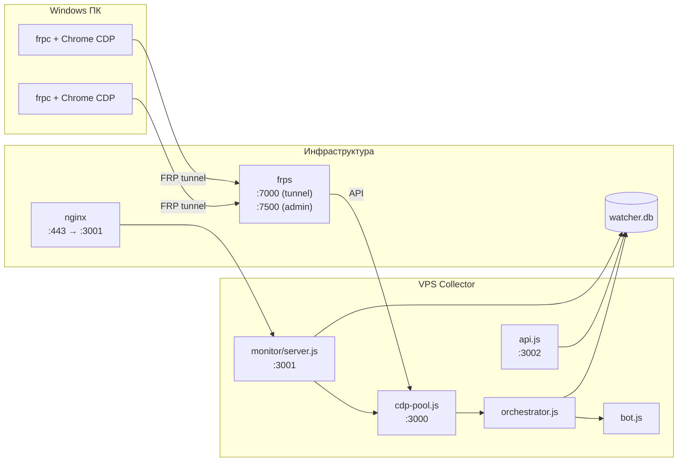
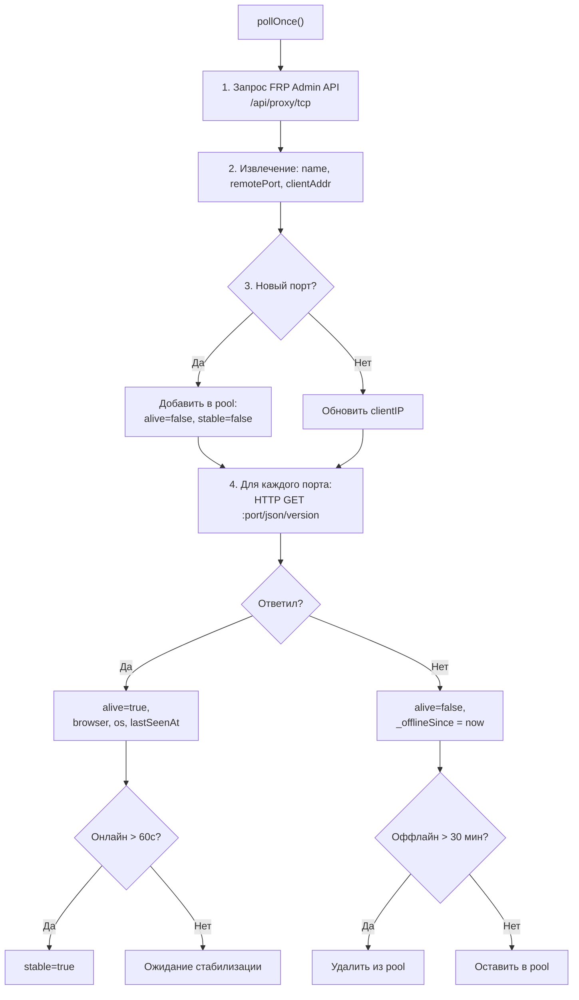
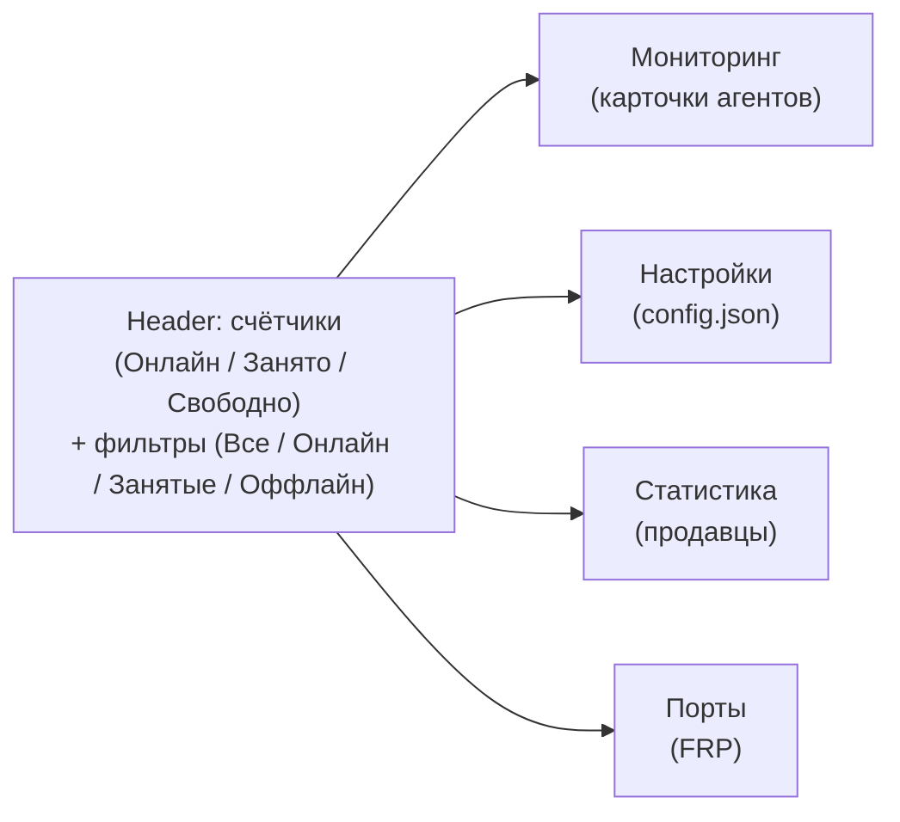
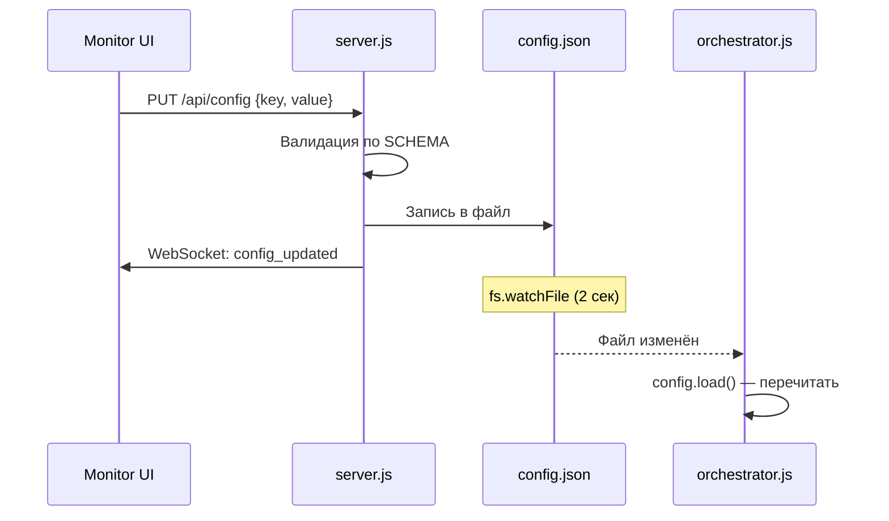
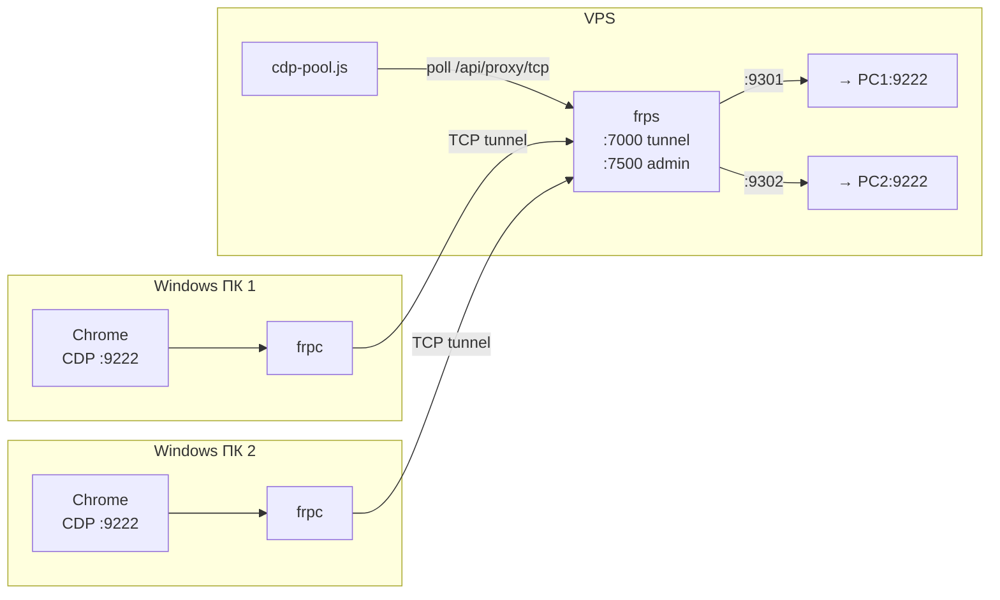
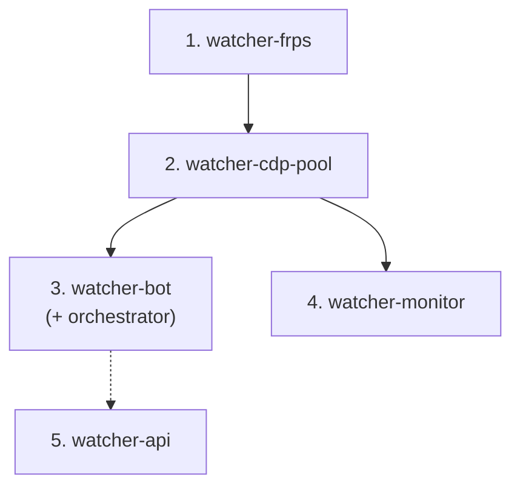

**Проект:** ADOLF — AI-Driven Operations Layer Framework  
**Модуль:** Watcher / Collector  
**Версия:** 4.0  
**Дата:** Февраль 2026

---

## 7.1 Обзор

Collector состоит из пяти процессов на VPS, каждый со своим портом и назначением:

| Процесс | Файл | Порт | Назначение |
|---------|------|:----:|------------|
| CDP Pool | `cdp-pool.js` | 3000 | Обнаружение и управление пулом ПК через FRP |
| Monitor | `monitor/server.js` | 3001 | Веб-дашборд мониторинга + WebSocket |
| REST API | `api.js` | 3002 | Программный доступ к данным (см. [Раздел 5](/watcher/adolf_watcher_5_database_api)) |
| Telegram Bot | `bot.js` | — | Управление через Telegram (см. [Раздел 2](/watcher/adolf_watcher_2_bot_scheduler)) |
| Orchestrator | `orchestrator.js` | — | Планирование и исполнение задач (см. [Раздел 3](/watcher/adolf_watcher_3_orchestrator_runner)) |



---

## 7.2 CDP Pool

CDP Pool (`cdp-pool.js`, 339 строк) обнаруживает Windows-ПК, подключённые через FRP, проверяет доступность Chrome CDP и управляет распределением задач.

### Конфигурация (константы)

| Параметр | Значение | Описание |
|----------|:--------:|----------|
| `POOL_PORT` | 3000 | Порт HTTP-сервера |
| `POOL_HOST` | 127.0.0.1 | Только локальные подключения |
| `FRP_API_PORT` | 7500 | FRP Admin API |
| `POLL_INTERVAL` | 10 сек | Период опроса FRP + CDP |
| `STABLE_AFTER_MS` | 60 сек | ПК считается стабильным после 60с онлайн |
| `OFFLINE_REMOVE_MS` | 30 мин | Удаление ПК из пула после 30 мин оффлайн |

### Цикл обнаружения (`pollOnce`)



### HTTP API

| Эндпоинт | Метод | Описание | Коды ответа |
|----------|:-----:|----------|-------------|
| `/status` | GET | Список всех ПК в пуле (name, cdpPort, alive, stable, busy, busyBy, clientIP, browser, os, connectedAt, lastSeenAt, tasksCompleted) | 200 |
| `/summary` | GET | Сводка: total, online, stable, busy, free | 200 |
| `/acquire?task=ID&port=PORT` | GET | Захват ПК для задачи. Без `port` — автовыбор (минимум tasksCompleted). С `port` — конкретный ПК | 200 / 404 / 409 / 410 / 503 |
| `/release?port=PORT` | GET | Освобождение ПК после задачи, tasksCompleted++ | 200 / 404 |
| `/sync` | GET | Принудительный pollOnce(), возврат summary | 200 |

Коды ошибок `/acquire`: 404 — unknown\_port, 409 — pc\_busy, 410 — pc\_offline, 503 — no\_free (все заняты).

---

## 7.3 Monitor (веб-дашборд)

Monitor (`monitor/server.js`, 779 строк) — веб-интерфейс для администрирования Collector. Доступен через nginx по HTTPS.

### Зависимости

Единственная внешняя: `ws` (WebSocket). Frontend: Tailwind CSS (CDN), Lucide Icons.

### Авторизация

Простая cookie-сессия. При первом визите отображается login.html.

| Элемент | Значение |
|---------|----------|
| Логин/пароль | `admin` / `admin` (константы в server.js) |
| Cookie | `session=<random 32 bytes hex>`, HttpOnly, SameSite=Strict, 7 дней |
| WebSocket | Проверка cookie при upgrade |

### Табы интерфейса

Monitor содержит 4 таба:



#### Таб «Мониторинг»

Грид карточек агентов (ПК). Каждая карточка отображает:

| Поле | Описание |
|------|----------|
| Имя ПК | `name` из FRP (cdp-COMPUTERNAME) |
| Статус | Онлайн / Занят / Оффлайн (цветовая индикация) |
| IP | Маскированный: `192.168.**. 15` |
| Браузер / ОС | Chrome версия, Windows версия |
| Задач выполнено | `tasksCompleted` |
| Текущая задача | scan\_ID или enrich\_ID |
| Прогресс | Парсинг из лога: `[enrich] 50/268` → прогресс-бар |
| Лог | Последние 20 строк лога текущей задачи (live-обновление через WebSocket) |

Анимированные GIF-индикаторы: `work.gif` (занят), `info.gif` (онлайн), `error.gif` (оффлайн), `worker.png` (иконка).

#### Таб «Настройки»

Редактирование config.json через UI. Каждый параметр отображается с валидацией по схеме (min/max). Изменения сохраняются через `PUT /api/config` и транслируются всем WebSocket-клиентам.

#### Таб «Статистика»

Таблица продавцов с данными из SQLite:

| Колонка | Источник |
|---------|----------|
| Маркетплейс, ID, имя | `sellers` |
| Приоритет, статус | `sellers` |
| Расписание (скан / обогащение) | `schedule_hours`, `enrich_schedule_hours` |
| Последний скан / обогащение | `last_scan_at`, `last_enriched_at` |
| Следующий скан / обогащение | `next_scan_at`, `next_enrich_at` |
| Очередь (scan/enrich queued/running) | `scans` (агрегация) |
| Товаров (последний скан) | `scans` (last completed scan) |
| Обогащено | `product_details` (COUNT по seller) |

#### Таб «Порты»

Карта FRP-портов (9300–9399). Для каждого порта: статус (online/offline/free), имя прокси, трафик, время подключения, версия клиента. Порт-маппинг сохраняется в `frp-port-memory.json` для persistence между перезапусками.

### Дополнительные функции

**Скачивание FRP-клиента** (`GET /api/frp-client`): генерирует ZIP-архив с тремя файлами для Windows-ПК:

| Файл | Содержание |
|------|------------|
| `frpc.toml` | Конфигурация FRP-клиента с автоподстановкой server address и auth token |
| `start.bat` | Скрипт запуска: скачивание frpc.exe (если нет) + подключение |
| `chrome-debug.bat` | Запуск Chrome с `--remote-debugging-port=9222` |

ZIP генерируется без внешних зависимостей (STORE-метод, встроенный CRC32).

**Добавление продавца** (`POST /api/sellers`): модальное окно с автопарсингом URL маркетплейса (WB/Ozon/YM), выбором маркетплейса, ID и имени. Поддержка `seller_slug` для Яндекс.Маркет.

### WebSocket

| Тип сообщения | Направление | Содержание |
|--------------|:-----------:|------------|
| `agents` | server → client | Полный список агентов с логами и прогрессом |
| `log` | server → client | Инкрементальные строки лога конкретного агента |
| `config_updated` | server → client | Изменение параметра конфигурации |
| `error` | server → client | Ошибка подключения к CDP Pool |

Polling: агенты опрашиваются с интервалом `monitor.pollIntervalMs` (по умолчанию 5 сек). Log watcher: `fs.watch` на директорию логов, инкрементальное чтение новых строк.

### HTTP API Monitor

| Эндпоинт | Метод | Авторизация | Описание |
|----------|:-----:|:-----------:|----------|
| `/api/login` | POST | Нет | Аутентификация (username, password) |
| `/api/agents` | GET | Да | Агенты с логами и прогрессом |
| `/api/summary` | GET | Да | Сводка CDP Pool |
| `/api/config` | GET | Да | Текущая конфигурация + схема |
| `/api/config` | PUT | Да | Обновить параметр (key, value) |
| `/api/frp` | GET | Да | Карта FRP-портов |
| `/api/frp-client` | GET | Да | Скачать ZIP с FRP-клиентом |
| `/api/sellers` | GET | Да | Список продавцов + очереди + статистика |
| `/api/sellers` | POST | Да | Добавить продавца |

---

## 7.4 Конфигурация

Централизованная система конфигурации (`config.js`, 164 строки): JSON-файл с hot-reload, валидацией по схеме и кросс-процессной синхронизацией.

### Файл конфигурации

Путь: `/opt/watcher/config.json`. Если отсутствует — используются значения по умолчанию. Все процессы (bot.js, orchestrator.js, monitor) загружают один файл.

### Параметры

#### Оркестратор

| Параметр | По умолчанию | Диапазон | Описание |
|----------|:------------:|:--------:|----------|
| `orchestrator.cooldownMinMs` | 300 000 (5 мин) | 0–3 600 000 | Минимальный кулдаун ПК после задачи |
| `orchestrator.cooldownMaxMs` | 600 000 (10 мин) | 0–7 200 000 | Максимальный кулдаун |
| `orchestrator.penaltySameSeller` | 100 | 0–1 000 | Штраф за повтор продавца на ПК |
| `orchestrator.penaltySameMarketplace` | 50 | 0–1 000 | Штраф за повтор маркетплейса на ПК |
| `orchestrator.idleBonusMax` | 20 | 0–100 | Макс. бонус за простой ПК |
| `orchestrator.idleBonusIntervalMs` | 600 000 (10 мин) | 60 000–3 600 000 | Интервал начисления бонуса |
| `orchestrator.neverUsedBonus` | 20 | 0–100 | Бонус для ещё ни разу не использованного ПК |

#### Планировщик

| Параметр | По умолчанию | Диапазон | Описание |
|----------|:------------:|:--------:|----------|
| `scheduler.defaultScanScheduleHours` | 72 | 1–720 | Расписание сканирования (часы) |
| `scheduler.defaultEnrichScheduleHours` | 24 | 1–720 | Расписание обогащения (часы) |
| `scheduler.scheduleCheckIntervalMs` | 300 000 (5 мин) | 10 000–3 600 000 | Интервал проверки расписания |
| `scheduler.enrichCheckIntervalMs` | 300 000 (5 мин) | 10 000–3 600 000 | Интервал проверки обогащения |
| `scheduler.tryRunNextIntervalMs` | 30 000 (30 сек) | 5 000–600 000 | Интервал попытки запуска следующей задачи |
| `scheduler.monitorIntervalMs` | 15 000 (15 сек) | 5 000–300 000 | Интервал мониторинга задач |
| `scheduler.rotationIntervalMs` | 86 400 000 (24ч) | 3 600 000–604 800 000 | Интервал ротации архивов |
| `scheduler.morningSummaryUtcHour` | 5 | 0–23 | Час утреннего отчёта (UTC) |
| `scheduler.morningSummaryUtcMinute` | 0 | 0–59 | Минута утреннего отчёта |
| `scheduler.enrichLimit` | 2 | 1–20 | Макс. параллельных обогащений |
| `scheduler.catalogKeepPerSeller` | 10 | 1–100 | Кол-во архивных каталогов на продавца |
| `scheduler.enrichedKeepPerSeller` | 30 | 1–200 | Кол-во архивных обогащённых файлов |

#### Runner

| Параметр | По умолчанию | Диапазон | Описание |
|----------|:------------:|:--------:|----------|
| `runner.scanTimeoutMs` | 10 800 000 (3ч) | 60 000–86 400 000 | Таймаут сканирования |
| `runner.enrichTimeoutMs` | 1 800 000 (30 мин) | 60 000–86 400 000 | Таймаут обогащения |
| `runner.maxRetries` | 3 | 0–10 | Макс. повторов при ошибке |

#### Монитор

| Параметр | По умолчанию | Диапазон | Описание |
|----------|:------------:|:--------:|----------|
| `monitor.pollIntervalMs` | 5 000 (5 сек) | 1 000–60 000 | Интервал опроса агентов |

### Механика hot-reload



Все процессы подписаны на изменения `config.json` через `fs.watchFile` с интервалом 2 секунды. Кросс-валидация: `cooldownMinMs` ≤ `cooldownMaxMs`.

---

## 7.5 Структура директорий

```
/opt/watcher/
├── bot.js                          # Telegram-бот
├── orchestrator.js                 # Оркестратор (+ scheduler.js, runner.js)
├── scheduler.js                    # Планировщик
├── runner.js                       # Исполнитель задач
├── api.js                          # REST API :3002
├── cdp-pool.js                     # CDP Pool :3000
├── cdp.js                          # CDP-обёртка (подключение к Chrome)
├── db.js                           # SQLite (better-sqlite3)
├── config.js                       # Система конфигурации
├── config.json                     # Параметры (hot-reload)
├── utils.js                        # computeDiff()
├── .env                            # BOT_TOKEN, ADMIN_IDS, CDP_PORT
├── package.json                    # Зависимости
│
├── SKILL/                          # Скрипты сканирования/обогащения
│   ├── SKILL.md                    # Инструкция для Claude Code
│   ├── scanner_wb.js               # Сканер Wildberries
│   ├── scanner_ozon.js             # Сканер Ozon
│   ├── scanner_ymarket.js          # Сканер Яндекс.Маркет
│   ├── enricher_wb.js              # Обогатитель Wildberries
│   ├── enricher_ozon.js            # Обогатитель Ozon
│   ├── enricher_ymarket.js         # Обогатитель Яндекс.Маркет
│   └── human.js                    # Эмуляция поведения
│
├── monitor/                        # Веб-дашборд
│   ├── server.js                   # HTTP + WebSocket :3001
│   ├── package.json                # ws dependency
│   └── public/
│       ├── index.html              # SPA (Tailwind + Lucide)
│       ├── login.html              # Страница авторизации
│       ├── app.js                  # Клиентская логика (41 KB)
│       ├── style.css               # Стили (shadcn/ui переменные)
│       ├── work.gif                # Анимация «занят»
│       ├── info.gif                # Анимация «онлайн»
│       ├── error.gif               # Анимация «оффлайн»
│       └── worker.png              # Иконка агента
│
├── results/                        # Результаты сканирования
│   ├── results_seller_<id>.json    # Текущий скан
│   ├── enriched_seller_<id>.json   # Текущее обогащение
│   ├── catalog/                    # Архив каталогов
│   └── enriched/                   # Архив обогащённых данных
│
├── logs/                           # Логи задач
│   ├── scan_<id>_<mp>_<seller>.log
│   └── enrich_<id>_<mp>_<seller>.log
│
├── frp-port-memory.json            # Маппинг имя→порт (persistence)
└── watcher.db                      # SQLite база данных
```

---

## 7.6 FRP-инфраструктура

FRP (Fast Reverse Proxy) обеспечивает TCP-туннели между Windows-ПК с Chrome и VPS.

### Архитектура



### Серверная сторона (VPS)

Конфигурация `/etc/frp/frps.toml`:

```toml
bindPort = 7000
webServer.addr = "127.0.0.1"
webServer.port = 7500
webServer.user = "admin"
webServer.password = "<secret>"
auth.method = "token"
auth.token = "<secret>"
allowPorts = [{ start = 9300, end = 9399 }]
```

Диапазон портов: 9300–9399 (до 100 ПК). Порты назначаются динамически (`remotePort = 0`).

### Клиентская сторона (Windows ПК)

Конфигурация `frpc.toml`:

```toml
serverAddr = "agent.adolf.su"
serverPort = 7000
auth.method = "token"
auth.token = "<secret>"

[[proxies]]
name = "cdp-{{.Envs.COMPUTERNAME}}"
type = "tcp"
localIP = "127.0.0.1"
localPort = 9222
remotePort = 0
```

Имя прокси: `cdp-<COMPUTERNAME>` (автоматически из переменной среды Windows).

### Маппинг портов

`frp-port-memory.json` сохраняет маппинг `name → port`, чтобы при переподключении ПК мог получить тот же порт (если свободен). Обновляется Monitor при каждом запросе `/api/frp`.

---

## 7.7 Логирование

### Логи задач

Каждая задача (scan / enrich) создаёт отдельный лог-файл в `/opt/watcher/logs/`:

| Формат имени | Пример |
|-------------|--------|
| `scan_<scan_id>_<marketplace>_<seller_id>.log` | `scan_42_wildberries_68318.log` |
| `enrich_<scan_id>_<marketplace>_<seller_id>.log` | `enrich_43_ozon_12345.log` |

Логи создаются Runner при запуске задачи (см. [Раздел 3](/watcher/adolf_watcher_3_orchestrator_runner)). Stdout и stderr дочернего процесса перенаправляются в файл.

### Парсинг прогресса

Monitor парсит логи в реальном времени для отображения прогресса:

| Паттерн в логе | Тип | Пример |
|----------------|-----|--------|
| `[enrich] N/M` | Обогащение | `[enrich] 50/268` |
| `[scan] N/M` | Сканирование | `[scan] 30/100` |
| `Progress: N/M` | Обогащение | `Progress: 150/200` |
| `progress: N products` + `Expected products: M` | Сканирование | `progress: 135 products` |

### Лог-тейлинг

Monitor отслеживает изменения файлов через `fs.watch` на директорию `/opt/watcher/logs/`. При появлении новых строк:

1. `getNewLogLines()` читает файл с позиции `lastSize`
2. Новые строки отправляются через WebSocket: `{ type: "log", agent: pcName, lines: [...] }`
3. `lastSize` обновляется

### Ротация логов

Логи не ротируются автоматически. Рекомендуется настроить logrotate:

```
/opt/watcher/logs/*.log {
    daily
    rotate 30
    compress
    missingok
    notifempty
}
```

---

## 7.8 Развёртывание

### Systemd-сервисы

Каждый процесс запускается как отдельный systemd-сервис:

```ini
# /etc/systemd/system/watcher-cdp-pool.service
[Unit]
Description=Watcher CDP Pool
After=network.target watcher-frps.service

[Service]
Type=simple
User=watcher
WorkingDirectory=/opt/watcher
ExecStart=/usr/bin/node cdp-pool.js
Restart=always
RestartSec=5

[Install]
WantedBy=multi-user.target
```

```ini
# /etc/systemd/system/watcher-bot.service
[Unit]
Description=Watcher Telegram Bot + Orchestrator
After=network.target watcher-cdp-pool.service

[Service]
Type=simple
User=watcher
WorkingDirectory=/opt/watcher
ExecStart=/usr/bin/node bot.js
Restart=always
RestartSec=10
EnvironmentFile=/opt/watcher/.env

[Install]
WantedBy=multi-user.target
```

```ini
# /etc/systemd/system/watcher-api.service
[Unit]
Description=Watcher REST API
After=network.target

[Service]
Type=simple
User=watcher
WorkingDirectory=/opt/watcher
ExecStart=/usr/bin/node api.js
Restart=always
RestartSec=5

[Install]
WantedBy=multi-user.target
```

```ini
# /etc/systemd/system/watcher-monitor.service
[Unit]
Description=Watcher Monitor Dashboard
After=network.target watcher-cdp-pool.service

[Service]
Type=simple
User=watcher
WorkingDirectory=/opt/watcher/monitor
ExecStart=/usr/bin/node server.js
Restart=always
RestartSec=5

[Install]
WantedBy=multi-user.target
```

```ini
# /etc/systemd/system/watcher-frps.service
[Unit]
Description=FRP Server
After=network.target

[Service]
Type=simple
ExecStart=/usr/local/bin/frps -c /etc/frp/frps.toml
Restart=always
RestartSec=5
LimitNOFILE=65536

[Install]
WantedBy=multi-user.target
```

### Порядок запуска



### Nginx

Проксирование Monitor через HTTPS:

```nginx
server {
    listen 443 ssl;
    server_name agent.adolf.su;

    ssl_certificate /etc/letsencrypt/live/agent.adolf.su/fullchain.pem;
    ssl_certificate_key /etc/letsencrypt/live/agent.adolf.su/privkey.pem;

    location / {
        proxy_pass http://127.0.0.1:3001;
        proxy_http_version 1.1;
        proxy_set_header Upgrade $http_upgrade;
        proxy_set_header Connection "upgrade";
        proxy_set_header Host $host;
        proxy_set_header X-Real-IP $remote_addr;
    }
}
```

WebSocket upgrade обязателен для live-обновлений дашборда.

### Переменные окружения (.env)

| Переменная | Описание |
|------------|----------|
| `BOT_TOKEN` | Telegram Bot API token |
| `ADMIN_IDS` | ID администраторов (через запятую) |
| `CDP_PORT` | Порт CDP Pool (3000) |

---

## 7.9 Резервное копирование

### Критичные данные

| Файл | Важность | Описание |
|------|:--------:|----------|
| `watcher.db` | Высокая | Вся БД: продавцы, сканы, товары, history |
| `config.json` | Средняя | Параметры конфигурации |
| `.env` | Средняя | Токены и ID |
| `frp-port-memory.json` | Низкая | Маппинг портов |
| `results/` | Средняя | Текущие и архивные JSON-результаты |

### Рекомендуемый backup

```bash
# Промпт для Claude Code:
#
# Создай скрипт резервного копирования Watcher:
# - SQLite .backup (online, без блокировки WAL)
# - config.json, .env
# - results/ (только текущие + последние 3 архивных)
# - Сжатие: tar.gz с датой
# - Ротация: 30 дней
# - Cron: ежедневно в 02:00
# - Путь: /opt/watcher/backups/
```

---

## 7.10 Диагностика

### Проверка статуса

```bash
# Все сервисы
systemctl status watcher-{frps,cdp-pool,bot,api,monitor}

# CDP Pool
curl http://127.0.0.1:3000/summary

# REST API
curl http://127.0.0.1:3002/api/v1/stats

# FRP
curl -u admin:<pass> http://127.0.0.1:7500/api/proxy/tcp
```

### Типичные проблемы

| Симптом | Причина | Решение |
|---------|---------|---------|
| CDP Pool: 0 online | FRP-клиент не подключён или Chrome не запущен | Проверить frpc на ПК, запустить Chrome с `--remote-debugging-port=9222` |
| Задача зависла | Timeout ещё не наступил (3 часа для scan) | Подождать или уменьшить `runner.scanTimeoutMs` |
| Monitor недоступен | nginx не проксирует или сервис упал | `systemctl restart watcher-monitor`, проверить nginx |
| «Почти готово» WB | Anti-bot Wildberries | Бот уведомит через Telegram, ожидание 60с автоматическое |
| DB locked | WAL checkpoint не прошёл | `sqlite3 watcher.db "PRAGMA wal_checkpoint(TRUNCATE)"` |
| Нет обогащённых данных | enricher вернул код 1 (менее 50% обогащено) | Проверить логи, возможна блокировка API маркетплейса |

---

**Документ подготовлен:** Февраль 2026  
**Версия:** 4.0  
**Статус:** Реализовано (Collector) / Рекомендации (backup, logrotate)
